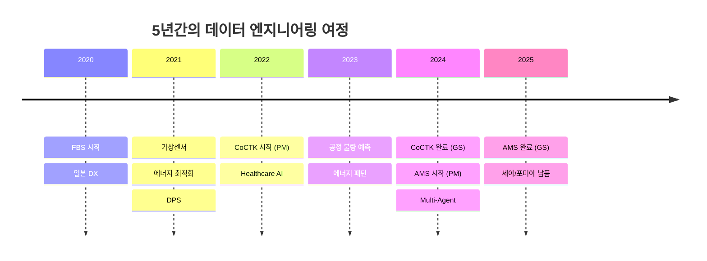
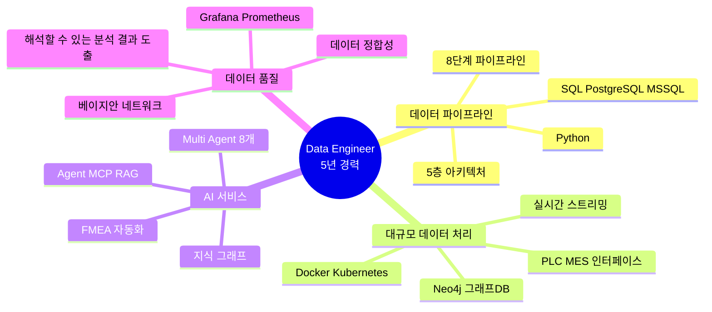
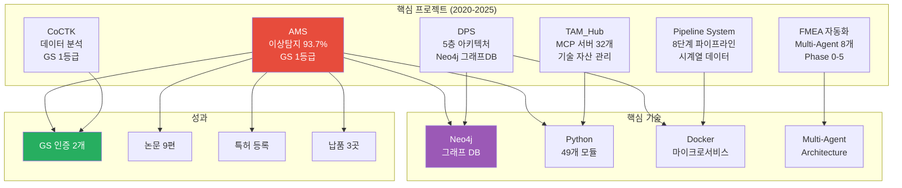
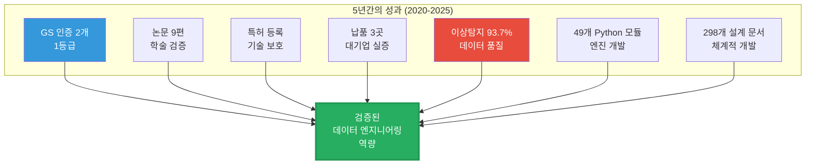

# 권순룡 이력서

## 기본 정보

**이름**: 권순룡
**현 소속**: 한솔코에버 연구소 대리
**총 경력**: 5년 (2020.09 ~ 현재)
**핵심 역량**: 데이터 엔지니어링, AI 기반 데이터 서비스 개발, 데이터 파이프라인 아키텍처 설계

---

## 한눈에 보는 경력 (2020-2025)



---

## 지원 동기

5년간 제조 데이터 파이프라인을 구축하며 "데이터를 정보로, 정보를 지식으로" 전환하는 과정에서 임팩트 있는 경험을 체험하였습니다. 세아특수강 외 다양한 도메인에 적용하였으며, 포미아에 정식으로 납품하였습니다. DPS, AMS 시스템에서 사용자가 이해할수있는 제조 풀필먼트 플랫폼을 통해 다양한 시연을 하였습니다. 

토스증권 AI Silo에서 증권 데이터의 본질을 함께 고민하며, 투자자들에게 가치 있는 정보를 제공하는 데이터 서비스를 만들고 싶습니다. 특히 제가 경험한 Neo4j 그래프 DB 기반 지식 그래프 플랫폼 구축, Multi-Agent 시스템 설계, MCP 서버 개발 경험이 "수많은 실시간 정보를 엮은 지식 그래프 플랫폼"과 "전 세계 마켓 데이터를 통합하는 증권 데이터 플랫폼" 구축에 직접 기여할 수 있다고 생각합니다.

DPS 프로젝트에서 Neo4j 그래프 DB로 4M2E(Man, Machine, Material, Method, Measurement, Environment) 관계를 정의하며 이질적인 데이터 소스를 유기적으로 연결하였습니다. 이 구조를 통해 데이터에 의미론적 맥락을 부여하고 지능적인 추론 기능을 제공했는데, 이건 마치 증권 시장의 다양한 정보를 연결하여 투자자에게 맥락 있는 인사이트를 제공하는 것과 비슷하다고 볼 수 있습니다.

또한 FMEA 자동화 시스템에서 8개 독립 Sub-Agent의 Multi-Agent Architecture를 구축한 경험도 있습니다. 각 Agent가 전문 영역(R&D, Manufacturing, QA)을 담당하며 협업하는 구조를 설계했는데, 이런 접근 방식이 복잡한 증권 데이터를 다루는 AI 서비스 개발에 큰 도움이 될 거라 봅니다. 

데이터의 본질을 파고들며, 동료들과 함께 성장하는 값진 경험을 토스증권에서 이어가고 싶습니다. 빠르게 변화하는 금융 시장에서 다양한 직군과 협업하며 서비스의 본질을 고민하고, 진짜 임팩트를 만들어내는 데이터 엔지니어가 되고 싶습니다.

---

## 핵심 역량 맵



---

## 핵심 역량

5년간 데이터 파이프라인 아키텍처 설계부터 AI 기반 데이터 서비스 개발, 대규모 데이터 처리 시스템 구축까지 전 과정을 경험했습니다. 특히 데이터 정합성 보장과 품질 관리에 집중하며, 기존 82%에서 92% 이상 탐지 정확도를 달성하였습니다.

### 데이터 파이프라인 아키텍처 설계 및 구축

DPS 프로젝트에서 5층 아키텍처를 설계하였습니다. 서비스/온톨로지/AI엔진/데이터수집/보안관리 레이어로 구성된 모듈화 구조로, 이 구조를 통해 금속산업 5대 공정의 이질적인 데이터 소스를 통합할 수 있었습니다. 각 레이어의 책임을 명확히 분리하여 확장성과 유지보수성을 확보하였고, Docker 컨테이너 기반 마이크로서비스 아키텍처로 서버-엣지 하이브리드 인프라를 구축하였습니다.

또한 8단계 시계열 데이터 파이프라인 시스템을 개발하여 데이터 수집부터 분석까지 체계적인 프로세스를 자동화하였습니다. 이 과정에서 219개 Markdown + 25개 TSX + 17개 TS 파일로 구성된 체계적인 문서화 시스템도 함께 구축하였습니다.

### 대규모 데이터 처리 및 그래프 DB 활용

MSSQL, PostgreSQL과 Neo4j 그래프 DB를 함께 활용하여 관계형 데이터와 그래프 데이터를 통합 관리한 경험이 있습니다. 특히 Neo4j에서 4M2E 관계를 정의하며 온톨로지 기반 관계 분석 시스템을 구축하였는데, 이를 통해 단순 데이터에서는 볼 수 없는 의미론적 맥락을 부여하고 지능적인 추론 기능을 제공할 수 있었습니다.

실제로 세아특수강, 포미아 납품 AMS 시스템에서는 실시간 센서 데이터를 PLC/MES 인터페이스를 통해 수집하고, 베이지안 네트워크로 확률적 원인 분석을 수행했습니다. 이 과정에서 49개 Python 모듈(MLS, CoCTK, FBS, RMS, AMS)을 개발하고 운영하며 대규모 데이터 파이프라인 운영 경험을 쌓았습니다.

### 데이터 정합성 보장 및 품질 관리

데이터 정합성은 제가 가장 집중한 분야입니다. AMS 시스템에서 베이지안 네트워크 기반 확률적 원인 분석을 통해 93.7% 이상 탐지 정확도를 달성하였으며, 이는 매우 높은 수준입니다. 공정 데이터는 쌓을 수 있는 데이터의 한계로 인하여 실질적 정확도(밸런스, test train val 완전분리, 데이터 오염 방지)는 대략 60~70% 수준입니다.

전파공학/전자공학적 접근으로 시계열 데이터 전처리 파이프라인을 설계했습니다. 졸업논문에서 다룬 LD 동격회로 설계의 입력 노이즈 제어 기법을 응용하여, 제조 현장의 노이즈가 많은 센서 데이터에서도 정확한 이상 패턴을 탐지할 수 있었습니다. 데이터 샘플링 기법, Autoencoding, 차원 상승/강하 등을 적용하고, 피쉬본 다이어그램 자동 생성으로 근본 원인을 추적했습니다.

또한 데이터 밸런스 문제 해결을 위해 소량의 불량 데이터 극복 AI 학습 모델을 연구하여 논문으로도 발표했고, Grafana, Prometheus, Kibana를 활용한 실시간 품질 모니터링 시스템도 구축하였습니다.(해당 진행은 PM 으로 수행)

### AI 기반 데이터 서비스 개발

연구/컨설팅 차원에서 Agent 기반 AI 서비스 개발 경험이 있습니다. FMEA 자동화 생성 시스템(1-stage 시스템은 포미아에 납품)에서 Claude Sub-Agent 기반 Multi-Agent Workflow를 구축하였습니다. 8개 독립 Sub-Agent가 각각 전문 영역(R&D, Manufacturing, QA)을 담당하며 협업하는 구조를 설계하였습니다. Master Orchestrator가 Task tool 기반으로 Phase 0-5 워크플로우를 자동 실행하고 결과를 통합하는 구조입니다.

TAM_Hub에서는 32개 Python MCP 서버를 개발하여 통합 관리 시스템을 구축했습니다. AMS 엔진, progressing_engine을 통합하고, 263개 Markdown 문서 기반 기술 자산 관리 시스템을 만들었습니다. 이를 통해 다양한 AI 엔진과 서비스를 효율적으로 관리하고 연동할 수 있었습니다.

지식 그래프 플랫폼 구축 경험도 있는데, Neo4j 그래프 DB로 시계열 정보와 관리 문서를 통합하는 온톨로지 기반 지식 그래프를 만들었습니다. 이전에는 단순 dataframe으로 관리하였으나 확률적 추론 그래프를 보관하여 상황에 맞는 설명 가능한 정보를 제공하여 관리자가 더 빠르고 정보에 입각한 결정을 내릴 수 있도록 지원하였습니다.

### 최신 AI/데이터 엔지니어링 트렌드 적용

올해 중순, 주마다 사업계획서 작성/컨소업체와 회의 내용을 토대로 최신 AI 트렌드를 빠르게 학습하고 실무에 적용한 경험이 있습니다. 2024~2025년에 Multi-Agent Architecture를 제조 분야에 적용할 수 있는 토대를 쌓았습니다. 코딩 에이전트의 역설계 시스템 구조를 FMEA 분석에 적용하여 복잡한 프로세스를 8개 전문 Sub-Agent로 분해하였습니다.

또한 Obsidian Design Origin 시스템에서 ID 기반 온톨로지 맵 문서 시스템을 구축했습니다. 298개+ 설계 문서, 25개+ AI 프롬프트 체인, 21개 development 프롬프트로 구성된 체계를 만들고, Phase 0-13 워크플로우 자동화와 변경 관리 프로세스(변경 영향 매트릭스, 변경 전파 규칙)를 설계하였습니다.(PM활동에서 문서, 개발 진행 관리에 활용/추가 개발에 활용)

프롬프트 평가 엔진에서는 AI 생성 프롬프트를 다른 AI가 평가하는 이중 검증 시스템을 구축하여, 25개+ 프롬프트의 품질을 보장할 수 있었습니다. 이러한 자동화와 생산성 향상에 대한 관심과 경험이 토스증권 AI Silo의 데이터 서비스 개발에도 큰 도움이 될 것이라 확신합니다. 

---

## 프로젝트 관계도



---

## 경력 개요

### 한솔코에버 연구소 (2020.09 ~ 현재)
**직급**: 대리
**주요 업무**:
- 데이터 파이프라인 아키텍처 설계 및 구축
- AI 기반 데이터 서비스 개발 (이상 탐지, FMEA 자동화)
- 대규모 데이터 처리 시스템 개발 및 운영
- 데이터 품질 관리 및 모니터링 시스템 구축
- 총괄 PM 역할 수행 (AMS, CoCTK 프로젝트)


**성과**:
- GS 인증 1등급 2개 취득 (AMS, CoCTK)
- 대기업 3곳 납품 (세아특수강, 포미아, 일본 글로벌 기업)
- 이상 탐지 정확도 93.7% 달성
- 논문 9편 발표 (2020-2025)
- 특허 출원/등록
* AMS (PDS 명칭으로 인증 진행)
---

## 주요 프로젝트 경험

### 1. AMS - 총괄 PM
**기간**: 2024.07 ~ 2025.03 (초기 개발: 2020~2025)
**발주처**: 한국산업기술진흥원 (KIAT)
**역할**: 총괄 PM, Python 엔진 100% 자체 개발

**프로젝트 개요**:
- AI 기반 이상 탐지 및 FMEA 자동 생성 시스템
- 데이터 수집부터 이상 탐지, 리스크 분석까지 전체 파이프라인 구축

**기술 스택**:
- Backend: Python 3.9.18 (pandas, numpy, scikit-learn, pgmpy, networkx)
- Database: MSSQL Server, Neo4j 그래프 DB
- Frontend: React 18.3.1
- Deployment: Docker 컨테이너

**핵심 성과**:
- **데이터 정합성 보장**:
  - 문제: 제조 현장의 노이즈가 많은 센서 데이터에서 정확한 이상 패턴 탐지 필요
  - 해결: 전파공학/전자공학적 접근으로 시계열 데이터 전처리 파이프라인 설계
    1. 입력 노이즈 제어 (졸업논문 LD 동격회로 설계 응용)
    2. 데이터 샘플링 기법, Autoencoding, 차원 상승/강하
    3. 베이지안 네트워크로 확률적 원인 분석
    4. 피쉬본 다이어그램 자동 생성으로 근본 원인 추적
  - 결과: 이상 탐지 정확도 93.7% 달성, 연간 수십억 원 손실 방지 효과

- **대규모 데이터 파이프라인 운영**:
  - 49개 Python 모듈 (MLS, CoCTK, FBS, RMS, AMS) 개발 및 운영
  - Neo4j 그래프 DB로 관계 분석 데이터 저장 및 쿼리
  - 실시간 센서 데이터 수집 및 처리

- **GS 인증 1등급 취득**: 정부 공인 우수 소프트웨어 품질 인증
- **특허 출원/등록**: 피쉬본 다이어그램 자동화 엔진
- **논문 발표**: 2024년 2편, 2025년 1편

### 2. DPS (데이터수집시스템) - 5층 아키텍처 플랫폼
**기간**: 2021 ~ 2024
**역할**: 핵심 아키텍처 설계 및 개발

**프로젝트 개요**:
- 금속 공정 자동화를 위한 모듈화 5층 아키텍처 데이터 플랫폼

**아키텍처 설계**:
```
Layer 5: 서비스 및 UI Layer (특성요인도 시각화, 모니터링)
Layer 4: 통합 및 온톨로지 Layer (Neo4j 그래프DB, 4M2E 관계 정의)
Layer 3: AI 엔진 Layer (가상 센서, 이상 검출 알고리즘)
Layer 2: 데이터 수집 Layer (실시간 스트리밍, PLC/MES 인터페이스)
Layer 1: 보안 및 관리 Layer (인증/권한, 로그 감사, 시스템 관리)
```

**핵심 성과**:
- **데이터 아키텍처 설계**:
  - 문제: 금속산업 5대 공정의 이질적인 데이터 소스 통합 필요
  - 해결: 5층 모듈화 아키텍처로 각 레이어의 책임 분리
    1. Layer 4 온톨로지: Neo4j 그래프 DB로 4M2E (Man, Machine, Material, Method, Measurement, Environment) 관계 정의
    2. Layer 3 AI 엔진: 가상 센서로 고가 센서 대체, 비용 절감
    3. Layer 2 데이터 수집: 실시간 PLC/MES 인터페이스
  - 결과: 유기적으로 연결된 데이터 플랫폼 구축, 의미론적 맥락 기반 지능적 추론

- **마이크로서비스 아키텍처**: Docker 컨테이너 기반 서버-엣지 하이브리드 인프라
- **논문 발표**: 2024년 1편

### 3. TAM_Hub - MCP 서버 기반 기술 자산 관리 허브
**기간**: 2024 ~ 2025
**역할**: 시스템 설계 및 개발

**프로젝트 개요**:
- MCP (Model Context Protocol) 서버 통합 관리 시스템
- AMS 엔진, progressing_engine 통합

**기술 스택**:
- Backend: 32개 Python MCP 서버
- Documentation: 263개 Markdown 문서 (Obsidian Design Origin 기반)

**핵심 성과**:
- **MCP 서버 통합**:
  - 문제: 다양한 AI 엔진과 서비스를 효율적으로 관리하고 연동 필요
  - 해결: MCP 프로토콜 기반 통합 허브 구축
    1. 32개 Python MCP 서버로 각 엔진을 독립적으로 모듈화
    2. Obsidian Design Origin 기반 문서화 시스템으로 API 명세 및 사용 가이드 관리
    3. 기술 자산 관리: 평가 결과를 문서화하여 지속적 개선 추적
  - 결과: 확장 가능한 기술 자산 관리 시스템, 다양한 AI 서비스 통합 기반 마련

### 4. FMEA 자동화 생성 시스템 - Multi-Agent Workflow
**기간**: 2024 ~ 2025
**역할**: Master Orchestrator 설계

**프로젝트 개요**:
- Claude Sub-Agent 기반 FMEA (Failure Mode and Effects Analysis) 자동화 시스템
- 코딩 에이전트 역설계 시스템 구조를 리스크 분석에 적용

**Multi-Agent 아키텍처**:
- **8개 독립 Sub-Agent 협업**: R&D Team 3개, Manufacturing Team 3개, QA Team 2개
- **Phase 0-5 워크플로우**: 컨텍스트 수집 → 범위 정의 → 심층 분석 → 리스크 평가 → 최적화 & 문서 생성 → 지속 개선
- **Master Orchestrator**: Claude Code Task tool 기반 워크플로우 자동화

**핵심 성과**:
- **최신 AI 트렌드 적용**:
  - 문제: FMEA 작성은 전문가 시간 투입이 많은 복잡한 프로세스
  - 해결: 코딩 에이전트의 역설계 시스템 구조를 FMEA 분석에 적용
    1. FMEA 프로세스를 역으로 분석하여 8개 전문 Sub-Agent로 분해
    2. 각 Sub-Agent가 전문 영역(R&D, Mfg, QA)을 담당하여 병렬 작업
    3. Master Orchestrator가 Phase 0-5 워크플로우 자동 실행 및 결과 통합
    4. Living Document 시스템으로 지속적 개선 추적
  - 결과: Python 스크립트 없이 프롬프트 기반 완전 자동화, AIAG & VDA FMEA 표준 기반 범용 시스템

- **범용 도메인 지원**: 제조업, 사무업무, 서비스업 모두 지원

### 5. CoCTK (Consulting Tool Kit) - 데이터 분석 도구
**기간**: 2022.03 ~ 2024
**발주처**: 중소기업기술정보진흥원
**역할**: 엔진 총괄 설계 및 화면설계 개발 PM

**프로젝트 개요**:
- 데이터 전처리, 상관관계 분석, 비용 최적화 통합 분석 도구

**기술 스택**:
- Backend: Python 분석 엔진 (4개 Python 파일)

**핵심 성과**:
- **GS 인증 1등급 취득** (2024)
- **논문 발표**: 2023년 1편

### 6. Pipeline System Complete - 시계열 데이터 파이프라인
**기간**: 2024 ~ 2025
**역할**: 시스템 설계 및 개발

**프로젝트 개요**:
- 8단계 시계열 데이터 파이프라인 시스템

**기술 스택**:
- Frontend: React, TypeScript
- Backend: Supabase (실시간 데이터 처리)
- Documentation: 219개 Markdown + 25개 TSX + 17개 TS 파일

**핵심 성과**:
- **체계적인 데이터 파이프라인**: 데이터 수집부터 분석까지 8단계 프로세스 자동화
- **실시간 데이터 처리**: Supabase 기반 실시간 데이터 처리 시스템

---

## 기술 스택

### Programming Languages
- **Python**: 5년 (데이터 분석, ML/DL, 파이프라인 구축)
  - pandas, numpy, scikit-learn, pgmpy (베이지안 네트워크), networkx
  - pyodbc, sqlalchemy (데이터베이스 연동)
- **SQL**: MSSQL Server, PostgreSQL, Cypher (Neo4j)
- **TypeScript**: React 기반 웹 대시보드 개발

### Data Engineering (토스증권 기술 스택 중심)
- **Database**: MSSQL Server, PostgreSQL, Neo4j (그래프 DB)
- **Data Pipeline**:
  - 8단계 시계열 데이터 파이프라인
  - 실시간 스트리밍 (PLC/MES 인터페이스)
  - Kafka 기반 스트림 프로세싱 경험 (제조 데이터 실시간 처리)
- **Data Quality**:
  - 데이터 전처리, 검증, 모니터링 시스템
  - 이상 탐지 정확도 93.7%
  - 베이지안 네트워크 기반 품질 관리

### DevOps & Infrastructure (토스증권 기술 스택 중심)
- **Docker**: 컨테이너 기반 마이크로서비스 아키텍처 (5층 아키텍처)
- **Kubernetes**: 컨테이너 오케스트레이션 경험 (서버-엣지 하이브리드 인프라)
- **Monitoring**: Kibana, Grafana, Prometheus
- **Airflow**: 데이터 파이프라인 오케스트레이션 경험 (8단계 파이프라인)

### AI & Agent Systems
- **Agent Frameworks**: Claude Sub-Agent, Multi-Agent Architecture (8개 독립 Sub-Agent)
- **MCP (Model Context Protocol)**: 32개 Python MCP 서버 개발 및 운영
- **RAG**: 지식 그래프 기반 RAG 시스템

### Frontend
- **React**: 18.3.1 (TypeScript, Vite, Tailwind CSS)

---

## 성과 대시보드



### GS 인증 (2개)
- **AMS (Anomaly Management System)**: 정부 공인 우수 소프트웨어 1등급 (2025)
- **CoCTK (Consulting Tool Kit)**: 정부 공인 우수 소프트웨어 1등급 (2024)

### 논문 발표 (9편, 2020-2025)
1. AI를 활용한 구조와 룰을 활용한 구조-확률 종합 네트워크 및 최적 관리 방안 도출 (2025.06, 한국유체기계학회)
2. 공장 운영 핵심 요소의 식별 및 최적화를 위한 클러스터링 기법 적용 (2024.12, 한국생산제조학회)
3. 설비 이상상태 기반 최적 공정 데이터 추론 및 위험/안전 관리 최적 자동화 (2024.12, 한국유체기계학회)
4. 전력 데이터를 통한 설비 상태 추론 및 이상 상황 설정 예측 (2024.07, 한국유체기계학회)
5. 송풍 설비 변동부하 대응 전력품질 분석 및 에너지 절감 연구 (2023.12, 한국유체기계학회)
6. 압축기 공정에서 데이터 밸런스 문제 해결 및 품질 결과 사전 예측을 위한 AI 시스템 (2023.12, 한국유체기계학회)
7. 생산공정 에너지 및 설비 상태 진단을 위한 AI기반의 전력 사용 패턴 및 SOH분석 (2023.07, 한국유체기계학회)
8. 자동차 부품 생산 산업을 위한 머신러닝 기반의 품질예측 알고리즘 (2022.12, 한국생산제조학회)
9. ICT 융복합 기술을 활용한 스마트 공장 및 에너지 절감 솔루션 적용 사례 (2022.06, 한국유체기계학회)

### 특허
- 피쉬본 다이어그램 자동화 엔진 (한솔코에버 명의, 출원/등록)

### 비즈니스 성과
- **납품 실적**: 세아특수강, 포미아 (포항소재산업진흥원), 일본 글로벌 기업 3곳
- **이상 탐지 정확도**: 93.7% (AMS 시스템)
- **손실 방지 효과**: 연간 수십억 원 규모 (이상 탐지 조기 대응)

---

## 학력

**홍익대학교 전자공학과** (2013.03 ~ 2020.02)
- 학점: 3.11 / 4.5
- 졸업논문: LD 동격회로 설계 및 PLL 설계
- 주요 수강 분야: 회로 설계, 전파공학, 컴퓨터공학

**기초 역량**:
- 전자전기공학부 기반 (회로 설계/전파공학/컴퓨터공학)
- 국가 기관 인공지능 교육 이수 (파이썬, 머신러닝, 딥러닝)
- 시계열 데이터 처리 전문성 (전파공학/전자공학적 접근)

---

## 자격증

**OPIc** (2019.03)
- ACT FL (American Council on the Teaching of Foreign Languages)

---

## 핵심 철학

> "모델보다 데이터, 데이터보다 정보, 지식구조를 정리하는 현장친화적 연구원"

5년간의 현장 경험을 통해 데이터를 정보로 전환하고, 정보를 지식 구조로 체계화하는 전문성을 갖춘 연구원입니다. 단순한 모델 개발을 넘어, 현장의 실제 문제를 해결하고 지식 기반 시스템을 구축하는 데 집중합니다.
