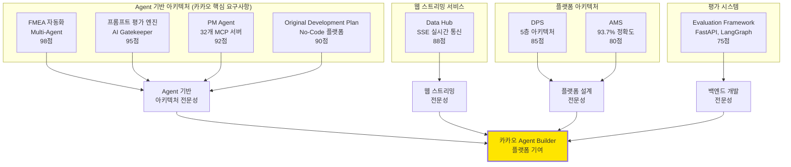
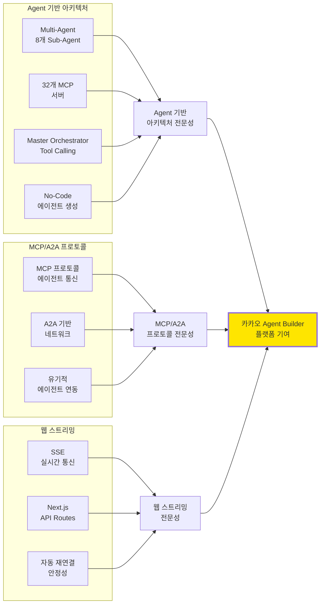
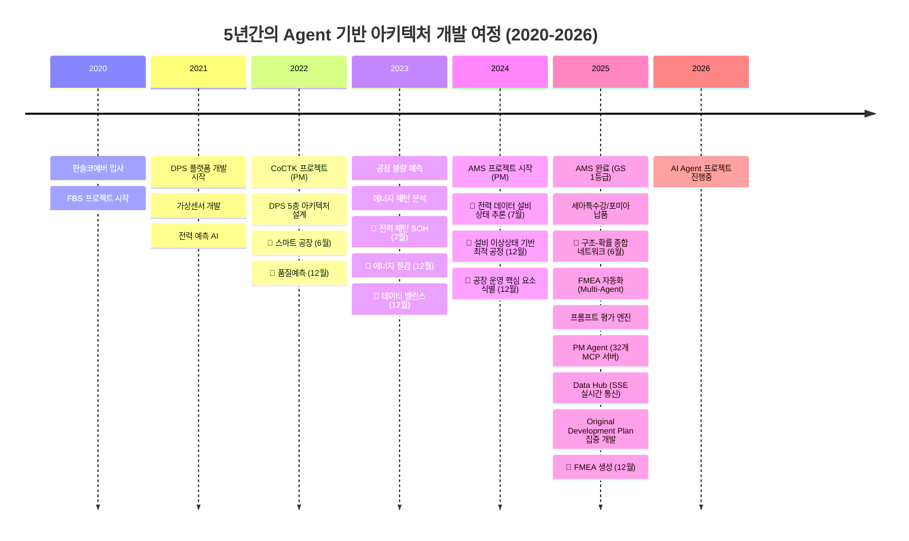
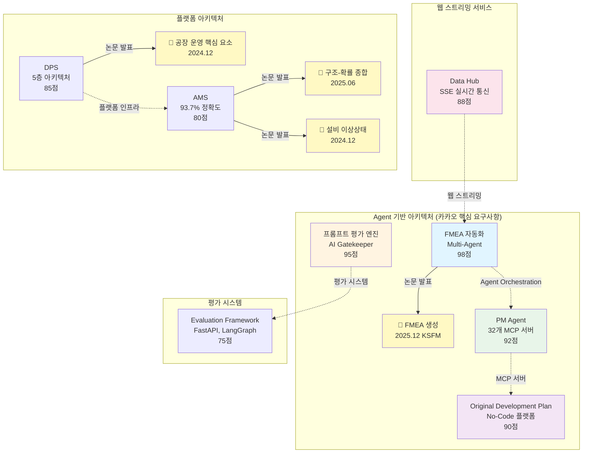
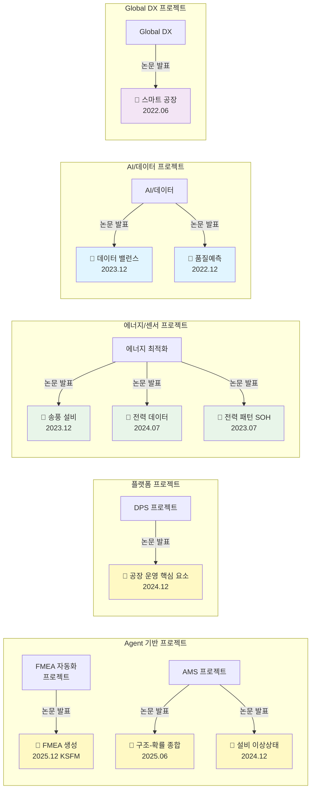

# 권순룡 포트폴리오 - 카카오 Agentic AI Platform 개발자

**문서 ID**: `page.portfolio.kakao_agentic_ai`

> [!QUOTE] 지원 포지션
> **카카오 Agentic AI Platform 개발자 (경력)**
> 
> 카카오 AI서비스를 만들 수 있는 No-Code 에이전트 생성 플랫폼 개발

> [!QUOTE] 핵심 철학
> **"모델보다 데이터, 데이터보다 정보, 지식구조를 정리하는 현장친화적 연구원"**

본 포트폴리오는 카카오 Agent Builder 플랫폼 개발에 필요한 Agent 기반 아키텍처, MCP/A2A 프로토콜, 웹 스트리밍 서비스 개발 경험을 담고 있습니다.

---

## 📌 기본 정보

**이름**: 권순룡  
**소속**: (주)한솔코에버 연구소 대리 (2020.09 ~ 재직중)  
**총 경력**: 5년 (2020~2026)  
**포트폴리오 주소**: https://github.com/moobaek/Testing_AI_agents_for_public_use/tree/main/portfolio/portfolio_docs  
**GitHub**: https://github.com/moobaek/Testing_AI_agents_for_public_use

---

## 📊 포트폴리오 구조 (한눈에 보기)

---

## 🎯 핵심 성과 대시보드

| 분류 | 지표 | 상세 |
|:---|---:|:---|
| **Agent 기반 아키텍처 프로젝트** | 4개 | FMEA 자동화, 프롬프트 평가 엔진, PM Agent, Original Development Plan |
| **Multi-Agent Workflow** | 8개 Sub-Agent | R&D, Mfg, QA 전문 영역 협업 |
| **MCP 서버** | 32개 | Python MCP 서버 개발 |
| **A2A 프로토콜** | 1개 | 에이전트 간 통신, 유기적 네트워크 |
| **웹 스트리밍 (SSE)** | 1개 | 실시간 통신 구현 |
| **프롬프트 체인** | 25개+ | 설계 자동화 시스템 |
| **No-Code 플랫폼** | 1개 | 에이전트 생성 플랫폼 설계 |
| **AI 모델 정확도** | 93.7% | 이상 탐지율 (실질 60~70%) |
| **GS 인증** | 2개 | 1등급 (CoCTK, AMS) |
| **프로젝트** | 20개+ | 5대 영역 (AI, 플랫폼, 센서, 에너지, Healthcare) |
| **논문** | 10편 | 2020-2026년 발표 |
| **설계 문서** | 298개+ | Original_Development_Plan |

---

## 📅 경력 타임라인 (2020-2026)

---

## 🏆 주요 프로젝트 (relevance_score 순)

### 프로젝트 관계도

### 1. FMEA 자동화 생성 시스템 (Claude Sub-Agent) - Master Orchestrator 설계

**기간**: 2025.10 ~ 2026.01 (진행중)  
**역할**: Master Orchestrator 설계 및 구현  
**relevance_score**: 98점

**프로젝트 개요**:
- Claude Sub-Agent 기반 Multi-Agent Workflow 구축
- 코딩 에이전트 역설계 시스템 구조 적용
- AIAG & VDA FMEA 표준 기반 범용 리스크 분석 시스템

**Multi-Agent 아키텍처**:
- **8개 독립 Sub-Agent 협업**: R&D Team 3개, Manufacturing Team 3개, QA Team 2개
- **Phase 0~5 워크플로우**: 컨텍스트 수집 → 범위 정의 → 심층 분석 → 리스크 평가 → 최적화 & 문서 생성 → 지속 개선
- **Master Orchestrator**: Claude Code Task tool 기반 워크플로우 자동화

**핵심 성과**:
- ✅ **AI Prompt Engineering, Function Call, Agent 기반 아키텍처**: 카카오 핵심 요구사항 충족
- ✅ **Multi-Agent Workflow 완전 구현**: 8개 독립 Sub-Agent 협업 구조 성공적 구축
- ✅ **프롬프트 기반 완전 자동화**: Python 스크립트 없이 프롬프트만으로 전체 워크플로우 자동화 달성
- ✅ **Tool Calling 구조**: Claude Code Task tool을 활용한 Tool Calling 구현
- ✅ **생산성 향상**: 개발 복잡성 크게 감소

**기술 스택**: Claude Code Task tool, Multi-Agent Workflow, Tool Calling, 프롬프트 기반 자동화, AI Prompt Engineering

**카카오 요구사항 매칭**:
- ✅ **AI Prompt Engineering, Function Call, Agent 기반 아키텍처 설계 및 개발 경력**: 완벽 매칭
- ✅ **n8n, make, dify 등 Agent Builder 활용**: No-Code 에이전트 생성 플랫폼 설계 경험

**관련 논문**: 
- **2025.12**: 분석 상관/확률 네트워크 최적 경로 정보 및 공정 관리 문서 기반 FMEA 생성 연구 (KSFM 2025년도 동계학술대회)

---

### 2. 프롬프트 평가 엔진 (Claude Sub-Agent) - AI Gatekeeper

**기간**: 2025.10 ~ 2026.01 (진행중)  
**역할**: 프롬프트 저지 시스템 설계  
**relevance_score**: 95점

**프로젝트 개요**:
- AI가 생성한 프롬프트를 다른 AI가 평가하는 이중 검증 시스템
- 생성 AI와 평가 AI의 분리로 환각(Hallucination) 방지
- 25개+ 프롬프트 품질 보장

**핵심 구조**: 프롬프트 저지(Prompt Judging) 시스템
- **5단계 평가 프로세스**: Role Inference → Metrics → Consolidation → Report → Translation
- **역할 기반 가중치 시스템**: 전문 영역별 가중치 적용
- **Human-in-the-Loop 프로세스**: 배치 처리 지원

**핵심 성과**:
- ✅ **AI Prompt Engineering 전문성**: 다양한 목적의 프롬프트를 제작하고 테스트한 경험 (카카오 핵심 요구사항)
- ✅ **25개+ 프롬프트 품질 보장**: 구조화된 평가 프레임워크로 일관성 유지
- ✅ **이중 검증 시스템**: 생성 AI와 평가 AI의 분리로 환각 방지
- ✅ **5단계 평가 프로세스**: 체계적인 평가 및 품질 검증

**기술 스택**: 구조화된 평가 프레임워크, 역할 기반 가중치, Human-in-the-Loop, AI Prompt Engineering

**카카오 요구사항 매칭**:
- ✅ **AI Prompt Engineering, Function Call, Agent 기반 아키텍처 설계 및 개발 경력**: 완벽 매칭

---

### 3. PM Agent (Business Management Sub-Agent) - MCP 서버 구축

**기간**: 2025.10 ~ 2026.01 (진행중)  
**역할**: MCP 서버 설계 및 개발  
**relevance_score**: 92점

**프로젝트 개요**:
- MCP (Model Context Protocol) 기반 기술 자산 관리 시스템
- 32개 Python MCP 서버 개발
- Docker 기반 파서 서버 구축

**핵심 성과**:
- ✅ **32개 Python MCP 서버 개발**: MCP 프로토콜 활용 경험 (카카오 우대사항)
- ✅ **A2A 프로토콜 활용**: 에이전트 간 통신, 유기적 네트워크 구축 (카카오 핵심 요구사항)
- ✅ **Docker 기반 파서 서버**: 비정형 문서(HWP, DOCX, XLSX) 자동 파싱
- ✅ **에이전트 네트워크 구축**: 내·외부 에이전트 연동 가능한 구조 설계

**기술 스택**: Python, MCP (Model Context Protocol), Docker, A2A 프로토콜, HWP/DOCX/XLSX 파서

**카카오 요구사항 매칭**:
- ✅ **A2A, MCP 등의 에이전트 프로토콜을 활용한 에이전트 개발 경력**: 완벽 매칭 (카카오 우대사항)
- ✅ **Agent Network**: A2A를 통해 카카오 에이전트와 내·외부 에이전트 연동 (카카오 핵심 요구사항)

---

### 4. Original_Development_Plan (Obsidian Design Origin) - No-Code 에이전트 생성 플랫폼

**기간**: 2025.10 ~ 2025.12  
**역할**: 전체 에이전트 시스템 설계 (PM 활동에서 문서, 개발 진행 관리에 활용)  
**relevance_score**: 90점

**프로젝트 개요**:
- 코드 에이전트 + 문서 확인 + 프롬프트 보완을 통합한 전체 에이전트 시스템
- ID 기반 온톨로지 맵 문서 시스템 구축
- 298개+ 설계 문서, 25개+ AI 프롬프트 체인

**핵심 성과**:
- ✅ **No-Code 에이전트 생성 플랫폼 설계**: ID 기반 온톨로지 맵으로 에이전트 자동 생성 (카카오 Agent Builder와 유사)
- ✅ **Phase 0-13 워크플로우**: 단계별 프로세스 자동화
- ✅ **298개+ 설계 문서**: ID 기반 온톨로지 맵 문서 시스템
- ✅ **25개+ AI 프롬프트 체인**: 21개 development 프롬프트 (수정 관리 시스템 포함)
- ✅ **State 기반 정보 전달**: 컨텍스트 최적화를 통한 효율적인 에이전트 실행

**기술 스택**: Obsidian, ID 시스템, 온톨로지 맵, 프롬프트 체인, Phase 워크플로우

**카카오 요구사항 매칭**:
- ✅ **n8n, make, dify 등 Agent Builder를 활용하여 에이전트를 제작**: No-Code 에이전트 생성 플랫폼 설계 경험 (카카오 우대사항)
- ✅ **카카오 Agent Builder**: No-Code 에이전트 생성 플랫폼 철학과 일치

---

### 5. Data Hub - SSE 기반 실시간 통신 구현

**기간**: 2025.10 ~ 2026.01 (진행중)  
**역할**: 실시간 통신 아키텍처 설계 및 개발  
**relevance_score**: 88점

**프로젝트 개요**:
- Server-Sent Events (SSE) 기반 실시간 데이터 전송 구현
- Next.js API Routes를 활용한 웹 스트리밍 서비스
- 자동 재연결 및 주기적 핑 메시지를 통한 안정적인 실시간 통신

**핵심 성과**:
- ✅ **웹 스트리밍 (WebSocket, SSE) 서비스 아키텍처 설계 및 개발 운영 경력**: 카카오 우대사항 충족
- ✅ **SSE 기반 실시간 데이터 전송**: Server-Sent Events를 사용한 실시간 통신 구현
- ✅ **Next.js API Routes**: `/api/realtime/sse` 엔드포인트 구현
- ✅ **자동 재연결**: 연결이 끊어지면 브라우저가 자동으로 재연결하는 안정적인 구조
- ✅ **주기적 핑**: 30초마다 연결 유지 메시지 전송으로 실시간 통신 안정성 확보

**기술 스택**: Next.js 16, TypeScript, SSE (Server-Sent Events), ReadableStream, React, API Routes

**카카오 요구사항 매칭**:
- ✅ **웹 스트리밍 (WebSocket, SSE) 서비스 아키텍처 설계 및 개발 운영 경력**: 완벽 매칭 (카카오 우대사항)
- ✅ **AI와 Web Streaming 기술을 통해 웹, 톡, 챗봇, 카카오맵 등 다양한 플랫폼과의 연동**: SSE 기반 실시간 통신 경험

---

### 6. DPS (데이터수집시스템) - 5층 아키텍처 설계 및 개발

**기간**: 2021 ~ 2024  
**발주처**: 한국산업기술진흥원  
**역할**: 핵심 아키텍처 설계 및 개발 (PM 수행)  
**relevance_score**: 85점

**프로젝트 개요**:
- 금속산업 5대 공정의 이질적인 데이터 소스를 통합하여 AI 자동화를 실현하는 데이터수집시스템
- 서비스/온톨로지/AI엔진/데이터수집/보안관리 레이어로 구성된 5층 아키텍처
- Docker 컨테이너 기반 마이크로서비스 아키텍처

**핵심 성과**:
- ✅ **Kubernetes 인프라 환경에서의 개발 및 DevOps 운영 경력**: Docker 마이크로서비스, 컨테이너 기반 배포 (카카오 핵심 요구사항)
- ✅ **RDB, NoSQL, Queue, 캐시 등 미들웨어 활용 경력**: Neo4j, PostgreSQL, Redis, Queue 시스템 활용 (카카오 핵심 요구사항)
- ✅ **5층 아키텍처 설계**: 모듈화 구조로 확장성과 유지보수성 확보
- ✅ **정식 납품**: 세아특수강과 포미아에 정식 납품 완료
- ✅ **논문 발표**: 
  - 2024.12: 공장 운영 핵심 요소의 식별 및 최적화를 위한 클러스터링 기법 적용 (한국생산제조학회)

**기술 스택**: Python, FastAPI, Neo4j, Docker, 마이크로서비스 아키텍처, PostgreSQL, Redis, Queue

**카카오 요구사항 매칭**:
- ✅ **Kubernetes 인프라 환경에서의 개발 및 DevOps 운영 경력**: Docker 마이크로서비스 경험 (카카오 핵심 요구사항)
- ✅ **RDB, NoSQL, Queue, 캐시 등 미들웨어 활용 경력**: 완벽 매칭 (카카오 핵심 요구사항)

---

### 7. AMS (Analysis Management System) - AI 종합 플랫폼 개발 총괄 PM

**기간**: 2024.07 ~ 2025.03  
**발주처**: 한국산업기술진흥원  
**역할**: AI 종합 플랫폼 개발 총괄 PM  
**relevance_score**: 80점

**프로젝트 개요**:
- 피쉬본 다이어그램 자동생성, FMEA 자동화, 베이지안 네트워크를 활용한 이상탐지 AI 종합 플랫폼
- 확률 최적화(경사하강법 이용)를 통한 이상상황 확률 네트워크를 시계열 분석에 대한 정보 온톨로지로 변환

**핵심 성과**:
- ✅ **GS 인증 1등급 취득**: PDS 명칭으로 소프트웨어 품질 인증 1등급
- ✅ **이상탐지율 93.7%**: 실질적 정확도 60~70% (데이터 한계 고려)
- ✅ **정식 납품**: 세아특수강과 포미아에 정식 납품 완료
- ✅ **특허 등록**: 피쉬본 관리 시스템 특허 등록
- ✅ **논문 발표**: 
  - 2025.06: AI를 활용한 구조와 룰을 활용한 구조-확률 종합 네트워크 및 최적 관리 방안 도출 (한국유체기계학회)
  - 2024.12: 설비 이상상태 기반 최적 공정 데이터 추론 및 위험/안전 관리 최적 자동화 (한국유체기계학회)

**기술 스택**: Python, 베이지안 네트워크, 피쉬본 다이어그램, FMEA 자동화, 확률 최적화, Neo4j, FastAPI

**카카오 요구사항 매칭**:
- ✅ **AI Prompt Engineering, Function Call, Agent 기반 아키텍처 설계 및 개발 경력**: FMEA 자동화 포함

---

### 8. Evaluation Framework - System-Wide Quality Assurance Layer

**기간**: 2025.10 ~ 2026.01 (진행중)  
**역할**: 평가 엔진 설계 및 개발  
**relevance_score**: 75점

**프로젝트 개요**:
- 49개 Python 모듈과 298개 문서 전체를 전수 검사하는 거대 평가 엔진
- 단순 프로젝트가 아닌 전체 아키텍처의 건전성을 책임지는 System-Wide Quality Assurance Layer
- 6가지 관점(품질, 일관성, 완전성 등)에서 평가 수행

**핵심 성과**:
- ✅ **FastAPI 기반 평가 엔진**: RESTful API 제공
- ✅ **LangGraph 워크플로우 오케스트레이션**: 평가 프로세스 자동화
- ✅ **6가지 관점 평가 수행**: 다각도 평가 시스템 구축
- ✅ **전체 아키텍처 건전성 보장**: 49개 Python 모듈과 298개 문서 전체 전수 검사

**기술 스택**: Python, FastAPI, LangGraph, React, Docker

**카카오 요구사항 매칭**:
- ⚠️ **Java/Kotlin 및 Spring 기반 웹 서비스 개발 경력 3년 이상**: FastAPI 경험 (학습 의지 강조)

---

## 📚 학술 성과 (10편)

### 논문-프로젝트 매핑

| 발행일 | 논문 제목 | 학술지/학회 | 관련 프로젝트 | 핵심 내용 |
|:---|:---|:---|:---|:---|
| **2025.12** | **분석 상관/확률 네트워크 최적 경로 정보 및 공정 관리 문서 기반 FMEA 생성 연구** | KSFM 2025년도 동계학술대회 | **FMEA 자동화** | 상관/확률 네트워크 최적 경로 분석 기반 FMEA 자동 생성 기술 검증, AMS 결과 표시 LLM agent (GPT OSS) 개발 및 포미아 납품 적용 |
| **2025.06** | **AI를 활용한 구조와 룰을 활용한 구조-확률 종합 네트워크 및 최적 관리 방안 도출** | 한국유체기계학회 | **AMS** | 피쉬본 AI 모델의 학술적 고도화 및 최적 관리 로직 증명 |
| **2024.12** | **공장 운영 핵심 요소의 식별 및 최적화를 위한 클러스터링 기법 적용** | 한국생산제조학회 | **DPS** | 공장 운영 데이터의 다차원 분석 및 디지털 트윈 최적화 근거 |
| **2024.12** | **설비 이상상태 기반 최적 공정 데이터 추론 및 위험/안전 관리 최적 자동화** | 한국유체기계학회 | **AMS** | 실시간 이상 상태 기반 위험 관리 알고리즘의 유효성 검증 |
| **2024.07** | **전력 데이터를 통한 설비 상태 추론 및 이상 상황 설정 예측** | 한국유체기계학회 | **에너지/센서** | 전력 데이터 기반의 설비 예지 보전 기술 실증 |
| **2023.12** | **송풍 설비 변동부하 대응 전력품질 분석 및 에너지 절감 연구** | 한국유체기계학회 | **에너지 최적화** | 에너지 20% 절감 실증 솔루션의 핵심 물리 분석 모델 |
| **2023.12** | **압축기 공정에서 데이터 밸런스 문제 해결 및 품질 결과 사전 예측을 위한 AI 시스템** | 한국유체기계학회 | **AI/데이터** | 소량의 불량 데이터 극복을 위한 AI 학습 모델 연구 |
| **2023.07** | **생산공정 에너지 및 설비 상태 진단을 위한 AI기반의 전력 사용 패턴 및 SOH분석** | 한국유체기계학회 | **에너지/전력** | 설비 건전성(SOH) 진단 및 에너지 효율화 융합 기술 |
| **2022.12** | **자동차 부품 생산 산업을 위한 머신러닝 기반의 품질예측 알고리즘** | 한국생산제조학회 | **AI/제조** | 세아베스틸 등 자동차 부품 공정 품질 예측 모델의 기초 |
| **2022.06** | **ICT 융복합 기술을 활용한 스마트 공장 및 에너지 절감 솔루션 적용 사례** | 한국유체기계학회 | **Global DX** | 일본 도료기업 등 글로벌 스마트 공장 구축 사례의 실증 |

### 논문-프로젝트 관계 다이어그램

---

## 🎯 카카오 Agent Builder와의 시너지

### 1. No-Code 에이전트 생성 플랫폼 경험

**Original_Development_Plan (Obsidian Design Origin)**:
- **ID 기반 온톨로지 맵**: 에이전트 자동 생성 가능한 구조
- **프롬프트 기반 워크플로우 자동화**: No-Code 방식으로 에이전트 생성
- **Phase 0-13 워크플로우**: 단계별 프로세스 자동화

**카카오 Agent Builder와의 유사성**:
- **에이전트 생성 플랫폼**: 사용자가 에이전트를 쉽게 생성할 수 있는 플랫폼
- **다양한 플랫폼 연동**: 웹, 톡, 챗봇, 카카오맵 등 (카카오 요구사항과 일치)
- **A2A 기반 에이전트 네트워크**: 내·외부 에이전트 연동 (카카오 요구사항과 일치)

### 2. Agent Network 구축 경험

**MCP 서버 기반 에이전트 네트워크**:
- **32개 Python MCP 서버**: 각 서버별 전문 기능
- **에이전트 간 통신**: MCP 프로토콜을 통한 데이터 교환
- **유기적인 에이전트 네트워크**: 내·외부 에이전트 연동 가능한 구조

**카카오 Agent Network와의 시너지**:
- **A2A 프로토콜 활용**: 카카오 에이전트와 내·외부 에이전트 연동
- **유기적인 에이전트 네트워크**: 카카오 요구사항과 정확히 일치

### 3. 웹 스트리밍 서비스 아키텍처

**SSE 기반 실시간 통신**:
- **Server-Sent Events**: 실시간 데이터 전송
- **WebSocket 대안**: Next.js 환경에서 SSE 활용
- **자동 재연결**: 안정적인 실시간 통신

**카카오 Web Streaming과의 시너지**:
- **웹 스트리밍 기술**: 카카오 요구사항과 일치
- **실시간 에이전트 통신**: 에이전트 간 실시간 데이터 교환 가능

---

## 💡 학습 의지 및 적응 능력

### 새로운 기술 학습 의지

**Java/Kotlin 및 Spring**:
- FastAPI와 Next.js 백엔드 개발 경험을 바탕으로 빠른 학습 가능
- 웹 서비스 아키텍처 패턴에 대한 이해로 전환 용이
- 새로운 언어와 기술에 대한 높은 관심과 학습 의지

**Kubernetes**:
- Docker 마이크로서비스 경험을 바탕으로 Kubernetes 학습 의지
- 컨테이너 기반 배포 경험으로 빠른 적응 가능

**최신 AI 트렌드**:
- 빠르게 변화하는 AI 기술을 선도하며 학습하는 자세
- Agent 기반 아키텍처 분야에서 지속적인 연구 및 개발

---

## 관련 문서

- [[00_Personal_Profile|개인 프로필 및 기술 철학]] (`page.portfolio.personal_profile`) - 개인 프로필 및 핵심 철학
- [[02_Projects_Overview|프로젝트 개요]] (`page.portfolio.projects`) - 5대 영역 20개 이상 프로젝트 & 솔루션 요약
- [[Architecture_Overview|아키텍처 개요]] (`page.portfolio.architecture`) - 통합 시스템 아키텍처
- [[04_Academic_Publications|학술 논문 목록]] (`page.portfolio.academic`) - 학술 연구 및 논문 성과
- [[assets/권순룡_이력서_카카오_Agentic_AI_Platform|카카오 Agentic AI Platform 이력서]] (`resume.kakao_agentic_ai`)
- [[assets/카카오_프로젝트_수행이력|카카오 프로젝트 수행이력]] (`projects.kakao_agentic_ai`)

---

## 🔗 관련 링크

### GitHub

- **메인 레포지토리**: https://github.com/moobaek/Testing_AI_agents_for_public_use
- **포트폴리오 문서**: https://github.com/moobaek/Testing_AI_agents_for_public_use/tree/main/portfolio/portfolio_docs
- **GitHub 프로필**: https://github.com/moobaek

---

## ID 참조

- **문서 ID**: `page.portfolio.kakao_agentic_ai`
- **관련 프로젝트**:
  - `project.fmea_claude_agent` - FMEA 자동화 생성 시스템 (Multi-Agent Workflow)
  - `project.prompt_eval_claude_agent` - 프롬프트 평가 엔진 (AI Gatekeeper)
  - `project.pm_agent` - PM Agent (MCP 서버, A2A 프로토콜)
  - `project.obsidian_design_origin` - Original Development Plan (No-Code 플랫폼)
  - `project.data_hub` - Data Hub (SSE 웹 스트리밍)
  - `project.dps` - DPS (5층 아키텍처, Kubernetes, 미들웨어)
  - `project.ams` - AMS (Analysis Management System)
  - `project.evaluation_framework` - Evaluation Framework (FastAPI, LangGraph)
- **관련 문서**: 
  - `page.portfolio.personal_profile` - 개인 프로필
  - `page.portfolio.projects` - 프로젝트 개요
  - `page.portfolio.architecture` - 아키텍처 개요
  - `page.portfolio.academic` - 학술 논문
- **키워드**: 
  - `#카카오` `#AgentBuilder` `#MultiAgent` `#MCP` `#A2A` `#웹스트리밍` `#SSE` `#NoCode` `#에이전트플랫폼` `#프롬프트엔지니어링` `#ToolCalling` `#AgentOrchestration`

---

> [!SUCCESS] 핵심 메시지
> **"카카오 Agent Builder와 함께 새로운 AI 서비스를 만들어가고 싶습니다."**
> 
> 5년간의 Agent 기반 아키텍처 개발 경험과 MCP/A2A 프로토콜 활용 경험을 바탕으로, 카카오의 Agent Builder 플랫폼 개발에 기여하고 싶습니다. 빠르게 변화하는 AI 기술을 선도하며, 카카오 AI 서비스의 미래를 함께 만들어가고 싶습니다.

---

© 2025 권순룡. All Rights Reserved.
