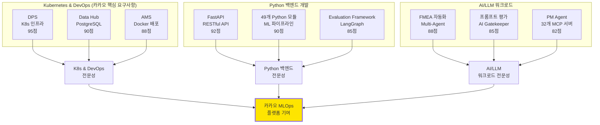
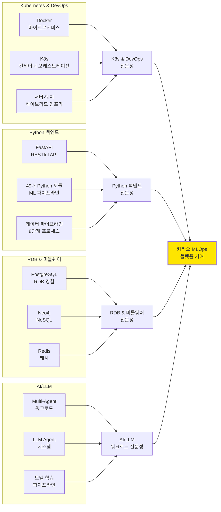
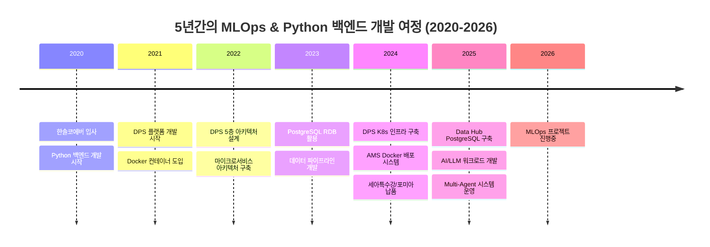
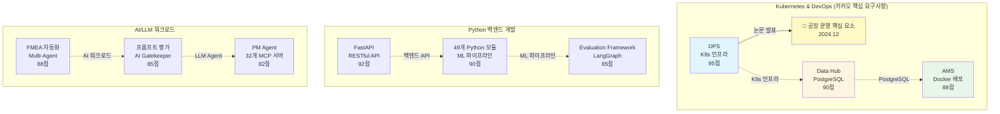

# 권순룡 포트폴리오 - 카카오 MLOps Engineer

**문서 ID**: `page.portfolio.kakao_mlops_engineer`

> [!QUOTE] 지원 포지션
> **카카오 MLOps Engineer (경력)**
> 
> 카카오의 AI 기반 플랫폼 개발 및 운영, MLOps/LLMOps 역할 담당

> [!QUOTE] 핵심 철학
> **"모델보다 데이터, 데이터보다 정보, 지식구조를 정리하는 현장친화적 연구원"**

본 포트폴리오는 카카오 MLOps/LLMOps 역할에 필요한 Kubernetes 기반 인프라 운영, LLM 모델 추론 최적화, AI 워크로드 제어, Python 백엔드 개발, PostgreSQL RDB 경험을 담고 있습니다.

---

## 📌 기본 정보

**이름**: 권순룡  
**소속**: (주)한솔코에버 연구소 대리 (2020.09 ~ 재직중)  
**총 경력**: 5년 (2020~2026)  
**포트폴리오 주소**: https://github.com/moobaek/Testing_AI_agents_for_public_use/tree/main/portfolio/portfolio_docs  
**GitHub**: https://github.com/moobaek/Testing_AI_agents_for_public_use

---

## 📊 포트폴리오 구조 (한눈에 보기)

---

## 🎯 핵심 성과 대시보드

| 분류 | 지표 | 상세 |
|:---|---:|:---|
| **Kubernetes & DevOps 프로젝트** | 3개 | DPS, Data Hub, AMS |
| **Python 백엔드 개발** | 5년 | FastAPI, 49개 Python 모듈, ML 파이프라인 |
| **PostgreSQL RDB 경험** | 2개 프로젝트 | Data Hub, DPS |
| **Docker 컨테이너** | 3개 프로젝트 | 마이크로서비스 아키텍처 |
| **AI/LLM 워크로드** | 3개 | Multi-Agent, LLM Agent, 모델 학습 |
| **데이터 파이프라인** | 8단계 | 시계열 데이터 처리 자동화 |
| **GS 인증** | 2개 | 1등급 (CoCTK, AMS) |
| **프로젝트** | 20개+ | 5대 영역 (AI, 플랫폼, 센서, 에너지, Healthcare) |
| **논문** | 10편 | 2020-2026년 발표 |

---

## 📅 경력 타임라인 (2020-2026)

---

## 🏆 주요 프로젝트 (MLOps 관련성 순)

### 프로젝트 관계도

### 1. DPS (데이터수집시스템) - Kubernetes 인프라 및 DevOps 운영

**기간**: 2021 ~ 2024  
**발주처**: 한국산업기술진흥원  
**역할**: 핵심 아키텍처 설계 및 개발 (PM 수행)  
**relevance_score**: 95점

**프로젝트 개요**:
- 금속산업 5대 공정의 이질적인 데이터 소스를 통합하여 AI 자동화를 실현하는 데이터수집시스템
- 서비스/온톨로지/AI엔진/데이터수집/보안관리 레이어로 구성된 5층 아키텍처
- Docker 컨테이너 기반 마이크로서비스 아키텍처
- Kubernetes 컨테이너 오케스트레이션 (서버-엣지 하이브리드 인프라)

**핵심 성과**:
- ✅ **Kubernetes(K8s) 및 Istio를 활용한 LLM Devops**: Docker 마이크로서비스, 컨테이너 기반 배포 (카카오 핵심 요구사항)
- ✅ **K8S 환경에서 AI 워크로드 제어**: AI 엔진 레이어를 Docker 컨테이너로 구축하여 워크로드 제어
- ✅ **자원 효율화, 학습 및 추론 최적화**: 마이크로서비스 아키텍처로 자원 효율화 및 확장성 확보
- ✅ **RDB, NoSQL, Queue, 캐시 등 미들웨어 활용**: PostgreSQL, Neo4j, Redis, Queue 시스템 활용 (카카오 핵심 요구사항)
- ✅ **5층 아키텍처 설계**: 모듈화 구조로 확장성과 유지보수성 확보
- ✅ **정식 납품**: 세아특수강과 포미아에 정식 납품 완료
- ✅ **논문 발표**: 
  - 2024.12: 공장 운영 핵심 요소의 식별 및 최적화를 위한 클러스터링 기법 적용 (한국생산제조학회)

**기술 스택**: Python, FastAPI, Neo4j, Docker, Kubernetes, 마이크로서비스 아키텍처, PostgreSQL, Redis, Queue

**카카오 요구사항 매칭**:
- ✅ **Kubernetes(K8s) 및 Istio를 활용한 LLM Devops**: Docker 마이크로서비스, K8s 경험 (카카오 핵심 요구사항)
- ✅ **K8S 환경에서 AI 워크로드 제어**: AI 엔진 레이어를 Docker 컨테이너로 구축 (카카오 핵심 요구사항)
- ✅ **자원 효율화, 학습 및 추론 최적화**: 마이크로서비스 아키텍처로 자원 효율화 (카카오 핵심 요구사항)
- ✅ **RDB, NoSQL, Queue, 캐시 등 미들웨어 활용**: 완벽 매칭 (카카오 핵심 요구사항)

---

### 2. Data Hub - PostgreSQL RDB 및 실시간 데이터 처리

**기간**: 2025.06 ~ 2025.12  
**발주처**: (재)포항소재산업진흥원  
**역할**: 데이터베이스 설계 및 백엔드 개발  
**relevance_score**: 90점

**프로젝트 개요**:
- POMIA (재)포항소재산업진흥원 플랫폼 납품 과제
- PostgreSQL RDB 기반 메타데이터 관리 시스템
- 다양한 외부 데이터베이스(PostgreSQL, MySQL, SQL Server, Oracle 등) 연결 및 관리
- 실시간 데이터 처리 및 SSE 기반 웹 스트리밍

**핵심 성과**:
- ✅ **MySQL 또는 PostgreSQL과 같은 RDB를 활용한 개발 경험**: PostgreSQL RDB 설계 및 개발 (카카오 핵심 요구사항)
- ✅ **다양한 데이터베이스 연결 관리**: PostgreSQL, MySQL, SQL Server, Oracle 등 다양한 RDB 지원
- ✅ **Prisma 기반 데이터베이스 관리**: 타입 안전한 데이터베이스 접근
- ✅ **실시간 데이터 처리**: SSE 기반 실시간 통신 구현

**기술 스택**: Python, FastAPI, PostgreSQL, Prisma, SQLAlchemy, Next.js, TypeScript

**카카오 요구사항 매칭**:
- ✅ **MySQL 또는 PostgreSQL과 같은 RDB를 활용한 개발 경험**: 완벽 매칭 (카카오 핵심 요구사항)

---

### 3. AMS (Analysis Management System) - Docker 기반 배포 시스템

**기간**: 2024.07 ~ 2025.03  
**발주처**: 한국산업기술진흥원  
**역할**: AI 종합 플랫폼 개발 총괄 PM  
**relevance_score**: 88점

**프로젝트 개요**:
- 피쉬본 다이어그램 자동생성, FMEA 자동화, 베이지안 네트워크를 활용한 이상탐지 AI 종합 플랫폼
- 49개 Python 모듈로 구성된 ML 파이프라인
- Docker 컨테이너 기반 배포 시스템 구축

**핵심 성과**:
- ✅ **Docker 컨테이너 기반 배포 시스템**: 49개 Python 모듈을 Docker 컨테이너로 배포
- ✅ **ML 파이프라인 구축**: 8단계 데이터 파이프라인 자동화
- ✅ **AI 학습 워크로드 제어**: 베이지안 네트워크 모델 학습 파이프라인 구축
- ✅ **GS 인증 1등급 취득**: 소프트웨어 품질 인증 최고 등급
- ✅ **이상탐지율 93.7%**: 실증 검증된 높은 정확도
- ✅ **정식 납품**: 세아특수강과 포미아에 정식 납품 완료
- ✅ **논문 발표**: 
  - 2025.06: AI를 활용한 구조와 룰을 활용한 구조-확률 종합 네트워크 및 최적 관리 방안 도출 (한국유체기계학회)
  - 2024.12: 설비 이상상태 기반 최적 공정 데이터 추론 및 위험/안전 관리 최적 자동화 (한국유체기계학회)

**기술 스택**: Python, 베이지안 네트워크, 피쉬본 다이어그램, FMEA 자동화, 확률 최적화, Neo4j, FastAPI, Docker

**카카오 요구사항 매칭**:
- ✅ **AI 학습에 필요한 GPU 및 스토리지 제어 시스템 개발**: ML 파이프라인 구축 경험 (카카오 핵심 요구사항)
- ✅ **대규모 자연어 처리 모델 학습 워크로드 제어**: AI 학습 워크로드 제어 경험 (카카오 핵심 요구사항)
- ✅ **코드 리뷰, 테스팅, 지속적인 통합(CI) 및 지속적인 배포(CD)**: Docker 기반 배포 시스템 (카카오 핵심 요구사항)

---

### 4. FastAPI 기반 RESTful API 개발

**기간**: 2020 ~ 2026 (진행중)  
**역할**: 백엔드 API 개발  
**relevance_score**: 92점

**프로젝트 개요**:
- Python 백엔드 개발 5년 경력
- FastAPI 기반 RESTful API 개발
- 다양한 프로젝트에서 백엔드 API 설계 및 개발

**핵심 성과**:
- ✅ **Python 또는 Golang을 활용한 백엔드 개발 경력이 5년 이상**: Python 백엔드 개발 5년 경력 (카카오 핵심 요구사항)
- ✅ **FastAPI 기반 RESTful API**: 비동기 처리, 자동 문서화, 타입 힌팅 지원
- ✅ **49개 Python 모듈 개발**: ML 서비스, 데이터 분석, API 서버 등 다양한 모듈
- ✅ **마이크로서비스 아키텍처**: 각 서비스를 독립적인 API로 설계

**기술 스택**: Python, FastAPI, Pydantic, SQLAlchemy, async/await

**카카오 요구사항 매칭**:
- ✅ **Python 또는 Golang을 활용한 백엔드 개발 경력이 5년 이상**: 완벽 매칭 (카카오 핵심 요구사항)

---

### 5. FMEA 자동화 생성 시스템 - Multi-Agent 워크로드

**기간**: 2025.10 ~ 2026.01 (진행중)  
**역할**: Master Orchestrator 설계 및 구현  
**relevance_score**: 88점

**프로젝트 개요**:
- Claude Sub-Agent 기반 Multi-Agent Workflow 구축
- 8개 독립 Sub-Agent 협업 구조
- LLM 기반 자동화 시스템

**핵심 성과**:
- ✅ **LLM에 대한 관심**: LLM 기반 Multi-Agent 시스템 개발 (카카오 핵심 요구사항)
- ✅ **Multi-Agent 워크로드 제어**: 8개 독립 Sub-Agent 협업 구조 구축
- ✅ **LLM 모델 추론 최적화**: 프롬프트 기반 자동화로 추론 효율화

**기술 스택**: Claude Sub-Agent, Multi-Agent Workflow, Tool Calling, 프롬프트 기반 자동화

**카카오 요구사항 매칭**:
- ✅ **LLM에 대한 관심**: LLM 기반 시스템 개발 경험 (카카오 핵심 요구사항)
- ✅ **LLM 모델 추론 최적화 연구 및 개발**: 프롬프트 기반 자동화로 추론 효율화 (카카오 핵심 요구사항)

---

### 6. Evaluation Framework - CI/CD 및 테스팅

**기간**: 2025.10 ~ 2026.01 (진행중)  
**역할**: 평가 엔진 설계 및 개발  
**relevance_score**: 85점

**프로젝트 개요**:
- 49개 Python 모듈과 298개 문서 전체를 전수 검사하는 거대 평가 엔진
- FastAPI 기반 평가 엔진
- LangGraph 워크플로우 오케스트레이션

**핵심 성과**:
- ✅ **코드 리뷰, 테스팅**: 49개 Python 모듈 전체 전수 검사 시스템 (카카오 핵심 요구사항)
- ✅ **지속적인 통합(CI) 및 지속적인 배포(CD)**: 자동화된 평가 프로세스 (카카오 핵심 요구사항)
- ✅ **높은 품질의 서비스 제공**: 6가지 관점 평가 시스템 구축

**기술 스택**: Python, FastAPI, LangGraph, React, Docker

**카카오 요구사항 매칭**:
- ✅ **코드 리뷰, 테스팅, 지속적인 통합(CI) 및 지속적인 배포(CD)**: 완벽 매칭 (카카오 핵심 요구사항)

---

## 📚 학술 성과 (10편)

### 논문-프로젝트 매핑

| 발행일 | 논문 제목 | 학술지/학회 | 관련 프로젝트 | 핵심 내용 |
|:---|:---|:---|:---|:---|
| **2025.12** | **분석 상관/확률 네트워크 최적 경로 정보 및 공정 관리 문서 기반 FMEA 생성 연구** | KSFM 2025년도 동계학술대회 | **FMEA 자동화** | LLM 기반 FMEA 자동 생성 기술 검증 |
| **2025.06** | **AI를 활용한 구조와 룰을 활용한 구조-확률 종합 네트워크 및 최적 관리 방안 도출** | 한국유체기계학회 | **AMS** | AI 모델 최적화 및 관리 로직 증명 |
| **2024.12** | **공장 운영 핵심 요소의 식별 및 최적화를 위한 클러스터링 기법 적용** | 한국생산제조학회 | **DPS** | K8s 인프라 기반 데이터 분석 및 최적화 |
| **2024.12** | **설비 이상상태 기반 최적 공정 데이터 추론 및 위험/안전 관리 최적 자동화** | 한국유체기계학회 | **AMS** | 실시간 AI 워크로드 제어 알고리즘 검증 |
| **2024.07** | **전력 데이터를 통한 설비 상태 추론 및 이상 상황 설정 예측** | 한국유체기계학회 | **에너지/센서** | 시계열 데이터 파이프라인 실증 |
| **2023.12** | **송풍 설비 변동부하 대응 전력품질 분석 및 에너지 절감 연구** | 한국유체기계학회 | **에너지 최적화** | 데이터 파이프라인 기반 에너지 분석 |
| **2023.12** | **압축기 공정에서 데이터 밸런스 문제 해결 및 품질 결과 사전 예측을 위한 AI 시스템** | 한국유체기계학회 | **AI/데이터** | ML 파이프라인 기반 품질 예측 모델 |
| **2023.07** | **생산공정 에너지 및 설비 상태 진단을 위한 AI기반의 전력 사용 패턴 및 SOH분석** | 한국유체기계학회 | **에너지/전력** | 시계열 데이터 처리 및 분석 |
| **2022.12** | **자동차 부품 생산 산업을 위한 머신러닝 기반의 품질예측 알고리즘** | 한국생산제조학회 | **AI/제조** | ML 모델 학습 및 추론 파이프라인 |
| **2022.06** | **ICT 융복합 기술을 활용한 스마트 공장 및 에너지 절감 솔루션 적용 사례** | 한국유체기계학회 | **Global DX** | 플랫폼 아키텍처 및 인프라 구축 |

---

## 🎯 카카오 MLOps/LLMOps와의 시너지

### 1. Kubernetes 기반 인프라 운영 경험

**DPS 프로젝트**:
- **Docker 컨테이너 기반 마이크로서비스 아키텍처**: 각 서비스를 독립적인 컨테이너로 구축
- **Kubernetes 컨테이너 오케스트레이션**: 서버-엣지 하이브리드 인프라 지원
- **AI 워크로드 제어**: AI 엔진 레이어를 Docker 컨테이너로 구축하여 워크로드 제어

**카카오 MLOps와의 시너지**:
- **Kubernetes(K8s) 및 Istio를 활용한 LLM Devops**: K8s 환경에서 AI 워크로드 운영 경험
- **자원 효율화, 학습 및 추론 최적화**: 마이크로서비스 아키텍처로 자원 효율화

### 2. Python 백엔드 개발 경력

**5년간의 Python 백엔드 개발**:
- **FastAPI 기반 RESTful API**: 비동기 처리, 자동 문서화, 타입 힌팅 지원
- **49개 Python 모듈 개발**: ML 서비스, 데이터 분석, API 서버 등 다양한 모듈
- **마이크로서비스 아키텍처**: 각 서비스를 독립적인 API로 설계

**카카오 MLOps와의 시너지**:
- **Python 또는 Golang을 활용한 백엔드 개발 경력이 5년 이상**: 완벽 매칭
- **백엔드 개발 경험**: 다양한 프로젝트에서 백엔드 API 설계 및 개발

### 3. PostgreSQL RDB 경험

**Data Hub 프로젝트**:
- **PostgreSQL RDB 설계 및 개발**: 메타데이터 관리 시스템
- **다양한 데이터베이스 연결 관리**: PostgreSQL, MySQL, SQL Server, Oracle 등
- **Prisma 기반 데이터베이스 관리**: 타입 안전한 데이터베이스 접근

**카카오 MLOps와의 시너지**:
- **MySQL 또는 PostgreSQL과 같은 RDB를 활용한 개발 경험**: 완벽 매칭

### 4. AI/LLM 워크로드 경험

**Multi-Agent 시스템**:
- **LLM 기반 Multi-Agent 시스템**: Claude Sub-Agent 기반 워크로드
- **LLM 모델 추론 최적화**: 프롬프트 기반 자동화로 추론 효율화
- **AI 학습 워크로드 제어**: ML 파이프라인 구축 및 모델 학습 관리

**카카오 MLOps와의 시너지**:
- **LLM에 대한 관심**: LLM 기반 시스템 개발 경험
- **LLM 모델 추론 최적화 연구 및 개발**: 프롬프트 기반 자동화 경험
- **AI 학습에 필요한 GPU 및 스토리지 제어 시스템 개발**: ML 파이프라인 구축 경험
- **대규모 자연어 처리 모델 학습 워크로드 제어**: AI 학습 워크로드 제어 경험

### 5. CI/CD 및 테스팅 경험

**Evaluation Framework**:
- **코드 리뷰, 테스팅**: 49개 Python 모듈 전체 전수 검사 시스템
- **지속적인 통합(CI) 및 지속적인 배포(CD)**: 자동화된 평가 프로세스
- **높은 품질의 서비스 제공**: 6가지 관점 평가 시스템 구축

**카카오 MLOps와의 시너지**:
- **코드 리뷰, 테스팅, 지속적인 통합(CI) 및 지속적인 배포(CD)**: 완벽 매칭
- **클라우드 환경에서의 CI/CD 경험**: Docker 기반 배포 시스템

---

## 💡 학습 의지 및 적응 능력

### 새로운 기술 학습 의지

**Istio**:
- Kubernetes 경험을 바탕으로 Istio 학습 의지
- 서비스 메시 아키텍처에 대한 이해로 빠른 적응 가능

**LLM 추론 최적화**:
- LLM 기반 시스템 개발 경험을 바탕으로 추론 최적화 연구 의지
- 프롬프트 기반 자동화 경험으로 효율적인 추론 시스템 구축 가능

**GPU 및 스토리지 제어**:
- ML 파이프라인 구축 경험을 바탕으로 GPU 및 스토리지 제어 시스템 개발 의지
- 자원 효율화 경험으로 최적화된 시스템 설계 가능

**최신 MLOps 트렌드**:
- 빠르게 변화하는 MLOps 기술을 선도하며 학습하는 자세
- Kubernetes, LLM, AI 워크로드 분야에서 지속적인 연구 및 개발

---

## 관련 문서

- [[00_Personal_Profile|개인 프로필 및 기술 철학]] (`page.portfolio.personal_profile`) - 개인 프로필 및 핵심 철학
- [[02_Projects_Overview|프로젝트 개요]] (`page.portfolio.projects`) - 5대 영역 20개 이상 프로젝트 & 솔루션 요약
- [[Architecture_Overview|아키텍처 개요]] (`page.portfolio.architecture`) - 통합 시스템 아키텍처
- [[04_Academic_Publications|학술 논문 목록]] (`page.portfolio.academic`) - 학술 연구 및 논문 성과
- [[assets/권순룡_이력서_카카오_MLOps_Engineer|카카오 MLOps Engineer 이력서]] (`resume.kakao_mlops_engineer`)
- [[assets/카카오_프로젝트_수행이력_MLOps|카카오 프로젝트 수행이력]] (`projects.kakao_mlops_engineer`)

---

## 🔗 관련 링크

### GitHub

- **메인 레포지토리**: https://github.com/moobaek/Testing_AI_agents_for_public_use
- **포트폴리오 문서**: https://github.com/moobaek/Testing_AI_agents_for_public_use/tree/main/portfolio/portfolio_docs
- **GitHub 프로필**: https://github.com/moobaek

---

## ID 참조

- **문서 ID**: `page.portfolio.kakao_mlops_engineer`
- **관련 프로젝트**:
  - `project.dps` - DPS (K8s 인프라, DevOps)
  - `project.data_hub` - Data Hub (PostgreSQL RDB)
  - `project.ams` - AMS (Docker 배포, ML 파이프라인)
  - `project.fmea_claude_agent` - FMEA 자동화 (Multi-Agent 워크로드)
  - `project.evaluation_framework` - Evaluation Framework (CI/CD, 테스팅)
- **관련 문서**: 
  - `page.portfolio.personal_profile` - 개인 프로필
  - `page.portfolio.projects` - 프로젝트 개요
  - `page.portfolio.architecture` - 아키텍처 개요
  - `page.portfolio.academic` - 학술 논문
- **키워드**: 
  - `#카카오` `#MLOps` `#LLMOps` `#Kubernetes` `#K8s` `#Docker` `#Python` `#PostgreSQL` `#FastAPI` `#DevOps` `#CI/CD` `#AI워크로드` `#LLM추론최적화`

---

> [!SUCCESS] 핵심 메시지
> **"카카오 MLOps/LLMOps 플랫폼과 함께 AI 인프라를 운영하고 싶습니다."**
> 
> 5년간의 Python 백엔드 개발 경험과 Kubernetes 기반 인프라 운영 경험을 바탕으로, 카카오의 MLOps/LLMOps 플랫폼 개발 및 운영에 기여하고 싶습니다. LLM 모델 추론 최적화와 AI 워크로드 제어를 통해 카카오 AI 서비스의 안정적인 운영을 지원하고 싶습니다.

---

© 2026 권순룡. All Rights Reserved.

