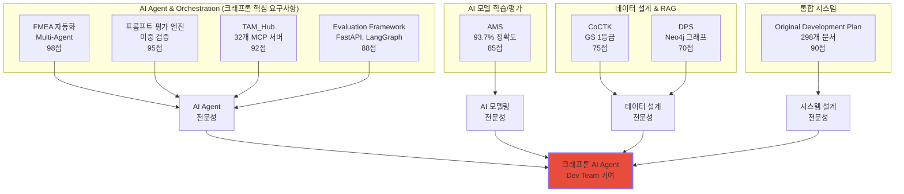
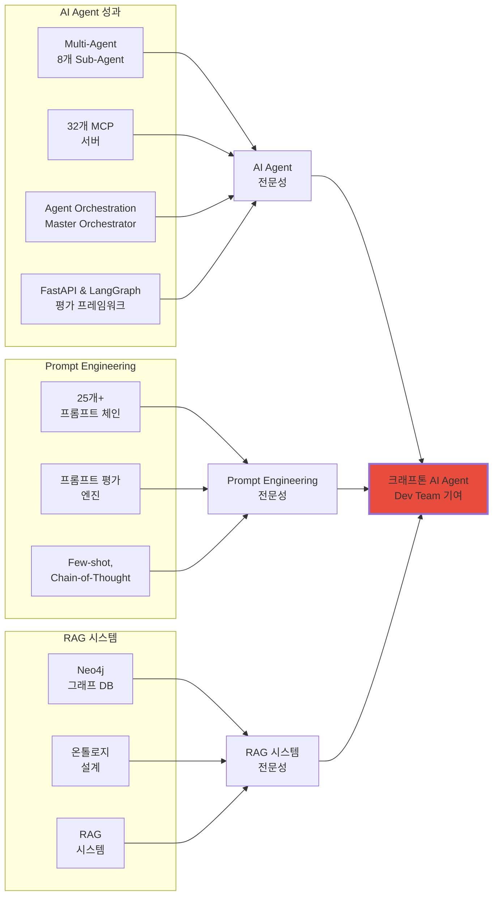
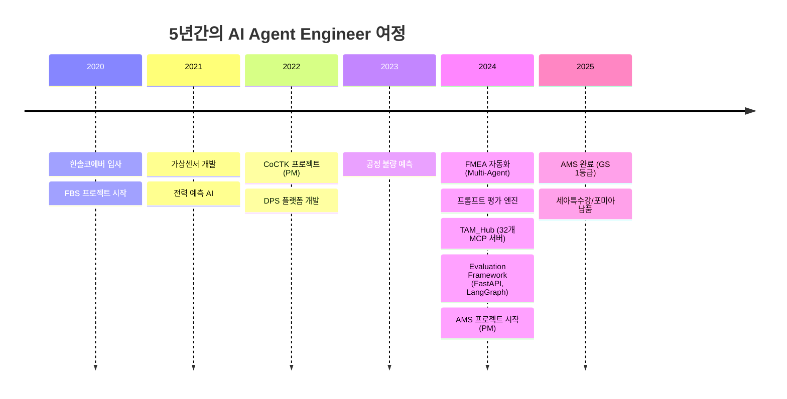
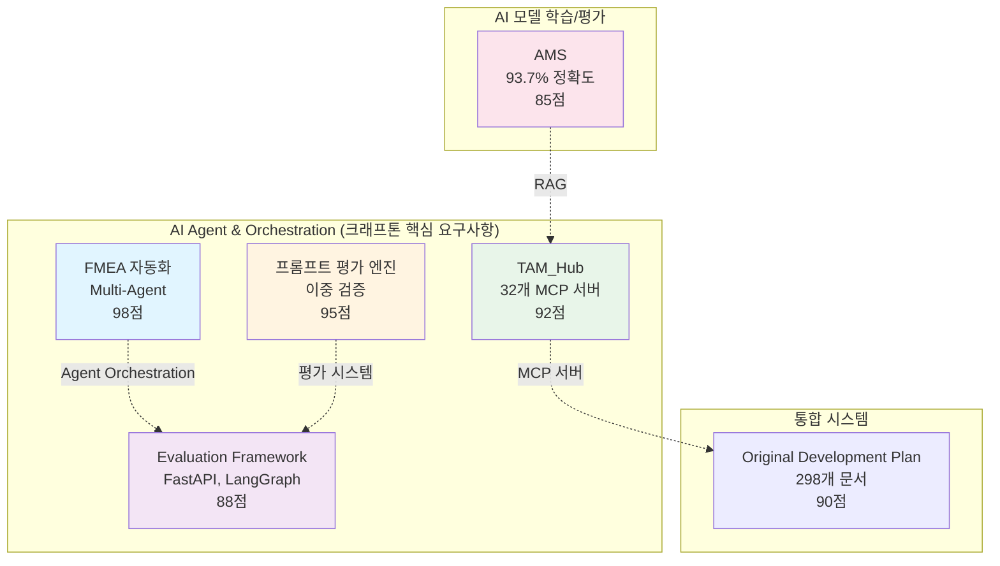
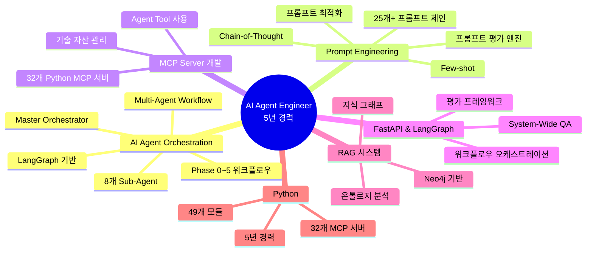

# 권순룡 포트폴리오 - 크래프톤 AI Agent Engineer

> **"모델보다 데이터, 데이터보다 정보, 지식구조를 정리하는 현장친화적 연구원"**

---

## 📌 기본 정보

**이름**: 권순룡  
**소속**: (주)한솔코에버 연구소 대리 (2020.09 ~ 재직중)  
**총 경력**: 5년 (2020~2025)  
**GitHub**: https://github.com/moobaek/Testing_AI_agents_for_public_use

---

## 📊 포트폴리오 구조 (한눈에 보기)

---

## 🎯 핵심 성과 대시보드

| 분류 | 지표 | 상세 |
|:---|---:|:---|
| **AI Agent 프로젝트** | 4개 | FMEA 자동화, 프롬프트 평가 엔진, TAM_Hub, Evaluation Framework |
| **Multi-Agent Workflow** | 8개 Sub-Agent | R&D, Mfg, QA 전문 영역 협업 |
| **MCP 서버** | 32개 | Python MCP 서버 개발 |
| **FastAPI & LangGraph** | 1개 | 평가 프레임워크 (크래프톤 우대사항) |
| **프롬프트 체인** | 25개+ | 설계 자동화 시스템 |
| **AI 모델 정확도** | 93.7% | 이상 탐지율 (실질 60~70%) |
| **GS 인증** | 2개 | 1등급 (CoCTK, AMS) |
| **프로젝트** | 20개+ | 5대 영역 (AI, 플랫폼, 센서, 에너지, Healthcare) |
| **논문** | 10편 | 2020-2025년 발표 |
| **설계 문서** | 298개+ | Original_Development_Plan |

---

## 📅 경력 타임라인 (2020-2025)

---

## 🏆 주요 프로젝트 (relevance_score 순)

### 프로젝트 관계도

### 1. FMEA 자동화 생성 시스템 (Claude Sub-Agent) - Master Orchestrator 설계

**기간**: 2024 ~ 2025  
**역할**: Master Orchestrator 설계 및 구현  
**relevance_score**: 98점

**프로젝트 개요**:
- Claude Sub-Agent 기반 Multi-Agent Workflow 구축
- 코딩 에이전트 역설계 시스템 구조 적용
- AIAG & VDA FMEA 표준 기반 범용 리스크 분석 시스템

**Multi-Agent 아키텍처**:
- **8개 독립 Sub-Agent 협업**: R&D Team 3개, Manufacturing Team 3개, QA Team 2개
- **Phase 0~5 워크플로우**: 컨텍스트 수집 → 범위 정의 → 심층 분석 → 리스크 평가 → 최적화 & 문서 생성 → 지속 개선
- **Master Orchestrator**: Claude Code Task tool 기반 워크플로우 자동화

**핵심 성과**:
- ✅ **Agent Orchestration 개발 경험**: 크래프톤 우대사항 충족
- ✅ **Multi-Agent Workflow 완전 구현**: 8개 독립 Sub-Agent 협업 구조 성공적 구축
- ✅ **프롬프트 기반 완전 자동화**: Python 스크립트 없이 프롬프트만으로 전체 워크플로우 자동화 달성
- ✅ **생산성 향상**: 개발 복잡성 크게 감소

**기술 스택**: Claude Code Task tool, Multi-Agent Workflow, Tool Calling, 프롬프트 기반 자동화

**관련 논문**: 2025년 발표 예정

### 2. 프롬프트 평가 엔진 (Claude Sub-Agent) - AI Gatekeeper

**기간**: 2024 ~ 2025  
**역할**: 프롬프트 저지 시스템 설계  
**relevance_score**: 95점

**프로젝트 개요**:
- AI가 생성한 프롬프트를 다른 AI가 평가하는 이중 검증 시스템
- 생성 AI와 평가 AI의 분리로 환각(Hallucination) 방지
- 25개+ 프롬프트 품질 보장

**핵심 구조**: 프롬프트 저지(Prompt Judging) 시스템
- **5단계 평가 프로세스**: Role Inference → Metrics → Consolidation → Report → Translation
- **역할 기반 가중치 시스템**: 전문 영역별 가중치 적용
- **프롬프트 최적화**: Few-shot, Chain-of-Thought 기법 적용 (크래프톤 우대사항)
- **Human-in-the-Loop 프로세스**: 배치 처리 지원

**핵심 성과**:
- ✅ **Prompt Engineering 전문성**: 다양한 목적의 프롬프트를 제작하고 테스트한 경험 (크래프톤 핵심 요구사항)
- ✅ **프롬프트 최적화 경험**: Few-shot, Chain-of-Thought 기법 적용 (크래프톤 우대사항)
- ✅ **25개+ 프롬프트 품질 보장**: 구조화된 평가 프레임워크로 일관성 유지
- ✅ **스스로 개발한 AI로 업무 효율 향상**: 프롬프트 품질 자동 검증으로 개발 효율 향상 (크래프톤 우대사항)

**기술 스택**: 구조화된 평가 프레임워크, 역할 기반 가중치, Human-in-the-Loop, Few-shot, Chain-of-Thought

### 3. TAM_Hub (기술 자산 관리 + MCP 서버) - MCP 서버 개발

**기간**: 2024 ~ 2025  
**역할**: MCP 서버 개발 및 시스템 설계  
**relevance_score**: 92점

**프로젝트 개요**:
- MCP (Model Context Protocol) 기반 기술 자산 관리 시스템
- Neo4j 기반 지식 그래프 RAG 시스템
- 32개 Python MCP 서버 개발

**핵심 성과**:
- ✅ **32개 Python MCP 서버 개발**: MCP Server 개발 경험 (크래프톤 우대사항)
- ✅ **AI Agent Tool 사용 경험**: 크래프톤 핵심 요구사항 충족
- ✅ **Neo4j 기반 지식 그래프 RAG 시스템**: RAG 프로젝트 수행 경험 (크래프톤 핵심 요구사항)
- ✅ **263개 Markdown 문서 통합 관리**: 기술 자산을 온톨로지 형태로 관리

**기술 스택**: Python, MCP (Model Context Protocol), Neo4j, RAG

### 4. Evaluation_Framework - FastAPI & LangGraph 기반 평가 엔진

**기간**: 2024 ~ 2025  
**역할**: 평가 엔진 설계  
**relevance_score**: 88점

**프로젝트 개요**:
- FastAPI 기반 평가 엔진 개발 (크래프톤 우대사항)
- LangGraph 워크플로우 오케스트레이션 구현 (크래프톤 핵심 요구사항)
- System-Wide Quality Assurance Layer 설계

**핵심 성과**:
- ✅ **FastAPI 개발 경험**: 크래프톤 우대사항 충족
- ✅ **LangGraph 워크플로우 오케스트레이션**: 크래프톤 핵심 요구사항 충족
- ✅ **49개 Python 모듈과 298개 문서 전체 전수 검사**: 거대 평가 엔진 구축
- ✅ **6가지 관점 평가 수행**: 체계적인 품질 평가 시스템 완성

**기술 스택**: Python, FastAPI, LangGraph, React, Docker

### 5. Original_Development_Plan (Obsidian Design Origin) - 전체 에이전트 시스템 설계

**기간**: 2020 ~ 2025 (집중 개발: 2025.5~12)  
**역할**: 전체 에이전트 시스템 설계 (PM 활동에서 문서, 개발 진행 관리에 활용)  
**relevance_score**: 90점

**프로젝트 개요**:
- 코드 에이전트 + 문서 확인 + 프롬프트 보완 통합 시스템 설계
- 전체 에이전트 시스템 아키텍처 구축
- 298개+ 설계 문서, 25개+ AI 프롬프트 체인

**핵심 성과**:
- ✅ **AI Agent 프로젝트 A-Z 개발 경험**: 전체 에이전트 시스템 설계
- ✅ **298개+ 설계 문서, 25개+ AI 프롬프트 체인**: 21개 development 프롬프트 (수정 관리 시스템 포함)
- ✅ **문제를 빠르게 정의하고 풀 수 있는 사고 능력**: Phase 0-13 워크플로우 설계 (크래프톤 우대사항)
- ✅ **변화하는 환경에 빠르게 맞출 수 있는 능력**: 연속 개발 워크플로우, 변경 관리 시스템 (크래프톤 우대사항)

**기술 스택**: ID 기반 온톨로지 맵, Phase 0-13 워크플로우, State 기반 정보 전달, 코드 에이전트 통합

### 6. AMS (Analysis Management System) - 총괄 PM

**기간**: 2024.07 ~ 2025.03  
**발주처**: 한국산업기술진흥원  
**역할**: AI 종합 플랫폼 개발 총괄 PM  
**relevance_score**: 85점

**프로젝트 개요**:
- 베이지안 네트워크 기반 이상 탐지 모델
- 확률 최적화(경사하강법)를 통한 이상상황 확률 네트워크
- Neo4j 그래프 DB 기반 지식 그래프 플랫폼

**핵심 성과**:
- ✅ **딥러닝 기술의 개념을 이해하고 설명할 수 있는 능력**: 베이지안 네트워크 기반 모델 개발, 확률 최적화(경사하강법)를 통한 모델 학습 (크래프톤 우대사항)
- ✅ **AI 모델 학습/평가**: 이상 탐지율 93.7% 달성 (실질적 정확도 60~70%)
- ✅ **RAG 프로젝트 수행 경험**: Neo4j 그래프 DB 기반 지식 그래프 플랫폼, 온톨로지 기반 관계 분석 (크래프톤 핵심 요구사항)
- ✅ **GS 인증 1등급 (PDS 명칭)**: 세아특수강/포미아 정식 납품, 논문 발표 (2025, 2024)

**기술 스택**: Python, 베이지안 네트워크, Neo4j, 확률 최적화, 온톨로지, RAG

**관련 논문**: 2025년, 2024년 발표

---

## 💻 기술 스택 맵

---

## 🤖 LLM 활용 방법

### Agent/MCP/RAG 시스템

#### 1. Multi-Agent Workflow (FMEA 자동화 생성 시스템)

**Claude Sub-Agent 기반 Multi-Agent Architecture**:
- **8개 독립 Sub-Agent 협업**: R&D Team 3개, Manufacturing Team 3개, QA Team 2개
- **Master Orchestrator**: Claude Code Task tool 기반 워크플로우 자동화
- **Phase 0~5 자동화 워크플로우**: 컨텍스트 수집 → 범위 정의 → 심층 분석 → 리스크 평가 → 최적화 & 문서 생성 → 지속 개선

**Tool Calling 구조**:
- Python 스크립트 없이 프롬프트 기반 완전 자동화
- Claude Code Task tool을 활용한 Tool Calling 구현
- Agent Orchestration 개발 경험 (크래프톤 우대사항)

#### 2. MCP 서버 개발 (TAM_Hub)

**32개 Python MCP 서버**:
- MCP (Model Context Protocol) 기반 기술 자산 관리 시스템
- MCP Server 개발 경험 (크래프톤 우대사항)
- AI Agent Tool 사용 경험 (크래프톤 핵심 요구사항)
- Neo4j 기반 지식 그래프 RAG 시스템과 통합

#### 3. RAG 시스템 (AMS, DPS, TAM_Hub)

**Neo4j 기반 지식 그래프 RAG**:
- Neo4j 그래프 DB 기반 지식 그래프 플랫폼
- 온톨로지 기반 관계 분석
- 4M2E 관계 정의
- RAG 프로젝트 수행 경험 (크래프톤 핵심 요구사항)

**Retriever 학습/개선 경험**:
- 온톨로지 기반 관계 분석을 통한 Retriever 최적화
- 지식 그래프를 활용한 정확도 향상

#### 4. FastAPI & LangGraph 기반 평가 프레임워크

**Evaluation Framework**:
- FastAPI 기반 평가 엔진 개발 (크래프톤 우대사항)
- LangGraph 워크플로우 오케스트레이션 (크래프톤 핵심 요구사항)
- 49개 Python 모듈과 298개 문서 전체 전수 검사
- 6가지 관점 평가 수행

#### 5. AI Agent 프로젝트 A-Z 개발 (Original_Development_Plan)

**전체 에이전트 시스템 설계**:
- 코드 에이전트 + 문서 확인 + 프롬프트 보완 통합
- 298개+ 설계 문서, 25개+ AI 프롬프트 체인
- 21개 development 프롬프트 (수정 관리 시스템 포함)
- 개발 에이전트 실시간 평가 시스템
- Phase 0-13 워크플로우 설계

---

## 📚 학술 성과 (10편)

| 발행일 | 논문 제목 | 학술지/학회 | 관련 프로젝트 |
|:---|:---|:---|:---|
| 2025 | FMEA 자동화 생성 시스템 (예정) | - | FMEA 자동화 |
| 2025 | AI 복합 센서 | - | AI 복합 센서 |
| 2024 | AMS 이상 탐지 시스템 | - | AMS |
| 2024 | DPS 데이터수집시스템 | - | DPS |
| 2024 | 보급형 스마트센서 3종 | - | 스마트센서 |
| 2023 | CoCTK 데이터 분석 도구 | - | CoCTK |
| 2023 | 클린룸 에너지 최적화 | - | 에너지 최적화 |
| 2023 | 전력품질 에너지 효율 플랫폼 | - | 전력품질 |
| 2022 | 일본 DX 프로젝트 | - | 일본 DX |
| 2022 | 자동차 부품 사출 DX | - | 사출 DX |

**관련 문서**: [[04_Academic_Publications|학술 논문 전체 목록]]

---

## 🎮 게임 도메인에 대한 관심

비록 직접적인 게임 개발 경험은 없지만, 크래프톤이 추구하는 "AI가 단순한 도구를 넘어 팀의 동료로서 새로운 방식으로 협업"하고 "사람들이 일하는 방식을 완전히 바꾸고, 개개인의 생산성을 극대화하는" 목표에 깊이 공감합니다. 제가 개발한 Multi-Agent Workflow 시스템은 게임 개발에서도 적용 가능한 구조입니다. 예를 들어, 게임 기획, 아트, 프로그래밍, QA 등 각 영역의 전문가가 협업하는 것처럼, 각 영역별 전문 Sub-Agent가 협업하면 게임 개발 생산성을 크게 향상시킬 수 있을 것입니다.

또한 게임을 좋아하는 분으로서, 크래프톤의 게임에 대한 열정과 크리에이티브를 이해하고 있습니다. AI Agent 기술을 통해 게임 개발 과정을 자동화하고, 크리에이티브를 더 쉽게 구현할 수 있는 플랫폼을 만드는 데 기여하고 싶습니다.

---

## 🌟 크래프톤 AI Agent Dev Team 기여 방안

### 1. 생산성 향상 플랫폼 개발

제가 개발한 Multi-Agent Workflow 시스템을 게임 개발 프로세스에 적용하여 생산성을 향상시킬 수 있습니다. 게임 기획, 아트, 프로그래밍, QA 등 각 영역별 전문 Sub-Agent를 설계하고, Master Orchestrator를 통해 전체 워크플로우를 자동화할 수 있습니다.

### 2. 크리에이티브 플랫폼 구축

FastAPI와 LangGraph를 활용하여 게임 개발 크리에이티브를 지원하는 플랫폼을 구축할 수 있습니다. RAG 시스템을 활용하여 게임 관련 지식을 구조화하고, AI Agent가 창의적인 아이디어를 생성하고 평가하는 시스템을 만들 수 있습니다.

### 3. 최신 AI 트렌드 적용

딥러닝 기술의 빠른 발전 속도에 맞춰 새로운 기술 트렌드를 파악하고 공유하며, 업무 생산성에 기여할 수 있는 방법을 지속적으로 연구하고 적용하겠습니다.

---

## 🔗 관련 링크

### GitHub

- **메인 레포지토리**: https://github.com/moobaek/Testing_AI_agents_for_public_use
- **포트폴리오 문서**: https://github.com/moobaek/Testing_AI_agents_for_public_use/tree/main/portfolio/portfolio_docs
- **GitHub 프로필**: https://github.com/moobaek

---

© 2025 권순룡. All Rights Reserved.
