# 권순룡 포트폴리오

> **"모델보다 데이터, 데이터보다 정보, 지식구조를 정리하는 현장친화적 연구원"**

---

## 📌 기본 정보

**이름**: 권순룡 (KwonSunRyong)
**소속**: 한솔코에버 연구소 대리 (2020.09 ~ 재직중)
**총 경력**: 5년 (2020~2025)
**GitHub**: [https://github.com/moobaek/Testing_AI_agents_for_public_use](https://github.com/moobaek/Testing_AI_agents_for_public_use)
**포트폴리오 문서**: [portfolio/portfolio_docs](https://github.com/moobaek/Testing_AI_agents_for_public_use/tree/main/portfolio/portfolio_docs)

---

## 📊 포트폴리오 구조 (한눈에 보기)

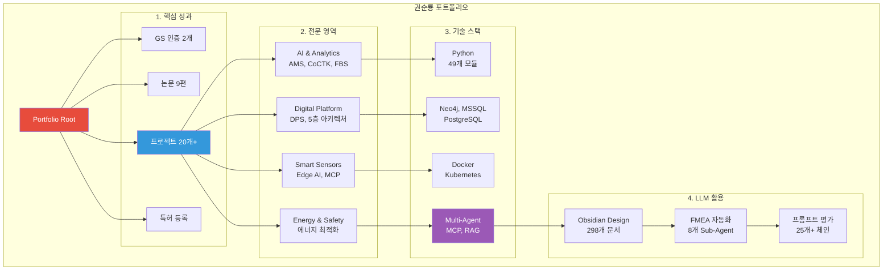

---

## 🎯 핵심 성과 대시보드

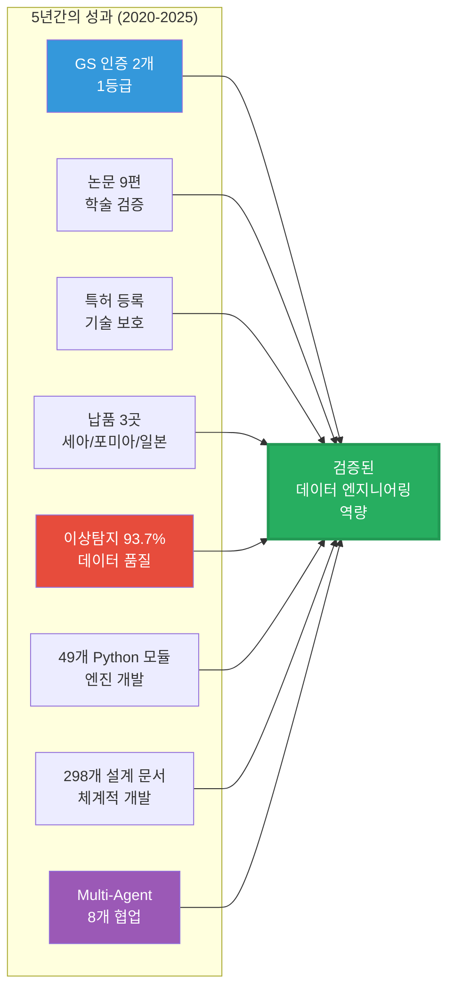

### 주요 지표

| 분류 | 지표 | 상세 |
|:---|---:|:---|
| **학술 성과** | 9편 | 한국유체기계학회, 한국생산제조학회 (2020-2025) |
| **인증** | GS 1등급 2개 | AMS, CoCTK 정부 공인 우수 소프트웨어 |
| **특허** | 1개 | 피쉬본 다이어그램 자동화 엔진 |
| **납품** | 3곳 | 세아특수강, 포미아 (정식 납품), 일본 글로벌 기업 |
| **이상 탐지** | 93.7% | 실질적 정확도 60~70% (데이터 한계 고려) |
| **Python 모듈** | 49개 | MLS, CoCTK, FBS, RMS, AMS |
| **설계 문서** | 298개+ | Obsidian Design Origin |
| **AI 프롬프트** | 25개+ | Multi-Agent 워크플로우 |

---

## 📅 경력 타임라인 (2020-2025)

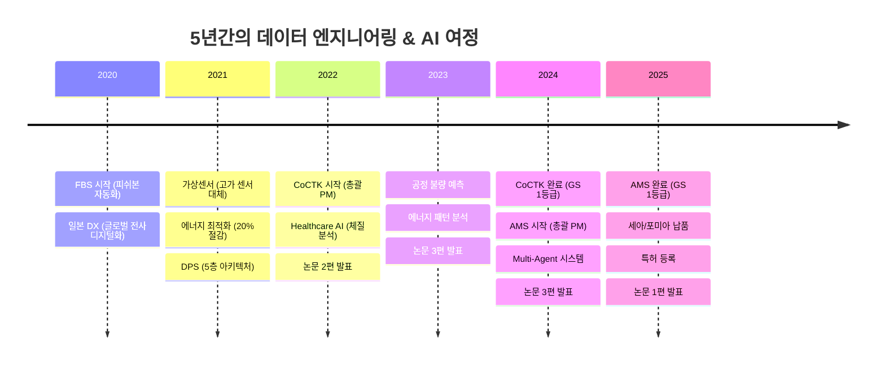

---

## 🏆 주요 프로젝트 (20개+)

### 프로젝트 관계도

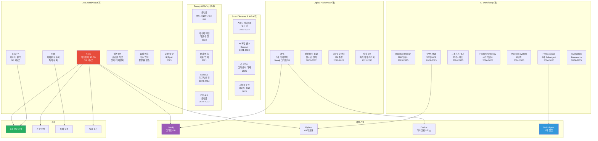

### 1. AMS (Anomaly Management System) - 총괄 PM

**기간**: 2024.07 ~ 2025.03 (초기 개발: 2020~2025)
**발주처**: 한국산업기술진흥원 (KIAT)
**역할**: AI 종합 플랫폼 개발 총괄 PM, Python 엔진 100% 자체 개발

**아키텍처**:

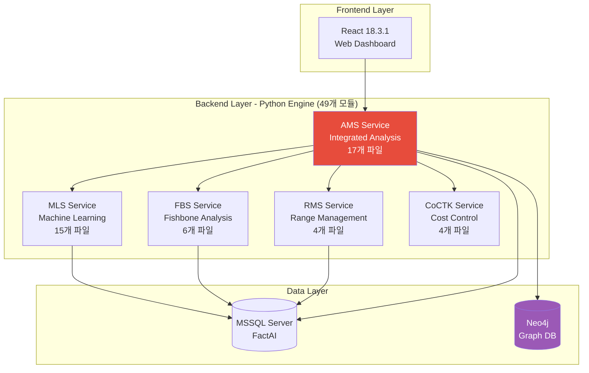

**핵심 성과**:
- ✅ **이상 탐지 정확도 93.7%** (기존 82% → 93.7%)
  - **데이터 정합성에 대한 투명한 설명**: 공정 데이터는 쌓을 수 있는 데이터의 한계로 인하여 실질적 정확도(밸런스, test train val 완전분리, 데이터 오염 방지)는 대략 60~70%입니다. 93.7%는 현실적인 공정 조건에서 달성한 의미 있는 성과입니다.
- ✅ **GS 인증 1등급** (정부 공인 우수 소프트웨어, PDS 명칭으로 인증 진행)
- ✅ **특허 등록** (피쉬본 다이어그램 자동화 엔진)
- ✅ **납품 실적** (세아특수강, 포미아 정식 납품, 일본 글로벌 기업)
- ✅ **논문 3편** (2024년 2편, 2025년 1편)
- ✅ **제조 풀필먼트 플랫폼**: DPS, AMS 시스템에서 사용자가 이해할 수 있는 플랫폼 시연

### 2. DPS (데이터수집시스템) - 5층 아키텍처

**기간**: 2021 ~ 2024
**역할**: 핵심 아키텍처 설계 및 개발 (PM 수행)

**5층 아키텍처**:

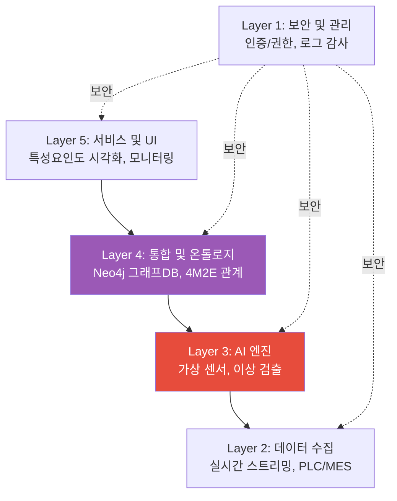

**핵심 성과**:
- ✅ **Neo4j 그래프 DB**: 4M2E 관계 정의, 온톨로지 기반 분석
- ✅ **Docker 마이크로서비스**: 서버-엣지 하이브리드 인프라
- ✅ **논문 1편** (2024년)

### 3. FMEA 자동화 - Multi-Agent Workflow

**기간**: 2024 ~ 2025
**역할**: Master Orchestrator 설계

**Multi-Agent 아키텍처**:

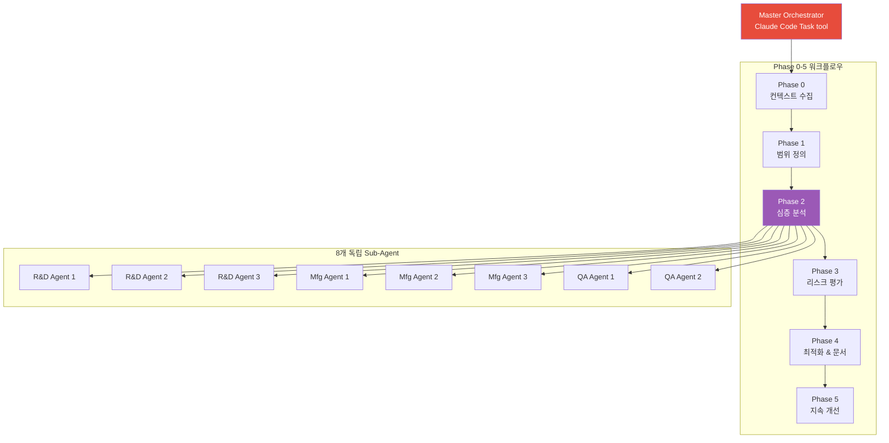

**핵심 성과**:
- ✅ **코딩 에이전트 역설계**: 복잡한 FMEA 프로세스를 8개 Sub-Agent로 분해
- ✅ **AIAG & VDA FMEA 표준**: 범용 리스크 분석 시스템
- ✅ **프롬프트 기반 자동화**: Python 스크립트 없이 완전 자동화

---

## 💻 기술 스택 맵

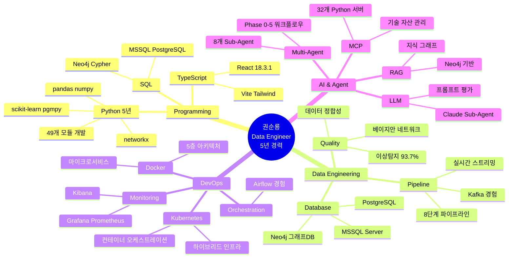

---

## 📚 학술 성과 (9편, 2020-2025)

| 발행일 | 논문 제목 | 학술지/학회 | 프로젝트 연계 |
|:---|:---|:---|:---|
| 2025.06 | AI를 활용한 구조와 룰을 활용한 구조-확률 종합 네트워크 및 최적 관리 방안 도출 | 한국유체기계학회 | AMS |
| 2024.12 | 공장 운영 핵심 요소의 식별 및 최적화를 위한 클러스터링 기법 적용 | 한국생산제조학회 | DPS |
| 2024.12 | 설비 이상상태 기반 최적 공정 데이터 추론 및 위험/안전 관리 최적 자동화 | 한국유체기계학회 | AMS |
| 2024.07 | 전력 데이터를 통한 설비 상태 추론 및 이상 상황 설정 예측 | 한국유체기계학회 | 에너지/센서 |
| 2023.12 | 송풍 설비 변동부하 대응 전력품질 분석 및 에너지 절감 연구 | 한국유체기계학회 | 에너지 최적화 |
| 2023.12 | 압축기 공정에서 데이터 밸런스 문제 해결 및 품질 결과 사전 예측을 위한 AI 시스템 | 한국유체기계학회 | AI/데이터 |
| 2023.07 | 생산공정 에너지 및 설비 상태 진단을 위한 AI기반의 전력 사용 패턴 및 SOH분석 | 한국유체기계학회 | 에너지/전력 |
| 2022.12 | 자동차 부품 생산 산업을 위한 머신러닝 기반의 품질예측 알고리즘 | 한국생산제조학회 | AI/제조 |
| 2022.06 | ICT 융복합 기술을 활용한 스마트 공장 및 에너지 절감 솔루션 적용 사례 | 한국유체기계학회 | Global DX |

---

## 🤖 LLM 활용 방법 (포트폴리오 자동화)

### 포트폴리오 구조 개요

이 포트폴리오는 **Obsidian Design Origin** 시스템 기반으로 구축되었으며, LLM을 활용한 문서 자동화 및 Multi-Agent 워크플로우를 적용했습니다.

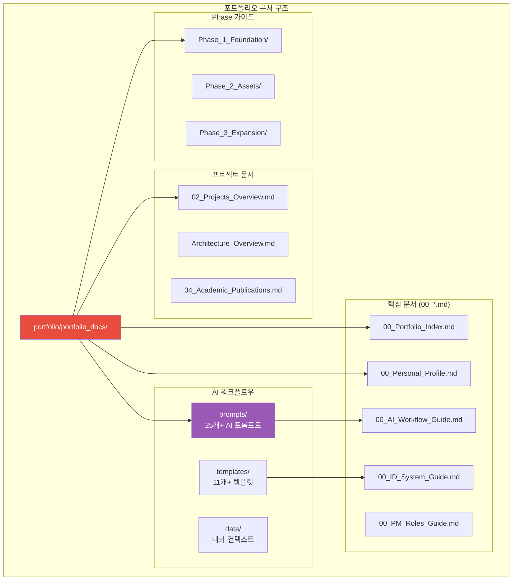

### LLM 활용 시스템

#### 1. ID 기반 온톨로지 맵 문서 시스템

모든 문서는 고유 ID를 가지며 관계를 추적합니다:

```
- page.portfolio.*: 포트폴리오 문서
- project.*: 프로젝트
- phase.foundation.*: Phase 1 단계
- prompt.*: AI 프롬프트
- template.*: 문서 템플릿
```

**활용 방법**:
```markdown
[[00_Personal_Profile|개인 프로필]] (`page.portfolio.personal_profile`)
[[02_Projects_Overview|프로젝트 개요]] (`page.portfolio.projects`)
```

#### 2. 25개+ AI 프롬프트 체인

**위치**: `portfolio/portfolio_docs/prompts/`

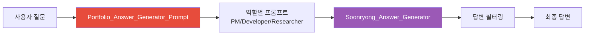

**주요 프롬프트**:
- `Portfolio_Answer_Generator_Prompt.md`: 답변 생성 오케스트레이터
- `Soonryong_Answer_Generator_Prompt.md`: 순룡 페르소나 답변 생성
- `Answer_For_PM_Prompt.md`: PM 평가자용 답변
- `Answer_For_Developer_Prompt.md`: 개발자 평가자용 답변
- `Answer_For_Researcher_Prompt.md`: 연구자 평가자용 답변

#### 3. Phase 0-13 워크플로우 자동화

**Obsidian Design Origin 시스템**:

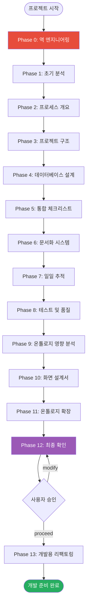

#### 4. Multi-Agent 워크플로우 (FMEA 자동화)

**Claude Sub-Agent 시스템**:

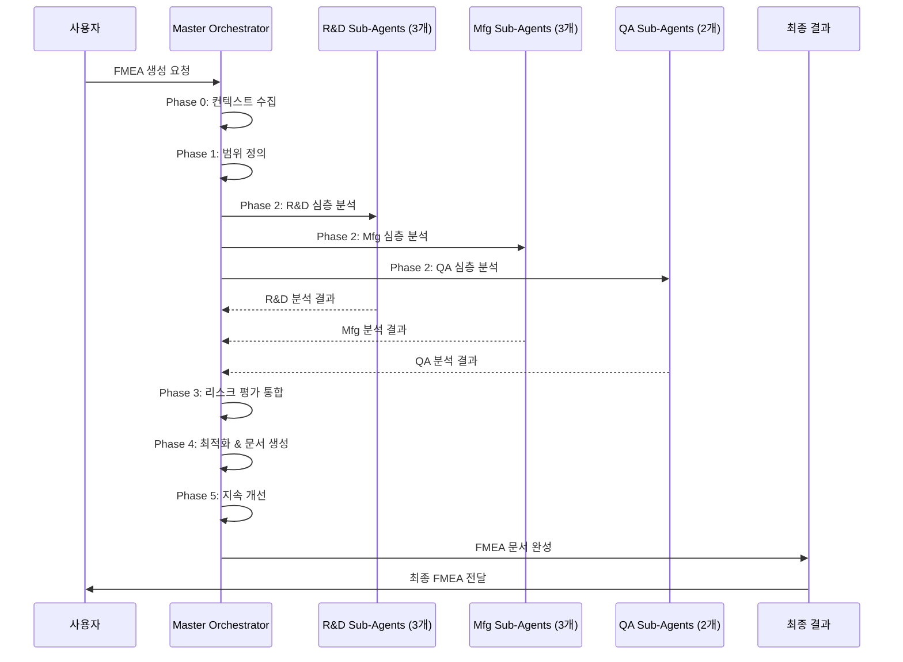

### LLM 활용 가이드

#### 포트폴리오 문서 탐색 방법

1. **GitHub에서 확인**:
   ```
   https://github.com/moobaek/Testing_AI_agents_for_public_use/tree/main/portfolio/portfolio_docs
   ```

2. **주요 문서 경로**:
   ```
   portfolio/portfolio_docs/
   ├── 00_Portfolio_Index.md          # 시작점
   ├── 00_Personal_Profile.md          # 개인 프로필
   ├── 02_Projects_Overview.md         # 프로젝트 20개+
   ├── Architecture_Overview.md        # 아키텍처 상세
   ├── 04_Academic_Publications.md     # 논문 9편
   ├── prompts/                        # 25개+ AI 프롬프트
   │   ├── Portfolio_Answer_Generator_Prompt.md
   │   ├── role_based/Soonryong_Answer_Generator_Prompt.md
   │   └── ...
   ├── templates/                      # 11개+ 템플릿
   └── Phase_1_Foundation/             # Phase 가이드
   ```

3. **LLM에게 질문하는 방법**:

   **예시 1: 프로젝트 탐색**
   ```
   "AMS 프로젝트의 아키텍처는 어떻게 구성되어 있나요?"
   → Architecture_Overview.md → AMS 시스템 아키텍처 섹션 참조
   ```

   **예시 2: 기술 스택 확인**
   ```
   "Neo4j 그래프 DB를 어떻게 활용했나요?"
   → 02_Projects_Overview.md → DPS 프로젝트 → Neo4j 활용 사례
   ```

   **예시 3: 논문 확인**
   ```
   "데이터 품질 관리에 대한 논문이 있나요?"
   → 04_Academic_Publications.md → 논문 목록 확인
   ```

#### AI 프롬프트 활용 방법

1. **Portfolio_Answer_Generator_Prompt 사용**:
   ```markdown
   # 입력
   - 질문: "AMS 시스템의 핵심 기술은 무엇인가요?"
   - 평가자 유형: developer (개발자)

   # 출력
   - 기술적 상세 설명 (아키텍처, 기술 스택, 성능)
   - 코드 예시 및 다이어그램
   - 확장성 및 유지보수성
   ```

2. **Soonryong_Answer_Generator_Prompt 사용**:
   ```markdown
   # 입력
   - 질문: "데이터 정합성을 어떻게 보장하나요?"

   # 출력 (순룡 페르소나 스타일)
   - 두괄식 구조 (핵심 먼저)
   - 평존대 (~이에요, ~거든요)
   - 경험 사례 중심 (세아특수강, 포미아)
   - 친근한 비유
   ```

#### 변경 관리 프로세스

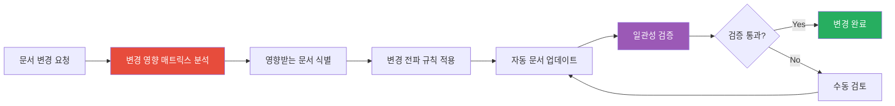

**사용 방법**:
1. ID 시스템으로 문서 간 관계 추적
2. 변경 영향 매트릭스로 영향 분석
3. 변경 전파 규칙으로 자동 업데이트
4. 일관성 검증 후 완료

---

## 🤖 Claude 에이전트 워크플로우 (신규)

### 📂 Git 저장소 전체 구조

이 저장소는 Claude Code 에이전트와 완전 통합되어 있습니다. 아래 다이어그램에서 **빨간색**은 AI 에이전트 핵심 파일입니다.

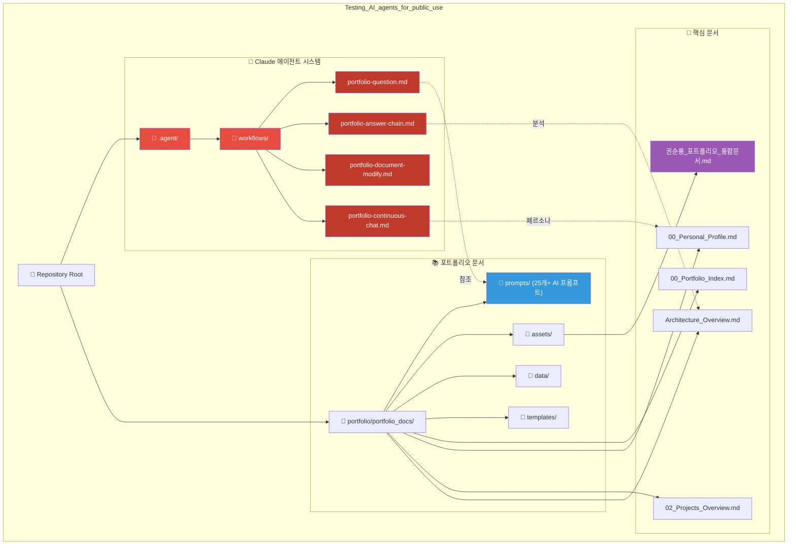

### 🚀 지금 바로 사용하기

**Claude Code에서 이렇게 입력하세요:**

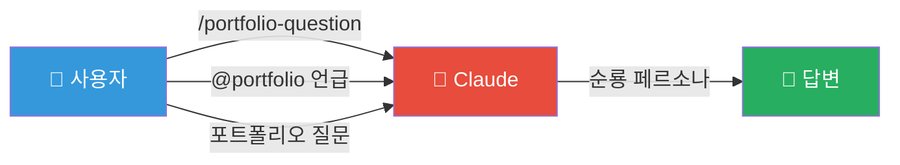

### 사용 가능한 슬래시 명령어

| 명령어 | 설명 | 사용 예시 |
|--------|------|----------|
| `/portfolio-question` | 포트폴리오 질문 시스템 진입점 | "AMS 시스템 아키텍처는?" |
| `/portfolio-answer-chain` | 3단계 분석 체인 실행 | 심층 분석이 필요할 때 |
| `/portfolio-document-modify` | 포트폴리오 문서 수정 | "Architecture_Overview.md 수정" |
| `/portfolio-continuous-chat` | 평가자와 연속 대화 | 면접/평가 상황 |

### 워크플로우 사용 방법

**방법 1: 슬래시 명령어**
```
/portfolio-question
→ 작업 유형 선택 (질문 답변 / 문서 수정 / 문서화)
→ 순룡 페르소나로 답변 생성
```

**방법 2: @멘션**
```
@portfolio 또는 @portfolio/portfolio_docs 언급
→ 자동으로 포트폴리오 질문 시스템 트리거
```

**방법 3: 자연어 질문**
```
"포트폴리오에서 AMS 프로젝트 설명해줘"
→ 관련 문서 자동 검색 및 답변
```

### 순룡 페르소나 답변 스타일

워크플로우가 생성하는 답변은 **순룡(권순룡) 페르소나** 스타일을 따릅니다:

| 항목 | 규칙 |
|------|------|
| **어체** | 평존대 (~이에요, ~거든요, ~네요) |
| **구조** | 두괄식 (핵심 먼저 2-3문장, 상세 후) |
| **사례** | 실제 경험 중심 (세아특수강, 포미아, 일본 DX) |
| **비유** | 친근한 일상 예시 활용 |
| **금지** | 인사말, 반말, 형식적 구조 |

**답변 예시**:
```
AMS 시스템은 데이터 수집 계층, 분석 계층, 시각화 계층으로 구성되어 있어요. 
실제로 세아특수강에 납품한 시스템에서 이 구조로 93.7%의 이상 탐지 정확도를 
달성했거든요.

아키텍처라는 게 뭔지부터 말씀드려야 할 것 같아요. 
이건 마치 건물의 설계도면과 비슷한 거거든요...
```

### 워크플로우 파일 위치

```
Testing_AI_agents_for_public_use/
└── .agent/
    └── workflows/
        ├── portfolio-question.md          # 메인 진입점
        ├── portfolio-answer-chain.md      # 3단계 분석 체인
        ├── portfolio-document-modify.md   # 문서 수정
        └── portfolio-continuous-chat.md   # 연속 대화
```

---

## 📁 포트폴리오 파일 구조

```
Testing_AI_agents_for_public_use/
├── portfolio/
│   └── portfolio_docs/                    # 포트폴리오 루트
│       ├── 00_Portfolio_Index.md          # 포트폴리오 인덱스
│       ├── 00_Personal_Profile.md         # 개인 프로필
│       ├── 00_ID_System_Guide.md          # ID 시스템 가이드
│       ├── 00_AI_Workflow_Guide.md        # AI 워크플로우 가이드
│       ├── 02_Projects_Overview.md        # 프로젝트 20개+ 개요
│       ├── 04_Academic_Publications.md    # 논문 9편
│       ├── Architecture_Overview.md       # 아키텍처 상세
│       ├── Testing_Context.md             # 실증 사례
│       │
│       ├── Executive_Summary/             # 요약 문서
│       │   ├── 00_Overview_For_Non_Technical.md
│       │   ├── 01_Key_Achievements.md
│       │   ├── 02_Business_Value.md
│       │   ├── 03_Technology_Simplified.md
│       │   └── 04_Visual_Portfolio.md
│       │
│       ├── prompts/                       # 25개+ AI 프롬프트
│       │   ├── Portfolio_Answer_Generator_Prompt.md
│       │   ├── role_based/
│       │   │   ├── Soonryong_Answer_Generator_Prompt.md
│       │   │   ├── Answer_For_PM_Prompt.md
│       │   │   ├── Answer_For_Developer_Prompt.md
│       │   │   └── Answer_For_Researcher_Prompt.md
│       │   └── ...
│       │
│       ├── templates/                     # 11개+ 템플릿
│       │   ├── Project_Summary_Template.md
│       │   ├── Evaluation_Template.md
│       │   └── ...
│       │
│       ├── Phase_1_Foundation/            # Phase 1 가이드
│       │   ├── Step_01_Repetitive_Work.md
│       │   ├── Step_02_Expertise_Targeting.md
│       │   ├── Step_03_Micro_Starts.md
│       │   ├── Step_04_Modularization.md
│       │   └── Step_05_IO_Optimization.md
│       │
│       ├── Phase_2_Assets/                # Phase 2 가이드
│       │   ├── Step_06_Daily_Log.md
│       │   └── Step_07_Visuals.md
│       │
│       ├── Phase_3_Expansion/             # Phase 3 가이드
│       │   ├── Step_08_Feedback_Loop.md
│       │   └── Step_09_Continuous_Update.md
│       │
│       ├── assets/                        # 자산 파일
│       │   ├── 권순룡_이력서_토스증권_Data_Engineer_AI.md
│       │   ├── 권순룡_포트폴리오_통합문서.md (현재 문서)
│       │   └── 인공지능+기반+제조+분야+프로젝트+포트폴리오.pdf
│       │
│       └── data/                          # 대화 컨텍스트
│           ├── conversations/
│           └── temp/
│
└── README.md
```

---

## 🎓 학력 및 자격

### 학력

**홍익대학교 전자공학과** (2013.03 ~ 2020.02)
- 학점: 3.11 / 4.5
- 졸업논문: LD 동격회로 설계 및 PLL 설계
- 주요 수강 분야: 회로 설계, 전파공학, 컴퓨터공학

**기초 역량**:
- 전자전기공학부 기반 (회로 설계/전파공학/컴퓨터공학)
- 국가 기관 인공지능 교육 이수 (파이썬, 머신러닝, 딥러닝)
- 시계열 데이터 처리 전문성 (전파공학/전자공학적 접근)

### 자격증

**OPIc** (2019.03)
- ACT FL (American Council on the Teaching of Foreign Languages)

---

## 🔗 관련 링크

### GitHub

- **메인 레포지토리**: [https://github.com/moobaek/Testing_AI_agents_for_public_use](https://github.com/moobaek/Testing_AI_agents_for_public_use)
- **포트폴리오 문서**: [portfolio/portfolio_docs](https://github.com/moobaek/Testing_AI_agents_for_public_use/tree/main/portfolio/portfolio_docs)
- **AI 프롬프트**: [portfolio/portfolio_docs/prompts](https://github.com/moobaek/Testing_AI_agents_for_public_use/tree/main/portfolio/portfolio_docs/prompts)

### 주요 문서

- **포트폴리오 인덱스**: [00_Portfolio_Index.md](https://github.com/moobaek/Testing_AI_agents_for_public_use/blob/main/portfolio/portfolio_docs/00_Portfolio_Index.md)
- **개인 프로필**: [00_Personal_Profile.md](https://github.com/moobaek/Testing_AI_agents_for_public_use/blob/main/portfolio/portfolio_docs/00_Personal_Profile.md)
- **프로젝트 개요**: [02_Projects_Overview.md](https://github.com/moobaek/Testing_AI_agents_for_public_use/blob/main/portfolio/portfolio_docs/02_Projects_Overview.md)
- **아키텍처**: [Architecture_Overview.md](https://github.com/moobaek/Testing_AI_agents_for_public_use/blob/main/portfolio/portfolio_docs/Architecture_Overview.md)

---

## 📞 연락처

**이메일**: (이메일 주소를 여기에 입력)
**GitHub**: [https://github.com/moobaek](https://github.com/moobaek)
**LinkedIn**: (LinkedIn 프로필을 여기에 입력)

---

## 📝 업데이트 이력

| 날짜 | 버전 | 변경 내용 |
|:---|:---|:---|
| 2025-12-27 | v1.2 | Git 저장소 구조 다이어그램 추가, Claude 에이전트 섹션 강화 |
| 2025-12-27 | v1.1 | Claude 에이전트 워크플로우 시스템 추가 |
| 2025-12-27 | v1.0 | 통합 포트폴리오 문서 최초 작성 |

---

## 💡 핵심 철학

> **"모델보다 데이터, 데이터보다 정보, 지식구조를 정리하는 현장친화적 연구원"**

5년간의 현장 경험을 통해 데이터를 정보로 전환하고, 정보를 지식 구조로 체계화하는 전문성을 갖춘 연구원입니다. 단순한 모델 개발을 넘어, 현장의 실제 문제를 해결하고 지식 기반 시스템을 구축하는 데 집중합니다.

### 미래 비전

**지식 구조와 결합한 LLM 활용**:
- 보다 현장적인 정보 도출
- 쿼리 기능 향상
- 대화형 설명 제공
- 목적에 맞는 보고서 생성
- 복합-닫힌 지식 구조 타파

**인더스트리 4.0 실현**:
- 온톨로지 기반 접근 방식으로 인더스트리 4.0의 이점 활용
- 지능적이고 적응적인 제조 생태계 구축

**지속적인 학습과 도전**:
- 끊임없이 배우고 도전
- 기술을 통해 제조 산업의 미래를 선도

---

<p align="center">
  
  
  
  
  
</p>

<p align="center">
  <strong>© 2025 권순룡 (KwonSunRyong). All Rights Reserved.</strong>
</p>
