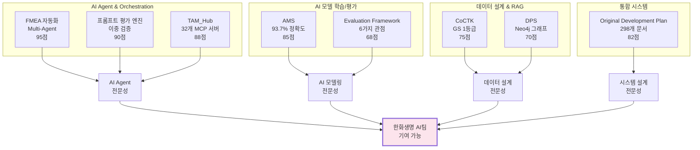
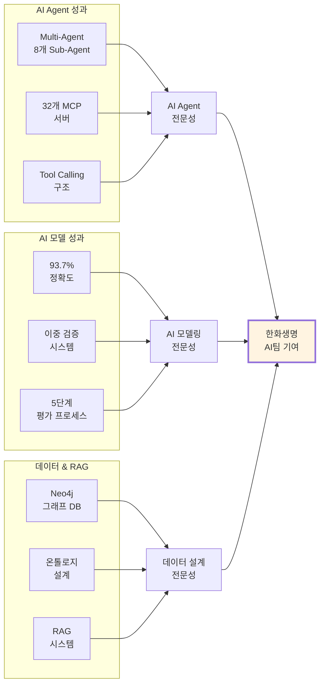
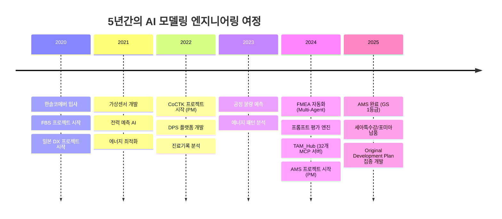
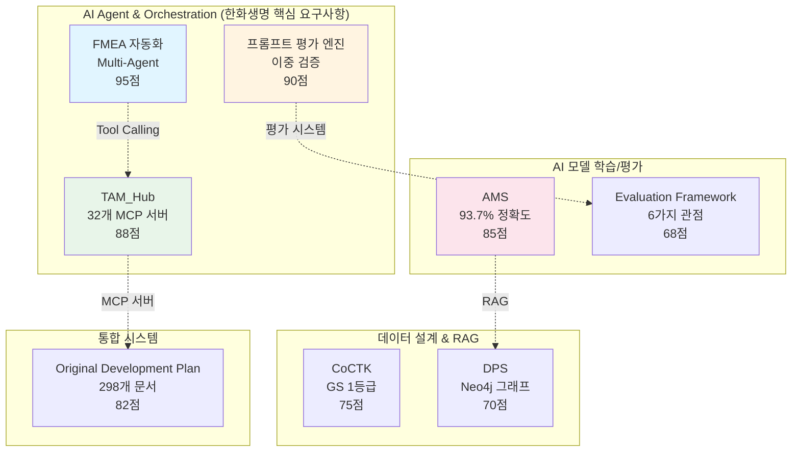
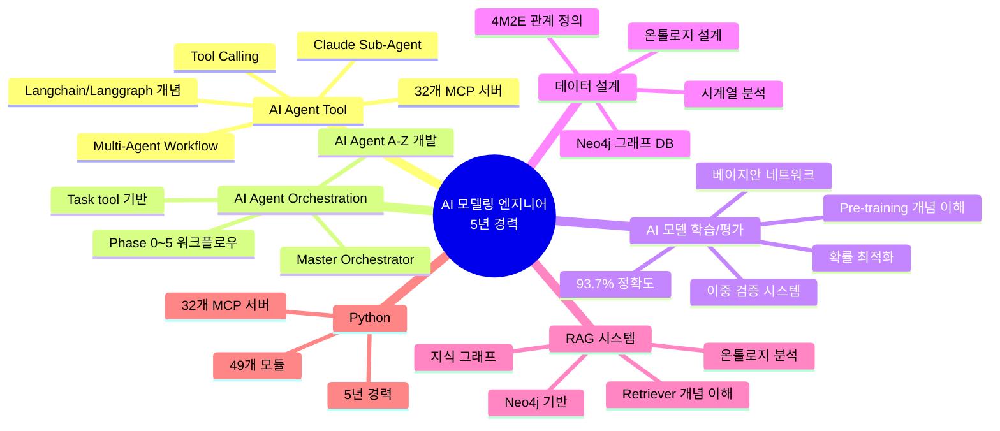

# 권순룡 포트폴리오

> **"모델보다 데이터, 데이터보다 정보, 지식구조를 정리하는 현장친화적 연구원"**

---

## 📌 기본 정보

**이름**: 권순룡  
**소속**: (주)한솔코에버 연구소 대리 (2020.09 ~ 재직중)  
**총 경력**: 5년 (2020~2025)  
**GitHub**: [포트폴리오 문서](portfolio/portfolio_docs/)

---

## 📊 포트폴리오 구조 (한눈에 보기)

---

## 🎯 핵심 성과 대시보드

| 분류 | 지표 | 상세 |
|:---|---:|:---|
| **AI Agent 프로젝트** | 3개 | FMEA 자동화, 프롬프트 평가 엔진, TAM_Hub |
| **Multi-Agent Workflow** | 8개 Sub-Agent | R&D, Mfg, QA 전문 영역 협업 |
| **MCP 서버** | 32개 | Python MCP 서버 개발 |
| **AI 모델 정확도** | 93.7% | 이상 탐지율 (실질 60~70%) |
| **GS 인증** | 2개 | 1등급 (CoCTK, AMS) |
| **프로젝트** | 20개+ | 5대 영역 (AI, 플랫폼, 센서, 에너지, Healthcare) |
| **논문** | 10편 | 2020-2025년 발표 |
| **설계 문서** | 298개+ | Original_Development_Plan |

---

## 📅 경력 타임라인 (2020-2025)

---

## 🏆 주요 프로젝트 (20개+)

### 프로젝트 관계도

### 1. FMEA 자동화 생성 시스템 (Claude Sub-Agent) - 총괄 PM

**기간**: 2024 ~ 2025  
**역할**: Master Orchestrator 설계 및 구현

**프로젝트 개요**:
- Claude Sub-Agent 기반 Multi-Agent Workflow 구축
- 코딩 에이전트 역설계 시스템 구조 적용
- AIAG & VDA FMEA 표준 기반 범용 리스크 분석 시스템

**Multi-Agent 아키텍처**:
- **8개 독립 Sub-Agent 협업**: R&D Team 3개, Manufacturing Team 3개, QA Team 2개
- **Phase 0~5 워크플로우**: 컨텍스트 수집 → 범위 정의 → 심층 분석 → 리스크 평가 → 최적화 & 문서 생성 → 지속 개선
- **Master Orchestrator**: Claude Code Task tool 기반 워크플로우 자동화

**핵심 성과**:
- ✅ **최신 AI 트렌드 적용**: 코딩 에이전트의 역설계 시스템 구조를 FMEA 분석에 적용
  1. FMEA 프로세스를 역으로 분석하여 8개 전문 Sub-Agent로 분해
  2. 각 Sub-Agent가 전문 영역(R&D, Mfg, QA)을 담당하여 병렬 작업
  3. Master Orchestrator가 Phase 0~5 워크플로우 자동 실행 및 결과 통합
  4. Living Document 시스템으로 지속적 개선 추적
- ✅ **범용 도메인 지원**: 제조업, 사무업무, 서비스업 모두 지원
- ✅ **Python 스크립트 없이 프롬프트 기반 완전 자동화**: 개발 복잡성 감소
- ✅ **AI Agent Orchestration/Tool Calling 개발**: 한화생명 핵심 요구사항 충족

**기술 스택**: Claude Code Task tool, Multi-Agent Workflow, Tool Calling, 프롬프트 기반 자동화

**관련 논문**: 2025년 발표 예정

### 2. 프롬프트 평가 엔진 (Claude Sub-Agent) - AI Gatekeeper

**기간**: 2024 ~ 2025  
**역할**: 프롬프트 저지 시스템 설계

**프로젝트 개요**:
- AI가 생성한 프롬프트를 다른 AI가 평가하는 이중 검증 시스템
- 생성 AI와 평가 AI의 분리로 환각(Hallucination) 방지
- 25개+ 프롬프트 품질 보장

**핵심 구조**: 프롬프트 저지(Prompt Judging) 시스템
- **5단계 평가 프로세스**: Role Inference → Metrics → Consolidation → Report → Translation
- **역할 기반 가중치 시스템**: 전문 영역별 가중치 적용
- **Human-in-the-Loop 프로세스**: 배치 처리 지원

**핵심 성과**:
- ✅ **AI 모델 평가 전문성**: AI가 생성한 프롬프트를 다른 AI가 평가하는 이중 검증 구조
- ✅ **환각 방지 시스템**: 생성 AI와 평가 AI의 분리로 환각(Hallucination) 방지
- ✅ **25개+ 프롬프트 품질 보장**: 구조화된 평가 프레임워크로 일관성 유지
- ✅ **5단계 평가 프로세스**: 체계적인 평가 및 품질 검증

**기술 스택**: 구조화된 평가 프레임워크, 역할 기반 가중치, Human-in-the-Loop

### 3. TAM_Hub (기술 자산 관리 + MCP 서버) - MCP 서버 개발

**기간**: 2024 ~ 2025  
**역할**: MCP 서버 개발 및 시스템 설계

**프로젝트 개요**:
- MCP (Model Context Protocol) 기반 기술 자산 관리 시스템
- Neo4j 기반 지식 그래프 RAG 시스템
- 32개 Python MCP 서버 개발

**핵심 성과**:
- ✅ **32개 Python MCP 서버 개발**: AI Agent Tool 사용 경험 (한화생명 핵심 요구사항)
- ✅ **Neo4j 기반 지식 그래프 RAG 시스템**: RAG 프로젝트 수행 경험 (한화생명 우대사항)
- ✅ **263개 Markdown 문서 통합 관리**: 기술 자산을 온톨로지 형태로 관리
- ✅ **온톨로지 기반 관계 분석**: 지식 그래프 활용

**기술 스택**: Python, MCP (Model Context Protocol), Neo4j, RAG

### 4. AMS (Anomaly Management System) - 총괄 PM

**기간**: 2024.07 ~ 2025.03  
**발주처**: 한국산업기술진흥원  
**역할**: AI 종합 플랫폼 개발 총괄 PM

**프로젝트 개요**:
- 베이지안 네트워크 기반 이상 탐지 모델
- 확률 최적화(경사하강법)를 통한 이상상황 확률 네트워크
- 시계열 분석에 대한 정보 온톨로지 output
- Neo4j 그래프 DB 기반 지식 그래프 플랫폼

**핵심 성과**:
- ✅ **AI 모델 학습/평가**: 베이지안 네트워크 기반 이상 탐지 모델 개발, 확률 최적화(경사하강법)를 통한 모델 학습, 이상 탐지율 93.7% 달성 (실질적 정확도 60~70%)
- ✅ **데이터 설계**: 시계열 분석에 대한 정보 온톨로지 output 설계, 4M2E 관계 정의, Neo4j 그래프 DB 활용
- ✅ **RAG 프로젝트 수행 경험**: Neo4j 그래프 DB 기반 지식 그래프 플랫폼, 온톨로지 기반 관계 분석 (한화생명 우대사항)
- ✅ **GS 인증 1등급 (PDS 명칭)**: 세아특수강/포미아 정식 납품, 논문 발표 (2025, 2024)

**기술 스택**: Python, 베이지안 네트워크, Neo4j, 확률 최적화, 온톨로지

**관련 논문**: 2025년, 2024년 발표

### 5. Original_Development_Plan (Obsidian Design Origin) - 전체 에이전트 시스템 설계

**기간**: 2020 ~ 2025 (집중 개발: 2025.5~7, 2025.8~10, 2025.10~12)  
**역할**: 전체 에이전트 시스템 설계 (PM 활동에서 문서, 개발 진행 관리에 활용)

**프로젝트 개요**:
- 코드 에이전트 + 문서 확인 + 프롬프트 보완 통합
- 전체 에이전트 시스템 설계
- 298개+ 설계 문서, 25개+ AI 프롬프트 체인

**핵심 성과**:
- ✅ **AI Agent 프로젝트 A-Z 개발 경험**: 코드 에이전트 + 문서 확인 + 프롬프트 보완 통합, 전체 에이전트 시스템 설계 (한화생명 우대사항)
- ✅ **298개+ 설계 문서, 25개+ AI 프롬프트 체인**: 21개 development 프롬프트 (수정 관리 시스템 포함), 개발 에이전트 실시간 평가 시스템
- ✅ **연속 개발 워크플로우**: AI 프로젝트 PoC 진행 경험

**기술 스택**: ID 기반 온톨로지 맵, Phase 0-13 워크플로우, State 기반 정보 전달, 코드 에이전트 통합

### 6. CoCTK (Consulting Tool Kit) - 총괄 PM

**기간**: 2022.03 ~ 2024  
**발주처**: 중소기업기술정보진흥원  
**역할**: 엔진 총괄 설계 & 화면설계 개발 총괄 PM

**핵심 성과**:
- ✅ **데이터 설계**: 데이터 전처리, 상관관계 분석, 비용 최적화 통합 분석 도구
- ✅ **GS 인증 1등급 취득 (2024)**: 논문 발표 (2023)

### 7. DPS (데이터수집시스템) - 핵심 아키텍처 설계

**기간**: 2021 ~ 2024  
**역할**: 핵심 아키텍처 설계 및 개발 (PM 수행)

**핵심 성과**:
- ✅ **데이터 설계**: 5층 아키텍처 설계 및 개발, 마이크로서비스 아키텍처 (Docker)
- ✅ **RAG 프로젝트 수행 경험**: Neo4j 그래프 DB 기반 온톨로지 분석, 지식 그래프 활용 (한화생명 우대사항)
- ✅ **4M2E 관계 정의**: 논문 발표 (2024)

### 8. Evaluation_Framework - System-Wide Quality Assurance Layer

**기간**: 2024 ~ 2025  
**역할**: 평가 엔진 설계

**핵심 성과**:
- ✅ **AI 모델 평가**: 49개 Python 모듈과 298개 문서 전체 전수 검사, 거대 평가 엔진, 6가지 관점 평가 수행
- ✅ **전체 아키텍처의 건전성을 책임지는 평가 엔진**: AI 기술 팔로우업 및 평가

**기술 스택**: Python, FastAPI, LangGraph, React, Docker

---

## 💻 기술 스택 맵

---

## 📚 학술 성과 (10편)

| 발행일 | 논문 제목 | 학술지/학회 | 관련 프로젝트 |
|:---|:---|:---|:---|
| 2025 | FMEA 자동화 생성 시스템 (예정) | - | FMEA 자동화 |
| 2025 | AI 복합 센서 | - | AI 복합 센서 |
| 2024 | AMS 이상 탐지 시스템 | - | AMS |
| 2024 | DPS 데이터수집시스템 | - | DPS |
| 2024 | 보급형 스마트센서 3종 | - | 스마트센서 |
| 2023 | CoCTK 데이터 분석 도구 | - | CoCTK |
| 2023 | 클린룸 에너지 최적화 | - | 에너지 최적화 |
| 2023 | 전력품질 에너지 효율 플랫폼 | - | 전력품질 |
| 2022 | 일본 DX 프로젝트 | - | 일본 DX |
| 2022 | 자동차 부품 사출 DX | - | 사출 DX |

**관련 문서**: [[04_Academic_Publications|학술 논문 전체 목록]]

---

## 🤖 LLM 활용 방법

### Agent/MCP/RAG 시스템

#### 1. Multi-Agent Workflow (FMEA 자동화 생성 시스템)

**Claude Sub-Agent 기반 Multi-Agent Architecture**:
- **8개 독립 Sub-Agent 협업**: R&D Team 3개, Manufacturing Team 3개, QA Team 2개
- **Master Orchestrator**: Claude Code Task tool 기반 워크플로우 자동화
- **Phase 0~5 자동화 워크플로우**: 컨텍스트 수집 → 범위 정의 → 심층 분석 → 리스크 평가 → 최적화 & 문서 생성 → 지속 개선

**Tool Calling 구조**:
- Python 스크립트 없이 프롬프트 기반 완전 자동화
- Claude Code Task tool을 활용한 Tool Calling 구현
- AI Agent Orchestration/Tool Calling 개발 경험 (한화생명 핵심 요구사항)

#### 2. MCP 서버 개발 (TAM_Hub)

**32개 Python MCP 서버**:
- MCP (Model Context Protocol) 기반 기술 자산 관리 시스템
- AI Agent Tool 사용 경험 (한화생명 핵심 요구사항)
- Neo4j 기반 지식 그래프 RAG 시스템과 통합

#### 3. RAG 시스템 (AMS, DPS, TAM_Hub)

**Neo4j 기반 지식 그래프 RAG**:
- Neo4j 그래프 DB 기반 지식 그래프 플랫폼
- 온톨로지 기반 관계 분석
- 4M2E 관계 정의
- RAG 프로젝트 수행 경험 (한화생명 우대사항)

**Retriever 학습/개선 경험**:
- 온톨로지 기반 관계 분석을 통한 Retriever 최적화
- 지식 그래프를 활용한 정확도 향상

#### 4. AI Agent 평가 시스템 (프롬프트 평가 엔진)

**프롬프트 저지(Prompt Judging) 시스템**:
- AI가 생성한 프롬프트를 다른 AI가 평가하는 이중 검증 구조
- 생성 AI와 평가 AI의 분리로 환각(Hallucination) 방지
- 5단계 평가 프로세스 (Role Inference → Metrics → Consolidation → Report → Translation)
- 25개+ 프롬프트 품질 보장

#### 5. AI Agent 프로젝트 A-Z 개발 (Original_Development_Plan)

**전체 에이전트 시스템 설계**:
- 코드 에이전트 + 문서 확인 + 프롬프트 보완 통합
- 298개+ 설계 문서, 25개+ AI 프롬프트 체인
- 21개 development 프롬프트 (수정 관리 시스템 포함)
- 개발 에이전트 실시간 평가 시스템
- AI Agent 프로젝트 A-Z 개발 경험 (한화생명 우대사항)

---

## 🔗 관련 링크

### GitHub

- **메인 레포지토리**: https://github.com/moobaek/Testing_AI_agents_for_public_use
- **포트폴리오 문서**: https://github.com/moobaek/Testing_AI_agents_for_public_use/tree/main/portfolio/portfolio_docs
- **AI 프롬프트**: https://github.com/moobaek/Testing_AI_agents_for_public_use/tree/main/portfolio/portfolio_docs/prompts
- **GitHub 프로필**: https://github.com/moobaek

### 주요 문서

- **포트폴리오 인덱스**: https://github.com/moobaek/Testing_AI_agents_for_public_use/blob/main/portfolio/portfolio_docs/00_Portfolio_Index.md
- **개인 프로필**: https://github.com/moobaek/Testing_AI_agents_for_public_use/blob/main/portfolio/portfolio_docs/00_Personal_Profile.md
- **프로젝트 개요**: https://github.com/moobaek/Testing_AI_agents_for_public_use/blob/main/portfolio/portfolio_docs/02_Projects_Overview.md
- **아키텍처 개요**: https://github.com/moobaek/Testing_AI_agents_for_public_use/blob/main/portfolio/portfolio_docs/Architecture_Overview.md
- **학술 논문**: https://github.com/moobaek/Testing_AI_agents_for_public_use/blob/main/portfolio/portfolio_docs/04_Academic_Publications.md

---

## 💡 한화생명 AI팀 기여 방안

### 1. 보험 현업 AI Agent 개발

**Multi-Agent Workflow 경험 활용**:
- 가입설계, 보장분석 등 보험 현업 AI Agent 개발에 8개 독립 Sub-Agent 협업 구조 적용
- Master Orchestrator를 통한 복잡한 보험 업무 프로세스 자동화
- Tool Calling 구조를 활용한 보험 도메인 특화 Tool 개발

### 2. AI 서비스 개발

**MCP 서버 개발 경험 활용**:
- 32개 Python MCP 서버 개발 경험을 바탕으로 보험 도메인 특화 MCP 서버 개발
- 한화생명 내외에서 활용되는 다양한 AI 서비스 개발에 기여

### 3. AI 모델 학습/평가

**베이지안 네트워크 및 확률 최적화 경험 활용**:
- 보험 리스크 분석에 베이지안 네트워크 기반 모델 적용
- 확률 최적화(경사하강법)를 통한 보험 모델 학습
- 이중 검증 시스템을 통한 보험 모델 품질 보장

### 4. RAG 시스템 구축

**Neo4j 기반 지식 그래프 RAG 경험 활용**:
- 보험 도메인 지식을 Neo4j 그래프 DB로 구조화
- 온톨로지 기반 관계 분석을 통한 보험 상품 추천 시스템 구축
- Retriever 학습/개선을 통한 보험 정보 검색 정확도 향상

### 5. 최신 AI 트렌드 적용

**AI Agent 프로젝트 A-Z 개발 경험 활용**:
- 최신 AI 논문 및 프레임워크 적용
- AI 프로젝트 PoC 진행
- AI 기술 팔로우업 및 평가

---

© 2025 권순룡. All Rights Reserved.

