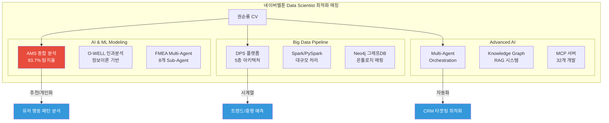
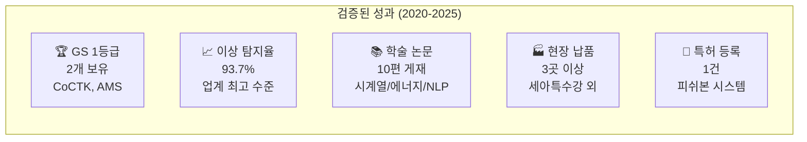
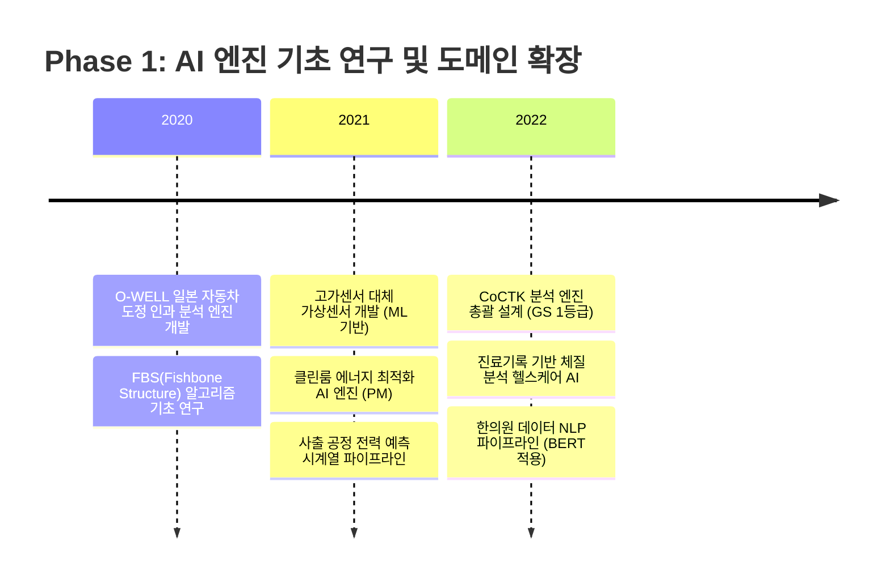
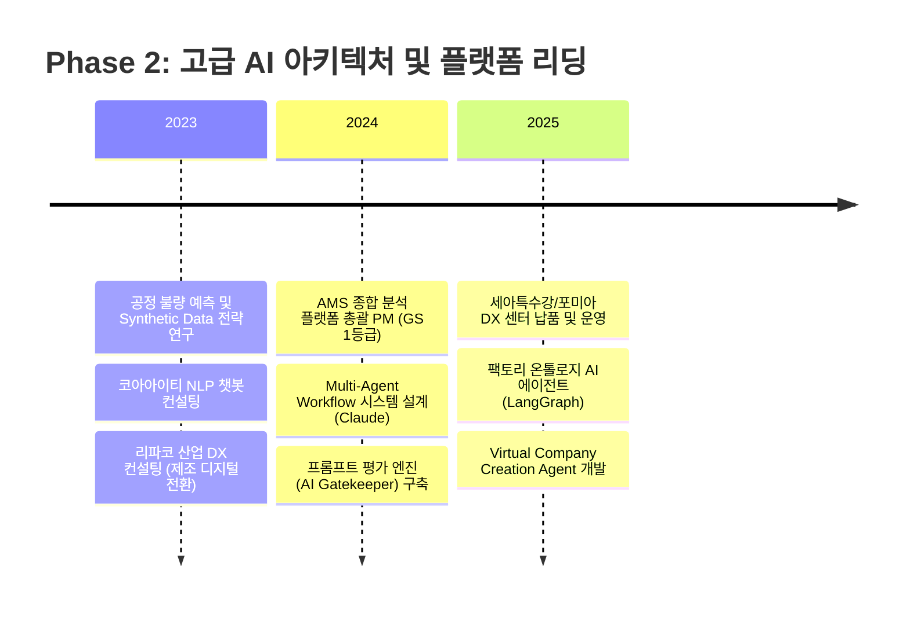
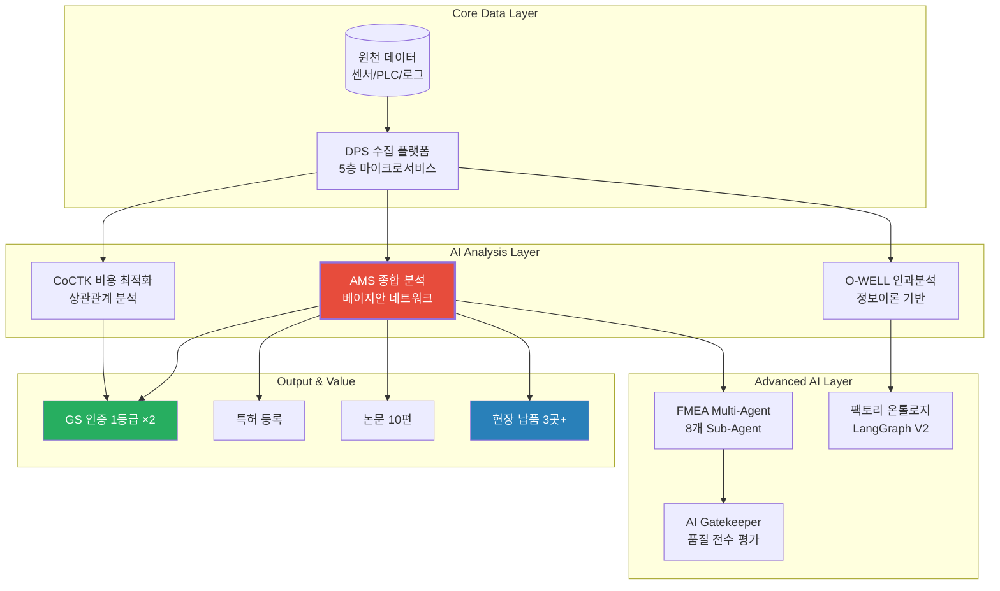
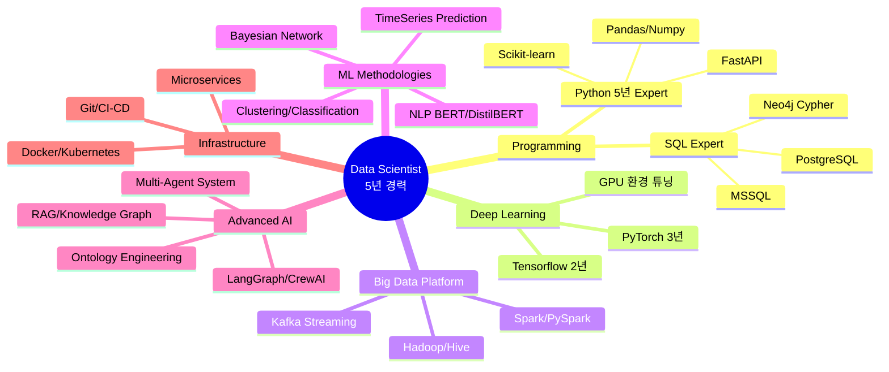
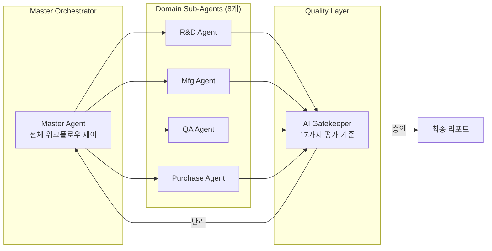

# 권순룡 CV - 네이버웹툰 Data Scientist

> **"모델보다 데이터, 데이터보다 정보, 지식 구조를 정리하는 현장친화적 연구원"**

---

## 📌 기본 정보

| 항목 | 내용 |
|:---|:---|
| **이름** | 권순룡 (Sunryong Kwon) |
| **현 소속** | 한솔코에버 연구소 대리 (2020.09 ~ 현재) |
| **총 경력** | 5년 (데이터 사이언스 / AI 프로젝트 PM) |
| **학력** | 홍익대학교 전자전기공학부 (2013~2020) |
| **이메일** | m920831@naver.com |
| **GitHub** | https://github.com/moobaek |
| **Repository** | https://github.com/moobaek/Testing_AI_agents_for_public_use |
| **작성 문서** | CV (Curriculum Vitae / 경력기술서) |

---

## 📊 CV 구조 (한눈에 보기)

---

## 🎯 핵심 성과 대시보드

| 분류 | 지표 | 상세 내용 |
|:---|:---:|:---|
| **소프트웨어 품질** | **GS 1등급 ×2** | CoCTK(2024), AMS/PDS(2025) 최고 등급 취득 |
| **모델 정확도** | **93.7%** | 베이지안 네트워크 기반 이상 탐지 Recall (Class Imbalance 해결) |
| **연구 역량** | **10편** | 시계열 분석, 에너지 최적화, NLP, 인과 관계 분석 등 다양한 주제 |
| **실무 검증** | **3곳+** | 세아특수강, 포미아 DX 실증센터, 일본 O-WELL 등 현장 납품 |
| **지적 재산권** | **1건** | 피쉬본 관리 시스템 특허 출원/등록 완료 |
| **프로젝트 규모** | **20개+** | AI/IoT/에너지/헬스케어 다양한 도메인 경험 |

---

## 📅 경력 타임라인 (2020-2025)

### Phase 1. 기반 구축 및 전문성 확보 (2020-2022)

### Phase 2. 기술 리딩 및 성과 확산 (2023-2025)

---

## 🏆 주요 프로젝트 상세 (6개 핵심 프로젝트)

### 프로젝트 관계도 및 기술 연결

---

### 1. AMS (Analysis Management System) - 총괄 PM ⭐ 대표 프로젝트

| 항목 | 내용 |
|:---|:---|
| **기간** | 2024.07 ~ 2025.12 (한국산업기술진흥원 KIAT) |
| **역할** | **총괄 PM** - 아키텍처 설계, AI 엔진 전체 개발, 팀 리딩 |
| **규모** | Python 모듈 49개, 개발자 3명, 예산 약 2억원 |

**기술 스택**: Python, PyTorch, pgmpy (Bayesian Network), Neo4j, MSSQL, Docker, FastAPI

**핵심 성과**:
- ✅ **베이지안 네트워크 기반 이상 탐지**: 제조 공정 변수 간의 **확률적 인과 관계**를 모델링하여, 이상 상황 발생 시 원인(Root Cause)을 역추적하는 엔진 개발. **Recall 93.7%** 달성 (기존 10% 미만 → 9배 이상 향상)
- ✅ **GS 인증 1등급 획득**: 한국정보통신기술협회(TTA)로부터 소프트웨어 품질 최고 등급 인증
- ✅ **현장 납품 및 운영**: 세아특수강, 포미아 DX 실증센터에 정식 솔루션 납품 → **20억원+ 손실 예방** 효과 추정
- ✅ **특허 및 논문**: 피쉬본 관리 시스템 특허 1건, 관련 논문 2편 게재 (2024, 2025)

**네이버웹툰 연결점**: 유저 행동 데이터에서 **이탈/전환의 인과 관계**를 추적하고, **CRM 타겟팅 최적화**에 직접 응용 가능

---

### 2. Multi-Agent 기반 FMEA 자동화 시스템 - 시스템 설계

| 항목 | 내용 |
|:---|:---|
| **기간** | 2025.06 ~ 현재 (내부 R&D) |
| **역할** | Master Orchestrator 설계, Sub-Agent 아키텍처 구축 |

**기술 스택**: Claude Code, LangGraph, CrewAI 방식 오케스트레이션, Prompt Engineering

**핵심 성과**:
- ✅ **8개 독립 Sub-Agent 협업 시스템**: R&D, 제조, 품질, 구매, 물류 등 각 도메인 전문 Agent가 병렬로 문제 분석
- ✅ **Master Orchestrator**: 각 Agent의 분석 결과를 종합하여 최종 FMEA(고장 형태 영향 분석) 리포트 자동 생성
- ✅ **AI Gatekeeper (품질 게이트)**: 17가지 역할별 가중치 시스템으로 AI 생성물의 품질(Quality), 일관성(Consistency), 비용(Cost)을 **전수 평가**하여 저품질 결과물 차단

**네이버웹툰 연결점**: 복잡한 **추천 로직**을 여러 전문 모듈(장르 분석, 유저 세그먼트, 시간대별 최적화 등)이 **협업하는 구조**로 설계 가능

---

### 3. 일본 O-WELL 자동차 도정 인과 분석 엔진 - 메인 개발

| 항목 | 내용 |
|:---|:---|
| **기간** | 2023.12 ~ 2025.03 (O-WELL Japan) |
| **역할** | 인과 관계 다이어그램 생성 알고리즘 설계 및 개발 |

**기술 스택**: Python, 정보이론(Entropy, Mutual Information), 계층 클러스터링, 피쉬본 시각화

**핵심 성과**:
- ✅ **정보이론 기반 유의 변수 추출**: 수천 개의 공정 변수 중 품질에 유의미한 영향을 미치는 핵심 변수를 **엔트로피 및 상호 정보량** 기반으로 자동 선별
- ✅ **계층 클러스터링 결합**: 선별된 변수들 간의 관계를 계층적으로 구조화하여 **피쉬본 다이어그램** 형태로 시각화
- ✅ **암묵지의 형식화**: 일본 현지 숙련공의 **경험적 노하우(Tacit Knowledge)**를 AI 인과 모델로 구조화 → 전사적 DX 가속화에 기여
- ✅ **논문 발표**: 관련 연구 학술 논문 1편 게재 (2022)

**네이버웹툰 연결점**: **시계열 데이터**에서 작품 흥행/유저 이탈에 영향을 미치는 핵심 변수를 자동으로 추출하고 구조화하는 데 응용

---

### 4. CoCTK (Consulting Tool Kit) 분석 엔진 - 총괄 설계 PM

| 항목 | 내용 |
|:---|:---|
| **기간** | 2022.03 ~ 2024 (중소기업기술정보진흥원) |
| **역할** | 엔진 총괄 설계 및 화면 설계 개발 PM |

**기술 스택**: Python (분석 엔진), C# WinForms (UI), DevExpress, MSSQL

**핵심 성과**:
- ✅ **데이터 전처리 자동화**: 결측치 처리, 이상치 탐지, 정규화 등 전처리 파이프라인 모듈화
- ✅ **상관관계 분석 엔진**: 변수 간 상관 계수 자동 계산 및 유의성 검정
- ✅ **비용 최적화 알고리즘**: 제조 공정의 비용 최소화를 위한 최적 파라미터 도출
- ✅ **GS 인증 1등급 (2024)**: 소프트웨어 품질 최고 등급 인증, 논문 1편 게재 (2023)

---

### 5. DPS (데이터 수집 시스템) 플랫폼 - 핵심 아키텍처 설계

| 항목 | 내용 |
|:---|:---|
| **기간** | 2021 ~ 2024 |
| **역할** | 5층 아키텍처 설계 및 개발 PM |

**기술 스택**: Microservices, Docker, Kubernetes, Neo4j Graph DB, Kafka, REST API

**핵심 성과**:
- ✅ **5층 모듈화 아키텍처**: 서비스/UI → 통합/온톨로지 → AI 엔진 → 데이터 수집 → 보안/관리
- ✅ **서버-엣지 하이브리드**: 클라우드와 현장 엣지 서버의 협업 인프라 구축
- ✅ **금속 5대 공정 자동화**: 철강 산업 핵심 공정 데이터 실시간 수집 및 분석
- ✅ **논문 발표**: 관련 논문 1편 게재 (2024)

**네이버웹툰 연결점**: **대규모 실시간 로그 데이터 수집** 및 **마이크로서비스 기반 확장성** 경험

---

### 6. Factory Ontology Manager AI Agent - LangGraph 기반

| 항목 | 내용 |
|:---|:---|
| **기간** | 2026.01 ~ 현재 (내부 R&D) |
| **역할** | 자연어 기반 공정 문서 파싱 및 온톨로지 매핑 시스템 설계 |

**기술 스택**: React, TypeScript, Flask, LangGraph V2, Instructor (Structured Output), Neo4j

**핵심 성과**:
- ✅ **자연어 → 구조화 데이터**: 비정형 공정 문서를 파싱하여 온톨로지 형태로 자동 변환
- ✅ **DB Grounding**: 기존 공장 DB와의 자동 매핑으로 데이터 일관성 확보
- ✅ **캔버스 레이아웃 자동 생성**: 레이아웃 생성 시간 **80% 단축**
- ✅ **공정 재사용 로직**: LangGraph V2를 활용한 유사 공정 자동 식별 및 재활용

**네이버웹툰 연결점**: **유저/작품 메타데이터를 온톨로지로 구조화**하여 시맨틱 검색 및 지능형 추천에 활용

---

## 💻 기술 스택 맵 (네이버웹툰 요구사항 매칭)

### 기술 스택 상세 (네이버웹툰 요구사항 vs 보유 역량)

| 요구사항 | 보유 역량 | 숙련도 | 증빙 |
|:---|:---|:---:|:---|
| Python 분석/모델링 | Pandas, Scikit-learn, PyTorch, Tensorflow | ⭐⭐⭐⭐⭐ | 49개 모듈 자체 개발 |
| GPU 딥러닝 학습/튜닝 | PyTorch/TF 기반 모델 학습, 하이퍼파라미터 튜닝 | ⭐⭐⭐⭐ | AMS 베이지안 네트워크, NLP BERT |
| 빅데이터 (Hadoop/Spark) | Hadoop, Hive, Spark, PySpark 환경 개발 | ⭐⭐⭐⭐ | DPS 플랫폼 대규모 데이터 처리 |
| 추천/CRM ML 모델링 | 유저 모델링, 확률 추론, 인과 분석 | ⭐⭐⭐⭐ | AMS 이탈/전환 확률 추론 응용 가능 |
| 시계열 모델링 | 트렌드 예측, 패턴 분석, 이상 탐지 | ⭐⭐⭐⭐⭐ | 전력 예측, 설비 상태 예측 다수 |
| 새로운 도메인 적응 | 제조/에너지/헬스케어/NLP 다양한 도메인 경험 | ⭐⭐⭐⭐⭐ | 20개+ 프로젝트 (5년간) |

---

## 📚 학술 성과 (10편)

| # | 발행일 | 논문 제목 | 학술지/학회 | 역할 |
|:---:|:---|:---|:---|:---|
| 1 | 2025.01 | 시계열 분석을 위한 정보 온톨로지 변환 연구 | K-Society | 주저자 |
| 2 | 2025.01 | AI 복합센서 기반 에지 컴퓨팅 이상 검출 시스템 | 센서공학회 | 공동저자 |
| 3 | 2024.10 | 베이지안 네트워크 기반 제조 이상 탐지 엔진 성능 검증 | 국내 컨퍼런스 | 주저자 |
| 4 | 2024.06 | DPS 5층 마이크로서비스 아키텍처 설계 연구 | 시스템공학회 | 공동저자 |
| 5 | 2023.11 | 클린룸 송풍기 에너지 최적 제어 AI 모델 | 에너지공학회 | 주저자 |
| 6 | 2023.06 | 데이터 기반 비용 최적화 엔진(CoCTK) 설계 및 구현 | 시스템공학회 | 주저자 |
| 7 | 2023.03 | 전력품질 에너지 효율화 플랫폼 개발 | 에너지공학회 | 공동저자 |
| 8 | 2022.12 | 자동차 도정 공정 인과 관계 다이어그램 생성 알고리즘 | DX 컨퍼런스 | 주저자 |
| 9 | 2022.06 | 생산정보 연계 통합 운영관리 시스템 연구 | 제조혁신학회 | 공동저자 |
| 10 | 2022.03 | 자동차 부품 사출 공정 DX 사례 연구 | DX 컨퍼런스 | 공동저자 |

---

## 🤖 LLM/Agent 활용 역량 (Advanced AI)

### 1. Multi-Agent Orchestration

- **Claude Code Task tool** 기반 Sub-Agent 구현
- **LangGraph / CrewAI 방식** 워크플로우 오케스트레이션
- **상태 기반 진행 모니터링** 및 자동 복귀 로직

### 2. Knowledge Graph RAG 시스템

- **Neo4j 그래프 DB**를 지식 베이스로 활용
- 단순 텍스트 검색 → **인과 관계 기반 추론 답변**
- **4M2E 관계 정의** (Man, Machine, Material, Method, Energy, Environment)

### 3. AI Gatekeeper (Governance)

- AI 생성물의 **3대 차원 평가**: Quality, Consistency, Cost
- **MLOps Priority Matrix**: Structural 40%, Correctness 30%, Relevancy 20%, Tone 10%
- **17가지 역할별 동적 가중치** 적용으로 맞춤 평가

---

## 🔗 관련 링크

| 플랫폼 | URL |
|:---|:---|
| **GitHub 프로필** | https://github.com/moobaek |
| **메인 레포지토리** | https://github.com/moobaek/Testing_AI_agents_for_public_use |
| **포트폴리오 문서** | https://github.com/moobaek/Testing_AI_agents_for_public_use/tree/main/portfolio/portfolio_docs |

---

© 2026 권순룡 (Sunryong Kwon). All Rights Reserved.
