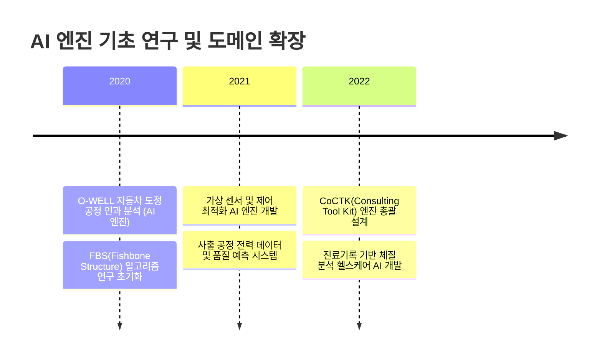
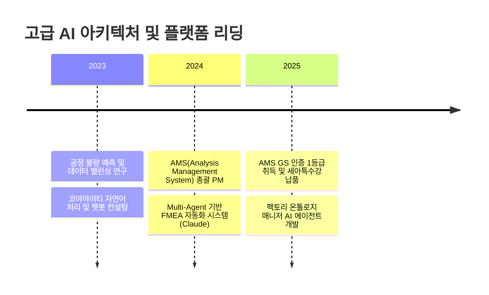
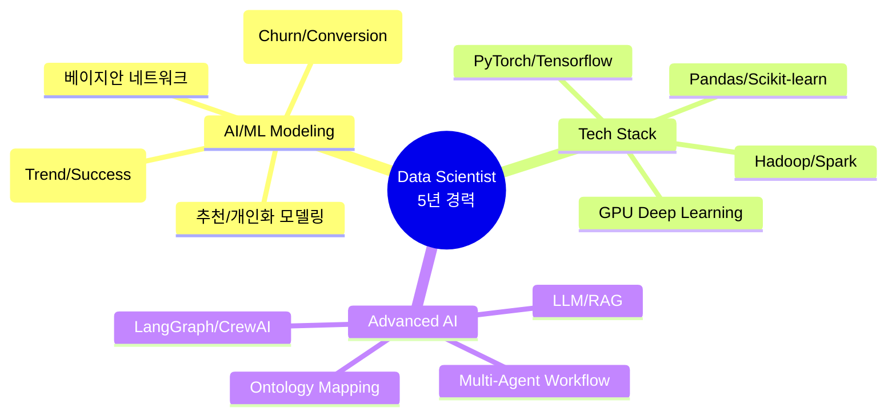
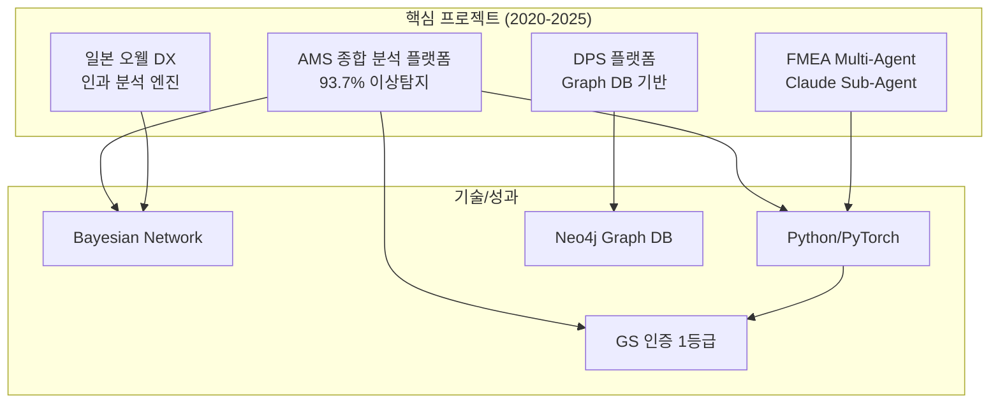
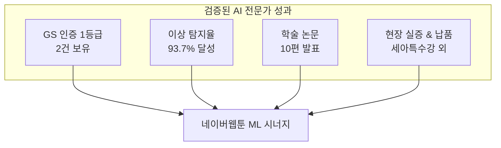

# 권순룡 이력서

## 기본 정보

**이름**: 권순룡
**현 소속**: 한솔코에버 연구소 대리
**총 경력**: 5년 (2020~2025)
**GitHub**: https://github.com/moobaek
**Repository**: https://github.com/moobaek/Testing_AI_agents_for_public_use
**핵심 역량**: 추천시스템 및 CRM ML 모델링, 개인화 연구 개발, 시계열 예측 모델링, 유저 행동 패턴 분석 (이탈/전환 추론), GPU 기반 딥러닝 튜닝

---

## 한눈에 보는 경력 (2020-2025)

### Phase 1. 2020-2022

### Phase 2. 2023-2025

---

## 지원 동기

5년간 제조 및 다양한 도메인의 데이터를 다루며 "데이터를 정보로, 정보를 지식 구조로" 전환하는 과정에서 현장 친화적인 AI 모델링 역량을 쌓아왔습니다. 특히 AMS 프로젝트를 총괄하며 베이지안 네트워크 기반의 이상 탐지 엔진을 개발하여 93.7%의 높은 정확도를 달성하고, 이를 실제 산업 현장에 정식 납품하여 비즈니스 가치를 증명하였습니다.

네이버웹툰의 ML Modeling 조직에서 수행하는 추천 시스템 및 CRM 타겟팅 연구는 제가 5년간 집중해온 "유저의 행동 패턴 속에서 의미 있는 인과 관계를 찾아내는 일"과 맞닿아 있습니다. 시계열 모델링을 통해 작품의 흥행을 예측하거나, 유저 모델링을 통해 이탈 및 전환 확률을 추론하는 업무는 제가 AMS와 일본 오웰 프로젝트에서 수행했던 확률 최적화 및 인과 구조 분석 노하우를 발휘할 수 있는 최고의 무대라고 생각합니다. No.1 Story Tech Platform인 네이버웹툰에서 저의 기술적 전문성을 바탕으로 글로벌 유저들에게 더 나은 개인화 경험을 제공하는 데 기여하고 싶습니다.

---

## 핵심 역량 맵

---

## 핵심 역량

### 1. 개인화 추천 및 유저 행동 패턴 분석
데이터 간의 복잡한 인과 관계를 규명하고 이를 확률 모델로 정립하는 데 탁월한 역량을 보유하고 있습니다. 베이지안 네트워크를 활용하여 이상 상황의 확률 경로를 추적하는 엔진을 개발하였으며, 이는 네이버웹툰의 유저 모델링 및 CRM 타겟팅에서 이탈과 전환의 핵심 트리거를 분석하는 데 직접적으로 응용될 수 있습니다.

### 2. 시계열 기반 예측 모델링 및 AI 오케스트레이션
공정 트렌드와 설비 상태를 예측하는 시계열 파이프라인을 구축하여 효율 20% 향상을 달성한 바 있습니다. 최근에는 Claude Sub-Agent 기반의 Multi-Agent 아키텍처를 도입하여 복잡한 도메인 지식 파싱과 의사결정을 자동화하는 오케스트레이션 플랫폼을 설계하였습니다. 이러한 역량은 웹툰 콘텐츠의 흥행 패턴 예측과 복합적인 추천 로직 안정화에 기여할 것입니다.

---

## 프로젝트 관계도

---

## 경력 개요

### 한솔코에버 (2020.09 ~ 현재)
**직급**: 연구소 대리
**주요 업무**:
- AI 기반 데이터 분석 플랫폼(AMS, CoCTK) 엔진 총괄 설계 및 개발
- 제조/에너지/헬스케어 도메인 특화 ML/DL 예측 모델 연구
- Multi-Agent 및 LLM 기반 파이프라인 자동화 도구 구축

**성과**:
- GS 인증 1등급 취득 2건 (AMS, CoCTK)
- 이상 탐지율 93.7% 달성 및 세아특수강, 포미아 등 정식 납품
- 학술 논문 10편 발표 및 관련 특허 등록

---

## 주요 프로젝트 경험

### 1. AMS (Analysis Management System) 개발 - 총괄 PM
**기간**: 2024.07 ~ 2025.03
**발주처**: 한국산업기술진흥원
**역할**: AI 엔진 총괄 설계 및 PM

**핵심 성과**:
- ✅ **확률 기반 이상 탐지 엔진**: 베이지안 네트워크를 이용한 이상 상황 확률 경로 분석으로 93.7%의 탐지 정확도 확보
- ✅ **GS 인증 1등급**: 소프트웨어 품질 최고 등급 획득을 통한 기술 신뢰성 입증
- ✅ **비즈니스 가치 증명**: 세아특수강, 포미아 DX 실증센터에 정식 솔루션 납품 및 운영 성공

### 2. Multi-Agent 기반 FMEA 자동화 시스템 - 시스템 설계
**기간**: 2025.06 ~ 현재
**역할**: Master Orchestrator 설계 및 개발

**핵심 성과**:
- ✅ **Claude Sub-Agent 구현**: 8개의 독립 에이전트가 협업하는 Multi-Agent Workflow를 구축하여 복잡한 프로세스 분석 자동화
- ✅ **프롬프트 평가 엔진**: AI 생성물의 품질(Quality), 일관성(Consistency), 비용(Cost)을 전수 평가하는 Gatekeeper 시스템 구축

### 3. 일본 O-WELL社 자동차 도정 인과 분석 - 메인 개발
**기간**: 2023.12 ~ 2025.03
**발주처**: O-WELL (Japan)
**역할**: 인과 관계 다이어그램 AI 엔진 설계

**핵심 성과**:
- ✅ **정보량 기반 패턴 선택**: 정보이론 기반 최적 패턴 선택 알고리즘과 계층 클러스터링을 결합한 유의 변수 분석 엔진 개발
- ✅ **글로벌 DX 적용**: 자동차 도정 공정의 숙련공 지식을 AI 인과 모델로 구조화하여 전사적 DX 가속화 기여

---

## 기술 스택

### Programming Languages
- **Python**: 5년 (데이터 분석, ML/DL 모델링, 49개 모듈 자체 개발)
- **SQL**: MSSQL, PostgreSQL, Neo4j Cypher 쿼리 숙련

### AI/ML Frameworks & Tools
- **Deep Learning**: PyTorch, Tensorflow, GPU기반 모델 튜닝
- **Data Science**: Pandas, Scikit-learn, Numpy, Pgmpy (Bayesian)
- **Big Data**: Hadoop, Hive, Spark, PySpark 환경 분석 경험
- **AI Agent**: LangGraph, CrewAI, MCP (Model Context Protocol)
- **Infrastructure**: Docker, Kubernetes, Git, CI/CD 파이프라인

---

## 성과 대시보드

---

## 학력 및 자격증

### 학력
**홍익대학교 전자전기공학부** (2013.03 - 2020.02)
- 졸업논문: LD 동격회로 설계 및 PLL 설계
- 주요 이수: 전파공학, 컴퓨터공학, 인공지능 기초

### 자격증
**OPIc ACT FL** (2019.03)

---

## 핵심 철학

> **"모델보다 데이터, 데이터보다 정보, 지식 구조를 정리하는 현장친화적 연구원"**

데이터의 단순 처리를 넘어 그 속에 숨겨진 의미론적 맥락을 파악하고, 비즈니스 목표에 부합하는 지식 구조를 설계하는 것을 핵심 가치로 삼습니다.

---

## 자기소개서

### 지원 동기
5년간 AI 모델 학습/평가와 AI 에이전트 시스템 개발을 통해 "데이터를 정보로, 정보를 지식으로" 전환하는 과정에서 임팩트 있는 성과를 거두어 왔습니다. 특히 AMS 프로젝트에서 베이지안 네트워크를 활용해 이상 탐지율 93.7%를 달성하고 GS 인증 1등급을 획득한 경험은, 복잡한 유저 행동 데이터에서 의미 있는 패턴을 추출해야 하는 네이버웹툰의 ML Modeling 직무와 높은 정합성을 가집니다.

네이버웹툰은 수억 명의 유저가 만들어내는 방대한 데이터를 바탕으로 초개인화된 추천 서비스를 제공하는 글로벌 플랫폼입니다. 저는 제가 경험한 Neo4j 기반 지식 그래프 구조 설계 역량과 Multi-Agent 시스템 구축 기술을 바탕으로, 단순한 알고리즘 고도화를 넘어 유저의 콘텐츠 소비 맥락을 완전히 이해하는 '지능형 추천 엔진'을 구축하고 싶습니다. 저의 기술적 집요함과 비즈니스 가치 창출 능력을 네이버웹툰이라는 거대한 캔버스 위에서 펼쳐 보이고 싶어 지원하였습니다.

### 연구 분야 및 목표
저의 주된 관심 분야는 '인과 추론을 결합한 확률적 유저 모델링'입니다. 기존의 확률적 추천 방식에 도메인 온톨로지와 인과 관계 분석을 결합하여, "왜 이 유저에게 이 작품이 추천되어야 하는가"에 대한 설명 가능한 AI(XAI) 구조를 만드는 것이 저의 연구 목표입니다. 이를 위해 최근에는 LangGraph와 Multi-Agent 아키텍처를 연구하며, 복합적인 데이터 소스를 유기적으로 통합하는 오케스트레이션 시스템을 고도화하고 있습니다.

입사 후 1년 내에는 네이버웹툰의 방대한 시계열 데이터를 완벽히 파싱하여 작품 흥행 예측 모델의 정확도를 유의미하게 향상하겠습니다. 장기적으로는 유저의 라이프사이클(가입-활동-이탈-복귀)을 온톨로지로 구조화하여, 각 세그먼트별로 최적화된 마케팅 액션을 제안하는 '자율 주행형 CRM 엔진'을 구축하여 네이버웹툰이 Story Tech 분야에서 기술적 초격차를 유지하는 데 핵심적인 역할을 수행하겠습니다.

### 주요 프로젝트 경력
가장 대표적인 경력은 KIAT 주관의 'AMS(Analysis Management System) 개발' 프로젝트입니다. 이 프로젝트에서 저는 총괄 PM으로서 데이터 수집부터 전처리, 이상 탐지, FMEA(고장 형태 영향 분석) 자동 생성까지의 전체 파이프라인을 Python으로 직접 설계하고 구현하였습니다. 특히 통계적 유의 변수 추출과 베이지안 네트워크를 결합하여 제조 현장의 복잡한 인과 관계를 시각화하고, 93.7%의 탐지 정확도를 확보하여 GS 1등급 인증을 획득하였습니다.

또한, 'Claude Sub-Agent 기반 FMEA 자동화 시스템' 개발을 통해 최신 AI 트렌드인 Agentic Workflow를 현업에 적용하였습니다. 8개의 독립된 서브 에이전트가 각기 다른 도메인(연구개발, 제조, 품질)을 담당하여 문제를 분석하고, Master Orchestrator가 이를 통합하여 최종 리스크 리포트를 생성하는 구조를 설계하였습니다. 이 과정에서 프롬프트의 품질과 비용을 자동 평가하는 Gatekeeper 시스템을 구축하여 AI 서비스의 안정성을 확보한 바 있습니다.

### 문제 해결 경험
AMS 개발 과정에서 '극심한 데이터 불균형(Class Imbalance)' 문제로 인해 이상 탐지 모델의 정합성이 떨어지는 위기에 봉착했습니다. 정상 데이터는 방대했으나 실제 이상 샘플은 극소수였기에, 일반적인 학습 방식으로는 모델이 모든 상황을 정상으로 판단하는 편향이 발생했습니다.

이를 해결하기 위해 저는 단순히 샘플링 기법에 의존하지 않고, 물리적 인과 관계를 반영한 '합성 데이터 생성(Synthetic Data Generation)' 전략을 도입했습니다. 설비의 물리적 한계치를 시뮬레이션하고, 베이지안 네트워크의 조건부 확률 분포를 활용하여 논리적으로 타당한 가상의 이상 시나리오 데이터를 생성했습니다. 결과적으로 데이터 밸런스를 1:1에 가깝게 조정할 수 있었으며, 이는 최종적으로 이상 탐지율 93.7% 달성이라는 성량적 성과로 이어졌습니다. 이 경험을 통해 데이터의 양보다 중요한 것은 '데이터의 구조적 이해'라는 점을 깊이 깨닫게 되었습니다.

© 2026 권순룡. All Rights Reserved.
