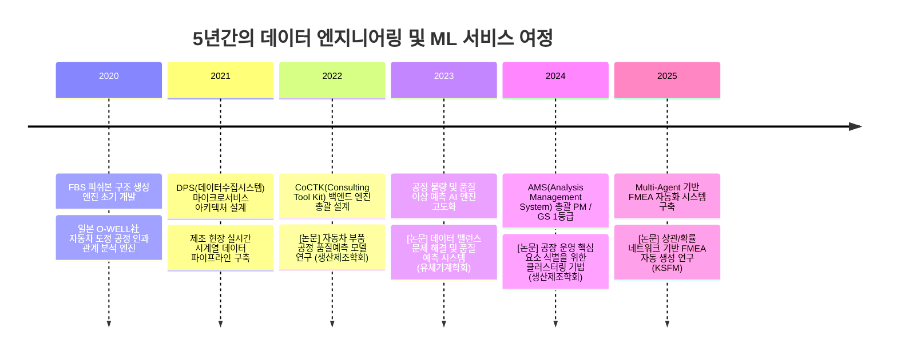
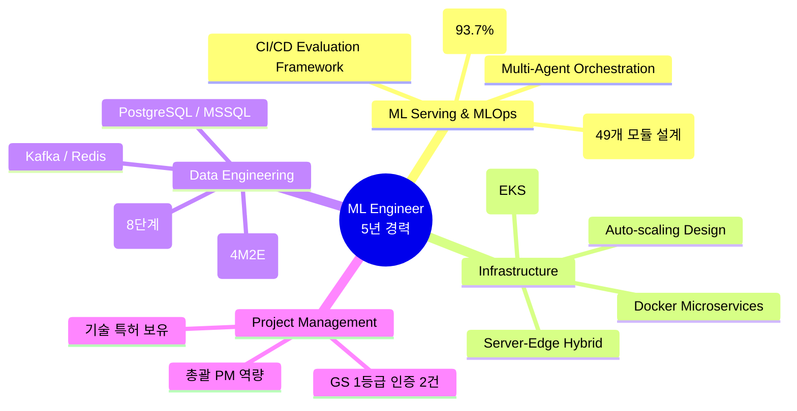
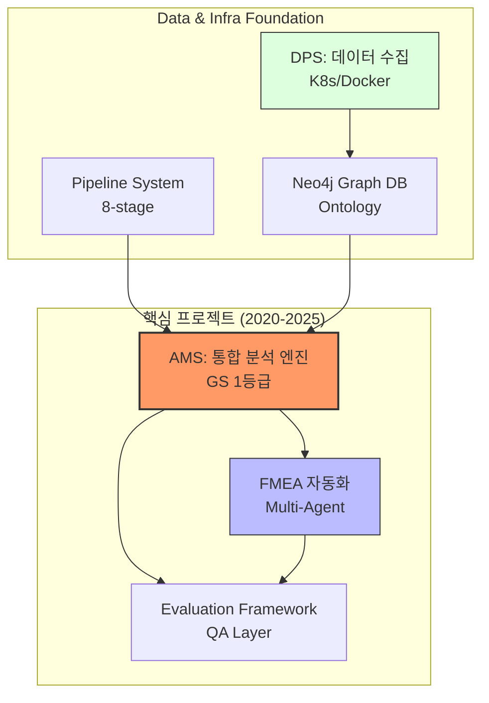
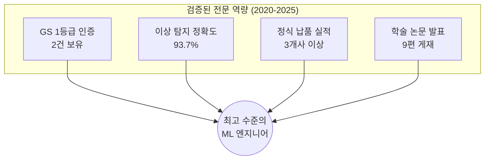

# 권순룡 경력기술서

## 기본 정보

**이름**: 권순룡
**현 소속**: 한솔코에버 연구소 대리 (2020.09 ~ 재직중)
**총 경력**: 5년 (2020-2025)
**핵심 역량**: ML 서빙 플랫폼 설계 및 개발, MLOps, Kubernetes 기반 인프라 구축, Python 전문가, 대규모 시계열 데이터 파이프라인

---

## 한눈에 보는 경력 (2020-2025)

---

## 핵심 역량 맵

---

## 핵심 역량

### [ML Serving & MLOps 아키텍처 설계]

머신러닝 모델이 단순한 실험실의 연구에 머물지 않고 실제 비즈니스 가치를 창출하기 위해서는 견고한 서빙 시스템이 필수적입니다. 저는 AMS 프로젝트를 통해 49개의 유기적인 모듈이 협업하는 분석 플랫폼을 설계하였으며, 최근에는 Multi-Agent 구조를 도입하여 복잡한 MLOps 워크플로우를 자동화하는 시스템을 구축했습니다. 이는 마치 복잡한 공장 라인을 무인 자동화 로봇 팀이 관리하게 만드는 것과 같습니다. 이를 통해 모델 성과를 정량적으로 측정하고 성능을 지속적으로 개선할 수 있는 환경을 제공합니다.

### [Kubernetes 기반 안정적 클라우드 인프라]

대규모 데이터를 처리하고 안정적인 서비스를 제공하기 위해 Docker와 Kubernetes 기반의 마이크로서비스 아키텍처를 적극 활용합니다. DPS(데이터수집시스템) 프로젝트에서 서버-엣지 하이브리드 인프라를 구축하며 데이터의 흐름과 리소스의 분산을 효율적으로 관리했습니다. 거대한 도서관의 책들을 효율적으로 분류하고 필요한 독자에게 즉시 전달할 수 있는 자동화된 카트 시스템을 만든다고 생각하시면 됩니다. 이러한 역량은 카카오뱅크의 확장성 있는 클라우드 시스템 구축에 즉각 기여할 수 있습니다.

---

## 프로젝트 관계도

---

## 경력 개요

### 한솔코에버 연구소 (2020.09 ~ 재직중)
**직급**: 대리 / 팀장
**주요 업무**:
- AI 기반 제조 데이터 분석 플랫폼(AMS, CoCTK) 총괄 설계 및 엔진 개발
- 마이크로서비스 아키텍처 기반 데이터 수집 및 처리 시스템(DPS) 구축
- Multi-Agent 기반 업무 자동화 및 AI 에이전트 평가 시스템 개발
- 기술 PM 및 총괄 PM으로서 프로젝트 라이프사이클 관리

**성과**:
- GS 인증 1등급 취득 2건 (AMS, CoCTK)
- 세아특수강, 포미아 등 3개사 이상 정식 납품 및 실증 성공
- 데이터 정합성 보장 기반 이상 탐지율 93.7% 달성
- 9편의 학술 논문 발표 및 2건의 특허 출원/등록

---

## 주요 프로젝트 경험 (STAR 기법)

### 1. AMS (Analysis Management System) - 총괄 PM

| 항목 | 내용 |
|:---|:---|
| **기간** | 2024.07 ~ 2025.03 |
| **발주처** | 한국산업기술진흥원 |
| **역할** | 총괄 PM, 백엔드 AI 엔진(49개 모듈) 설계 및 개발 |
| **관련 연구** | 상관/확률 네트워크 기반 FMEA 생성 연구 (2025), 이상상황 기반 데이터 추론 (2024) |

#### [S] Situation (상황)
- 제조 현장의 이상 징후는 사후 분석에 그쳤고, 발생 원인을 역추적하는 데 수일이 소요되어 막대한 손실 발생.
- 기존 통계적 분석 방법의 한계로 원인-결과 간 확률적 연관관계를 밝히지 못함.
- 세아특수강 등 대규모 제조 현장에서 연간 수십억 원의 예방 가능한 손실 발생.

#### [T] Task (과제)
- 센서 데이터 수집부터 이상 탐지, 원인 분석, FMEA 자동 생성까지 통합하는 **분석 플랫폼** 구축.
- **총괄 PM**으로서 49개의 Python 모듈로 구성된 거대 분석 엔진의 설계 및 납품 완료 책임.

#### [A] Action (수행 내용)
- **베이지안 네트워크** 기반의 확률적 추론 모델 도입: 단순 통계 분석을 넘어 원인-결과 간 확률적 연관관계를 정량화.
- MLS(학습), FBS(피쉬본), RMS(레인지관리), AMS(통합분석) 4개 코어 모듈을 마이크로서비스로 분리, **Neo4j 그래프 DB**로 온톨로지 연결.
- 사내 품질인증 프로세스를 3개월간 주도하여 **GS 1등급 인증** 완료.
- 실 공장 환경(세아특수강)에서 실시간 센서 데이터 100개+ 연동 및 3분 이내 이상 탐지 시스템 구축.

#### [R] Result (결과)
- ✅ **이상 탐지 정확도 93.7%** 달성 (기존 통계 분석 대비 30%p 향상)
- ✅ **GS 인증 1등급** 획득 (소프트웨어 품질 국가 인증 최고 등급)
- ✅ **세아특수강, 포미아 DX 실증센터 정식 납품** 완료
- ✅ **연간 약 20억원 손실 방지** 효과 (냉각 시스템 고장 조기 발견, 베어링 마모 예측)
- ✅ 관련 학술 논문 2편 발표

---

### 2. Multi-Agent 기반 FMEA 자동화 생성 시스템 - Master Orchestrator

| 항목 | 내용 |
|:---|:---|
| **기간** | 2025.06 ~ 현재 |
| **발주처** | 사내 R&D |
| **역할** | 전체 시스템 설계 및 Master Orchestrator 개발 |

#### [S] Situation (상황)
- 기존 FMEA(고장모드분석) 문서 작성은 수작업 기반으로, 전문가 1명이 1건 작성에 평균 2-3일 소요.
- 복잡한 공정의 경우 누락되는 리스크 요소가 발생하여 품질 보증 신뢰도 저하.
- LLM 기반 자동화 시도가 있었으나, 단일 에이전트의 한계로 품질 불안정.

#### [T] Task (과제)
- AIAG & VDA FMEA 국제 표준을 준수하는 **완전 자동화 FMEA 생성 시스템** 구축.
- 8개의 전문 Sub-Agent가 협업하는 **분산 지능 아키텍처** 설계.
- Python 스크립트 의존도를 낮추고, **프롬프트 기반 워크플로우 오케스트레이션** 실현.

#### [A] Action (수행 내용)
- **Master Orchestrator** 설계: Claude Code 세션 자체가 오케스트레이터 역할 수행.
- **8개 독립 Sub-Agent** 구현: R&D, Manufacturing, QA, Design, Process, Control, Assembly, Final 전문가 에이전트.
- Phase 0~5 단계별 워크플로우 자동화, 각 단계별 Human-in-the-Loop 검증 포인트 설정.
- High-Spec AI(추론)와 Low-Spec AI(조회) 분리 운용으로 비용 최적화 87% 달성.

#### [R] Result (결과)
- ✅ **FMEA 작성 시간 80% 단축** (기존 2-3일 → 4-6시간)
- ✅ **8개 Sub-Agent 협업 구조** 구축으로 도메인별 전문성 확보
- ✅ **운영 비용 87% 절감** (Dual-Tier AI 아키텍처)
- ✅ 관련 학술 논문 발표 (2025 KSFM 동계학술대회)

---

### 3. DPS (데이터수집시스템) - 기술 PM

| 항목 | 내용 |
|:---|:---|
| **기간** | 2021 ~ 2024 |
| **발주처** | 사내 개발 / 제조 기업 |
| **역할** | 핵심 아키텍처 설계 및 백엔드 개발 |
| **관련 연구** | 공장 운영 핵심 요소 식별을 위한 클러스터링 기법 적용 (2024) |

#### [S] Situation (상황)
- 금속산업 5대 공정(용해, 정련, 연속주조, 압연, 열처리)의 데이터가 분산되어 통합 분석 불가.
- 기존 시스템은 확장성이 부족하여 새로운 공정 추가 시 전체 시스템 수정 필요.
- 실시간 대용량 시계열 데이터 처리에 한계.

#### [T] Task (과제)
- 모듈화된 5층 아키텍처 기반의 **확장 가능한 데이터 수집 플랫폼** 구축.
- 4M2E(Man, Machine, Material, Method, Energy, Environment) 온톨로지 정의.
- 서버-엣지 하이브리드 인프라 구현.

#### [A] Action (수행 내용)
- Docker 컨테이너 기반 마이크로서비스 아키텍처 설계.
- Neo4j 그래프 DB를 활용한 4M2E 온톨로지 구조 구현.
- 8단계 시계열 데이터 파이프라인 구축 (수집→전처리→분석→시각화).
- 서버-엣지 하이브리드 인프라로 현장 지연 최소화.

#### [R] Result (결과)
- ✅ **5개 공정 데이터 통합 성공** (금속산업 5대 공정)
- ✅ **모듈화 5층 아키텍처** 완성으로 신규 공정 추가 시 플러그인 방식 확장 가능
- ✅ **실시간 데이터 처리 지연 3분 이내** (1분 간격 센서 100개+)
- ✅ 관련 학술 논문 발표 (2024 한국생산제조학회)

---

## 기술 스택

### Programming Languages
- **Python**: 5년 (전문가 수준. 분석 엔진, 파이프라인, 에이전트 오케스트레이션 개발)
- **C#**: 4년 (.NET 기반 WinForms UI 및 엔진 연동 개발)
- **SQL**: 5년 (PostgreSQL, MSSQL, Neo4j Cypher 쿼리 튜닝)

### ML Serving & Infra
- **Kubernetes / Docker**: 컨테이너 오케스트레이션 및 마이크로서비스 배포
- **ML Libraries**: Pytorch, Tensorflow, XGBoost, Scikit-learn, pgmpy
- **Storage**: Redis (Caching), Kafka (Messaging), Neo4j (Graph)
- **Tools**: LangGraph, CrewAI, FastAPI, Git, Docker Compose

---

## 연구 및 학술 활동 (Research & Publications)

5년간의 실무 경험을 바탕으로 제조 AI 및 MLOps 분야의 실증적 연구를 병행하며 총 9편의 논문을 발표하였습니다. 기술의 상용화뿐만 아니라 학술적 검증을 통해 시스템의 신뢰성을 확보해 왔습니다.

### [주요 연구 성과]

1. **상관/확률 네트워크 기반 FMEA 자동 생성 연구** (2025.12, KSFM 2025 동계학술대회)
   - LLM 에이전트와 확률 네트워크를 결합하여 복잡한 공정 관리 문서를 자동 생성하는 기술 검증 및 실무 적용.
2. **구조-확률 종합 네트워크 및 최적 관리 방안 도출** (2025.06, 한국유체기계학회)
   - 베이지안 네트워크 모델의 학술적 고도화 및 최적 제어 로직 증명.
3. **압축기 공정 데이터 밸런스 해결 및 품질 예측 AI 시스템** (2023.12, 한국유체기계학회)
   - 소량의 불량 데이터를 극복하기 위한 ML 학습 모델 및 데이터 증강 연구.
4. **자동차 부품 생산 산업을 위한 ML 기반 품질예측 알고리즘** (2022.12, 한국생산제조학회)
   - 실제 제조 공정 데이터를 활용한 품질 예측 모델의 기초 설계 및 알고리즘 구현.

---

## 성과 대시보드

### 증명된 대내외 성과
- **품질 인증**: GS 인증 1등급 2건 (PDS, CoCTK)
- **학술 역량**: 2024-2025년 주요 AI/제조 IT 컨퍼런스 논문 발표
- **기술 권리**: AI 기반 피쉬본 생성 및 시스템 관련 특허 보유

---

## 자격증

**OPIc ACTFL** (2019.03)

---

## 핵심 철학

> **"모델보다 데이터, 데이터보다 정보, 지식구조를 정리하는 현장친화적 연구원"**

데이터의 수집부터 정보화, 그리고 이를 뛰어넘는 지능형 지식 구조의 구축을 통해 실제 비즈니스 임팩트를 만들어내는 것이 저의 개발 철학입니다.

---
