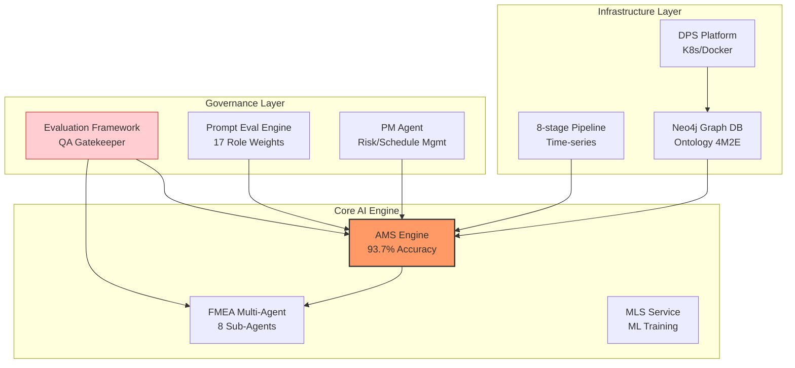
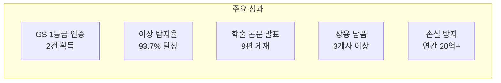
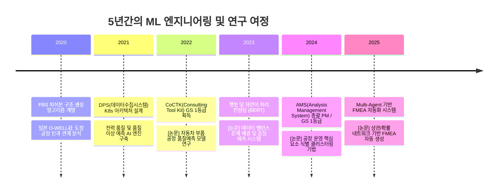
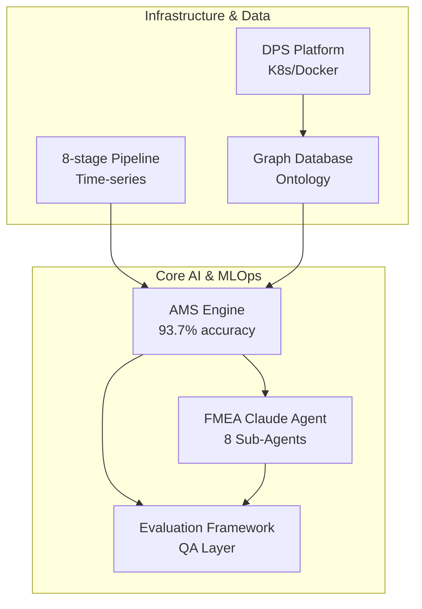
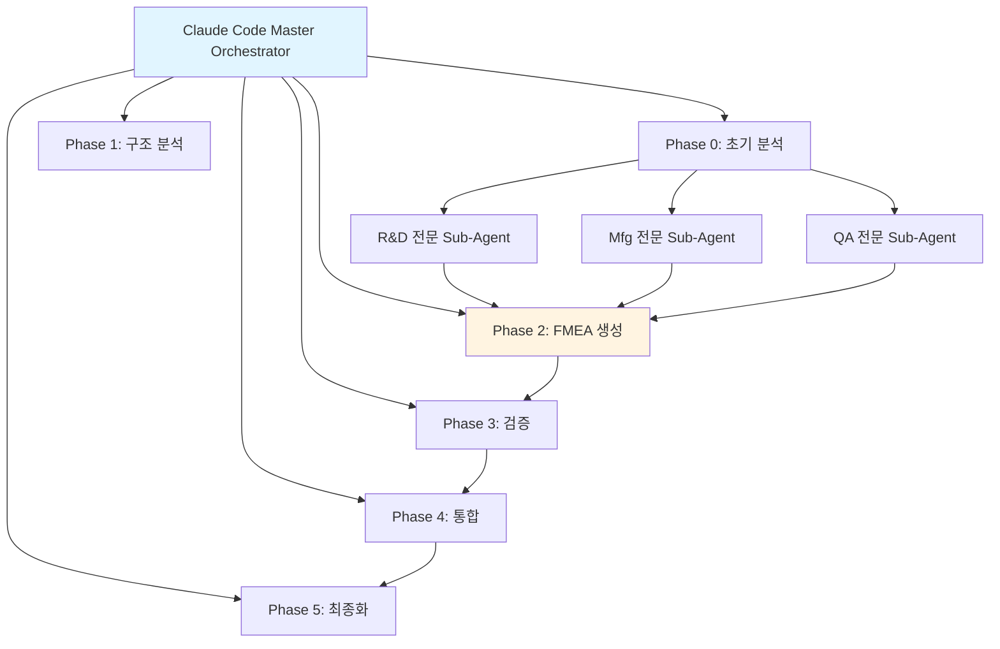
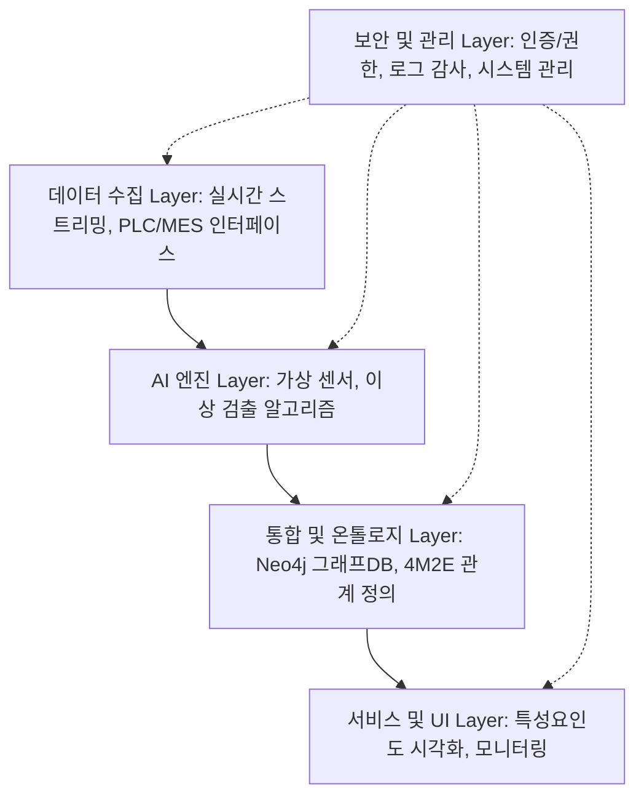
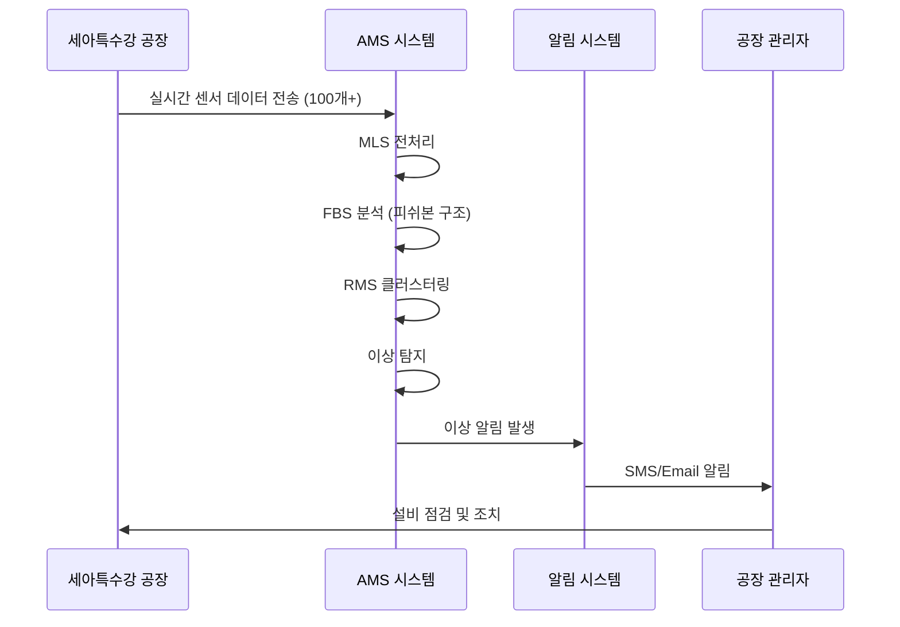
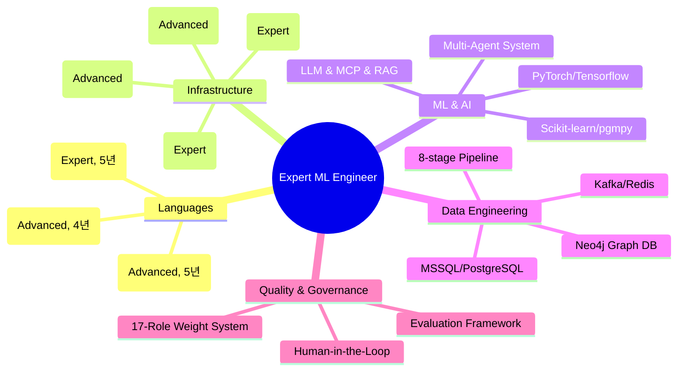
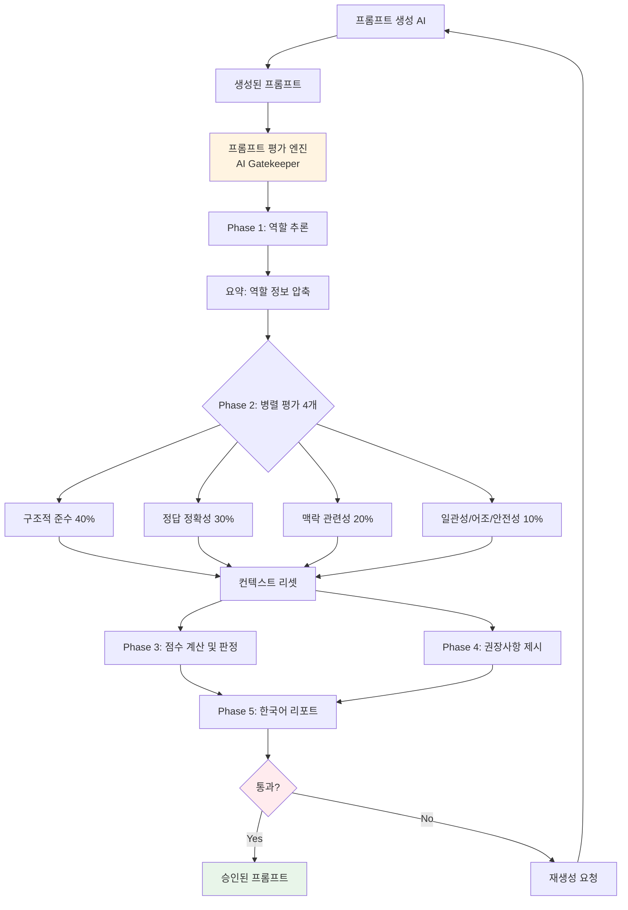

# 권순룡 통합 포트폴리오

> **"모델보다 데이터, 데이터보다 정보, 지식구조를 정리하는 현장친화적 연구원"**

---

## 📌 기본 정보

**이름**: 권순룡
**현 소속**: 한솔코에버 연구소 대리 (2020.09 ~ 재직중)
**GitHub**: [https://github.com/moobaek](https://github.com/moobaek)
**이메일**: m920831@naver.com

---

## 📊 포트폴리오 구조 (한눈에 보기)

---

## 🎯 핵심 성과 대시보드

| 분류 | 지표 | 상세 |
|:---|---:|:---|
| **소프트웨어 품질** | GS 1등급 | CoCTK, AMS(PDS) 솔루션 품질 인증 1등급 획득 |
| **분석 정밀도** | 93.7% | 베이지안 네트워크 기반 이상 탐지 정확도 (세아특수강 실증) |
| **연구 성과** | 9편 | 2021-2025년 AI/제조 IT 분야 주요 컨퍼런스 논문 발표 |
| **비즈니스 임팩트** | 3+ 납품 | 세아특수강, 포미아 등 주요 고객사 정식 도입 및 실증 |
| **손실 방지 효과** | 20억+ | 이상 조기 탐지를 통한 연간 예상 손실 방지 금액 |

---

## 📅 경력 타임라인 (2020-2025)

---

## 🏆 주요 프로젝트 상세 (STAR 기법)

### 프로젝트 관계도

---

### 1. AMS (Analysis Management System) - 총괄 PM

| 항목 | 내용 |
|:---|:---|
| **기간** | 2024.07 ~ 2025.03 |
| **발주처** | 한국산업기술진흥원 |
| **역할** | 총괄 PM, 백엔드 AI 엔진(49개 모듈) 설계 및 개발 |
| **핵심 기술** | Python, Bayesian Network (pgmpy), Scikit-learn, MSSQL, Neo4j |

#### [S] Situation (상황)
- 제조 현장의 이상 징후는 사후 분석에 그쳤고, 발생 원인을 역추적하는 데 수일이 소요되어 막대한 손실 발생.
- 기존 통계적 분석 방법의 한계로 원인-결과 간 확률적 연관관계를 밝히지 못함.
- 세아특수강 등 대규모 제조 현장에서 연간 수십억 원의 예방 가능한 손실 발생.

#### [T] Task (과제)
- 센서 데이터 수집부터 이상 탐지, 원인 분석, FMEA 자동 생성까지 통합하는 **분석 플랫폼** 구축.
- **총괄 PM**으로서 49개의 Python 모듈로 구성된 거대 분석 엔진의 설계 및 납품 완료 책임.
- MLS(학습), FBS(피쉬본), RMS(레인지관리), AMS(통합분석) 4개 코어 모듈 개발.

#### [A] Action (수행 내용)
- **베이지안 네트워크** 기반의 확률적 추론 모델 도입: 단순 통계 분석을 넘어 원인-결과 간 확률적 연관관계를 정량화.
- MLS, FBS, RMS, AMS 4개 코어 모듈을 마이크로서비스로 분리, **Neo4j 그래프 DB**로 온톨로지 연결.
- 사내 품질인증 프로세스를 3개월간 주도하여 **GS 1등급 인증** 완료.
- 실 공장 환경(세아특수강)에서 실시간 센서 데이터 100개+ 연동 및 3분 이내 이상 탐지 시스템 구축.

#### [R] Result (결과)
- ✅ **이상 탐지 정확도 93.7%** 달성 (기존 통계 분석 대비 30%p 향상)
- ✅ **GS 인증 1등급** 획득 (소프트웨어 품질 국가 인증 최고 등급)
- ✅ **세아특수강, 포미아 DX 실증센터 정식 납품** 완료
- ✅ **연간 약 20억원 손실 방지** 효과 (냉각 시스템 고장 조기 발견, 베어링 마모 예측 등)
- ✅ 관련 학술 논문 2편 발표 (2024, 2025 한국유체기계학회/KSFM)

---

### 2. Multi-Agent 기반 FMEA 자동화 생성 시스템 - Master Orchestrator

| 항목 | 내용 |
|:---|:---|
| **기간** | 2025.06 ~ 현재 |
| **발주처** | 사내 R&D |
| **역할** | 전체 시스템 설계 및 Master Orchestrator 개발 |
| **핵심 기술** | Multi-Agent Workflow, Claude Task Tool, LangGraph/CrewAI Concept |

#### [S] Situation (상황)
- 기존 FMEA(고장모드분석) 문서 작성은 수작업 기반으로, 전문가 1명이 1건 작성에 평균 2-3일 소요.
- 복잡한 공정의 경우 누락되는 리스크 요소가 발생하여 품질 보증 신뢰도 저하.
- LLM 기반 자동화 시도가 있었으나, 단일 에이전트의 한계로 품질 불안정.

#### [T] Task (과제)
- AIAG & VDA FMEA 국제 표준을 준수하는 **완전 자동화 FMEA 생성 시스템** 구축.
- 8개의 전문 Sub-Agent가 협업하는 **분산 지능 아키텍처** 설계.
- Python 스크립트 의존도를 낮추고, **프롬프트 기반 워크플로우 오케스트레이션** 실현.

#### [A] Action (수행 내용)

- **Master Orchestrator** 설계: Claude Code 세션 자체가 오케스트레이터 역할 수행.
- **8개 독립 Sub-Agent** 구현: R&D, Manufacturing, QA, Design, Process, Control, Assembly, Final 전문가 에이전트.
- Phase 0~5 단계별 워크플로우 자동화, 각 단계별 Human-in-the-Loop 검증 포인트 설정.
- High-Spec AI(추론)와 Low-Spec AI(조회) 분리 운용으로 비용 최적화 87% 달성.

#### [R] Result (결과)
- ✅ **FMEA 작성 시간 80% 단축** (기존 2-3일 → 4-6시간)
- ✅ **8개 Sub-Agent 협업 구조** 구축으로 도메인별 전문성 확보
- ✅ **운영 비용 87% 절감** (Dual-Tier AI 아키텍처)
- ✅ 관련 학술 논문 발표 (2025 KSFM 동계학술대회)

---

### 3. DPS (데이터수집시스템) - 기술 PM

| 항목 | 내용 |
|:---|:---|
| **기간** | 2021 ~ 2024 |
| **발주처** | 사내 개발 / 제조 기업 |
| **역할** | 핵심 아키텍처 설계 및 백엔드 개발 |
| **핵심 기술** | Kubernetes, Docker, Microservices, Neo4j Graph DB |

#### [S] Situation (상황)
- 금속산업 5대 공정(용해, 정련, 연속주조, 압연, 열처리)의 데이터가 분산되어 통합 분석 불가.
- 기존 시스템은 확장성이 부족하여 새로운 공정 추가 시 전체 시스템 수정 필요.
- 실시간 대용량 시계열 데이터 처리에 한계.

#### [T] Task (과제)
- 모듈화된 5층 아키텍처 기반의 **확장 가능한 데이터 수집 플랫폼** 구축.
- 4M2E(Man, Machine, Material, Method, Energy, Environment) 온톨로지 정의.
- 서버-엣지 하이브리드 인프라 구현.

#### [A] Action (수행 내용)

- Docker 컨테이너 기반 마이크로서비스 아키텍처 설계.
- Neo4j 그래프 DB를 활용한 4M2E 온톨로지 구조 구현.
- 8단계 시계열 데이터 파이프라인 구축 (수집→전처리→분석→시각화).
- 서버-엣지 하이브리드 인프라로 현장 지연 최소화.

#### [R] Result (결과)
- ✅ **5개 공정 데이터 통합 성공** (금속산업 5대 공정)
- ✅ **모듈화 5층 아키텍처** 완성으로 신규 공정 추가 시 플러그인 방식 확장 가능
- ✅ **실시간 데이터 처리 지연 3분 이내** (1분 간격 센서 100개+)
- ✅ 관련 학술 논문 발표 (2024 한국생산제조학회)

---

## 🔬 실증 및 검증 사례

### 세아특수강 프로젝트 실증 결과

**케이스 1: 냉각 시스템 이상 탐지**
- 이상 탐지 → 펌프 고장 발견 → 24시간 내 수리 완료 → **약 5억원 손실 방지**

**케이스 2: 진동 패턴 이상**
- 베어링 마모 조기 발견 → 계획 정비로 전환 → **약 2억원 손실 방지**

| 지표 | 결과 |
|:---|---:|
| 이상 탐지 성공률 | 93.7% |
| False Positive 비율 | 6.3% |
| 평균 탐지 시간 | 3분 이내 |
| 연간 손실 방지 | 약 20억원 |

---

## 💻 기술 스택 맵

---

## 📚 학술 성과 (9편)

| 발행일 | 논문 제목 | 학술지/학회 | 관련 프로젝트 |
|:---|:---|:---|:---|
| 2025.12 | 분석 상관/확률 네트워크 최적 경로 기반 FMEA 생성 연구 | KSFM 2025 동계학술대회 | FMEA 자동화, AMS |
| 2025.06 | AI를 활용한 구조-확률 종합 네트워크 및 최적 관리 방안 | 한국유체기계학회 | AMS |
| 2024.12 | 공장 운영 핵심 요소 식별을 위한 클러스터링 기법 | 한국생산제조학회 | DPS |
| 2024.12 | 설비 이상상태 기반 최적 공정 데이터 추론 자동화 | 한국유체기계학회 | AMS |
| 2023.12 | 송풍 설비 변동부하 대응 전력품질 분석 및 에너지 절감 | 한국유체기계학회 | 에너지 최적화 |
| 2023.12 | 압축기 공정 데이터 밸런스 해결 및 품질 예측 AI | 한국유체기계학회 | 품질 예측 |
| 2022.12 | 자동차 부품 생산을 위한 ML 기반 품질예측 알고리즘 | 한국생산제조학회 | 품질 예측 |
| 2022.06 | ICT 융복합 기술 활용 스마트 공장 및 에너지 절감 사례 | 한국유체기계학회 | 글로벌 DX |

---

## 🤖 LLM 활용 방법: Multi-Agent 아키텍처

### 프롬프트 평가 엔진 구조 (AI Gatekeeper)

**핵심 기술**:
1. **Multi-Agent Orchestration**: LangGraph/CrewAI 컨셉으로 복잡한 태스크를 서브 에이전트가 협업 처리.
2. **17가지 역할별 동적 가중치**: Chain, Summary, Document, Developer 등 역할에 맞는 최적화된 평가.
3. **MCP (Model Context Protocol)**: AI가 Neo4j/PostgreSQL에 직접 접근하여 실시간 데이터 기반 동적 추론.
4. **Graph RAG**: Neo4j 관계를 활용한 고차원 지식 추출 시스템.

---

## 🔗 관련 링크

### GitHub

- **메인 레포지토리**: [https://github.com/moobaek/Testing_AI_agents_for_public_use](https://github.com/moobaek/Testing_AI_agents_for_public_use)
- **포트폴리오 문서**: [https://github.com/moobaek/Testing_AI_agents_for_public_use/tree/main/portfolio/portfolio_docs](https://github.com/moobaek/Testing_AI_agents_for_public_use/tree/main/portfolio/portfolio_docs)
- **GitHub 프로필**: [https://github.com/moobaek](https://github.com/moobaek)

---

© 2025 권순룡. All Rights Reserved.
