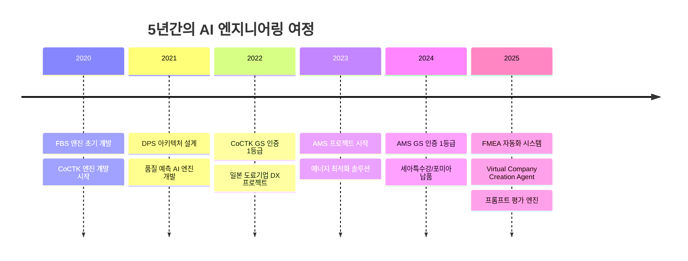
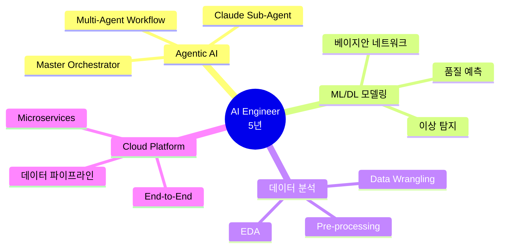
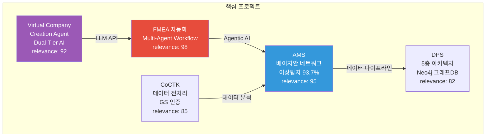
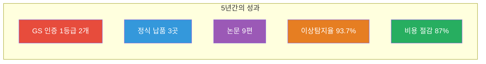

# 권순룡 이력서

## 기본 정보

**이름**: 권순룡  
**현 소속**: 한솔코에버 연구소 대리 (2020.09 ~ 재직중)  
**총 경력**: 5년 (2020~2025)  
**핵심 역량**: Agentic AI, ML/DL 모델링, 데이터 분석, Cloud platform, End-to-End 프로젝트

---

## 한눈에 보는 경력 (2020-2025)

---

## 지원 동기

5년간 제조 데이터 파이프라인을 구축하며 "데이터를 정보로, 정보를 지식으로" 전환하는 과정에서 Agentic AI와 ML/DL 모델링의 핵심 역량을 체득하였습니다. 특히 FMEA 자동화 시스템에서 Claude Sub-Agent 기반 Multi-Agent Workflow를 구축하고, AMS 프로젝트에서 베이지안 네트워크 기반 이상 탐지 모델을 개발하여 GS 인증 1등급을 취득하고 세아특수강과 포미아에 정식 납품한 경험이 있습니다.

현대카드 Data Science 팀에서 고객 Knowledge Framework를 개발하고 Agentic AI 기반 초개인화 서비스를 구축하는 업무에 제가 경험한 Multi-Agent 시스템 설계, ML/DL 예측 모델링, 데이터 파이프라인 구축 역량이 직접 기여할 수 있다고 생각합니다. 특히 고객 소비 데이터를 기반으로 한 Knowledge Framework 개발과 실시간 인사이트 제공 서비스는 제가 AMS에서 구축한 베이지안 네트워크 기반 확률 분석 및 피쉬본 다이어그램 자동 생성 기술과 직접적으로 연결됩니다.

---

## 핵심 역량 맵

---

## 핵심 역량

### Agentic AI

Claude Sub-Agent 기반 Multi-Agent Workflow를 구축하여 FMEA 자동화 시스템을 개발하였습니다. 8개 독립 Sub-Agent 협업 구조를 설계하고 Master Orchestrator를 구현하여 Phase 0~5 자동화 워크플로우를 완전 구현하였습니다. 또한 AI 에이전트로만 구성된 가상 기업 생성 시스템을 설계하여 Dual-Tier AI 아키텍처를 통해 최대 87% 비용 절감을 달성하였습니다. 2025.12 KSFM 학술대회에서 "분석 상관/확률 네트워크 최적 경로 정보 및 공정 관리 문서 기반 FMEA 생성 연구" 논문을 발표하였습니다.

### ML/DL 모델링

베이지안 네트워크 기반 이상 탐지 모델을 개발하여 이상탐지율 93.7%를 달성하였습니다. 확률 최적화(경사하강법) 기반 모델 학습을 수행하고, Tabular Data 기반 ML/DL 예측 모델링을 통해 다수 업체(사출, 도정, 금형 등)의 품질 예측 AI 엔진을 개발 및 고도화하여 불량률 감소 성과를 달성하였습니다.

### 데이터 분석

8단계 시계열 데이터 파이프라인을 설계 및 구축하여 데이터 전처리부터 모델 학습, 예측, 결과 시각화까지 전 과정을 자동화하였습니다. 정형/비정형 데이터 통계적 분석 기반으로 insight를 도출하고, 베이지안 네트워크 기반 확률 분석 및 피쉬본 다이어그램 자동 생성 기술을 개발하여 이상 원인 추적 및 인사이트 도출을 수행하였습니다.

### Cloud Platform & End-to-End

5층 아키텍처, Microservices 기반 데이터 파이프라인을 구축하고, Neo4j 그래프DB를 활용한 데이터 통합 시스템을 설계하였습니다. 총괄 PM으로 설계부터 개발, 검증, 납품까지 전 과정을 관리하여 GS 인증 1등급을 취득하고 세아특수강과 포미아에 정식 납품하였습니다.

---

## 프로젝트 관계도

---

## 경력 개요

### 한솔코에버 연구소 (2020.09 ~ 재직중)
**직급**: 대리  
**주요 업무**:
- AI 엔진 개발 및 총괄 PM
- 데이터 파이프라인 설계 및 구축
- Agentic AI 시스템 설계 및 개발

**성과**:
- GS 인증 1등급 2개 취득 (CoCTK, AMS-PDS)
- 세아특수강, 포미아 정식 납품
- 논문 9편 발표 (2020-2025)

---

## 주요 수행 과제 및 기간

| 과제명 (프로젝트) | 수행 기간 | 지원/주관 기관 |
|:---|:---|:---|
| 고가센서 대체 가상센서 | 2021.05. ~ 2021.10. | 한국에너지기술평가원 |
| 클린룸 송풍기 제어 | 2021.04. ~ 2021.10. | 한국에너지기술평가원 |
| 전력 데이터 예측 | 2021.04. ~ 2021.11. | 정보통신산업진흥원 |
| 품질 이상 예측 | 2021.04. ~ 2021.11. | 정보통신산업진흥원 |
| 공정 불량 예측 | 2023.04. ~ 2023.10. | 정보통신산업진흥원 |
| FBS | 2020.09. ~ 2021.10. | 한국에너지기술평가원 |
| 한솔 코에버 내부 프로그램 개발 | 2022.03. ~ 2023.09. | 중소기업기술정보진흥원 |
| 진료기록을 통한 체질 관리 시스템 | 2022.06. ~ 2022.10. | 한국데이터산업진흥원 |
| AI 종합 플랫폼 개발 | 2024.07. ~ 2025.03. | 한국산업기술진흥원 |

---

## 주요 역량

### 가상 센서 및 제어 최적화
- 압축 사출 업체 고가센서 대체 가상센서 설계 및 구축 (2021)
- 클린룸 송풍기 최적 제어 프로젝트 AI 엔진 개발 PM 및 논문 발표 (2021)

### AI 예측 모델 개발
- 사출 업체 전력 데이터 및 품질 예측 AI 엔진 개발 (2021)
- 다수 업체(사출, 도정, 금형 등) 품질 예측 AI 엔진 개발 및 고도화 (2021~2023)
- 진료기록을 통한 체질 분석 (2022)

### 데이터 분석 및 플랫폼 개발
- 오웰(일본)社 자동차 도정 공정 데이터 기반 인과 관계 다이어그램 AI 엔진 개발 (2020~2024)
- 한솔코에버 CoCTK 엔진 총괄 설계 및 화면설계 개발 PM 및 GS 1등급 취득 (2022~2024)
- 생산공정 에너지 및 설비 상태 데이터 패턴 분석 기반 라벨링 연구과제 메인 수행 (2023)
- AI 종합 플랫폼 개발 총괄 PM 및 GS 1등급 취득 (2024~2025)

---

## 주요 프로젝트 경험

### 1. FMEA 자동화 생성 시스템 (Claude Sub-Agent) - Master Orchestrator 설계

**기간**: 2025.6 ~ (진행중)  
**발주처**: 내부 개발  
**역할**: Master Orchestrator 설계 및 개발  
**relevance_score**: 98

**핵심 성과**:
- ✅ **Agentic AI 시스템 개발**: Claude Sub-Agent 기반 Multi-Agent Workflow 구축, 8개 독립 Sub-Agent 협업 구조 설계 및 구현
- ✅ **Master Orchestrator 설계**: 코딩 에이전트의 역설계 시스템 구조 적용, Phase 0~5 자동화 워크플로우 완전 구현
- ✅ **학술 연구**: 2025.12 KSFM 학술대회 논문 발표 "분석 상관/확률 네트워크 최적 경로 정보 및 공정 관리 문서 기반 FMEA 생성 연구"

**기술 스택**: Claude Sub-Agent, LLM API, Multi-Agent Workflow, Prompt Engineering

---

### 2. AMS (Analysis Management System) - 총괄 PM

**기간**: 2024.07~2025.12  
**발주처**: 한국산업기술진흥원  
**역할**: AI 종합 플랫폼 개발 총괄 PM  
**relevance_score**: 95

**핵심 성과**:
- ✅ **ML/DL 모델링**: 베이지안 네트워크 기반 이상 탐지 모델 개발, 확률 최적화(경사하강법) 기반 모델 학습, 이상탐지율 93.7% 달성 (실질적 정확도 60~70%)
- ✅ **데이터 파이프라인**: 8단계 시계열 데이터 파이프라인 설계 및 구축, 데이터 전처리부터 모델 학습, 예측, 결과 시각화까지 전 과정 자동화
- ✅ **상용화**: GS 인증 1등급 취득 (PDS 명칭), 세아특수강과 포미아에 정식 납품, 테크웰/신성오토텍 AMS 컨설팅 수행
- ✅ **학술 연구**: 학술 논문 2건 발표 (2024.12, 2025.06)

**기술 스택**: Python, ML/DL, 베이지안 네트워크, 시계열 분석, 데이터 파이프라인

---

### 3. Virtual Company Creation Agent - 시스템 설계 및 개발

**기간**: 2026.1.4 ~ (진행중)  
**발주처**: 내부 개발  
**역할**: 시스템 설계 및 개발  
**relevance_score**: 92

**핵심 성과**:
- ✅ **Agentic AI 시스템**: AI 에이전트로만 구성된 가상 기업 생성 시스템, Claude Agent 기반 Dual-Tier AI 아키텍처
- ✅ **RAG 시스템**: Vector DB 기반 RAG 시스템 구축, 7단계 Chain Workflow, 14 Layer 온톨로지 좌표 체계
- ✅ **비용 효율성**: Dual-Tier AI 아키텍처를 통해 최대 87% 비용 절감 달성

**기술 스택**: Claude Agent, LLM API, Vector DB, RAG, Dual-Tier AI

---

### 4. CoCTK (Consulting Tool Kit) - 엔진 총괄 설계 & 화면설계 개발 총괄 PM

**기간**: 2022.03~2024  
**발주처**: 중소기업기술정보진흥원  
**역할**: 엔진 총괄 설계 & 화면설계 개발 총괄 PM  
**relevance_score**: 85

**핵심 성과**:
- ✅ **데이터 분석**: 데이터 전처리, 상관관계 분석, 비용 최적화 엔진 개발
- ✅ **상용화**: GS 인증 1등급 취득 (2024)
- ✅ **학술 연구**: 논문 발표 (2023)

**기술 스택**: Python, 데이터 전처리, 상관관계 분석

---

### 5. DPS (데이터수집시스템) - 핵심 아키텍처 설계 및 개발 PM

**기간**: 2021~2024  
**발주처**: 내부 개발  
**역할**: 핵심 아키텍처 설계 및 개발 PM  
**relevance_score**: 82

**핵심 성과**:
- ✅ **데이터 파이프라인**: 5층 아키텍처, Microservices 기반 데이터 파이프라인 구축
- ✅ **그래프DB 활용**: Neo4j 그래프DB를 활용한 데이터 통합 시스템 설계
- ✅ **상용화**: 세아특수강과 포미아에 정식 납품
- ✅ **학술 연구**: 2024 논문 발표

**기술 스택**: Python, Neo4j, Microservices, 데이터 파이프라인

---

## 기술 스택

### Programming Languages
- **Python**: 5년 (AI 엔진 개발, 데이터 분석, ML/DL, 백엔드 개발, MCP 서버 개발)
- **SQL**: 5년 (데이터베이스 쿼리, 데이터 분석, Neo4j Cypher)

### AI/ML Technologies
- **Agentic AI**: Claude Sub-Agent, Multi-Agent Workflow, Master Orchestrator, 8개 Sub-Agent 협업 구조
- **LLM**: Claude Agent, LLM API 활용, Vector DB 기반 RAG 시스템
- **ML/DL**: 베이지안 네트워크, 이상 탐지, 품질 예측, 시계열 분석, 확률 최적화(경사하강법)

### Data Engineering
- **데이터 파이프라인**: 5층 아키텍처, 8단계 시계열 데이터 파이프라인, Microservices
- **데이터베이스**: Neo4j (그래프DB), PostgreSQL, Vector DB
- **데이터 분석**: Data Wrangling, Pre-processing, EDA, 상관관계 분석

### Cloud & Infrastructure
- **Cloud Platform**: Microservices 기반 데이터 파이프라인, Dual-Tier AI 아키텍처
- **End-to-End**: 설계부터 운영까지 전 과정 관리 경험

---

## 성과 대시보드

---

## 학력

**홍익대학교 전자공학과** (2013.03 ~ 2020.02)
- 학점: 3.11 / 4.5
- 졸업논문: LD 동격회로 설계 및 PLL 설계

---

## 자격증

**OPIc** (2019.03)
- ACT FL (American Council on the Teaching of Foreign Languages)

---

## 핵심 철학

> **"모델보다 데이터, 데이터보다 정보, 지식구조를 정리하는 현장친화적 연구원"**

5년간의 현장 경험을 통해 데이터를 정보로 전환하고, 정보를 지식 구조로 체계화하는 전문성을 갖춘 연구원입니다. 단순한 모델 개발을 넘어, 현장의 실제 문제를 해결하고 지식 기반 시스템을 구축하는 데 집중합니다.

---

## 자기소개서

### 역량기술서

5년간 한솔코에버 연구소에서 AI 엔진 개발 및 총괄 PM으로 활동하며 Agentic AI, ML/DL 모델링, 데이터 분석 분야에서 전문성을 축적하였습니다.

**Agentic AI 전문성**: Claude Sub-Agent 기반 Multi-Agent Workflow를 구축하여 FMEA 자동화 시스템을 개발하였습니다. 8개 독립 Sub-Agent 협업 구조를 설계하고 Master Orchestrator를 구현하여 Phase 0~5 자동화 워크플로우를 완전 구현하였습니다. 또한 AI 에이전트로만 구성된 가상 기업 생성 시스템을 설계하여 Dual-Tier AI 아키텍처를 통해 최대 87% 비용 절감을 달성하였습니다. 2025.12 KSFM 학술대회에서 "분석 상관/확률 네트워크 최적 경로 정보 및 공정 관리 문서 기반 FMEA 생성 연구" 논문을 발표하여 Agentic AI/LLM 관련 학술 연구 성과를 인정받았습니다.

**ML/DL 모델링 역량**: 베이지안 네트워크 기반 이상 탐지 모델을 개발하여 이상탐지율 93.7%를 달성하였습니다. 확률 최적화(경사하강법) 기반 모델 학습을 수행하고, Tabular Data 기반 ML/DL 예측 모델링을 통해 다수 업체(사출, 도정, 금형 등)의 품질 예측 AI 엔진을 개발 및 고도화하여 불량률 감소 성과를 달성하였습니다. 정형/비정형 데이터 통계적 분석 기반으로 insight를 도출하고, 비즈니스 모델을 설계하는 경험이 있습니다.

**데이터 파이프라인 및 Cloud Platform 경험**: 8단계 시계열 데이터 파이프라인을 설계 및 구축하여 데이터 전처리부터 모델 학습, 예측, 결과 시각화까지 전 과정을 자동화하였습니다. 5층 아키텍처, Microservices 기반 데이터 파이프라인을 구축하고, Neo4j 그래프DB를 활용한 데이터 통합 시스템을 설계하였습니다. 총괄 PM으로 설계부터 개발, 검증, 납품까지 전 과정을 관리하여 GS 인증 1등급을 취득하고 세아특수강과 포미아에 정식 납품하였습니다.

**상용화 경험**: GS 인증 1등급 2개를 취득하였으며(CoCTK, AMS-PDS), 세아특수강과 포미아에 정식 납품하고 테크웰/신성오토텍 AMS 컨설팅을 수행하여 모델을 대고객 서비스로 상용화한 경험과 상용화된 모델 개선 경험을 보유하고 있습니다.

현대카드 Data Science 팀에서 고객 Knowledge Framework 개발과 Agentic AI 기반 초개인화 서비스 구축에 제가 축적한 Agentic AI 전문성, ML/DL 모델링 역량, 데이터 파이프라인 구축 경험, 상용화 경험이 직접 기여할 수 있다고 확신합니다.

---

© 2026 권순룡. All Rights Reserved.
