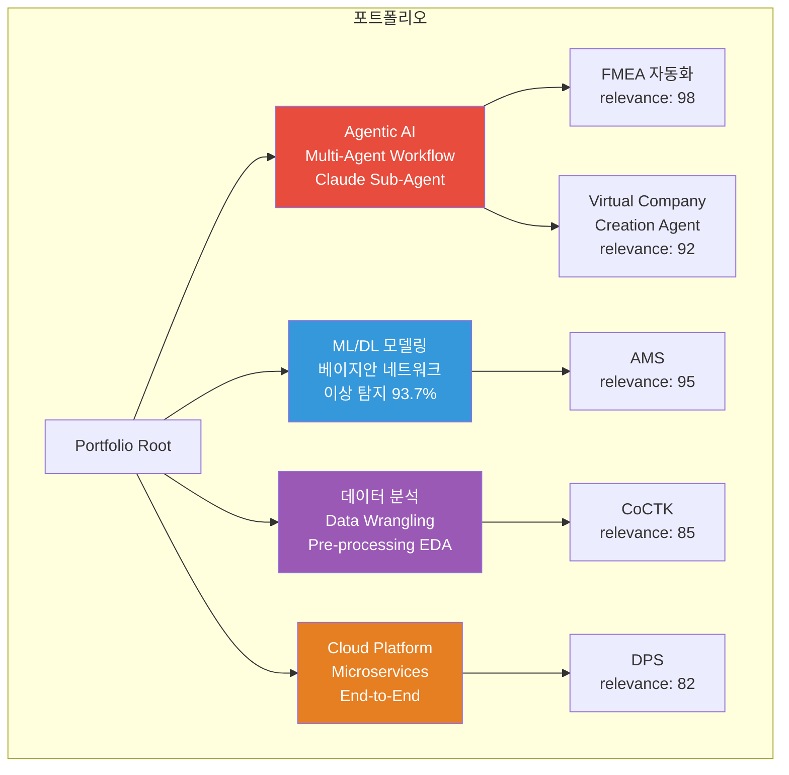
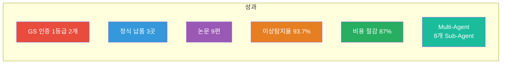
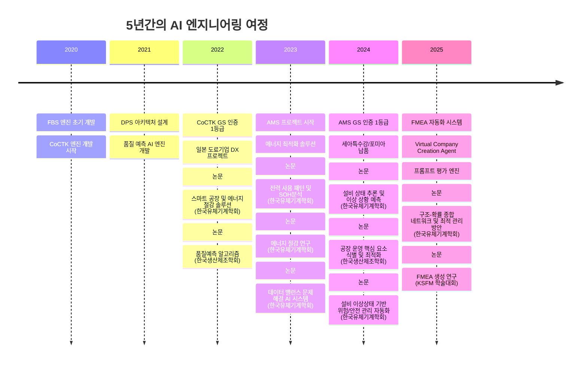
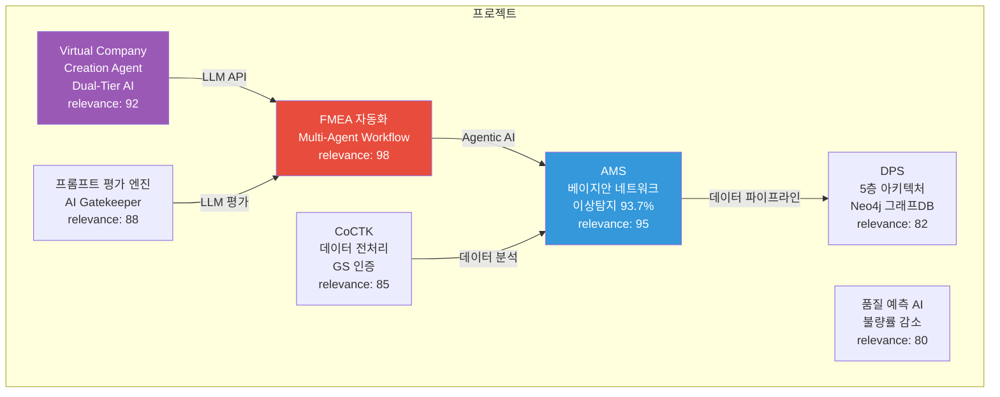
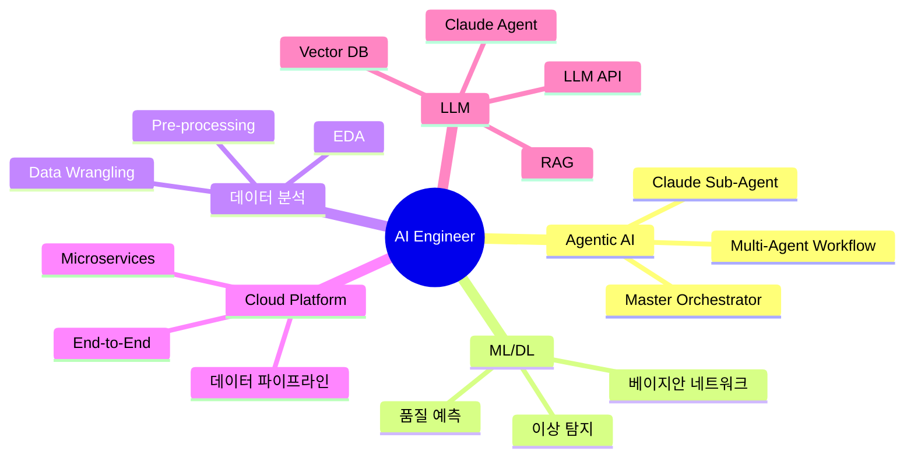

# 권순룡 포트폴리오

> **"모델보다 데이터, 데이터보다 정보, 지식구조를 정리하는 현장친화적 연구원"**

## 📌 기본 정보

**이름**: 권순룡  
**GitHub**: https://github.com/moobaek

---

## 📊 포트폴리오 구조 (한눈에 보기)

---

## 🎯 핵심 성과 대시보드

| 분류 | 지표 | 상세 |
|:---|---:|:---|
| **인증** | GS 인증 1등급 2개 | CoCTK (2024), AMS-PDS (2025) |
| **납품** | 정식 납품 3곳 | 세아특수강, 포미아, 일본 글로벌 기업 |
| **학술** | 논문 9편 | 2020-2025년 발표 |
| **성능** | 이상탐지율 93.7% | 실질적 정확도 60~70% (데이터 한계 고려) |
| **효율성** | 비용 절감 87% | Dual-Tier AI 아키텍처 |
| **시스템** | Multi-Agent 8개 | Sub-Agent 협업 구조 |

---

## 📅 경력 타임라인 (2020-2025)

---

## 🏆 주요 프로젝트 (20개+)

### 프로젝트 관계도

### 1. FMEA 자동화 생성 시스템 (Claude Sub-Agent) - 총괄 PM

**기간**: 2025.6 ~ (진행중)  
**역할**: Master Orchestrator 설계 및 개발

**핵심 성과**:
- ✅ **Agentic AI 시스템 개발**: Claude Sub-Agent 기반 Multi-Agent Workflow 구축, 8개 독립 Sub-Agent 협업 구조 설계 및 구현
- ✅ **Master Orchestrator 설계**: 코딩 에이전트의 역설계 시스템 구조 적용, Phase 0~5 자동화 워크플로우 완전 구현
- ✅ **학술 연구**: 2025.12 KSFM 학술대회 논문 발표 "분석 상관/확률 네트워크 최적 경로 정보 및 공정 관리 문서 기반 FMEA 생성 연구"

**기술 스택**: Claude Sub-Agent, LLM API, Multi-Agent Workflow, Prompt Engineering

---

### 2. AMS (Analysis Management System) - 총괄 PM

**기간**: 2024.07~2025.12  
**역할**: AI 종합 플랫폼 개발 총괄 PM

**핵심 성과**:
- ✅ **ML/DL 모델링**: 베이지안 네트워크 기반 이상 탐지 모델 개발, 이상탐지율 93.7% 달성
- ✅ **데이터 파이프라인**: 8단계 시계열 데이터 파이프라인 설계 및 구축
- ✅ **상용화**: GS 인증 1등급 취득, 세아특수강과 포미아에 정식 납품
- ✅ **학술 연구**: 학술 논문 2건 발표 (2024.12, 2025.06)

**기술 스택**: Python, ML/DL, 베이지안 네트워크, 시계열 분석

---

### 3. Virtual Company Creation Agent - 시스템 설계 및 개발

**기간**: 2026.1.4 ~ (진행중)  
**역할**: 시스템 설계 및 개발

**핵심 성과**:
- ✅ **Agentic AI 시스템**: AI 에이전트로만 구성된 가상 기업 생성 시스템
- ✅ **RAG 시스템**: Vector DB 기반 RAG 시스템 구축, 7단계 Chain Workflow
- ✅ **비용 효율성**: Dual-Tier AI 아키텍처를 통해 최대 87% 비용 절감

**기술 스택**: Claude Agent, LLM API, Vector DB, RAG, Dual-Tier AI

---

### 4. 프롬프트 평가 엔진 (AI Gatekeeper) - AI Gatekeeper 설계

**기간**: 2025.6 ~ (진행중)  
**역할**: AI Gatekeeper 설계 및 개발

**핵심 성과**:
- ✅ **AI Gatekeeper**: 모든 AI 생성물의 '입구'를 통제하는 심사관
- ✅ **전수 평가**: 25개+ 프롬프트 전수 평가 시스템
- ✅ **이중 검증**: Double-Check 시스템으로 환각 방지

**기술 스택**: Python, LLM, Prompt Engineering

---

### 5. CoCTK (Consulting Tool Kit) - 엔진 총괄 설계 & 화면설계 개발 총괄 PM

**기간**: 2022.03~2024  
**역할**: 엔진 총괄 설계 & 화면설계 개발 총괄 PM

**핵심 성과**:
- ✅ **데이터 분석**: 데이터 전처리, 상관관계 분석, 비용 최적화 엔진 개발
- ✅ **상용화**: GS 인증 1등급 취득 (2024)

**기술 스택**: Python, 데이터 전처리, 상관관계 분석

---

### 6. DPS (데이터수집시스템) - 핵심 아키텍처 설계 및 개발 PM

**기간**: 2021~2024  
**역할**: 핵심 아키텍처 설계 및 개발 PM

**핵심 성과**:
- ✅ **데이터 파이프라인**: 5층 아키텍처, Microservices 기반 데이터 파이프라인 구축
- ✅ **그래프DB 활용**: Neo4j 그래프DB를 활용한 데이터 통합 시스템 설계
- ✅ **상용화**: 세아특수강과 포미아에 정식 납품

**기술 스택**: Python, Neo4j, Microservices, 데이터 파이프라인

---

## 💻 기술 스택 맵

---

## 📚 학술 성과

| 발행일 | 논문 제목 | 학술지/학회 |
|:---|:---|:---|
| 2025.12 | 분석 상관/확률 네트워크 최적 경로 정보 및 공정 관리 문서 기반 FMEA 생성 연구 | KSFM 2025년도 동계학술대회 |
| 2025.06 | AI를 활용한 구조와 룰을 활용한 구조-확률 종합 네트워크 및 최적 관리 방안 도출 | 한국유체기계학회 |
| 2024.12 | 공장 운영 핵심 요소의 식별 및 최적화를 위한 클러스터링 기법 적용 | 한국생산제조학회 |
| 2024.12 | 설비 이상상태 기반 최적 공정 데이터 추론 및 위험/안전 관리 최적 자동화 | 한국유체기계학회 |
| 2024.07 | 전력 데이터를 통한 설비 상태 추론 및 이상 상황 설정 예측 | 한국유체기계학회 |
| 2023.12 | 송풍 설비 변동부하 대응 전력품질 분석 및 에너지 절감 연구 | 한국유체기계학회 |
| 2023.12 | 압축기 공정에서 데이터 밸런스 문제 해결 및 품질 결과 사전 예측을 위한 AI 시스템 | 한국유체기계학회 |
| 2023.07 | 생산공정 에너지 및 설비 상태 진단을 위한 AI기반의 전력 사용 패턴 및 SOH분석 | 한국유체기계학회 |
| 2022.12 | 자동차 부품 생산 산업을 위한 머신러닝 기반의 품질예측 알고리즘 | 한국생산제조학회 |
| 2022.06 | ICT 융복합 기술을 활용한 스마트 공장 및 에너지 절감 솔루션 적용 사례 | 한국유체기계학회 |

---

## 🤖 LLM 활용 방법

### Agent/MCP/RAG 시스템

**FMEA 자동화 생성 시스템**:
- Claude Sub-Agent 기반 Multi-Agent Workflow 구축
- 8개 독립 Sub-Agent 협업 구조 (R&D, Mfg, QA)
- Master Orchestrator 설계 및 구현
- Phase 0~5 자동화 워크플로우 완전 구현

**Virtual Company Creation Agent**:
- Claude Agent 기반 Dual-Tier AI 아키텍처
- Vector DB 기반 RAG 시스템 구축
- 7단계 Chain Workflow, 14 Layer 온톨로지 좌표 체계
- 최대 87% 비용 절감 달성

**프롬프트 평가 엔진 (AI Gatekeeper)**:
- 25개+ 프롬프트 전수 평가 시스템
- 이중 검증(Double-Check) 시스템으로 환각 방지
- 3가지 핵심 차원 평가: Quality, Consistency, Cost
- 17가지 역할별 동적 가중치 시스템

**MCP (Model Context Protocol)**:
- 32개 Python MCP 서버 개발
- 비정형 문서(HWP, DOCX, XLSX) 자동 파싱
- 에이전트 간 통신 및 도구 호출 파이프라인

---

## 🔗 관련 링크

- **메인 레포지토리**: https://github.com/moobaek/Testing_AI_agents_for_public_use
- **포트폴리오 문서**: https://github.com/moobaek/Testing_AI_agents_for_public_use/tree/main/portfolio/portfolio_docs
- **GitHub 프로필**: https://github.com/moobaek

---

© 2026 권순룡. All Rights Reserved.
