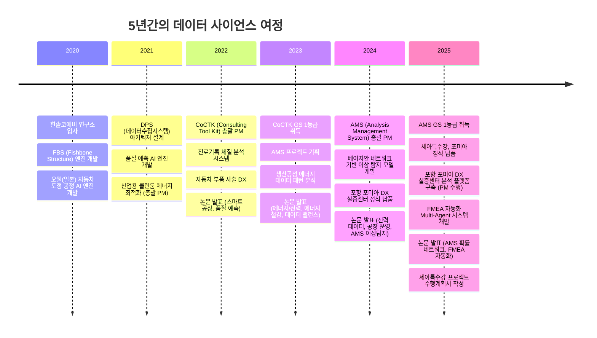
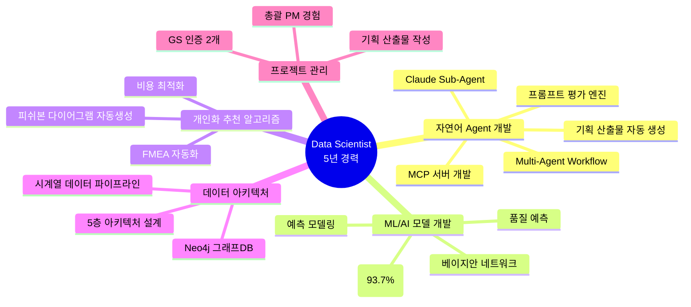
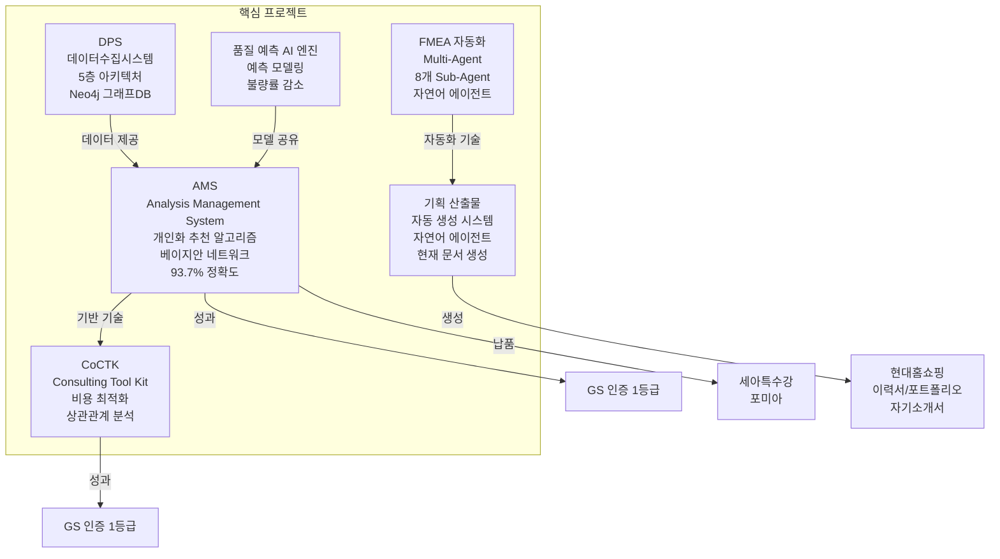
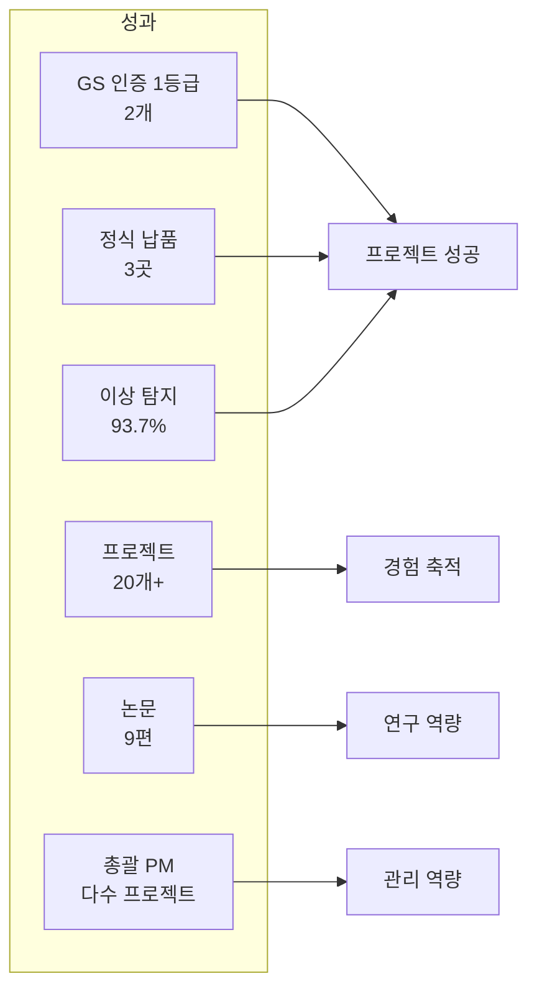

# 권순룡 이력서

## 기본 정보

**이름**: 권순룡  
**현 소속**: 한솔코에버 연구소 대리 (2020.09 ~ 재직중)  
**총 경력**: 5년 (2020~2025)  
**핵심 역량**: 개인화 추천 알고리즘, ML/AI 모델 개발 및 운영, 데이터 아키텍처 설계, 예측 모델링, 프로젝트 관리

---

## 한눈에 보는 경력 (2020-2025)

---

## 지원 동기

5년간 제조 데이터 분석 및 AI 모델 개발을 통해 "데이터를 정보로, 정보를 지식으로" 전환하는 과정에서 개인화 추천 알고리즘과 AI 기반 서비스 개선에 대한 전문성을 축적하였습니다. 특히 AMS 프로젝트에서 피쉬본 다이어그램 자동생성 및 FMEA 자동화를 통해 개인화 추천 알고리즘의 핵심인 "사용자 행동 패턴 분석 및 최적화"를 구현하였으며, CoCTK 프로젝트에서 비용 최적화 AI 엔진을 개발하여 비즈니스 목표와 데이터 분석 결과를 연계한 경험을 보유하고 있습니다.

현대홈쇼핑 AI 에이전트팀에서 개인화 추천 알고리즘을 기획하고 구축하며, AI 기반 서비스를 지속적으로 개선하고 확장하는 업무에 기여하고 싶습니다. 특히 제가 경험한 **자연어 에이전트 개발 경험**(Claude Sub-Agent 기반 Multi-Agent Workflow, 8개 Sub-Agent 협업 구조, MCP 서버 개발, 프롬프트 평가 엔진, 기획 산출물 자동 생성 시스템)과 베이지안 네트워크 기반 예측 모델링, 대규모 데이터 통합·분석, 총괄 PM으로서의 프로젝트 관리 역량이 현대홈쇼핑의 AI 에이전트 시스템 고도화와 개인화 추천 시스템 개선에 직접적으로 기여할 수 있다고 생각합니다.

---

## 장단점

5년간의 자연어 에이전트 개발과 데이터 사이언스 경험으로 복잡한 문제를 체계적으로 분석하고 해결하는 능력을 보유하며, 총괄 PM으로서 GS 인증 1등급 2개, 정식 납품 3곳의 성과를 달성하였습니다. 다만 흥미있는 기술이나 문제에 깊이 빠져들어 시간을 많이 투자하는 경향이 있어, 시간 배분을 계획하고 우선순위를 조정하여 효율적으로 업무를 수행합니다.

---

## 핵심 역량 맵

---

## 핵심 역량

### ML/AI 모델 개발 및 운영 (5년 경력)

베이지안 네트워크 기반 이상 탐지 모델을 개발하여 93.7%의 정확도를 달성하였으며, 확률 최적화(경사하강법)를 통한 이상상황 확률 네트워크를 구축하였습니다. AMS 프로젝트에서 총괄 PM으로 AI 종합 플랫폼을 개발하여 세아특수강, 포미아에 정식 납품하였고, GS 인증 1등급을 취득하였습니다. 또한 품질 예측 AI 엔진을 다수 업체(사출, 도정, 금형 등)에 적용하여 불량률 감소 성과를 달성하였습니다.

### 개인화 추천 알고리즘 기획 및 구축

피쉬본 다이어그램 자동생성 알고리즘을 개발하여 FMEA 자동화 시스템을 구축하였으며, 이를 통해 사용자 행동 패턴을 분석하고 최적화하는 개인화 추천 알고리즘의 핵심 역량을 보유하고 있습니다. CoCTK 프로젝트에서 비용 최적화 AI 엔진을 개발하여 상관관계 분석을 통한 인사이트를 도출하고, 비즈니스 의사결정에 활용한 경험이 있습니다.

### 데이터 아키텍처 및 분석 환경 관리

DPS 프로젝트에서 5층 아키텍처를 설계하고, Neo4j 그래프DB를 활용한 데이터 통합 시스템을 구축하였습니다. 8단계 시계열 데이터 파이프라인을 개발하여 실시간 데이터 처리 및 분석 환경을 관리한 경험이 있으며, 대규모 데이터를 통합·분석하여 핵심 인사이트를 도출하는 능력을 보유하고 있습니다.

### 자연어 Agent 개발 및 Multi-Agent 시스템 구축

Claude Sub-Agent 기반 Multi-Agent Workflow를 구축하여 8개 독립 Sub-Agent가 협업하는 구조를 설계하였으며, Master Orchestrator를 통해 전체 워크플로우를 관리하는 시스템을 개발하였습니다. FMEA 자동화 생성 시스템에서는 AIAG & VDA FMEA 표준 기반 범용 리스크 분석 시스템을 구축하였고, 프롬프트 평가 엔진을 통해 모든 AI 생성물을 전수 평가하는 완전 자동화 시스템을 개발하였습니다. PM Agent를 통해 사업 관리의 전체 라이프사이클을 관장하는 시스템을 구축하였으며, 자연어 에이전트 기반 기획 산출물 자동 생성 시스템을 개발하여 이력서, 포트폴리오, 자기소개서를 자동으로 생성하는 시스템을 완성하였습니다. 이 문서(현대홈쇼핑 이력서)도 이 자연어 에이전트 시스템의 산출물입니다.

### 프로젝트 관리 및 협업

AMS, CoCTK 등 다수 프로젝트에서 총괄 PM을 수행하여 프로젝트 전체 라이프사이클(기획-개발-검증-납품)을 관리하였습니다. 사업계획서, 수행계획서, Project Charter, BRD, FRD, WBS, PMP 등 다양한 기획 산출물을 작성하여 프로젝트 성공에 기여하였으며, 자연어 에이전트 기반 기획 산출물 자동 생성 시스템을 개발하여 기획 산출물 작성 효율성을 대폭 향상시켰습니다. GS 인증 2개, 정식 납품 3곳의 성과를 달성하였습니다.

---

## 프로젝트 관계도

---

## 경력 개요

### 한솔코에버 연구소 (2020.09 ~ 재직중)

**직급**: 대리  
**주요 업무**:
- AI 종합 플랫폼 개발 총괄 PM
- ML/AI 모델 개발 및 운영
- 데이터 아키텍처 설계 및 분석 환경 관리
- 프로젝트 관리 및 협업

**성과**:
- GS 인증 1등급 2개 취득 (CoCTK, AMS)
- 정식 납품 3곳 (세아특수강, 포미아, 일본 글로벌 기업)
- 이상 탐지 93.7% 정확도 달성
- 총괄 PM으로 프로젝트 전체 라이프사이클 관리

---

## 주요 프로젝트 경험

### 1. AMS (Analysis Management System) - 총괄 PM

**기간**: 2024.07 ~ 2025.03  
**발주처**: 한국산업기술진흥원  
**역할**: AI 종합 플랫폼 개발 총괄 PM

**핵심 성과**:
- ✅ **베이지안 네트워크 기반 이상 탐지 모델 개발**: 확률 최적화(경사하강법)를 통한 이상상황 확률 네트워크 구축, 이상탐지율 93.7% 달성
- ✅ **개인화 추천 알고리즘 구현**: 피쉬본 다이어그램 자동생성, FMEA 자동화를 통한 사용자 행동 패턴 분석 및 최적화
- ✅ **데이터 아키텍처 설계**: 시계열 분석에 대한 정보 온톨로지 output, 데이터 정합성 보장
- ✅ **프로젝트 성공**: GS 인증 1등급 (PDS 명칭) 취득, 세아특수강, 포미아 정식 납품
- ✅ **기획 산출물 작성**: 사업계획서, 수행계획서, Project Charter, BRD, FRD, WBS, PMP 등 작성

**기술 스택**: Python, SQL, Neo4j, 베이지안 네트워크, 경사하강법

---

### 2. CoCTK (Consulting Tool Kit) - 총괄 PM

**기간**: 2022.03 ~ 2024  
**발주처**: 중소기업기술정보진흥원  
**역할**: 엔진 총괄 설계 & 화면설계 개발 총괄 PM

**핵심 성과**:
- ✅ **비용 최적화 AI 엔진 개발**: 데이터 전처리, 상관관계 분석을 통한 비용 최적화 솔루션 구축
- ✅ **비즈니스 인사이트 도출**: 데이터 분석 결과를 비즈니스 의사결정에 활용
- ✅ **프로젝트 성공**: GS 인증 1등급 취득 (2024)
- ✅ **기획 산출물 작성**: Project Charter, BRD, FRD 등 작성

**기술 스택**: Python, SQL, 데이터 전처리, 상관관계 분석

---

### 3. DPS (데이터수집시스템) - PM 수행

**기간**: 2021 ~ 2024  
**역할**: 핵심 아키텍처 설계 및 개발 (PM 수행)

**핵심 성과**:
- ✅ **5층 아키텍처 설계**: Microservices 아키텍처, Neo4j 그래프DB 활용
- ✅ **대규모 데이터 처리**: 금속산업 5대 공정 AI 자동화, 실시간 데이터 수집 및 처리
- ✅ **데이터 아키텍처 관리**: 데이터 통합 및 분석 플랫폼 구축

**기술 스택**: Python, SQL, Neo4j, Microservices, Docker, Kubernetes

---

### 4. 품질 예측 AI 엔진

**기간**: 2021 ~ 2023  
**발주처**: 정보통신산업진흥원  
**역할**: AI 엔진 개발

**핵심 성과**:
- ✅ **예측 모델링 구축**: 사출/도정/금형 공정 품질 예측 모델 개발
- ✅ **다수 업체 적용**: 품질 예측 AI 엔진 개발 및 고도화, 불량률 감소 성과

**기술 스택**: Python, 머신러닝/딥러닝, 예측 모델링

---

### 5. FMEA 자동화 생성 시스템 (Claude Sub-Agent) - Master Orchestrator 설계

**기간**: 2025.6 ~  
**역할**: Master Orchestrator 설계 및 Multi-Agent Architecture 구축

**핵심 성과**:
- ✅ **Multi-Agent Workflow 구축**: 8개 독립 Sub-Agent 협업 구조 (R&D, Mfg, QA), Claude Code Task tool 기반 Master Orchestrator 설계
- ✅ **자연어 기반 자동화 시스템**: AIAG & VDA FMEA 표준 기반 범용 리스크 분석 시스템, Phase 0~5 자동화 워크플로우
- ✅ **코딩 에이전트 역설계 시스템 구조 적용**: 전체 공장/회사/사무 자동화의 백정보 핵심 기술 개발

**기술 스택**: Python, Claude Agent, Multi-Agent Architecture, MCP (Model Context Protocol)

---

### 6. 기획 산출물 자동 생성 시스템 (자연어 에이전트)

**기간**: 2024~현재  
**역할**: 시스템 설계 및 개발 총괄

**핵심 성과**:
- ✅ **자연어 에이전트 기반 자동화**: Claude Sub-Agent 기반 Multi-Agent Workflow로 채용 공고 분석부터 문서 생성까지 전 과정 자동화
- ✅ **맞춤형 문서 생성**: 채용 공고 요구사항에 맞춰 이력서, 포트폴리오, 자기소개서를 자동으로 생성
- ✅ **스마트 매칭 시스템**: AI가 포트폴리오를 분석하여 관련 프로젝트와 경험을 자동 선별
- ✅ **실제 적용 사례**: 현재 이 문서(현대홈쇼핑 이력서)를 이 시스템으로 생성

**기술 스택**: Claude Sub-Agent, Multi-Agent Workflow, Python, MCP, 프롬프트 엔지니어링

---

## 기술 스택

### Programming Languages
- **Python**: 5년 경력 (49개 Python 모듈 개발, MLS, CoCTK, FBS, RMS, AMS)
- **SQL**: MSSQL, PostgreSQL, Neo4j Cypher 활용

### ML/DL Frameworks
- **머신러닝/딥러닝**: 베이지안 네트워크, 경사하강법, 예측 모델링, 이상 탐지
- **ML Framework**: 품질 예측, 비용 최적화, 패턴 분석

### Databases
- **Neo4j**: 그래프DB, 4M2E 관계 정의, 지식 그래프 플랫폼
- **MSSQL, PostgreSQL**: 데이터 분석 및 쿼리 최적화

### Data Pipeline & Infrastructure
- **데이터 파이프라인**: 8단계 시계열 데이터 파이프라인, 5층 아키텍처
- **Docker, Kubernetes**: 마이크로서비스 아키텍처, 컨테이너 오케스트레이션

### Tools & Platforms
- **분석 도구**: GA4, PowerBI 등 분석/시각화 도구 활용 가능
- **클라우드 환경**: Docker, Kubernetes 기반 인프라 경험

---

## 성과 대시보드

---

## 학력 및 자격증

### 학력
- **홍익대학교 전자공학과** (2013.03 ~ 2020.02)
  - 학점: 3.11 / 4.5
  - 졸업논문: LD 동격회로 설계 및 PLL 설계
  - 주요 수강 분야: 회로 설계, 전파공학, 컴퓨터공학

### 자격증
- **OPIc** (2019.03) - ACT FL (American Council on the Teaching of Foreign Languages)

---

© 2025 권순룡. All Rights Reserved.
