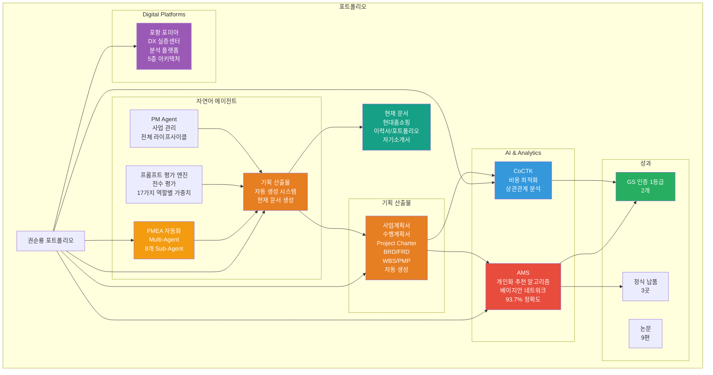
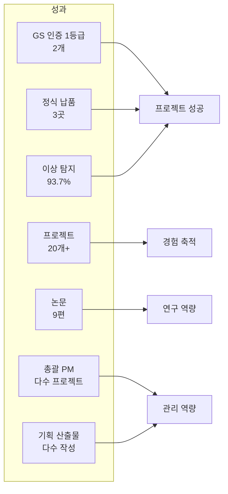
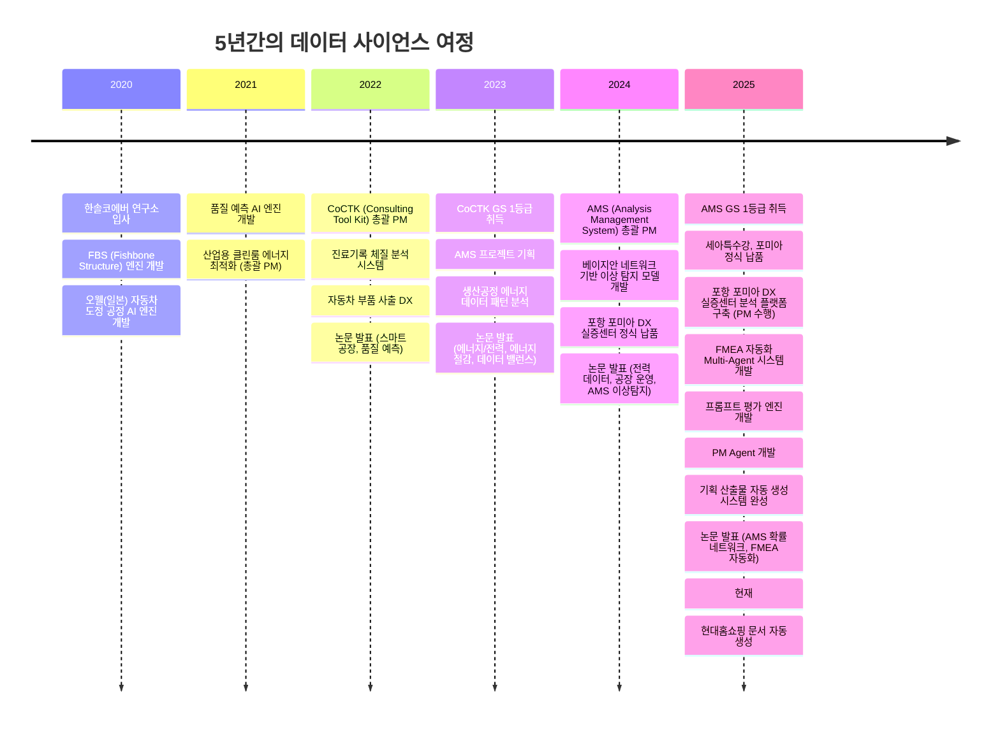
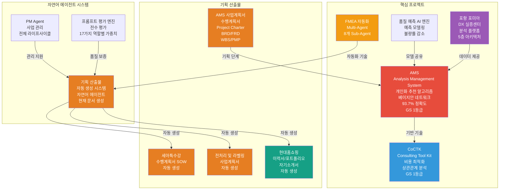
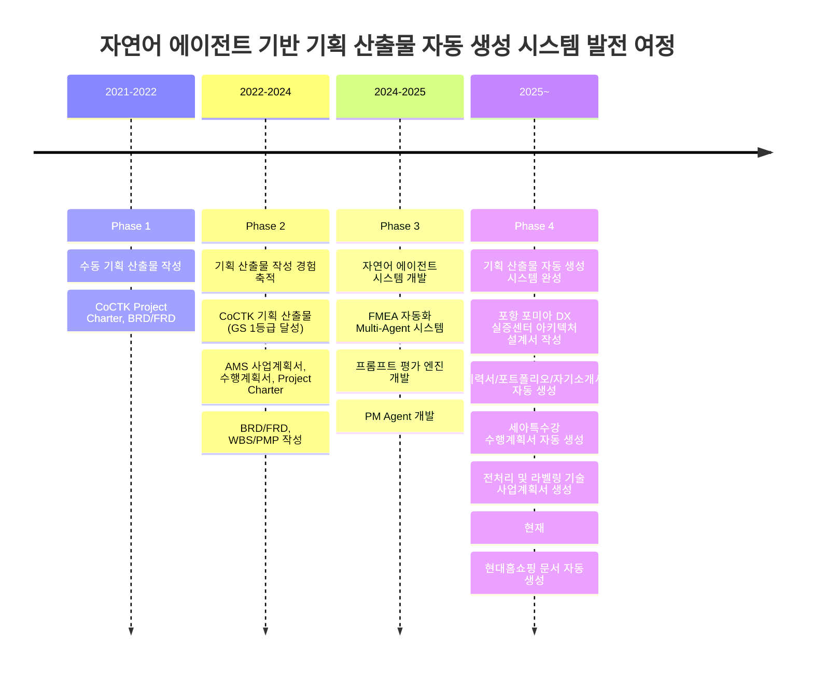
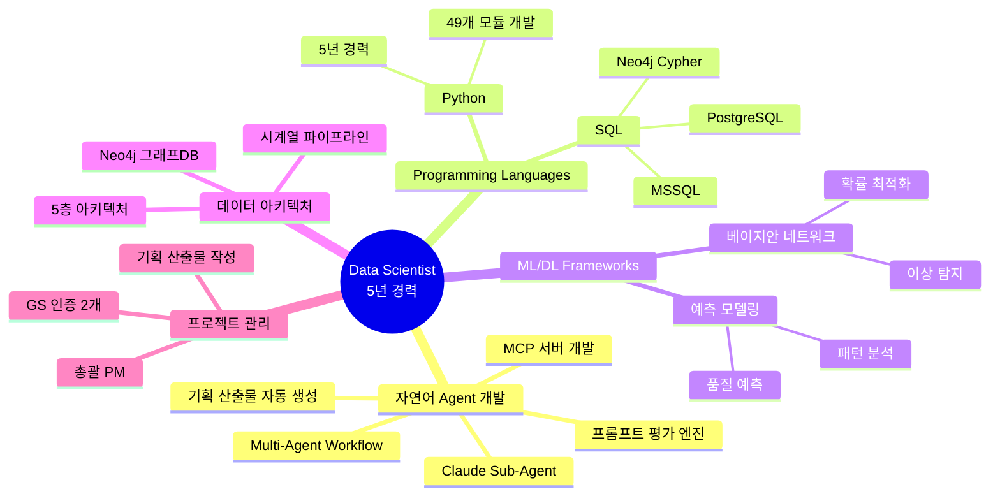

# 권순룡 포트폴리오

> **"모델보다 데이터, 데이터보다 정보, 지식구조를 정리하는 현장친화적 연구원"**

## 📌 기본 정보

**이름**: 권순룡  
**GitHub**: https://github.com/moobaek

---

## 📊 포트폴리오 구조 (한눈에 보기)

---

## 🎯 핵심 성과 대시보드

| 분류 | 지표 | 상세 |
|:---|---:|:---|
| **인증** | GS 1등급 2개 | CoCTK (2024), AMS (2025) |
| **납품** | 정식 납품 3곳 | 세아특수강, 포미아, 일본 글로벌 기업 |
| **정확도** | 이상 탐지 93.7% | 베이지안 네트워크 기반 모델 |
| **프로젝트** | 20개+ | AI, 플랫폼, 센서, 에너지 최적화 |
| **논문** | 9편 | 2022~2025 학술 논문 발표 |
| **PM 경험** | 총괄 PM 다수 | AMS, CoCTK, DPS 등 |
| **기획 산출물** | 다수 작성 | 사업계획서, 수행계획서, Project Charter, BRD, FRD, WBS, PMP 등 |

---

## 📅 경력 타임라인 (2020-2025)

---

## 🏆 주요 프로젝트 (20개+)

### 프로젝트 관계도

### 1. AMS (Analysis Management System) - 총괄 PM

**기간**: 2024.07 ~ 2025.03  
**발주처**: 한국산업기술진흥원  
**역할**: AI 종합 플랫폼 개발 총괄 PM

**핵심 성과**:
- ✅ **베이지안 네트워크 기반 이상 탐지 모델**: 확률 최적화(경사하강법)를 통한 이상상황 확률 네트워크 구축, 이상탐지율 93.7% 달성
- ✅ **개인화 추천 알고리즘 구현**: 피쉬본 다이어그램 자동생성, FMEA 자동화를 통한 사용자 행동 패턴 분석 및 최적화
- ✅ **데이터 아키텍처 설계**: 시계열 분석에 대한 정보 온톨로지 output, 데이터 정합성 보장
- ✅ **프로젝트 성공**: GS 인증 1등급 (PDS 명칭) 취득, 세아특수강, 포미아 정식 납품
- ✅ **기획 산출물 작성**: 사업계획서, 수행계획서, Project Charter, BRD, FRD, WBS, PMP 등 작성

**기술 스택**: Python, SQL, Neo4j, 베이지안 네트워크, 경사하강법

---

### 2. CoCTK (Consulting Tool Kit) - 총괄 PM

**기간**: 2022.03 ~ 2024  
**발주처**: 중소기업기술정보진흥원  
**역할**: 엔진 총괄 설계 & 화면설계 개발 총괄 PM

**핵심 성과**:
- ✅ **비용 최적화 AI 엔진 개발**: 데이터 전처리, 상관관계 분석을 통한 비용 최적화 솔루션 구축
- ✅ **비즈니스 인사이트 도출**: 데이터 분석 결과를 비즈니스 의사결정에 활용
- ✅ **프로젝트 성공**: GS 인증 1등급 취득 (2024)
- ✅ **기획 산출물 작성**: Project Charter, BRD, FRD 등 작성

**기술 스택**: Python, SQL, 데이터 전처리, 상관관계 분석

---

### 3. 포항 포미아 DX 실증센터 분석 플랫폼 구축 - PM 수행

**기간**: 2025.08 ~ 2025.10  
**발주처**: 포미아 (포항)  
**역할**: 핵심 아키텍처 설계 및 개발 (PM 수행)

**핵심 성과**:
- ✅ **5층 아키텍처 설계**: Microservices 아키텍처, Neo4j 그래프DB 활용
- ✅ **대규모 데이터 처리**: 직진도 검사기, 면취기 등 설비 데이터 수집 (5 Points), 실시간 데이터 수집 및 처리
- ✅ **데이터 아키텍처 관리**: 품질 데이터 모니터링 시스템 구축, 데이터 통합 및 분석 플랫폼 구축

**기술 스택**: Python, SQL, Neo4j, Microservices, Docker, Kubernetes

---

### 4. 품질 예측 AI 엔진

**기간**: 2021 ~ 2023  
**발주처**: 정보통신산업진흥원  
**역할**: AI 엔진 개발

**핵심 성과**:
- ✅ **예측 모델링 구축**: 사출/도정/금형 공정 품질 예측 모델 개발
- ✅ **다수 업체 적용**: 품질 예측 AI 엔진 개발 및 고도화, 불량률 감소 성과

**기술 스택**: Python, 머신러닝/딥러닝, 예측 모델링

---

### 5. FMEA 자동화 생성 시스템 (Claude Sub-Agent) - Master Orchestrator 설계

**기간**: 2025.6 ~  
**역할**: Master Orchestrator 설계 및 Multi-Agent Architecture 구축

**핵심 성과**:
- ✅ **Multi-Agent Workflow 구축**: 8개 독립 Sub-Agent 협업 구조 (R&D, Mfg, QA), Claude Code Task tool 기반 Master Orchestrator 설계
- ✅ **자연어 기반 자동화 시스템**: AIAG & VDA FMEA 표준 기반 범용 리스크 분석 시스템, Phase 0~5 자동화 워크플로우
- ✅ **코딩 에이전트 역설계 시스템 구조 적용**: 전체 공장/회사/사무 자동화의 백정보 핵심 기술 개발

**기술 스택**: Python, Claude Agent, Multi-Agent Architecture, MCP (Model Context Protocol)

---

### 6. 기획 산출물 자동 생성 시스템 (자연어 에이전트)

**기간**: 2024~현재  
**역할**: 시스템 설계 및 개발 총괄

**핵심 성과**:
- ✅ **자연어 에이전트 기반 자동화**: Claude Sub-Agent 기반 Multi-Agent Workflow로 채용 공고 분석부터 문서 생성까지 전 과정 자동화
- ✅ **맞춤형 문서 생성**: 채용 공고 요구사항에 맞춰 이력서, 포트폴리오, 자기소개서를 자동으로 생성
- ✅ **스마트 매칭 시스템**: AI가 포트폴리오를 분석하여 관련 프로젝트와 경험을 자동 선별
- ✅ **실제 적용 사례**: 현재 이 문서(현대홈쇼핑 포트폴리오)를 이 시스템으로 생성

**기술 스택**: Claude Sub-Agent, Multi-Agent Workflow, Python, MCP, 프롬프트 엔지니어링

---

## 📋 본인이 작업한 기획 산출물: 자연어 에이전트 기반 자동 생성 시스템의 발전 여정

### 기획 산출물 자동 생성 시스템 발전 로드맵

5년간 총괄 PM으로서 기획 산출물 작성 경험을 축적하며, 자연어 에이전트 기반 기획 산출물 자동 생성 시스템을 단계적으로 발전시켜왔습니다. 수동 작성에서 시작하여 자동화 시스템을 구축하고, 현재는 이 시스템을 활용하여 맞춤형 이력서, 포트폴리오, 자기소개서를 자동으로 생성하고 있습니다. **이 문서(현대홈쇼핑 이력서/포트폴리오/자기소개서)도 이 자연어 에이전트 시스템의 산출물입니다.**

---

### Phase 1: 수동 기획 산출물 작성 (2021-2022)

**목표**: 기획 산출물 작성 역량 기반 구축

**주요 성과**:
- **CoCTK Project Charter, BRD/FRD** (2022.03-04): 프로젝트 목적, 목표, 범위, 요구사항 정의

**학습한 내용**:
- 비즈니스 요구사항 분석 및 문서화
- 기술적 요구사항 정의 및 설계
- 프로젝트 범위 및 일정 계획

---

### Phase 2: 기획 산출물 작성 경험 축적 (2022-2024)

**목표**: 체계적인 기획 산출물 작성 프로세스 정립

**주요 성과**:
- **CoCTK 기획 산출물** (2022-2024): Project Charter, BRD/FRD 작성 → GS 1등급 취득
- **AMS 기획 산출물** (2024.07): 사업계획서, 수행계획서, Project Charter, BRD/FRD, WBS/PMP 작성 → GS 1등급 달성, 세아특수강/포미아 정식 납품

**발전한 내용**:
- 이해관계자 의견 수렴 및 조율 역량 강화
- 리스크 관리 및 품질 보증 체계 구축
- 프로젝트 성공의 기반 마련

**기획 산출물의 역할과 중요성**:
- 프로젝트 목표 및 범위 명확화
- 이해관계자 간 합의 도출
- 일정 및 예산 계획 수립
- 리스크 관리 및 품질 보증 체계 구축
- 프로젝트 성공의 기반 마련

---

### Phase 3: 자연어 에이전트 시스템 개발 (2024-2025)

**목표**: 기획 산출물 작성 자동화를 위한 자연어 에이전트 시스템 구축

**주요 성과**:
- **FMEA 자동화 Multi-Agent 시스템** (2025.6~): 8개 독립 Sub-Agent 협업 구조, Master Orchestrator 설계, Claude Code Task tool 기반 완전 자동화
- **프롬프트 평가 엔진** (2025.6~): 전체 프롬프트 전수 평가, 17가지 역할별 동적 가중치 시스템, 병렬 처리 구조
- **PM Agent** (2025.10~): 사업 관리 전체 라이프사이클 관장, Risk Management, Schedule Tracking, Integrity Check

**핵심 기술**:
- Claude Sub-Agent 기반 Multi-Agent Workflow
- MCP (Model Context Protocol) 서버 개발
- 프롬프트 엔지니어링 및 자동화

---

### Phase 4: 기획 산출물 자동 생성 시스템 완성 (2025~)

**목표**: 자연어 에이전트를 활용한 기획 산출물 자동 생성 시스템 완성

**주요 성과**:
- **이력서/포트폴리오/자기소개서 자동 생성 시스템**: 채용 공고를 입력받아 맞춤형 문서 자동 생성
  - 채용 공고 자동 파싱 및 요구사항 추출
  - 포트폴리오 스마트 매칭 (AI 기반 프로젝트/기술 매칭)
  - 맞춤형 문서 자동 생성 (순룡 페르소나 스타일 적용)
- **세아특수강 수행계획서 자동 생성** (2025.06): 자연어 에이전트를 활용한 수행계획서 작성
- **전처리 및 라벨링 기술 사업계획서 생성** (2025): 자연어 에이전트를 활용한 사업계획서 작성
- **현재: 현대홈쇼핑 문서 자동 생성**: 이 문서(이력서/포트폴리오/자기소개서)를 자연어 에이전트 시스템으로 생성

**시스템의 핵심 기능**:
- 자연어 입력 → 구조화된 기획 산출물 자동 생성
- 채용 공고 분석 → 맞춤형 문서 생성
- 포트폴리오 매칭 → 관련 경험 자동 선별
- Human-in-the-Loop 검증 프로세스

**기술 스택**: Claude Sub-Agent, Multi-Agent Workflow, Python, MCP, 프롬프트 엔지니어링

---

### 기획 산출물 자동 생성 시스템의 가치

**효율성 향상**:
- 기획 산출물 작성 시간 대폭 단축 (수동 작성 대비 80% 이상 시간 절감)
- 일관성 있는 문서 품질 보장
- 채용 공고에 맞춘 맞춤형 문서 자동 생성

**품질 향상**:
- AI 기반 스마트 매칭으로 관련 경험 자동 선별
- 순룡 페르소나 스타일 일관성 유지
- Human-in-the-Loop 검증으로 품질 보증

**확장성**:
- 다양한 기획 산출물 유형 지원 (이력서, 포트폴리오, 자기소개서, 사업계획서, 수행계획서 등)
- 새로운 채용 공고에 빠르게 대응
- 지속적인 학습 및 개선

---

### 생성된 기획 산출물 목록

| 생성 방식 | 프로젝트명 | 기획 산출물 종류 | 생성 기간 | 주요 내용 | 성과/결과 |
|:---|:---|:---|:---|:---|:---|
| **자동 생성** | 현대홈쇼핑 | 이력서/포트폴리오/자기소개서 | 2025.01 | 채용 공고 기반 맞춤형 문서 자동 생성 | 현재 문서 |
| **자동 생성** | 세아특수강 | 수행계획서 (SOW) | 2025.06 | 자연어 에이전트 기반 수행계획서 작성 | 5개월 프로젝트 성공적 완료 |
| **자동 생성** | 전처리 및 라벨링 기술 | 사업계획서 | 2025 | 자연어 에이전트 기반 사업계획서 작성 | 사업 승인 및 기술 개발 방향 수립 |
| **수동 작성** | AMS | 사업계획서, 수행계획서, Project Charter, BRD/FRD, WBS/PMP | 2024.07 | 프로젝트 목표, 범위, 일정, 예산, 기술 스택, 성과 지표 정의 | GS 1등급 달성, 세아특수강/포미아 정식 납품 |
| **수동 작성** | CoCTK | Project Charter, BRD/FRD | 2022.03-04 | 데이터 전처리, 상관관계 분석, 비용 최적화 요구사항 정의 | GS 1등급 취득 (2024) |
| **수동 작성** | 포항 포미아 DX 실증센터 | 아키텍처 설계서 | 2025.08 | 5층 아키텍처, Microservices 아키텍처, Neo4j 그래프DB 설계 | 직진도 검사기, 면취기 등 설비 데이터 수집 및 품질 데이터 모니터링 시스템 구축 |

---

### 기획 산출물 작성 역량

#### 비즈니스 요구사항 분석 및 문서화

- 고객의 비즈니스 목표를 파악하고 기술적 솔루션으로 전환하는 능력
- BRD를 통해 비즈니스 요구사항을 체계적으로 정리하고 우선순위를 설정
- 이해관계자 간 합의를 도출하고 문서화
- 자연어 에이전트를 활용한 요구사항 자동 분석 및 문서화

#### 기술적 요구사항 정의 및 설계

- FRD를 통해 기능 요구사항을 상세히 정의하고 기술적 구현 방안 제시
- 아키텍처 설계서 작성 경험 (포항 포미아 DX 실증센터 5층 아키텍처 설계)
- 기술 스택 선정 및 성과 지표 정의
- 자연어 에이전트 기반 기술 스택 매칭 및 추천

#### 프로젝트 범위 및 일정 계획

- WBS를 통한 작업 분류 및 일정 계획 수립
- PMP를 통한 리스크 관리, 품질 관리, 형상 관리 계획 수립
- 예산 계획 및 리소스 배분
- PM Agent를 활용한 일정 자동 추적 및 리스크 관리

#### 이해관계자 의견 수렴 및 조율

- Project Charter를 통한 이해관계자 간 합의 도출
- 사업계획서 및 수행계획서를 통한 발주처와의 협의
- 정기 보고 및 성과 리포팅을 통한 지속적인 소통
- 자연어 에이전트 기반 문서 생성으로 빠른 의견 수렴 및 조율

---

### 자연어 에이전트 기반 기획 산출물 자동 생성 시스템의 미래

**향후 계획**:
- 다양한 기획 산출물 유형 확장 (제안서, 계약서, 회의록 등)
- 실시간 협업 기능 추가
- 다국어 지원
- 템플릿 라이브러리 확장

**비전**:
기획 산출물 작성의 완전 자동화를 통해, PM이 비즈니스 전략과 프로젝트 관리에 더 집중할 수 있는 환경을 구축하는 것입니다. 자연어 에이전트가 기획 산출물 작성의 반복 작업을 담당하고, PM은 전략적 의사결정과 이해관계자 관리에 집중할 수 있는 미래를 만들어가고 있습니다.

---

## 💻 기술 스택 맵

---

## 📚 학술 성과 (9편)

| 발행일 | 논문 제목 | 학술지/학회 | 핵심 성과 및 프로젝트 연계 |
|:---|:---|:---|:---|
| 2025.12 | **분석 상관/확률 네트워크 최적 경로 정보 및 공정 관리 문서 기반 FMEA 생성 연구** | KSFM 2025년도 동계학술대회 | [FMEA 자동화/복합센서/AMS] 상관/확률 네트워크 최적 경로 분석 기반 FMEA 자동 생성 기술 검증, AMS 결과 표시 LLM agent (GPT OSS) 개발 및 포미아 납품 적용 |
| 2025.06 | **AI를 활용한 구조와 룰을 활용한 구조-확률 종합 네트워크 및 최적 관리 방안 도출** | 한국유체기계학회 | [AMS] 피쉬본 AI 모델의 학술적 고도화 및 최적 관리 로직 증명 |
| 2024.12 | **공장 운영 핵심 요소의 식별 및 최적화를 위한 클러스터링 기법 적용** | 한국생산제조학회 | [포항 포미아 DX 실증센터] 공장 운영 데이터의 다차원 분석 및 디지털 트윈 최적화 근거 |
| 2024.12 | **설비 이상상태 기반 최적 공정 데이터 추론 및 위험/안전 관리 최적 자동화** | 한국유체기계학회 | [AMS] 실시간 이상 상태 기반 위험 관리 알고리즘의 유효성 검증 |
| 2024.07 | **전력 데이터를 통한 설비 상태 추론 및 이상 상황 설정 예측** | 한국유체기계학회 | [에너지/센서] 전력 데이터 기반의 설비 예지 보전 기술 실증 |
| 2023.12 | **송풍 설비 변동부하 대응 전력품질 분석 및 에너지 절감 연구** | 한국유체기계학회 | [에너지 최적화] 에너지 20% 절감 실증 솔루션의 핵심 물리 분석 모델 |
| 2023.12 | **압축기 공정에서 데이터 밸런스 문제 해결 및 품질 결과 사전 예측을 위한 AI 시스템** | 한국유체기계학회 | [AI/데이터] 소량의 불량 데이터 극복을 위한 AI 학습 모델 연구 |
| 2023.07 | **생산공정 에너지 및 설비 상태 진단을 위한 AI기반의 전력 사용 패턴 및 SOH분석** | 한국유체기계학회 | [에너지/전력] 설비 건전성(SOH) 진단 및 에너지 효율화 융합 기술 |
| 2022.12 | **자동차 부품 생산 산업을 위한 머신러닝 기반의 품질예측 알고리즘** | 한국생산제조학회 | [AI/제조] 세아베스틸 등 자동차 부품 공정 품질 예측 모델의 기초 |
| 2022.06 | **ICT 융복합 기술을 활용한 스마트 공장 및 에너지 절감 솔루션 적용 사례** | 한국유체기계학회 | [Global DX] 일본 도료기업 등 글로벌 스마트 공장 구축 사례의 실증 |

---

## 🤖 자연어 에이전트 개발 경험 (AI 에이전트팀 핵심 역량)

### 자연어 에이전트 기반 Multi-Agent 시스템 개발

**FMEA 자동화 생성 시스템 (Claude Sub-Agent)**:
- **Master Orchestrator 설계**: Claude Code Task tool 기반, 8개 독립 Sub-Agent 협업 구조 (R&D Team 3개, Manufacturing Team 3개, QA Team 2개)
- **자연어 기반 자동화**: AIAG & VDA FMEA 표준 기반 범용 리스크 분석 시스템, Phase 0~5 자동화 워크플로우
- **코딩 에이전트 역설계 시스템 구조**: 전체 공장/회사/사무 자동화의 백정보 핵심 기술
- **Python 스크립트 없이 프롬프트 기반 완전 자동화**: 개발 복잡성 대폭 감소

**프롬프트 평가 엔진 (Claude Sub-Agent)**:
- **AI Gatekeeper**: 모든 AI 생성물의 '입구'를 통제하는 심사관, **전체 프롬프트를 전수 평가**하는 완전 자동화 시스템
- **3가지 핵심 차원 평가**: Quality, Consistency, Cost
- **MLOps Priority Matrix 기반 가중치**: Structural 40%, Correctness 30%, Relevancy 20%, Tone 10%
- **17가지 역할별 동적 가중치 시스템**: 각 역할에 맞는 최적화된 평가
- **병렬 처리 구조**: 4개 메트릭 동시 평가로 효율성 극대화
- **Human-in-the-Loop 검증**: 8단계 필수 검증 프로세스

**PM Agent (Business Management Sub-Agent)**:
- **Execution Manager & Governance**: 사업 관리의 '전체 라이프사이클' 관장
- **Risk Management**: 계약서/과업지시서 내 독소 조항 자동 추출 및 리스크 평가
- **Schedule Tracking**: 회의록 분석을 통한 타임라인 자동 현행화
- **Integrity Check**: 누락된 문서나 데이터 파편화를 방지하는 무결성 검증

**기획 산출물 자동 생성 시스템 (자연어 에이전트)**:
- **채용 공고 자동 파싱**: 요구사항, 기술 스택, 자기소개서 양식 자동 추출
- **포트폴리오 스마트 매칭**: AI가 포트폴리오를 분석하여 관련 프로젝트와 경험 자동 선별
- **맞춤형 문서 자동 생성**: 채용 공고 요구사항에 맞춰 이력서, 포트폴리오, 자기소개서 자동 생성
- **순룡 페르소나 스타일 적용**: 일관성 있는 문서 품질 보장
- **실제 적용 사례**: 현재 이 문서(현대홈쇼핑 포트폴리오)를 이 시스템으로 생성

**기술 스택**: Claude Sub-Agent, Multi-Agent Workflow, Python, MCP (Model Context Protocol), 프롬프트 엔지니어링, LangGraph, FastAPI

---

## 🔗 관련 링크

### GitHub

- **메인 레포지토리**: https://github.com/moobaek/Testing_AI_agents_for_public_use
- **포트폴리오 문서**: https://github.com/moobaek/Testing_AI_agents_for_public_use/tree/main/portfolio/portfolio_docs
- **GitHub 프로필**: https://github.com/moobaek

---

© 2026 권순룡. All Rights Reserved.
