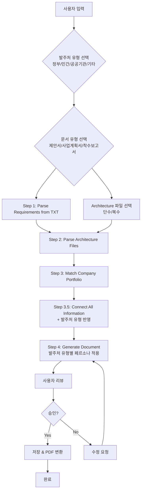

# Business Document Generator System - 구현 계획서

본 문서는 `business_document_generator` 시스템의 구현 계획을 담고 있습니다.

## 📋 목표

요구조건 문서와 기술 스택을 입력받아 자동으로 맞춤형 사업계획서, 제안서, 착수보고서를 생성하는 시스템 구축

**입력**: 
- 요구조건 문서 (`.txt` 파일)
- Architecture 파일 선택 (단수/복수)
- 발주처 유형 선택 (정부/민간/공공기관/기타)
- 문서 유형 선택 (제안서/사업계획서/착수보고서)

**출력**:
- `assets/[프로젝트명]/[프로젝트명]_[문서유형].md`
- `assets/[프로젝트명]/[프로젝트명]_[문서유형].pdf` (선택사항)

---

## 🏗️ 시스템 구조

### 폴더 구조

```
business_document_generator/
├── README.md                          # 사용 가이드
├── PLAN.md                            # 이 파일
├── prompts/
│   ├── Business_Document_Entry_Prompt.md    # 진입점 감지 및 라우팅
│   ├── Business_Document_Chain_Prompt.md    # 오케스트레이터
│   ├── 0.5_Select_Client_Type.md            # Step 0.5: 발주처 유형 선택
│   ├── 1_Parse_Requirements.md              # Step 1: 요구조건 파싱
│   ├── 2_Parse_Architecture.md              # Step 2: Architecture 파일 파싱
│   ├── 3_Match_Company_Portfolio.md          # Step 3: 회사 포트폴리오 매칭
│   ├── 3.5_Connect_All_Information.md        # Step 3.5: 정보 통합 연결
│   ├── 4_Generate_Document.md               # Step 4: 문서 생성
│   └── personas/                            # 발주처 유형별 페르소나
│       ├── Government_Persona.md             # 정부 기관 페르소나
│       ├── Private_Company_Persona.md        # 민간 기업 페르소나
│       ├── Public_Institution_Persona.md     # 공공기관 페르소나
│       └── Other_Persona.md                 # 기타 페르소나
├── templates/
│   ├── Proposal_Structure_Template.md        # 제안서 템플릿
│   ├── Business_Plan_Structure_Template.md    # 사업계획서 템플릿
│   └── Inception_Report_Structure_Template.md # 착수보고서 템플릿
└── data/
    ├── requirements/                  # 요구조건 문서 저장소
    └── temp/                          # 임시 데이터 저장소
```

---

## 🔄 워크플로우

### 워크플로우 다이어그램



---

## 🎯 각 단계별 상세 설계

### Step 0.5: Select Client Type (발주처 유형 선택)

**목적**: 발주처 유형에 따라 문서의 어조, 스타일, 강조점이 달라지므로 먼저 선택

**선택 옵션**:
- 정부 기관 (Government)
- 민간 기업 (Private Company)
- 공공기관 (Public Institution)
- 기타 (Other)

**출력**: `data/temp/client_type.txt`

### Step 1: Parse Requirements (요구조건 파싱)

**입력**: `data/requirements/[프로젝트명]_requirements.txt`

**처리**:
1. 프로젝트 기본 정보 추출
2. 핵심 요구사항 추출
3. 일정 및 예산 정보 추출
4. 고객/발주처 정보 추출

**출력**: `data/temp/requirements_analysis.json`

### Step 2: Parse Architecture Files (Architecture 파일 파싱)

**입력**: 선택한 Architecture 파일들 (단수/복수)

**처리**:
1. 선택된 파일들 읽기
2. 파일별 구조 분석
3. 통합 분석
4. 문서 생성용 정보 추출

**출력**: `data/temp/architecture_analysis.json`

### Step 3: Match Company Portfolio (회사 포트폴리오 매칭)

**입력**: 
- `requirements_analysis.json`
- `architecture_analysis.json`
- 포트폴리오 문서들

**처리**:
1. 요구사항과 매칭되는 프로젝트 식별
2. 회사 강점 추출
3. 매칭 점수 계산
4. 핵심 경험 선정

**출력**: `data/temp/company_portfolio_matching.json`

### Step 3.5: Connect All Information (정보 통합 연결)

**입력**: Step 1, 2, 3 출력 + 발주처 유형

**처리**:
1. 발주처 유형 반영
2. 서식 필드 매핑
3. 인력 정보 생성
4. 예산 정보 생성
5. 기술 내용 연결
6. 누락 항목 체크

**출력**: `data/temp/integrated_document_data.json`

### Step 4: Generate Document (문서 생성)

**입력**: 
- `integrated_document_data.json`
- 템플릿
- 발주처 유형별 페르소나

**처리**:
1. 템플릿 구조에 맞게 정보 배치
2. 다이어그램 생성 (각 섹션마다)
3. 한 줄 요약 작성
4. 세부 내용 작성 (발주처 유형별 페르소나 적용)
5. 순룡 페르소나 스타일 적용

**출력**: `data/temp/[문서유형]_content.md`

---

## 📊 문서 구조 원칙

모든 문서 섹션은 다음 구조를 따라야 합니다:

1. **머메이드 다이어그램**: 해당 섹션의 핵심 내용을 시각적으로 표현
2. **한 줄 요약**: 다이어그램을 한 문장으로 요약
3. **세부 내용**: 상세한 설명 및 내용 작성

---

## 🎭 발주처 유형별 페르소나

### 1. 정부 기관 페르소나
- 매우 공식적이고 격식있는 어조
- 법적/제도적 용어 사용
- 공공성과 국민 복리 강조

### 2. 민간 기업 페르소나
- 비즈니스 중심, 실용적 어조
- ROI 및 수익성 강조
- 효율성과 성과 중심

### 3. 공공기관 페르소나
- 공공성과 사회적 가치 강조
- 정책적 맥락 포함
- 지속가능성 및 포용성 강조

### 4. 기타 페르소나
- 유연한 어조
- 특수 목적에 맞춤

---

## 🔗 관련 문서

- `prompts/Portfolio_Entry_Prompt.md` - **통합 진입점 (우선 사용 권장)**
- `README.md` - 사용 가이드
- `../resume_generator/PLAN.md` - 이력서 생성 시스템 계획서 (참고)
- `../prompts/Portfolio_Question_Entry_Prompt.md` - 포트폴리오 질문 시스템 진입점 (참고)

---

## 통합 진입점 연동

**⚠️ 중요**: 포트폴리오 폴더를 언급할 때는 통합 진입점(`prompts/Portfolio_Entry_Prompt.md`)을 우선 사용하는 것을 권장합니다.

- 통합 진입점에서 `generate_business_document` 선택 시 → `Business_Document_Entry_Prompt.md`로 라우팅
- 독립 실행도 가능 (하위 호환성 유지)
- 사업계획서/제안서 관련 키워드만 언급 시 → `Business_Document_Entry_Prompt.md` 직접 실행 가능

---

**생성 일시**: 2025-01-XX
**최종 수정**: 2026-01-05 (통합 진입점 연동)
**작성자**: Claude Code

