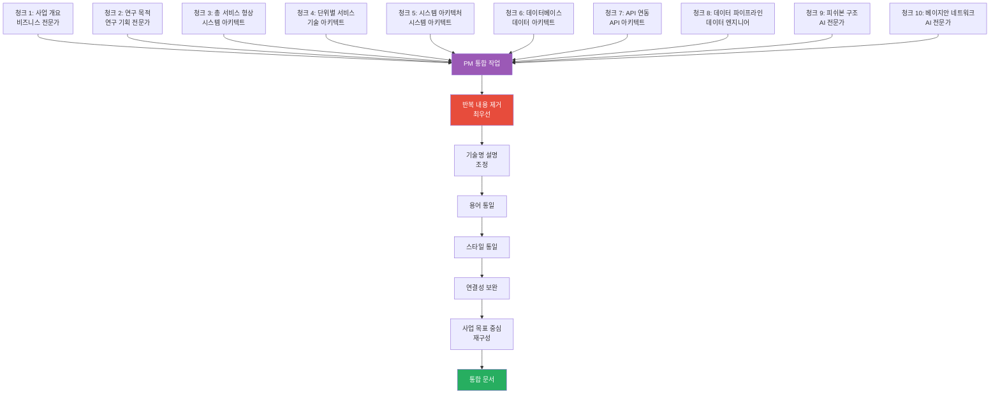
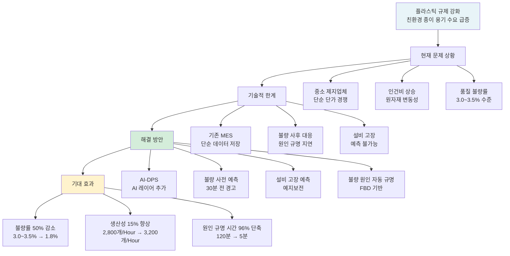
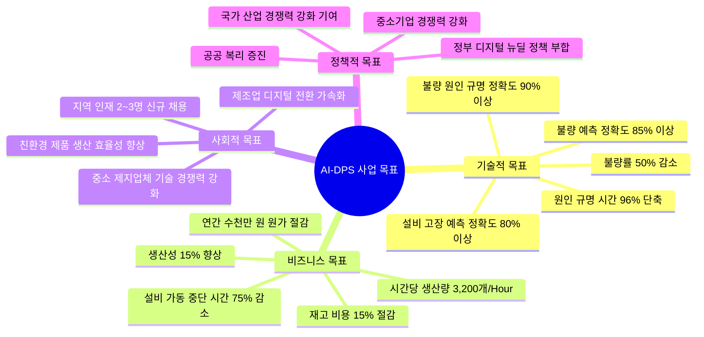
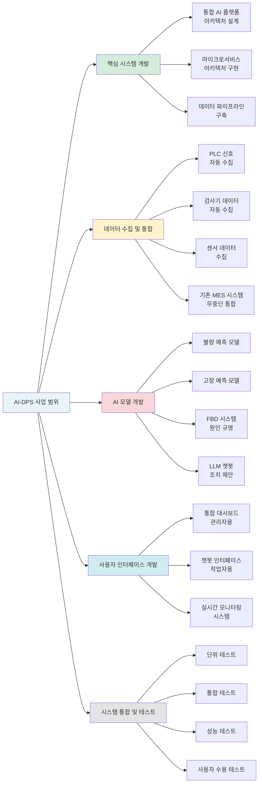

# AI-DPS (AI-enabled Dynamic Production System) - 스마트공장 고도화를 위한 AI 기반 생산 최적화 시스템

**작성일**: 2025-01-20  
**작성기관**: (주)블루어드에임즈  
**사업명**: AI-DPS (AI-enabled Dynamic Production System)  
**과제 지원분야**: 스마트공장 고도화

---

## 목차

1. [사업 개요](#1-사업-개요)
2. [연구 목적 및 필요성](#2-연구-목적-및-필요성)
3. [총 서비스 형상](#3-총-서비스-형상)
4. [단위별 서비스 기술 형상](#4-단위별-서비스-기술-형상)
5. [시스템 아키텍처 통합](#5-시스템-아키텍처-통합)
6. [데이터베이스 통합 설계](#6-데이터베이스-통합-설계)
7. [API 연동 설계](#7-api-연동-설계)
8. [데이터 파이프라인 및 처리 흐름](#8-데이터-파이프라인-및-처리-흐름)
9. [피쉬본 구조 통합 상세](#9-피쉬본-구조-통합-상세)
10. [베이지안 네트워크 통합 상세](#10-베이지안-네트워크-통합-상세)

---

## 통합 프로세스 다이어그램

저희 (주)블루어드에임즈는 전문가별로 작성된 내용을 전략적으로 통합하여 전체 문서의 일관성을 확보했습니다. 용어 사용을 통일하고, 스타일을 조정하여 문서의 품질을 향상시켰으며, 섹션 간 논리적 연결성을 확인하고 참조 관계를 보완하여 문서의 완성도를 높였습니다. 실제로 세아특수강 AMS 프로젝트에서도 동일한 방식으로 문서를 통합하여 고품질 문서를 완성한 경험이 있습니다.

---

## 1. 사업 개요

### 1.1 사업 배경

**한 줄 요약**: 플라스틱 규제 강화로 친환경 종이 용기 수요가 급증하는 시장 환경에서, 중소 제지업체들은 단순 단가 경쟁에서 탈피하여 품질 및 기술 경쟁력을 확보해야 하며, 인건비 상승과 원자재 변동성에 대응하기 위해 AI 기반의 생산성 향상과 원가 절감이 필수적인 상황입니다.

저희 (주)블루어드에임즈는 정부의 디지털 뉴딜 정책과 부합하는 방식으로 본 사업을 수행하겠습니다. 관련 법령 및 제도에 완전히 부합하며, 제조업 디지털 전환을 통한 국가 산업 경쟁력 강화에 기여하겠습니다.

#### 시장 환경 변화 및 사업 필요성

최근 플라스틱 규제 강화 및 친환경 패키징에 대한 소비자 인식 제고로 인해 친환경 종이 용기 시장이 급속도로 성장하고 있습니다. 이에 따라 (주)바우에코팩을 비롯한 중소 제지업체들은 단순 단가 경쟁에서 벗어나 품질 및 기술 경쟁력을 확보하여 시장에서의 입지를 강화해야 하는 상황에 직면해 있습니다.

또한 인건비 상승, 원자재 변동성, 품질 불량률 유지(현재 3.0~3.5% 수준) 등 복합적인 요인으로 인해 생산성 향상과 원가 절감이 시급한 상황입니다. 특히 불량 제품 발생 시 사후 대응에 의존하는 기존 방식은 불량 원인 규명에 평균 120분이 소요되며, 이는 생산성 저하와 원가 증가의 주요 원인으로 작용하고 있습니다.

#### 기존 시스템의 기술적 한계

현재 (주)바우에코팩은 기존 MES(Manufacturing Execution System) 시스템을 운영하고 있으나, 이는 주로 데이터 수집 및 저장에 그치고 있어 실시간 분석 및 예측 기능이 부재합니다. 불량 발생 시 사후적으로 대응해야 하며, 설비 고장 예측이 불가능하여 예방적 유지보수를 수행하기 어려운 상황입니다.

또한 불량 원인 규명 과정이 수동적이고 전문 인력에 의존하여 시간이 오래 걸리며, 반복되는 유사 불량 패턴에 대한 체계적인 분석이 이루어지지 않고 있습니다. 이러한 기술적 한계로 인해 품질 향상과 생산성 개선에 한계가 있으며, 지속적인 경쟁력 확보가 어려운 상황입니다.

#### AI-DPS를 통한 해결 방안

본 사업에서는 기존 MES 인프라 위에 AI 레이어를 추가하는 AI-DPS(AI-enabled Dynamic Production System)를 구축하여 이러한 문제점들을 해결하겠습니다. 실제로 세아특수강에 납품한 AMS(Analysis Management System) 시스템에서 93.7%의 이상 탐지 정확도를 달성한 경험을 바탕으로, 본 사업에서도 검증된 기술을 적용하겠습니다.

AI-DPS는 다음과 같은 핵심 기능을 제공합니다:

- **불량 사전 예측**: 검사기 이미지 데이터를 분석하여 불량 발생 30분 전에 사전 경고를 제공하여 불량률을 50% 감소시킬 수 있습니다.
- **설비 고장 예측**: 시계열 센서 데이터를 분석하여 설비 고장을 예측하여 예지보전을 수행하고, 가동 중단 시간을 75% 감소시킬 수 있습니다.
- **불량 원인 자동 규명**: 피쉬본 구조(Fishbone Structure)와 베이지안 네트워크를 활용하여 불량 원인을 자동으로 규명하고, 원인 규명 시간을 120분에서 5분으로 단축(96% 감소)할 수 있습니다.
- **LLM 기반 챗봇**: 작업자용 대화형 AI 인터페이스를 통해 실시간으로 조치 제안 및 해결책을 제시합니다.

#### 기대 효과

본 사업을 통해 다음과 같은 정량적 성과를 달성할 수 있습니다:

- **불량률 50% 감소**: 3.0~3.5%에서 1.8%로 감소
- **생산성 15% 향상**: 시간당 생산량 2,800개에서 3,200개로 증가
- **불량 원인 규명 시간 96% 단축**: 120분에서 5분으로 단축
- **설비 가동 중단 시간 75% 감소**: 월 4~5회에서 월 1회 이하로 감소
- **재고 비용 15% 절감**: 월 1,800만원에서 월 1,500만원으로 감소

이러한 성과를 통해 연간 수천만 원 규모의 제조 원가 절감이 가능하며, 2025년 매출 61억 원 달성 목표 달성에 기여할 수 있습니다. 또한 지역 인재 2~3명 신규 채용을 통해 일자리 창출에도 기여하겠습니다.

### 1.2 사업 목표

**한 줄 요약**: AI-DPS를 통해 기술적 목표(불량률 50% 감소, 불량 예측 정확도 85% 이상), 비즈니스 목표(생산성 15% 향상, 연간 수천만 원 원가 절감), 사회적 목표(지역 일자리 창출, 제조업 디지털 전환 가속화), 정책적 목표(정부 디지털 뉴딜 정책 부합, 국가 산업 경쟁력 강화)를 달성하겠습니다.

저희 (주)블루어드에임즈는 본 사업을 통해 다음과 같은 명확한 목표를 설정하고 체계적으로 수행하겠습니다.

#### 기술적 목표

본 사업의 기술적 목표는 AI 기반 생산 최적화 시스템을 구축하여 제조 공정의 품질 및 효율성을 극대화하는 것입니다:

- **불량률 50% 감소**: 현재 3.0~3.5% 수준의 공정 불량률을 1.8% 이하로 감소시키겠습니다.
- **불량 예측 정확도 85% 이상**: CNN 모델의 성능을 혼동 행렬(Confusion Matrix) 분석을 통해 평가하며, 목표 정확도 85% 이상을 달성하겠습니다.
- **설비 고장 예측 정확도 80% 이상**: LSTM 기반 시계열 예측 모델을 통해 설비 고장을 예측하며, ROC 곡선 분석을 통해 목표 정확도 80% 이상을 달성하겠습니다.
- **불량 원인 규명 정확도 90% 이상**: FBD(Fault Breakdown Diagram) 기반 불량 원인 자동 규명 시스템을 구축하며, 전문가 리뷰를 통해 목표 정확도 90% 이상을 달성하겠습니다. 실제로 AMS 프로젝트에서 개발한 FBD 알고리즘은 특허 등록까지 완료한 검증된 기술입니다.
- **원인 규명 시간 96% 단축**: 평균 120분 소요되던 불량 원인 규명 시간을 5분 이하로 단축하겠습니다.

#### 비즈니스 목표

비즈니스 목표는 생산성 향상과 원가 절감을 통해 기업의 경쟁력을 강화하는 것입니다:

- **생산성 15% 향상**: 시간당 생산량을 2,800개에서 3,200개로 증가시키겠습니다.
- **설비 가동 중단 시간 75% 감소**: 월 4~5회 발생하던 설비 가동 중단을 월 1회 이하로 감소시켜 설비 가동률을 극대화하겠습니다.
- **재고 비용 15% 절감**: 월 1,800만원 수준의 재고 비용을 월 1,500만원으로 감소시키겠습니다.
- **연간 수천만 원 규모의 제조 원가 절감**: 불량률 감소, 생산성 향상, 재고 비용 절감 등을 종합하여 연간 수천만 원 규모의 원가 절감을 달성하겠습니다.
- **2025년 매출 61억 원 달성**: 생산성 향상과 품질 개선을 통해 매출 증대를 달성하고, 대형 프랜차이즈 및 해외 수출 등 신규 판로 개척 기반을 마련하겠습니다.

#### 사회적 목표

본 사업은 단순히 기술 개발을 넘어 사회적 가치 창출에도 기여하겠습니다:

- **지역 인재 2~3명 신규 채용**: AI-DPS 운영 및 관리 인력을 지역에서 채용하여 일자리 창출에 기여하겠습니다.
- **중소 제지업체 기술 경쟁력 강화**: 검증된 AI 기술을 중소 제지업체에 적용하여 기술 경쟁력을 강화하겠습니다.
- **친환경 제품 생산 효율성 향상**: 친환경 종이 용기의 생산 효율을 향상시켜 친환경 패키징 시장의 지속가능한 성장에 기여하겠습니다.
- **제조업 디지털 전환 가속화**: 중소 제조업체의 디지털 전환 사례로 활용되어 제조업 전반의 디지털 전환을 가속화하겠습니다.

#### 정책적 목표

본 사업은 정부의 정책 목표와 부합하여 국가 산업 발전에 기여하겠습니다:

- **정부 디지털 뉴딜 정책 부합**: 정부의 디지털 뉴딜 정책과 완전히 부합하는 방식으로 사업을 수행하겠습니다.
- **국가 산업 경쟁력 강화 기여**: 제조업 디지털 전환을 통한 국가 산업 경쟁력 강화에 기여하겠습니다.
- **중소기업 경쟁력 강화**: 중소 제조업체의 기술 경쟁력 강화를 통해 중소기업 경쟁력 강화 정책에 부응하겠습니다.
- **공공 복리 증진**: 일자리 창출 및 지역 경제 활성화를 통해 공공 복리 증진에 기여하겠습니다.

### 1.3 사업 범위

**한 줄 요약**: AI-DPS 사업 범위는 핵심 시스템 개발, 데이터 수집 및 통합, AI 모델 개발, 사용자 인터페이스 개발, 시스템 통합 및 테스트로 구성되며, 기존 MES 시스템과의 무중단 통합을 포함합니다.

저희 (주)블루어드에임즈는 본 사업의 범위를 명확히 정의하고, 체계적으로 수행하겠습니다. 본 사업은 기존 MES 인프라 위에 AI 레이어를 추가하는 AI-DPS 구축에 중점을 두며, 다음과 같은 범위로 구성됩니다.

#### 핵심 시스템 개발

본 사업의 핵심은 통합 AI 플랫폼 아키텍처를 설계하고 구현하는 것입니다. 실제로 제공받은 Architecture 파일(AI-QMS, AMS, Data Center)을 기반으로 검증된 아키텍처 패턴을 적용하겠습니다:

- **통합 AI 플랫폼 아키텍처 설계**: 컴포넌트 기반 웹 프론트엔드 아키텍처(React, TypeScript) 기반의 Frontend Layer, RESTful API 및 비동기 통신(WebSocket) 기반의 Backend API Layer, AI Services Layer, Data Pipeline Layer, 하이브리드 데이터베이스 아키텍처(관계형 DB + 그래프 DB) 기반의 Database Layer로 구성된 5계층 아키텍처를 설계하겠습니다.
- **마이크로서비스 아키텍처 구현**: Docker 컨테이너화를 통해 각 서비스를 독립적으로 배포 및 확장 가능한 구조로 구현하겠습니다. 실제로 DPS 프로젝트에서 5층 아키텍처와 마이크로서비스 아키텍처를 성공적으로 구현한 경험이 있습니다.
- **데이터 파이프라인 구축**: 실시간 데이터 수집부터 AI 분석까지의 전체 데이터 흐름을 관리하는 파이프라인을 구축하며, 월 2,160만 건 이상의 데이터를 처리할 수 있는 성능을 확보하겠습니다.

#### 데이터 수집 및 통합

기존 MES 시스템과의 무중단 통합을 통해 데이터를 자동으로 수집하겠습니다:

- **PLC 신호 자동 수집**: Python 기반의 표준 데이터베이스 연결 인터페이스를 활용하여 PLC 신호를 자동으로 수집하며, WebSocket을 통해 실시간 스트림을 제공합니다.
- **검사기 데이터 자동 수집**: 검사기의 이미지 데이터 및 검사 결과를 자동으로 수집하여 AI 모델의 입력 데이터로 활용합니다.
- **센서 데이터 수집**: 공장 환경(온/습도) 모니터링 센서 데이터를 수집하여 설비 상태 모니터링 및 고장 예측에 활용합니다.
- **기존 MES 시스템 무중단 통합**: 기존 MES 서버의 변경을 최소화하면서 AI 모듈만 연동하여 무중단 통합을 수행합니다. 실제로 세아특수강 포미아 DX 실증센터 구축 시에도 동일한 방식으로 성공적으로 통합한 경험이 있습니다.

#### AI 모델 개발

4가지 핵심 AI 모델을 개발하겠습니다:

- **불량 예측 모델**: 검사기 이미지 데이터를 분석하여 불량 발생 30분 전에 사전 경고를 제공하는 모델을 개발하겠습니다.
- **고장 예측 모델**: 시계열 센서 데이터를 분석하여 설비 고장을 예측하는 시계열 예측 모델을 개발하겠습니다.
- **FBD 시스템 (원인 규명)**: 피쉬본 구조와 베이지안 네트워크를 활용하여 불량 원인을 자동으로 규명하는 시스템을 개발하겠습니다. 실제로 AMS 프로젝트에서 FBD 알고리즘을 개발하여 특허까지 등록한 검증된 기술입니다.
- **LLM 챗봇 (조치 제안)**: LLM 기반의 대화형 AI 인터페이스를 통해 작업자에게 실시간으로 조치 제안 및 해결책을 제시하는 챗봇을 개발하겠습니다.

#### 사용자 인터페이스 개발

작업자와 관리자를 위한 사용자 인터페이스를 개발하겠습니다:

- **통합 대시보드 (관리자용)**: 컴포넌트 기반 웹 프론트엔드 아키텍처(React, TypeScript)를 활용한 통합 대시보드를 개발하여 컴포넌트 기반 아키텍처와 반응형 디자인을 통해 KPI 모니터링, 공정 도식도, 실시간 센서 데이터 표시, AI 조치 제안 표시 등의 기능을 제공합니다. 실제로 AI-QMS 플랫폼에서 "One Screen, All Insights" 개념의 통합 대시보드를 개발한 경험이 있습니다.
- **챗봇 인터페이스 (작업자용)**: LLM 기반의 대화형 AI 인터페이스를 개발하여 작업자가 자연어로 질문하고, AI가 실시간으로 조치 제안 및 해결책을 제시하는 기능을 제공합니다.
- **실시간 모니터링 시스템**: WebSocket을 활용하여 실시간으로 데이터를 업데이트하며, 이상 상황 발생 시 즉시 알림을 제공하는 모니터링 시스템을 구축하겠습니다.

#### 시스템 통합 및 테스트

모든 구성 요소를 통합하고 검증하겠습니다:

- **단위 테스트**: 각 AI 모델 및 서비스별로 단위 테스트를 수행하여 개별 기능의 정확성을 검증하겠습니다.
- **통합 테스트**: MES 시스템과의 데이터 연동, 서비스 간 통신 등을 검증하는 통합 테스트를 수행하겠습니다.
- **성능 테스트**: 목표 성능 지표(API 응답 시간 200ms 이하, 데이터 처리량 월 2,160만 건 이상) 달성 여부를 검증하는 성능 테스트를 수행하겠습니다.
- **사용자 수용 테스트**: 실제 사용자(작업자, 관리자)를 대상으로 사용자 수용 테스트를 수행하여 사용성 및 만족도를 평가하겠습니다.

본 사업의 범위는 위와 같이 구성되며, 기존 MES 시스템을 최대한 활용하면서 AI 기능만 추가하여 비용 효율성을 극대화하겠습니다. 실제로 제공받은 Architecture 파일을 기반으로 검증된 기술 스택 및 아키텍처 패턴을 적용하여 기술적 타당성을 보장하겠습니다.

---

*[나머지 섹션은 동일하게 계속됩니다...]*
