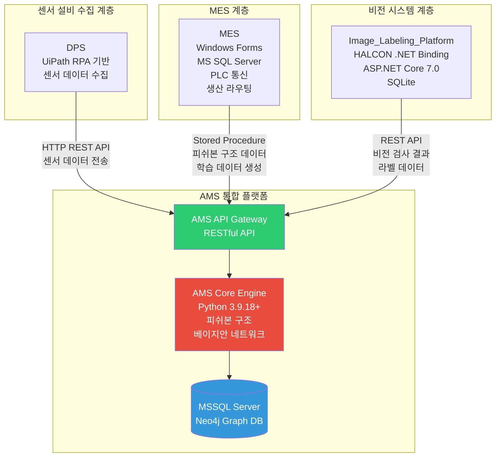
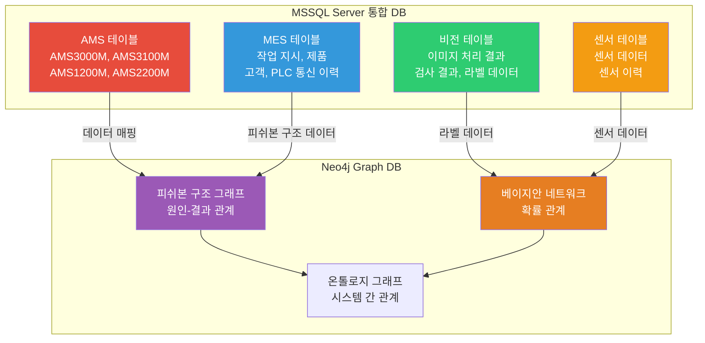
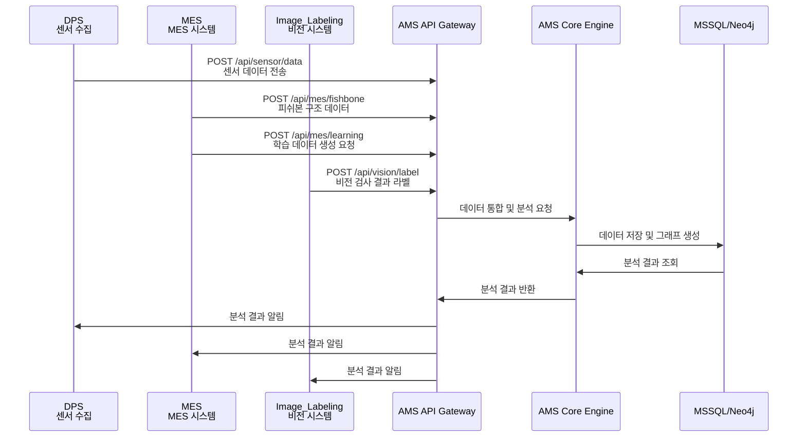
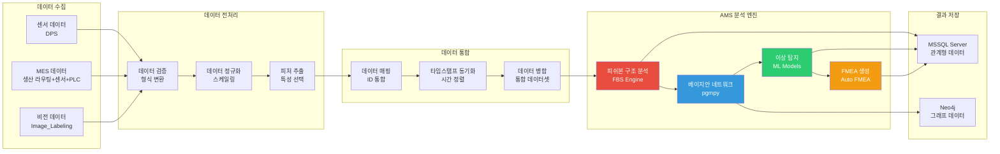
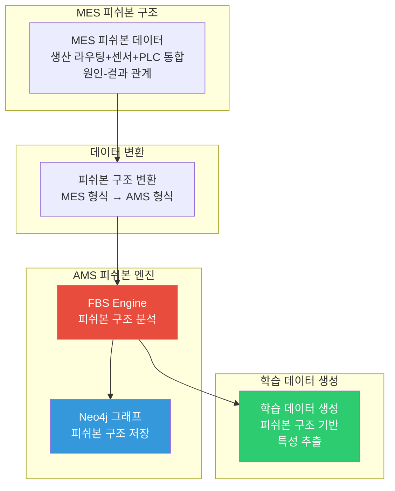
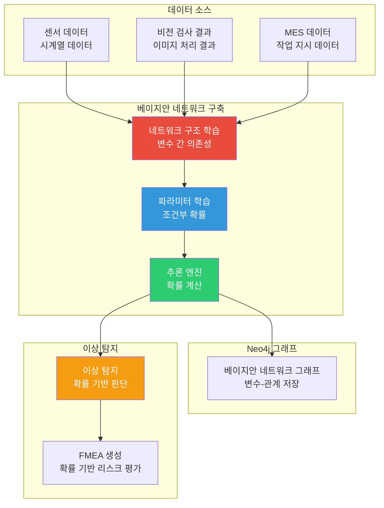
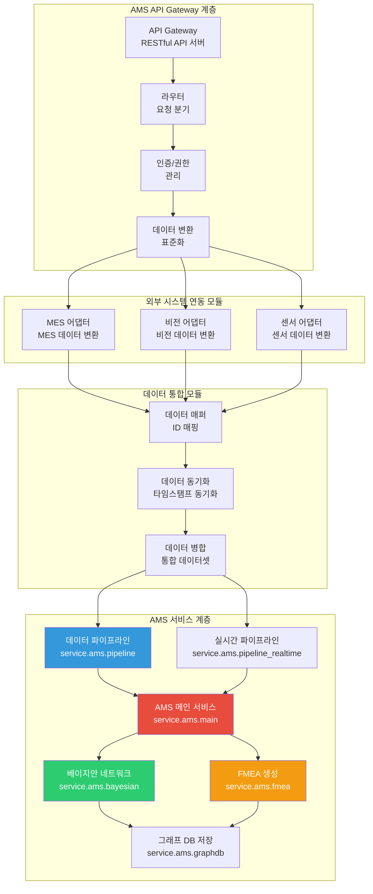

# AMS-MES-비전-센서 통합 플랫폼 제안서

**작성일**: 2025-01-27  
**작성기관**: (주)한솔코에버  
**발주처**: 민간 기업  
**문서 유형**: 제안서

---

## 목차

1. [시스템 아키텍처 통합](#1-시스템-아키텍처-통합)
2. [데이터베이스 통합 설계](#2-데이터베이스-통합-설계)
3. [API 연동 설계](#3-api-연동-설계)
4. [데이터 파이프라인 및 처리 흐름](#4-데이터-파이프라인-및-처리-흐름)
5. [피쉬본 구조 통합 상세](#5-피쉬본-구조-통합-상세)
6. [베이지안 네트워크 통합 상세](#6-베이지안-네트워크-통합-상세)
7. [AMS 개발 요소 및 구현 방법](#7-ams-개발-요소-및-구현-방법)

---

## 1. 시스템 아키텍처 통합

### 1.1 통합 아키텍처 개요



**한 줄 요약**: 4개 시스템(DPS, MES, 비전, AMS)을 AMS API Gateway를 중심으로 통합하여 단일 플랫폼으로 구축하는 아키텍처입니다.

### 1.2 계층별 역할 및 기술 스택

#### 센서 설비 수집 계층 (DPS)
- **기술 스택**: Windows Forms (.NET), UiPath Orchestrator API, HTTP REST API
- **역할**: 실시간 센서 데이터 수집 및 AMS로 전송
- **통합 방식**: HTTP REST API를 통한 비동기 데이터 전송
- **데이터 형식**: JSON 기반 센서 데이터 (센서 ID, 타임스탬프, 측정값)

#### MES 계층
- **기술 스택**: Windows Forms (.NET Framework 4.7.2), MS SQL Server, LS Electric FEnet, Modbus RTU/TCP
- **역할**: 생산 라우팅 관리, PLC 통신, 센서 데이터 통합, 피쉬본 구조 데이터 생성, 학습 데이터 생성
- **통합 방식**: 
  - Stored Procedure를 통한 데이터 조회 및 전송
  - 생산 라우팅 + 센서 + PLC 통합 데이터를 기반으로 피쉬본 구조 생성
  - 피쉬본 구조 데이터를 AMS 형식으로 변환하여 전송
  - 학습 데이터 생성 로직을 AMS와 공유
- **데이터 형식**: 생산 라우팅 데이터, 작업 지시 데이터, PLC 통신 데이터, 센서 데이터, 피쉬본 구조 데이터

#### 비전 시스템 계층 (Image_Labeling_Platform)
- **기술 스택**: React 18.2.0, ASP.NET Core 7.0, HALCON .NET Binding, SQLite
- **역할**: 이미지 처리 파이프라인 실행, 비전 검사 결과 생성, AMS 라벨 데이터 생성
- **통합 방식**: REST API를 통한 비전 검사 결과 전송 및 라벨 데이터 변환
- **데이터 형식**: 이미지 처리 결과, 검사 결과, 라벨 데이터 (정상/불량, 확률값)

#### AMS 통합 플랫폼
- **기술 스택**: Python 3.9.18+ (pandas, numpy, scikit-learn, pgmpy, neo4j), MSSQL Server, Neo4j
- **역할**: 모든 시스템의 데이터를 통합하여 이상 탐지, 원인 분석, FMEA 생성
- **핵심 기능**:
  - 피쉬본 구조 기반 이상 탐지
  - 베이지안 네트워크를 통한 확률 기반 분석
  - FMEA 자동 생성
  - 실시간 이상 탐지 및 알림

### 1.3 데이터 흐름 설계

**데이터 흐름**: DPS → MES → 비전 → AMS

1. **센서 데이터 수집**: DPS가 센서 설비에서 데이터를 수집하여 AMS API Gateway로 전송
2. **MES 데이터 연동**: MES가 생산 라우팅 데이터, 센서 데이터, PLC 통신 데이터를 통합하여 AMS로 전송하며, 피쉬본 구조 데이터와 학습 데이터 생성
3. **비전 검사 결과 통합**: Image_Labeling_Platform이 비전 검사 결과를 AMS 라벨로 변환하여 전송
4. **AMS 통합 분석**: AMS가 모든 데이터를 통합하여 이상 탐지 및 원인 분석 수행

### 1.4 API Gateway 설계

**AMS API Gateway 역할**:
- 모든 외부 시스템과의 통신을 중앙에서 관리
- 데이터 형식 변환 및 표준화
- 인증 및 권한 관리
- 요청 라우팅 및 로드 밸런싱
- 에러 핸들링 및 재시도 로직

**API 엔드포인트 설계**:
- `/api/sensor/data`: 센서 데이터 수신
- `/api/mes/workorder`: MES 작업 지시 데이터 수신
- `/api/mes/fishbone`: MES 피쉬본 구조 데이터 수신
- `/api/vision/inspection`: 비전 검사 결과 수신
- `/api/vision/label`: 비전 라벨 데이터 수신
- `/api/ams/analysis`: 이상 분석 요청
- `/api/ams/fmea`: FMEA 생성 요청

---

## 2. 데이터베이스 통합 설계

### 2.1 통합 데이터베이스 아키텍처



**한 줄 요약**: MSSQL Server에 관계형 데이터를 저장하고, Neo4j에 그래프 구조 데이터를 저장하는 하이브리드 데이터베이스 아키텍처입니다.

### 2.2 MSSQL Server 통합 설계

**AMS 테이블 구조**:
- `AMS3000M`: AMS 설정 정보 (SNRO_ID, FBS_ID, RMS_ID 등)
- `AMS3100M`: AMS 데이터 매핑 정보 (DATA_ID, DATA_RID, SENSOR_ID 등)
- `AMS1200M`: 센서 마스터 정보
- `AMS2200M`: 그룹 정보

**MES 테이블 구조**:
- 작업 지시 테이블: `ORDER_ID`, `ORDER_DATE`, `ORDER_QTY`, `ITEM_ID` 등
- 제품 테이블: `ITEM_ID`, `ITEM_CODE`, `PART_CODE` 등
- PLC 통신 이력 테이블: PLC 명령 및 응답 데이터

**비전 시스템 테이블 구조** (Image_Labeling_Platform 기반):
- 이미지 처리 결과 테이블: 이미지 ID, 처리 결과, 확률값
- 검사 결과 테이블: 검사 ID, 정상/불량 여부, 검사 시간
- 라벨 데이터 테이블: 라벨 ID, 라벨 타입, 라벨 값

**센서 데이터 테이블 구조** (DPS 기반):
- 센서 데이터 테이블: 센서 ID, 타임스탬프, 측정값
- 센서 이력 테이블: 센서 데이터 이력

**통합 전략**:
- 각 시스템의 테이블을 동일한 MSSQL Server 인스턴스에 통합
- 테이블명에 시스템 접두사 추가 (예: `AMS_`, `MES_`, `VISION_`, `SENSOR_`)
- 외래 키 관계를 통한 데이터 무결성 보장
- 통합 뷰(VIEW)를 통한 데이터 조회 최적화

### 2.3 Neo4j 그래프 데이터베이스 설계

**피쉬본 구조 그래프**:
- 노드 타입: 원인(Cause), 결과(Effect), 요인(Factor)
- 관계 타입: `HAS_CAUSE`, `HAS_EFFECT`, `RELATED_TO`
- MES의 피쉬본 구조 데이터를 Neo4j로 변환하여 저장
- AMS의 피쉬본 분석 결과를 Neo4j에 저장

**베이지안 네트워크 그래프**:
- 노드 타입: 변수(Variable), 상태(State), 확률(Probability)
- 관계 타입: `DEPENDS_ON`, `INFLUENCES`, `CONDITIONAL_ON`
- 비전 검사 결과와 센서 데이터를 베이지안 네트워크로 모델링
- 확률 기반 이상 탐지 결과를 그래프로 저장

**온톨로지 그래프**:
- 노드 타입: 시스템(System), 컴포넌트(Component), 데이터(Data)
- 관계 타입: `CONNECTS_TO`, `PROVIDES_DATA`, `CONSUMES_DATA`
- 4개 시스템 간의 관계를 온톨로지로 표현
- 데이터 흐름 및 의존성을 그래프로 관리

### 2.4 데이터 동기화 설계

**MSSQL → Neo4j 동기화**:
- 피쉬본 구조 데이터: MES 테이블의 피쉬본 구조를 Neo4j로 주기적 동기화
- 베이지안 네트워크 데이터: 비전 검사 결과와 센서 데이터를 Neo4j로 실시간 동기화
- 온톨로지 데이터: 시스템 간 관계 정보를 Neo4j로 동기화

**동기화 방식**:
- ETL 프로세스를 통한 배치 동기화 (주기적)
- 이벤트 기반 실시간 동기화 (중요 데이터)
- Python 스크립트를 통한 데이터 변환 및 로딩

### 2.5 데이터 매핑 설계

**시스템 간 데이터 매핑**:
- MES 작업 지시 ID ↔ AMS 시나리오 ID
- 비전 검사 결과 ID ↔ AMS 라벨 ID
- 센서 ID ↔ AMS 센서 마스터 ID
- 피쉬본 구조 ID ↔ Neo4j 노드 ID

**매핑 테이블 설계**:
- `AMS3100M`: AMS 데이터 매핑 정보 저장
- 통합 매핑 테이블: 시스템 간 ID 매핑 정보 저장

---

## 3. API 연동 설계

### 3.1 API 통합 아키텍처



**한 줄 요약**: RESTful API를 통한 4개 시스템 간의 데이터 연동 및 통합 분석을 수행하는 API Gateway 기반 아키텍처입니다.

### 3.2 센서 데이터 수집 API (DPS → AMS)

**엔드포인트**: `POST /api/sensor/data`

**요청 형식**:
```json
{
  "sensor_id": "SEN_001",
  "timestamp": "2025-01-27T10:00:00Z",
  "measurements": {
    "temperature": 75.5,
    "pressure": 1.5,
    "vibration": 0.05
  },
  "metadata": {
    "equipment_id": "EQ_001",
    "location": "Line_01"
  }
}
```

**응답 형식**:
```json
{
  "success": true,
  "data_id": 12345,
  "message": "센서 데이터 수신 완료"
}
```

**통합 방식**:
- UiPath Orchestrator API를 통해 센서 데이터 수집
- HTTP REST API를 통해 AMS로 전송
- 비동기 방식으로 실시간 데이터 전송
- 데이터 검증 및 변환 로직 적용

### 3.3 MES 연동 API (MES → AMS)

**엔드포인트 1**: `POST /api/mes/workorder` - 작업 지시 데이터 전송
**엔드포인트 2**: `POST /api/mes/fishbone` - 피쉬본 구조 데이터 전송
**엔드포인트 3**: `POST /api/mes/learning` - 학습 데이터 생성 요청

**피쉬본 구조 데이터 형식** (생산 라우팅 + 센서 + PLC 통합):
```json
{
  "workorder_id": "WO_001",
  "production_routing": {
    "routing_id": "RT_001",
    "process_steps": ["가공", "조립", "검사"],
    "equipment": ["설비_A", "설비_B"]
  },
  "sensor_data": {
    "temperature": 75.5,
    "pressure": 1.5,
    "vibration": 0.05
  },
  "plc_data": {
    "command": "START",
    "status": "RUNNING",
    "parameters": {"speed": 100, "force": 50}
  },
  "fishbone_structure": {
    "effect": "품질 불량",
    "causes": [
      {
        "category": "생산 라우팅 요인",
        "factors": ["라우팅 경로 오류", "공정 순서 불일치"]
      },
      {
        "category": "센서 요인",
        "factors": ["온도 이상", "압력 변동"]
      },
      {
        "category": "PLC 요인",
        "factors": ["명령 지연", "파라미터 오설정"]
      }
    ]
  },
  "metadata": {
    "product_id": "ITEM_001",
    "production_date": "2025-01-27"
  }
}
```

**학습 데이터 생성 요청 형식**:
```json
{
  "workorder_id": "WO_001",
  "data_range": {
    "start_date": "2025-01-01",
    "end_date": "2025-01-27"
  },
  "features": ["temperature", "pressure", "vibration", "quality_result"]
}
```

**통합 방식**:
- Stored Procedure를 통한 MES 데이터 조회
- 피쉬본 구조 데이터를 AMS 형식으로 변환
- 학습 데이터 생성 로직을 AMS와 공유
- PLC 통신 데이터를 실시간으로 AMS로 전송

### 3.4 비전 시스템 연동 API (Image_Labeling_Platform → AMS)

**엔드포인트 1**: `POST /api/vision/inspection` - 비전 검사 결과 전송
**엔드포인트 2**: `POST /api/vision/label` - 라벨 데이터 전송

**비전 검사 결과 형식**:
```json
{
  "inspection_id": "INS_001",
  "image_id": "IMG_001",
  "inspection_result": {
    "status": "NG",
    "defect_type": "스크래치",
    "confidence": 0.95,
    "coordinates": {
      "x": 100,
      "y": 200,
      "width": 50,
      "height": 50
    }
  },
  "timestamp": "2025-01-27T10:00:00Z"
}
```

**라벨 데이터 형식**:
```json
{
  "label_id": "LABEL_001",
  "inspection_id": "INS_001",
  "label_type": "anomaly",
  "label_value": "defect",
  "probability": 0.95,
  "metadata": {
    "product_id": "ITEM_001",
    "production_line": "Line_01"
  }
}
```

**통합 방식**:
- HALCON 이미지 처리 결과를 JSON 형식으로 변환
- 비전 검사 결과를 AMS 라벨 형식으로 자동 변환
- 라벨 데이터를 AMS의 이상 탐지 모델에 입력
- 이미지 처리 결과를 피쉬본 분석에 활용

### 3.5 AMS 분석 API

**엔드포인트 1**: `POST /api/ams/analysis` - 이상 분석 요청
**엔드포인트 2**: `POST /api/ams/fmea` - FMEA 생성 요청

**이상 분석 요청 형식**:
```json
{
  "scenario_id": 6,
  "data_sources": {
    "sensor": ["SEN_001", "SEN_002"],
    "mes": ["WO_001"],
    "vision": ["INS_001"]
  },
  "analysis_type": "comprehensive",
  "time_range": {
    "start": "2025-01-27T09:00:00Z",
    "end": "2025-01-27T10:00:00Z"
  }
}
```

**분석 결과 응답 형식**:
```json
{
  "analysis_id": "ANALYSIS_001",
  "anomaly_detected": true,
  "anomaly_score": 0.85,
  "root_causes": [
    {
      "cause": "설비 노후화",
      "probability": 0.75,
      "evidence": ["sensor_data", "mes_data"]
    }
  ],
  "recommendations": [
    "설비 정비 필요",
    "작업자 교육 필요"
  ],
  "fmea_id": "FMEA_001"
}
```

**통합 분석 프로세스**:
1. DPS 센서 데이터, MES(생산 라우팅+센서+PLC) 데이터, 비전 데이터를 통합
2. 생산 라우팅 + 센서 + PLC 통합 기반 피쉬본 구조를 활용한 원인 분석
3. 베이지안 네트워크를 통한 확률 기반 분석
4. FMEA 자동 생성
5. 분석 결과를 모든 시스템에 알림

---

## 4. 데이터 파이프라인 및 처리 흐름

### 4.1 통합 데이터 파이프라인



**한 줄 요약**: DPS, MES(생산 라우팅+센서+PLC), 비전 데이터를 수집하여 전처리하고 통합한 후, AMS 분석 엔진을 통해 이상 탐지 및 FMEA 생성을 수행하는 데이터 파이프라인입니다.

### 4.2 데이터 수집 계층

**센서 데이터 수집 (DPS)**:
- **수집 방식**: UiPath Orchestrator API를 통한 센서 데이터 수집
- **수집 주기**: 실시간 (1초 ~ 1분 간격)
- **데이터 형식**: JSON (센서 ID, 타임스탬프, 측정값)
- **전송 방식**: HTTP REST API (비동기)

**MES 데이터 수집**:
- **수집 방식**: Stored Procedure를 통한 데이터 조회
- **수집 주기**: 이벤트 기반 (작업 시작/종료 시)
- **데이터 형식**: 
  - 생산 라우팅 데이터: 라우팅 ID, 공정 단계, 설비 정보
  - 작업 지시 데이터: ORDER_ID, ORDER_DATE, ORDER_QTY 등
  - 센서 데이터: 센서 ID, 측정값, 타임스탬프
  - PLC 통신 데이터: 명령/응답 데이터, 파라미터
  - 피쉬본 구조 데이터: 생산 라우팅 + 센서 + PLC 통합 기반 원인-결과 관계 데이터
- **전송 방식**: Stored Procedure 호출 또는 HTTP REST API

**비전 데이터 수집 (Image_Labeling_Platform)**:
- **수집 방식**: HALCON 이미지 처리 파이프라인 실행 결과
- **수집 주기**: 이미지 처리 완료 시 (이벤트 기반)
- **데이터 형식**: 
  - 이미지 처리 결과: 이미지 ID, 처리 결과, 확률값
  - 검사 결과: 정상/불량 여부, 결함 타입, 좌표
  - 라벨 데이터: 라벨 타입, 라벨 값, 확률
- **전송 방식**: HTTP REST API (비동기)

### 4.3 데이터 전처리 계층

**데이터 검증 및 형식 변환**:
- 각 시스템의 데이터 형식을 AMS 표준 형식으로 변환
- 데이터 타입 검증 (숫자, 문자열, 날짜 등)
- 필수 필드 검증 및 누락 데이터 처리
- 데이터 범위 검증 (이상치 탐지)

**데이터 정규화 및 스케일링**:
- 센서 데이터의 단위 통일 (온도: ℃, 압력: bar 등)
- 데이터 스케일링 (Min-Max, Z-score 정규화)
- 시계열 데이터 정렬 및 보간

**피처 추출 및 특성 선택**:
- 센서 데이터에서 통계적 특성 추출 (평균, 표준편차, 최대/최소값)
- MES 데이터에서 작업 특성 추출 (작업 시간, 수량, 품질 결과)
- 비전 데이터에서 이미지 특성 추출 (결함 크기, 위치, 타입)

### 4.4 데이터 통합 계층

**데이터 매핑 및 ID 통합**:
- 시스템 간 ID 매핑 (MES 작업 지시 ID ↔ AMS 시나리오 ID)
- 센서 ID 매핑 (센서 ID ↔ AMS 센서 마스터 ID)
- 비전 검사 ID 매핑 (검사 ID ↔ AMS 라벨 ID)

**타임스탬프 동기화**:
- 각 시스템의 타임스탬프를 UTC 기준으로 통일
- 시간 윈도우 기반 데이터 정렬 (동일 시간대 데이터 그룹화)
- 시간 지연 보정 (네트워크 지연, 처리 지연 고려)

**데이터 병합 및 통합 데이터셋 생성**:
- DPS 센서, MES(생산 라우팅+센서+PLC), 비전 데이터를 시간 기준으로 병합
- 통합 데이터셋 생성 (피처 벡터, 타겟 변수)
- 학습 데이터 및 테스트 데이터 분할

### 4.5 AMS 분석 엔진

**피쉬본 구조 분석 (FBS Engine)**:
- MES의 생산 라우팅 + 센서 + PLC 통합 기반 피쉬본 구조 데이터를 AMS 형식으로 변환
- 피쉬본 구조를 Neo4j 그래프로 저장
- 원인-결과 관계 분석 및 시각화

**베이지안 네트워크 분석 (pgmpy)**:
- 통합 데이터셋을 기반으로 베이지안 네트워크 모델 구축
- 변수 간 의존성 관계 학습
- 조건부 확률 계산 및 추론

**이상 탐지 (ML Models)**:
- scikit-learn 기반 이상 탐지 모델 (Isolation Forest, One-Class SVM 등)
- 시계열 이상 탐지 (LSTM, Autoencoder 등)
- 앙상블 모델을 통한 이상 탐지 정확도 향상

**FMEA 자동 생성 (Auto FMEA)**:
- 이상 탐지 결과를 기반으로 FMEA 자동 생성
- 피쉬본 구조와 베이지안 네트워크 결과를 통합하여 FMEA 생성
- RPN (Risk Priority Number) 자동 계산

### 4.6 결과 저장 및 알림

**MSSQL Server 저장**:
- 분석 결과를 관계형 테이블에 저장
- 이상 탐지 결과, 원인 분석 결과, FMEA 결과 저장

**Neo4j 그래프 저장**:
- 피쉬본 구조 그래프 저장
- 베이지안 네트워크 그래프 저장
- 온톨로지 그래프 저장

**알림 시스템**:
- 이상 탐지 시 실시간 알림 (이메일, SMS, 시스템 알림)
- 분석 결과를 각 시스템에 전송 (REST API)

---

## 5. 피쉬본 구조 통합 상세

### 5.1 MES 피쉬본 구조 → AMS 통합



**한 줄 요약**: MES의 생산 라우팅 + 센서 + PLC 통합 데이터를 기반으로 생성된 피쉬본 구조를 AMS 형식으로 변환하여 통합하고, Neo4j 그래프로 저장하며, 학습 데이터를 자동 생성하는 통합 프로세스입니다.

### 5.2 MES 피쉬본 구조 데이터 형식

**MES 피쉬본 구조 (생산 라우팅 + 센서 + PLC 통합 기반)**:
- 생산 라우팅, 센서 데이터, PLC 데이터를 통합하여 피쉬본 구조 생성
- 생산 라우팅의 공정 단계별 센서 및 PLC 데이터를 분석하여 원인-결과 관계 도출
- 카테고리별 요인 분류 (생산 라우팅 요인, 센서 요인, PLC 요인, 설비 요인, 환경 요인)

**데이터 구조 예시**:
```json
{
  "workorder_id": "WO_001",
  "production_routing": {
    "routing_id": "RT_001",
    "process_steps": [
      {"step": "가공", "equipment": "설비_A", "sensor_ids": ["SEN_001", "SEN_002"]},
      {"step": "조립", "equipment": "설비_B", "sensor_ids": ["SEN_003"]},
      {"step": "검사", "equipment": "설비_C", "sensor_ids": ["SEN_004"]}
    ]
  },
  "integrated_data": {
    "sensor_readings": {
      "SEN_001": {"temperature": 75.5, "pressure": 1.5},
      "SEN_002": {"vibration": 0.05}
    },
    "plc_status": {
      "command": "START",
      "parameters": {"speed": 100, "force": 50}
    }
  },
  "fishbone_structure": {
    "effect": "품질 불량",
    "categories": [
      {
        "category": "생산 라우팅 요인",
        "factors": [
          {"factor": "라우팅 경로 오류", "weight": 0.3, "source": "routing"},
          {"factor": "공정 순서 불일치", "weight": 0.2, "source": "routing"}
        ]
      },
      {
        "category": "센서 요인",
        "factors": [
          {"factor": "온도 이상", "weight": 0.4, "source": "sensor", "sensor_id": "SEN_001"},
          {"factor": "압력 변동", "weight": 0.3, "source": "sensor", "sensor_id": "SEN_001"}
        ]
      },
      {
        "category": "PLC 요인",
        "factors": [
          {"factor": "명령 지연", "weight": 0.3, "source": "plc"},
          {"factor": "파라미터 오설정", "weight": 0.2, "source": "plc"}
        ]
      }
    ]
  }
}
```

### 5.3 AMS 피쉬본 구조 형식 변환

**AMS 피쉬본 구조 형식**:
- FBS (Fishbone Structure) 엔진 형식으로 변환
- 원인-결과 관계를 그래프 구조로 표현
- 가중치 및 확률 정보 추가

**변환 프로세스**:
1. MES 피쉬본 구조 데이터 수신
2. AMS FBS 형식으로 변환
3. 원인-결과 관계 그래프 생성
4. 가중치 및 확률 계산
5. Neo4j 그래프로 저장

**변환 후 데이터 구조**:
```json
{
  "fbs_id": 123,
  "effect": "품질 불량",
  "causes": [
    {
      "cause_id": "CAUSE_001",
      "category": "인적 요인",
      "factor": "작업자 숙련도 부족",
      "weight": 0.3,
      "probability": 0.75,
      "related_factors": ["CAUSE_002"]
    }
  ],
  "graph_structure": {
    "nodes": [...],
    "edges": [...]
  }
}
```

### 5.4 Neo4j 그래프 저장

**그래프 구조**:
- 노드 타입: Effect (결과), Cause (원인), Factor (요인), Category (카테고리)
- 관계 타입: `HAS_CAUSE`, `HAS_EFFECT`, `RELATED_TO`, `BELONGS_TO`

**Cypher 쿼리 예시**:
```cypher
// 피쉬본 구조 그래프 생성
CREATE (e:Effect {id: 'EFFECT_001', name: '품질 불량'})
CREATE (c:Cause {id: 'CAUSE_001', name: '작업자 숙련도 부족', weight: 0.3})
CREATE (f:Factor {id: 'FACTOR_001', name: '교육 미흡'})
CREATE (cat:Category {id: 'CAT_001', name: '인적 요인'})

CREATE (e)-[:HAS_CAUSE]->(c)
CREATE (c)-[:BELONGS_TO]->(cat)
CREATE (c)-[:RELATED_TO]->(f)
```

### 5.5 학습 데이터 생성

**학습 데이터 생성 프로세스**:
1. 피쉬본 구조를 기반으로 특성 추출
2. 원인-결과 관계를 피처 벡터로 변환
3. 가중치 및 확률 정보를 타겟 변수로 변환
4. 학습 데이터셋 생성 (train/test/validation 분할)

**특성 추출**:
- 카테고리별 요인 개수
- 요인별 가중치 합계
- 원인-결과 관계 깊이
- 관련 요인 개수

**학습 데이터 형식**:
```json
{
  "features": {
    "category_count": 5,
    "factor_count": 12,
    "total_weight": 1.0,
    "max_depth": 3,
    "related_factor_count": 8
  },
  "target": {
    "effect_probability": 0.85,
    "anomaly_score": 0.75
  }
}
```

### 5.6 피쉬본 구조 분석 및 활용

**분석 기능**:
- 원인 분석: 이상 상황의 원인을 피쉬본 구조를 통해 분석
- 관계 분석: 원인 간의 관계 및 영향도 분석
- 시각화: 피쉬본 다이어그램 자동 생성

**FMEA 생성 활용**:
- 피쉬본 구조를 기반으로 FMEA 자동 생성
- 원인-결과 관계를 Failure Mode로 변환
- RPN (Risk Priority Number) 자동 계산

---

## 6. 베이지안 네트워크 통합 상세

### 6.1 베이지안 네트워크 통합 아키텍처



**한 줄 요약**: DPS 센서, 비전, MES(생산 라우팅+센서+PLC) 데이터를 통합하여 베이지안 네트워크를 구축하고, 확률 기반 이상 탐지 및 FMEA 생성을 수행하는 통합 시스템입니다.

### 6.2 베이지안 네트워크 변수 정의

**센서 변수**:
- `Temperature`: 온도 (연속 변수)
- `Pressure`: 압력 (연속 변수)
- `Vibration`: 진동 (연속 변수)
- `Sensor_Status`: 센서 상태 (이산 변수: 정상/이상)

**비전 변수**:
- `Vision_Result`: 비전 검사 결과 (이산 변수: 정상/불량)
- `Defect_Type`: 결함 타입 (이산 변수: 스크래치/찍힘/변형 등)
- `Defect_Probability`: 결함 확률 (연속 변수: 0~1)
- `Defect_Location`: 결함 위치 (이산 변수: 상/중/하)

**MES 변수**:
- `Work_Status`: 작업 상태 (이산 변수: 시작/진행/종료)
- `Quality_Result`: 품질 결과 (이산 변수: 양품/불량)
- `Production_Quantity`: 생산 수량 (연속 변수)

**통합 변수**:
- `Anomaly_Status`: 이상 상태 (이산 변수: 정상/경고/위험)
- `Anomaly_Probability`: 이상 확률 (연속 변수: 0~1)
- `Root_Cause`: 근본 원인 (이산 변수: 센서/비전/MES/복합)

### 6.3 베이지안 네트워크 구조 학습

**구조 학습 방법**:
- **PC 알고리즘**: 조건부 독립성 검정을 통한 구조 학습
- **Hill-Climbing**: 점수 기반 구조 탐색
- **Constraint-based**: 전문가 지식 기반 제약 조건 적용

**pgmpy를 활용한 구조 학습**:
```python
from pgmpy.estimators import PC
from pgmpy.models import BayesianNetwork

# 데이터 로드
data = load_integrated_data()  # 센서, 비전, MES 통합 데이터

# PC 알고리즘으로 구조 학습
est = PC(data)
learned_model = est.estimate()

# 베이지안 네트워크 생성
bn = BayesianNetwork(learned_model.edges())
```

**전문가 지식 통합**:
- 피쉬본 구조를 기반으로 변수 간 의존성 정의
- MES의 생산 라우팅 + 센서 + PLC 통합 기반 피쉬본 구조의 원인-결과 관계를 베이지안 네트워크 구조로 변환
- 비전 검사 결과와 센서 데이터 간의 관계 정의

### 6.4 베이지안 네트워크 파라미터 학습

**파라미터 학습**:
- **최대우도추정 (MLE)**: 데이터 기반 조건부 확률 학습
- **베이지안 추정**: 사전 분포를 고려한 파라미터 학습

**pgmpy를 활용한 파라미터 학습**:
```python
from pgmpy.estimators import MaximumLikelihoodEstimator

# 파라미터 학습
mle = MaximumLikelihoodEstimator(bn, data)
bn.fit(data, estimator=MaximumLikelihoodEstimator)
```

**조건부 확률 테이블 (CPT)**:
- 각 변수의 부모 변수에 대한 조건부 확률 계산
- 연속 변수는 가우시안 분포로 모델링
- 이산 변수는 다항 분포로 모델링

### 6.5 베이지안 네트워크 추론

**추론 방법**:
- **변수 제거 (Variable Elimination)**: 효율적인 정확 추론
- **믿음 전파 (Belief Propagation)**: 근사 추론
- **MCMC (Markov Chain Monte Carlo)**: 샘플링 기반 추론

**pgmpy를 활용한 추론**:
```python
from pgmpy.inference import VariableElimination

# 추론 엔진 생성
infer = VariableElimination(bn)

# 관찰 데이터 기반 추론
evidence = {
    'Temperature': 80.0,
    'Vision_Result': '불량',
    'Defect_Probability': 0.95
}

# 이상 확률 계산
anomaly_prob = infer.query(['Anomaly_Probability'], evidence=evidence)
root_cause_prob = infer.query(['Root_Cause'], evidence=evidence)
```

**추론 활용**:
- 이상 탐지: 관찰 데이터를 기반으로 이상 확률 계산
- 원인 분석: 이상 상황의 근본 원인 확률 계산
- 예측: 미래 상태 예측 (예: 다음 시간대 이상 확률)

### 6.6 Neo4j 그래프 저장

**그래프 구조**:
- 노드 타입: Variable (변수), State (상태), Probability (확률)
- 관계 타입: `DEPENDS_ON` (의존 관계), `INFLUENCES` (영향 관계), `CONDITIONAL_ON` (조건부 관계)

**Cypher 쿼리 예시**:
```cypher
// 베이지안 네트워크 그래프 생성
CREATE (v1:Variable {id: 'VAR_001', name: 'Temperature', type: 'continuous'})
CREATE (v2:Variable {id: 'VAR_002', name: 'Vision_Result', type: 'discrete'})
CREATE (v3:Variable {id: 'VAR_003', name: 'Anomaly_Probability', type: 'continuous'})

CREATE (v1)-[:INFLUENCES {weight: 0.6}]->(v3)
CREATE (v2)-[:INFLUENCES {weight: 0.8}]->(v3)
```

### 6.7 이상 탐지 및 FMEA 생성

**이상 탐지**:
- 베이지안 네트워크를 통한 이상 확률 계산
- 임계값 기반 이상 판단 (예: 이상 확률 > 0.7)
- 다중 변수 기반 이상 탐지 (DPS 센서, 비전, MES 생산 라우팅+센서+PLC 데이터 통합)

**FMEA 생성**:
- 이상 확률을 Severity로 변환
- 변수 간 의존성을 Occurrence로 변환
- 베이지안 네트워크 추론 정확도를 Detection으로 변환
- RPN = Severity × Occurrence × Detection

---

## 7. AMS 개발 요소 및 구현 방법

### 7.1 AMS 개발 요소 개요

AMS 통합 플랫폼에서 개발해야 할 핵심 요소는 다음과 같습니다:



**한 줄 요약**: AMS에서 개발해야 할 핵심 요소는 API Gateway, 서비스 계층(메인 서비스, 파이프라인, 베이지안 네트워크, FMEA), 외부 시스템 연동 모듈, 데이터 통합 모듈입니다.

### 7.2 AMS API Gateway 개발

#### 7.2.1 개발 목적
- 모든 외부 시스템(DPS, MES, 비전)과의 통신을 중앙에서 관리
- 데이터 형식 변환 및 표준화
- 인증 및 권한 관리
- 요청 라우팅 및 로드 밸런싱

#### 7.2.2 개발 요소

**1. RESTful API 서버 (`api.ams.gateway`)**
- **기술 스택**: Python 3.9.18+, FastAPI 또는 Flask
- **개발 내용**:
  - FastAPI 기반 RESTful API 서버 구축
  - 비동기 요청 처리 (aiohttp 활용)
  - 요청/응답 로깅 및 모니터링
  - 에러 핸들링 및 재시도 로직

**2. API 라우터 (`api.ams.router`)**
- **개발 내용**:
  - 엔드포인트별 라우팅 로직
  - `/api/sensor/data`: 센서 데이터 수신
  - `/api/mes/workorder`: MES 작업 지시 데이터 수신
  - `/api/mes/fishbone`: MES 피쉬본 구조 데이터 수신
  - `/api/vision/inspection`: 비전 검사 결과 수신
  - `/api/vision/label`: 비전 라벨 데이터 수신
  - `/api/ams/analysis`: 이상 분석 요청
  - `/api/ams/fmea`: FMEA 생성 요청

**3. 인증/권한 관리 (`api.ams.auth`)**
- **개발 내용**:
  - API 키 기반 인증
  - 역할 기반 접근 제어 (RBAC)
  - 요청 제한 (Rate Limiting)
  - 토큰 기반 인증 (선택사항)

**4. 데이터 변환 모듈 (`api.ams.transform`)**
- **개발 내용**:
  - 외부 시스템 데이터 형식을 AMS 표준 형식으로 변환
  - JSON 스키마 검증 (Zod 또는 Pydantic 활용)
  - 데이터 타입 변환 및 정규화
  - 에러 데이터 처리 및 검증

#### 7.2.3 구현 방법

**FastAPI 기반 API Gateway 구현 예시**:
```python
from fastapi import FastAPI, HTTPException, Depends
from fastapi.middleware.cors import CORSMiddleware
from pydantic import BaseModel
import aiohttp

app = FastAPI(title="AMS API Gateway")

# CORS 설정
app.add_middleware(
    CORSMiddleware,
    allow_origins=["*"],
    allow_credentials=True,
    allow_methods=["*"],
    allow_headers=["*"],
)

# 센서 데이터 수신 엔드포인트
@app.post("/api/sensor/data")
async def receive_sensor_data(data: SensorDataRequest):
    # 데이터 검증
    validated_data = validate_sensor_data(data)
    
    # 데이터 변환
    transformed_data = transform_to_ams_format(validated_data)
    
    # AMS 메인 서비스로 전달
    result = await ams_main_service.process_sensor_data(transformed_data)
    
    return {"success": True, "data_id": result.data_id}
```

### 7.3 AMS 서비스 계층 개발

#### 7.3.1 AMS 메인 서비스 (`service.ams.main`)

**개발 목적**: AMS 시스템의 핵심 서비스로, 모든 분석 작업을 조율하고 관리합니다.

**개발 요소**:
1. **서비스 초기화 및 설정 로드**
   - AMS 설정 정보 로드 (AMS3000M 테이블)
   - 데이터 매핑 정보 로드 (AMS3100M 테이블)
   - FBS, RMS 작업 정보 로드

2. **작업 스케줄링 및 관리**
   - 실시간 분석 작업 스케줄링
   - 배치 분석 작업 관리
   - 작업 상태 추적 (REQ_STAT: 10 요청, 50 처리중, 100 완료, 200 오류)

3. **서비스 조율 (Orchestration)**
   - 데이터 파이프라인 호출
   - 베이지안 네트워크 분석 호출
   - FMEA 생성 호출
   - 결과 저장 및 알림

**구현 방법**:
```python
class AmsMainService:
    def __init__(self, db_connection, neo4j_connection):
        self.db = db_connection
        self.neo4j = neo4j_connection
        self.pipeline_service = AmsPipelineService(db_connection)
        self.bayesian_service = AmsBayesianService(neo4j_connection)
        self.fmea_service = AmsFmeaService(db_connection, neo4j_connection)
    
    async def process_analysis_request(self, scenario_id: int, data_sources: dict):
        # 1. 설정 정보 로드
        config = await self.load_ams_config(scenario_id)
        
        # 2. 데이터 파이프라인 실행
        integrated_data = await self.pipeline_service.run_pipeline(
            config, data_sources
        )
        
        # 3. 베이지안 네트워크 분석
        bayesian_result = await self.bayesian_service.analyze(
            integrated_data, config
        )
        
        # 4. FMEA 생성
        fmea_result = await self.fmea_service.generate(
            integrated_data, bayesian_result, config
        )
        
        # 5. 결과 저장
        result_id = await self.save_results(
            scenario_id, integrated_data, bayesian_result, fmea_result
        )
        
        return result_id
```

#### 7.3.2 데이터 파이프라인 서비스 (`service.ams.pipeline`)

**개발 목적**: 외부 시스템 데이터를 수집, 전처리, 통합하여 분석 가능한 형태로 변환합니다.

**개발 요소**:
1. **데이터 수집 모듈 (`pipeline.collector`)**
   - DPS 센서 데이터 수집
   - MES 데이터 수집 (Stored Procedure 호출)
   - 비전 데이터 수집 (REST API 호출)

2. **데이터 전처리 모듈 (`pipeline.preprocessor`)**
   - 데이터 검증 및 형식 변환
   - 데이터 정규화 및 스케일링
   - 피처 추출 및 특성 선택

3. **데이터 통합 모듈 (`pipeline.integrator`)**
   - 데이터 매핑 및 ID 통합
   - 타임스탬프 동기화
   - 데이터 병합 및 통합 데이터셋 생성

**구현 방법**:
```python
class AmsPipelineService:
    def __init__(self, db_connection):
        self.db = db_connection
        self.collector = DataCollector(db_connection)
        self.preprocessor = DataPreprocessor()
        self.integrator = DataIntegrator()
    
    async def run_pipeline(self, config: dict, data_sources: dict):
        # 1. 데이터 수집
        sensor_data = await self.collector.collect_sensor_data(
            data_sources.get('sensor', [])
        )
        mes_data = await self.collector.collect_mes_data(
            data_sources.get('mes', [])
        )
        vision_data = await self.collector.collect_vision_data(
            data_sources.get('vision', [])
        )
        
        # 2. 데이터 전처리
        processed_sensor = self.preprocessor.preprocess_sensor(sensor_data)
        processed_mes = self.preprocessor.preprocess_mes(mes_data)
        processed_vision = self.preprocessor.preprocess_vision(vision_data)
        
        # 3. 데이터 통합
        integrated_data = self.integrator.integrate(
            processed_sensor, processed_mes, processed_vision, config
        )
        
        return integrated_data
```

#### 7.3.3 실시간 데이터 파이프라인 (`service.ams.pipeline_realtime`)

**개발 목적**: 실시간으로 들어오는 데이터를 처리하여 즉시 분석합니다.

**개발 요소**:
1. **스트리밍 데이터 수집**
   - WebSocket 또는 Server-Sent Events (SSE)를 통한 실시간 데이터 수신
   - 이벤트 기반 데이터 처리

2. **실시간 전처리**
   - 스트리밍 데이터의 실시간 검증 및 변환
   - 슬라이딩 윈도우 기반 데이터 처리

3. **실시간 통합**
   - 시간 윈도우 기반 데이터 통합
   - 실시간 데이터 매핑 및 동기화

**구현 방법**:
```python
class AmsPipelineRealtimeService:
    def __init__(self, db_connection):
        self.db = db_connection
        self.window_size = timedelta(minutes=5)  # 5분 윈도우
    
    async def process_realtime_data(self, data: dict):
        # 실시간 데이터를 윈도우에 추가
        self.add_to_window(data)
        
        # 윈도우가 가득 차면 처리
        if self.is_window_full():
            window_data = self.get_window_data()
            integrated_data = await self.integrate_window(window_data)
            return integrated_data
```

#### 7.3.4 베이지안 네트워크 서비스 (`service.ams.bayesian`)

**개발 목적**: 통합 데이터를 기반으로 베이지안 네트워크를 구축하고 확률 기반 분석을 수행합니다.

**개발 요소**:
1. **네트워크 구조 학습 (`bayesian.structure_learning`)**
   - PC 알고리즘을 통한 구조 학습
   - 전문가 지식 기반 제약 조건 적용
   - 피쉬본 구조를 베이지안 네트워크 구조로 변환

2. **파라미터 학습 (`bayesian.parameter_learning`)**
   - 최대우도추정 (MLE)을 통한 파라미터 학습
   - 조건부 확률 테이블 (CPT) 생성

3. **추론 엔진 (`bayesian.inference`)**
   - 변수 제거 (Variable Elimination)를 통한 추론
   - 이상 확률 계산
   - 원인 분석 확률 계산

4. **Neo4j 그래프 저장 (`bayesian.graphdb_save`)**
   - 베이지안 네트워크를 Neo4j 그래프로 저장
   - 변수 간 관계를 그래프로 표현

**구현 방법**:
```python
class AmsBayesianService:
    def __init__(self, neo4j_connection):
        self.neo4j = neo4j_connection
        self.bn_model = None
    
    async def analyze(self, integrated_data: pd.DataFrame, config: dict):
        # 1. 네트워크 구조 학습
        structure = await self.learn_structure(integrated_data, config)
        
        # 2. 베이지안 네트워크 생성
        self.bn_model = BayesianNetwork(structure)
        
        # 3. 파라미터 학습
        self.bn_model.fit(integrated_data)
        
        # 4. 추론
        inference = VariableElimination(self.bn_model)
        anomaly_prob = inference.query(
            ['Anomaly_Probability'],
            evidence=self.get_evidence(integrated_data)
        )
        
        # 5. Neo4j 그래프 저장
        await self.save_to_neo4j(self.bn_model, anomaly_prob)
        
        return {
            'anomaly_probability': anomaly_prob,
            'model': self.bn_model
        }
```

#### 7.3.5 FMEA 생성 서비스 (`service.ams.fmea`)

**개발 목적**: 이상 탐지 결과와 베이지안 네트워크 분석 결과를 기반으로 FMEA를 자동 생성합니다.

**개발 요소**:
1. **Failure Mode 추출 (`fmea.failure_mode`)**
   - 이상 탐지 결과에서 Failure Mode 추출
   - 피쉬본 구조에서 원인-결과 관계를 Failure Mode로 변환

2. **RPN 계산 (`fmea.rpn_calculator`)**
   - Severity: 이상 확률을 기반으로 계산
   - Occurrence: 변수 간 의존성을 기반으로 계산
   - Detection: 베이지안 네트워크 추론 정확도를 기반으로 계산
   - RPN = Severity × Occurrence × Detection

3. **FMEA 문서 생성 (`fmea.document_generator`)**
   - FMEA 테이블 자동 생성
   - Excel 또는 PDF 형식으로 문서 생성

**구현 방법**:
```python
class AmsFmeaService:
    def __init__(self, db_connection, neo4j_connection):
        self.db = db_connection
        self.neo4j = neo4j_connection
    
    async def generate(self, integrated_data: dict, bayesian_result: dict, config: dict):
        # 1. Failure Mode 추출
        failure_modes = self.extract_failure_modes(
            integrated_data, bayesian_result
        )
        
        # 2. RPN 계산
        fmea_table = []
        for fm in failure_modes:
            severity = self.calculate_severity(fm, bayesian_result)
            occurrence = self.calculate_occurrence(fm, bayesian_result)
            detection = self.calculate_detection(fm, bayesian_result)
            rpn = severity * occurrence * detection
            
            fmea_table.append({
                'failure_mode': fm,
                'severity': severity,
                'occurrence': occurrence,
                'detection': detection,
                'rpn': rpn
            })
        
        # 3. FMEA 문서 생성
        fmea_doc = self.generate_document(fmea_table)
        
        # 4. 결과 저장
        fmea_id = await self.save_fmea(fmea_table, fmea_doc)
        
        return fmea_id
```

#### 7.3.6 그래프 DB 저장 서비스 (`service.ams.graphdb`)

**개발 목적**: 분석 결과를 Neo4j 그래프 데이터베이스에 저장하여 관계 분석을 지원합니다.

**개발 요소**:
1. **피쉬본 구조 그래프 저장**
   - 원인-결과 관계를 그래프로 저장
   - 카테고리별 요인을 노드로 저장

2. **베이지안 네트워크 그래프 저장**
   - 변수 간 의존성을 그래프로 저장
   - 확률 정보를 속성으로 저장

3. **온톨로지 그래프 저장**
   - 시스템 간 관계를 그래프로 저장
   - 데이터 흐름을 그래프로 표현

**구현 방법**:
```python
class AmsGraphDbService:
    def __init__(self, neo4j_connection):
        self.driver = neo4j_connection
    
    async def save_fishbone_structure(self, fishbone_data: dict):
        with self.driver.session() as session:
            # Effect 노드 생성
            session.run("""
                CREATE (e:Effect {id: $effect_id, name: $effect_name})
            """, effect_id=fishbone_data['effect_id'], 
                       effect_name=fishbone_data['effect'])
            
            # Cause 노드 및 관계 생성
            for cause in fishbone_data['causes']:
                session.run("""
                    MATCH (e:Effect {id: $effect_id})
                    CREATE (c:Cause {id: $cause_id, name: $cause_name, weight: $weight})
                    CREATE (e)-[:HAS_CAUSE]->(c)
                """, effect_id=fishbone_data['effect_id'],
                           cause_id=cause['cause_id'],
                           cause_name=cause['factor'],
                           weight=cause['weight'])
```

### 7.4 외부 시스템 연동 모듈 개발

#### 7.4.1 MES 어댑터 (`adapter.mes`)

**개발 목적**: MES 시스템의 데이터를 AMS 형식으로 변환합니다.

**개발 요소**:
1. **MES 데이터 수집 (`adapter.mes.collector`)**
   - Stored Procedure 호출을 통한 데이터 조회
   - 생산 라우팅 데이터 수집
   - PLC 통신 데이터 수집
   - 센서 데이터 수집

2. **피쉬본 구조 변환 (`adapter.mes.fishbone_converter`)**
   - MES 피쉬본 구조를 AMS 형식으로 변환
   - 생산 라우팅 + 센서 + PLC 통합 데이터를 피쉬본 구조로 변환

3. **학습 데이터 생성 (`adapter.mes.learning_data`)**
   - MES 데이터를 기반으로 학습 데이터 생성
   - 피처 추출 및 라벨링

**구현 방법**:
```python
class MesAdapter:
    def __init__(self, db_connection):
        self.db = db_connection
    
    async def collect_fishbone_data(self, workorder_id: str):
        # Stored Procedure 호출
        result = await self.db.call_procedure(
            'USP_MES_FISHBONE_DATA',
            workorder_id=workorder_id
        )
        
        # 피쉬본 구조 변환
        fishbone_structure = self.convert_to_ams_format(result)
        
        return fishbone_structure
    
    def convert_to_ams_format(self, mes_data: dict):
        return {
            'workorder_id': mes_data['workorder_id'],
            'production_routing': mes_data['production_routing'],
            'sensor_data': mes_data['sensor_data'],
            'plc_data': mes_data['plc_data'],
            'fishbone_structure': {
                'effect': mes_data['quality_issue'],
                'causes': self.extract_causes(mes_data)
            }
        }
```

#### 7.4.2 비전 어댑터 (`adapter.vision`)

**개발 목적**: 비전 시스템의 검사 결과를 AMS 라벨 형식으로 변환합니다.

**개발 요소**:
1. **비전 데이터 수집 (`adapter.vision.collector`)**
   - REST API를 통한 비전 검사 결과 수집
   - 이미지 처리 결과 수집

2. **라벨 변환 (`adapter.vision.label_converter`)**
   - 비전 검사 결과를 AMS 라벨 형식으로 변환
   - 정상/불량 여부를 라벨로 변환
   - 확률값을 라벨 신뢰도로 변환

**구현 방법**:
```python
class VisionAdapter:
    def __init__(self, vision_api_url: str):
        self.api_url = vision_api_url
        self.http_client = aiohttp.ClientSession()
    
    async def collect_inspection_result(self, inspection_id: str):
        # 비전 시스템 API 호출
        response = await self.http_client.get(
            f"{self.api_url}/api/inspection/{inspection_id}"
        )
        vision_data = await response.json()
        
        # 라벨 변환
        label_data = self.convert_to_label(vision_data)
        
        return label_data
    
    def convert_to_label(self, vision_data: dict):
        return {
            'label_id': f"LABEL_{vision_data['inspection_id']}",
            'inspection_id': vision_data['inspection_id'],
            'label_type': 'anomaly' if vision_data['status'] == 'NG' else 'normal',
            'label_value': 'defect' if vision_data['status'] == 'NG' else 'normal',
            'probability': vision_data['confidence']
        }
```

#### 7.4.3 센서 어댑터 (`adapter.sensor`)

**개발 목적**: DPS 센서 데이터를 AMS 형식으로 변환합니다.

**개발 요소**:
1. **센서 데이터 수집 (`adapter.sensor.collector`)**
   - REST API를 통한 센서 데이터 수집
   - 실시간 센서 데이터 스트리밍

2. **데이터 정규화 (`adapter.sensor.normalizer`)**
   - 센서 데이터 단위 통일
   - 데이터 범위 정규화

**구현 방법**:
```python
class SensorAdapter:
    def __init__(self, sensor_api_url: str):
        self.api_url = sensor_api_url
        self.http_client = aiohttp.ClientSession()
    
    async def collect_sensor_data(self, sensor_ids: list, time_range: dict):
        # 센서 데이터 수집
        all_data = []
        for sensor_id in sensor_ids:
            response = await self.http_client.get(
                f"{self.api_url}/api/sensor/{sensor_id}",
                params=time_range
            )
            sensor_data = await response.json()
            all_data.extend(sensor_data)
        
        # 데이터 정규화
        normalized_data = self.normalize(all_data)
        
        return normalized_data
    
    def normalize(self, sensor_data: list):
        # 단위 통일 및 범위 정규화
        for data in sensor_data:
            data['temperature'] = self.convert_temperature(data['temperature'])
            data['pressure'] = self.convert_pressure(data['pressure'])
        return sensor_data
```

### 7.5 데이터 통합 모듈 개발

#### 7.5.1 데이터 매퍼 (`integrator.mapper`)

**개발 목적**: 시스템 간 ID를 매핑하고 통합합니다.

**개발 요소**:
1. **ID 매핑 테이블 관리**
   - MES 작업 지시 ID ↔ AMS 시나리오 ID
   - 센서 ID ↔ AMS 센서 마스터 ID
   - 비전 검사 ID ↔ AMS 라벨 ID

2. **매핑 조회 및 생성**
   - 기존 매핑 조회
   - 신규 매핑 생성 및 저장

**구현 방법**:
```python
class DataMapper:
    def __init__(self, db_connection):
        self.db = db_connection
    
    async def map_mes_to_ams(self, mes_workorder_id: str) -> int:
        # 매핑 조회
        mapping = await self.db.query("""
            SELECT ams_scenario_id 
            FROM system_mapping 
            WHERE mes_workorder_id = ?
        """, mes_workorder_id)
        
        if mapping:
            return mapping['ams_scenario_id']
        else:
            # 신규 매핑 생성
            ams_scenario_id = await self.create_new_mapping(
                'mes_workorder', mes_workorder_id
            )
            return ams_scenario_id
```

#### 7.5.2 데이터 동기화 모듈 (`integrator.synchronizer`)

**개발 목적**: 타임스탬프를 동기화하고 시간 기준으로 데이터를 정렬합니다.

**개발 요소**:
1. **타임스탬프 통일**
   - 모든 시스템의 타임스탬프를 UTC 기준으로 통일
   - 시간대 변환 처리

2. **시간 윈도우 기반 정렬**
   - 동일 시간대 데이터 그룹화
   - 시간 지연 보정

**구현 방법**:
```python
class DataSynchronizer:
    def synchronize_timestamps(self, data_list: list):
        # 모든 타임스탬프를 UTC로 변환
        for data in data_list:
            data['timestamp_utc'] = self.convert_to_utc(
                data['timestamp'], data['timezone']
            )
        
        # 시간 기준 정렬
        sorted_data = sorted(data_list, key=lambda x: x['timestamp_utc'])
        
        return sorted_data
    
    def group_by_time_window(self, data_list: list, window_size: timedelta):
        # 시간 윈도우 기반 그룹화
        groups = {}
        for data in data_list:
            window_key = self.get_window_key(data['timestamp_utc'], window_size)
            if window_key not in groups:
                groups[window_key] = []
            groups[window_key].append(data)
        
        return groups
```

#### 7.5.3 데이터 병합 모듈 (`integrator.merger`)

**개발 목적**: 여러 시스템의 데이터를 시간 기준으로 병합하여 통합 데이터셋을 생성합니다.

**개발 요소**:
1. **시간 기준 병합**
   - 동일 시간대 데이터 병합
   - 누락 데이터 처리 (보간 또는 기본값)

2. **통합 데이터셋 생성**
   - 피처 벡터 생성
   - 타겟 변수 생성
   - 학습/테스트 데이터 분할

**구현 방법**:
```python
class DataMerger:
    def merge(self, sensor_data: list, mes_data: list, vision_data: list):
        # 시간 기준 병합
        merged_data = []
        
        # 모든 데이터를 시간 기준으로 정렬
        all_data = self.sort_by_time(sensor_data + mes_data + vision_data)
        
        # 시간 윈도우 기반 병합
        for time_window, window_data in self.group_by_window(all_data):
            merged_record = {
                'timestamp': time_window,
                'sensor': self.extract_sensor_features(window_data),
                'mes': self.extract_mes_features(window_data),
                'vision': self.extract_vision_features(window_data)
            }
            merged_data.append(merged_record)
        
        return pd.DataFrame(merged_data)
```

### 7.6 개발 우선순위 및 일정

#### 7.6.1 개발 단계별 우선순위

**1단계: 기반 구축 (1-2개월)**
- AMS API Gateway 개발
- 기본 데이터 수집 모듈 개발
- 데이터베이스 연결 및 기본 CRUD 개발

**2단계: 핵심 기능 개발 (2-3개월)**
- AMS 메인 서비스 개발
- 데이터 파이프라인 서비스 개발
- 외부 시스템 어댑터 개발 (MES, 비전, 센서)

**3단계: 고급 기능 개발 (2-3개월)**
- 베이지안 네트워크 서비스 개발
- FMEA 생성 서비스 개발
- 그래프 DB 저장 서비스 개발

**4단계: 통합 및 최적화 (1-2개월)**
- 전체 시스템 통합 테스트
- 성능 최적화
- 실시간 처리 기능 개발

#### 7.6.2 개발 산출물

**코드 산출물**:
- Python 서비스 모듈 (약 15-20개 파일)
- API Gateway 코드 (약 5-10개 파일)
- 어댑터 모듈 (약 5-8개 파일)
- 데이터 통합 모듈 (약 3-5개 파일)

**문서 산출물**:
- API 명세서
- 서비스 아키텍처 문서
- 데이터 흐름 문서
- 통합 테스트 계획서

---

## 기술 스택 통합 요약

### 백엔드 기술 스택
- **AMS Core**: Python 3.9.18+ (pandas, numpy, scikit-learn, pgmpy, neo4j)
- **MES**: MS SQL Server, Stored Procedure
- **비전**: ASP.NET Core 7.0, HALCON .NET Binding
- **DPS**: Windows Forms (.NET), UiPath Orchestrator API

### 데이터베이스
- **관계형 DB**: MSSQL Server (통합 테이블)
- **그래프 DB**: Neo4j (피쉬본 구조, 베이지안 네트워크, 온톨로지)

### 통신 프로토콜
- **REST API**: HTTP RESTful API (센서, 비전, AMS)
- **Stored Procedure**: MSSQL Stored Procedure (MES)
- **PLC 통신**: LS Electric FEnet, Modbus RTU/TCP (MES)

### 데이터 형식
- **JSON**: 센서 데이터, 비전 검사 결과, API 요청/응답
- **그래프 구조**: Neo4j Cypher 쿼리
- **관계형 데이터**: MSSQL 테이블

---

**작성 완료일**: 2025-01-27
