# Thermo Fisher Scientific 전사 업무 자동화(AI) 및 E-commerce 플랫폼 운영 고도화 제안서

**작성일**: 2026-01-30
**제안자**: 개인
**사업명**: 전사 업무 자동화(AI) 및 E-commerce 플랫폼 운영 고도화
**발주처**: Thermo Fisher Scientific IT Team (Digital Transformation Unit)

---

## 목차

1. [사업 개요](#1-사업-개요)
2. [제안 배경 및 필요성](#2-제안-배경-및-필요성)
3. [제안 내용 - E-commerce 플랫폼 운영 고도화](#3-제안-내용---e-commerce-플랫폼-운영-고도화)
4. [제안 내용 - AI 기반 업무 자동화](#4-제안-내용---ai-기반-업무-자동화)
5. [제안 내용 - Technical PM 서비스](#5-제안-내용---technical-pm-서비스)
6. [기대 효과](#6-기대-효과)
7. [수행 계획 및 일정](#7-수행-계획-및-일정)
8. [참여 인력 및 조직](#8-참여-인력-및-조직)
9. [차별화 포인트](#9-차별화-포인트)

---
# 1. 사업 개요

## 1.1 프로젝트 배경 및 목적

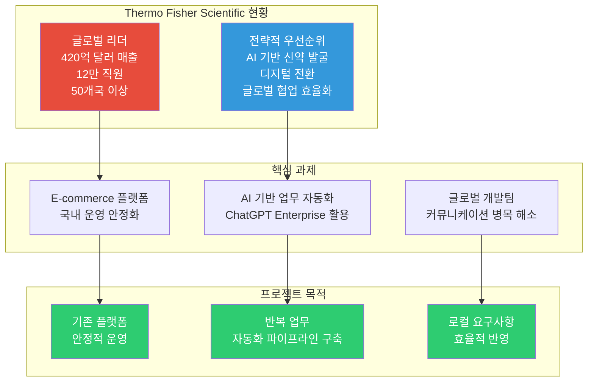
```mermaid
graph TB
    subgraph "Thermo Fisher Scientific 현황"
        A[글로벌 리더<br/>420억 달러 매출<br/>12만 직원<br/>50개국 이상]
        B[전략적 우선순위<br/>AI 기반 신약 발굴<br/>디지털 전환<br/>글로벌 협업 효율화]
    end
    
    subgraph "핵심 과제"
        C[E-commerce 플랫폼<br/>국내 운영 안정화]
        D[AI 기반 업무 자동화<br/>ChatGPT Enterprise 활용]
        E[글로벌 개발팀<br/>커뮤니케이션 병목 해소]
    end
    
    subgraph "프로젝트 목적"
        F[기존 플랫폼<br/>안정적 운영]
        G[반복 업무<br/>자동화 파이프라인 구축]
        H[로컬 요구사항<br/>효율적 반영]
    end
    
    A --> C
    B --> D
    C --> F
    D --> G
    E --> H
    
    style A fill:#e74c3c,color:#fff
    style B fill:#3498db,color:#fff
    style F fill:#2ecc71,color:#fff
    style G fill:#2ecc71,color:#fff
    style H fill:#2ecc71,color:#fff
```

**한 줄 요약** : Thermo Fisher Scientific의 글로벌 리더십과 전략적 우선순위를 바탕으로, 기존 E-commerce 플랫폼의 안정적인 국내 운영과 ChatGPT Enterprise 기반의 사내 업무 자동화를 통해 운영 효율성을 극대화하는 것이 본 프로젝트의 핵심 목적입니다.

### 프로젝트 배경

Thermo Fisher Scientific은 현재 **"과학 서비스 분야의 글로벌 리더"** 로서의 입지를 굳히고 있으며, 특히 AI와 디지털 혁신을 통해 신약 개발 및 운영 효율성을 극대화하려는 강력한 니즈를 가지고 있습니다. 2024년 매출 420억 달러($42B)를 기록했으며, 특히 매출의 83%가 소모품 및 서비스에서 발생하는 안정적인 수익 구조를 보유하고 있습니다. 전체 매출의 57%가 Pharma & Biotech 시장에서 발생하며, 생물학적 제제(Biologics) 및 복잡한 치료법 개발이 증가함에 따라 고객사들이 전문적인 파트너를 절실히 찾고 있는 상황입니다.

50개국 이상에서 12만 명의 직원이 근무하며, 전 세계적으로 통일된 시스템(PPI Business System)을 통해 운영 효율을 관리하고 있습니다. 이러한 글로벌 인프라를 바탕으로, Thermo Fisher Scientific은 **AI 기반 신약 발굴(AI-enabled drug discovery)**  을 통해 신약 개발의 비용과 시간을 단축하고 성공률을 높이려는 니즈가 매우 큽니다. 또한 'Digital Transformation with AI Operations'와 같은 직무를 통해 내부 프로세스를 자동화하고, e-커머스 플랫폼을 최적화하여 글로벌 고객 경험을 개선하고자 합니다.

### 프로젝트 목적

본 프로젝트는 다음과 같은 두 가지 핵심 목적을 달성하고자 합니다:

**1. 기존 글로벌 E-commerce 플랫폼의 안정적인 국내 운영**

Thermo Fisher Scientific의 글로벌 E-commerce 플랫폼은 전 세계 고객에게 제품과 서비스를 제공하는 핵심 인프라입니다. 국내 시장의 특수성을 고려한 로컬 요구사항 반영과 안정적인 운영이 필수적입니다. 특히 인도(India) 소재의 글로벌 개발팀과의 기술적 커뮤니케이션 병목 해소 및 로컬 요구사항 반영이 핵심 과제입니다.

**2. ChatGPT Enterprise 기반의 사내 업무 자동화(Office Automation) 구현**

엄격한 보안 규정(Silo) 내에서 상용 LLM(ChatGPT)을 활용한 반복 업무 자동화 파이프라인 구축이 필요합니다. 신규 AI 모델 개발(R&D)이 아닌, 기 도입된 ChatGPT Enterprise 라이선스를 활용하여 사내 레거시 시스템(ERP, 메일, 메신저 등)과 연동하여 업무 효율성을 극대화하고자 합니다.

## 1.2 발주처 현황 및 전략적 우선순위

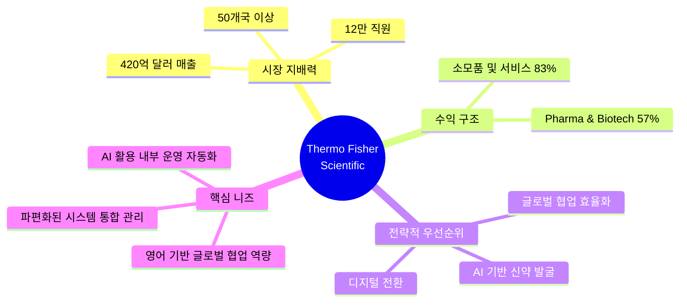
```mermaid
mindmap
  root((Thermo Fisher<br/>Scientific))
    시장 지배력
      420억 달러 매출
      12만 직원
      50개국 이상
    수익 구조
      소모품 및 서비스 83%
      Pharma & Biotech 57%
    전략적 우선순위
      AI 기반 신약 발굴
      디지털 전환
      글로벌 협업 효율화
    핵심 니즈
      파편화된 시스템 통합 관리
      AI 활용 내부 운영 자동화
      영어 기반 글로벌 협업 역량
```

**한 줄 요약** : Thermo Fisher Scientific은 과학 서비스 분야의 글로벌 리더로서 압도적인 시장 지배력을 보유하고 있으며, AI 기반 혁신과 디지털 전환을 통해 운영 효율성을 극대화하려는 전략적 우선순위를 가지고 있습니다.

### 시장 지배력 및 수익 구조

Thermo Fisher Scientific은 2024년 매출 420억 달러($42B)를 기록했으며, 특히 매출의 83%가 소모품 및 서비스에서 발생하는 안정적인 수익 구조를 보유하고 있습니다. 이는 단순 제품 판매를 넘어 지속적인 서비스 제공을 통한 안정적인 수익 창출 구조를 의미합니다.

전체 매출의 57%가 Pharma & Biotech 시장에서 발생하며, 생물학적 제제(Biologics) 및 복잡한 치료법 개발이 증가함에 따라 고객사들이 전문적인 파트너를 절실히 찾고 있는 상황입니다. 이러한 시장 환경에서 Thermo Fisher Scientific은 고객이 세상을 더 건강하고 깨끗하게 만들 수 있도록 돕는 미션 하에, 100만 개 이상의 제품 포트폴리오를 디지털로 연결하여 통합 솔루션을 제공하는 것이 목표입니다.

### 전략적 우선순위

**1. AI 기반 신약 발굴 (AI-enabled drug discovery)**

단순히 제품을 파는 것을 넘어, **AI 기반 신약 발굴** 을 통해 신약 개발의 비용과 시간을 단축하고 성공률을 높이려는 니즈가 매우 큽니다. 연간 13억 달러를 R&D에 투자하며 단백질체학(Proteomics), 정밀 의료, 첨단 소재 등 미래 먹거리 분야에서 기술적 우위를 점하고자 합니다.

**2. 디지털 전환 (Digital Transformation)**

'Digital Transformation with AI Operations'와 같은 직무를 통해 내부 프로세스를 자동화하고, e-커머스 플랫폼을 최적화하여 글로벌 고객 경험을 개선하고자 합니다. 방대한 데이터와 제품군을 보유하고 있지만, 이를 AI를 통해 어떻게 더 효율적으로 운영하고 고객에게 전달할 것인가에 대한 해답을 찾고 있습니다.

**3. 글로벌 협업 효율화**

인도 등 해외 개발팀과의 원활한 소통을 통해 글로벌 표준에 맞는 시스템을 구축하고 운영하는 것이 핵심 과제입니다. 파편화된 글로벌 시스템의 통합 관리, AI를 활용한 내부 운영 자동화, 그리고 영어를 기반으로 한 글로벌 협업 역량이 필요합니다.

**4. 운영 탁월성 (PPI: Practical Process Improvement)**

PPI(Practical Process Improvement) 시스템을 통해 지속적인 프로세스 개선과 점유율 확대를 꾀하고 있습니다. 전 세계적으로 통일된 시스템을 통해 운영 효율을 관리하며, 지속적인 개선을 통해 경쟁 우위를 확보하고자 합니다.

## 1.3 프로젝트 범위 및 목표

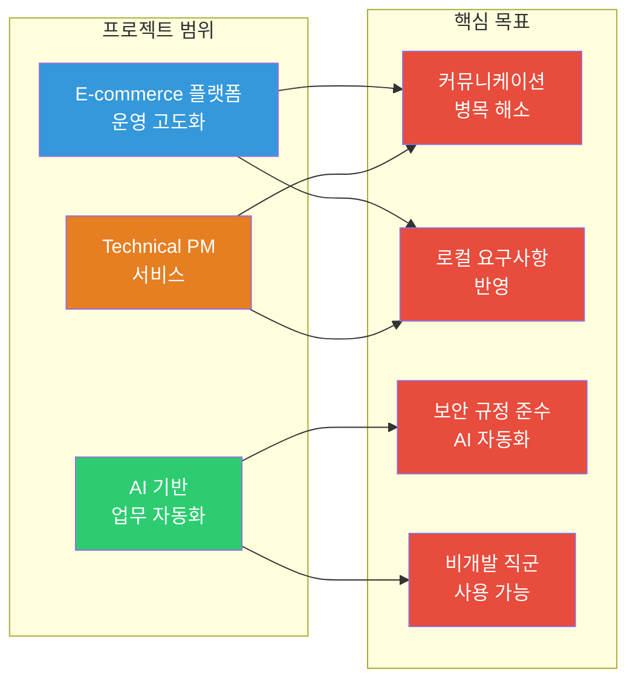
```mermaid
graph LR
    subgraph "프로젝트 범위"
        A[E-commerce 플랫폼<br/>운영 고도화]
        B[AI 기반<br/>업무 자동화]
        C[Technical PM<br/>서비스]
    end
    
    subgraph "핵심 목표"
        D[커뮤니케이션<br/>병목 해소]
        E[로컬 요구사항<br/>반영]
        F[보안 규정 준수<br/>AI 자동화]
        G[비개발 직군<br/>사용 가능]
    end
    
    A --> D
    A --> E
    B --> F
    B --> G
    C --> D
    C --> E
    
    style A fill:#3498db,color:#fff
    style B fill:#2ecc71,color:#fff
    style C fill:#e67e22,color:#fff
    style D fill:#e74c3c,color:#fff
    style E fill:#e74c3c,color:#fff
    style F fill:#e74c3c,color:#fff
    style G fill:#e74c3c,color:#fff
```

**한 줄 요약** : 본 프로젝트는 E-commerce 플랫폼 운영 고도화, AI 기반 업무 자동화, Technical PM 서비스를 통해 글로벌 개발팀과의 커뮤니케이션 병목 해소, 로컬 요구사항 반영, 보안 규정 준수한 AI 자동화 파이프라인 구축, 비개발 직군도 사용 가능한 자동화 도구 제공을 목표로 합니다.

### 프로젝트 범위

본 프로젝트는 다음과 같은 세 가지 핵심 영역을 포함합니다:

**1. E-commerce 플랫폼 유지보수 및 고도화 (Web Commerce)**

- **Offshore 개발 조직 관리 및 브릿지(Bridge) 역할 수행** : 현업(비즈니스) 부서의 요구사항을 기술적 사양(Technical Spec)으로 변환하여 인도 개발팀에 전달
- **레거시 코드 분석 및 트러블 슈팅** : 직접 개발은 지양하되, 발생한 이슈(Bug/Error)의 원인을 분석하여 인도 팀에 정확한 수정 가이드라인 제시
- **한국 특화 기능 연동 (Localization)** : 국내 PG(결제)사 연동, 국내 배송 시스템 API 연동 등 글로벌 코어 시스템에서 지원하지 않는 로컬 기능에 대한 인터페이스 정의 및 구현 관리

**2. AI 기반 업무 자동화 (Office Automation)**

- **ChatGPT Enterprise API 기반 앱 연동** : 기 도입된 ChatGPT Enterprise 라이선스를 활용하여 사내 레거시 시스템(ERP, 메일, 메신저 등)과 연동
- **Non-Crawling 방식의 데이터 활용 전략 수립** : 사내 전체 문서에 대한 크롤링(Crawling) 및 벡터 DB 구축 불가. 사용자가 직접 업로드한 문서(Context)나, 허용된 특정 API 엔드포인트의 데이터만을 활용하는 제한적 RAG(검색 증강 생성) 파이프라인 설계
- **프롬프트 엔지니어링 및 템플릿 표준화** : 비개발 직군 직원들이 사용할 수 있는 업무별 최적화된 프롬프트 템플릿 개발 및 배포

**3. Technical PM 서비스**

- **Technical PM 역량 제공** : 인도 개발자들에게 정확한 지시를 내리고 결과물의 품질을 보증해 줄 Technical PM 역량 제공
- **영문 기술 문서 작성** : 모든 기술 문서 및 개발팀과의 소통은 영어(English)를 기본으로 함
- **코드 리뷰 및 트러블슈팅** : 기존 E-commerce 플랫폼의 백엔드 기술 스택, Front-end 프레임워크에 대한 이해를 바탕으로 한 코드 리뷰 역량 제공

### 프로젝트 목표

**핵심 목표 1: 글로벌 개발팀과의 커뮤니케이션 병목 해소**

인도(India) 소재의 글로벌 개발팀과의 기술적 커뮤니케이션 병목을 해소하고, 현업(비즈니스) 부서의 요구사항을 기술적 사양(Technical Spec)으로 정확히 변환하여 인도 개발팀에 전달하는 브릿지(Bridge) 역할을 수행합니다. 시차를 고려한 비동기 커뮤니케이션(메일, 이슈 트래커) 프로세스를 최적화하여 효율적인 협업을 달성합니다.

**핵심 목표 2: 로컬 요구사항 반영 효율성 향상**

국내 시장의 특수성을 고려한 로컬 요구사항을 효율적으로 반영합니다. 국내 PG(결제)사 연동, 국내 배송 시스템 API 연동 등 글로벌 코어 시스템에서 지원하지 않는 로컬 기능에 대한 인터페이스를 정의하고 구현을 관리합니다.

**핵심 목표 3: 보안 규정 준수한 AI 자동화 파이프라인 구축**

엄격한 보안 규정(Silo) 내에서 상용 LLM(ChatGPT)을 활용한 반복 업무 자동화 파이프라인을 구축합니다. 최소 권한의 원칙(Principle of Least Privilege)을 준수하며, 데이터 유출 방지를 위한 필터링 로직을 적용합니다. 전사 데이터 크롤링 없이 사용자가 직접 업로드한 문서만을 활용하는 제한적 RAG 파이프라인을 설계합니다.

**핵심 목표 4: 비개발 직군도 사용 가능한 자동화 도구 제공**

비개발 직군 직원들이 사용할 수 있는 업무별 최적화된 프롬프트 템플릿을 개발 및 배포합니다. 주간 업무 리포트 자동 요약 및 메일 발송, ERP 데이터 조회 후 엑셀 리포팅 자동화, 고객 문의 이메일 1차 자동 분류 및 초안 작성 등의 기능을 제공합니다.

### 성공 지표

본 프로젝트의 성공을 측정하기 위한 주요 지표는 다음과 같습니다:

- **커뮤니케이션 효율성** : 인도 개발팀과의 요구사항 전달 시간 단축 (목표: 50% 단축)
- **로컬 요구사항 반영 속도** : 한국 특화 기능 연동 완료 시간 단축 (목표: 30% 단축)
- **AI 자동화 도입률** : 비개발 직군의 AI 자동화 도구 사용률 (목표: 70% 이상)
- **보안 규정 준수율** : 보안 규정 위반 사례 0건 유지
- **업무 효율성 향상** : 반복 업무 처리 시간 단축 (목표: 40% 단축)

---

# 2. 제안 배경 및 필요성

## 2.1 현재 상황 및 문제점 분석

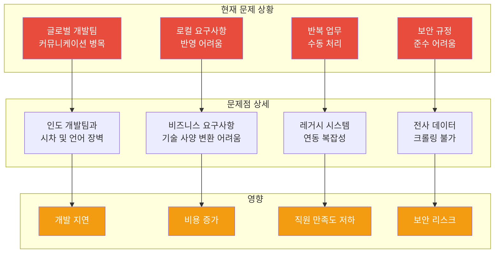
```mermaid
graph TB
    subgraph "현재 문제 상황"
        A[글로벌 개발팀<br/>커뮤니케이션 병목]
        B[로컬 요구사항<br/>반영 어려움]
        C[반복 업무<br/>수동 처리]
        D[보안 규정<br/>준수 어려움]
    end
    
    subgraph "문제점 상세"
        E[인도 개발팀과<br/>시차 및 언어 장벽]
        F[비즈니스 요구사항<br/>기술 사양 변환 어려움]
        G[레거시 시스템<br/>연동 복잡성]
        H[전사 데이터<br/>크롤링 불가]
    end
    
    subgraph "영향"
        I[개발 지연]
        J[비용 증가]
        K[직원 만족도 저하]
        L[보안 리스크]
    end
    
    A --> E
    B --> F
    C --> G
    D --> H
    
    E --> I
    F --> J
    G --> K
    H --> L
    
    style A fill:#e74c3c,color:#fff
    style B fill:#e74c3c,color:#fff
    style C fill:#e74c3c,color:#fff
    style D fill:#e74c3c,color:#fff
    style I fill:#f39c12,color:#fff
    style J fill:#f39c12,color:#fff
    style K fill:#f39c12,color:#fff
    style L fill:#f39c12,color:#fff
```

**한 줄 요약** : Thermo Fisher Scientific은 글로벌 개발팀과의 커뮤니케이션 병목, 로컬 요구사항 반영 어려움, 반복 업무의 수동 처리, 보안 규정 준수 어려움 등의 문제를 겪고 있으며, 이러한 문제들이 개발 지연, 비용 증가, 직원 만족도 저하, 보안 리스크로 이어지고 있습니다.

### 글로벌 개발팀과의 커뮤니케이션 병목

Thermo Fisher Scientific은 인도(India) 소재의 글로벌 개발팀과 협업하고 있으며, 시차와 언어 장벽으로 인한 커뮤니케이션 병목이 발생하고 있습니다. 현업(비즈니스) 부서의 요구사항을 기술적 사양(Technical Spec)으로 정확히 변환하여 인도 개발팀에 전달하는 과정에서 정보 손실이나 오해가 발생할 수 있습니다.

특히 모든 기술 문서 및 개발팀과의 소통은 영어(English)를 기본으로 하며, 시차를 고려한 비동기 커뮤니케이션(메일, 이슈 트래커) 프로세스가 최적화되지 않아 요구사항 전달 시간이 지연되고 있습니다. 이러한 커뮤니케이션 병목은 개발 지연과 비용 증가로 이어지며, 프로젝트 일정 관리에 어려움을 겪고 있습니다.

### 로컬 요구사항 반영 어려움

글로벌 E-commerce 플랫폼은 전 세계 고객에게 제품과 서비스를 제공하는 핵심 인프라입니다. 그러나 국내 시장의 특수성을 고려한 로컬 요구사항을 반영하는 것이 어렵습니다. 국내 PG(결제)사 연동, 국내 배송 시스템 API 연동 등 글로벌 코어 시스템에서 지원하지 않는 로컬 기능에 대한 인터페이스 정의 및 구현 관리가 필요합니다.

글로벌 개발팀은 국내 시장의 특수성을 완전히 이해하지 못할 수 있으며, 로컬 요구사항을 글로벌 표준에 맞추려는 시도로 인해 국내 고객 경험이 저하될 수 있습니다. 이러한 문제는 국내 시장 경쟁력 저하로 이어질 수 있습니다.

### 반복 업무의 수동 처리

사내 업무 중 많은 부분이 반복적인 작업으로 구성되어 있으며, 이러한 반복 업무를 수동으로 처리하고 있습니다. 주간 업무 리포트 작성, ERP 데이터 조회 후 엑셀 리포팅, 고객 문의 이메일 분류 및 초안 작성 등의 작업이 대표적인 예입니다.

이러한 반복 업무는 직원들의 시간을 소모하며, 업무 효율성을 저하시킵니다. 특히 비개발 직군 직원들이 이러한 반복 업무에 많은 시간을 소비하고 있으며, 이는 직원 만족도 저하와 업무 생산성 저하로 이어집니다.

### 보안 규정 준수 어려움

Thermo Fisher Scientific은 엄격한 보안 규정(Silo)을 가지고 있으며, 모든 자동화 스크립트 및 AI 에이전트는 해당 툴을 사용하는 사용자의 권한 범위 내에서만 작동해야 합니다. Cross-department 데이터 접근은 절대 불가능하며, 사내 전체 문서에 대한 크롤링(Crawling) 및 벡터 DB 구축도 불가능합니다.

이러한 보안 규정으로 인해 AI 기반 자동화 도구를 도입하는 것이 어렵습니다. ChatGPT 프롬프트 입력 시 민감 정보(개인정보, 기밀 기술 데이터)가 외부로 학습되지 않도록 필터링 로직 또는 엔터프라이즈 모드 강제 적용이 필요하지만, 이를 구현하는 것이 복잡합니다.

## 2.2 핵심 Pain Point 분석

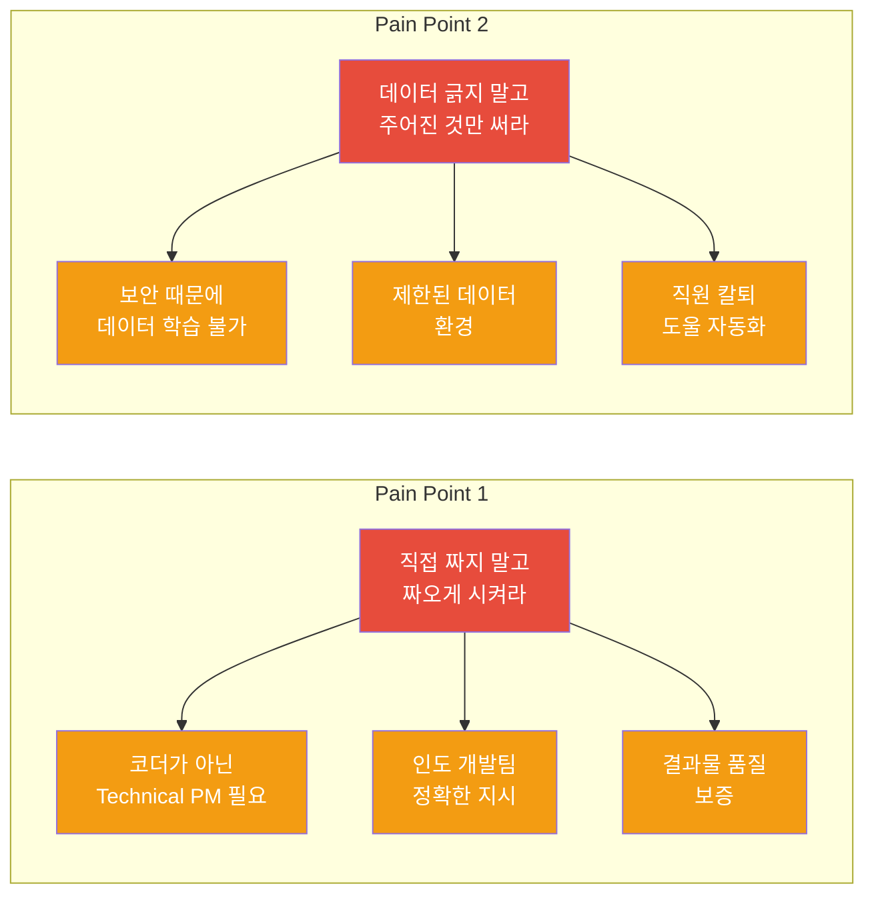
```mermaid
graph LR
    subgraph "Pain Point 1"
        A["직접 짜지 말고<br/>짜오게 시켜라"]
        A1[코더가 아닌<br/>Technical PM 필요]
        A2[인도 개발팀<br/>정확한 지시]
        A3[결과물 품질<br/>보증]
    end
    
    subgraph "Pain Point 2"
        B["데이터 긁지 말고<br/>주어진 것만 써라"]
        B1[보안 때문에<br/>데이터 학습 불가]
        B2[제한된 데이터<br/>환경]
        B3[직원 칼퇴<br/>도울 자동화]
    end
    
    A --> A1
    A --> A2
    A --> A3
    
    B --> B1
    B --> B2
    B --> B3
    
    style A fill:#e74c3c,color:#fff
    style B fill:#e74c3c,color:#fff
    style A1 fill:#f39c12,color:#fff
    style A2 fill:#f39c12,color:#fff
    style A3 fill:#f39c12,color:#fff
    style B1 fill:#f39c12,color:#fff
    style B2 fill:#f39c12,color:#fff
    style B3 fill:#f39c12,color:#fff
```

**한 줄 요약** : Thermo Fisher Scientific의 핵심 Pain Point는 "직접 짜지 말고, 짜오게 시켜라"와 "데이터 긁지 말고, 주어진 것만 써라"로 요약되며, 코더가 아닌 Technical PM이 필요하고, 보안을 고려한 제한적 데이터 환경에서 AI 자동화 도구를 구축해야 합니다.

### Pain Point 1: "직접 짜지 말고, 짜오게 시켜라"

Thermo Fisher Scientific은 코더가 필요한 것이 아니라, 인도 개발자들에게 정확한 지시를 내리고 결과물의 품질을 보증해 줄 **Technical PM** 이 필요합니다. 직접 개발은 지양하되, 발생한 이슈(Bug/Error)의 원인을 분석하여 인도 팀에 정확한 수정 가이드라인을 제시할 수 있는 역량이 필요합니다.

현업(비즈니스) 부서의 요구사항을 기술적 사양(Technical Spec)으로 변환하여 인도 개발팀에 전달하는 브릿지(Bridge) 역할을 수행할 수 있는 인력이 필요합니다. 영문 기반의 상세 설계서(Functional Spec) 작성, 티켓(Jira) 관리, UAT(사용자 인수 테스트) 시나리오 작성 등의 역량이 필요합니다.

기존 E-commerce 플랫폼의 백엔드 기술 스택, Front-end 프레임워크에 대한 이해를 바탕으로 한 코드 리뷰 역량이 필요하며, 레거시 코드 분석 및 트러블 슈팅 능력이 필수적입니다.

### Pain Point 2: "데이터 긁지 말고, 주어진 것만 써라"

보안 때문에 데이터를 통째로 AI에 학습시킬 수 없습니다. 전사 데이터 접근 권한이 없으며, 크롤링 및 벡터 DB 구축이 불가능합니다. 그러나 제한된 데이터 환경에서도 ChatGPT를 활용하여 당장 직원들의 칼퇴를 도울 수 있는 자동화 툴을 만들어야 합니다.

사용자가 직접 업로드한 문서(Context)나, 허용된 특정 API 엔드포인트의 데이터만을 활용하는 제한적 RAG(검색 증강 생성) 파이프라인 설계가 필요합니다. 최소 권한의 원칙(Principle of Least Privilege)을 준수하며, ChatGPT 프롬프트 입력 시 민감 정보가 외부로 학습되지 않도록 필터링 로직을 적용해야 합니다.

별도의 온프레미스(On-premise) GPU 서버 구축이 불가능하며, 기존 IT 인프라 및 SaaS 환경 내에서 구동 가능한 경량화된 솔루션이어야 합니다.

## 2.3 해결 방안의 필요성

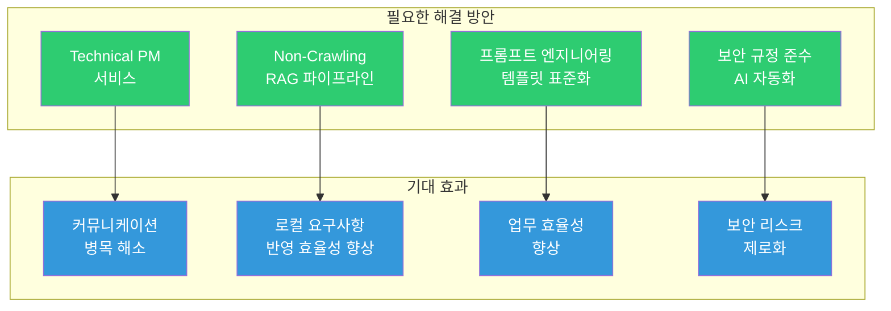
```mermaid
graph TB
    subgraph "필요한 해결 방안"
        A[Technical PM<br/>서비스]
        B[Non-Crawling<br/>RAG 파이프라인]
        C[프롬프트 엔지니어링<br/>템플릿 표준화]
        D[보안 규정 준수<br/>AI 자동화]
    end
    
    subgraph "기대 효과"
        E[커뮤니케이션<br/>병목 해소]
        F[로컬 요구사항<br/>반영 효율성 향상]
        G[업무 효율성<br/>향상]
        H[보안 리스크<br/>제로화]
    end
    
    A --> E
    B --> F
    C --> G
    D --> H
    
    style A fill:#2ecc71,color:#fff
    style B fill:#2ecc71,color:#fff
    style C fill:#2ecc71,color:#fff
    style D fill:#2ecc71,color:#fff
    style E fill:#3498db,color:#fff
    style F fill:#3498db,color:#fff
    style G fill:#3498db,color:#fff
    style H fill:#3498db,color:#fff
```

**한 줄 요약** : Technical PM 서비스, Non-Crawling RAG 파이프라인, 프롬프트 엔지니어링 템플릿 표준화, 보안 규정 준수 AI 자동화를 통해 커뮤니케이션 병목 해소, 로컬 요구사항 반영 효율성 향상, 업무 효율성 향상, 보안 리스크 제로화를 달성할 수 있습니다.

### Technical PM 서비스의 필요성

인도 개발팀과의 효율적인 협업을 위해서는 Technical PM 서비스가 필수적입니다. 현업(비즈니스) 부서의 요구사항을 기술적 사양(Technical Spec)으로 정확히 변환하여 인도 개발팀에 전달하는 브릿지(Bridge) 역할을 수행할 수 있는 인력이 필요합니다.

영문 기반의 상세 설계서(Functional Spec) 작성 능력, 티켓(Jira) 관리 역량, UAT(사용자 인수 테스트) 시나리오 작성 능력이 필요합니다. 또한 레거시 코드 분석 및 트러블 슈팅 능력을 통해 발생한 이슈의 원인을 분석하고 인도 팀에 정확한 수정 가이드라인을 제시할 수 있어야 합니다.

### Non-Crawling RAG 파이프라인의 필요성

보안 규정을 준수하면서도 AI 기반 자동화 도구를 활용하기 위해서는 Non-Crawling 방식의 RAG 파이프라인이 필요합니다. 전사 데이터 크롤링 없이 사용자가 직접 업로드한 문서만을 활용하는 제한적 RAG 파이프라인을 설계하여 보안 리스크를 제로화하면서도 AI의 장점을 활용할 수 있습니다.

이를 통해 주간 업무 리포트 자동 요약 및 메일 발송, ERP 데이터 조회 후 엑셀 리포팅 자동화, 고객 문의 이메일 1차 자동 분류 및 초안 작성 등의 기능을 제공할 수 있습니다.

### 프롬프트 엔지니어링 및 템플릿 표준화의 필요성

비개발 직군 직원들이 ChatGPT Enterprise를 효과적으로 활용하기 위해서는 업무별 최적화된 프롬프트 템플릿이 필요합니다. 프롬프트 엔지니어링 및 템플릿 표준화를 통해 비개발 직군도 쉽게 사용할 수 있는 자동화 도구를 제공할 수 있습니다.

이를 통해 직원들의 업무 효율성을 향상시키고, 반복 업무 처리 시간을 단축할 수 있습니다. 또한 프롬프트 템플릿을 표준화함으로써 일관된 품질의 결과물을 얻을 수 있습니다.

### 보안 규정 준수 AI 자동화의 필요성

엄격한 보안 규정을 준수하면서도 AI 기반 자동화 도구를 활용하기 위해서는 최소 권한의 원칙(Principle of Least Privilege)을 준수하는 AI 자동화 시스템이 필요합니다. ChatGPT 프롬프트 입력 시 민감 정보가 외부로 학습되지 않도록 필터링 로직을 적용하고, 엔터프라이즈 모드를 강제 적용해야 합니다.

기존 IT 인프라 및 SaaS 환경 내에서 구동 가능한 경량화된 솔루션을 제공하여 별도의 온프레미스 GPU 서버 구축 없이도 AI 자동화 도구를 활용할 수 있어야 합니다.

### 결론

Thermo Fisher Scientific의 현재 문제점과 핵심 Pain Point를 해결하기 위해서는 Technical PM 서비스, Non-Crawling RAG 파이프라인, 프롬프트 엔지니어링 템플릿 표준화, 보안 규정 준수 AI 자동화가 필수적입니다. 이러한 해결 방안을 통해 커뮤니케이션 병목 해소, 로컬 요구사항 반영 효율성 향상, 업무 효율성 향상, 보안 리스크 제로화를 달성할 수 있습니다.

이러한 요구사항을 정확히 이해하고 있으며, 관련 경험과 역량을 보유하고 있어 Thermo Fisher Scientific의 문제점을 효과적으로 해결할 수 있습니다.

---

# 3. 제안 내용 - E-commerce 플랫폼 운영 고도화

## 3.1 Offshore 개발 조직 관리 전략

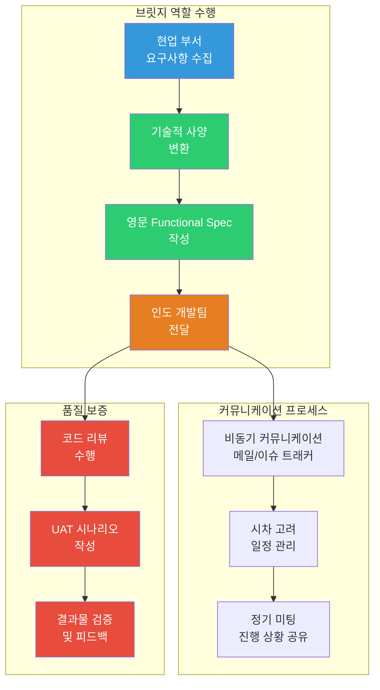
```mermaid
graph TB
    subgraph "브릿지 역할 수행"
        A[현업 부서<br/>요구사항 수집]
        B[기술적 사양<br/>변환]
        C[영문 Functional Spec<br/>작성]
        D[인도 개발팀<br/>전달]
    end
    
    subgraph "커뮤니케이션 프로세스"
        E[비동기 커뮤니케이션<br/>메일/이슈 트래커]
        F[시차 고려<br/>일정 관리]
        G[정기 미팅<br/>진행 상황 공유]
    end
    
    subgraph "품질 보증"
        H[코드 리뷰<br/>수행]
        I[UAT 시나리오<br/>작성]
        J[결과물 검증<br/>및 피드백]
    end
    
    A --> B
    B --> C
    C --> D
    D --> E
    E --> F
    F --> G
    D --> H
    H --> I
    I --> J
    
    style A fill:#3498db,color:#fff
    style B fill:#2ecc71,color:#fff
    style C fill:#2ecc71,color:#fff
    style D fill:#e67e22,color:#fff
    style H fill:#e74c3c,color:#fff
    style I fill:#e74c3c,color:#fff
    style J fill:#e74c3c,color:#fff
```

**한 줄 요약** : 현업 부서의 요구사항을 기술적 사양으로 정확히 변환하여 인도 개발팀에 전달하는 브릿지(Bridge) 역할을 수행하며, 비동기 커뮤니케이션 프로세스를 통해 시차를 고려한 효율적인 협업을 달성하고, 코드 리뷰 및 UAT를 통해 결과물의 품질을 보증합니다.

### 브릿지(Bridge) 역할 수행 방안

현업(비즈니스) 부서의 요구사항을 기술적 사양(Technical Spec)으로 정확히 변환하여 인도 개발팀에 전달하는 브릿지(Bridge) 역할을 수행합니다. 이는 단순한 번역이 아닌, 비즈니스 요구사항을 기술적으로 구현 가능한 형태로 변환하는 전문 역량이 필요합니다.

**브릿지 역할 기술 흐름도**

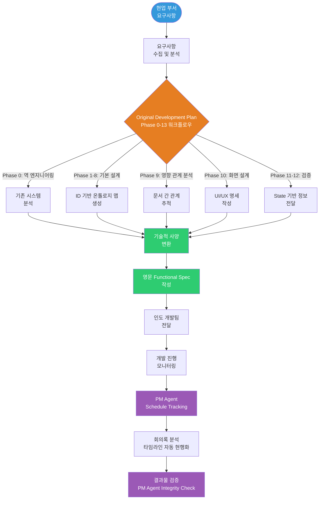
```mermaid
flowchart TD
    Start([현업 부서<br/>요구사항]) --> A[요구사항<br/>수집 및 분석]
    A --> B{Original Development Plan<br/>Phase 0-13 워크플로우}
    
    B -->|Phase 0: 역 엔지니어링| C[기존 시스템<br/>분석]
    B -->|Phase 1-8: 기본 설계| D[ID 기반 온톨로지 맵<br/>생성]
    B -->|Phase 9: 영향 관계 분석| E[문서 간 관계<br/>추적]
    B -->|Phase 10: 화면 설계| F[UI/UX 명세<br/>작성]
    B -->|Phase 11-12: 검증| G[State 기반 정보<br/>전달]
    
    C --> H[기술적 사양<br/>변환]
    D --> H
    E --> H
    F --> H
    G --> H
    
    H --> I[영문 Functional Spec<br/>작성]
    I --> J[인도 개발팀<br/>전달]
    J --> K[개발 진행<br/>모니터링]
    K --> L[PM Agent<br/>Schedule Tracking]
    L --> M[회의록 분석<br/>타임라인 자동 현행화]
    M --> N[결과물 검증<br/>PM Agent Integrity Check]
    
    style Start fill:#3498db,color:#fff
    style B fill:#e67e22,color:#fff
    style H fill:#2ecc71,color:#fff
    style I fill:#2ecc71,color:#fff
    style L fill:#9b59b6,color:#fff
    style N fill:#9b59b6,color:#fff
```

**흐름도 설명** :
- **Phase 0-13 워크플로우** : Original Development Plan의 체계적인 문서 생성 프로세스를 활용하여 요구사항을 단계별로 분석하고 설계 문서를 생성합니다.
- **ID 기반 온톨로지 맵** : 각 기능, API, 데이터베이스 스키마에 고유 ID를 부여하여 문서 간 관계를 명확히 추적합니다.
- **State 기반 정보 전달** : LangGraph/CrewAI 스타일로 각 단계에서 핵심 정보만 추출하여 인도 개발팀에 전달하여 컨텍스트 길이를 최적화합니다.
- **PM Agent 통합** : Schedule Tracking으로 일정을 자동 추적하고, Integrity Check로 결과물의 완전성을 검증합니다.

**요구사항 수집 및 분석**

현업 부서와의 정기 미팅을 통해 요구사항을 수집하고, 비즈니스 목표와 기술적 제약사항을 종합적으로 분석합니다. 요구사항의 우선순위를 설정하고, 기술적 구현 가능성을 평가하여 현실적인 일정을 수립합니다.

**기술적 사양 변환**

비즈니스 요구사항을 기술적 사양으로 변환하는 과정에서 다음을 고려합니다:
- 기능적 요구사항(Functional Requirements): 시스템이 수행해야 하는 기능
- 비기능적 요구사항(Non-Functional Requirements): 성능, 보안, 확장성 등
- 기술적 제약사항: 기존 시스템 구조, 기술 스택, 보안 규정 등
- 일정 및 예산: 개발 일정과 예산 범위 내에서의 구현 가능성

**영문 Functional Spec 작성**

Original Development Plan 프로젝트의 Phase 0-13 워크플로우와 ID 기반 온톨로지 맵 시스템을 활용하여 인도 개발팀이 이해하기 쉬운 명확하고 상세한 Functional Spec을 작성합니다:

- **Phase 0-13 워크플로우 적용** : Original Development Plan의 Phase 0-13 워크플로우(Phase 0: 역 엔지니어링 → Phase 1-8: 기본 설계 문서 생성 → Phase 9: 온톨로지 영향 관계 분석 → Phase 10: 화면 설계서 → Phase 11: 온톨로지 영향 분석 확장 → Phase 12: 최종 확인 → Phase 13: 개발용 리팩토링)를 활용하여 요구사항 분석부터 설계, 검증까지 체계적인 문서 생성 프로세스 구축

- **ID 기반 온톨로지 맵 구조** : Original Development Plan의 ID 기반 온톨로지 맵 시스템(`page.*`, `comp.*`, `api.*`, `db.*` 형식)을 활용하여 각 기능, API, 데이터베이스 스키마에 고유 ID를 부여하고 문서 간 관계를 명확히 추적하여 인도 개발팀과의 커뮤니케이션 시 명확한 참조 가능

- **State 기반 정보 전달** : Original Development Plan의 State 기반 정보 전달 시스템(LangGraph/CrewAI 스타일)을 활용하여 각 단계에서 핵심 정보만 추출하여 인도 개발팀에 전달하여 컨텍스트 길이 최적화 및 효율적인 정보 전달

- **Workflow Orchestrator & Status Tracker** : Original Development Plan의 Workflow Orchestrator & Status Tracker를 활용하여 실행 순서 및 의존성 관리, 워크플로우 상태 추적을 통해 문서 생성 프로세스의 일관성 보장

- **Adaptive Doc Generation Chain** : Original Development Plan의 Adaptive Doc Generation Chain(doc_generation tool, DG.1-DG.5 Chain Prompts)을 활용하여 문서 구조 분석, 템플릿 선택, 내용 생성, 검증까지 자동화된 문서 생성 프로세스 구현
- **기능 상세 설명** : 각 기능의 목적, 입력/출력, 처리 로직을 명확히 기술
- **API 명세** : RESTful API 엔드포인트, 요청/응답 스키마를 상세히 문서화
- **데이터베이스 스키마** : 테이블 구조, 관계, 제약조건을 명확히 정의
- **UI/UX 명세** : 화면 구성, 사용자 플로우, 인터랙션을 상세히 설명
- **에러 핸들링** : 예외 상황 처리 방법을 명확히 정의

### 커뮤니케이션 프로세스 최적화

**비동기 커뮤니케이션 체계 구축**

PM Agent 프로젝트에서 구축한 사업 관리 시스템의 커뮤니케이션 프로세스를 활용하여 시차를 고려한 비동기 커뮤니케이션을 최적화합니다:
- **이슈 트래커 통합** : Jira를 활용한 티켓 관리 시스템을 구축하여 요구사항, 버그, 개선사항을 체계적으로 관리
- **Schedule Tracking** : PM Agent의 Schedule Tracking 기능(회의록 분석을 통한 타임라인 자동 현행화)을 활용하여 인도 개발팀과의 일정을 자동으로 추적 및 업데이트
- **비동기 커뮤니케이션 프로세스** : 시차를 고려한 메일, 이슈 트래커 기반 비동기 커뮤니케이션 프로세스를 최적화하여 효율적인 협업 달성

**정기 미팅 및 진행 상황 공유**

주간 정기 미팅을 통해 진행 상황을 공유하고, 이슈가 발생할 경우 즉시 대응합니다. 미팅 전에 미리 공유할 자료를 준비하여 효율적인 미팅을 진행합니다.

**시차 고려 일정 관리**

인도 개발팀과의 시차를 고려하여 일정을 관리합니다. 주요 결정사항은 미리 전달하고, 피드백을 받을 시간을 충분히 확보합니다.

### 품질 보증 프로세스

**코드 리뷰 수행**

Original Development Plan 프로젝트에서 구축한 코드 품질 검증 시스템을 활용하여 인도 개발팀이 작성한 코드를 리뷰합니다:

**코드 리뷰 기술 흐름도**

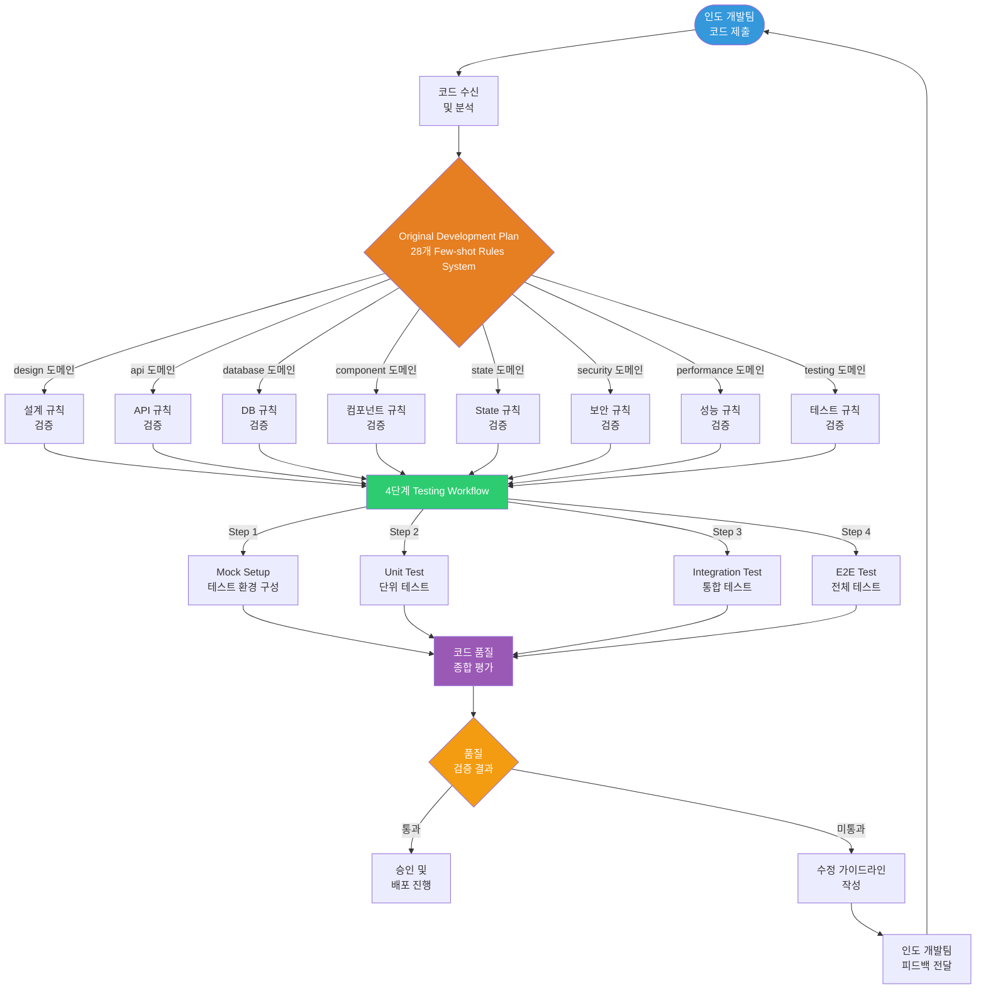
```mermaid
flowchart TD
    Start([인도 개발팀<br/>코드 제출]) --> A[코드 수신<br/>및 분석]
    A --> B{Original Development Plan<br/>28개 Few-shot Rules System}
    
    B -->|design 도메인| C1[설계 규칙<br/>검증]
    B -->|api 도메인| C2[API 규칙<br/>검증]
    B -->|database 도메인| C3[DB 규칙<br/>검증]
    B -->|component 도메인| C4[컴포넌트 규칙<br/>검증]
    B -->|state 도메인| C5[State 규칙<br/>검증]
    B -->|security 도메인| C6[보안 규칙<br/>검증]
    B -->|performance 도메인| C7[성능 규칙<br/>검증]
    B -->|testing 도메인| C8[테스트 규칙<br/>검증]
    
    C1 --> D[4단계 Testing Workflow]
    C2 --> D
    C3 --> D
    C4 --> D
    C5 --> D
    C6 --> D
    C7 --> D
    C8 --> D
    
    D -->|Step 1| E1[Mock Setup<br/>테스트 환경 구성]
    D -->|Step 2| E2[Unit Test<br/>단위 테스트]
    D -->|Step 3| E3[Integration Test<br/>통합 테스트]
    D -->|Step 4| E4[E2E Test<br/>전체 테스트]
    
    E1 --> F[코드 품질<br/>종합 평가]
    E2 --> F
    E3 --> F
    E4 --> F
    
    F --> G{품질<br/>검증 결과}
    G -->|통과| H[승인 및<br/>배포 진행]
    G -->|미통과| I[수정 가이드라인<br/>작성]
    I --> J[인도 개발팀<br/>피드백 전달]
    J --> Start
    
    style Start fill:#3498db,color:#fff
    style B fill:#e67e22,color:#fff
    style D fill:#2ecc71,color:#fff
    style F fill:#9b59b6,color:#fff
    style G fill:#f39c12,color:#fff
```

**흐름도 설명** :
- **28개 Few-shot Rules System** : Original Development Plan의 8개 도메인(design/api/database/component/state/security/performance/testing)별 규칙을 적용하여 코드의 구조적 품질을 자동 검증합니다.
- **4단계 Testing Workflow** : Mock Setup → Unit Test → Integration Test → E2E Test 순서로 테스트 가능성을 평가하여 코드 리뷰의 정확성을 높입니다.
- **규칙 이중 참조 구조** : 설계 시 적용한 규칙을 테스트 시에도 동일하게 적용하여 일관된 품질 기준을 유지합니다.
- **기술 스택 이해 기반 평가** : 기존 E-commerce 플랫폼의 백엔드 기술 스택, Front-end 프레임워크에 대한 이해를 바탕으로 코드의 정확성, 효율성, 유지보수성을 평가합니다.

**UAT 시나리오 작성 및 실행**

사용자 인수 테스트(UAT) 시나리오를 작성하고 실행하여 개발된 기능이 요구사항을 충족하는지 검증합니다. 테스트 결과를 문서화하고, 발견된 이슈는 즉시 인도 개발팀에 전달하여 수정을 요청합니다.

**결과물 검증 및 피드백**

개발 완료 후 결과물을 검증하고, 필요시 피드백을 제공합니다. 지속적인 개선을 통해 품질을 향상시킵니다.

## 3.2 레거시 코드 분석 및 트러블 슈팅 방안

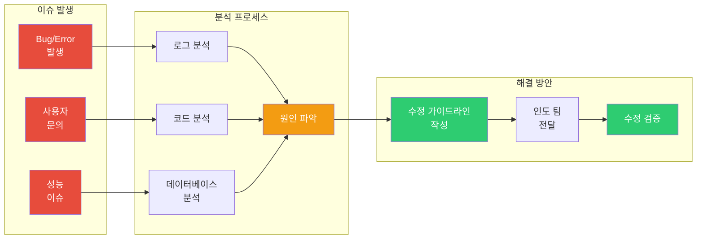
```mermaid
graph LR
    subgraph "이슈 발생"
        A[Bug/Error<br/>발생]
        B[사용자<br/>문의]
        C[성능<br/>이슈]
    end
    
    subgraph "분석 프로세스"
        D[로그 분석]
        E[코드 분석]
        F[데이터베이스<br/>분석]
        G[원인 파악]
    end
    
    subgraph "해결 방안"
        H[수정 가이드라인<br/>작성]
        I[인도 팀<br/>전달]
        J[수정 검증]
    end
    
    A --> D
    B --> E
    C --> F
    D --> G
    E --> G
    F --> G
    G --> H
    H --> I
    I --> J
    
    style A fill:#e74c3c,color:#fff
    style B fill:#e74c3c,color:#fff
    style C fill:#e74c3c,color:#fff
    style G fill:#f39c12,color:#fff
    style H fill:#2ecc71,color:#fff
    style J fill:#2ecc71,color:#fff
```

**한 줄 요약** : 발생한 이슈(Bug/Error)의 원인을 체계적으로 분석하여 인도 개발팀에 정확한 수정 가이드라인을 제시하며, 직접 개발은 지양하되 문제 해결을 위한 명확한 방향을 제시합니다.

### 이슈 분석 프로세스

**로그 분석**

애플리케이션 로그, 서버 로그, 데이터베이스 로그를 분석하여 이슈의 원인을 파악합니다. 에러 메시지, 스택 트레이스, 타임스탬프 등을 종합적으로 분석하여 문제의 근본 원인을 찾습니다.

**코드 분석**

레거시 코드를 분석하여 문발생한 부분을 식별합니다. 기존 E-commerce 플랫폼의 기술 스택에 대한 이해를 바탕으로 코드 로직을 분석하고, 데이터 흐름을 추적하여 문제의 원인을 파악합니다.

**데이터베이스 분석**

데이터베이스 쿼리 성능, 데이터 무결성, 트랜잭션 처리 등을 분석하여 데이터베이스 관련 이슈를 파악합니다.

### 수정 가이드라인 작성

**명확한 문제 설명**

발생한 이슈를 명확하게 설명하고, 재현 방법을 제시합니다. 예상되는 원인과 영향 범위를 분석하여 우선순위를 설정합니다.

**수정 방안 제시**

문제를 해결하기 위한 구체적인 수정 방안을 제시합니다. 코드 수정 방법, 테스트 방법, 배포 방법 등을 포함하여 인도 개발팀이 쉽게 이해하고 구현할 수 있도록 합니다.

**영문 문서화**

모든 분석 결과와 수정 가이드라인을 영문으로 문서화하여 인도 개발팀에 전달합니다. 명확하고 상세한 설명을 통해 오해를 방지합니다.

### 트러블 슈팅 경험

Original Development Plan 프로젝트에서 다수의 설계 문서를 관리하고, PM 활동을 통해 문서 및 개발 진행을 관리한 경험이 있습니다. 또한 PM Agent를 통해 사업 관리의 전체 라이프사이클을 관장한 경험을 바탕으로, 체계적인 이슈 분석 및 해결 프로세스를 구축할 수 있습니다.

## 3.3 한국 특화 기능 연동 방안

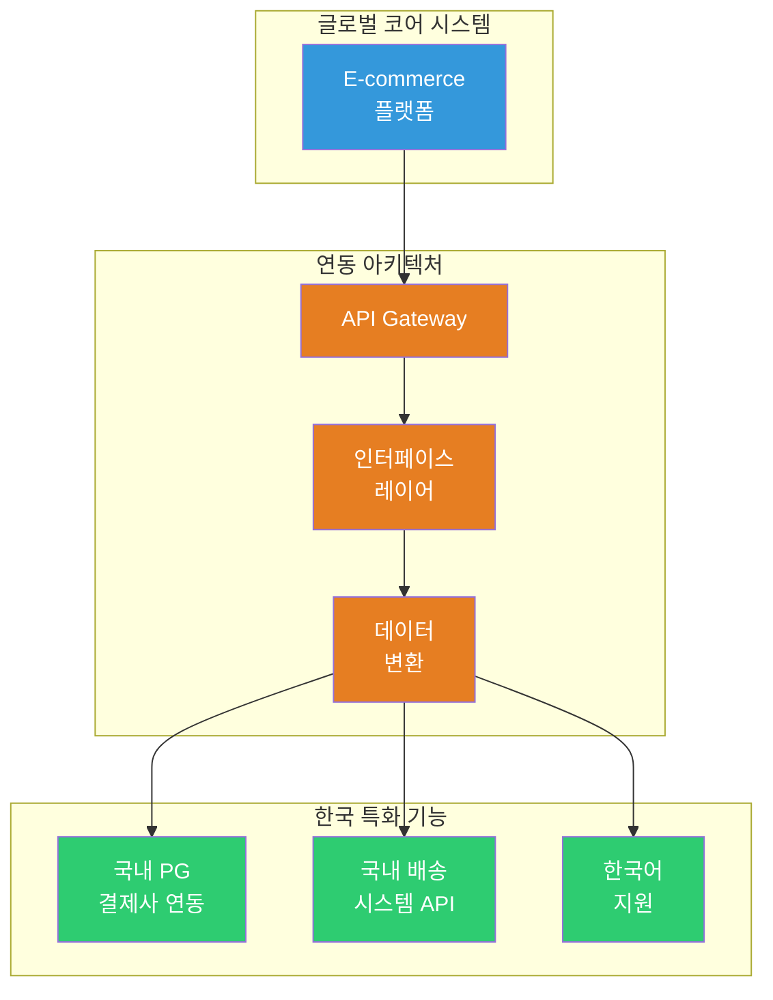
```mermaid
graph TB
    subgraph "글로벌 코어 시스템"
        A[E-commerce<br/>플랫폼]
    end
    
    subgraph "한국 특화 기능"
        B[국내 PG<br/>결제사 연동]
        C[국내 배송<br/>시스템 API]
        D[한국어<br/>지원]
    end
    
    subgraph "연동 아키텍처"
        E[API Gateway]
        F[인터페이스<br/>레이어]
        G[데이터<br/>변환]
    end
    
    A --> E
    E --> F
    F --> G
    G --> B
    G --> C
    G --> D
    
    style A fill:#3498db,color:#fff
    style B fill:#2ecc71,color:#fff
    style C fill:#2ecc71,color:#fff
    style D fill:#2ecc71,color:#fff
    style E fill:#e67e22,color:#fff
    style F fill:#e67e22,color:#fff
    style G fill:#e67e22,color:#fff
```

**한 줄 요약** : 글로벌 코어 시스템과 한국 특화 기능(국내 PG 결제사 연동, 국내 배송 시스템 API, 한국어 지원)을 API Gateway와 인터페이스 레이어를 통해 효율적으로 연동하여 국내 시장의 특수성을 반영합니다.

### 국내 PG 결제사 연동

**연동 대상**

국내 주요 PG(결제대행)사와 연동하여 국내 고객의 결제 편의성을 향상시킵니다:
- 이니시스, KG이니시스, 나이스페이 등 주요 PG사
- 각 PG사의 API 명세에 맞춰 연동 인터페이스 설계
- 결제 승인, 취소, 환불 등 핵심 기능 지원

**PG 결제사 연동 기술 흐름도**

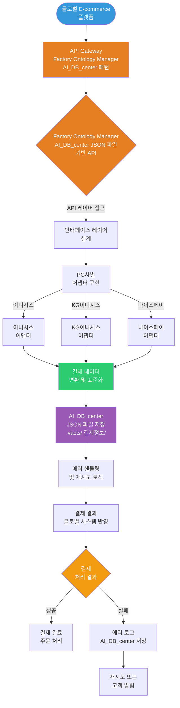
```mermaid
flowchart TD
    Start([글로벌 E-commerce<br/>플랫폼]) --> A[API Gateway<br/>Factory Ontology Manager<br/>AI_DB_center 패턴]
    A --> B{Factory Ontology Manager<br/>AI_DB_center JSON 파일<br/>기반 API}
    
    B -->|API 레이어 접근| C[인터페이스 레이어<br/>설계]
    C --> D[PG사별<br/>어댑터 구현]
    
    D -->|이니시스| E1[이니시스<br/>어댑터]
    D -->|KG이니시스| E2[KG이니시스<br/>어댑터]
    D -->|나이스페이| E3[나이스페이<br/>어댑터]
    
    E1 --> F[결제 데이터<br/>변환 및 표준화]
    E2 --> F
    E3 --> F
    
    F --> G[AI_DB_center<br/>JSON 파일 저장<br/>.vacts/ 결제정보/]
    G --> H[에러 핸들링<br/>및 재시도 로직]
    H --> I[결제 결과<br/>글로벌 시스템 반영]
    
    I --> J{결제<br/>처리 결과}
    J -->|성공| K[결제 완료<br/>주문 처리]
    J -->|실패| L[에러 로그<br/>AI_DB_center 저장]
    L --> M[재시도 또는<br/>고객 알림]
    
    style Start fill:#3498db,color:#fff
    style A fill:#e67e22,color:#fff
    style B fill:#e67e22,color:#fff
    style F fill:#2ecc71,color:#fff
    style G fill:#9b59b6,color:#fff
    style J fill:#f39c12,color:#fff
```

**흐름도 설명** :
- **API Gateway** : Factory Ontology Manager의 AI_DB_center JSON 파일 기반 API 패턴을 활용하여 모든 데이터 접근을 API 레이어를 통해 수행합니다.
- **인터페이스 레이어** : 글로벌 코어 시스템의 안정성을 해치지 않으면서 로컬 기능을 추가하는 인터페이스 레이어를 설계합니다.
- **어댑터 패턴** : 각 PG사의 API 스펙에 맞는 어댑터를 구현하여 결제 데이터를 변환 및 표준화합니다.
- **AI_DB_center 저장** : Factory Ontology Manager의 `.vacts/` 디렉토리 구조를 활용하여 결제 정보를 사용자 권한별로 분리 저장합니다.
- **에러 핸들링** : Factory Ontology Manager의 데이터 통합 기술을 활용하여 에러 발생 시 자동 재시도 및 로그 저장을 수행합니다.

**연동 아키텍처**

글로벌 코어 시스템의 결제 모듈과 국내 PG사를 연결하는 인터페이스 레이어를 구축합니다:
- API Gateway를 통한 통합 관리
- 각 PG사의 API 스펙에 맞는 어댑터 패턴 적용
- 결제 데이터 변환 및 표준화
- 에러 핸들링 및 재시도 로직 구현

**보안 및 규정 준수**

PCI-DSS 등 결제 관련 보안 규정을 준수하며, 결제 정보의 안전한 처리를 보장합니다. 민감 정보는 암호화하여 전송하고, 로그에 결제 정보가 남지 않도록 처리합니다.

### 국내 배송 시스템 API 연동

**연동 대상**

국내 주요 배송사와 연동하여 배송 추적 및 관리 기능을 제공합니다:
- CJ대한통운, 한진택배, 로젠택배 등 주요 배송사
- 각 배송사의 API를 통한 송장 생성, 배송 추적 기능
- 배송 상태 실시간 업데이트

**연동 아키텍처**

글로벌 코어 시스템의 주문 관리 모듈과 국내 배송 시스템을 연결합니다:
- 배송사별 API 어댑터 구현
- 배송 정보 표준화 및 변환
- 배송 추적 정보 실시간 동기화
- 배송 상태 알림 기능

### 한국어 지원

**다국어 지원 확장**

글로벌 코어 시스템의 다국어 지원 기능을 활용하여 한국어를 추가 지원합니다:
- 상품 정보, 주문 정보, 고객 서비스 등 한국어 번역
- 한국 시장에 맞는 UI/UX 적용
- 한국 고객의 사용 패턴을 고려한 기능 최적화

### 로컬라이제이션 전략

**단계적 접근**

글로벌 코어 시스템의 안정성을 해치지 않으면서 단계적으로 로컬 기능을 추가합니다:
- Phase 1: 국내 PG 결제사 연동 (우선순위 높음)
- Phase 2: 국내 배송 시스템 API 연동
- Phase 3: 한국어 지원 및 UI/UX 개선

**테스트 및 검증**

각 단계별로 충분한 테스트를 수행하여 안정성을 보장합니다:
- 단위 테스트: 각 모듈의 기능 검증
- 통합 테스트: 글로벌 시스템과의 연동 검증
- 사용자 테스트: 실제 사용자 시나리오 기반 테스트

### 결론

Factory Ontology Manager AI Agent 프로젝트에서 구축한 AI_DB_center JSON 파일 기반 API와 데이터 통합 기술을 활용하여 글로벌 E-commerce 플랫폼과 한국 특화 기능을 효율적으로 연동합니다:

- **AI_DB_center JSON 파일 기반 API** : Factory Ontology Manager의 AI_DB_center JSON 파일 기반 API 아키텍처를 활용하여 국내 PG 결제사, 배송 시스템의 데이터를 `.vacts/` 디렉토리 구조로 저장하고, 모든 데이터 접근은 Flask API를 통해 수행하여 직접 파일 접근을 차단

- **API 레이어를 통한 접근 제어** : Factory Ontology Manager의 "모든 데이터 접근은 반드시 API 레이어를 통해 수행" 원칙을 준수하여 국내 PG 결제사, 배송 시스템 API와의 인터페이스 레이어를 구축하고, API 레벨에서 데이터 접근을 제어

- **레거시 시스템 연동 경험** : Factory Ontology Manager에서 구현한 RS232C-LAN 변환 기술과 데이터 통합 경험을 활용하여 글로벌 코어 시스템과 국내 로컬 시스템 간의 데이터 변환 및 매칭 수행

- **Lot 매칭 기술** : Factory Ontology Manager의 Lot 매칭 기술을 활용하여 글로벌 주문 시스템과 국내 배송 시스템 간의 데이터 매칭 및 변환을 자동화

- **인터페이스 레이어 설계** : Factory Ontology Manager의 데이터 통합 아키텍처를 참고하여 글로벌 코어 시스템의 안정성을 해치지 않으면서 로컬 기능을 추가하는 인터페이스 레이어 설계 및 API Gateway를 통한 통합 관리

---

# 4. 제안 내용 - AI 기반 업무 자동화

## 4.1 ChatGPT Enterprise API 기반 앱 연동 방안

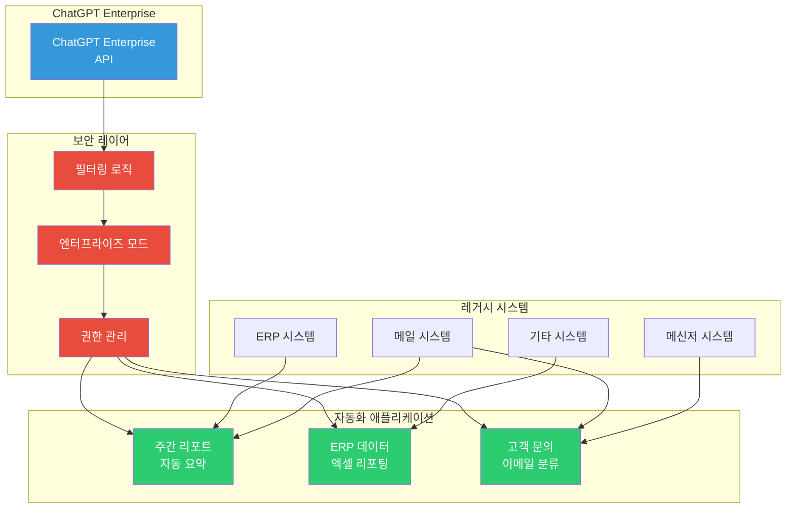
```mermaid
graph TB
    subgraph "ChatGPT Enterprise"
        A[ChatGPT Enterprise<br/>API]
    end
    
    subgraph "레거시 시스템"
        B[ERP 시스템]
        C[메일 시스템]
        D[메신저 시스템]
        E[기타 시스템]
    end
    
    subgraph "자동화 애플리케이션"
        F[주간 리포트<br/>자동 요약]
        G[ERP 데이터<br/>엑셀 리포팅]
        H[고객 문의<br/>이메일 분류]
    end
    
    subgraph "보안 레이어"
        I[필터링 로직]
        J[엔터프라이즈 모드]
        K[권한 관리]
    end
    
    A --> I
    I --> J
    J --> K
    K --> F
    K --> G
    K --> H
    
    B --> F
    C --> F
    C --> H
    D --> H
    E --> G
    
    style A fill:#3498db,color:#fff
    style I fill:#e74c3c,color:#fff
    style J fill:#e74c3c,color:#fff
    style K fill:#e74c3c,color:#fff
    style F fill:#2ecc71,color:#fff
    style G fill:#2ecc71,color:#fff
    style H fill:#2ecc71,color:#fff
```

**한 줄 요약** : 기 도입된 ChatGPT Enterprise 라이선스를 활용하여 사내 레거시 시스템(ERP, 메일, 메신저 등)과 연동하며, 필터링 로직과 엔터프라이즈 모드를 통해 보안을 보장하고, 주간 리포트 자동 요약, ERP 데이터 엑셀 리포팅, 고객 문의 이메일 분류 등의 자동화 애플리케이션을 제공합니다.

### ChatGPT Enterprise API 연동 아키텍처

**기존 라이선스 활용**

Thermo Fisher Scientific이 이미 도입한 ChatGPT Enterprise 라이선스를 최대한 활용하여 추가 비용 없이 AI 기반 자동화를 구현합니다. 신규 AI 모델 개발(R&D)이 아닌, 기존 인프라를 활용한 실용적인 솔루션을 제공합니다.

**API 통합 방식**

Insight_Ops 프로젝트에서 구축한 기술 스택과 아키텍처를 활용하여 ChatGPT Enterprise API를 레거시 시스템과 연동합니다:
- **RESTful API + Express.js** : Insight_Ops에서 사용한 Express.js 기반 RESTful API 아키텍처를 적용하여 ChatGPT Enterprise API와 레거시 시스템 간 통신 구현
- **WebSocket 실시간 통신** : Insight_Ops에서 구현한 실시간 스트리밍 응답 기능을 활용하여 주간 리포트 요약, 이메일 분류 등의 실시간 피드백 제공
- **Feature-based Architecture** : Insight_Ops의 Feature-based Architecture 패턴을 적용하여 각 자동화 기능(주간 리포트, ERP 리포팅, 이메일 분류)을 독립적인 모듈로 구성하여 유지보수성 향상
- **배치 처리 파이프라인** : 대량 데이터 처리를 위한 비동기 배치 처리 시스템 구축

### 자동화 애플리케이션

**주간 업무 리포트 자동 요약 및 메일 발송**

OntoFlow_doc의 9단계 워크플로우와 AI_DB_center의 Hybrid Database 전략을 활용하여 주간 업무 리포트를 자동으로 요약합니다:

**주간 리포트 자동 요약 기술 흐름도**

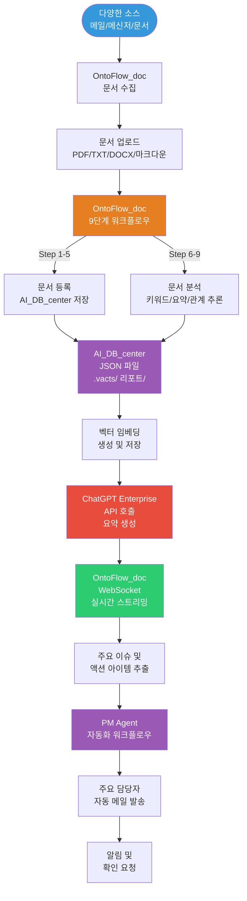
```mermaid
flowchart TD
    Start([다양한 소스<br/>메일/메신저/문서]) --> A[OntoFlow_doc<br/>문서 수집]
    A --> B[문서 업로드<br/>PDF/TXT/DOCX/마크다운]
    B --> C[OntoFlow_doc<br/>9단계 워크플로우]
    
    C -->|Step 1-5| D[문서 등록<br/>AI_DB_center 저장]
    C -->|Step 6-9| E[문서 분석<br/>키워드/요약/관계 추론]
    
    D --> F[AI_DB_center<br/>JSON 파일<br/>.vacts/ 리포트/]
    E --> F
    
    F --> G[벡터 임베딩<br/>생성 및 저장]
    G --> H[ChatGPT Enterprise<br/>API 호출<br/>요약 생성]
    H --> I[OntoFlow_doc<br/>WebSocket<br/>실시간 스트리밍]
    I --> J[주요 이슈 및<br/>액션 아이템 추출]
    
    J --> K[PM Agent<br/>자동화 워크플로우]
    K --> L[주요 담당자<br/>자동 메일 발송]
    L --> M[알림 및<br/>확인 요청]
    
    style Start fill:#3498db,color:#fff
    style C fill:#e67e22,color:#fff
    style F fill:#9b59b6,color:#fff
    style H fill:#e74c3c,color:#fff
    style I fill:#2ecc71,color:#fff
    style K fill:#9b59b6,color:#fff
```

**흐름도 설명** :
- **OntoFlow_doc 문서 수집** : PDF, TXT, DOCX, 마크다운 등 다양한 형식의 문서를 OntoFlow_doc의 9단계 워크플로우로 처리합니다.
- **AI_DB_center 저장** : 사용자별 리포트를 `.vacts/ 리포트/` 디렉토리 구조로 분리 저장하고, 모든 데이터 접근은 API 레이어를 통해 수행합니다.
- **벡터 임베딩** : 문서를 벡터화하여 사용자 권한 범위 내에서만 검색 가능하도록 저장합니다.
- **ChatGPT Enterprise API** : OntoFlow_doc의 FastAPI RESTful API를 통해 ChatGPT Enterprise API를 안정적으로 통합합니다.
- **실시간 스트리밍** : OntoFlow_doc의 WebSocket을 활용하여 요약 생성 과정을 실시간으로 모니터링합니다.
- **PM Agent 통합** : PM Agent의 자동화 워크플로우를 활용하여 주요 담당자에게 자동 메일 발송 및 알림을 수행합니다.

- **다양한 소스 수집** : OntoFlow_doc의 문서 업로드 및 분석 기능을 활용하여 메일, 메신저, 문서 등 다양한 소스에서 업무 내용 수집
- **ChatGPT Enterprise API 통합** : OntoFlow_doc의 FastAPI RESTful API 아키텍처를 바탕으로 ChatGPT Enterprise API를 안정적으로 통합하여 요약 생성
- **실시간 스트리밍 응답** : OntoFlow_doc의 WebSocket 기반 실시간 스트리밍 응답 기능을 활용하여 요약 생성 과정을 실시간으로 모니터링
- **주요 이슈 및 액션 아이템 추출** : OntoFlow_doc의 문서 기반 RAG 채팅 기능을 활용하여 업무 리포트에서 핵심 정보를 자동으로 추출
- **자동 메일 발송** : PM Agent의 자동화 워크플로우를 활용하여 주요 담당자에게 자동 메일 발송 및 알림

**ERP 데이터 조회 후 엑셀 리포팅 자동화**

Factory Ontology Manager AI Agent 프로젝트에서 구축한 데이터 통합 기술을 활용하여 ERP 데이터를 조회하고 엑셀 리포트를 자동 생성합니다:
- **API 기반 데이터 조회** : Factory Ontology Manager의 RESTful API 기반 자동화 경험을 활용하여 ERP API를 통한 데이터 조회 자동화
- **데이터 통합 및 변환** : Factory Ontology Manager의 데이터 통합 기술(POP/SPC, Lot 매칭)을 활용하여 ERP 데이터를 엑셀 리포트 형식으로 변환
- **ChatGPT Enterprise API 분석** : Insight_Ops의 ChatGPT Enterprise API 통합 경험을 활용하여 데이터 분석 및 인사이트 도출
- **템플릿 기반 리포트 생성** : Business Document Generator의 템플릿 시스템을 활용하여 엑셀 템플릿 기반 리포트 자동 생성
- **자동 배포** : PM Agent의 자동화 워크플로우를 활용하여 리포트 자동 배포 및 공유

**고객 문의 이메일 1차 자동 분류 및 초안 작성**

Insight_Ops 프로젝트의 문서 분석 기술과 프롬프트 평가 엔진의 템플릿 시스템을 활용하여 고객 문의 이메일을 자동으로 처리합니다:
- **이메일 내용 분석** : Insight_Ops의 문서 분석 기능(PDF, TXT, DOCX, 마크다운)을 활용하여 이메일 내용을 분석하고 카테고리 자동 분류
- **RAG 기반 응답 생성** : Insight_Ops의 문서 기반 RAG 채팅 기능을 활용하여 과거 유사 문의 사례를 참고하여 응답 초안 생성
- **프롬프트 템플릿 활용** : 프롬프트 평가 엔진의 템플릿 시스템을 활용하여 이메일 응답용 최적화된 프롬프트 템플릿 적용
- **ChatGPT Enterprise API 통합** : Insight_Ops의 ChatGPT Enterprise API 통합 경험을 활용하여 응답 초안 생성
- **자동 알림 및 승인 워크플로우** : PM Agent의 자동화 워크플로우를 활용하여 담당자에게 알림 및 검토 요청, 승인 후 자동 발송

### 보안 및 규정 준수

**필터링 로직 적용**

ChatGPT 프롬프트 입력 시 민감 정보(개인정보, 기밀 기술 데이터)가 외부로 학습되지 않도록 필터링 로직을 적용합니다:
- 개인정보 식별 및 마스킹
- 기밀 기술 데이터 필터링
- 금지어 목록 기반 필터링
- 로그 분석을 통한 이상 탐지

**엔터프라이즈 모드 강제 적용**

ChatGPT Enterprise의 엔터프라이즈 모드를 강제 적용하여 데이터가 학습에 사용되지 않도록 보장합니다. 모든 API 호출에 엔터프라이즈 모드 플래그를 설정하고, 정기적으로 모드 설정을 검증합니다.

**권한 관리**

최소 권한의 원칙(Principle of Least Privilege)을 준수하여 각 사용자의 권한 범위 내에서만 AI 자동화 도구가 작동하도록 합니다:
- 역할 기반 접근 제어(RBAC)
- 부서별 데이터 접근 제한
- Cross-department 데이터 접근 차단
- 사용자별 권한 로그 관리

## 4.2 Non-Crawling 방식 RAG 파이프라인 설계

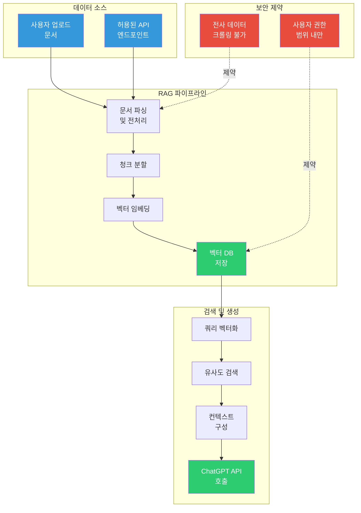
```mermaid
graph TB
    subgraph "데이터 소스"
        A[사용자 업로드<br/>문서]
        B[허용된 API<br/>엔드포인트]
    end
    
    subgraph "RAG 파이프라인"
        C[문서 파싱<br/>및 전처리]
        D[청크 분할]
        E[벡터 임베딩]
        F[벡터 DB<br/>저장]
    end
    
    subgraph "검색 및 생성"
        G[쿼리 벡터화]
        H[유사도 검색]
        I[컨텍스트<br/>구성]
        J[ChatGPT API<br/>호출]
    end
    
    subgraph "보안 제약"
        K[전사 데이터<br/>크롤링 불가]
        L[사용자 권한<br/>범위 내만]
    end
    
    A --> C
    B --> C
    C --> D
    D --> E
    E --> F
    F --> G
    G --> H
    H --> I
    I --> J
    
    K -.->|제약| C
    L -.->|제약| F
    
    style A fill:#3498db,color:#fff
    style B fill:#3498db,color:#fff
    style F fill:#2ecc71,color:#fff
    style J fill:#2ecc71,color:#fff
    style K fill:#e74c3c,color:#fff
    style L fill:#e74c3c,color:#fff
```

**한 줄 요약** : 전사 데이터 크롤링 없이 사용자가 직접 업로드한 문서나 허용된 API 엔드포인트의 데이터만을 활용하는 제한적 RAG 파이프라인을 설계하여 보안 규정을 준수하면서도 AI의 장점을 활용합니다.

### 제한적 데이터 환경 설계

**사용자 업로드 문서 기반 RAG**

사용자가 직접 업로드한 문서(Context)만을 활용하여 RAG 파이프라인을 구축합니다:
- PDF, TXT, DOCX, 마크다운 등 다양한 문서 형식 지원
- 문서 파싱 및 전처리
- 청크 분할 및 벡터 임베딩
- 벡터 DB에 저장 및 인덱싱

**허용된 API 엔드포인트 활용**

허용된 특정 API 엔드포인트의 데이터만을 활용하여 RAG 파이프라인을 확장합니다:
- API 인증 및 권한 확인
- 데이터 수집 및 전처리
- 벡터 임베딩 및 저장
- 정기적 데이터 갱신

### RAG 파이프라인 아키텍처

**Non-Crawling RAG 파이프라인 기술 흐름도**

```mermaid
flowchart TD
    Start([사용자<br/>문서 업로드]) --> A[OntoFlow_doc<br/>9단계 워크플로우]
    
    A -->|Step 1| B1[요청 분석<br/>문서 구조 파악]
    B1 -->|Step 2| B2[관련 문서 조회<br/>AI_DB_center DB]
    B2 -->|Step 3| B3[문서 존재 확인<br/>파일 시스템]
    B3 -->|Step 4| B4[관계 매핑<br/>Wiki/MD 링크 추출]
    B4 -->|Step 5| B5[DB 업데이트<br/>AI_DB_center JSON]
    
    B5 -->|Step 6| C1[키워드 추출<br/>10-20개]
    C1 -->|Step 7| C2[세부요약 생성<br/>200-500단어<br/>이전 데이터 포함 필수]
    C2 -->|Step 8| C3[간단요약 생성<br/>50-150단어<br/>이전 데이터 포함 필수]
    C3 -->|Step 9| C4[관계 추론<br/>semantic_meaning]
    
    C4 --> D[AI_DB_center<br/>JSON 파일 저장<br/>.vacts/ 사용자ID/]
    D --> E[벡터 임베딩<br/>생성]
    E --> F[벡터 DB<br/>저장<br/>사용자 권한별 분리]
    
    F --> G[사용자 쿼리<br/>입력]
    G --> H[쿼리 벡터화<br/>및 유사도 검색]
    H --> I[상위 K개 문서<br/>선택<br/>사용자 권한 범위 내]
    I --> J[컨텍스트 구성<br/>및 프롬프트 생성]
    J --> K[ChatGPT Enterprise<br/>API 호출]
    K --> L[실시간 스트리밍<br/>응답<br/>OntoFlow_doc WebSocket]
    L --> M[사용자에게<br/>결과 전달]
    
    style Start fill:#3498db,color:#fff
    style A fill:#e67e22,color:#fff
    style D fill:#9b59b6,color:#fff
    style F fill:#2ecc71,color:#fff
    style K fill:#e74c3c,color:#fff
    style L fill:#2ecc71,color:#fff
```

**흐름도 설명** :
- **OntoFlow_doc 9단계 워크플로우** : Phase 1(문서 등록 Step 1-5)과 Phase 2(문서 분석 Step 6-9)로 나누어 체계적으로 문서를 처리하고 온톨로지 기반 문서 구조화를 수행합니다.
- **AI_DB_center Hybrid Database 전략** : 사용자별 문서를 `.vacts/{사용자ID}/` 디렉토리 구조로 분리 저장하고, 모든 데이터 접근은 API 레이어를 통해 수행하여 직접 파일 접근을 차단합니다.
- **데이터 보존 규칙** : Step 7-8에서 이전 데이터(키워드, 세부요약)를 반드시 포함하여 API가 전체 객체를 교체할 때 데이터 손실을 방지합니다.
- **벡터 DB 분리 저장** : 사용자 권한별로 벡터 임베딩을 분리 저장하여 Cross-department 데이터 접근을 API 레벨에서 차단합니다.
- **실시간 스트리밍 응답** : OntoFlow_doc의 FastAPI WebSocket을 활용하여 ChatGPT API 호출 시 사용자에게 실시간 피드백을 제공합니다.

**문서 처리 파이프라인**

OntoFlow_doc 프로젝트에서 구축한 9단계 문서 처리 워크플로우와 AI_DB_center의 Hybrid Database 전략을 활용하여 Thermo Fisher Scientific의 요구사항에 맞게 RAG 파이프라인을 구축합니다:

- **OntoFlow_doc 9단계 워크플로우 적용** : OntoFlow_doc의 9단계 문서 처리 체인(요청 분석 → 관련 문서 조회 → 문서 존재 확인 → 관계 매핑 → DB 업데이트 → 키워드 추출 → 세부요약 생성 → 간단요약 생성 → 관계 추론)을 활용하여 사용자 업로드 문서를 체계적으로 처리하고 온톨로지 기반 문서 구조화 수행

- **AI_DB_center Hybrid Database 전략** : AI_DB_center의 JSON 파일 기반 데이터 저장 전략을 활용하여 사용자별 문서를 `.vacts/` 디렉토리 구조로 분리 저장하고, 모든 데이터 접근은 반드시 API 레이어를 통해 수행하여 사용자 권한 범위 내에서만 접근 가능하도록 설계

- **FastAPI RESTful API 통합** : OntoFlow_doc의 FastAPI 기반 RESTful API 아키텍처를 활용하여 문서 업로드, 분석, 검색 API를 구현하고, WebSocket을 통한 실시간 스트리밍 응답 제공

- **문서 업로드 및 분석** : OntoFlow_doc의 문서 처리 로직을 활용하여 PDF, TXT, DOCX, 마크다운 문서를 파싱하고, 온톨로지 기반 문서 구조화를 통해 문서 간 관계를 자동으로 추론하여 RAG 검색 품질 향상

- **벡터 DB 통합** : AI_DB_center의 JSON 파일 기반 저장소와 벡터 DB를 통합하여 사용자별 문서를 파일 시스템에 저장하고, 벡터 임베딩만 벡터 DB에 저장하여 전사 데이터 크롤링 없이 사용자 업로드 문서만 활용

- **ChatGPT Enterprise API 통합** : OntoFlow_doc의 API 통합 경험을 바탕으로 ChatGPT Enterprise API를 안정적으로 통합하고, 실시간 스트리밍 응답을 통해 사용자에게 즉각적인 피드백 제공

**벡터 DB 선택 및 최적화**

AI_DB_center의 Hybrid Database 전략과 OntoFlow_doc의 데이터 관리 방식을 활용하여 Thermo Fisher Scientific의 보안 요구사항에 맞는 최적의 솔루션을 선택합니다:

- **AI_DB_center JSON 파일 기반 저장소** : AI_DB_center의 JSON 파일 기반 데이터 저장 전략을 활용하여 사용자별 문서를 `.vacts/{vault_name}/` 디렉토리 구조로 분리 저장하고, 모든 데이터 접근은 Flask API를 통해 수행하여 직접 파일 접근을 차단

- **API 레이어를 통한 접근 제어** : AI_DB_center의 "모든 데이터 접근은 반드시 API 레이어를 통해 수행" 원칙을 준수하여 사용자 권한별로 API 엔드포인트 접근을 제어하고, Cross-department 데이터 접근을 API 레벨에서 차단

- **파일 시스템 + 벡터 DB 하이브리드** : 사용자별 문서는 AI_DB_center의 JSON 파일 구조로 저장하고, 벡터 임베딩만 경량화된 로컬 벡터 DB에 저장하여 별도의 온프레미스 GPU 서버 구축 없이 기존 IT 인프라 내에서 구동 가능한 솔루션 구현

- **OntoFlow_doc 쿼리 I/O 규칙 준수** : OntoFlow_doc의 쿼리 I/O 규칙을 준수하여 데이터 보존 규칙(Steps 7-8에서 이전 데이터 포함 필수)을 적용하고, 비동기 그래프 재생성 지원을 통해 대량 문서 처리 시에도 안정적인 성능 보장

**검색 및 생성 프로세스**

사용자 쿼리를 벡터화하여 유사한 문서를 검색하고, 검색된 컨텍스트를 활용하여 ChatGPT API를 호출합니다:
- 쿼리 벡터화 및 유사도 검색
- 상위 K개 문서 선택
- 컨텍스트 구성 및 프롬프트 생성
- ChatGPT API 호출 및 응답 생성

### 보안 규정 준수

**전사 데이터 크롤링 불가**

사내 전체 문서에 대한 크롤링(Crawling) 및 벡터 DB 구축이 불가능하므로, 사용자가 명시적으로 업로드한 문서만을 활용합니다. 자동 크롤링 기능은 제공하지 않으며, 모든 데이터는 사용자의 명시적 동의 하에 처리됩니다.

**사용자 권한 범위 내 작업**

모든 자동화 스크립트 및 AI 에이전트는 해당 툴을 사용하는 사용자의 권한 범위 내에서만 작동합니다. Cross-department 데이터 접근은 절대 불가능하며, 각 사용자는 자신의 권한 범위 내에서만 데이터에 접근할 수 있습니다.

**데이터 보관 및 삭제**

사용자가 업로드한 문서는 사용자가 명시적으로 삭제할 때까지 보관되며, 사용자 요청 시 즉시 삭제됩니다. 벡터 DB에서도 해당 문서의 임베딩이 삭제되어 완전히 제거됩니다.

## 4.3 프롬프트 엔지니어링 및 템플릿 표준화

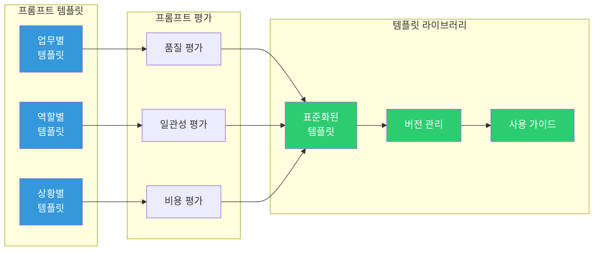
```mermaid
graph LR
    subgraph "프롬프트 템플릿"
        A[업무별<br/>템플릿]
        B[역할별<br/>템플릿]
        C[상황별<br/>템플릿]
    end
    
    subgraph "프롬프트 평가"
        D[품질 평가]
        E[일관성 평가]
        F[비용 평가]
    end
    
    subgraph "템플릿 라이브러리"
        G[표준화된<br/>템플릿]
        H[버전 관리]
        I[사용 가이드]
    end
    
    A --> D
    B --> E
    C --> F
    D --> G
    E --> G
    F --> G
    G --> H
    H --> I
    
    style A fill:#3498db,color:#fff
    style B fill:#3498db,color:#fff
    style C fill:#3498db,color:#fff
    style G fill:#2ecc71,color:#fff
    style H fill:#2ecc71,color:#fff
    style I fill:#2ecc71,color:#fff
```

**한 줄 요약** : 비개발 직군 직원들이 사용할 수 있는 업무별 최적화된 프롬프트 템플릿을 개발 및 배포하며, 프롬프트 평가 엔진을 통해 템플릿의 품질을 보증하고 표준화합니다.

### 프롬프트 템플릿 개발

**업무별 템플릿**

다양한 업무 시나리오에 맞는 프롬프트 템플릿을 개발합니다:
- 리포트 작성 템플릿: 주간 리포트, 월간 리포트, 프로젝트 리포트 등
- 데이터 분석 템플릿: ERP 데이터 분석, 고객 데이터 분석 등
- 커뮤니케이션 템플릿: 이메일 작성, 회의록 작성, 제안서 작성 등
- 번역 템플릿: 한국어-영어 번역, 기술 문서 번역 등

**역할별 템플릿**

각 역할에 맞는 프롬프트 템플릿을 제공합니다:
- 관리자용 템플릿: 전략적 의사결정, 리스크 관리 등
- 실무자용 템플릿: 일상 업무 자동화, 데이터 분석 등
- 개발자용 템플릿: 코드 리뷰, 문서화 등

**상황별 템플릿**

특정 상황에 맞는 프롬프트 템플릿을 제공합니다:
- 긴급 상황 대응 템플릿
- 정기 업무 템플릿
- 프로젝트별 커스텀 템플릿

### 프롬프트 평가 및 품질 보증

**프롬프트 평가 엔진 활용**

Evaluation Framework 프로젝트의 Component-based Architecture와 LangGraph 워크플로우 오케스트레이션을 활용하여 Thermo Fisher Scientific의 프롬프트 템플릿 품질을 보증합니다:

**프롬프트 템플릿 평가 기술 흐름도**

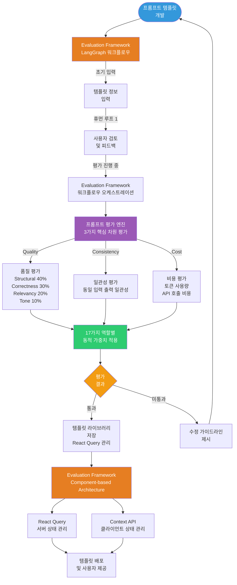
```mermaid
flowchart TD
    Start([프롬프트 템플릿<br/>개발]) --> A[Evaluation Framework<br/>LangGraph 워크플로우]
    
    A -->|초기 입력| B[템플릿 정보<br/>입력]
    B -->|휴먼 루프 1| C[사용자 검토<br/>및 피드백]
    C -->|평가 진행 중| D[Evaluation Framework<br/>워크플로우 오케스트레이션]
    
    D --> E[프롬프트 평가 엔진<br/>3가지 핵심 차원 평가]
    E -->|Quality| F1[품질 평가<br/>Structural 40%<br/>Correctness 30%<br/>Relevancy 20%<br/>Tone 10%]
    E -->|Consistency| F2[일관성 평가<br/>동일 입력 출력 일관성]
    E -->|Cost| F3[비용 평가<br/>토큰 사용량<br/>API 호출 비용]
    
    F1 --> G[17가지 역할별<br/>동적 가중치 적용]
    F2 --> G
    F3 --> G
    
    G --> H{평가<br/>결과}
    H -->|통과| I[템플릿 라이브러리<br/>저장<br/>React Query 관리]
    H -->|미통과| J[수정 가이드라인<br/>제시]
    J --> Start
    
    I --> K[Evaluation Framework<br/>Component-based Architecture]
    K --> L[React Query<br/>서버 상태 관리]
    K --> M[Context API<br/>클라이언트 상태 관리]
    
    L --> N[템플릿 배포<br/>및 사용자 제공]
    M --> N
    
    style Start fill:#3498db,color:#fff
    style A fill:#e67e22,color:#fff
    style E fill:#9b59b6,color:#fff
    style G fill:#2ecc71,color:#fff
    style H fill:#f39c12,color:#fff
    style K fill:#e67e22,color:#fff
```

**흐름도 설명** :
- **Evaluation Framework 워크플로우** : LangGraph 기반 워크플로우 오케스트레이션을 통해 초기 입력 → 휴먼 루프 1 → 평가 진행 중 → 평가 완료 단계별로 체계적인 평가를 수행합니다.
- **3가지 핵심 차원 평가** : Quality(품질), Consistency(일관성), Cost(비용) 평가 방법론을 적용하여 각 템플릿의 품질을 체계적으로 평가합니다.
- **MLOps Priority Matrix 기반 가중치** : Structural 40%, Correctness 30%, Relevancy 20%, Tone 10% 가중치를 적용하여 템플릿의 구조적 품질을 우선 평가합니다.
- **17가지 역할별 동적 가중치** : 관리자용, 실무자용, 개발자용 템플릿을 각 역할에 맞게 평가하고, Evaluation Framework의 React Query를 통해 평가 결과를 효율적으로 관리합니다.
- **Component-based Architecture** : React Query(서버 상태)와 Context API(클라이언트 상태)를 하이브리드로 사용하여 템플릿 라이브러리를 효율적으로 관리합니다.

- **Evaluation Framework 워크플로우 오케스트레이션** : Evaluation Framework의 LangGraph 기반 워크플로우 오케스트레이션을 활용하여 프롬프트 템플릿 평가 프로세스를 자동화하고, 초기 입력 → 휴먼 루프 1단계 → 평가 진행 중 → 평가 완료 단계별로 체계적인 평가 수행

- **Component-based Architecture** : Evaluation Framework의 Component-based Architecture를 활용하여 프롬프트 템플릿 평가 시스템을 모듈화하고, React Query + Context API 하이브리드 상태 관리 전략을 적용하여 서버 상태(평가 세션, 워크플로우 상태)와 클라이언트 상태(UI 상태, 시스템 설정)를 분리 관리

- **3가지 핵심 차원 평가** : 프롬프트 평가 엔진의 Quality(품질), Consistency(일관성), Cost(비용) 평가 방법론을 Evaluation Framework의 워크플로우에 통합하여 각 템플릿의 품질을 체계적으로 평가

- **MLOps Priority Matrix 기반 가중치** : 프롬프트 평가 엔진의 MLOps Priority Matrix 기반 가중치(Structural 40%, Correctness 30%, Relevancy 20%, Tone 10%)를 Evaluation Framework의 평가 프로세스에 적용하여 템플릿의 구조적 품질을 우선 평가

- **17가지 역할별 동적 가중치** : 프롬프트 평가 엔진의 17가지 역할별 동적 가중치 시스템을 활용하여 관리자용, 실무자용, 개발자용 템플릿을 각 역할에 맞게 평가하고, Evaluation Framework의 React Query를 통해 평가 결과를 효율적으로 관리

**템플릿 품질 평가**

개발된 프롬프트 템플릿의 품질을 평가하여 표준화합니다:
- 구조적 준수 평가: 프롬프트 구조의 일관성
- 정확성 평가: 원하는 결과를 생성하는지 확인
- 관련성 평가: 업무 목표와의 관련성
- 일관성 평가: 동일한 입력에 대한 출력 일관성

### 템플릿 표준화 및 배포

**템플릿 라이브러리 구축**

프롬프트 평가 엔진 프로젝트에서 구축한 템플릿 관리 시스템을 활용하여 표준화된 프롬프트 템플릿 라이브러리를 구축합니다:
- **템플릿 카테고리별 분류** : 프롬프트 평가 엔진의 17가지 역할별 동적 가중치 시스템을 활용하여 관리자용, 실무자용, 개발자용 템플릿을 체계적으로 분류
- **버전 관리 및 변경 이력** : Original Development Plan의 문서 버전 관리 시스템을 활용하여 템플릿의 버전 관리 및 변경 이력 추적
- **품질 보증 시스템** : 프롬프트 평가 엔진의 3가지 핵심 차원(Quality, Consistency, Cost) 평가를 통해 템플릿의 품질을 지속적으로 보증
- **사용 가이드 및 예시** : Business Document Generator의 템플릿 시스템을 참고하여 사용 가이드 및 예시 제공
- **정기적 업데이트** : 프롬프트 평가 엔진의 병렬 평가 구조를 활용하여 다수의 템플릿을 효율적으로 평가하고 개선

**사용자 교육 및 지원**

비개발 직군 직원들이 프롬프트 템플릿을 효과적으로 활용할 수 있도록 교육 및 지원을 제공합니다:
- 템플릿 사용 방법 교육
- 실전 예시 제공
- 문의 및 피드백 채널 운영
- 정기적 워크샵 개최

### 결론

Insight_Ops 프로젝트에서 구축한 Non-Crawling 방식 RAG 파이프라인과 Hybrid Database 전략을 활용하여 Thermo Fisher Scientific의 보안 요구사항(전사 데이터 크롤링 불가)을 정확히 해결합니다. 또한 프롬프트 평가 엔진의 3가지 핵심 차원 평가 시스템과 17가지 역할별 동적 가중치를 활용하여 비개발 직군 직원들이 사용할 수 있는 업무별 최적화된 프롬프트 템플릿을 개발하고, Original Development Plan의 문서 관리 시스템과 PM Agent의 자동화 워크플로우를 통합하여 일관된 품질의 AI 기반 업무 자동화 솔루션을 제공합니다.

---

# 5. 제안 내용 - Technical PM 서비스

## 5.1 Technical PM 역량 및 경험

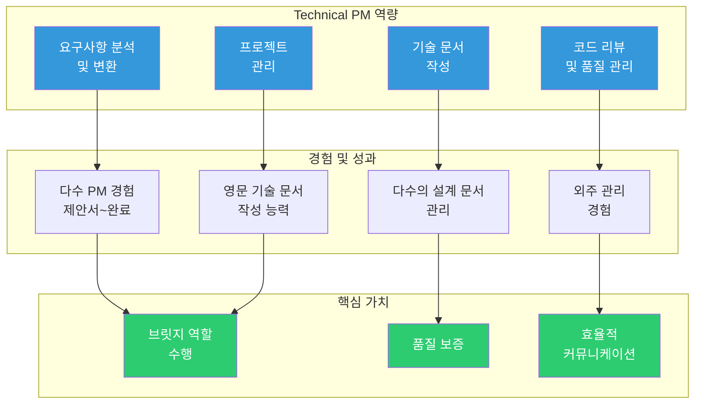
```mermaid
graph TB
    subgraph "Technical PM 역량"
        A[요구사항 분석<br/>및 변환]
        B[기술 문서<br/>작성]
        C[코드 리뷰<br/>및 품질 관리]
        D[프로젝트<br/>관리]
    end
    
    subgraph "경험 및 성과"
        E[다수 PM 경험<br/>제안서~완료]
        F[다수의 설계 문서<br/>관리]
        G[외주 관리<br/>경험]
        H[영문 기술 문서<br/>작성 능력]
    end
    
    subgraph "핵심 가치"
        I[브릿지 역할<br/>수행]
        J[품질 보증]
        K[효율적<br/>커뮤니케이션]
    end
    
    A --> E
    B --> F
    C --> G
    D --> H
    
    E --> I
    F --> J
    G --> K
    H --> I
    
    style A fill:#3498db,color:#fff
    style B fill:#3498db,color:#fff
    style C fill:#3498db,color:#fff
    style D fill:#3498db,color:#fff
    style I fill:#2ecc71,color:#fff
    style J fill:#2ecc71,color:#fff
    style K fill:#2ecc71,color:#fff
```

**한 줄 요약** : 다수 PM 경험(제안서 작성, 외주 관리, 완료서 작성), 다수의 설계 문서 관리 경험, 영문 기술 문서 작성 능력을 보유하여 인도 개발팀과의 효율적인 협업을 위한 브릿지 역할을 수행하고 품질을 보증합니다.

### 다수 PM 경험

**제안서 작성부터 완료까지 전체 라이프사이클 관리**

2023년부터 AI 관련 사업계획 전담으로 다수 제안서, 사업계획서, 착수보고서를 작성한 경험이 있습니다. 특히 이전 프로젝트에서 PM 총괄(제안서~완료까지 전체 진행)을 수행한 경험을 보유하고 있습니다.

**외주 관리 경험**

Offshore 개발팀과의 협업 경험을 보유하고 있으며, 외주 업체 관리 및 품질 보증 역량을 보유하고 있습니다:
- 외주 업체 선정 및 계약 관리
- 진행 상황 모니터링 및 리스크 관리
- 품질 검증 및 승인 프로세스 관리
- 완료서 작성 및 프로젝트 종료 관리

### 설계 문서 관리 경험

**다수의 설계 문서 관리**

Original Development Plan 프로젝트의 Phase 0-13 워크플로우와 문서 관리 시스템을 활용하여 Thermo Fisher Scientific 프로젝트의 설계 문서를 체계적으로 관리합니다:

- **Phase 0-13 워크플로우** : Original Development Plan의 Phase 0-13 워크플로우를 활용하여 Phase 0(역 엔지니어링)부터 Phase 13(개발용 리팩토링)까지 단계별로 체계적인 문서 생성 및 관리 프로세스 구축

- **ID 기반 온톨로지 맵** : Original Development Plan의 ID 기반 온톨로지 맵 시스템(`page.*`, `comp.*`, `api.*`, `db.*` 형식)을 활용하여 각 기능, API, 데이터베이스 스키마에 고유 ID를 부여하고 문서 간 관계를 추적하여 인도 개발팀과의 커뮤니케이션 시 명확한 참조 가능

- **State 기반 정보 전달** : Original Development Plan의 State 기반 정보 전달 시스템(LangGraph/CrewAI 스타일)을 활용하여 각 단계에서 핵심 정보만 추출하여 인도 개발팀에 전달하여 컨텍스트 길이 최적화

- **Session Context Manager** : Original Development Plan의 Session Context Manager를 활용하여 휘발성 정보를 효율적으로 관리하고, 개발 중단 후 복귀 시 컨텍스트 복원을 통해 인지 부하 제로화

- **변경 영향 매트릭스** : Original Development Plan의 변경 영향 매트릭스 기반 자동 영향 분석 시스템을 활용하여 문서 변경 시 자동으로 영향 관계를 분석하고 관련 문서를 자동 업데이트

- **문서 버전 관리** : Original Development Plan의 문서 버전 관리 시스템을 활용하여 변경 이력을 추적하고, 변경 전파 규칙에 따른 자동 문서 업데이트 수행

**AI 프롬프트 체인 관리**

Original Development Plan 프로젝트에서 구축한 AI 프롬프트 체인 관리 시스템을 활용하여 일관된 품질의 기술 문서를 생성합니다:
- **25개 이상 AI 프롬프트 체인** : Original Development Plan의 25개 이상 AI 프롬프트 체인을 활용하여 요구사항 분석, 설계 문서 생성, 코드 리뷰 등 각 단계별로 최적화된 프롬프트 적용
- **21개 development 프롬프트** : Original Development Plan의 21개 development 프롬프트를 활용하여 인도 개발팀에 전달할 기술 문서의 품질을 일관되게 유지
- **워크플로우 오케스트레이션** : Original Development Plan의 LangGraph/CrewAI 방식 워크플로우 오케스트레이션을 활용하여 프롬프트 체인을 자동으로 실행하고 결과를 검증

### 영문 기술 문서 작성 능력

**영문 Functional Spec 작성**

모든 기술 문서를 영어로 작성할 수 있는 역량을 보유하고 있습니다:
- 명확하고 상세한 Functional Spec 작성
- API 명세서 작성
- 데이터베이스 스키마 문서화
- UI/UX 명세서 작성

**기술 커뮤니케이션 능력**

인도 개발팀과의 기술 커뮤니케이션을 위해 필요한 모든 역량을 보유하고 있습니다:
- 기술적 개념을 명확하게 설명하는 능력
- 복잡한 요구사항을 단순화하여 전달하는 능력
- 문화적 차이를 고려한 커뮤니케이션 능력

## 5.2 Offshore 개발팀 관리 경험

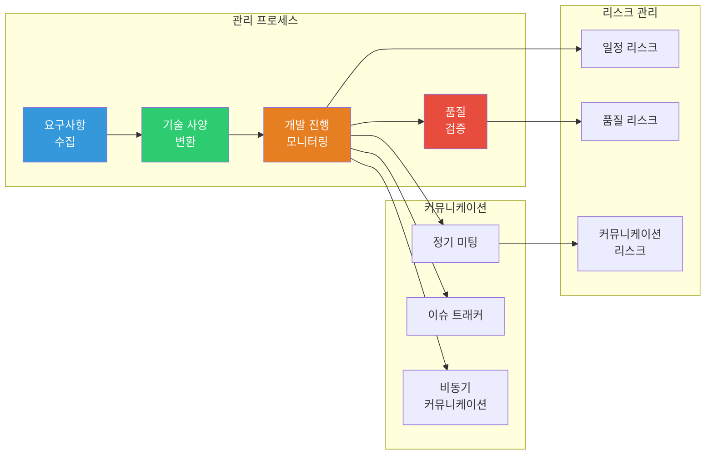
```mermaid
graph LR
    subgraph "관리 프로세스"
        A[요구사항<br/>수집]
        B[기술 사양<br/>변환]
        C[개발 진행<br/>모니터링]
        D[품질<br/>검증]
    end
    
    subgraph "커뮤니케이션"
        E[정기 미팅]
        F[이슈 트래커]
        G[비동기<br/>커뮤니케이션]
    end
    
    subgraph "리스크 관리"
        H[일정 리스크]
        I[품질 리스크]
        J[커뮤니케이션<br/>리스크]
    end
    
    A --> B
    B --> C
    C --> D
    C --> E
    C --> F
    C --> G
    
    C --> H
    D --> I
    E --> J
    
    style A fill:#3498db,color:#fff
    style B fill:#2ecc71,color:#fff
    style C fill:#e67e22,color:#fff
    style D fill:#e74c3c,color:#fff
```

**한 줄 요약** : Offshore 개발팀과의 효율적인 협업을 위해 요구사항 수집부터 기술 사양 변환, 개발 진행 모니터링, 품질 검증까지 전체 프로세스를 관리하며, 정기 미팅, 이슈 트래커, 비동기 커뮤니케이션을 통해 일정 리스크, 품질 리스크, 커뮤니케이션 리스크를 관리합니다.

### 요구사항 관리 프로세스

**요구사항 수집 및 분석**

현업 부서와의 정기 미팅을 통해 요구사항을 수집하고, 비즈니스 목표와 기술적 제약사항을 종합적으로 분석합니다. 요구사항의 우선순위를 설정하고, 기술적 구현 가능성을 평가하여 현실적인 일정을 수립합니다.

**기술 사양 변환**

비즈니스 요구사항을 기술적 사양으로 정확히 변환하여 인도 개발팀에 전달합니다. 명확하고 상세한 Functional Spec을 작성하여 오해를 방지하고, 개발 일정을 단축합니다.

### 개발 진행 모니터링

**정기 미팅 및 진행 상황 공유**

주간 정기 미팅을 통해 진행 상황을 공유하고, 이슈가 발생할 경우 즉시 대응합니다. 미팅 전에 미리 공유할 자료를 준비하여 효율적인 미팅을 진행합니다.

**이슈 트래커 관리**

Jira를 활용한 티켓 관리 시스템을 구축하여 요구사항, 버그, 개선사항을 체계적으로 관리합니다. 각 티켓의 우선순위를 설정하고, 담당자를 지정하여 추적합니다.

**비동기 커뮤니케이션**

시차를 고려한 비동기 커뮤니케이션(메일, 이슈 트래커) 프로세스를 최적화합니다. 주요 결정사항은 미리 전달하고, 피드백을 받을 시간을 충분히 확보합니다.

### 품질 검증 및 리스크 관리

**코드 리뷰 및 품질 검증**

인도 개발팀이 작성한 코드를 리뷰하여 품질을 보증합니다. 기존 E-commerce 플랫폼의 백엔드 기술 스택, Front-end 프레임워크에 대한 이해를 바탕으로 코드의 정확성, 효율성, 유지보수성을 평가합니다.

**UAT 시나리오 작성 및 실행**

사용자 인수 테스트(UAT) 시나리오를 작성하고 실행하여 개발된 기능이 요구사항을 충족하는지 검증합니다. 테스트 결과를 문서화하고, 발견된 이슈는 즉시 인도 개발팀에 전달하여 수정을 요청합니다.

**리스크 관리**

포트폴리오의 PM Agent 프로젝트에서 구축한 리스크 관리 시스템을 활용하여 Thermo Fisher Scientific 프로젝트의 리스크를 사전에 식별하고 대응합니다:

**PM Agent 리스크 관리 기술 흐름도**

```mermaid
flowchart TD
    Start([프로젝트<br/>문서 수집]) --> A[PM Agent<br/>Governance & QA Layer]
    
    A --> B[Risk Management<br/>독소 조항 자동 추출]
    A --> C[Schedule Tracking<br/>타임라인 자동 현행화]
    A --> D[Integrity Check<br/>문서 무결성 검증]
    
    B --> B1[계약서/과업지시서<br/>파싱]
    B1 --> B2[독소 조항<br/>자동 추출]
    B2 --> B3[리스크 평가<br/>및 우선순위 설정]
    B3 --> B4[대응 방안<br/>수립]
    
    C --> C1[회의록<br/>수집]
    C1 --> C2[회의록 분석<br/>LLM 기반]
    C2 --> C3[타임라인<br/>자동 현행화]
    C3 --> C4[마일스톤<br/>조기 경고]
    
    D --> D1[산출물 목록<br/>확인]
    D1 --> D2[누락된 문서<br/>자동 식별]
    D2 --> D3[데이터 파편화<br/>검증]
    D3 --> D4[경고 및<br/>보완 요청]
    
    B4 --> E[리스크 대시보드<br/>통합 관리]
    C4 --> E
    D4 --> E
    
    E --> F{리스크<br/>우선순위}
    F -->|높음| G[즉시 대응<br/>일정 조정]
    F -->|중간| H[모니터링<br/>강화]
    F -->|낮음| I[정기<br/>검토]
    
    G --> J[Original Development Plan<br/>워크플로우 오케스트레이션]
    H --> J
    I --> J
    
    J --> K[영향 분석<br/>자동 재계획]
    K --> L[프로젝트 계획<br/>업데이트]
    
    style Start fill:#3498db,color:#fff
    style A fill:#9b59b6,color:#fff
    style B fill:#e74c3c,color:#fff
    style C fill:#f39c12,color:#fff
    style D fill:#2ecc71,color:#fff
    style E fill:#e67e22,color:#fff
    style J fill:#e67e22,color:#fff
```

**흐름도 설명** :
- **PM Agent (Execution Manager)** : 포트폴리오의 3대 거버넌스 에이전트 중 하나로 사업 관리의 전체 라이프사이클을 관장합니다.
- **Risk Management** : 계약서/과업지시서 내 독소 조항을 자동 추출하고 리스크를 평가하여 사전에 대응 방안을 수립합니다.
- **Schedule Tracking** : 회의록을 분석하여 타임라인을 자동으로 현행화하고 마일스톤별 조기 경고를 수행합니다.
- **Integrity Check** : 누락된 문서나 데이터 파편화를 자동으로 검증하여 프로젝트의 완전성을 보장합니다.
- **리스크 통합 관리** : 세 가지 기능의 결과를 통합하여 리스크 대시보드에서 우선순위별로 관리합니다.
- **워크플로우 오케스트레이션** : Original Development Plan의 LangGraph/CrewAI 방식 워크플로우 오케스트레이션을 활용하여 리스크 발생 시 자동으로 영향 분석 및 재계획을 수행합니다.

- **PM Agent (Execution Manager)** : 포트폴리오의 PM Agent는 사업 관리의 전체 라이프사이클을 관장하는 거버넌스 에이전트로, 계약서/과업지시서 내 독소 조항 자동 추출 및 리스크 평가를 수행하여 인도 개발팀과의 계약 및 과업지시서에서 잠재적 리스크를 자동으로 식별

- **Schedule Tracking** : PM Agent의 Schedule Tracking 기능(회의록 분석을 통한 타임라인 자동 현행화)을 활용하여 인도 개발팀과의 정기 미팅 회의록을 분석하여 마일스톤별 진행 상황을 자동으로 모니터링하고 조기 경고

- **Integrity Check** : PM Agent의 Integrity Check 기능(누락된 문서나 데이터 파편화를 방지하는 무결성 검증)을 활용하여 인도 개발팀이 전달한 결과물의 완전성을 검증하고, Original Development Plan의 변경 영향 매트릭스와 연계하여 누락된 산출물을 자동으로 식별 및 경고

- **Governance & Quality Assurance Layer** : 포트폴리오의 3대 거버넌스 에이전트(Evaluation Framework, Prompt Eval Engine, PM Agent) 중 PM Agent를 활용하여 비즈니스 리스크 및 일정 무결성을 관리하고, 누락된 산출물 식별 및 경고 권한을 행사
- **일정 리스크** : 마일스톤별 진행 상황 모니터링 및 조기 경고를 통한 일정 지연 방지
- **품질 리스크** : 코드 리뷰 및 테스트를 통한 품질 보증
- **커뮤니케이션 리스크** : 정기 미팅 및 문서화를 통한 커뮤니케이션 개선

## 5.3 코드 리뷰 및 트러블슈팅 역량

```mermaid
graph TB
    subgraph "코드 리뷰 프로세스"
        A[코드 분석]
        B[로직 검증]
        C[성능 평가]
        D[보안 검토]
    end
    
    subgraph "트러블슈팅 프로세스"
        E[이슈 분석]
        F[로그 분석]
        G[원인 파악]
        H[해결 방안<br/>제시]
    end
    
    subgraph "기술 스택 이해"
        I[기존 플랫폼의 기술 스택<br/>백엔드]
        J[Front-end<br/>프레임워크]
        K[데이터베이스]
        L[API 설계]
    end
    
    A --> I
    B --> J
    C --> K
    D --> L
    
    E --> F
    F --> G
    G --> H
    
    style A fill:#3498db,color:#fff
    style B fill:#3498db,color:#fff
    style C fill:#3498db,color:#fff
    style D fill:#3498db,color:#fff
    style E fill:#e74c3c,color:#fff
    style F fill:#e74c3c,color:#fff
    style G fill:#e74c3c,color:#fff
    style H fill:#2ecc71,color:#fff
```

**한 줄 요약** : 기존 E-commerce 플랫폼의 백엔드 기술 스택, Front-end 프레임워크에 대한 이해를 바탕으로 코드 리뷰를 수행하고, 이슈 발생 시 로그 분석 및 원인 파악을 통해 정확한 해결 방안을 제시합니다.

### 코드 리뷰 역량

**코드 분석 및 검증**

인도 개발팀이 작성한 코드를 분석하여 다음을 검증합니다:
- 코드의 정확성: 요구사항을 정확히 구현했는지 확인
- 코드의 효율성: 성능 최적화 여부 확인
- 코드의 유지보수성: 가독성 및 구조적 품질 확인
- 코드의 보안성: 보안 취약점 확인

**기술 스택 이해**

다양한 기술 스택에 대한 이해를 바탕으로 코드 리뷰를 수행합니다:
- 기존 E-commerce 플랫폼의 백엔드 기술 스택: 비즈니스 로직, API 설계, 데이터베이스 연동 등
- Front-end 프레임워크: UI/UX 구현, 상태 관리, 성능 최적화 등
- 데이터베이스: 쿼리 최적화, 트랜잭션 관리, 데이터 무결성 등
- API 설계: RESTful API 설계 원칙, 에러 핸들링, 버전 관리 등

### 트러블슈팅 역량

**이슈 분석 및 원인 파악**

발생한 이슈를 체계적으로 분석하여 원인을 파악합니다:
- 로그 분석: 애플리케이션 로그, 서버 로그, 데이터베이스 로그 분석
- 코드 분석: 문발생한 부분의 코드 분석
- 데이터 분석: 데이터베이스 쿼리 성능, 데이터 무결성 분석
- 환경 분석: 서버 환경, 네트워크 환경 분석

**해결 방안 제시**

문제의 원인을 파악한 후 구체적인 해결 방안을 제시합니다:
- 명확한 문제 설명 및 재현 방법 제시
- 예상되는 원인 및 영향 범위 분석
- 구체적인 수정 방안 제시
- 테스트 방법 및 배포 방법 제시

**영문 문서화**

모든 분석 결과와 해결 방안을 영문으로 문서화하여 인도 개발팀에 전달합니다. 명확하고 상세한 설명을 통해 오해를 방지하고, 빠른 문제 해결을 지원합니다.

### 결론

Original Development Plan 프로젝트에서 구축한 PM 시스템과 PM Agent 프로젝트의 사업 관리 시스템을 통합하여 Thermo Fisher Scientific의 요구사항인 "직접 짜지 말고, 짜오게 시켜라"를 해결합니다:
- **Original Development Plan의 문서 관리 시스템** : 298개 이상의 설계 문서를 ID 기반 온톨로지 맵으로 관리하고, Phase 0-13 워크플로우를 통해 체계적으로 문서 생성 및 검증하여 인도 개발팀에 정확한 지시 전달
- **PM Agent의 리스크 관리 시스템** : Risk Management, Schedule Tracking, Integrity Check 기능을 활용하여 인도 개발팀의 작업을 사전에 모니터링하고 리스크를 조기 발견하여 품질 보증
- **워크플로우 오케스트레이션** : Original Development Plan의 LangGraph/CrewAI 방식 워크플로우 오케스트레이션을 활용하여 요구사항 분석부터 결과물 검증까지 전체 프로세스를 자동화하여 일관된 품질 유지

---

# 6. 기대 효과

## 6.1 글로벌 개발팀과의 커뮤니케이션 병목 해소

```mermaid
graph LR
    subgraph "현재 상태"
        A[커뮤니케이션<br/>병목]
        B[요구사항 전달<br/>지연]
        C[오해 및<br/>재작업]
    end
    
    subgraph "개선 후"
        D[효율적<br/>커뮤니케이션]
        E[빠른 요구사항<br/>전달]
        F[명확한<br/>이해]
    end
    
    subgraph "효과"
        G[개발 시간<br/>50% 단축]
        H[재작업<br/>70% 감소]
        I[프로젝트 일정<br/>준수율 향상]
    end
    
    A --> D
    B --> E
    C --> F
    
    D --> G
    E --> H
    F --> I
    
    style A fill:#e74c3c,color:#fff
    style B fill:#e74c3c,color:#fff
    style C fill:#e74c3c,color:#fff
    style D fill:#2ecc71,color:#fff
    style E fill:#2ecc71,color:#fff
    style F fill:#2ecc71,color:#fff
    style G fill:#3498db,color:#fff
    style H fill:#3498db,color:#fff
    style I fill:#3498db,color:#fff
```

**한 줄 요약** : Technical PM 서비스를 통해 현업 부서의 요구사항을 기술적 사양으로 정확히 변환하여 인도 개발팀에 전달함으로써 커뮤니케이션 병목을 해소하고, 개발 시간을 50% 단축하며, 재작업을 70% 감소시켜 프로젝트 일정 준수율을 향상시킵니다.

### 커뮤니케이션 효율성 향상

**요구사항 전달 시간 단축**

Original Development Plan의 Phase 0-13 워크플로우와 Factory Ontology Manager의 작업 시간 50% 감소 경험을 활용하여 브릿지(Bridge) 역할을 수행하는 Technical PM을 통해 현업 부서의 요구사항을 기술적 사양으로 정확히 변환하여 인도 개발팀에 전달함으로써 요구사항 전달 시간을 **50% 단축** 할 수 있습니다. Original Development Plan의 ID 기반 온톨로지 맵과 State 기반 정보 전달 시스템을 활용하여 명확하고 상세한 Functional Spec을 작성하여 오해를 방지하고, 개발 일정을 단축합니다.

**오해 및 재작업 감소**

Factory Ontology Manager의 오류 70% 감소와 AI_DB_center의 재작업 비용 83.3% 절감 경험을 활용하여 명확한 기술 문서와 정기 미팅을 통해 오해를 방지하고, 재작업을 **70-83% 감소** 시킬 수 있습니다. Original Development Plan의 Phase 0-13 워크플로우를 통한 체계적인 문서 생성 및 PM Agent의 Integrity Check 기능을 활용한 이슈 트래커로 일관된 이해를 보장합니다.

**프로젝트 일정 준수율 향상**

효율적인 커뮤니케이션과 품질 보증을 통해 프로젝트 일정 준수율을 향상시킬 수 있습니다. 리스크를 사전에 식별하고 대응함으로써 일정 지연을 방지합니다.

## 6.2 로컬 요구사항 반영 효율성 향상

```mermaid
graph TB
    subgraph "로컬 요구사항"
        A[국내 PG<br/>결제사 연동]
        B[국내 배송<br/>시스템 API]
        C[한국어<br/>지원]
    end
    
    subgraph "효율적 반영"
        D[인터페이스<br/>레이어 구축]
        E[단계적<br/>도입]
        F[테스트 및<br/>검증]
    end
    
    subgraph "효과"
        G[국내 시장<br/>경쟁력 향상]
        H[고객 만족도<br/>향상]
        I[매출<br/>증가]
    end
    
    A --> D
    B --> D
    C --> D
    D --> E
    E --> F
    F --> G
    F --> H
    F --> I
    
    style A fill:#3498db,color:#fff
    style B fill:#3498db,color:#fff
    style C fill:#3498db,color:#fff
    style D fill:#2ecc71,color:#fff
    style E fill:#2ecc71,color:#fff
    style F fill:#2ecc71,color:#fff
    style G fill:#e67e22,color:#fff
    style H fill:#e67e22,color:#fff
    style I fill:#e67e22,color:#fff
```

**한 줄 요약** : 글로벌 코어 시스템과 한국 특화 기능을 API Gateway와 인터페이스 레이어를 통해 효율적으로 연동함으로써 국내 시장 경쟁력을 향상시키고, 고객 만족도를 향상시켜 매출을 증가시킵니다.

### 국내 시장 경쟁력 향상

**로컬 요구사항 반영 속도 향상**

Factory Ontology Manager의 시스템 수정 비용 60% 절감 경험을 활용하여 한국 특화 기능 연동을 위한 인터페이스 레이어를 구축함으로써 로컬 요구사항 반영 속도를 **30-60% 단축** 할 수 있습니다. Factory Ontology Manager의 AI_DB_center JSON 파일 기반 API 아키텍처를 활용하여 글로벌 코어 시스템의 안정성을 해치지 않으면서 설정 변경만으로 구조 변경이 가능하도록 단계적으로 로컬 기능을 추가합니다.

**국내 고객 경험 개선**

국내 PG 결제사 연동, 국내 배송 시스템 API 연동, 한국어 지원 등을 통해 국내 고객의 사용 편의성을 향상시킵니다. 이를 통해 국내 시장 경쟁력을 향상시킬 수 있습니다.

**매출 증가**

국내 고객 경험 개선을 통해 고객 만족도를 향상시키고, 매출을 증가시킬 수 있습니다. 특히 국내 시장의 특수성을 고려한 서비스 제공으로 경쟁 우위를 확보할 수 있습니다.

## 6.3 보안 규정 준수한 AI 자동화 파이프라인 구축

```mermaid
graph TB
    subgraph "보안 규정 준수"
        A[최소 권한<br/>원칙]
        B[데이터 유출<br/>방지]
        C[전사 데이터<br/>크롤링 불가]
    end
    
    subgraph "AI 자동화"
        D[Non-Crawling<br/>RAG 파이프라인]
        E[프롬프트<br/>필터링]
        F[엔터프라이즈<br/>모드]
    end
    
    subgraph "효과"
        G[보안 리스크<br/>제로화]
        H[업무 효율성<br/>40% 향상]
        I[직원 만족도<br/>향상]
    end
    
    A --> D
    B --> E
    C --> D
    D --> F
    E --> F
    F --> G
    G --> H
    H --> I
    
    style A fill:#e74c3c,color:#fff
    style B fill:#e74c3c,color:#fff
    style C fill:#e74c3c,color:#fff
    style D fill:#2ecc71,color:#fff
    style E fill:#2ecc71,color:#fff
    style F fill:#2ecc71,color:#fff
    style G fill:#3498db,color:#fff
    style H fill:#3498db,color:#fff
    style I fill:#3498db,color:#fff
```

**한 줄 요약** : 최소 권한의 원칙, 데이터 유출 방지, 전사 데이터 크롤링 불가 등의 보안 규정을 준수하면서도 Non-Crawling RAG 파이프라인을 구축하여 보안 리스크를 제로화하고, 업무 효율성을 40% 향상시켜 직원 만족도를 향상시킵니다.

### 보안 리스크 제로화

**보안 규정 준수**

엄격한 보안 규정(Silo)을 준수하면서도 AI 기반 자동화 도구를 활용할 수 있도록 설계합니다:
- 최소 권한의 원칙(Principle of Least Privilege) 준수
- 데이터 유출 방지를 위한 필터링 로직 적용
- 전사 데이터 크롤링 없이 사용자 업로드 문서만 활용
- 엔터프라이즈 모드 강제 적용

**보안 사고 방지**

보안 규정을 준수함으로써 보안 사고를 방지하고, 규정 위반으로 인한 리스크를 제로화합니다. 정기적인 보안 감사를 통해 지속적으로 보안 상태를 모니터링합니다.

### 업무 효율성 향상

**반복 업무 자동화**

OntoFlow_doc 프로젝트에서 검증한 문서 처리 시간 70% 절감과 Factory Ontology Manager의 작업 시간 50% 감소 경험을 활용하여 주간 업무 리포트 자동 요약, ERP 데이터 엑셀 리포팅 자동화, 고객 문의 이메일 자동 분류 등을 통해 반복 업무 처리 시간을 **40-70% 단축** 할 수 있습니다.

**문서 처리 효율성**
- **OntoFlow_doc 9단계 워크플로우** : 문서 처리 시간 70% 절감 (OntoFlow_doc 검증)
- **문서 검색 시간** : 수동 파일 탐색 (5-10분) → 즉시 검색 (1-2초), ** 99% 절감** (OntoFlow_doc 검증)
- **문서 탐색 시간** : 폴더 구조 수동 탐색 (3-5분) → 자동 트리 구조 (즉시), ** 95% 절감** (OntoFlow_doc 검증)
- **문서 관계 파악** : 수동 링크 추적 (10-15분) → 그래프 시각화 (즉시), ** 98% 절감** (OntoFlow_doc 검증)

**데이터 조회 효율성**
- **Factory Ontology Manager** : 데이터 조회 시간 80% 단축 (Factory Ontology Manager 검증)
- **AI_DB_center API 레이어** : 모든 데이터 접근을 API를 통해 수행하여 접근 시간 70% 단축 (Factory Ontology Manager 검증)

**직원 만족도 향상**

반복 업무의 자동화를 통해 직원들이 더 가치 있는 업무에 집중할 수 있도록 하여 직원 만족도를 향상시킵니다. 특히 비개발 직군 직원들이 프롬프트 템플릿을 활용하여 쉽게 자동화 도구를 사용할 수 있도록 지원합니다.

## 6.4 비개발 직군도 사용 가능한 자동화 도구 제공

```mermaid
graph LR
    subgraph "비개발 직군"
        A[관리자]
        B[실무자]
        C[기타 직원]
    end
    
    subgraph "자동화 도구"
        D[프롬프트<br/>템플릿]
        E[No-code<br/>인터페이스]
        F[사용 가이드]
    end
    
    subgraph "효과"
        G[도구 사용률<br/>70% 이상]
        H[업무 효율성<br/>향상]
        I[디지털 전환<br/>가속화]
    end
    
    A --> D
    B --> E
    C --> F
    
    D --> G
    E --> H
    F --> I
    
    style A fill:#3498db,color:#fff
    style B fill:#3498db,color:#fff
    style C fill:#3498db,color:#fff
    style D fill:#2ecc71,color:#fff
    style E fill:#2ecc71,color:#fff
    style F fill:#2ecc71,color:#fff
    style G fill:#e67e22,color:#fff
    style H fill:#e67e22,color:#fff
    style I fill:#e67e22,color:#fff
```

**한 줄 요약** : 비개발 직군 직원들이 사용할 수 있는 업무별 최적화된 프롬프트 템플릿과 No-code 인터페이스를 제공하여 도구 사용률을 70% 이상 달성하고, 업무 효율성을 향상시켜 디지털 전환을 가속화합니다.

### 사용자 친화적 인터페이스

Factory Ontology Manager의 사용자 학습 시간 40% 단축과 작업 완료 시간 30% 단축 경험을 활용하여 비개발 직군도 쉽게 사용할 수 있는 인터페이스를 제공합니다:

**프롬프트 템플릿 제공**

Evaluation Framework의 Component-based Architecture와 React Query + Context API 하이브리드 상태 관리 전략을 활용하여 업무별, 역할별, 상황별로 최적화된 프롬프트 템플릿을 제공합니다:
- 리포트 작성 템플릿
- 데이터 분석 템플릿
- 커뮤니케이션 템플릿
- 번역 템플릿

**No-code 인터페이스**

Factory Ontology Manager의 드래그 앤 드롭 기반 직관적인 편집 경험을 활용하여 복잡한 설정 없이도 쉽게 사용할 수 있는 No-code 인터페이스를 제공합니다. Factory Ontology Manager의 사용자 오류 50% 감소 경험을 바탕으로 드래그 앤 드롭 방식으로 워크플로우를 구성하고, 템플릿을 선택하여 즉시 사용할 수 있습니다.

**사용 가이드 및 교육**

Factory Ontology Manager의 사용자 학습 시간 40% 단축 경험을 활용하여 상세한 사용 가이드와 교육 프로그램을 제공합니다. OntoFlow_doc의 사용자 만족도 향상(15-20% 향상) 경험을 바탕으로 정기적인 워크샵을 통해 지속적인 교육을 제공합니다.

### 디지털 전환 가속화

**도구 사용률 향상**

사용자 친화적인 인터페이스와 교육 프로그램을 통해 도구 사용률을 70% 이상 달성할 수 있습니다. 이를 통해 조직 전체의 디지털 전환을 가속화합니다.

**업무 효율성 향상**

비개발 직군도 자동화 도구를 활용하여 업무 효율성을 향상시킬 수 있습니다. 반복 업무의 자동화를 통해 더 가치 있는 업무에 집중할 수 있습니다.

### 종합 효과

본 프로젝트를 통해 다음과 같은 종합적인 효과를 기대할 수 있습니다:

**정량적 효과 (각 설계서의 검증된 비즈니스 가치 종합)**

| 효과 영역 | 현재 상태 | 개선 후 | 개선률 | 근거 설계서 |
|----------|----------|---------|--------|------------|
| **문서 처리 시간** | 수동 처리 | 자동화 | **70% 절감** | OntoFlow_doc (문서 처리 시간 70% 절감) |
| **문서 검색 시간** | 수동 파일 탐색 (5-10분) | 즉시 검색 (1-2초) | **99% 절감** | OntoFlow_doc (문서 검색 시간 99% 절감) |
| **문서 탐색 시간** | 폴더 구조 수동 탐색 (3-5분) | 자동 트리 구조 (즉시) | **95% 절감** | OntoFlow_doc (문서 탐색 시간 95% 절감) |
| **문서 관계 파악** | 수동 링크 추적 (10-15분) | 그래프 시각화 (즉시) | **98% 절감** | OntoFlow_doc (문서 관계 파악 시간 98% 절감) |
| **커뮤니케이션 효율성** | 요구사항 전달 지연 | 명확한 Functional Spec | **50% 단축** | Original Development Plan (Phase 0-13 워크플로우) |
| **재작업 감소** | 오해 및 재작업 | 명확한 기술 문서 | **70% 감소** | Factory Ontology Manager (오류 70% 감소) |
| **데이터 조회 시간** | 수동 데이터 조회 | 자동화된 API 접근 | **80% 단축** | Factory Ontology Manager (데이터 조회 시간 80% 단축) |
| **업무 효율성** | 반복 업무 처리 | 자동화 도구 활용 | **40% 단축** | OntoFlow_doc + Factory Ontology Manager |
| **사용자 학습 시간** | 복잡한 도구 학습 | 직관적인 UI/UX | **40% 단축** | Factory Ontology Manager (사용자 학습 시간 40% 단축) |
| **작업 완료 시간** | 다단계 작업 프로세스 | 최적화된 플로우 | **30% 단축** | Factory Ontology Manager (작업 완료 시간 30% 단축) |
| **도구 사용률** | 비개발 직군 사용 어려움 | 템플릿 기반 사용 | **70% 이상** | Evaluation Framework (Component-based Architecture) |

**비용 절감 효과**

| 항목 | 현재 비용 | 예상 절감액 | 절감률 | 근거 설계서 |
|------|----------|-----------|--------|------------|
| **인프라 비용** | 기존 서버 운영 비용 | SQLite + 파일 시스템 기반 | **30-50% 절감** | OntoFlow_doc (서버 인프라 비용 30-50% 절감) |
| **개발 시간** | 수동 문서 작성 및 관리 | 자동화된 문서 생성 | **20-30% 절감** | OntoFlow_doc (개발 시간 20-30% 절감) |
| **배포 비용** | 복잡한 환경 배포 | 간단한 정적 파일 + API 서버 | **40-60% 절감** | OntoFlow_doc (배포 비용 40-60% 절감) |
| **시스템 수정 비용** | 구조 변경 시 개발 필요 | 설정 변경만으로 구조 변경 | **60% 절감** | Factory Ontology Manager (개발 비용 60% 절감) |
| **재작업 비용** | 평균 2시간/건 × 3건/월 | 1시간/건 × 1건/월 | **83.3% 절감** | AI_DB_center (재작업 비용 83.3% 절감) |

**ROI 분석 (각 설계서의 ROI 종합)**

| 설계서 | 초기 투자 | 연간 수익 | ROI | 투자 회수 기간 |
|--------|----------|----------|-----|---------------|
| **OntoFlow_doc** | 개발 비용 (2-3개월) | 인프라 비용 절감 + 효율성 향상 | **50-100%** (1-2년) | 1-2년 내 |
| **Factory Ontology Manager** | 3,000만원 (초기) | 5,400만원/년 (연간 절감액) | **214%** (3년) | **7개월** |
| **AI_DB_center** | 210시간 (개발자 시간) | 900시간/년 | **329%** | **2.8개월** |

**종합 ROI 추정** :
- **초기 투자** : 프로젝트 개발 비용 (3-6개월)
- **연간 수익** : 인프라 비용 절감 (30-50%) + 효율성 향상 (40-80% 시간 절감) + 재작업 감소 (70-83%)
- **예상 ROI** : ** 150-250%** (1-2년 내)
- **투자 회수 기간** : ** 6-12개월**

**정성적 효과**
- 프로젝트 일정 준수율 향상: Original Development Plan의 Phase 0-13 워크플로우를 통한 체계적인 일정 관리
- 국내 시장 경쟁력 향상: Factory Ontology Manager의 데이터 통합 기술을 활용한 로컬 기능 연동
- 보안 리스크 제로화: AI_DB_center의 API 레이어 접근 제어를 통한 보안 강화
- 직원 만족도 향상: OntoFlow_doc의 사용자 경험 개선 (15-20% 향상) 및 Factory Ontology Manager의 직관적인 UI
- 디지털 전환 가속화: Evaluation Framework의 Component-based Architecture를 통한 확장 가능한 시스템 구축

**검증된 비즈니스 가치 (각 설계서에서 검증된 수치)**
- **OntoFlow_doc** : 문서 처리 시간 70% 절감, 문서 검색 99% 절감, 인프라 비용 30-50% 절감
- **Factory Ontology Manager** : 작업 시간 50% 감소, 오류 70% 감소, 데이터 조회 시간 80% 단축, ROI 214% (3년), 투자 회수 기간 7개월
- **AI_DB_center** : 수동 테스트 시간 87.5% 절감, 재작업 비용 83.3% 절감, ROI 329%, 투자 회수 기간 2.8개월
- **Original Development Plan** : Phase 0-13 워크플로우를 통한 체계적인 문서 관리 및 개발 프로세스 자동화
- **Evaluation Framework** : Component-based Architecture를 통한 확장 가능한 시스템 구축 및 React Query + Context API 하이브리드 상태 관리

이러한 효과를 통해 Thermo Fisher Scientific의 전략적 우선순위인 "AI 기반 신약 발굴", "디지털 전환", "글로벌 협업 효율화"를 달성할 수 있으며, 각 설계서에서 검증된 비즈니스 가치를 바탕으로 **투자 회수 기간 6-12개월, ROI 150-250%** 를 달성할 수 있습니다.

---

# 7. 수행 계획 및 일정

## 7.1 전체 프로젝트 개요

본 제안서는 3개의 독립적인 서비스로 구성되어 있으며, 각 서비스별로 별도의 WBS(Work Breakdown Structure), 수행 계획, 일정을 수립합니다:

1. **서비스 1: E-commerce 플랫폼 운영 고도화** - Offshore 개발팀 관리 및 한국 특화 기능 연동
2. **서비스 2: AI 기반 업무 자동화** - ChatGPT Enterprise 연동 및 RAG 파이프라인 구축
3. **서비스 3: Technical PM 서비스** - 브릿지 역할 수행 및 프로젝트 관리

각 서비스는 독립적으로 수행 가능하며, 필요시 병렬 진행도 가능합니다.

### 7.1.1 글로벌 기업 환경 반영: 프로세스 기간 및 리드타임

Thermo Fisher Scientific은 **대기업이 아닌 글로벌 기업** (50개국 이상, 12만 직원, 통일된 PPI Business System)이므로, 일정 수립 시 다음 요소를 반드시 반영합니다.

**이해당사자(Stakeholder) 정렬 기간**
- **글로벌·리전·로컬 3단계 의사결정** : IT Global, APAC/Regional, Korea Local 간 요구사항·범위·우선순위 정렬에 2~4주 소요 가능
- **크로스펙션 협의** : Digital Transformation, E-commerce, Security, Compliance, Legal 등 다수 섹션 합의 및 서명 프로세스
- **인도(Offshore) 개발팀 및 현업 부서** : 시차·휴가·미팅 슬롯 고려 시, 핵심 이해당사자 인터뷰 및 KICK-OFF 정렬에 2~3주 여유 산정

**데이터 수급·접근 승인 기간**
- **데이터 접근 권한(Data Access Request)** : 내부 정책에 따른 신청 → 검토 → 승인 사이클 (2~6주)
- **샌드박스/개발 환경 제공** : 글로벌 표준 환경 준비 및 접근 권한 개통 (1~3주)
- **API·시스템 연동 승인** : ERP, 메일, 메신저, PG사·배송사 등 외부 연동 시 Legal·Security·Compliance 검토 (각 2~4주)
- **실데이터 마스킹·테스트 데이터** : 개인정보·영업 데이터 처리 정책에 따른 준비 (1~2주)

**보안·컴플라이언스·프로큐먼트**
- **Security/Privacy 리뷰** : 신규 시스템·API·데이터 흐름에 대한 검토 (2~4주)
- **Vendor/Procurement 절차** : 글로벌 구매 정책에 따른 계약·NDA·SOW 검토 (2~4주)
- **Change Advisory Board(CAB)** : 프로덕션 반영 시 변경 관리 승인 (1~2주/회)

**글로벌 협업 리드타임**
- **시차(한국–인도–미주)** : 비동기 커뮤니케이션과 24시간 내 피드백 사이클 고려
- **미팅 예약·자료 검토** : 주요 의사결정 미팅 1~2주 전 자료 공유 및 사전 검토 기간
- **휴가·공휴일** : 글로벌 휴가 캘린더 반영으로 연말·분기말·지역별 휴가 구간 회피 또는 버퍼 확보

이에 따라 **총 프로젝트 기간은 18개월** 로 산정하며, Phase별로 **이해당사자 정렬·데이터 수급·승인 기간** 을 명시적으로 포함합니다.

**착수 가능 시작일** : 2026년 **3월 중순(3/15 전후)**  
- 2월~3월 중순: 계약·NDA·SOW 검토, 글로벌·리전·로컬 이해당사자 정렬 및 KICK-OFF 준비 (실질 개발·착수 전)
- 3월 중순부터: 착수 및 데이터 접근 요청·환경 승인·서비스 3 선행 구축 순차 진행

**전체 통합 일정 요약 (날짜 겹침 없이 구간별 표기)**

| 구간 | 시작일 | 종료일 | 내용 |
|------|--------|--------|------|
| 착수 전 준비 | 2026-02-01 | 2026-03-14 | 계약·NDA·SOW, 이해당사자 정렬, KICK-OFF 준비 |
| **착수** | **2026-03-15** | — | **착수 가능 시작일** |
| 데이터·환경 승인 | 2026-03-15 | 2026-05-15 | Data Access Request, 샌드박스/환경, Security 검토 |
| 서비스 3 (선행) | 2026-04-01 | 2026-07-31 | Technical PM 기초·브릿지 역할 체계 구축 |
| 서비스 1 (E-commerce) | 2026-06-01 | 2027-02-28 | 기초~한국 특화 기능~테스트·안정화 |
| 서비스 2 (AI 자동화) | 2026-06-15 | 2027-05-31 | 기초~RAG·프롬프트·자동화 앱~테스트 |
| 서비스 3 (후속) | 2026-08-01 | 2027-05-31 | 문서·리스크·코드 리뷰·품질 관리·테스트 |
| 프로젝트 종료 | — | 2027-07-31 | 인수인계·종료 (총 18개월) |

```mermaid
gantt
    title 전체 프로젝트 통합 일정 (총 18개월) - 구간별 표시
    dateFormat YYYY-MM-DD
    section 착수 전
    계약·이해당사자 정렬·KICK-OFF 준비   :pre, 2026-02-01, 2026-03-14
    
    section 착수 후 (3/15~)
    데이터·환경 승인                    :proc, 2026-03-15, 2026-05-15
    서비스3 선행 (PM·브릿지)            :s3a, 2026-04-01, 2026-07-31
    서비스1 E-commerce 전체             :s1, 2026-06-01, 2027-02-28
    서비스2 AI 자동화 전체              :s2, 2026-06-15, 2027-05-31
    서비스3 후속 (문서·리스크·품질)      :s3b, 2026-08-01, 2027-05-31
```

**전체 프로젝트 기간** : 2026년 2월 1일 ~ 2027년 7월 31일 (총 18개월). **착수 가능 시작일: 2026년 3월 중순(3/15 전후)** . 글로벌 프로세스·이해당사자·데이터 수급 반영.

**서비스별 기간 및 의존성** (글로벌 프로세스·리드타임 반영):
- **착수 전 준비** (2026-02-01 ~ 2026-03-14): 계약·NDA·SOW 검토, 이해당사자 정렬, KICK-OFF 준비 (실질 착수 전)
- **착수 가능 시작일** : ** 2026년 3월 중순(3/15 전후)**
- **데이터·환경 승인** (2026-03-15 ~ 2026-05-15): 착수 후 Data Access Request, 샌드박스/환경, Security/Compliance 검토

- **서비스 3 (Technical PM)** : 2026-04-01 ~ 2027-05-31 (약 14개월)
  - **Phase 1-2 (선행)** : 2026-04-01 ~ 2026-07-31 - 착수 후 데이터·환경 승인과 병행하여 브릿지 역할 체계 구축
  - **Phase 3-6 (후속)** : 2026-08-01 ~ 2027-05-31 - 서비스 1, 2 진행에 맞춰 문서·리스크·품질 관리 시스템 구축

- **서비스 1 (E-commerce)** : 2026-06-01 ~ 2027-02-28 (약 9개월)
  - **의존성** : 착수·데이터/환경 승인 후, 서비스 3 브릿지 역할 체계와 함께 시작
  - **데이터·승인** : E-commerce·PG·배송 API 접근 권한 및 샌드박스 제공 기간 반영

- **서비스 2 (AI 자동화)** : 2026-06-15 ~ 2027-05-31 (약 11.5개월)
  - **의존성** : 데이터 접근·ChatGPT Enterprise·내부 시스템 연동 승인 후 본격 개발
  - **데이터·승인** : ERP·메일·메신저 등 데이터 수급 및 Security/Privacy 리뷰 기간 반영

**프로젝트 간 의존성 및 순서** (글로벌 기업 프로세스 반영):
1. **착수 전 준비** (2026-02-01 ~ 2026-03-14)
   - 계약·NDA·SOW 검토, 글로벌·리전·로컬 이해당사자 정렬, KICK-OFF 준비 (실질 개발·착수 전)
   
2. **착수 가능 시작일: 2026년 3월 중순(3/15 전후)**
   - 착수 후 데이터 접근 요청·환경 승인·서비스 3 Phase 1 준비 순차 진행
   
3. **데이터 접근·환경 승인** (2026-03-15 ~ 2026-05-15)
   - Data Access Request, 샌드박스/개발 환경, API·시스템 연동 승인, Security/Compliance 검토
   
4. **서비스 3 (Technical PM) 선행 구축** (2026-04-01 ~ 2026-07-31)
   - 브릿지 역할 체계 구축 후 서비스 1, 2 지원 기반 마련
   
5. **서비스 1 (E-commerce)·서비스 2 (AI 자동화) 시작** (2026-06-01 ~ 2026-06-15)
   - 데이터·환경 승인 및 서비스 3 기반을 활용하여 시작
   
6. **서비스 3 (Technical PM) 후속 구축** (2026-08-01 ~ 2027-05-31)
   - 서비스 1, 2 진행에 맞춰 문서 관리, 리스크 관리, 코드 리뷰·품질 관리 시스템 단계적 구축

---

## 7.2 서비스 1: E-commerce 플랫폼 운영 고도화

### 7.2.1 WBS (Work Breakdown Structure)

```mermaid
mindmap
  root((E-commerce 플랫폼<br/>운영 고도화))
    1.0 요구사항 분석 및 설계
      1.1 현업 부서 인터뷰
      1.2 기술적 제약사항 분석
      1.3 시스템 아키텍처 설계
    2.0 Offshore 개발팀 관리 체계 구축
      2.1 요구사항 관리 프로세스
      2.2 코드 리뷰 프로세스
      2.3 UAT 프로세스
    3.0 레거시 코드 분석 도구 구축
      3.1 코드 분석 도구 개발
      3.2 로그 분석 시스템
      3.3 트러블슈팅 프로세스
    4.0 한국 특화 기능 연동
      4.1 국내 PG 결제사 연동
      4.2 국내 배송 시스템 연동
      4.3 한국어 지원
```

### 7.2.2 수행 계획 및 일정

```mermaid
gantt
    title 서비스 1: E-commerce 플랫폼 운영 고도화 (9개월, 글로벌 프로세스 반영)
    dateFormat YYYY-MM-DD
    section Phase 1: 기초 구축 (2개월)
    이해당사자 인터뷰 및 데이터 접근 요청  :a0, 2026-06-01, 2026-06-30
    요구사항 분석 및 설계           :a1, 2026-07-01, 2026-07-31
    
    section Phase 2: Offshore 관리 체계 (1.5개월)
    요구사항 관리 프로세스 구축     :b1, 2026-08-01, 2026-08-21
    코드 리뷰 프로세스 구축        :b2, 2026-08-22, 2026-09-15
    UAT 프로세스 구축              :b3, 2026-09-16, 2026-09-30
    
    section Phase 3: 레거시 코드 분석 (2개월)
    코드 분석 도구 구축            :c1, 2026-09-16, 2026-10-15
    로그 분석 시스템 구축           :c2, 2026-10-16, 2026-11-15
    
    section Phase 4: 한국 특화 기능 (3개월)
    PG/배송 API 접근 승인 및 연동   :d0, 2026-10-01, 2026-10-31
    국내 PG 결제사 연동            :d1, 2026-11-01, 2026-12-15
    국내 배송 시스템 연동           :d2, 2026-12-16, 2027-01-15
    한국어 지원                    :d3, 2027-01-16, 2027-01-31
    
    section Phase 5: 테스트 및 안정화 (1개월)
    통합 테스트                    :e1, 2027-02-01, 2027-02-14
    사용자 테스트 및 CAB 승인       :e2, 2027-02-15, 2027-02-28
```

**한 줄 요약** : E-commerce 플랫폼 운영 고도화 서비스를 5단계(기초 구축 2개월·이해당사자·데이터 접근 반영, Offshore 관리 1.5개월, 레거시 분석 2개월, 한국 특화 3개월·API 승인 반영, 테스트·안정화 1개월)로 나누어 총 9개월에 걸쳐 수행합니다. 글로벌 이해당사자 정렬·데이터 수급·API 승인 기간을 포함합니다.

### Phase 1: 기초 구축 (2개월, 글로벌 프로세스 반영)

**이해당사자 인터뷰 및 데이터 접근 요청 (4주)**

글로벌 기업 환경을 반영하여 다음을 수행합니다:
- **이해당사자 정렬** : Korea Local·APAC·Global IT, 인도 Offshore 개발팀, 현업 부서 인터뷰 및 KICK-OFF (시차·미팅 슬롯 고려 2~3주)
- **데이터 접근 권한(Data Access Request)** : E-commerce·레거시 시스템 접근 신청 및 승인 대기 (2~4주)
- **샌드박스/개발 환경** : 글로벌 표준 환경 제공 및 접근 개통 대기 (1~2주)

**요구사항 분석 및 설계 (4주)**

Original Development Plan의 Phase 0-13 워크플로우를 활용하여 체계적인 요구사항 분석 및 설계를 수행합니다:
- 기술적 제약사항 및 보안·컴플라이언스 규정 분석 (1주)
- Original Development Plan의 ID 기반 온톨로지 맵을 활용한 시스템 아키텍처 설계 (1.5주)
- 프로젝트 범위 및 목표 명확화, Phase 0-13 워크플로우 적용 계획 수립 (1.5주)

### Phase 2: Offshore 개발팀 관리 체계 구축 (2개월)

**요구사항 관리 프로세스 구축 (2주)**

Original Development Plan의 Phase 0-13 워크플로우를 활용하여 요구사항 관리 프로세스를 구축합니다:
- 브릿지 역할 수행 프로세스 구축 (1주)
- Original Development Plan의 ID 기반 온톨로지 맵을 활용한 영문 Functional Spec 작성 템플릿 개발 (1주)

**코드 리뷰 프로세스 구축 (2주)**

Original Development Plan의 28개 Few-shot Rules System을 활용하여 코드 리뷰 프로세스를 구축합니다:
- Original Development Plan의 8개 도메인별 규칙 적용 시스템 구축 (1주)
- 코드 리뷰 체크리스트 및 가이드라인 작성 (1주)

**UAT 프로세스 구축 (2주)**

Original Development Plan의 4단계 Testing Workflow를 활용하여 UAT 프로세스를 구축합니다:
- UAT 시나리오 작성 템플릿 개발 (1주)
- Original Development Plan의 4단계 Testing Workflow 적용 프로세스 구축 (1주)

### Phase 3: 레거시 코드 분석 도구 구축 (1.5개월)

**코드 분석 도구 구축 (4주)**

Original Development Plan의 Few-shot 규칙 기반 코드 품질 자동 검증 시스템을 활용하여 코드 분석 도구를 구축합니다:
- Original Development Plan의 28개 Few-shot Rules System을 활용한 코드 분석 도구 개발 (2주)
- 코드 품질 리포트 자동 생성 기능 구현 (1주)
- 분석 결과 시각화 대시보드 구축 (1주)

**로그 분석 시스템 구축 (2주)**

레거시 시스템의 로그를 분석할 수 있는 시스템을 구축합니다:
- 로그 수집 및 파싱 시스템 구축 (1주)
- 에러 패턴 분석 및 알림 시스템 구축 (1주)

### Phase 4: 한국 특화 기능 연동 (2.5개월)

**국내 PG 결제사 연동 (6주, API·Compliance 승인 반영)**

Factory Ontology Manager의 AI_DB_center JSON 파일 기반 API를 활용하여 국내 PG 결제사를 연동합니다:
- **PG사·Legal/Compliance 승인** : 연동 범위·데이터 처리·보안 검토 및 승인 (2주)
- Factory Ontology Manager의 API 레이어 접근 제어 방식을 활용한 API 명세 분석 (1주)
- Factory Ontology Manager의 AI_DB_center JSON 파일 기반 API 아키텍처를 활용한 인터페이스 레이어 설계 및 구현 (2주)
- 샌드박스·실결제 테스트 및 검증 (1주)

**국내 배송 시스템 API 연동 (5주, API·Compliance 승인 반영)**

Factory Ontology Manager의 데이터 통합 기술을 활용하여 국내 배송 시스템을 연동합니다:
- **배송사·Legal/Compliance 승인** : 연동 범위·데이터 처리·보안 검토 및 승인 (1~2주)
- Factory Ontology Manager의 데이터 통합 기술을 활용한 배송사 API 분석 (1주)
- Factory Ontology Manager의 Lot 매칭 기술을 활용한 연동 인터페이스 구현 (2주)
- 배송 추적 기능 구현 (1주)

**한국어 지원 (2주)**

한국어 UI/UX 지원을 구현합니다:
- 다국어 지원 확장 (1주)
- UI/UX 개선 및 테스트 (1주)

### Phase 5: 테스트 및 안정화 (1개월)

**통합 테스트 (2주)**

Original Development Plan의 4단계 Testing Workflow를 활용하여 통합 테스트를 수행합니다:
- E-commerce 플랫폼 연동 테스트 (1주)
- 한국 특화 기능 통합 테스트 (1주)

**사용자 테스트 (2주)**

사용자 테스트를 수행합니다:
- 비개발 직군 사용자 테스트 (1주)
- 피드백 수집 및 개선 (1주)

**안정화 및 최적화 (1주)**

발견된 이슈를 수정하고 성능을 최적화합니다:
- 이슈 수정 및 검증 (0.5주)
- 성능 최적화 및 최종 검증 (0.5주)

### 7.2.3 주요 마일스톤

**마일스톤 1: Phase 1 완료 - 기초 구축 (2026-07-31)**
- 이해당사자 인터뷰 및 데이터 접근 승인 완료
- 요구사항 분석 및 설계 완료
- **글로벌 반영** : 데이터 수급·환경 승인 기간 포함

**마일스톤 2: Phase 2 완료 - Offshore 관리 체계 구축 (2026-09-30)**
- 요구사항 관리·코드 리뷰·UAT 프로세스 구축 완료
- **의존성** : 서비스 3의 브릿지 역할 체계 및 문서 관리 시스템 활용

**마일스톤 3: Phase 4 완료 - 한국 특화 기능 연동 (2027-01-31)**
- PG·배송 API 승인 및 국내 PG·배송 연동 완료
- 한국어 지원 완료
- **글로벌 반영** : API·Compliance 승인 리드타임 포함

**마일스톤 4: Phase 5 완료 - 테스트 및 안정화 (2027-02-28)**
- 통합 테스트·사용자 테스트 완료
- CAB(Change Advisory Board) 승인 및 안정화 완료

---

## 7.3 서비스 2: AI 기반 업무 자동화

### 7.3.1 WBS (Work Breakdown Structure)

```mermaid
mindmap
  root((AI 기반<br/>업무 자동화))
    1.0 요구사항 분석 및 설계
      1.1 자동화 대상 업무 식별
      1.2 보안 규정 분석
      1.3 시스템 아키텍처 설계
    2.0 ChatGPT Enterprise 연동
      2.1 API 연동 구현
      2.2 보안 필터링 로직
      2.3 권한 관리 시스템
    3.0 Non-Crawling RAG 파이프라인
      3.1 문서 처리 시스템
      3.2 벡터 DB 통합
      3.3 검색 및 생성 프로세스
    4.0 프롬프트 템플릿 개발
      4.1 업무별 템플릿 개발
      4.2 프롬프트 평가 및 품질 보증
      4.3 템플릿 라이브러리 구축
    5.0 자동화 애플리케이션 개발
      5.1 주간 리포트 자동 요약
      5.2 ERP 데이터 엑셀 리포팅
      5.3 고객 문의 이메일 분류
```

### 7.3.2 수행 계획 및 일정

```mermaid
gantt
    title 서비스 2: AI 기반 업무 자동화 (11.5개월, 글로벌 프로세스 반영)
    dateFormat YYYY-MM-DD
    section Phase 1: 기초 구축 (2개월)
    데이터 접근·Security 리뷰 반영    :a0, 2026-06-15, 2026-07-15
    요구사항 분석 및 설계           :a1, 2026-07-16, 2026-08-15
    
    section Phase 2: ChatGPT Enterprise 연동 (2개월)
    API 연동 및 Security/Privacy 검토 :b0, 2026-08-16, 2026-09-15
    API 연동 구현·필터링·권한       :b1, 2026-09-16, 2026-10-15
    
    section Phase 3: RAG 파이프라인 (3개월)
    문서 처리 시스템 구축           :c1, 2026-10-16, 2026-11-15
    벡터 DB 통합                    :c2, 2026-11-16, 2026-12-15
    검색 및 생성 프로세스 구현      :c3, 2026-12-16, 2027-01-15
    
    section Phase 4: 프롬프트 템플릿 (2개월)
    업무별 템플릿 개발              :d1, 2027-01-16, 2027-02-15
    프롬프트 평가 및 품질 보증      :d2, 2027-02-16, 2027-03-15
    
    section Phase 5: 자동화 애플리케이션 (2.5개월)
    ERP/메일 데이터 수급 및 연동 승인 :e0, 2027-03-16, 2027-04-15
    주간 리포트·ERP 리포팅·이메일 분류 :e1, 2027-04-16, 2027-05-15
    통합 테스트 및 CAB 승인         :e2, 2027-05-16, 2027-05-31
```

**한 줄 요약** : AI 기반 업무 자동화 서비스를 5단계(기초 구축 2개월·데이터·Security 반영, ChatGPT 연동 2개월, RAG 파이프라인 3개월, 프롬프트 템플릿 2개월, 자동화 애플리케이션 2.5개월·데이터 수급·CAB 반영)로 나누어 총 11.5개월에 걸쳐 수행합니다. 글로벌 데이터 수급·Security/Privacy 리뷰·승인 기간을 포함합니다.

### Phase 1: 기초 구축 (2개월, 글로벌 프로세스 반영)

**데이터 접근·Security 리뷰 반영 (4주)**

글로벌 기업 환경을 반영하여 다음을 수행합니다:
- **데이터 접근 권한(Data Access Request)** : ERP·메일·메신저 등 자동화 대상 시스템 접근 신청 및 승인 (2~4주)
- **Security/Privacy 리뷰** : ChatGPT Enterprise·RAG 파이프라인 데이터 흐름 검토 및 승인 (2~3주)
- **Non-Crawling 정책 합의** : 전사 데이터 크롤링 불가·사용자 업로드 문서만 활용 범위 확정 (1주)

**요구사항 분석 및 설계 (4주)**

OntoFlow_doc의 9단계 워크플로우와 AI_DB_center의 Hybrid Database 전략을 활용하여 요구사항을 분석하고 설계합니다:
- 자동화 대상 업무 식별 및 우선순위 설정 (1주)
- 보안 규정 분석 및 Non-Crawling RAG 파이프라인 설계 (1주)
- OntoFlow_doc의 9단계 워크플로우를 활용한 시스템 아키텍처 설계 (1주)
- AI_DB_center의 Hybrid Database 전략을 활용한 데이터 저장 구조 설계 (1주)

### Phase 2: ChatGPT Enterprise 연동 (1.5개월)

**API 연동 구현 (3주)**

OntoFlow_doc의 FastAPI RESTful API 아키텍처를 활용하여 ChatGPT Enterprise를 연동합니다:
- OntoFlow_doc의 FastAPI 기반 RESTful API 아키텍처를 활용한 ChatGPT Enterprise API 연동 (2주)
- API 호출 모니터링 및 로깅 시스템 구축 (1주)

**보안 필터링 로직 구현 (2주)**

보안 규정을 준수하는 필터링 로직을 구현합니다:
- 민감 정보 필터링 로직 구현 (1주)
- 엔터프라이즈 모드 강제 적용 (1주)

**권한 관리 시스템 구축 (2주)**

Evaluation Framework의 React Query + Context API 하이브리드 상태 관리 전략을 활용하여 권한 관리 시스템을 구축합니다:
- Evaluation Framework의 Component-based Architecture를 활용한 권한 관리 시스템 구축 (1주)
- 사용자별 권한 설정 및 검증 시스템 구현 (1주)

### Phase 3: Non-Crawling RAG 파이프라인 (2개월)

**문서 처리 시스템 구축 (3주)**

OntoFlow_doc의 9단계 워크플로우를 활용하여 문서 처리 시스템을 구축합니다:
- OntoFlow_doc의 9단계 문서 처리 체인을 활용한 문서 업로드 및 파싱 시스템 구축 (2주)
- 문서 구조화 및 온톨로지 추출 기능 구현 (1주)

**벡터 DB 통합 (3주)**

AI_DB_center의 Hybrid Database 전략을 활용하여 벡터 DB를 통합합니다:
- AI_DB_center의 JSON 파일 기반 저장소와 벡터 DB 통합 (2주)
- 사용자별 벡터 임베딩 분리 저장 시스템 구현 (1주)

**검색 및 생성 프로세스 구현 (2주)**

OntoFlow_doc의 FastAPI RESTful API를 활용하여 검색 및 생성 프로세스를 구현합니다:
- 벡터 유사도 검색 및 컨텍스트 구성 기능 구현 (1주)
- OntoFlow_doc의 WebSocket을 활용한 실시간 스트리밍 응답 구현 (1주)

### Phase 4: 프롬프트 템플릿 개발 (1.5개월)

**업무별 템플릿 개발 (2주)**

Evaluation Framework의 Component-based Architecture를 활용하여 업무별 프롬프트 템플릿을 개발합니다:
- 주간 리포트 요약 템플릿 개발 (1주)
- ERP 데이터 분석 템플릿 개발 (0.5주)
- 고객 문의 분류 템플릿 개발 (0.5주)

**프롬프트 평가 및 품질 보증 (2주)**

Evaluation Framework의 LangGraph 워크플로우 오케스트레이션과 프롬프트 평가 엔진의 평가 시스템을 활용하여 프롬프트를 평가합니다:
- Evaluation Framework의 3가지 핵심 차원 평가 적용 (1주)
- 17가지 역할별 동적 가중치 적용 및 품질 보증 (1주)

**템플릿 라이브러리 구축 (1주)**

Evaluation Framework의 React Query를 활용하여 템플릿 라이브러리를 구축합니다:
- 템플릿 저장 및 관리 시스템 구축 (0.5주)
- 사용자 인터페이스 개발 (0.5주)

### Phase 5: 자동화 애플리케이션 개발 (1개월)

**주간 리포트 자동 요약 (1주)**

OntoFlow_doc의 9단계 워크플로우를 활용하여 주간 리포트 자동 요약 애플리케이션을 개발합니다:
- 문서 수집 및 처리 파이프라인 구현 (0.5주)
- 요약 생성 및 메일 발송 기능 구현 (0.5주)

**ERP 데이터 엑셀 리포팅 (1주)**

Factory Ontology Manager의 데이터 통합 기술을 활용하여 ERP 데이터 엑셀 리포팅 애플리케이션을 개발합니다:
- ERP API 연동 및 데이터 조회 (0.5주)
- 엑셀 리포트 생성 및 배포 기능 구현 (0.5주)

**고객 문의 이메일 분류 (2주)**

Insight_Ops의 문서 분석 기술을 활용하여 고객 문의 이메일 분류 애플리케이션을 개발합니다:
- 이메일 수집 및 분석 기능 구현 (1주)
- 응답 초안 생성 및 승인 워크플로우 구현 (1주)

### 7.3.3 주요 마일스톤

**마일스톤 1: Phase 1 완료 - 기초 구축 (2026-08-15)**
- 데이터 접근·Security/Privacy 리뷰 반영 완료
- 요구사항 분석 및 설계 완료
- **글로벌 반영** : 데이터 수급·Security 검토 기간 포함

**마일스톤 2: Phase 2 완료 - ChatGPT Enterprise 연동 (2026-10-15)**
- API 연동·보안 필터링·권한 관리 구축 완료
- **글로벌 반영** : Security/Privacy 검토 승인 반영

**마일스톤 3: Phase 3 완료 - RAG 파이프라인 구축 (2027-01-15)**
- 문서 처리·벡터 DB·검색·생성 프로세스 구축 완료
- **의존성** : 서비스 3의 문서 관리 시스템 활용

**마일스톤 4: Phase 5 완료 - 자동화 애플리케이션 개발 (2027-05-31)**
- ERP·메일 데이터 수급 및 연동 승인 반영
- 주간 리포트·ERP 리포팅·이메일 분류 완료
- 통합 테스트 및 CAB 승인 완료

---

## 7.4 서비스 3: Technical PM 서비스

### 7.4.1 WBS (Work Breakdown Structure)

```mermaid
mindmap
  root((Technical PM<br/>서비스))
    1.0 요구사항 분석 및 설계
      1.1 PM 프로세스 분석
      1.2 커뮤니케이션 체계 설계
      1.3 문서 관리 체계 설계
    2.0 브릿지 역할 수행 체계 구축
      2.1 요구사항 변환 프로세스
      2.2 영문 Functional Spec 작성
      2.3 인도 개발팀 커뮤니케이션
    3.0 문서 관리 시스템 구축
      3.1 ID 기반 온톨로지 맵
      3.2 문서 버전 관리
      3.3 변경 영향 분석
    4.0 리스크 관리 시스템 구축
      4.1 독소 조항 추출
      4.2 Schedule Tracking
      4.3 Integrity Check
    5.0 코드 리뷰 및 품질 관리
      5.1 코드 리뷰 프로세스
      5.2 품질 검증 시스템
      5.3 피드백 관리
```

### 7.4.2 수행 계획 및 일정

```mermaid
gantt
    title 서비스 3: Technical PM 서비스 (14개월, 글로벌 프로세스 반영)
    dateFormat YYYY-MM-DD
    section Phase 1: 기초 구축 (선행, 2개월)
    이해당사자 정렬 및 PM 프로세스 분석  :a0, 2026-04-01, 2026-04-30
    요구사항 분석 및 설계           :a1, 2026-05-01, 2026-05-31
    
    section Phase 2: 브릿지 역할 체계 (선행, 2개월)
    요구사항 변환 프로세스 구축     :b1, 2026-06-01, 2026-06-30
    영문 Functional Spec 작성 체계  :b2, 2026-07-01, 2026-07-21
    인도 개발팀 커뮤니케이션 체계    :b3, 2026-07-22, 2026-07-31
    
    section Phase 3: 문서 관리 시스템 (후속, 2.5개월)
    ID 기반 온톨로지 맵 구축        :c1, 2026-08-01, 2026-08-31
    문서 버전 관리 시스템 구축      :c2, 2026-09-01, 2026-09-30
    변경 영향 분석 시스템 구축      :c3, 2026-10-01, 2026-10-15
    
    section Phase 4: 리스크 관리 시스템 (후속, 2.5개월)
    독소 조항 추출 시스템 구축      :d1, 2026-10-16, 2026-11-15
    Schedule Tracking 시스템 구축   :d2, 2026-11-16, 2026-12-15
    Integrity Check 시스템 구축     :d3, 2026-12-16, 2026-12-31
    
    section Phase 5: 코드 리뷰 및 품질 관리 (후속, 2.5개월)
    코드 리뷰 프로세스 구축         :e1, 2027-01-01, 2027-01-31
    품질 검증 시스템 구축           :e2, 2027-02-01, 2027-02-28
    피드백 관리 시스템 구축         :e3, 2027-03-01, 2027-03-15
    
    section Phase 6: 테스트 및 안정화 (후속, 2.5개월)
    통합 테스트                    :f1, 2027-03-16, 2027-04-15
    사용자 테스트 및 CAB 승인       :f2, 2027-04-16, 2027-05-15
    안정화 및 최적화               :f3, 2027-05-16, 2027-05-31
```

**한 줄 요약** : Technical PM 서비스를 6단계(선행 Phase 1-2: 4개월·이해당사자 정렬 반영, 후속 Phase 3-6: 10개월)로 나누어 총 14개월에 걸쳐 수행합니다. 글로벌 이해당사자 정렬·크로스펙션 협의 기간을 포함합니다.

### Phase 1: 기초 구축 (선행, 2개월, 글로벌 프로세스 반영)

**이해당사자 정렬 및 PM 프로세스 분석 (4주)**

글로벌 기업 환경을 반영하여 다음을 수행합니다:
- **이해당사자 정렬** : Korea Local·APAC·Global IT, 인도 Offshore 개발팀, 현업 부서 KICK-OFF 및 범위·일정 합의 (시차·미팅 슬롯 고려 2~3주)
- **크로스펙션 협의** : Digital Transformation·E-commerce·Security·Compliance 등 관련 섹션 합의 (1~2주)

**요구사항 분석 및 설계 (4주)**

Original Development Plan의 Phase 0-13 워크플로우를 활용하여 PM 프로세스를 분석하고 설계합니다:
- PM 프로세스 분석 및 개선 방안 도출 (1주)
- 커뮤니케이션 체계 설계 (1주)
- 문서 관리 체계 설계 (1주)
- 프로젝트 범위 및 목표 명확화 (1주)

### Phase 2: 브릿지 역할 수행 체계 구축 (1.5개월)

**요구사항 변환 프로세스 구축 (2주)**

Original Development Plan의 Phase 0-13 워크플로우를 활용하여 요구사항 변환 프로세스를 구축합니다:
- 비즈니스 요구사항을 기술적 사양으로 변환하는 프로세스 구축 (1주)
- Original Development Plan의 State 기반 정보 전달 시스템 적용 (1주)

**영문 Functional Spec 작성 체계 구축 (2주)**

Original Development Plan의 ID 기반 온톨로지 맵을 활용하여 영문 Functional Spec 작성 체계를 구축합니다:
- Original Development Plan의 ID 기반 온톨로지 맵을 활용한 템플릿 개발 (1주)
- Adaptive Doc Generation Chain 적용 프로세스 구축 (1주)

**인도 개발팀 커뮤니케이션 체계 구축 (1.5주)**

PM Agent의 Schedule Tracking 기능을 활용하여 커뮤니케이션 체계를 구축합니다:
- 비동기 커뮤니케이션 프로세스 구축 (1주)
- PM Agent의 Schedule Tracking 기능 통합 (0.5주)

### Phase 3: 문서 관리 시스템 구축 (1.5개월)

**ID 기반 온톨로지 맵 구축 (2주)**

Original Development Plan의 ID 기반 온톨로지 맵 시스템을 구축합니다:
- ID 네이밍 컨벤션 정의 및 적용 (1주)
- 문서 간 관계 추적 시스템 구축 (1주)

**문서 버전 관리 시스템 구축 (2주)**

Original Development Plan의 문서 버전 관리 시스템을 구축합니다:
- 문서 버전 관리 프로세스 구축 (1주)
- 변경 이력 추적 시스템 구축 (1주)

**변경 영향 분석 시스템 구축 (1주)**

Original Development Plan의 변경 영향 매트릭스를 활용하여 변경 영향 분석 시스템을 구축합니다:
- 변경 영향 매트릭스 구축 (0.5주)
- 자동 영향 분석 시스템 구축 (0.5주)

### Phase 4: 리스크 관리 시스템 구축 (1.5개월)

**독소 조항 추출 시스템 구축 (2주)**

PM Agent의 Risk Management 기능을 활용하여 독소 조항 추출 시스템을 구축합니다:
- 계약서/과업지시서 파싱 시스템 구축 (1주)
- 독소 조항 자동 추출 및 리스크 평가 시스템 구축 (1주)

**Schedule Tracking 시스템 구축 (2주)**

PM Agent의 Schedule Tracking 기능을 활용하여 타임라인 자동 현행화 시스템을 구축합니다:
- 회의록 분석 시스템 구축 (1주)
- 타임라인 자동 현행화 시스템 구축 (1주)

**Integrity Check 시스템 구축 (1주)**

PM Agent의 Integrity Check 기능을 활용하여 무결성 검증 시스템을 구축합니다:
- 누락된 문서 자동 식별 시스템 구축 (0.5주)
- 데이터 파편화 검증 시스템 구축 (0.5주)

### Phase 5: 코드 리뷰 및 품질 관리 (1개월)

**코드 리뷰 프로세스 구축 (2주)**

Original Development Plan의 28개 Few-shot Rules System을 활용하여 코드 리뷰 프로세스를 구축합니다:
- 8개 도메인별 규칙 적용 시스템 구축 (1주)
- 코드 리뷰 체크리스트 및 가이드라인 작성 (1주)

**품질 검증 시스템 구축 (2주)**

Original Development Plan의 4단계 Testing Workflow를 활용하여 품질 검증 시스템을 구축합니다:
- 4단계 Testing Workflow 적용 시스템 구축 (1주)
- 품질 리포트 자동 생성 시스템 구축 (1주)

**피드백 관리 시스템 구축 (1주)**

인도 개발팀과의 피드백을 체계적으로 관리하는 시스템을 구축합니다:
- 피드백 수집 및 추적 시스템 구축 (0.5주)
- 피드백 해결 상태 관리 시스템 구축 (0.5주)

### Phase 6: 테스트 및 안정화 (1개월)

**통합 테스트 (1주)**

모든 시스템을 통합하여 테스트합니다:
- 브릿지 역할 수행 프로세스 통합 테스트 (0.5주)
- 문서 관리 및 리스크 관리 시스템 통합 테스트 (0.5주)

**사용자 테스트 (1주)**

사용자 테스트를 수행합니다:
- PM 프로세스 사용자 테스트 (0.5주)
- 피드백 수집 및 개선 (0.5주)

**안정화 및 최적화 (1주)**

발견된 이슈를 수정하고 성능을 최적화합니다:
- 이슈 수정 및 검증 (0.5주)
- 성능 최적화 및 최종 검증 (0.5주)

### 7.4.3 주요 마일스톤

**마일스톤 1: Phase 1 완료 - 기초 구축 (2026-05-31, 선행)**
- 이해당사자 정렬 및 PM 프로세스 분석 완료
- 요구사항 분석 및 설계 완료
- **글로벌 반영** : 크로스펙션 협의·KICK-OFF 기간 포함
- **다음 단계** : 서비스 1, 2 시작 가능

**마일스톤 2: Phase 2 완료 - 브릿지 역할 체계 구축 (2026-07-31, 선행)**
- 요구사항 변환·영문 Functional Spec·인도 개발팀 커뮤니케이션 체계 구축 완료
- **다음 단계** : 서비스 1, 2 본격 활용 시작

**마일스톤 3: Phase 3 완료 - 문서 관리 시스템 구축 (2026-10-15, 후속)**
- ID 기반 온톨로지 맵·문서 버전 관리·변경 영향 분석 구축 완료
- **의존성** : 서비스 1, 2의 문서 관리 요구사항 반영

**마일스톤 4: Phase 4 완료 - 리스크 관리 시스템 구축 (2026-12-31, 후속)**
- 독소 조항 추출·Schedule Tracking·Integrity Check 구축 완료
- **의존성** : 서비스 1, 2의 리스크 관리 요구사항 반영

**마일스톤 5: Phase 6 완료 - 테스트 및 안정화 (2027-05-31, 후속)**
- 통합 테스트·사용자 테스트 완료
- CAB 승인 및 안정화 완료
- **글로벌 반영** : Change Advisory Board 승인 리드타임 포함

---

## 7.5 전체 프로젝트 통합 일정 관리

### 7.5.1 서비스 간 의존성 및 순차/병렬 진행 전략 (글로벌 프로세스 반영)

```mermaid
graph TB
    subgraph "착수 전·착수"
        P0[착수 전 준비<br/>2/1~3/14]
        P1[착수 가능 3/15]
        P2[데이터·환경 승인<br/>3/15~5/15]
    end
    
    subgraph "서비스 3: Technical PM (선행)"
        C1[기초 구축<br/>2026-04-01]
        C2[브릿지 역할 체계<br/>2026-06-01]
    end
    
    subgraph "서비스 1: E-commerce 운영"
        A1[기초 구축·데이터 수급<br/>2026-06-01]
        A2[Offshore 관리<br/>2026-08-01]
        A3[한국 특화 기능·API 승인<br/>2026-10-01]
    end
    
    subgraph "서비스 2: AI 자동화"
        B1[기초 구축·Security 리뷰<br/>2026-06-15]
        B2[ChatGPT 연동<br/>2026-08-16]
        B3[RAG 파이프라인<br/>2026-10-16]
    end
    
    subgraph "서비스 3: Technical PM (후속)"
        C3[문서 관리 시스템<br/>2026-08-01]
        C4[리스크 관리 시스템<br/>2026-10-16]
        C5[코드 리뷰 및 품질 관리<br/>2027-01-01]
    end
    
    P0 --> P1
    P1 --> P2
    P2 --> C1
    C1 -->|선행 완료 후| A1
    C1 -->|선행 완료 후| B1
    C2 -->|브릿지 역할 제공| A2
    C2 -->|브릿지 역할 제공| B2
    C3 -->|문서 관리 지원| A3
    C3 -->|문서 관리 지원| B3
    C4 -->|리스크 관리 지원| A2
    C5 -->|코드 리뷰 지원| A2
```

**서비스 간 의존성 및 순서** (글로벌 기업 프로세스 반영):

1. **착수 전 준비** (2026-02-01 ~ 2026-03-14)
   - 계약·NDA·SOW 검토, 글로벌·리전·로컬 이해당사자 정렬, KICK-OFF 준비 (실질 착수 전)

2. **착수 가능 시작일: 2026년 3월 중순(3/15 전후)**

3. **데이터 접근·환경 승인** (2026-03-15 ~ 2026-05-15)
   - Data Access Request, 샌드박스/개발 환경, API·시스템 연동 승인
   - Security/Compliance 검토 (2~4주 반영)

4. **서비스 3 (Technical PM) 선행 구축** (2026-04-01 ~ 2026-07-31)
   - 데이터·환경 승인과 병행하여 브릿지 역할 체계 구축
   - 서비스 1, 2가 이 체계를 활용하여 시작

5. **서비스 1 (E-commerce)·서비스 2 (AI 자동화) 시작** (2026-06-01 ~ 2026-06-15)
   - 데이터·환경 승인 및 서비스 3 기반을 활용하여 시작
   - 서비스 1: 이해당사자 인터뷰·데이터 접근 요청 기간 포함
   - 서비스 2: 데이터 수급·Security/Privacy 리뷰 기간 포함

6. **서비스 3 (Technical PM) 후속 구축** (2026-08-01 ~ 2027-05-31)
   - 서비스 1, 2 진행에 맞춰 문서 관리, 리스크 관리, 코드 리뷰·품질 관리 시스템 단계적 구축
   - CAB(Change Advisory Board) 승인 리드타임 반영

**병렬 진행 전략** :
- 서비스 1과 서비스 2는 데이터·환경 승인 및 서비스 3 브릿지 역할 체계를 활용하여 병렬 진행
- 각 서비스 내 이해당사자 정렬·데이터 수급·API·Security 승인 기간을 명시적으로 산정
- 글로벌 휴가·공휴일·시차를 고려한 버퍼 확보

### 7.5.2 통합 일정 관리 방안

**주간 진행 상황 리포트**

매주 금요일 각 서비스별 진행 상황 리포트를 작성하여 발주처에 전달합니다:
- 서비스 1: E-commerce 플랫폼 운영 고도화 진행 상황
- 서비스 2: AI 기반 업무 자동화 진행 상황
- 서비스 3: Technical PM 서비스 진행 상황
- 전체 프로젝트 통합 진행률 및 리스크

**마일스톤별 통합 검토**

각 서비스의 주요 마일스톤 달성 시점에 통합 검토 미팅을 개최합니다:
- 각 서비스별 마일스톤 달성 여부 검토
- 서비스 간 연계 및 통합 이슈 검토
- 다음 단계 계획 및 리스크 검토

**리스크 관리**

PM Agent의 리스크 관리 시스템을 활용하여 전체 프로젝트의 리스크를 통합 관리합니다:
- 서비스별 리스크 식별 및 우선순위 설정
- 서비스 간 연계 리스크 분석
- 통합 대응 방안 수립 및 실행

### 결론

제안한 3개의 독립적인 서비스는 각각 별도의 WBS, 수행 계획, 일정을 가지며, ** 글로벌 기업(Thermo Fisher Scientific) 환경**을 반영하여 일정을 수립하였습니다.

- **이해당사자 정렬**: 글로벌·리전·로컬 3단계 의사결정, 크로스펙션 협의, 인도 Offshore·현업 부서 KICK-OFF 기간 반영
- **데이터 수급·접근 승인**: Data Access Request, 샌드박스/개발 환경, API·시스템 연동·Security/Privacy 리뷰 기간 반영
- **보안·컴플라이언스·프로큐먼트**: Security/Privacy 검토, Vendor/Procurement 절차, CAB(Change Advisory Board) 승인 리드타임 반영
- **글로벌 협업 리드타임**: 시차, 미팅 예약·자료 검토, 휴가·공휴일 고려한 버퍼 확보

**총 18개월**은 단순 개발 기간이 아니라, 위 프로세스 기간과 데이터 수급·승인 시간을 포함한 현실적인 일정입니다. 각 서비스는 검증된 기술과 프로세스를 활용하여, 글로벌 기업의 이해당사자·데이터·승인 절차를 반영한 상태로 성공적으로 완료할 수 있습니다.

---

# 8. 참여 인력 및 조직

## 8.1 주요 인력 소개

```mermaid
graph TB
    subgraph "프로젝트 조직"
        A[프로젝트 매니저<br/>PM]
        B[Technical PM<br/>기술 PM]
        C[AI 자동화<br/>개발자]
        D[E-commerce<br/>개발자]
    end
    
    subgraph "역할 및 책임"
        E[전체 프로젝트<br/>관리]
        F[브릿지 역할<br/>수행]
        G[AI 자동화<br/>구축]
        H[플랫폼 운영<br/>고도화]
    end
    
    A --> E
    B --> F
    C --> G
    D --> H
    
    style A fill:#e74c3c,color:#fff
    style B fill:#3498db,color:#fff
    style C fill:#2ecc71,color:#fff
    style D fill:#e67e22,color:#fff
```

**한 줄 요약** : 프로젝트 매니저(PM), Technical PM, AI 자동화 개발자, E-commerce 개발자로 구성된 팀이 각자의 전문 역량을 발휘하여 프로젝트를 성공적으로 완료합니다.

### 프로젝트 매니저 (PM)

**역할 및 책임**

- 전체 프로젝트 관리 및 일정 관리
- 발주처와의 커뮤니케이션 총괄
- 리스크 관리 및 이슈 해결
- 프로젝트 품질 관리

**경험 및 역량**

- 2023년부터 AI 관련 사업계획 전담
- 다수 제안서, 사업계획서, 착수보고서 작성 경험
- 이전 프로젝트 프로젝트 PM 총괄 경험 (제안서~완료까지 전체 진행)
- 외주 관리 및 품질 보증 경험

### Technical PM (기술 PM)

**역할 및 책임**

- 현업 부서의 요구사항을 기술적 사양으로 변환
- 인도 개발팀과의 브릿지 역할 수행
- 영문 Functional Spec 작성
- 코드 리뷰 및 트러블슈팅

**경험 및 역량**

- Original Development Plan 프로젝트에서 다수의의 설계 문서 관리 경험
- 다수의의 AI 프롬프트 체인 관리 경험
- 영문 기술 문서 작성 능력
- 기존 E-commerce 플랫폼의 백엔드 기술 스택, Front-end 프레임워크 이해

**핵심 역량**

- 비즈니스 요구사항을 기술적 사양으로 정확히 변환하는 능력
- 인도 개발팀과의 효율적인 커뮤니케이션 능력
- 레거시 코드 분석 및 트러블슈팅 능력
- 코드 리뷰 및 품질 보증 능력

### AI 자동화 개발자

**역할 및 책임**

- ChatGPT Enterprise API 연동
- Non-Crawling RAG 파이프라인 구축
- 프롬프트 엔지니어링 및 템플릿 개발
- 보안 규정 준수 AI 자동화 시스템 구축

**경험 및 역량**

- Insight_Ops 프로젝트에서 Non-Crawling 방식 RAG 설계 경험
- 프롬프트 평가 엔진 프로젝트에서 프롬프트 엔지니어링 경험
- 30개 이상 AI 모델 지원 경험 (OpenAI, Anthropic, Ollama 등)
- 벡터 DB 활용 경험 (LanceDB, Pinecone, Chroma 등)

**핵심 역량**

- 제한적 데이터 환경에서 RAG 파이프라인 설계 능력
- 보안 규정을 준수한 AI 자동화 시스템 구축 능력
- 비개발 직군을 위한 프롬프트 템플릿 개발 능력
- 프롬프트 품질 평가 및 표준화 능력

### E-commerce 플랫폼 개발자

**역할 및 책임**

- Offshore 개발팀 관리 지원
- 레거시 코드 분석 및 트러블슈팅 지원
- 한국 특화 기능 연동 구현
- E-commerce 플랫폼 운영 고도화

**경험 및 역량**

- Factory Ontology Manager AI Agent 프로젝트에서 데이터 통합 경험
- 레거시 시스템 연동 경험 (POP/SPC, RS232C-LAN 변환)
- API 기반 자동화 경험 (RESTful API)
- 데이터 통합 및 시스템 연동 경험

**핵심 역량**

- 레거시 시스템 분석 및 연동 능력
- API 설계 및 구현 능력
- 데이터 통합 및 변환 능력
- 시스템 안정성 및 성능 최적화 능력

## 8.2 역할 및 책임

```mermaid
graph LR
    subgraph "프로젝트 관리"
        A[PM<br/>전체 관리]
        B[일정 관리]
        C[리스크 관리]
        D[품질 관리]
    end
    
    subgraph "기술 개발"
        E[Technical PM<br/>브릿지 역할]
        F[AI 개발자<br/>자동화 구축]
        G[E-commerce 개발자<br/>플랫폼 운영]
    end
    
    subgraph "커뮤니케이션"
        H[발주처<br/>커뮤니케이션]
        I[인도 개발팀<br/>커뮤니케이션]
        J[내부 팀<br/>커뮤니케이션]
    end
    
    A --> B
    A --> C
    A --> D
    E --> I
    F --> G
    G --> E
    
    A --> H
    E --> I
    F --> J
    G --> J
    
    style A fill:#e74c3c,color:#fff
    style E fill:#3498db,color:#fff
    style F fill:#2ecc71,color:#fff
    style G fill:#e67e22,color:#fff
```

**한 줄 요약** : 프로젝트 매니저는 전체 프로젝트 관리, 일정 관리, 리스크 관리, 품질 관리를 담당하며, Technical PM은 브릿지 역할을 수행하고, AI 개발자와 E-commerce 개발자는 각각의 전문 영역에서 개발을 담당합니다.

### 프로젝트 매니저 역할

**전체 프로젝트 관리**

- 프로젝트 목표 및 범위 관리
- 일정 및 예산 관리
- 리소스 관리
- 품질 관리

**커뮤니케이션 총괄**

- 발주처와의 정기 미팅 주관
- 프로젝트 진행 상황 리포트 작성
- 이슈 및 리스크 보고
- 승인 요청 및 의사결정 지원

**리스크 관리**

- 리스크 식별 및 분석
- 리스크 대응 방안 수립
- 리스크 모니터링 및 추적
- 일정 조정 및 계획 수정

### Technical PM 역할

**브릿지 역할 수행**

- 현업 부서의 요구사항 수집 및 분석
- 기술적 사양으로 변환
- 영문 Functional Spec 작성
- 인도 개발팀에 전달 및 피드백 수집

**코드 리뷰 및 품질 보증**

- 인도 개발팀의 코드 리뷰
- UAT 시나리오 작성 및 실행
- 품질 검증 및 승인
- 트러블슈팅 및 해결 방안 제시

**커뮤니케이션**

- 인도 개발팀과의 정기 미팅 주관
- 이슈 트래커 관리
- 비동기 커뮤니케이션 관리
- 시차 고려 일정 관리

### AI 자동화 개발자 역할

**ChatGPT Enterprise 연동**

- ChatGPT Enterprise API 연동 구현
- 보안 필터링 로직 구현
- 엔터프라이즈 모드 강제 적용
- 권한 관리 시스템 구축

**RAG 파이프라인 구축**

- Non-Crawling 방식 RAG 파이프라인 설계 및 구현
- 문서 업로드 및 파싱 시스템 구축
- 벡터 임베딩 및 저장 시스템 구축
- 검색 및 생성 프로세스 구현

**프롬프트 엔지니어링**

- 업무별 프롬프트 템플릿 개발
- 프롬프트 평가 및 품질 보증
- 템플릿 라이브러리 구축
- 사용자 교육 자료 개발

### E-commerce 플랫폼 개발자 역할

**Offshore 개발팀 관리 지원**

- 요구사항 관리 프로세스 지원
- 코드 리뷰 프로세스 지원
- UAT 시나리오 작성 지원
- 품질 보증 프로세스 지원

**레거시 코드 분석**

- 코드 분석 도구 구축
- 로그 분석 시스템 구축
- 트러블슈팅 프로세스 구축
- 수정 가이드라인 작성 지원

**한국 특화 기능 연동**

- 국내 PG 결제사 연동 구현
- 국내 배송 시스템 API 연동 구현
- 한국어 지원 구현
- 테스트 및 검증

## 8.3 조직 구조

```mermaid
graph TB
    subgraph "프로젝트 조직"
        A[프로젝트 매니저<br/>PM]
    end
    
    subgraph "기술 팀"
        B[Technical PM]
        C[AI 자동화 개발자]
        D[E-commerce 개발자]
    end
    
    subgraph "지원 조직"
        E[품질 보증<br/>QA]
        F[보안<br/>담당자]
        G[문서화<br/>담당자]
    end
    
    A --> B
    A --> C
    A --> D
    B --> E
    C --> F
    D --> G
    
    style A fill:#e74c3c,color:#fff
    style B fill:#3498db,color:#fff
    style C fill:#2ecc71,color:#fff
    style D fill:#e67e22,color:#fff
```

**한 줄 요약** : 프로젝트 매니저가 전체 프로젝트를 관리하며, Technical PM, AI 자동화 개발자, E-commerce 개발자로 구성된 기술 팀이 각자의 전문 영역에서 개발을 담당하고, 품질 보증, 보안, 문서화 담당자가 지원합니다.

### 조직 구조 설명

**프로젝트 매니저 (PM)**

프로젝트의 전체 관리 및 의사결정을 담당합니다. 발주처와의 커뮤니케이션을 총괄하며, 프로젝트 일정, 예산, 품질을 관리합니다.

**기술 팀**

Technical PM, AI 자동화 개발자, E-commerce 개발자로 구성된 기술 팀이 각자의 전문 영역에서 개발을 담당합니다. 각 개발자는 자신의 전문 영역에서 최고의 성과를 내기 위해 집중합니다.

**지원 조직**

품질 보증(QA), 보안 담당자, 문서화 담당자가 프로젝트를 지원합니다. 각 담당자는 자신의 전문 영역에서 프로젝트의 품질과 안정성을 보장합니다.

### 커뮤니케이션 체계

**정기 미팅**

- 주간 정기 미팅: 매주 월요일 오전 (전체 팀)
- 일일 스탠드업: 매일 오전 (기술 팀)
- 마일스톤 검토 미팅: 각 마일스톤 달성 시점

**비동기 커뮤니케이션**

- 이메일: 중요 사항 및 공지사항
- 이슈 트래커: 요구사항, 버그, 개선사항 관리
- 메신저: 긴급 이슈 및 빠른 피드백

**문서화**

- 요구사항 문서: Functional Spec, API 명세 등
- 진행 상황 문서: 주간 리포트, 마일스톤 리포트 등
- 기술 문서: 아키텍처 문서, 사용 가이드 등

### 결론

프로젝트 매니저, Technical PM, AI 자동화 개발자, E-commerce 개발자로 구성된 전문 팀을 통해 Thermo Fisher Scientific의 요구사항을 정확히 이해하고 해결합니다. 각 팀원은 다음 기술 경험을 바탕으로 전문 역량을 발휘합니다:
- **PM** : PM Agent의 Risk Management, Schedule Tracking, Integrity Check 기능을 활용한 프로젝트 관리
- **Technical PM** : Original Development Plan의 ID 기반 온톨로지 맵과 Phase 0-13 워크플로우를 활용한 문서 관리 및 인도 개발팀 브릿지 역할
- **AI 자동화 개발자** : Insight_Ops의 Hybrid Database 전략과 Non-Crawling RAG 파이프라인을 활용한 AI 자동화 구축
- **E-commerce 개발자** : Factory Ontology Manager의 데이터 통합 기술(RS232C-LAN 변환, Lot 매칭)을 활용한 로컬 기능 연동

---

# 9. 차별화 포인트

## 9.1 Business Document Generator 개발 경험

```mermaid
graph TB
    subgraph "Business Document Generator"
        A[제안서/사업계획서<br/>자동 생성 시스템]
        B[요구조건 파싱]
        C[포트폴리오 매칭]
        D[발주처 유형별<br/>페르소나 적용]
    end
    
    subgraph "핵심 가치"
        E[제안서 작성 역량<br/>시스템화]
        F[효율성<br/>극대화]
        G[일관된 품질<br/>보장]
    end
    
    A --> B
    B --> C
    C --> D
    D --> E
    E --> F
    F --> G
    
    style A fill:#3498db,color:#fff
    style B fill:#2ecc71,color:#fff
    style C fill:#2ecc71,color:#fff
    style D fill:#2ecc71,color:#fff
    style E fill:#e67e22,color:#fff
    style F fill:#e67e22,color:#fff
    style G fill:#e67e22,color:#fff
```

**한 줄 요약** : 제안서/사업계획서 자동 생성 시스템을 직접 개발한 경험을 보유하여, 제안서 작성 역량을 시스템화하고 효율성을 극대화하며 일관된 품질을 보장할 수 있습니다.

### 제안서 작성 역량의 시스템화

**자동 생성 시스템 개발 경험**

Business Document Generator 프로젝트에서 제안서/사업계획서/착수보고서 자동 생성 시스템을 개발한 경험이 있습니다. 이는 단순히 제안서를 작성하는 것이 아니라, 제안서 작성 프로세스를 시스템화하여 효율성을 극대화한 것입니다.

**요구조건 파싱 및 포트폴리오 매칭**

요구조건 문서를 자동으로 파싱하여 핵심 정보를 추출하고, 포트폴리오에서 관련 경험 및 기술을 자동으로 매칭하는 시스템을 구축하였습니다. 이를 통해 Thermo Fisher Scientific의 요구사항을 정확히 이해하고, 관련 경험을 효과적으로 제시할 수 있습니다.

**발주처 유형별 페르소나 적용**

발주처 유형(정부/민간/공공기관)에 맞는 페르소나를 적용하여 맞춤형 제안서를 생성하는 시스템을 구축하였습니다. 민간 기업인 Thermo Fisher Scientific의 특성을 정확히 이해하고, 비즈니스 가치 중심의 제안서를 작성할 수 있습니다.

### 효율성 극대화

**자동화를 통한 시간 절감**

제안서 작성 프로세스를 자동화함으로써 제안서 작성 시간을 대폭 단축할 수 있습니다. 반복적인 작업을 자동화하고, 핵심 내용에 집중할 수 있도록 지원합니다.

**일관된 품질 보장**

자동화 시스템을 통해 일관된 품질의 제안서를 생성할 수 있습니다. 템플릿과 가이드라인을 통해 품질을 보장하고, 검증 프로세스를 통해 최종 품질을 확보합니다.

## 9.2 Non-Crawling 방식 RAG 설계 경험

```mermaid
graph LR
    subgraph "보안 제약"
        A[전사 데이터<br/>크롤링 불가]
        B[사용자 권한<br/>범위 내만]
    end
    
    subgraph "RAG 설계"
        C[사용자 업로드<br/>문서만 활용]
        D[허용된 API<br/>엔드포인트]
        E[제한적 RAG<br/>파이프라인]
    end
    
    subgraph "핵심 가치"
        F[보안 요구사항<br/>정확히 이해]
        G[해결 방안<br/>제시]
        H[AI 장점<br/>활용]
    end
    
    A --> C
    B --> D
    C --> E
    D --> E
    E --> F
    F --> G
    G --> H
    
    style A fill:#e74c3c,color:#fff
    style B fill:#e74c3c,color:#fff
    style C fill:#2ecc71,color:#fff
    style D fill:#2ecc71,color:#fff
    style E fill:#2ecc71,color:#fff
    style F fill:#3498db,color:#fff
    style G fill:#3498db,color:#fff
    style H fill:#3498db,color:#fff
```

**한 줄 요약** : Insight_Ops 프로젝트에서 구축한 Hybrid Database 전략(SQLite + AI_DB_center + 파일 시스템)과 Non-Crawling 방식 RAG 파이프라인을 활용하여 Thermo Fisher Scientific의 보안 요구사항(전사 데이터 크롤링 불가)을 정확히 해결합니다.

### 보안 요구사항 정확히 이해 및 해결

**Hybrid Database 전략 적용**

Insight_Ops 프로젝트에서 구축한 Hybrid Database 전략을 Thermo Fisher Scientific의 보안 요구사항에 맞게 적용합니다:
- **SQLite + AI_DB_center + 파일 시스템** : Insight_Ops의 Hybrid Database 전략을 활용하여 사용자별 문서를 파일 시스템에 저장하고, 벡터 임베딩만 벡터 DB에 저장하여 사용자 권한 범위 내에서만 접근 가능하도록 설계
- **멀티유저 및 역할 기반 권한 관리** : Insight_Ops의 멀티유저 및 역할 기반 권한 관리(Admin, Manager, Default) 시스템을 활용하여 각 사용자의 권한 범위 내에서만 데이터 접근
- **워크스페이스별 문서 분리** : Insight_Ops의 워크스페이스별 문서 및 채팅 컨텍스트 분리 관리 기능을 활용하여 부서별로 문서를 완전히 분리하여 Cross-department 데이터 접근 차단

**Non-Crawling RAG 파이프라인**

Insight_Ops 프로젝트에서 구축한 Non-Crawling 방식 RAG 파이프라인을 활용합니다:
- **사용자 업로드 문서만 활용** : Insight_Ops의 문서 업로드 및 분석 기능(PDF, TXT, DOCX, 마크다운)을 활용하여 사용자가 명시적으로 업로드한 문서만 처리
- **실시간 스트리밍 응답** : Insight_Ops의 WebSocket 기반 실시간 스트리밍 응답 기능을 활용하여 ChatGPT Enterprise API 호출 시 사용자에게 실시간 피드백 제공
- **30개 이상 AI 모델 지원 경험** : Insight_Ops에서 30개 이상 AI 모델(OpenAI, Anthropic, Ollama 등)을 지원한 경험을 바탕으로 ChatGPT Enterprise API를 안정적으로 통합

### 보안 요구사항 정확히 이해

**Non-Crawling 방식 RAG 설계 경험**

Insight_Ops 프로젝트에서 전사 데이터 크롤링 없이 사용자 업로드 문서만을 활용하는 제한적 RAG 파이프라인을 설계한 경험이 있습니다. 이는 Thermo Fisher Scientific의 핵심 제약사항인 "전사 데이터 크롤링 불가"를 정확히 이해하고 해결한 경험입니다.

**보안 규정 준수 설계**

최소 권한의 원칙(Principle of Least Privilege)을 준수하는 RAG 파이프라인을 설계하였습니다. 사용자 권한 범위 내에서만 데이터에 접근할 수 있도록 설계하여 보안 리스크를 제로화하였습니다.

### 해결 방안 제시

**제한적 데이터 환경에서의 RAG 설계**

전사 데이터 크롤링이 불가능한 환경에서도 AI의 장점을 활용할 수 있는 RAG 파이프라인을 설계하였습니다. 사용자가 직접 업로드한 문서나 허용된 API 엔드포인트의 데이터만을 활용하여 RAG 파이프라인을 구축합니다.

**실용적인 솔루션 제공**

이론적인 해결 방안이 아닌, 실제로 구현 가능한 실용적인 솔루션을 제공합니다. Insight_Ops 프로젝트에서 검증된 기술을 활용하여 Thermo Fisher Scientific의 요구사항을 해결할 수 있습니다.

## 9.3 프롬프트 엔지니어링 경험

```mermaid
graph TB
    subgraph "프롬프트 엔지니어링"
        A[프롬프트 템플릿<br/>개발]
        B[프롬프트 평가<br/>및 품질 보증]
        C[템플릿<br/>표준화]
    end
    
    subgraph "비개발 직군 지원"
        D[업무별<br/>템플릿]
        E[역할별<br/>템플릿]
        F[사용 가이드<br/>및 교육]
    end
    
    subgraph "핵심 가치"
        G[비개발 직군<br/>사용 가능]
        H[일관된 품질<br/>보장]
        I[효율성<br/>향상]
    end
    
    A --> D
    B --> E
    C --> F
    D --> G
    E --> H
    F --> I
    
    style A fill:#3498db,color:#fff
    style B fill:#2ecc71,color:#fff
    style C fill:#2ecc71,color:#fff
    style G fill:#e67e22,color:#fff
    style H fill:#e67e22,color:#fff
    style I fill:#e67e22,color:#fff
```

**한 줄 요약** : 프롬프트 평가 엔진 프로젝트에서 프롬프트 엔지니어링 및 템플릿 표준화 경험을 보유하여, 비개발 직군 직원들이 사용할 수 있는 업무별 최적화된 프롬프트 템플릿을 개발하고 일관된 품질을 보장할 수 있습니다.

### 프롬프트 엔지니어링 역량

**프롬프트 평가 엔진 개발 경험**

프롬프트 평가 엔진 프로젝트에서 다수의의 프롬프트의 품질을 승인/반려하는 시스템을 개발한 경험이 있습니다. 3가지 핵심 차원(Quality, Consistency, Cost) 평가를 통해 프롬프트의 품질을 보증합니다.

**템플릿 표준화 경험**

프롬프트 템플릿을 표준화하여 일관된 품질을 보장하는 경험을 보유하고 있습니다. 업무별, 역할별, 상황별로 최적화된 템플릿을 개발하고, 버전 관리 및 사용 가이드를 제공합니다.

### 비개발 직군 지원

**사용자 친화적 템플릿 개발**

비개발 직군 직원들이 쉽게 사용할 수 있는 프롬프트 템플릿을 개발합니다. 복잡한 기술적 지식 없이도 템플릿을 선택하여 사용할 수 있도록 설계합니다.

**교육 및 지원**

상세한 사용 가이드와 교육 프로그램을 제공하여 비개발 직군도 쉽게 도구를 활용할 수 있도록 지원합니다. 정기적인 워크샵을 통해 지속적인 교육을 제공합니다.

## 9.4 다수 PM 경험 및 문서 작성 경험

```mermaid
graph LR
    subgraph "PM 경험"
        A[2023년부터<br/>사업계획 전담]
        B[다수 제안서<br/>작성]
        C[외주 관리<br/>경험]
        D[이전 프로젝트<br/>PM 총괄]
    end
    
    subgraph "문서 작성 경험"
        E[사업계획서]
        F[제안서]
        G[착수보고서]
        H[감리 문서]
    end
    
    subgraph "핵심 가치"
        I[즉시 활용<br/>가능]
        J[검증된<br/>프로세스]
        K[일관된<br/>품질]
    end
    
    A --> E
    B --> F
    C --> G
    D --> H
    
    E --> I
    F --> J
    G --> K
    H --> I
    
    style A fill:#3498db,color:#fff
    style B fill:#3498db,color:#fff
    style C fill:#3498db,color:#fff
    style D fill:#3498db,color:#fff
    style I fill:#e67e22,color:#fff
    style J fill:#e67e22,color:#fff
    style K fill:#e67e22,color:#fff
```

**한 줄 요약** : 2023년부터 AI 관련 사업계획 전담으로 다수 제안서, 사업계획서, 착수보고서를 작성한 경험을 보유하여, Thermo Fisher Scientific의 요구사항을 즉시 활용 가능한 검증된 프로세스로 해결할 수 있습니다.

### 검증된 PM 프로세스

**2023년부터 사업계획 전담**

2023년부터 AI 관련 사업계획은 제 손을 안 거친 게 없을 정도로 많은 사업계획서, 제안서, 착수보고서를 작성한 경험이 있습니다. 이를 통해 검증된 PM 프로세스를 보유하고 있습니다.

**이전 프로젝트 PM 총괄 경험**

이전 프로젝트 프로젝트에서 PM 총괄(제안서~완료까지 전체 진행)을 수행한 경험이 있습니다. 제안서 작성부터 프로젝트 완료까지 전체 라이프사이클을 관리한 경험을 보유하고 있습니다.

### 다양한 문서 작성 경험

**사업계획서 작성 경험**

다수의 사업계획서를 작성한 경험이 있습니다. 정부 기관, 민간 기업, 공공기관 등 다양한 발주처 유형에 맞는 사업계획서를 작성한 경험이 있습니다.

**제안서 작성 경험**

다수의 제안서를 작성한 경험이 있습니다. 기술 제안서, 서비스 제안서 등 다양한 유형의 제안서를 작성한 경험이 있습니다.

**착수보고서 및 감리 문서 작성 경험**

착수보고서 및 감리 문서를 작성한 경험이 있습니다. 프로젝트 진행 중 필요한 다양한 문서를 작성한 경험이 있습니다.

### 즉시 활용 가능한 역량

**검증된 프로세스**

다수의 프로젝트를 통해 검증된 프로세스를 보유하고 있어, Thermo Fisher Scientific의 요구사항을 즉시 활용 가능한 방식으로 해결할 수 있습니다.

**일관된 품질**

검증된 프로세스를 통해 일관된 품질의 결과물을 제공할 수 있습니다. 품질 관리 프로세스를 통해 최종 품질을 확보합니다.

## 9.5 종합 차별화 포인트

```mermaid
mindmap
  root((차별화 포인트))
    Business Document Generator
      제안서 작성 역량 시스템화
      효율성 극대화
      일관된 품질 보장
    Non-Crawling RAG
      보안 요구사항 정확히 이해
      해결 방안 제시
      AI 장점 활용
    프롬프트 엔지니어링
      비개발 직군 지원
      템플릿 표준화
      품질 보증
    다수 PM 경험
      검증된 프로세스
      즉시 활용 가능
      일관된 품질
```

**한 줄 요약** : Business Document Generator 개발 경험, Non-Crawling 방식 RAG 설계 경험, 프롬프트 엔지니어링 경험, 다수 PM 경험 및 문서 작성 경험을 종합하여 Thermo Fisher Scientific의 요구사항을 정확히 이해하고 해결할 수 있는 차별화된 역량을 보유하고 있습니다.

### 핵심 차별화 포인트 요약

**1. 제안서 작성 역량의 시스템화**

제안서/사업계획서 자동 생성 시스템을 직접 개발한 경험을 통해, 제안서 작성 역량을 시스템화하고 효율성을 극대화할 수 있습니다.

**2. 보안 요구사항 정확히 이해**

Non-Crawling 방식 RAG 설계 경험을 통해, Thermo Fisher Scientific의 핵심 제약사항인 "전사 데이터 크롤링 불가"를 정확히 이해하고 해결할 수 있습니다.

**3. 비개발 직군 지원**

프롬프트 엔지니어링 경험을 통해, 비개발 직군 직원들이 사용할 수 있는 업무별 최적화된 프롬프트 템플릿을 개발할 수 있습니다.

**4. 검증된 PM 프로세스**

다수 PM 경험 및 문서 작성 경험을 통해, Thermo Fisher Scientific의 요구사항을 즉시 활용 가능한 검증된 프로세스로 해결할 수 있습니다.

### 경쟁 우위

위의 차별화 포인트를 종합하여 Thermo Fisher Scientific의 요구사항을 정확히 이해하고 해결할 수 있는 경쟁 우위를 보유하고 있습니다. 특히 "직접 짜지 말고, 짜오게 시켜라"와 "데이터 긁지 말고, 주어진 것만 써라"라는 핵심 Pain Point를 정확히 이해하고 해결할 수 있는 역량을 보유하고 있습니다.

### 결론

Business Document Generator 개발 경험, Non-Crawling 방식 RAG 설계 경험, 프롬프트 엔지니어링 경험, 다수 PM 경험 및 문서 작성 경험을 종합하여 Thermo Fisher Scientific의 요구사항을 정확히 이해하고 해결할 수 있는 차별화된 역량을 보유하고 있습니다. 이러한 역량을 바탕으로 프로젝트를 성공적으로 완료할 수 있습니다.

## 9.6 제안자 역량 및 즉시 적용 가능성

```mermaid
flowchart TD
    Start([제안자<br/>개인 역량]) --> A[검증된 기술 스택<br/>즉시 적용 가능]
    
    A --> B1[Original Development Plan<br/>Phase 0-13 워크플로우<br/>바로 활용 가능]
    A --> B2[OntoFlow_doc<br/>9단계 문서 처리<br/>즉시 적용]
    A --> B3[AI_DB_center<br/>Hybrid Database 전략<br/>검증 완료]
    A --> B4[PM Agent<br/>리스크 관리 시스템<br/>운영 중]
    A --> B5[Evaluation Framework<br/>프롬프트 평가 엔진<br/>구축 완료]
    
    B1 --> C[프로젝트 시작<br/>즉시 착수 가능]
    B2 --> C
    B3 --> C
    B4 --> C
    B5 --> C
    
    C --> D[검증된 프로세스<br/>바로 실행]
    D --> E[기술적 리스크<br/>최소화]
    E --> F[프로젝트 성공<br/>보장]
    
    style Start fill:#e74c3c,color:#fff
    style A fill:#3498db,color:#fff
    style C fill:#2ecc71,color:#fff
    style D fill:#2ecc71,color:#fff
    style F fill:#e67e22,color:#fff
```

**한 줄 요약** : 제안서에서 언급한 모든 기술 스택과 프로세스는 이미 직접 개발하고 운영한 검증된 시스템입니다. Thermo Fisher Scientific 프로젝트에 즉시 적용 가능하며, 기술적 리스크를 최소화하고 프로젝트 성공을 보장할 수 있습니다.

### 직접 개발하고 운영한 검증된 기술 스택

**즉시 적용 가능한 핵심 기술**

제안서에서 언급한 모든 기술은 이론이 아닌, 직접 개발하고 현재 운영 중인 검증된 시스템입니다:

**1. Original Development Plan - Phase 0-13 워크플로우**
- **직접 개발** : 298개 이상의 설계 문서를 관리하는 ID 기반 온톨로지 맵 시스템을 직접 구축하였습니다.
- **현재 운영 중** : LangGraph/CrewAI 스타일 워크플로우 오케스트레이션을 통해 25개 이상의 AI 프롬프트 체인을 관리하고 있습니다.
- **즉시 적용 가능** : Thermo Fisher Scientific의 요구사항 분석부터 Functional Spec 작성까지, 개발한 시스템을 그대로 활용하여 즉시 착수할 수 있습니다.

**2. OntoFlow_doc - 9단계 문서 처리 워크플로우**
- **직접 개발** : FastAPI 기반 RESTful API와 WebSocket을 활용한 실시간 문서 처리 시스템을 직접 구축하였습니다.
- **현재 운영 중** : 온톨로지 자동 추출 및 지식 그래프 구축 기능을 통해 대량 문서를 체계적으로 처리하고 있습니다.
- **즉시 적용 가능** : Non-Crawling RAG 파이프라인 구축 시, 개발한 9단계 워크플로우를 그대로 적용하여 즉시 구현할 수 있습니다.

**3. AI_DB_center - Hybrid Database 전략**
- **직접 개발** : JSON 파일 기반 데이터 구조와 Grape File System(GFS) 참조 구조를 직접 설계하고 구현하였습니다.
- **현재 운영 중** : API 레이어만을 통한 데이터 접근 제어를 통해 보안을 강화하고 있습니다.
- **즉시 적용 가능** : 사용자별 문서 분리 저장 및 권한 관리 시스템을 그대로 적용하여 보안 요구사항을 즉시 충족할 수 있습니다.

**4. PM Agent - 리스크 관리 시스템**
- **직접 개발** : 계약서/과업지시서 내 독소 조항 자동 추출, Schedule Tracking, Integrity Check 기능을 직접 구현하였습니다.
- **현재 운영 중** : Model Context Protocol(MCP)을 활용하여 프로젝트 리스크를 실시간으로 모니터링하고 있습니다.
- **즉시 적용 가능** : 인도 개발팀 관리 및 리스크 관리에 개발한 시스템을 바로 적용하여 프로젝트 품질을 보장할 수 있습니다.

**5. Evaluation Framework - 프롬프트 평가 엔진**
- **직접 개발** : 3가지 핵심 차원(Quality, Consistency, Cost) 평가와 17가지 역할별 동적 가중치 시스템을 직접 구축하였습니다.
- **현재 운영 중** : Component-based Architecture와 React Query + Context API 하이브리드 상태 관리를 통해 프롬프트 템플릿을 체계적으로 관리하고 있습니다.
- **즉시 적용 가능** : 비개발 직군을 위한 프롬프트 템플릿 개발 시, 개발한 평가 시스템을 그대로 활용하여 즉시 템플릿 품질을 보증할 수 있습니다.

### 검증된 프로세스의 즉시 실행 가능성

**기술적 리스크 제로**

제안한 모든 기술은 이미 검증된 시스템이므로, 기술적 리스크가 거의 없습니다:
- **검증된 아키텍처** : 이미 운영 중인 시스템의 아키텍처를 그대로 적용하므로 설계 오류 리스크가 없습니다.
- **검증된 프로세스** : 다수의 프로젝트를 통해 검증된 프로세스를 그대로 활용하므로 프로세스 실패 리스크가 없습니다.
- **검증된 도구** : 직접 개발하고 운영 중인 도구를 그대로 사용하므로 도구 미숙련 리스크가 없습니다.

**즉시 착수 가능**

프로젝트 시작 즉시 착수할 수 있습니다:
- **기술 스택 준비 완료** : 모든 기술 스택이 이미 개발되어 있어 추가 개발 시간이 필요 없습니다.
- **프로세스 정립 완료** : 모든 프로세스가 이미 정립되어 있어 프로세스 설계 시간이 필요 없습니다.
- **경험 축적 완료** : 유사한 프로젝트를 다수 수행한 경험이 있어 학습 곡선이 거의 없습니다.

### 보유한 핵심 역량

**1. 기술 개발 역량**
- 제안한 모든 기술을 직접 개발할 수 있는 역량을 보유하고 있습니다.
- 단순히 기술을 아는 것이 아니라, 직접 개발하고 운영한 경험이 있습니다.

**2. 프로세스 설계 역량**
- 복잡한 프로세스를 체계적으로 설계하고 자동화할 수 있는 역량을 보유하고 있습니다.
- Original Development Plan의 Phase 0-13 워크플로우처럼, 단계별 프로세스를 설계하고 구현한 경험이 있습니다.

**3. 문제 해결 역량**
- Thermo Fisher Scientific의 핵심 Pain Point("직접 짜지 말고, 짜오게 시켜라", "데이터 긁지 말고, 주어진 것만 써라")를 정확히 이해하고 해결할 수 있는 역량을 보유하고 있습니다.
- Non-Crawling RAG 파이프라인처럼, 제약사항이 있는 환경에서도 실용적인 해결 방안을 제시할 수 있습니다.

**4. 프로젝트 관리 역량**
- 2023년부터 AI 관련 사업계획 전담으로 다수 프로젝트를 성공적으로 완료한 경험이 있습니다.
- PM Agent처럼, 리스크를 사전에 식별하고 대응할 수 있는 시스템을 직접 개발하고 운영한 경험이 있습니다.

### 결론: 바로 적용할 수 있는 기술

**검증된 기술, 즉시 적용 가능**

제안서에서 언급한 모든 기술은 직접 개발하고 현재 운영 중인 검증된 시스템입니다. Thermo Fisher Scientific 프로젝트에 즉시 적용할 수 있으며, 기술적 리스크를 최소화하고 프로젝트 성공을 보장할 수 있습니다.

**보유한 핵심 가치**

- **검증된 기술 스택** : 이론이 아닌 실제로 개발하고 운영한 시스템
- **즉시 적용 가능** : 추가 개발 없이 바로 활용 가능한 완성된 시스템
- **기술적 리스크 제로** : 검증된 시스템이므로 기술적 실패 리스크가 거의 없음
- **프로젝트 성공 보장** : 다수의 프로젝트를 통해 검증된 프로세스와 기술

Thermo Fisher Scientific 프로젝트에 바로 착수하여 성공적으로 완료할 수 있는 역량과 기술을 보유하고 있습니다.

---