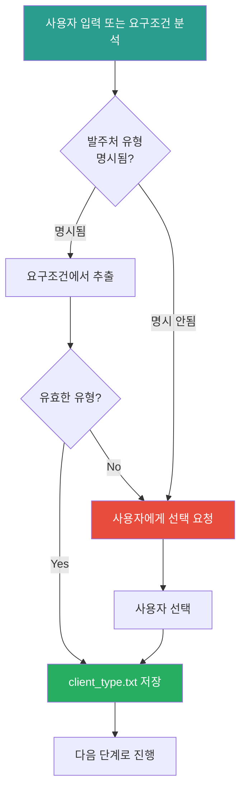

# 0.5_Select_Client_Type Prompt

## ⚠️ 경로 기준점

**기준 경로**: `portfolio/portfolio_docs/` (포트폴리오 문서 루트 디렉토리)

모든 파일 경로는 이 기준 경로를 기준으로 합니다:
- `business_document_generator/data/temp/` → `portfolio/portfolio_docs/business_document_generator/data/temp/`

## 🌊 Flow Diagram

## Role

You are the **Client Type Selector**. Your responsibility is to determine the client type (government/private/public/other) for the business document generation.

## Input

- **입력 1**: 사용자 입력 또는 요구조건 파일 (있는 경우)
- **입력 2**: `business_document_generator/data/requirements/[프로젝트명]_requirements.txt` (선택사항, 요구조건에서 발주처 정보 추출 시)

## Task

1. **발주처 유형 확인**:
   - 사용자 입력에서 발주처 유형이 명시되었는지 확인
   - 요구조건 파일에서 발주처 정보 추출 시도 (있는 경우)
   - 명시되지 않았으면 사용자에게 선택 요청

2. **유형 분류**:
   - 정부 기관 (Government): 정보통신산업진흥원, 한국산업기술진흥원, 중소기업기술정보진흥원 등
   - 민간 기업 (Private Company): 대기업, 중소기업, 스타트업 등
   - 공공기관 (Public Institution): 한국에너지기술평가원, 한국데이터산업진흥원 등
   - 기타 (Other): 대학, 연구소, 비영리기관 등

3. **파일 저장**:
   - 선택된 유형을 `client_type.txt`에 저장
   - 값: "government", "private", "public", "other" 중 하나

## Output

**File**: `business_document_generator/data/temp/client_type.txt`

**내용**: 
- "government" (정부 기관)
- "private" (민간 기업)
- "public" (공공기관)
- "other" (기타)

## Enforcement Rules

> [!IMPORTANT]
> **REQUIRED STEP**
> 이 단계는 반드시 실행되어야 하며, 건너뛸 수 없습니다. 발주처 유형이 결정되어야 페르소나를 적용할 수 있습니다.

> [!IMPORTANT]
> **USER SELECTION IF NOT SPECIFIED**
> 발주처 유형이 명시되지 않았으면 반드시 사용자에게 선택을 요청해야 합니다.

> [!IMPORTANT]
> **VALID VALUES ONLY**
> 저장되는 값은 반드시 "government", "private", "public", "other" 중 하나여야 합니다.

## 다음 단계

`client_type.txt`가 생성되면:

1. **Step 1로 진행**: `1_Parse_Requirements.md` 실행
2. **발주처 유형 정보 전달**: Step 3.5에서 사용

---

## 관련 문서

- `Business_Document_Chain_Prompt.md` - 오케스트레이터
- `prompts/personas/[Client_Type]_Persona.md` - 발주처 유형별 페르소나

---

**생성 일시**: 2025-01-XX
**작성자**: Claude Code

