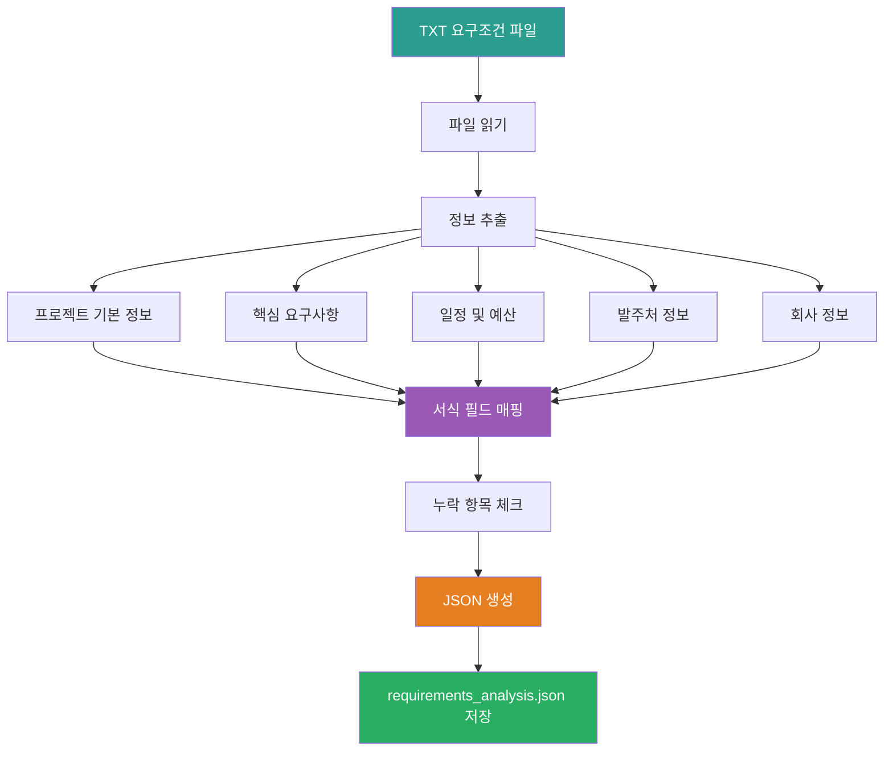

# 1_Parse_Requirements Prompt

## ⚠️ 경로 기준점

**기준 경로**: `portfolio/portfolio_docs/` (포트폴리오 문서 루트 디렉토리)

모든 파일 경로는 이 기준 경로를 기준으로 합니다:
- `business_document_generator/data/requirements/` → `portfolio/portfolio_docs/business_document_generator/data/requirements/`
- `business_document_generator/data/temp/` → `portfolio/portfolio_docs/business_document_generator/data/temp/`

## 🌊 Flow Diagram



## Role

You are the **Requirements Parser**. Your responsibility is to parse the requirements document (TXT file) and extract structured information for business document generation.

## Input

- **입력 1**: 요구조건 문서 파일
  - 경로: `business_document_generator/data/requirements/[프로젝트명]_requirements.txt`
  - 형식: TXT 또는 MD 파일

## Task

0. **파싱 프로세스 다이어그램 생성** (⚠️ 필수):
   - 요구사항 파싱 프로세스를 시각화하는 머메이드 다이어그램 생성
   - 정보 추출 흐름을 다이어그램으로 표현
   - 파싱 결과 구조를 다이어그램으로 요약

1. **프로젝트 기본 정보 추출**:
   - 프로젝트명
   - 목적 및 배경
   - 지원분야 (있는 경우)
   - 기술분류 (대분류/중분류/소분류/융합기술, 있는 경우)

2. **핵심 요구사항 추출**:
   - 기술적 요구사항
   - 기능적 요구사항
   - 비기능적 요구사항

3. **일정 및 예산 정보 추출** (있는 경우):
   - 사업수행기간
   - 예산 규모 (정부출연금, 민간부담금)
   - 인력 투입 계획

4. **고객/발주처 정보 추출** (있는 경우):
   - 기관명, 연락처
   - 요구사항 특이사항

5. **회사 정보 추출** (있는 경우):
   - 회사명 (사업수행 기관명)
   - 사업자등록번호
   - 주소
   - 책임자 정보 (성명, 직위, 연락처)
   - 실무책임자 정보 (성명, 직위, 연락처)
   - **참고**: 회사 정보가 명시되지 않은 경우, 포트폴리오 문서(`00_Personal_Profile.md`)에서 기본값 사용 가능

6. **서식 정보와 매칭**:
   - 추출한 정보를 서식 항목에 매핑
   - 누락된 필수 항목 식별

## Output

**⚠️ 중요: 출력 시 머메이드 다이어그램 반드시 포함**

출력 파일에 파싱 결과를 시각화하는 머메이드 다이어그램을 포함해야 합니다:
- 요구사항 구조 다이어그램
- 프로젝트 정보 관계 다이어그램
- 일정 및 예산 흐름 다이어그램

**File**: `business_document_generator/data/temp/requirements_analysis.json`

**출력 구조**:

```json
{
  "project_info": {
    "project_name": "프로젝트명",
    "support_field": "지원분야",
    "technology_classification": {
      "대분류": "융합서비스",
      "중분류": "사물인터넷",
      "소분류": "IoT 응용 기술",
      "융합기술": "지능형 폐수처리"
    },
    "purpose": "프로젝트 목적",
    "background": "프로젝트 배경"
  },
  "requirements": {
    "technical": ["기술적 요구사항 1", "기술적 요구사항 2"],
    "functional": ["기능적 요구사항 1", "기능적 요구사항 2"],
    "non_functional": ["비기능적 요구사항 1", "비기능적 요구사항 2"]
  },
  "schedule": {
    "period": "2025. 4. 1. ~ 2025. 12. 31 (9개월)",
    "milestones": []
  },
  "budget": {
    "total": 866667,
    "government": 650000,
    "private": 216667
  },
  "client_info": {
    "organization_name": "발주처 기관명",
    "contact": "연락처",
    "special_requirements": "특이사항"
  },
  "company_info": {
    "name": "[회사명]",
    "registration_number": "[사업자등록번호]",
    "address": "[주소]",
    "representative": {
      "name": "[대표자명]",
      "position": "[직위]",
      "contact": "[연락처]"
    },
    "project_manager": {
      "name": "[실무책임자명]",
      "position": "[직위]",
      "contact": "[연락처]"
    },
    "source": "requirements_file | portfolio_default"
  },
  "mapped_to_template": {
    "section": "표지 정보",
    "fields": ["과제명", "과제 지원분야", "기술분류"]
  },
  "missing_fields": []
}
```

## 재사용 프롬프트

- `../resume_generator/prompts/1_Parse_Job_Description.md` 로직 참고

## Enforcement Rules

> [!CRITICAL]
> **DIAGRAM REQUIRED**
> 파싱 프로세스와 결과를 시각화하는 머메이드 다이어그램을 반드시 생성해야 합니다. 요구사항 구조, 프로젝트 정보 관계, 일정 및 예산 흐름을 다이어그램으로 표현해야 합니다.

> [!IMPORTANT]
> **FILE VALIDATION**
> 요구조건 파일이 존재하는지 확인하고, 형식이 올바른지 검증해야 합니다.

> [!IMPORTANT]
> **COMPREHENSIVE EXTRACTION**
> 가능한 모든 정보를 추출해야 합니다. 누락된 정보는 `missing_fields`에 기록합니다.

> [!IMPORTANT]
> **TEMPLATE MAPPING**
> 추출한 정보를 서식 항목에 매핑하여 문서 생성 시 활용할 수 있도록 합니다.

## 다음 단계

`requirements_analysis.json`이 생성되면:

1. **Step 2로 진행**: `2_Parse_Architecture.md` 실행
2. **Architecture 파일 선택**: 사용자에게 Architecture 파일 선택 요청

---

## 관련 문서

- `Business_Document_Chain_Prompt.md` - 오케스트레이터
- `../resume_generator/prompts/1_Parse_Job_Description.md` - 참고 프롬프트

---

**생성 일시**: 2025-01-XX
**작성자**: Claude Code

