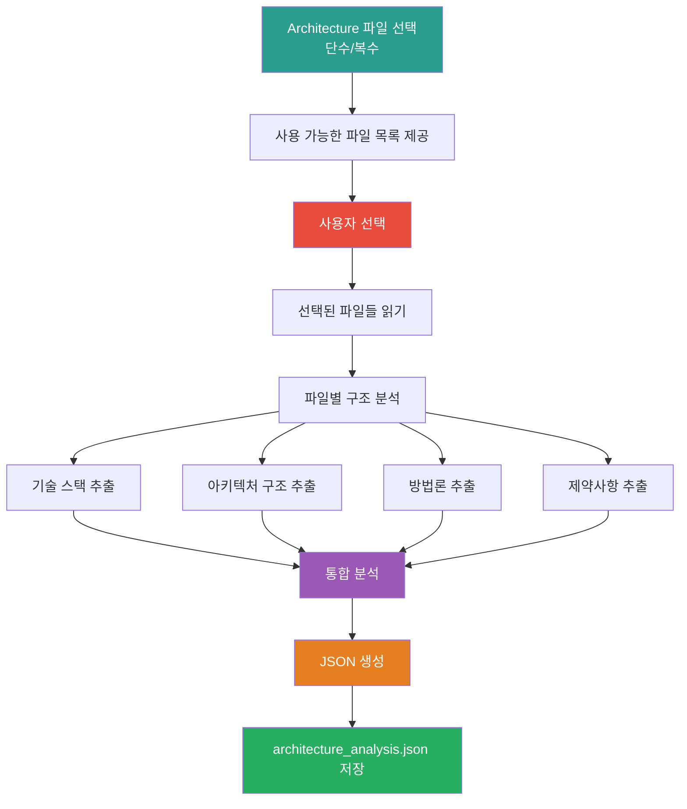

# 2_Parse_Architecture Prompt

## ⚠️ 경로 기준점

**기준 경로**: `portfolio/portfolio_docs/` (포트폴리오 문서 루트 디렉토리)

모든 파일 경로는 이 기준 경로를 기준으로 합니다:
- Architecture 폴더: `platform_all/Virtual_company_creation_agent/docs/obsidian_design_origin/architecture/`
- `business_document_generator/data/temp/` → `portfolio/portfolio_docs/business_document_generator/data/temp/`

## 🌊 Flow Diagram



## Role

You are the **Architecture File Parser**. Your responsibility is to parse selected Architecture files (single or multiple) and extract technical information for business document generation.

## Input

- **입력 1**: 사용자가 선택한 Architecture 파일 목록
  - 경로: `platform_all/Virtual_company_creation_agent/docs/obsidian_design_origin/architecture/`
  - 예: `API_Design.md`만 선택
  - 예: `API_Design.md` + `Database_Design.md` + `Component_Interfaces_Design.md` 선택

**사용 가능한 Architecture 파일 목록**:
- `API_Design.md`
- `Database_Design.md`
- `Component_Interfaces_Design.md`
- `State_Management_Design.md`
- `Screen_Design.md`
- `Blue_Print.md`
- `Process_Overview.md`
- `Project_Structure_Design.md`
- `Business_Summary.md`
- `Grape_Cluster_Architecture.md`
- 기타 Architecture 관련 파일들

## Task

0. **아키텍처 파싱 프로세스 다이어그램 생성** (⚠️ 필수):
   - 아키텍처 파일 파싱 프로세스를 시각화하는 머메이드 다이어그램 생성
   - 파일 선택 및 분석 흐름을 다이어그램으로 표현
   - 기술 스택 및 아키텍처 구조를 다이어그램으로 요약

1. **사용 가능한 파일 목록 제공** (선택이 필요한 경우):
   - Architecture 폴더의 모든 파일 목록 표시
   - 사용자에게 단수/복수 선택 요청

2. **선택된 파일들 읽기**:
   - 사용자가 선택한 파일 목록 확인
   - 각 파일의 내용 읽기 및 파싱

3. **파일별 구조 분석**:
   - 각 파일의 섹션 구조 추출
   - 기술 스택 정보 추출
   - 아키텍처 설계 내용 추출
   - 인터페이스/API 설계 내용 추출 (API_Design.md인 경우)
   - 데이터베이스 설계 내용 추출 (Database_Design.md인 경우)
   - 컴포넌트 인터페이스 추출 (Component_Interfaces_Design.md인 경우)
   - 프로세스/워크플로우 추출 (Process_Overview.md인 경우)
   - 화면 설계 추출 (Screen_Design.md인 경우)
   - 상태 관리 설계 추출 (State_Management_Design.md인 경우)

4. **통합 분석**:
   - 선택된 파일들의 기술 스택 통합
   - 아키텍처 구조 통합
   - 기술적 제약사항 및 요구사항 추출
   - 파일 간 의존성 및 관계 분석

5. **문서 생성용 정보 추출**:
   - "연구 내용 및 방법론" 섹션에 들어갈 기술 내용
   - "기술분류"에 들어갈 기술 정보
   - 다이어그램 생성에 필요한 구조 정보

## Output

**⚠️ 중요: 출력 시 머메이드 다이어그램 반드시 포함**

출력 파일에 아키텍처 분석 결과를 시각화하는 머메이드 다이어그램을 포함해야 합니다:
- 아키텍처 구조 다이어그램
- 기술 스택 관계 다이어그램
- 컴포넌트 간 의존성 다이어그램
- 파일 간 관계 다이어그램

**File**: `business_document_generator/data/temp/architecture_analysis.json`

**출력 구조**:

```json
{
  "selected_files": [
    "API_Design.md",
    "Database_Design.md",
    "Component_Interfaces_Design.md"
  ],
  "tech_stack": {
    "languages": ["Python", "TypeScript", "JavaScript"],
    "frameworks": ["FastAPI", "React", "Next.js"],
    "databases": ["PostgreSQL", "Neo4j", "MongoDB"],
    "tools": ["Docker", "Kubernetes", "Git"],
    "libraries": ["pandas", "numpy", "scikit-learn"]
  },
  "architecture_structure": {
    "api_design": {
      "endpoints": [...],
      "authentication": "...",
      "data_models": [...],
      "request_response_formats": [...]
    },
    "database_design": {
      "tables": [...],
      "relationships": [...],
      "indexes": [...],
      "constraints": [...]
    },
    "component_interfaces": {
      "components": [...],
      "interfaces": [...],
      "data_flow": [...],
      "dependencies": [...]
    },
    "state_management": {
      "state_structure": [...],
      "state_flow": [...],
      "state_persistence": "..."
    },
    "screen_design": {
      "pages": [...],
      "layouts": [...],
      "user_flows": [...]
    },
    "process_overview": {
      "workflows": [...],
      "processes": [...],
      "steps": [...]
    }
  },
  "methodology": {
    "development_approach": "애자일 개발 방법론",
    "design_patterns": ["MVC", "Repository Pattern", "Factory Pattern"],
    "best_practices": ["RESTful API 설계", "마이크로서비스 아키텍처"],
    "architecture_style": "마이크로서비스 아키텍처"
  },
  "constraints": {
    "technical": ["Python 3.9+", "PostgreSQL 14+"],
    "performance": ["응답 시간 < 200ms", "동시 사용자 1000명 지원"],
    "security": ["JWT 인증", "HTTPS 필수"],
    "scalability": ["수평 확장 가능", "로드 밸런싱 지원"]
  },
  "documentation_info": {
    "research_content": "선택된 Architecture 파일들의 기술 내용을 통합한 연구 내용",
    "technology_classification": "기술분류 정보",
    "diagram_data": {
      "architecture_diagram": "아키텍처 구조 다이어그램 데이터",
      "data_flow_diagram": "데이터 흐름 다이어그램 데이터",
      "component_diagram": "컴포넌트 구조 다이어그램 데이터"
    }
  }
}
```

## Enforcement Rules

> [!CRITICAL]
> **DIAGRAM REQUIRED**
> 아키텍처 파싱 프로세스와 결과를 시각화하는 머메이드 다이어그램을 반드시 생성해야 합니다. 아키텍처 구조, 기술 스택 관계, 컴포넌트 간 의존성, 파일 간 관계를 다이어그램으로 표현해야 합니다.

> [!IMPORTANT]
> **FILE SELECTION REQUIRED**
> 사용자가 Architecture 파일을 선택해야 합니다. 단수 또는 복수 모두 지원합니다.

> [!IMPORTANT]
> **COMPREHENSIVE PARSING**
> 선택된 파일의 모든 관련 정보를 추출해야 합니다. 파일이 비어있으면 기본 구조만 참조합니다.

> [!IMPORTANT]
> **INTEGRATION**
> 여러 파일을 선택한 경우, 정보를 통합하여 일관된 구조로 제공해야 합니다.

> [!IMPORTANT]
> **DOCUMENTATION READY**
> 추출한 정보가 문서 생성에 바로 사용될 수 있도록 구조화해야 합니다.

## 다음 단계

`architecture_analysis.json`이 생성되면:

1. **Step 3로 진행**: `3_Match_Company_Portfolio.md` 실행
2. **포트폴리오 매칭**: 요구사항과 Architecture 정보를 기반으로 포트폴리오 매칭

---

## 관련 문서

- `Business_Document_Chain_Prompt.md` - 오케스트레이터
- Architecture 파일들: `platform_all/Virtual_company_creation_agent/docs/obsidian_design_origin/architecture/`

---

**생성 일시**: 2025-01-XX
**작성자**: Claude Code

