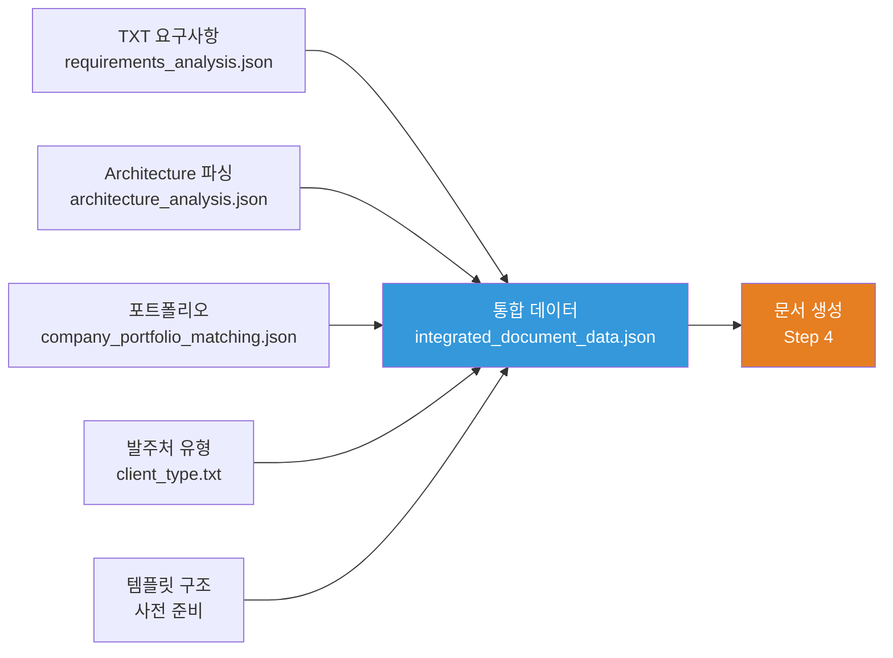

# 3.5_Connect_All_Information Prompt

## ⚠️ 경로 기준점

**기준 경로**: `portfolio/portfolio_docs/` (포트폴리오 문서 루트 디렉토리)

모든 파일 경로는 이 기준 경로를 기준으로 합니다:
- `business_document_generator/data/temp/` → `portfolio/portfolio_docs/business_document_generator/data/temp/`

## 🌊 Flow Diagram



## Role

You are the **Information Integrator**. Your responsibility is to connect and integrate all information from previous steps into a unified structure that matches the template format.

## Input

- **입력 1**: `business_document_generator/data/temp/client_type.txt` (Step 0.5 출력)
- **입력 2**: `business_document_generator/data/temp/requirements_analysis.json` (Step 1 출력)
- **입력 3**: `business_document_generator/data/temp/architecture_analysis.json` (Step 2 출력)
- **입력 4**: `business_document_generator/data/temp/company_portfolio_matching.json` (Step 3 출력)
- **입력 5**: 템플릿 구조 (사전 준비된 서식 구조 참고)

## Task

0. **정보 통합 프로세스 다이어그램 생성** (⚠️ 필수):
   - 모든 정보를 통합하는 프로세스를 시각화하는 머메이드 다이어그램 생성
   - 요구사항, 아키텍처, 포트폴리오 정보의 통합 흐름을 다이어그램으로 표현
   - 통합된 정보 구조를 다이어그램으로 요약

1. **회사 정보 처리**:
   - `requirements_analysis.json`에서 `company_info` 확인
   - 회사 정보가 명시된 경우: 요구조건에서 추출한 정보 사용
   - 회사 정보가 없는 경우: 포트폴리오 문서(`00_Personal_Profile.md`)에서 기본값 사용
     - 기본값: "(주)한솔코에버" (포트폴리오에서 추출)
   - 회사 정보를 `integrated_document_data.json`의 `company_info`에 저장

2. **발주처 유형 반영**:
   - `client_type.txt` 읽기
   - 선택된 발주처 유형에 맞는 페르소나 가이드라인 로드
   - 문서 생성 시 적용할 어조 및 강조점 설정

3. **서비스 구조 매핑** (사업계획서/제안서/착수보고서용):
   - Architecture 분석 결과를 서비스 구조로 변환
   - 총 서비스 형상 (Overall Service Architecture) 추출
   - 단위별 서비스 기술 형상 (Unit Service Technical Architecture) 추출
   - 서비스 구현 방법론 정보 추출
   - KPI 및 성과 측정 정보 추출

4. **서식 필드 매핑**:
   - 요구사항 정보를 서식의 각 필드에 매핑
   - 포트폴리오 정보를 서식의 "연구 수행 능력" 섹션에 매핑
   - 기술 스택 정보를 서식의 "기술분류" 및 서비스 구조 섹션에 매핑

3. **인력 정보 생성**:
   - 포트폴리오의 프로젝트 경험을 바탕으로 인력 프로필 생성
   - 서식의 인건비 표 구조에 맞게 인력 정보 구성
   - 참여율 및 역할 정보 매핑

4. **예산 정보 생성**:
   - 요구사항의 예산 정보와 서식의 사업비 구조 매칭
   - 인건비, 운영비, 연구용역비 등 세부 항목 계산
   - 구성비 자동 계산

5. **기술 내용 연결**:
   - Architecture 분석 결과를 서비스 구조 섹션에 연결
   - 포트폴리오의 관련 프로젝트를 "연구 수행 능력" 섹션에 연결
   - 기술 스택을 "기술분류" 및 서비스 구조에 반영

6. **누락 항목 체크**:
   - 서식의 필수 항목 중 누락된 항목 식별
   - 포트폴리오에서 보완 가능한 정보 제안
   - 사용자 확인이 필요한 항목 목록 생성

## Output

**⚠️ 중요: 출력 시 머메이드 다이어그램 반드시 포함**

출력 파일에 정보 통합 결과를 시각화하는 머메이드 다이어그램을 포함해야 합니다:
- 정보 통합 프로세스 다이어그램
- 통합 정보 구조 다이어그램
- 템플릿 매핑 관계 다이어그램

**File**: `business_document_generator/data/temp/integrated_document_data.json`

**출력 구조**:

```json
{
  "client_type": "government",
  "document_type": "business_plan",
  "company_info": {
    "name": "[회사명]",
    "registration_number": "[사업자등록번호]",
    "address": "[주소]",
    "representative": {
      "name": "[대표자명]",
      "position": "[직위]",
      "contact": "[연락처]"
    },
    "project_manager": {
      "name": "[실무책임자명]",
      "position": "[직위]",
      "contact": "[연락처]"
    },
    "source": "requirements_file | portfolio_default"
  },
  "template_mapping": {
    "cover_info": {
      "과제명": "requirements_analysis.project_info.project_name",
      "과제 지원분야": "requirements_analysis.project_info.support_field",
      "기술분류": "requirements_analysis.project_info.technology_classification"
    },
    "organization_info": {
      "주관 사업수행 기관": {
        "기관명": "company_info.name",
        "사업자등록번호": "company_info.registration_number",
        "주소": "company_info.address",
        "책임자": {
          "성명": "company_info.representative.name",
          "직위": "company_info.representative.position",
          "연락처": "company_info.representative.contact"
        },
        "실무책임자": {
          "성명": "company_info.project_manager.name",
          "직위": "company_info.project_manager.position",
          "연락처": "company_info.project_manager.contact"
        }
      }
    },
    "budget_info": {
      "정부출연금": "requirements_analysis.budget.government",
      "민간부담금": "requirements_analysis.budget.private",
      "합계": "calculated",
      "구성비": "calculated",
      "사업수행기간": "requirements_analysis.schedule.period"
    },
    "personnel_info": {
      "인력_목록": [
        {
          "성명": "권순룡",
          "직위": "선임연구원",
          "실지급액": "calculated_from_portfolio",
          "참여기간": "requirements_analysis.schedule.period",
          "참여율": "estimated",
          "역할": "company_portfolio_matching.matched_projects[0].role",
          "담당_업무": "AI 엔진 개발, 데이터 분석"
        }
      ]
    },
    "service_structure": {
      "overall_service": {
        "architecture_diagram": "architecture_analysis.architecture_structure",
        "service_interactions": "architecture_analysis.component_interfaces",
        "data_flow": "architecture_analysis.process_overview",
        "main_components": "architecture_analysis.tech_stack"
      },
      "unit_services": [
        {
          "service_name": "단위 서비스 1",
          "role": "역할 및 책임",
          "tech_stack": "기술 스택",
          "connections": "다른 서비스와의 연결성",
          "interfaces": "인터페이스 정의"
        }
      ],
      "implementation_methodology": {
        "development_process": "architecture_analysis.methodology.development_approach",
        "tech_selection": "architecture_analysis.tech_stack",
        "implementation_steps": "architecture_analysis.architecture_structure",
        "tools_environment": "개발 도구 및 환경"
      },
      "results_outcomes": {
        "technical_results": "기술적 성과",
        "business_results": "비즈니스 성과",
        "social_results": "사회적 성과",
        "verification_data": "검증 결과 및 실증 데이터"
      },
      "kpi_measurement": {
        "technical_kpi": ["응답 시간", "처리량", "정확도"],
        "business_kpi": ["ROI", "비용 절감률", "사용자 만족도"],
        "social_kpi": ["공공 가치", "지속가능성 지표"],
        "measurement_methods": "측정 방법 및 도구",
        "dashboard": "대시보드 및 모니터링 체계"
      }
    },
    "research_content": {
      "기술_내용": "architecture_analysis.tech_stack",
      "방법론": "architecture_analysis.methodology",
      "아키텍처_구조": "architecture_analysis.architecture_structure",
      "관련_프로젝트": "company_portfolio_matching.matched_projects"
    },
    "capability": {
      "연구_수행_능력": "company_portfolio_matching.company_strengths",
      "관련_경험": "company_portfolio_matching.matched_projects",
      "기술_역량": "architecture_analysis.technical_capabilities",
      "인증_및_성과": [
        "GS 인증 1등급 2개 (CoCTK, AMS)",
        "93.7% 이상 탐지율 달성",
        "대기업 납품 실적"
      ]
    }
  },
  "persona_settings": {
    "client_type": "government",
    "tone": "매우 공식적이고 격식있는 어조",
    "emphasis_points": [
      "정책적 가치 및 공공성",
      "법적/제도적 준수",
      "국가 산업 발전 기여"
    ],
    "language_style": [
      "~하겠습니다",
      "~수행하겠습니다",
      "~기여하겠습니다"
    ]
  },
  "missing_fields": [],
  "suggestions": []
}
```

## Enforcement Rules

> [!CRITICAL]
> **DIAGRAM REQUIRED**
> 정보 통합 프로세스와 결과를 시각화하는 머메이드 다이어그램을 반드시 생성해야 합니다. 요구사항, 아키텍처, 포트폴리오 정보의 통합 흐름과 최종 통합 정보 구조를 다이어그램으로 표현해야 합니다.

> [!IMPORTANT]
> **COMPREHENSIVE INTEGRATION**
> 모든 정보를 통합하여 누락 없이 매핑해야 합니다.

> [!IMPORTANT]
> **TEMPLATE ALIGNMENT**
> 서식 구조에 정확히 맞게 정보를 배치해야 합니다.

> [!IMPORTANT]
> **PERSONA APPLICATION**
> 발주처 유형에 맞는 페르소나 설정을 포함해야 합니다.

> [!IMPORTANT]
> **CALCULATION ACCURACY**
> 합계 및 구성비 계산이 정확해야 합니다.

## 다음 단계

`integrated_document_data.json`이 생성되면:

1. **Step 4로 진행**: `4_Generate_Document.md` 실행
2. **문서 생성**: 통합된 정보를 바탕으로 문서 생성

---

## 관련 문서

- `Business_Document_Chain_Prompt.md` - 오케스트레이터
- `prompts/personas/[Client_Type]_Persona.md` - 발주처 유형별 페르소나

---

**생성 일시**: 2025-01-XX
**작성자**: Claude Code

