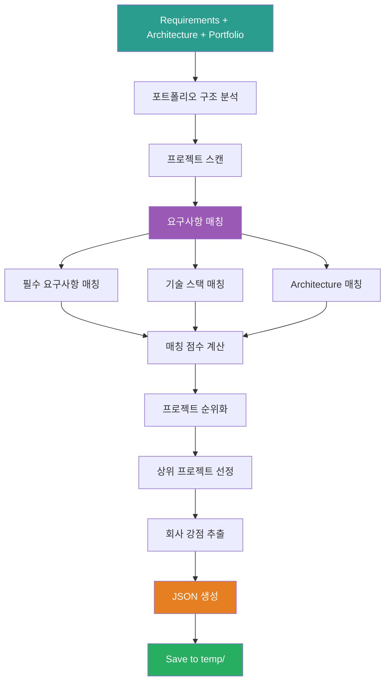

# 3_Match_Company_Portfolio Prompt

## ⚠️ 경로 기준점

**기준 경로**: `portfolio/portfolio_docs/` (포트폴리오 문서 루트 디렉토리)

모든 파일 경로는 이 기준 경로를 기준으로 합니다:
- `business_document_generator/data/temp/` → `portfolio/portfolio_docs/business_document_generator/data/temp/`
- `00_Personal_Profile.md` → `portfolio/portfolio_docs/00_Personal_Profile.md`

## 🌊 Flow Diagram



## Role

You are the **Company Portfolio Matcher**. Your responsibility is to analyze the company portfolio and identify projects, skills, and experiences that match the requirements and architecture information.

## Input

- **입력 1**: `business_document_generator/data/temp/requirements_analysis.json` (Step 1 출력)
- **입력 2**: `business_document_generator/data/temp/architecture_analysis.json` (Step 2 출력)
- **입력 3**: `00_Personal_Profile.md` (회사 대표자 관점으로 재해석)
- **입력 4**: `02_Projects_Overview.md` (회사 프로젝트 포트폴리오)
- **입력 5**: `Architecture_Overview.md` (회사 기술 역량)
- **입력 6**: `04_Academic_Publications.md` (회사 연구 역량)

## Task

0. **포트폴리오 매칭 프로세스 다이어그램 생성** (⚠️ 필수):
   - 포트폴리오 매칭 프로세스를 시각화하는 머메이드 다이어그램 생성
   - 요구사항-포트폴리오 매칭 흐름을 다이어그램으로 표현
   - 매칭 점수 계산 및 순위화 과정을 다이어그램으로 요약

1. **포트폴리오 구조 분석** (기존 프롬프트 재사용)
   - Call `../prompts/chain/1_Analyze_Portfolio_Structure.md`
   - 모든 프로젝트 및 문서 스캔

2. **요구사항 매칭**:
   - 필수 요구사항 vs. 프로젝트 경험 매칭
   - 기술 스택 vs. 사용 기술 매칭
   - Architecture 정보 vs. 포트폴리오 기술 역량 매칭

3. **매칭 점수 계산**:
   - 각 프로젝트별 relevance_score 계산 (0-100)
   - 필수 요구사항 매칭 점수
   - 기술 스택 매칭 점수
   - Architecture 매칭 점수
   - 종합 매칭 점수 계산

4. **프로젝트 순위화**:
   - relevance_score 기준 정렬
   - 상위 6-8개 프로젝트 선정

5. **회사 강점 추출**:
   - 기술 역량 강점
   - 프로젝트 경험 강점
   - 성과 및 인증 강점
   - 연구 역량 강점

6. **문서 생성용 정보 추출**:
   - "연구 수행 능력" 섹션에 들어갈 경험
   - "관련 프로젝트" 섹션에 들어갈 프로젝트
   - "기술 역량" 섹션에 들어갈 기술

## 재사용 프롬프트

### 1. Portfolio Structure Analysis

**프롬프트**: `../prompts/chain/1_Analyze_Portfolio_Structure.md`

**호출 방법**:
```
입력으로 requirements_analysis.json과 architecture_analysis.json 제공
포트폴리오 전체 구조 스캔
모든 프로젝트 ID 및 메타데이터 수집
```

**출력**: 포트폴리오 구조 정보 (메모리에 저장, 파일 저장 불필요)

### 2. Document Content Analysis

**프롬프트**: `../prompts/chain/2_Analyze_Document_Content.md`

**호출 방법**:
```
각 프로젝트 문서 상세 내용 분석
requirements와 architecture 키워드로 검색
관련 섹션 추출
```

**출력**: 프로젝트별 관련 내용 (메모리에 저장)

## Enforcement Rules

> [!CRITICAL]
> **DIAGRAM REQUIRED**
> 포트폴리오 매칭 프로세스와 결과를 시각화하는 머메이드 다이어그램을 반드시 생성해야 합니다. 매칭 프로세스 흐름, 매칭 점수 분포, 상위 프로젝트 관계를 다이어그램으로 표현해야 합니다.

> [!IMPORTANT]
> **COMPREHENSIVE MATCHING**
> 모든 프로젝트를 스캔하고 매칭해야 합니다. 누락된 프로젝트가 없어야 합니다.

> [!IMPORTANT]
> **SCORING ACCURACY**
> 매칭 점수는 객관적이고 일관된 기준으로 계산해야 합니다.

> [!IMPORTANT]
> **EVIDENCE-BASED**
> 모든 매칭 결과는 실제 프로젝트 내용에 기반해야 합니다. 추측 금지.

> [!IMPORTANT]
> **COMPANY PERSPECTIVE**
> 개인 관점이 아닌 회사 관점으로 재해석해야 합니다.

## Output Schema

**⚠️ 중요: 출력 시 머메이드 다이어그램 반드시 포함**

출력 파일에 포트폴리오 매칭 결과를 시각화하는 머메이드 다이어그램을 포함해야 합니다:
- 매칭 프로세스 흐름 다이어그램
- 매칭 점수 분포 다이어그램
- 상위 프로젝트 관계 다이어그램

**File**: `business_document_generator/data/temp/company_portfolio_matching.json`

```json
{
  "metadata": {
    "project_name": "프로젝트명",
    "matched_at": "2025-01-XX",
    "total_projects_scanned": 20,
    "matching_criteria": {
      "requirements_weight": 0.4,
      "tech_stack_weight": 0.3,
      "architecture_weight": 0.3
    }
  },
  "matching_summary": {
    "overall_score": 85,
    "requirements_match_score": 90,
    "tech_stack_match_score": 80,
    "architecture_match_score": 85,
    "gap_analysis": {
      "missing_requirements": [],
      "missing_tech_stack": [],
      "suggestions": []
    }
  },
  "matched_projects": [
    {
      "project_id": "project.ams",
      "project_name": "AMS (Analysis Management System)",
      "relevance_score": 95,
      "match_reasons": [
        "시계열 데이터 분석 경험",
        "AI 엔진 개발 경험",
        "GS 인증 1등급 취득"
      ],
      "key_achievements": [
        "93.7% 이상 탐지율 달성",
        "세아특수강/포미아 정식 납품",
        "특허 등록"
      ],
      "tech_stack_match": {
        "matched_tech": ["Python", "시계열 분석", "베이지안 네트워크"],
        "match_score": 90
      },
      "role": "AI 종합 플랫폼 개발 총괄 PM",
      "period": "2024.07~2025.03",
      "client": "한국산업기술진흥원"
    }
  ],
  "company_strengths": {
    "technical_capabilities": [
      "5년간의 제조업 데이터 분석 경험",
      "시계열 데이터 처리 전문성",
      "AI/ML 엔진 개발 역량"
    ],
    "project_experience": [
      "20개 이상 프로젝트 수행",
      "GS 인증 1등급 2개 (CoCTK, AMS)",
      "대기업 납품 실적 (세아특수강, 포미아, 일본 글로벌 기업)"
    ],
    "achievements": [
      "9편 논문 발표",
      "특허 출원/등록",
      "93.7% 이상 탐지율 달성"
    ],
    "research_capabilities": [
      "학술 연구 경험",
      "논문 발표 실적",
      "기술 개발 및 검증 경험"
    ]
  },
  "document_generation_info": {
    "research_capability_section": {
      "projects": ["project.ams", "project.coctk", "project.dps"],
      "key_points": [
        "GS 인증 1등급 2개 취득",
        "대기업 납품 실적",
        "5년간의 제조업 데이터 분석 경험"
      ]
    },
    "related_projects_section": {
      "projects": [
        {
          "project_id": "project.ams",
          "relevance": "매우 높음",
          "highlight_points": ["93.7% 이상 탐지율", "GS 인증 1등급", "정식 납품"]
        }
      ]
    },
    "technical_capabilities_section": {
      "technologies": ["시계열 데이터 분석", "AI 엔진 개발", "데이터 전처리"],
      "certifications": ["GS 인증 1등급 2개"],
      "patents": ["피쉬본 관리 시스템"]
    }
  }
}
```

## 다음 단계

`company_portfolio_matching.json`이 생성되면:

1. **Step 3.5로 진행**: `3.5_Connect_All_Information.md` 실행
2. **정보 통합**: 모든 정보를 서식 구조에 맞게 통합

---

## 관련 문서

- `Business_Document_Chain_Prompt.md` - 오케스트레이터
- `../prompts/chain/1_Analyze_Portfolio_Structure.md` - 포트폴리오 구조 분석
- `../prompts/chain/2_Analyze_Document_Content.md` - 문서 내용 분석
- `../resume_generator/prompts/2_Match_Portfolio_To_Job.md` - 참고 프롬프트

---

**생성 일시**: 2025-01-XX
**작성자**: Claude Code

