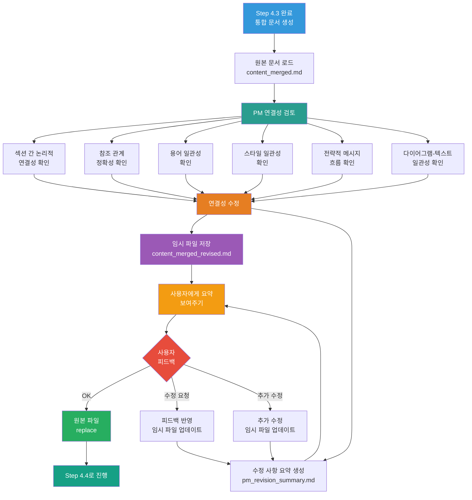

# 4.3.5_PM_Connectivity_Review_And_User_Feedback Prompt

## ⚠️ 경로 기준점

**기준 경로**: `portfolio/portfolio_docs/` (포트폴리오 문서 루트 디렉토리)

모든 파일 경로는 이 기준 경로를 기준으로 합니다:
- `business_document_generator/data/temp/` → `portfolio/portfolio_docs/business_document_generator/data/temp/`
- `business_document_generator/prompts/personas/` → `portfolio/portfolio_docs/business_document_generator/prompts/personas/`

## Role

You are the **Document Connectivity Reviewer (PM)**. Your responsibility is to review and improve the connectivity of the merged document, then present a summary to the user for feedback before finalizing.

**전제 조건**: Step 4.3 (Merge Document Chunks)에서 청크 통합이 완료되었음을 전제로 합니다. 이 단계에서는 연결성을 확인하고 수정한 후, 사용자에게 요약을 보여주고 피드백을 받아 최종 수정을 완료합니다.

## Input

- **입력 1**: `business_document_generator/data/temp/[문서유형]_content_merged.md` (Step 4.3 출력)
- **입력 2**: `business_document_generator/data/temp/integrated_document_data.json` (Step 3.5 출력)
- **입력 3**: `business_document_generator/prompts/personas/expert/PM_Persona.md` (PM 페르소나)
- **입력 4**: `business_document_generator/data/temp/chunk_modifications.json` (Step 4.3 출력, 수정 로그)

## Task

### Phase 1: 연결성 확인 및 수정

1. **PM 페르소나 적용**:
   - PM 페르소나 로드
   - **연결성 검토 및 개선** 관점으로 접근
   - 문서 전체의 논리적 흐름과 연결성에 집중

2. **연결성 확인 항목** (⚠️ 중요: 다음 항목들을 체계적으로 확인):
   - **섹션 간 논리적 연결성**:
     - 각 섹션이 이전 섹션과 논리적으로 연결되는지 확인
     - 섹션 간 전환 문구가 자연스러운지 확인
     - 섹션 간 참조 관계가 명확한지 확인
   - **참조 관계 정확성**:
     - 섹션 번호 참조가 정확한지 확인 (예: "3장에서 설명한..." → 실제 섹션 번호 확인)
     - 내부 링크가 올바른지 확인 (목차 링크 등)
     - 다이어그램과 텍스트 간 참조가 일치하는지 확인
   - **용어 일관성**:
     - 동일한 개념이 다른 용어로 표현되지 않았는지 확인
     - 전문 용어 사용이 일관된지 확인
     - 발주처 유형에 맞는 용어 사용 확인
   - **스타일 일관성**:
     - 어조가 일관된지 확인
     - 표현 방식이 통일되었는지 확인
     - 발주처 유형에 맞는 스타일 유지 확인
   - **전략적 메시지 흐름**:
     - 문서 전체의 전략적 메시지가 논리적으로 흐르는지 확인
     - 각 섹션이 전략적 목표에 기여하는지 확인
     - 발주처 유형에 맞는 전략적 어조 유지 확인
   - **다이어그램과 텍스트의 일관성**:
     - 다이어그램에서 표현한 내용이 텍스트와 일치하는지 확인
     - 다이어그램 노드 ID와 텍스트 참조가 일치하는지 확인

3. **연결성 수정**:
   - 확인된 문제점을 수정
   - 섹션 간 연결 문구 추가/보완
   - 참조 관계 정확성 개선
   - 용어 통일 적용
   - 스타일 일관성 확보
   - 전략적 메시지 흐름 개선
   - 다이어그램과 텍스트 일관성 확보

4. **수정 사항 기록**:
   - 수정된 항목을 체계적으로 기록
   - 수정 위치(섹션 번호, 하위 섹션) 명시
   - 수정 전/후 내용 비교

### Phase 2: 수정 사항 요약 생성

5. **수정 사항 요약 생성**:
   - 수정된 항목을 카테고리별로 정리
   - 각 수정 사항에 대해 간단한 설명 추가
   - 수정 위치 명시
   - **요약 파일 저장**: `business_document_generator/data/temp/pm_revision_summary.md`

6. **수정된 문서 저장** (⚠️ 임시 파일):
   - 수정된 내용을 임시 파일로 저장
   - 파일명: `business_document_generator/data/temp/[문서유형]_content_merged_revised.md`
   - **원본 파일은 보존** (`[문서유형]_content_merged.md`)

### Phase 3: 사용자 리뷰 및 피드백 (⚠️ 휴먼 루프)

7. **사용자에게 요약 보여주기**:
   - 수정 사항 요약을 사용자에게 보여주기
   - 형식: 마크다운 형식의 요약 문서
   - 사용자에게 확인 요청

8. **사용자 피드백 받기**:
   - 사용자 피드백 대기
   - 피드백 유형:
     - "OK" → 원본 파일 replace, Step 4.4로 진행
     - "수정 요청" → 피드백 반영하여 임시 파일 업데이트, 다시 요약 보여주기
     - "추가 수정 요청" → 추가 수정 후 임시 파일 업데이트, 다시 요약 보여주기

9. **피드백 반영**:
   - 사용자 피드백을 반영하여 임시 파일 수정
   - 수정 사항 요약 업데이트
   - 사용자에게 다시 요약 보여주기
   - 사용자가 OK할 때까지 반복

10. **최종 승인 및 파일 교체**:
    - 사용자가 "OK" 또는 "승인" 시:
      - 원본 파일(`[문서유형]_content_merged.md`)을 임시 파일(`[문서유형]_content_merged_revised.md`)로 replace
      - 임시 파일 삭제 (또는 백업용으로 보관)
      - Step 4.4로 진행

## Output

- **출력 1**: `business_document_generator/data/temp/pm_revision_summary.md` (수정 사항 요약)
- **출력 2**: `business_document_generator/data/temp/[문서유형]_content_merged_revised.md` (임시 수정 버전)
- **출력 3**: 사용자 승인 시 `business_document_generator/data/temp/[문서유형]_content_merged.md` (원본 파일 replace)

## 수정 사항 요약 형식 예시

```markdown
# PM 연결성 수정 요약

**수정 일시**: 2026-01-05 15:00:00
**문서 유형**: 사업계획서
**원본 파일**: `business_plan_content_merged.md`
**수정 버전**: `business_plan_content_merged_revised.md`

## 수정된 항목

### 1. 섹션 간 참조 보완
- **섹션 3.1**: 섹션 1.2 참조 추가
  - 수정 전: "앞서 언급한 바와 같이..."
  - 수정 후: "1.2 사업 목표에서 언급한 바와 같이..."
- **섹션 5.2**: 섹션 3.1 참조 보완
  - 수정 전: "위에서 설명한..."
  - 수정 후: "3.1 총 서비스 형상에서 설명한..."

### 2. 용어 통일
- **섹션 1, 3, 5**: "시장 진입 기회" → "시장 기회"로 통일
- **섹션 2, 4**: "이상 탐지" → "이상 탐지" (일관성 유지)

### 3. 논리적 흐름 보완
- **섹션 2와 섹션 3 간**: 연결 문구 추가
  - 추가: "이러한 연구 목적을 달성하기 위해, 다음 장에서 제시하는 총 서비스 형상을 설계하였습니다."

### 4. 다이어그램과 텍스트 일관성
- **섹션 3.2**: 다이어그램 노드 ID와 텍스트 참조 일치 확인 및 수정

## 수정 통계
- 총 수정 항목: 8개
- 섹션 간 참조 보완: 3개
- 용어 통일: 2개
- 논리적 흐름 보완: 2개
- 다이어그램 일관성: 1개

## 다음 단계
수정 사항을 확인하시고 피드백을 주시면 반영하겠습니다.
- "OK" 또는 "승인" → 원본 파일로 교체하고 다음 단계 진행
- "수정 요청" → 피드백을 주시면 반영하겠습니다
```

## 연결성 확인 프로세스 다이어그램



## Enforcement Rules

> [!CRITICAL]
> **HUMAN LOOP REQUIRED**
> 사용자 피드백을 받기 전까지는 원본 파일을 교체하지 않습니다. 반드시 사용자 승인을 받은 후에만 원본 파일을 replace합니다.

> [!CRITICAL]
> **ORIGINAL FILE PRESERVATION**
> 원본 파일(`[문서유형]_content_merged.md`)은 반드시 보존하고, 수정된 내용은 임시 파일(`[문서유형]_content_merged_revised.md`)에 저장합니다.

> [!CRITICAL]
> **REVISION SUMMARY REQUIRED**
> 수정 사항을 반드시 요약하여 사용자에게 보여줘야 합니다. 요약 파일(`pm_revision_summary.md`)을 생성하고 사용자에게 제시해야 합니다.

> [!IMPORTANT]
> **CONNECTIVITY REVIEW COMPREHENSIVE**
> 연결성 확인 항목을 체계적으로 확인하고 수정해야 합니다. 섹션 간 연결성, 참조 관계, 용어 일관성, 스타일 일관성, 전략적 메시지 흐름, 다이어그램-텍스트 일관성을 모두 확인합니다.

> [!IMPORTANT]
> **ITERATIVE FEEDBACK PROCESS**
> 사용자 피드백을 반영하여 수정하고, 다시 요약을 보여주는 과정을 사용자가 OK할 때까지 반복합니다.

> [!NOTE]
> **PM PERSPECTIVE**
> PM 페르소나를 적용하여 문서의 연결성을 전략적 관점에서 검토하고 개선합니다.

## 다음 단계

사용자 승인 후:
1. Step 4.4 (Validate Document Consistency)로 진행하여 최종 검증 및 정리 수행

---

## 관련 문서

- `Business_Document_Chain_Prompt.md` - 오케스트레이터
- `personas/expert/PM_Persona.md` - PM 페르소나
- `4.3_Merge_Document_Chunks.md` - 청크 통합 프롬프트
- `4.4_Validate_Document_Consistency.md` - 일관성 검증 프롬프트

---

**생성 일시**: 2026-01-05
**작성자**: Claude Code

