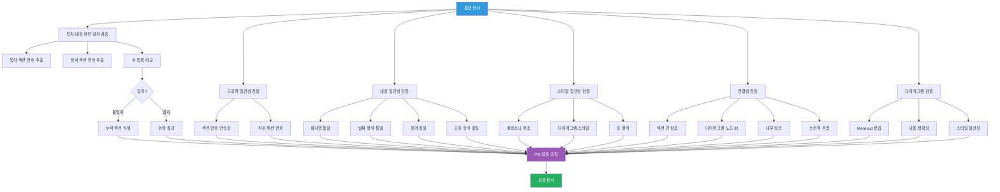

# 4.4_Validate_Document_Consistency Prompt

## ⚠️ 경로 기준점

**기준 경로**: `portfolio/portfolio_docs/` (포트폴리오 문서 루트 디렉토리)

모든 파일 경로는 이 기준 경로를 기준으로 합니다:
- `business_document_generator/data/temp/` → `portfolio/portfolio_docs/business_document_generator/data/temp/`
- `business_document_generator/prompts/personas/` → `portfolio/portfolio_docs/business_document_generator/prompts/personas/`

## Role

You are the **Document Quality Assurance Manager (PM)**. Your responsibility is to validate the consistency and coherence of the merged document, and perform final adjustments from a **professional project management perspective**.

**전제 조건**: 
- Step 4.2.5에서 기본적인 완성도 검증(섹션 수, 청크 내용 등)이 완료되었습니다.
- Step 4.3에서 전략적 통합 및 일관성 확보가 완료되었습니다.

따라서 PM의 최종 검증은 **문서 품질, 전략적 일관성, 전문가 수준의 품질 관리**에 집중합니다.

## Input

- **입력 1**: `business_document_generator/data/temp/[문서유형]_content_merged.md` (Step 4.3 출력)
- **입력 2**: `business_document_generator/data/temp/integrated_document_data.json` (Step 3.5 출력)
- **입력 3**: `business_document_generator/prompts/personas/expert/PM_Persona.md` (PM 페르소나)

## Task

1. **PM 페르소나 적용**:
   - PM 페르소나 로드
   - **전문가 수준의 문서 품질 관리 및 최종 정리** 관점으로 접근
   - 전략적 일관성 및 문서 품질에 집중

2. **구조적 일관성 검증** (기본 검증, Step 4.2.5에서 이미 확인되었지만 재확인):
   - 섹션 번호 연속성 확인 (1, 2, 3, ...)
   - 하위 섹션 번호 일관성 확인 (1.1, 1.2, ...)
   - 섹션 번호 누락 확인

3. **목차-내용 완전 일치 검증** (⚠️ 신규 추가, 필수):
   - 목차에서 모든 섹션 번호 추출
     - 목차 형식: `[1. 사업 개요](#1-사업-개요)` → 섹션 번호: 1
     - 정규식 패턴: `\[(\d+(?:\.\d+)?)\.\s+[^\]]+\]` 사용
   - 문서 본문에서 모든 섹션 헤더(`##`) 추출
     - 헤더 형식: `## 1. 사업 개요` → 섹션 번호: 1
     - 정규식 패턴: `^##\s+(\d+(?:\.\d+)?)\.\s+.+$` 사용
   - 두 목록 비교:
     a. 목차 항목 수 = 실제 섹션 수 (완전 일치 필수)
     b. 목차의 각 섹션 번호가 실제 문서에 존재하는지 확인
     c. 실제 문서의 각 섹션이 목차에 포함되어 있는지 확인
     d. 섹션명도 일치하는지 확인 (예: 목차의 "사업 개요"와 문서의 "사업 개요")
   - 불일치 발견 시:
     a. 누락된 섹션 목록 출력 (목차에 있으나 문서에 없는 섹션)
     b. 추가된 섹션 목록 출력 (문서에 있으나 목차에 없는 섹션)
     c. 검증 실패로 표시
     d. 검증 리포트에 상세 정보 기록
     e. Step 4.2로 돌아가서 누락 섹션 생성 요청 (목차에 있으나 문서에 없는 경우)
   - 검증 통과 시에만 최종 문서 생성

4. **내용 일관성 검증 및 정리** (전문가 수준):
   - 회사명 통일 확인 (모든 `[회사명]` 플레이스홀더 치환 확인)
   - 날짜 형식 통일 확인 (YYYY-MM-DD 형식)
   - 용어 통일 확인 (예: "이상 탐지" vs "이상감지")
   - 숫자 형식 통일 확인 (예: "93.7%" vs "93.7%")
   - 전문가별 다른 표현을 전문가 수준으로 통일

5. **스타일 일관성 검증 및 정리** (전문가 수준):
   - 페르소나 어조 일관성 확인 (발주처 유형에 맞는 어조 유지)
   - 다이어그램 스타일 일관성 확인 (전문가 수준의 시각화 품질)
   - 표 형식 일관성 확인 (전문가 수준의 표 형식)
   - 전체 문서 스타일을 전문가 수준으로 조정

6. **전략적 일관성 검증** (⚠️ 신규 추가, 전문가 수준):
   - **전략적 메시지 일관성 확인**:
     - 문서 전체의 전략적 목표와 각 섹션의 메시지가 일치하는지 확인
     - 발주처 유형에 맞는 전략적 어조가 일관되게 유지되는지 확인
     - 전략적 메시지가 논리적으로 연결되어 있는지 확인
   - **논리적 일관성 확인**:
     - 섹션 간 논리적 연결이 전략적 관점에서 일관되는지 확인
     - 전략적 스토리텔링 구조가 논리적으로 구성되어 있는지 확인
   - **전문가 수준의 표현 및 용어 사용 확인**:
     - 전문가 수준의 표현이 일관되게 사용되는지 확인
     - 발주처 유형에 맞는 전문 용어가 적절히 사용되는지 확인

7. **연결성 검증 및 보완** (전문가 수준):
   - 섹션 간 참조 관계 확인 (전략적 맥락 포함)
   - 다이어그램 내 노드 ID 일관성 확인
   - 내부 링크 유효성 확인 (목차 링크 등)
   - 논리적 흐름 확인 및 보완 (전략적 관점에서)

8. **다이어그램 검증** (전문가 수준):
   - Mermaid 다이어그램 문법 검증
   - 다이어그램 내용의 정확성 확인 (전문가 수준의 정확성)
   - 다이어그램 스타일 일관성 확인 (전문가 수준의 시각화)
   - 다이어그램이 전략적 메시지를 효과적으로 전달하는지 확인

9. **문서 품질 및 가독성 검증** (⚠️ 신규 추가, 전문가 수준):
   - **문서 전체의 흐름 및 가독성 확인**:
     - 문서가 읽기 쉽고 이해하기 쉬운지 확인
     - 전략적 메시지가 명확하게 전달되는지 확인
     - 발주처 유형에 맞는 문서 구조인지 확인
   - **전문가 수준의 표현 확인**:
     - 전문가 수준의 표현이 사용되었는지 확인
     - 발주처 유형에 맞는 전문 용어가 적절히 사용되었는지 확인

10. **최종 정리** (전문가 수준):
   - 불필요한 중복 제거 (전문가 수준의 간결성)
   - 누락된 내용 보완 (전문가 수준의 완성도)
   - 문서 구조 최종 확인 (전문가 수준의 구조)
   - 품질 최종 검토 (전문가 수준의 품질)

11. **검증 프로세스 다이어그램 생성** (⚠️ 필수):
   - 검증 프로세스를 시각화하는 다이어그램 생성
   - 검증 항목별 흐름을 다이어그램으로 표현
   - 검증 결과를 다이어그램으로 요약

12. **검증 리포트 생성**:
   - 검증 결과를 JSON 형식으로 저장
   - 발견된 문제점 및 수정 사항 기록
   - 검증 프로세스 다이어그램 포함

## Output

- **출력 1**: `business_document_generator/data/temp/[문서유형]_content_final.md`
  - 내용: 검증 및 정리 완료된 최종 문서
- **출력 2**: `business_document_generator/data/temp/validation_report.json`
  - 내용: 검증 결과 리포트

## 검증 프로세스 다이어그램



## 검증 항목 상세

### 구조적 일관성

- ✅ 섹션 번호 연속성 (1, 2, 3, ...)
- ✅ 하위 섹션 번호 일관성 (1.1, 1.2, ...)
- ✅ 목차와 실제 섹션 매칭
- ✅ 섹션 번호 누락 없음

### 내용 일관성

- ✅ 회사명 통일 (모든 `[회사명]` 치환 확인)
- ✅ 날짜 형식 통일 (YYYY-MM-DD)
- ✅ 용어 통일 (예: "이상 탐지" 통일)
- ✅ 숫자 형식 통일 (예: "93.7%" 통일)
- ✅ 전문가별 표현 통일

### 스타일 일관성

- ✅ 페르소나 어조 일관성
- ✅ 다이어그램 스타일 일관성
- ✅ 표 형식 일관성
- ✅ 전체 문서 스타일 조정

### 연결성

- ✅ 섹션 간 참조 관계 확인
- ✅ 다이어그램 내 노드 ID 일관성
- ✅ 내부 링크 유효성
- ✅ 논리적 흐름 확인

### 다이어그램

- ✅ Mermaid 문법 검증
- ✅ 다이어그램 내용 정확성
- ✅ 다이어그램 스타일 일관성

## 검증 리포트 형식

```json
{
  "validation_date": "2025-01-05",
  "document_type": "사업계획서",
  "structural_consistency": {
    "section_numbering": "passed",
    "subsection_numbering": "passed",
    "issues": []
  },
  "toc_content_match": {
    "toc_section_count": 11,
    "document_section_count": 11,
    "match_status": "passed",
    "missing_sections": [],
    "extra_sections": [],
    "issues": []
  },
  "content_consistency": {
    "company_name_unified": "passed",
    "date_format_unified": "passed",
    "terminology_unified": "passed",
    "number_format_unified": "passed",
    "issues": []
  },
  "style_consistency": {
    "persona_tone": "passed",
    "diagram_style": "passed",
    "table_format": "passed",
    "issues": []
  },
  "connectivity": {
    "section_references": "passed",
    "diagram_node_ids": "passed",
    "internal_links": "passed",
    "logical_flow": "passed",
    "issues": []
  },
  "diagrams": {
    "mermaid_syntax": "passed",
    "content_accuracy": "passed",
    "style_consistency": "passed",
    "issues": []
  },
  "final_adjustments": [
    "용어 '시장 진입 기회'를 '시장 기회'로 통일",
    "날짜 형식을 YYYY-MM-DD로 통일",
    "섹션 3과 섹션 5 간 참조 관계 보완"
  ],
  "overall_status": "passed"
}
```

## Enforcement Rules

> [!CRITICAL]
> **DIAGRAM REQUIRED**
> 검증 프로세스를 시각화하는 머메이드 다이어그램을 반드시 생성해야 합니다. 검증 항목별 흐름과 결과를 다이어그램으로 표현해야 합니다.

> [!CRITICAL]
> **PROFESSIONAL-LEVEL QUALITY ASSURANCE**
> 전문가 수준의 문서 품질 관리 및 최종 정리를 수행해야 합니다. 기본적인 완성도 검증은 Step 4.2.5에서 이미 완료되었으므로, PM의 최종 검증은 문서 품질, 전략적 일관성, 전문가 수준의 품질 관리에 집중합니다.

> [!CRITICAL]
> **STRATEGIC CONSISTENCY VALIDATION**
> 문서 전체의 전략적 일관성을 확인해야 합니다. 전략적 메시지 일관성, 논리적 일관성, 전문가 수준의 표현 및 용어 사용을 확인해야 합니다.

> [!CRITICAL]
> **TOC-CONTENT COMPLETE MATCH VALIDATION**
> 목차와 실제 문서 내용이 완전히 일치해야 합니다. 목차 항목 수와 실제 섹션 수가 일치하고, 목차의 모든 항목에 해당하는 섹션이 문서에 존재해야 합니다. 불일치 발견 시 검증 실패로 처리하고 Step 4.2로 돌아가서 누락 섹션을 생성해야 합니다.

> [!IMPORTANT]
> **DOCUMENT QUALITY AND READABILITY**
> 문서 전체의 흐름 및 가독성을 확인하고, 전문가 수준의 표현이 사용되었는지 확인해야 합니다.

> [!IMPORTANT]
> **PM PERSPECTIVE**
> PM 페르소나를 적용하여 문서의 품질과 완성도를 최종적으로 확인하고 조정해야 합니다.

> [!IMPORTANT]
> **FINAL ADJUSTMENTS**
> 검증 과정에서 발견된 문제점을 수정하고, 문서의 품질을 향상시켜야 합니다.

> [!IMPORTANT]
> **QUALITY ASSURANCE**
> 문서의 최종 품질을 보장해야 합니다.

## 다음 단계

검증 및 정리가 완료되면:
1. Step 4.5 (Save Document With Folder Structure)로 진행하여 최종 문서 저장

---

## 관련 문서

- `Business_Document_Chain_Prompt.md` - 오케스트레이터
- `personas/expert/PM_Persona.md` - PM 페르소나
- `4.3_Merge_Document_Chunks.md` - 청크 통합 프롬프트
- `4.5_Save_Document_With_Folder_Structure.md` - 문서 저장 프롬프트

---

**생성 일시**: 2025-01-05
**작성자**: Claude Code

