# [프로젝트명] 사업계획서

**작성일**: [날짜]  
**작성기관**: [회사명]  
**사업명**: [사업명]

---

## 목차

1. [사업 개요](#1-사업-개요)
2. [연구 목적 및 필요성](#2-연구-목적-및-필요성)
3. [총 서비스 형상](#3-총-서비스-형상)
4. [단위별 서비스 기술 형상](#4-단위별-서비스-기술-형상)
5. [서비스 구현 방법론](#5-서비스-구현-방법론)
6. [서비스 결과 및 성과](#6-서비스-결과-및-성과)
7. [KPI 및 성과 측정](#7-kpi-및-성과-측정)
8. [연구 수행 계획](#8-연구-수행-계획)
9. [기대 효과](#9-기대-효과)
10. [연구 수행 능력](#10-연구-수행-능력)
11. [사업화 계획](#11-사업화-계획)

---

## 1. 사업 개요

### 1.1 사업 배경

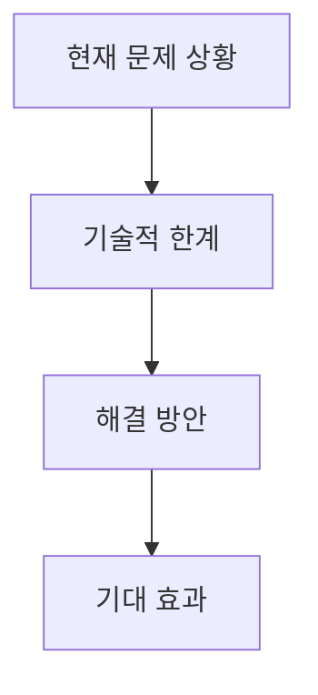

**한 줄 요약**: [다이어그램을 한 문장으로 요약]

**세부 내용**:
[발주처 유형별 페르소나 적용, 순룡 페르소나 스타일, 회사 관점으로 작성]

### 1.2 사업 목표

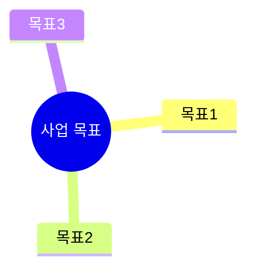

**한 줄 요약**: [다이어그램을 한 문장으로 요약]

**세부 내용**:
[상세 내용]

### 1.3 사업 범위

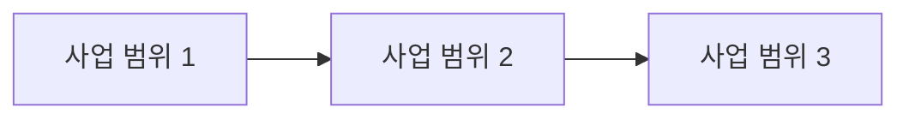

**한 줄 요약**: [다이어그램을 한 문장으로 요약]

**세부 내용**:
[상세 내용]

---

## 2. 연구 목적 및 필요성

### 2.1 연구 목적

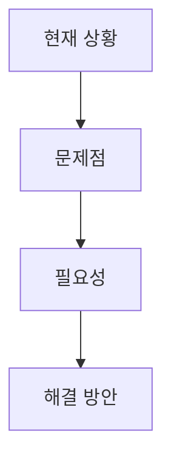

**한 줄 요약**: [다이어그램을 한 문장으로 요약]

**세부 내용**:
[연구 목적을 상세히 설명. 발주처 유형별 페르소나 적용, 순룡 페르소나 스타일, 회사 관점으로 작성]

### 2.2 연구 필요성

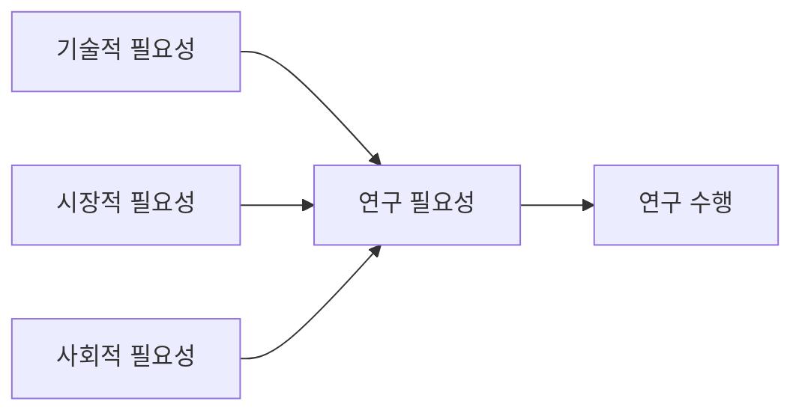

**한 줄 요약**: [다이어그램을 한 문장으로 요약]

**세부 내용**:
[연구의 필요성을 기술적, 시장적, 사회적 관점에서 상세히 설명]

### 2.3 기존 기술의 문제점 및 개선 방향

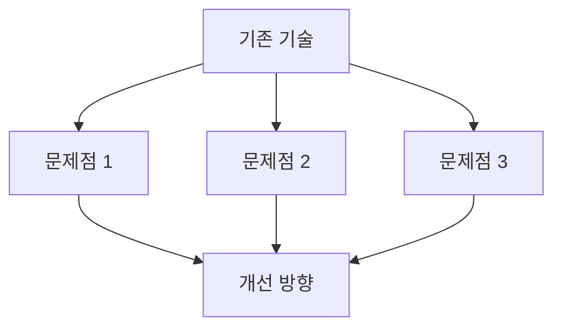

**한 줄 요약**: [다이어그램을 한 문장으로 요약]

**세부 내용**:
[기존 기술의 한계와 문제점, 그리고 개선 방향을 상세히 설명]

---

## 3. 총 서비스 형상 (Overall Service Architecture)

### 2.1 전체 서비스 구조

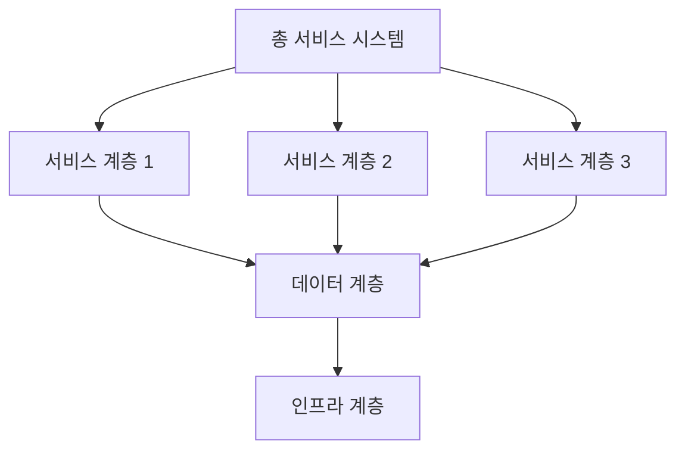

**한 줄 요약**: [다이어그램을 한 문장으로 요약]

**세부 내용**:
[전체 서비스의 아키텍처 구조를 상세히 설명. Architecture 분석 결과를 기반으로 작성]

### 2.2 서비스 간 상호작용 및 연결성

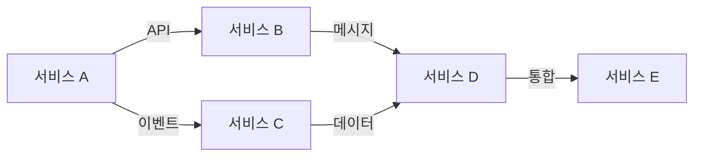

**한 줄 요약**: [다이어그램을 한 문장으로 요약]

**세부 내용**:
[서비스 간 상호작용 방식, 연결성, 통신 프로토콜 등을 상세히 설명]

### 2.3 전체 시스템 데이터 흐름

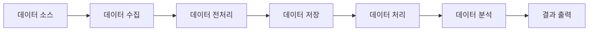

**한 줄 요약**: [다이어그램을 한 문장으로 요약]

**세부 내용**:
[전체 시스템의 데이터 흐름을 상세히 설명. 데이터 소스부터 결과 출력까지의 전체 프로세스]

### 2.4 주요 컴포넌트 및 역할

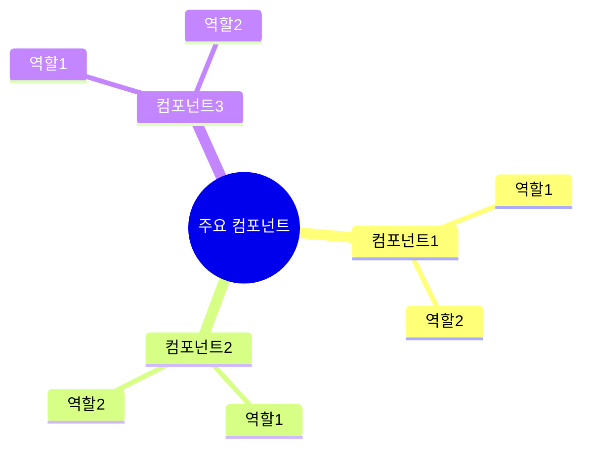

**한 줄 요약**: [다이어그램을 한 문장으로 요약]

**세부 내용**:
[주요 컴포넌트별 역할과 책임을 상세히 설명]

---

## 4. 단위별 서비스 기술 형상 (Unit Service Technical Architecture)

### 3.1 단위 서비스 1

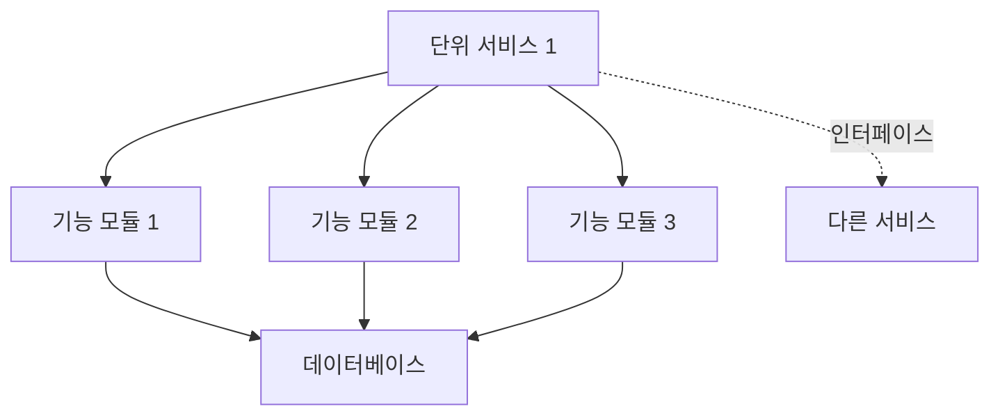

**한 줄 요약**: [다이어그램을 한 문장으로 요약]

**세부 내용**:
- **역할 및 책임**: [단위 서비스 1의 역할과 책임]
- **기술 스택**: [사용 기술 스택]
- **연결성**: [다른 서비스와의 연결 방식 및 인터페이스]
- **아키텍처 패턴**: [적용된 아키텍처 패턴]

### 3.2 단위 서비스 2

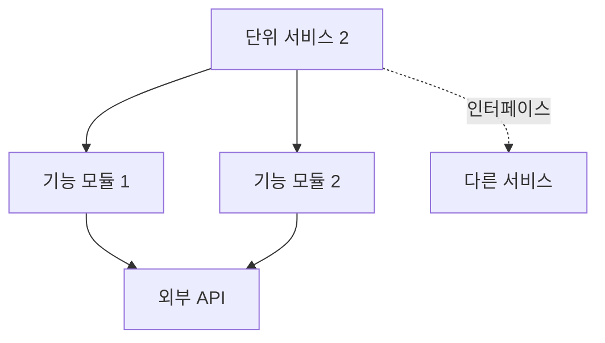

**한 줄 요약**: [다이어그램을 한 문장으로 요약]

**세부 내용**:
- **역할 및 책임**: [단위 서비스 2의 역할과 책임]
- **기술 스택**: [사용 기술 스택]
- **연결성**: [다른 서비스와의 연결 방식 및 인터페이스]
- **아키텍처 패턴**: [적용된 아키텍처 패턴]

### 3.3 단위 서비스 3


**한 줄 요약**: [다이어그램을 한 문장으로 요약]

**세부 내용**:
- **역할 및 책임**: [단위 서비스 3의 역할과 책임]
- **기술 스택**: [사용 기술 스택]
- **연결성**: [다른 서비스와의 연결 방식 및 인터페이스]
- **아키텍처 패턴**: [적용된 아키텍처 패턴]

### 3.4 단위 서비스 간 연결성 및 인터페이스

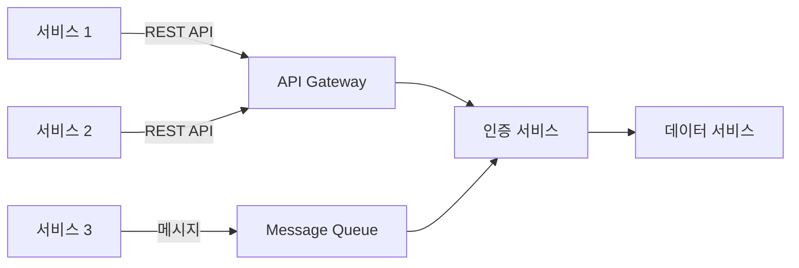

**한 줄 요약**: [다이어그램을 한 문장으로 요약]

**세부 내용**:
[단위 서비스 간 연결성, 인터페이스 정의, 통신 프로토콜 등을 상세히 설명]

---

## 5. 서비스 구현 방법론 (Service Implementation Methodology)

### 4.1 개발 프로세스

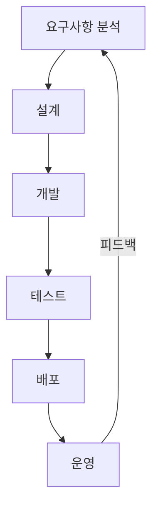

**한 줄 요약**: [다이어그램을 한 문장으로 요약]

**세부 내용**:
[각 단위 서비스의 개발 프로세스를 상세히 설명. 애자일, 스크럼, 칸반 등 적용 방법론]

### 4.2 기술 선택 근거 및 방법론

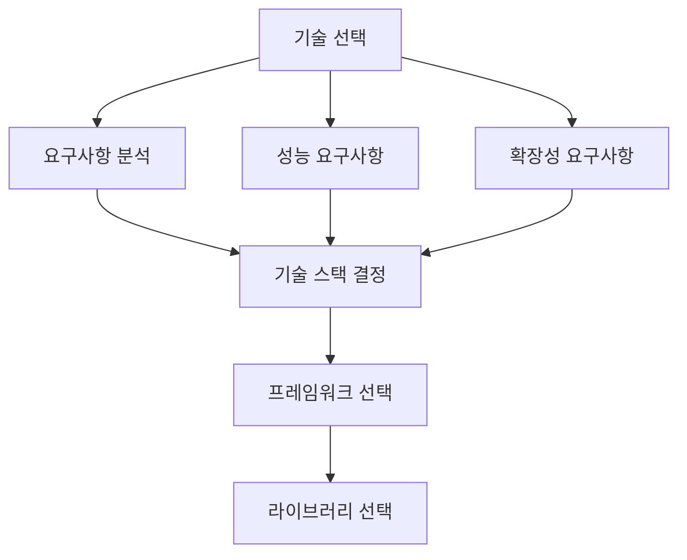

**한 줄 요약**: [다이어그램을 한 문장으로 요약]

**세부 내용**:
[각 단위 서비스별 기술 선택 근거, 방법론, 비교 분석 등을 상세히 설명]

### 4.3 구현 단계별 상세 설명

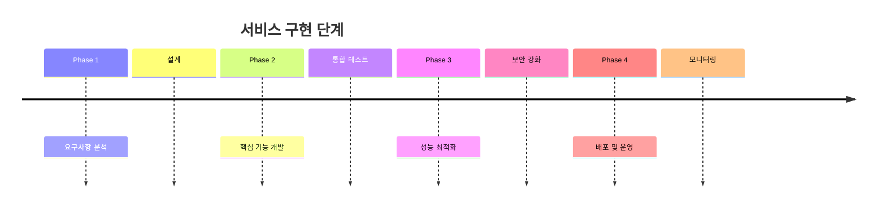

**한 줄 요약**: [다이어그램을 한 문장으로 요약]

**세부 내용**:
[각 단위 서비스의 구현 단계를 상세히 설명. 단계별 산출물, 마일스톤 등]

### 4.4 개발 도구 및 환경

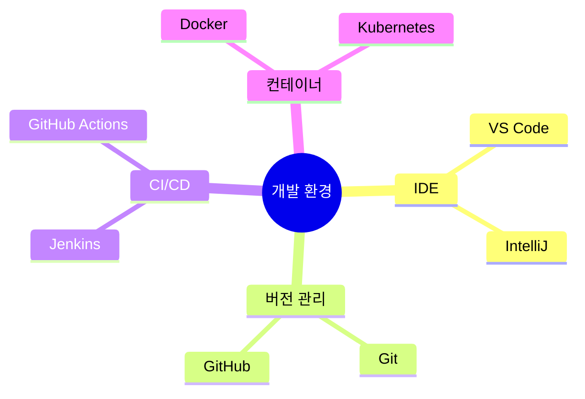

**한 줄 요약**: [다이어그램을 한 문장으로 요약]

**세부 내용**:
[개발 도구, 환경 설정, CI/CD 파이프라인 등을 상세히 설명]

---

## 6. 서비스 결과 및 성과 (Service Results & Outcomes)

### 5.1 기술적 성과


**한 줄 요약**: [다이어그램을 한 문장으로 요약]

**세부 내용**:
- **성능 지표**: [응답 시간, 처리량, 동시 사용자 수 등]
- **정확도**: [예측 정확도, 분류 정확도 등]
- **안정성**: [가동률, 장애 발생률 등]
- **확장성**: [수평 확장 가능성, 부하 분산 등]

### 5.2 비즈니스 성과

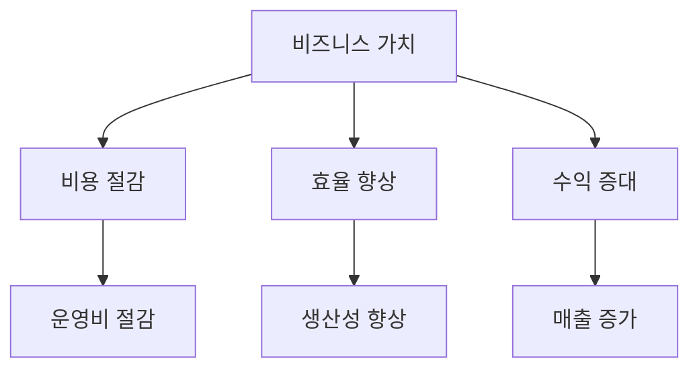

**한 줄 요약**: [다이어그램을 한 문장으로 요약]

**세부 내용**:
- **비용 절감**: [운영비, 인건비 절감 효과]
- **효율 향상**: [처리 시간 단축, 자동화율 향상 등]
- **수익 증대**: [매출 증가, ROI 등]

### 5.3 사회적 성과

```mermaid
graph LR
    A[사회적 가치] --> B[공공 복리]
    B --> C[지속가능 발전]
    C --> D[포용적 성장]
```

**한 줄 요약**: [다이어그램을 한 문장으로 요약]

**세부 내용**:
- **공공 복리**: [시민 편의성 증대, 공공 서비스 개선 등]
- **지속가능성**: [환경 친화적 접근, 에너지 효율 등]
- **포용성**: [접근성 향상, 사회적 형평성 등]

### 5.4 검증 결과 및 실증 데이터

```mermaid
graph TD
    A[검증 방법] --> B[단위 테스트]
    A --> C[통합 테스트]
    A --> D[성능 테스트]
    B --> E[검증 결과]
    C --> E
    D --> E
    E --> F[실증 데이터]
```

**한 줄 요약**: [다이어그램을 한 문장으로 요약]

**세부 내용**:
[검증 방법, 테스트 결과, 실증 데이터, 사례 연구 등을 상세히 설명]

---

## 7. KPI 및 성과 측정 (KPI & Performance Measurement)

### 6.1 기술 KPI

```mermaid
graph LR
    A[기술 KPI] --> B[응답 시간]
    A --> C[처리량]
    A --> D[정확도]
    A --> E[가동률]
    B --> F[측정 방법]
    C --> F
    D --> F
    E --> F
```

**한 줄 요약**: [다이어그램을 한 문장으로 요약]

**세부 내용**:
- **응답 시간**: [목표값, 측정 방법, 현재 수준]
- **처리량**: [초당 처리 건수, 목표값, 현재 수준]
- **정확도**: [예측 정확도, 분류 정확도 등]
- **가동률**: [목표 가동률, 현재 가동률]

### 6.2 비즈니스 KPI

```mermaid
graph TD
    A[비즈니스 KPI] --> B[ROI]
    A --> C[비용 절감률]
    A --> D[사용자 만족도]
    A --> E[시장 점유율]
    B --> F[측정 방법]
    C --> F
    D --> F
    E --> F
```

**한 줄 요약**: [다이어그램을 한 문장으로 요약]

**세부 내용**:
- **ROI**: [투자 대비 수익률, 목표값, 현재 수준]
- **비용 절감률**: [목표 절감률, 실제 절감률]
- **사용자 만족도**: [NPS, CSAT 등]
- **시장 점유율**: [목표 점유율, 현재 점유율]

### 6.3 사회적 KPI

```mermaid
graph LR
    A[사회적 KPI] --> B[공공 가치]
    A --> C[지속가능성 지표]
    A --> D[포용성 지표]
    B --> E[측정 방법]
    C --> E
    D --> E
```

**한 줄 요약**: [다이어그램을 한 문장으로 요약]

**세부 내용**:
- **공공 가치**: [공공 서비스 이용자 수, 만족도 등]
- **지속가능성 지표**: [탄소 배출 감소량, 에너지 효율 등]
- **포용성 지표**: [접근성 향상, 디지털 격차 해소 등]

### 6.4 KPI 측정 방법 및 도구

```mermaid
flowchart TD
    A[데이터 수집] --> B[데이터 전처리]
    B --> C[KPI 계산]
    C --> D[대시보드 표시]
    D --> E[알림 발송]
    E --> F[리포트 생성]
```

**한 줄 요약**: [다이어그램을 한 문장으로 요약]

**세부 내용**:
[KPI 측정 방법, 사용 도구, 자동화 방안 등을 상세히 설명]

### 6.5 대시보드 및 모니터링 체계

```mermaid
graph TB
    A[모니터링 시스템] --> B[실시간 대시보드]
    A --> C[알림 시스템]
    A --> D[리포트 시스템]
    B --> E[시각화]
    C --> F[이메일/SMS]
    D --> G[주간/월간 리포트]
```

**한 줄 요약**: [다이어그램을 한 문장으로 요약]

**세부 내용**:
[대시보드 구성, 모니터링 체계, 알림 설정 등을 상세히 설명]

---

## 8. 연구 수행 계획

### 8.1 일정 계획 (WBS)

```mermaid
gantt
    title 연구 수행 일정 (WBS)
    dateFormat YYYY-MM-DD
    section Phase 1: 사업 착수 및 요구사항 분석
    프로젝트 팀 구성 및 킥오프 미팅    :2025-04-01, 5d
    초기 요구사항 수집 및 현황 조사    :2025-04-06, 10d
    요구사항 분석 및 정리              :2025-04-16, 10d
    요구사항 명세서 작성 및 검토        :2025-04-26, 5d
    section Phase 2: 시스템 설계
    전체 시스템 아키텍처 설계          :2025-05-01, 10d
    데이터베이스 스키마 설계            :2025-05-11, 8d
    API 인터페이스 설계                 :2025-05-19, 7d
    UI/UX 설계                          :2025-05-26, 5d
    설계 문서 검토 및 승인              :2025-05-31, 2d
    section Phase 3: 핵심 기능 개발
    데이터 수집 서비스 개발             :2025-06-01, 15d
    AI 분석 서비스 개발                 :2025-06-16, 20d
    수명 관리 서비스 개발               :2025-07-06, 15d
    모니터링 서비스 개발                :2025-07-21, 10d
    section Phase 4: 통합 및 테스트
    단위 테스트 수행                    :2025-07-01, 20d
    통합 테스트 수행                    :2025-07-21, 10d
    성능 테스트 및 최적화               :2025-07-31, 5d
    사용자 수용 테스트                  :2025-08-05, 5d
    section Phase 5: 배포 및 완료
    시스템 배포 및 운영 환경 구축       :2025-08-10, 5d
    최종 검증 및 산출물 정리            :2025-08-15, 5d
    사업 완료 보고                      :2025-08-20, 3d
```

**한 줄 요약**: [다이어그램을 한 문장으로 요약 - 예: "2025년 4월부터 8월까지 5개월간 5단계(사업 착수 및 요구사항 분석, 시스템 설계, 핵심 기능 개발, 통합 및 테스트, 배포 및 완료)로 구체적인 WBS에 따라 단계적으로 수행합니다."]

**세부 내용**:

#### Phase 1: 사업 착수 및 요구사항 분석 ([기간])

**WBS 1.1: 프로젝트 팀 구성 및 킥오프 미팅** ([기간])
- **담당**: [담당자/역할]
- **작업 내용**: [세부 작업 항목]
- **산출물**: [산출물 목록]

**WBS 1.2: 초기 요구사항 수집 및 현황 조사** ([기간])
- **담당**: [담당자/역할]
- **작업 내용**: [세부 작업 항목]
- **산출물**: [산출물 목록]

**WBS 1.3: 요구사항 분석 및 정리** ([기간])
- **담당**: [담당자/역할]
- **작업 내용**: [세부 작업 항목]
- **산출물**: [산출물 목록]

**WBS 1.4: 요구사항 명세서 작성 및 검토** ([기간])
- **담당**: [담당자/역할]
- **작업 내용**: [세부 작업 항목]
- **산출물**: [산출물 목록]

#### Phase 2: 시스템 설계 ([기간])

**WBS 2.1: 전체 시스템 아키텍처 설계** ([기간])
- **담당**: [담당자/역할]
- **작업 내용**: [세부 작업 항목]
- **산출물**: [산출물 목록]

**WBS 2.2: 데이터베이스 스키마 설계** ([기간])
- **담당**: [담당자/역할]
- **작업 내용**: [세부 작업 항목]
- **산출물**: [산출물 목록]

**WBS 2.3: API 인터페이스 설계** ([기간])
- **담당**: [담당자/역할]
- **작업 내용**: [세부 작업 항목]
- **산출물**: [산출물 목록]

**WBS 2.4: UI/UX 설계** ([기간])
- **담당**: [담당자/역할]
- **작업 내용**: [세부 작업 항목]
- **산출물**: [산출물 목록]

**WBS 2.5: 설계 문서 검토 및 승인** ([기간])
- **담당**: [담당자/역할]
- **작업 내용**: [세부 작업 항목]
- **산출물**: [산출물 목록]

#### Phase 3: 핵심 기능 개발 ([기간])

**WBS 3.1: [서비스명] 개발** ([기간])
- **담당**: [담당자/역할]
- **작업 내용**: 
  - [세부 작업 항목 1] ([기간])
  - [세부 작업 항목 2] ([기간])
  - [세부 작업 항목 3] ([기간])
- **산출물**: [산출물 목록]

**WBS 3.2: [서비스명] 개발** ([기간])
- **담당**: [담당자/역할]
- **작업 내용**: 
  - [세부 작업 항목 1] ([기간])
  - [세부 작업 항목 2] ([기간])
- **산출물**: [산출물 목록]

#### Phase 4: 통합 및 테스트 ([기간])

**WBS 4.1: 단위 테스트 수행** ([기간])
- **담당**: [담당자/역할]
- **작업 내용**: [세부 작업 항목]
- **산출물**: [산출물 목록]

**WBS 4.2: 통합 테스트 수행** ([기간])
- **담당**: [담당자/역할]
- **작업 내용**: [세부 작업 항목]
- **산출물**: [산출물 목록]

**WBS 4.3: 성능 테스트 및 최적화** ([기간])
- **담당**: [담당자/역할]
- **작업 내용**: [세부 작업 항목]
- **산출물**: [산출물 목록]

**WBS 4.4: 사용자 수용 테스트** ([기간])
- **담당**: [담당자/역할]
- **작업 내용**: [세부 작업 항목]
- **산출물**: [산출물 목록]

#### Phase 5: 배포 및 완료 ([기간])

**WBS 5.1: 시스템 배포 및 운영 환경 구축** ([기간])
- **담당**: [담당자/역할]
- **작업 내용**: [세부 작업 항목]
- **산출물**: [산출물 목록]

**WBS 5.2: 최종 검증 및 산출물 정리** ([기간])
- **담당**: [담당자/역할]
- **작업 내용**: [세부 작업 항목]
- **산출물**: [산출물 목록]

**WBS 5.3: 사업 완료 보고** ([기간])
- **담당**: [담당자/역할]
- **작업 내용**: [세부 작업 항목]
- **산출물**: [산출물 목록]

**⚠️ 중요**: WBS는 최소 3-5개 Phase로 구분하고, 각 Phase 내에 WBS X.Y 형식의 작업 항목을 포함해야 합니다. 각 WBS 항목에는 담당자/역할, 작업 내용(세부 작업 항목), 산출물이 필수로 포함되어야 합니다.

### 8.2 인력 구성

```mermaid
graph TD
    A[프로젝트 팀] --> B[책임자]
    A --> C[실무책임자]
    A --> D[개발팀]
    A --> E[QA팀]
```

**한 줄 요약**: [다이어그램을 한 문장으로 요약]

**세부 내용**:
[인력 구성 상세 설명]

### 8.3 예산 계획

```mermaid
pie title 사업비 구성
    "정부출연금" : 75
    "민간부담금" : 25
```

**한 줄 요약**: [다이어그램을 한 문장으로 요약]

**세부 내용**:
[예산 계획 상세 설명]

---

## 9. 기대 효과

### 9.1 기술적 효과

```mermaid
graph LR
    A[기술 개발] --> B[성능 향상]
    B --> C[기술 혁신]
```

**한 줄 요약**: [다이어그램을 한 문장으로 요약]

**세부 내용**:
[기술적 효과를 상세히 설명]

### 9.2 경제적 효과

```mermaid
graph TD
    A[비용 절감] --> B[수익 증대]
    B --> C[시장 확대]
```

**한 줄 요약**: [다이어그램을 한 문장으로 요약]

**세부 내용**:
[경제적 효과를 상세히 설명]

### 9.3 사회적 효과

```mermaid
graph LR
    A[사회적 가치] --> B[공공 복리]
    B --> C[지속가능 발전]
```

**한 줄 요약**: [다이어그램을 한 문장으로 요약]

**세부 내용**:
[사회적 효과를 상세히 설명]

---

## 10. 연구 수행 능력 (Research Capability)

### 7.1 회사 개요

```mermaid
graph TB
    A[[회사명]] --> B[기술 역량]
    A --> C[프로젝트 경험]
    A --> D[인증 및 성과]
```

**한 줄 요약**: [다이어그램을 한 문장으로 요약]

**세부 내용**:
[회사 개요, 설립 연도, 주요 사업 분야 등을 상세히 설명]

### 7.2 관련 프로젝트 경험

```mermaid
graph LR
    A[프로젝트 1] --> B[성과 1]
    C[프로젝트 2] --> D[성과 2]
    E[프로젝트 3] --> F[성과 3]
```

**한 줄 요약**: [다이어그램을 한 문장으로 요약]

**세부 내용**:
[포트폴리오 매칭 결과를 기반으로 관련 프로젝트를 상세히 설명. 각 프로젝트의 성과와 경험]

### 7.3 기술 역량

```mermaid
mindmap
  root((기술 역량))
    시계열 데이터 분석
    AI 엔진 개발
    데이터 전처리
    플랫폼 개발
    클라우드 인프라
```

**한 줄 요약**: [다이어그램을 한 문장으로 요약]

**세부 내용**:
[Architecture 분석 결과를 기반으로 기술 역량을 상세히 설명]

### 7.4 인증 및 성과

```mermaid
graph TD
    A[인증 및 성과] --> B[GS 인증]
    A --> C[특허]
    A --> D[논문]
    A --> E[납품 실적]
    B --> F[1등급 2개]
    E --> G[대기업 납품]
```

**한 줄 요약**: [다이어그램을 한 문장으로 요약]

**세부 내용**:
[인증, 특허, 논문, 납품 실적 등을 상세히 설명]

---

## 11. 사업화 계획 (Business Plan)

### 8.1 시장 분석

```mermaid
graph TB
    A[시장 현황] --> B[시장 기회]
    B --> C[경쟁 분석]
    C --> D[시장 전략]
```

**한 줄 요약**: [다이어그램을 한 문장으로 요약]

**세부 내용**:
[시장 현황, 시장 기회, 경쟁 분석, 시장 전략 등을 상세히 설명]

### 8.2 비즈니스 모델

```mermaid
graph LR
    A[고객] --> B[가치 제안]
    B --> C[수익 모델]
    C --> D[시장 진입]
```

**한 줄 요약**: [다이어그램을 한 문장으로 요약]

**세부 내용**:
[비즈니스 모델, 수익 구조, 가치 제안 등을 상세히 설명]

### 8.3 마케팅 전략

```mermaid
flowchart TD
    A[타겟 고객] --> B[마케팅 채널]
    B --> C[프로모션 전략]
    C --> D[고객 확보]
```

**한 줄 요약**: [다이어그램을 한 문장으로 요약]

**세부 내용**:
[마케팅 전략, 타겟 고객, 채널 전략 등을 상세히 설명]

---

## 부록

### 표지 정보 표

| 항목 | 내용 |
|------|------|
| 과제명 | [프로젝트명] |
| 과제 지원분야 | [지원분야] |
| 기술분류 | 대분류: [대분류]<br>중분류: [중분류]<br>소분류: [소분류]<br>융합기술: [융합기술] |
| 전담기관 | [기관명] |
| 주관 사업수행 기관 | [회사명] |

### 사업비 표

| 비목 | 정부출연금 | 민간부담금 | 합계 | 구성비 |
|------|-----------|-----------|------|--------|
| 인건비 | [금액] | [금액] | [금액] | [%] |
| 운영비 | [금액] | [금액] | [금액] | [%] |
| 연구용역비 | [금액] | [금액] | [금액] | [%] |
| 합계 | [금액] | [금액] | [금액] | 100% |

### 인건비 표

| 성명 | 직위 | 실지급액 | 참여기간 | 참여율 | 출연금 | 현금 | 현물 | 소계 | 합계 | 구성비 | 비고 |
|------|------|---------|---------|--------|--------|------|------|------|------|--------|------|
| [성명] | [직위] | [금액] | [기간] | [%] | [금액] | [금액] | [금액] | [금액] | [금액] | [%] | [비고] |

---

**생성 일시**: [날짜]
**작성자**: [회사명]
