# [프로젝트명] 착수보고서

**작성일**: [날짜]  
**작성기관**: [회사명]  
**발주처**: [발주처명]

---

## 목차

1. [착수 개요](#1-착수-개요)
2. [프로젝트 범위 및 목표](#2-프로젝트-범위-및-목표)
3. [서비스 구조 정의](#3-서비스-구조-정의)
   - 3.1 총 서비스 형상 (확정)
   - 3.2 단위별 서비스 상세 설계
   - 3.3 구현 방법론 (실행 계획)
4. [WBS (Work Breakdown Structure)](#4-wbs-work-breakdown-structure)
5. [일정 계획](#5-일정-계획)
6. [인력 구성 및 역할](#6-인력-구성-및-역할)
7. [보고 체계](#7-보고-체계)
8. [산출물 목록](#8-산출물-목록)
9. [KPI 및 성과 측정 계획](#9-kpi-및-성과-측정-계획)
10. [위험 관리 계획](#10-위험-관리-계획)

---

## 1. 착수 개요

### 1.1 프로젝트 개요

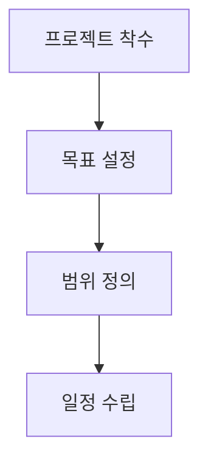

**한 줄 요약**: [다이어그램을 한 문장으로 요약]

**세부 내용**:
[발주처 유형별 페르소나 적용, 순룡 페르소나 스타일, 회사 관점으로 작성]

### 1.2 착수 배경


**한 줄 요약**: [다이어그램을 한 문장으로 요약]

**세부 내용**:
[상세 내용]

---

## 2. 프로젝트 범위 및 목표

### 2.1 프로젝트 범위

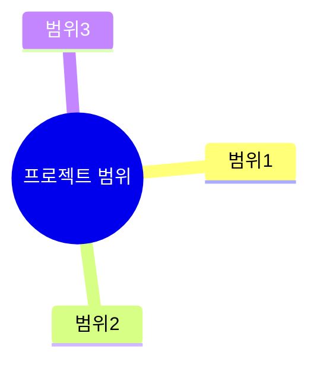

**한 줄 요약**: [다이어그램을 한 문장으로 요약]

**세부 내용**:
[프로젝트 범위 상세 설명]

### 2.2 프로젝트 목표

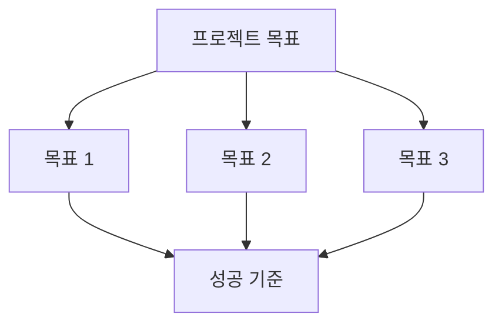

**한 줄 요약**: [다이어그램을 한 문장으로 요약]

**세부 내용**:
[목표 상세 설명]

---

## 3. 서비스 구조 정의 (Service Structure Definition)

### 3.1 총 서비스 형상 (확정) (Overall Service Architecture - Confirmed)

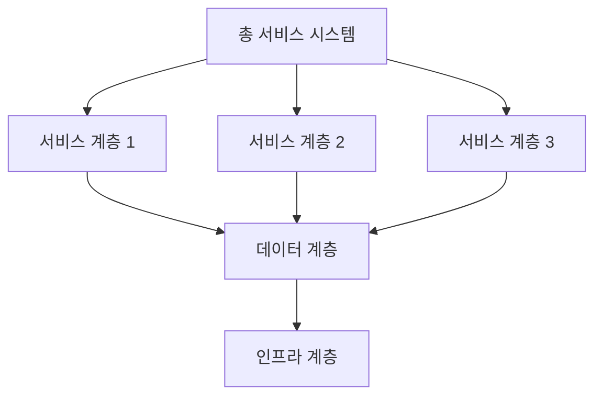

**한 줄 요약**: [다이어그램을 한 문장으로 요약]

**세부 내용**:
[제안서에서 확정된 전체 서비스의 아키텍처 구조를 상세히 설명. Architecture 분석 결과를 기반으로 작성]

### 3.2 단위별 서비스 상세 설계 (Unit Service Detailed Design)

#### 3.2.1 단위 서비스 1

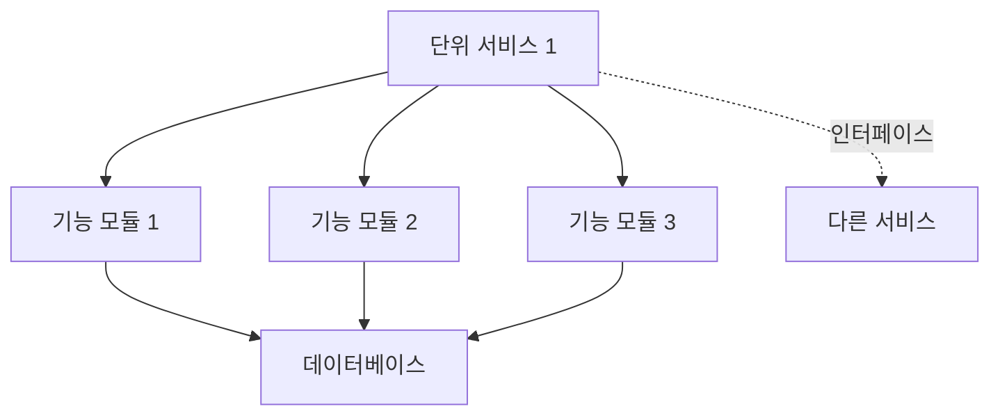

**한 줄 요약**: [다이어그램을 한 문장으로 요약]

**세부 내용**:
- **역할 및 책임**: [단위 서비스 1의 역할과 책임]
- **기술 스택**: [사용 기술 스택]
- **연결성**: [다른 서비스와의 연결 방식 및 인터페이스]
- **상세 설계**: [API 명세, 데이터 모델, 프로세스 흐름 등]

#### 3.2.2 단위 서비스 2

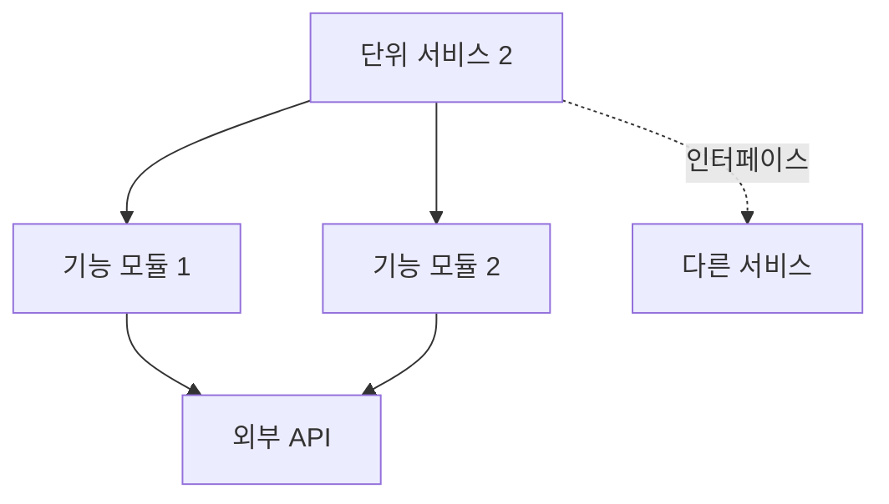

**한 줄 요약**: [다이어그램을 한 문장으로 요약]

**세부 내용**:
- **역할 및 책임**: [단위 서비스 2의 역할과 책임]
- **기술 스택**: [사용 기술 스택]
- **연결성**: [다른 서비스와의 연결 방식 및 인터페이스]
- **상세 설계**: [API 명세, 데이터 모델, 프로세스 흐름 등]

### 3.3 구현 방법론 (실행 계획) (Implementation Methodology - Execution Plan)

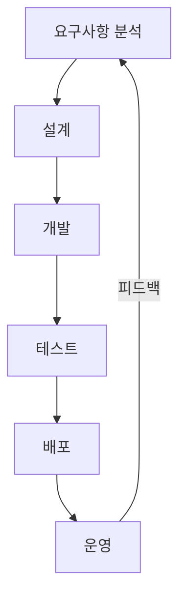

**한 줄 요약**: [다이어그램을 한 문장으로 요약]

**세부 내용**:
- **개발 프로세스**: [애자일, 스크럼, 칸반 등 적용 방법론 및 실행 계획]
- **기술 선택**: [각 단위 서비스별 기술 선택 및 근거]
- **구현 단계**: [단계별 구현 계획 및 산출물]
- **개발 환경**: [개발 도구, 환경 설정, CI/CD 파이프라인]

---

## 4. WBS (Work Breakdown Structure)

### 4.1 WBS 구조

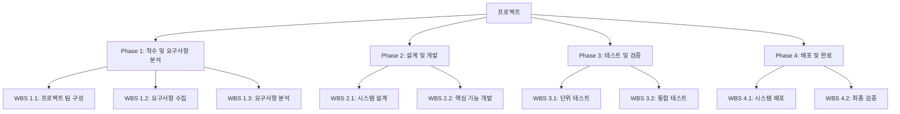

**한 줄 요약**: [다이어그램을 한 문장으로 요약 - 예: "프로젝트를 4개 Phase로 구분하고, 각 Phase 내에 WBS X.Y 형식의 작업 항목으로 세분화한 구조입니다."]

**세부 내용**:

#### Phase 1: 착수 및 요구사항 분석

**WBS 1.1: 프로젝트 팀 구성 및 킥오프 미팅**
- **담당**: [담당자/역할]
- **작업 내용**: [세부 작업 항목]
- **산출물**: [산출물 목록]
- **기간**: [기간]

**WBS 1.2: 초기 요구사항 수집 및 현황 조사**
- **담당**: [담당자/역할]
- **작업 내용**: [세부 작업 항목]
- **산출물**: [산출물 목록]
- **기간**: [기간]

**WBS 1.3: 요구사항 분석 및 정리**
- **담당**: [담당자/역할]
- **작업 내용**: [세부 작업 항목]
- **산출물**: [산출물 목록]
- **기간**: [기간]

#### Phase 2: 설계 및 개발

**WBS 2.1: 전체 시스템 아키텍처 설계**
- **담당**: [담당자/역할]
- **작업 내용**: [세부 작업 항목]
- **산출물**: [산출물 목록]
- **기간**: [기간]

**WBS 2.2: 핵심 기능 개발**
- **담당**: [담당자/역할]
- **작업 내용**: 
  - [세부 작업 항목 1]
  - [세부 작업 항목 2]
- **산출물**: [산출물 목록]
- **기간**: [기간]

#### Phase 3: 테스트 및 검증

**WBS 3.1: 단위 테스트 수행**
- **담당**: [담당자/역할]
- **작업 내용**: [세부 작업 항목]
- **산출물**: [산출물 목록]
- **기간**: [기간]

**WBS 3.2: 통합 테스트 수행**
- **담당**: [담당자/역할]
- **작업 내용**: [세부 작업 항목]
- **산출물**: [산출물 목록]
- **기간**: [기간]

#### Phase 4: 배포 및 완료

**WBS 4.1: 시스템 배포 및 운영 환경 구축**
- **담당**: [담당자/역할]
- **작업 내용**: [세부 작업 항목]
- **산출물**: [산출물 목록]
- **기간**: [기간]

**WBS 4.2: 최종 검증 및 산출물 정리**
- **담당**: [담당자/역할]
- **작업 내용**: [세부 작업 항목]
- **산출물**: [산출물 목록]
- **기간**: [기간]

**⚠️ 중요**: 착수보고서는 실행 계획이므로 각 작업 패키지에 담당자/역할, 작업 내용(세부 작업 항목), 산출물, 기간이 필수로 포함되어야 합니다.

### 4.2 작업 패키지 상세


**한 줄 요약**: [다이어그램을 한 문장으로 요약]

**세부 내용**:
[작업 패키지 간 의존성 및 순서 상세 설명]

---

## 5. 일정 계획

### 5.1 프로젝트 일정표 (Gantt 차트)

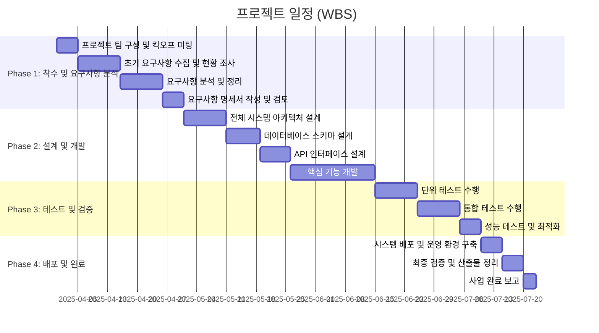

**한 줄 요약**: [다이어그램을 한 문장으로 요약 - 예: "2025년 4월부터 7월까지 4개월간 4단계로 구체적인 WBS에 따라 단계적으로 수행합니다."]

**세부 내용**:
[일정 상세 설명 - 각 Phase별 주요 작업 항목과 기간을 명시]

### 4.2 마일스톤

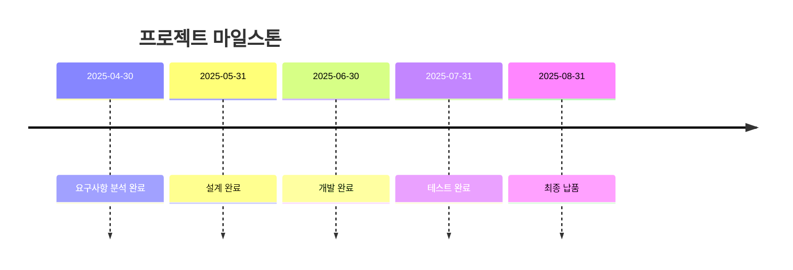

**한 줄 요약**: [다이어그램을 한 문장으로 요약]

**세부 내용**:
[마일스톤 상세 설명]

---

## 6. 인력 구성 및 역할

### 5.1 인력 구성

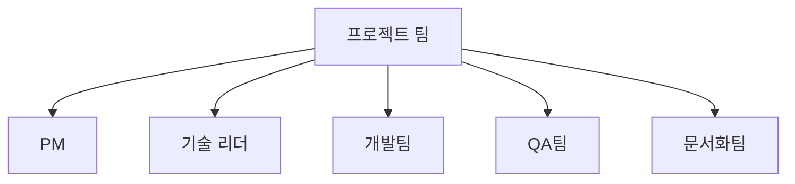

**한 줄 요약**: [다이어그램을 한 문장으로 요약]

**세부 내용**:
[인력 구성 상세 설명]

### 5.2 역할 및 책임

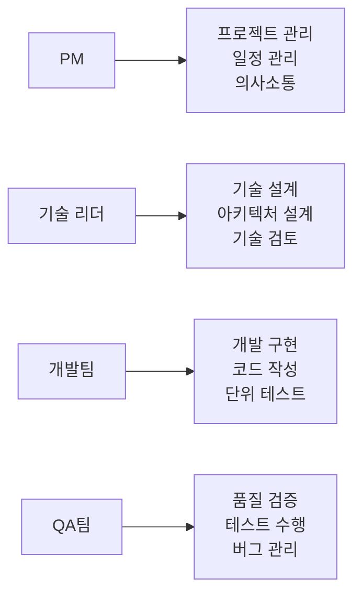

**한 줄 요약**: [다이어그램을 한 문장으로 요약]

**세부 내용**:
[역할 및 책임 상세 설명]

### 5.3 인력 프로필

| 성명 | 직위 | 담당 업무 | 경력 | 주요 경험 |
|------|------|---------|------|----------|
| [성명] | [직위] | [담당 업무] | [경력] | [주요 경험] |

---

## 7. 보고 체계

### 6.1 보고 구조

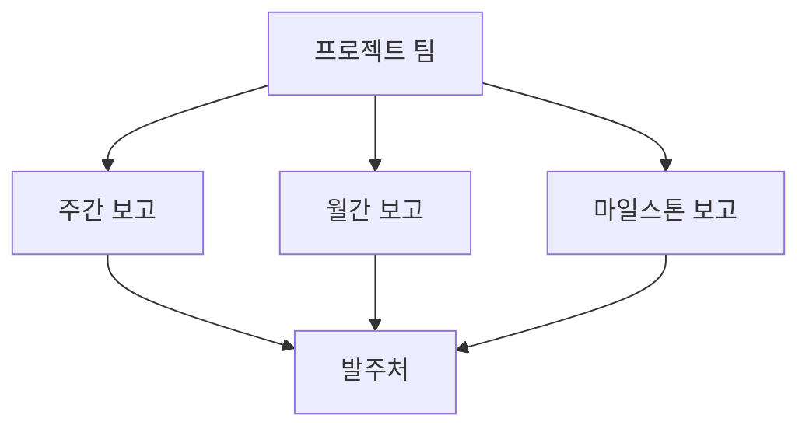

**한 줄 요약**: [다이어그램을 한 문장으로 요약]

**세부 내용**:
[보고 체계 상세 설명]

### 6.2 보고 프로세스

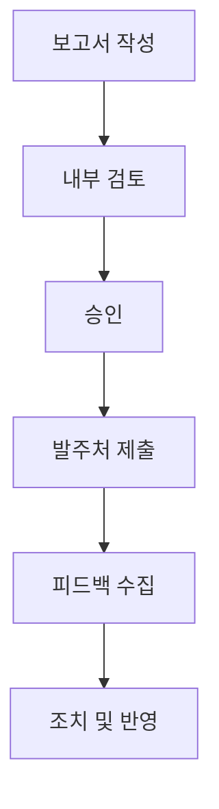

**한 줄 요약**: [다이어그램을 한 문장으로 요약]

**세부 내용**:
[보고 프로세스 상세 설명]

### 6.3 보고 일정

| 보고 유형 | 보고 주기 | 보고 시점 | 보고 내용 |
|----------|----------|---------|----------|
| 주간 보고 | 매주 | 금요일 | 주간 진행 상황, 이슈 및 조치 사항 |
| 월간 보고 | 매월 | 말일 | 월간 진행 상황, 성과, 계획 |
| 마일스톤 보고 | 마일스톤 달성 시 | 마일스톤 완료 후 3일 이내 | 마일스톤 달성 결과, 산출물 |

---

## 8. 산출물 목록

### 7.1 산출물 구조

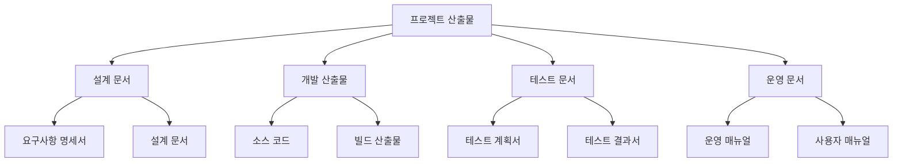

**한 줄 요약**: [다이어그램을 한 문장으로 요약]

**세부 내용**:
[산출물 구조 상세 설명]

### 7.2 산출물 목록

| 산출물명 | 산출 시점 | 담당자 | 검토자 |
|---------|----------|--------|--------|
| 요구사항 명세서 | Phase 1 완료 | [담당자] | [검토자] |
| 설계 문서 | Phase 1 완료 | [담당자] | [검토자] |
| 소스 코드 | Phase 2 완료 | [담당자] | [검토자] |
| 테스트 결과서 | Phase 2 완료 | [담당자] | [검토자] |
| 운영 매뉴얼 | Phase 3 완료 | [담당자] | [검토자] |

---

## 9. KPI 및 성과 측정 계획

### 9.1 기술 KPI

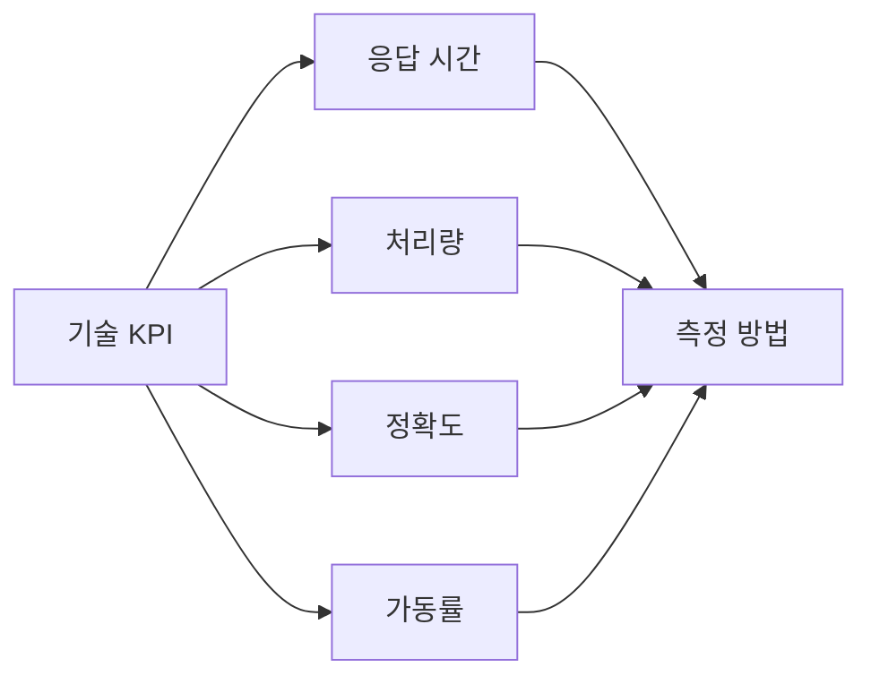

**한 줄 요약**: [다이어그램을 한 문장으로 요약]

**세부 내용**:
- **응답 시간**: [목표값, 측정 방법, 모니터링 계획]
- **처리량**: [초당 처리 건수, 목표값, 모니터링 계획]
- **정확도**: [예측 정확도, 분류 정확도 등]
- **가동률**: [목표 가동률, 모니터링 계획]

### 9.2 비즈니스 KPI

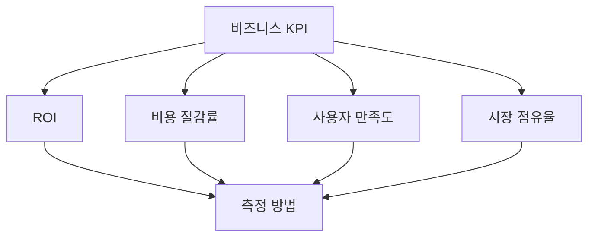

**한 줄 요약**: [다이어그램을 한 문장으로 요약]

**세부 내용**:
- **ROI**: [투자 대비 수익률, 목표값, 측정 계획]
- **비용 절감률**: [목표 절감률, 측정 계획]
- **사용자 만족도**: [NPS, CSAT 등 측정 계획]
- **시장 점유율**: [목표 점유율, 측정 계획]

### 9.3 KPI 측정 및 모니터링 체계

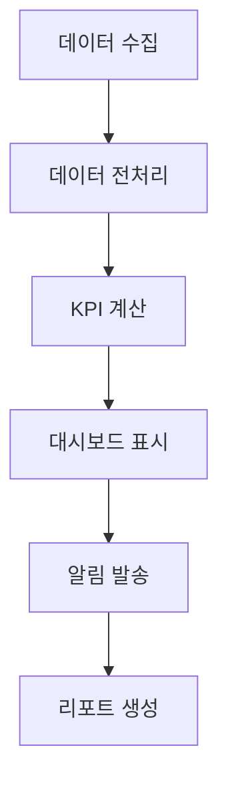

**한 줄 요약**: [다이어그램을 한 문장으로 요약]

**세부 내용**:
[KPI 측정 방법, 사용 도구, 대시보드 구성, 모니터링 체계, 리포트 생성 주기 등을 상세히 설명]

---

## 10. 위험 관리 계획

### 8.1 위험 식별

```mermaid
graph TD
    A[위험 관리] --> B[위험 식별]
    B --> C[위험 분석]
    C --> D[위험 대응]
    D --> E[위험 모니터링]
```

**한 줄 요약**: [다이어그램을 한 문장으로 요약]

**세부 내용**:
[위험 식별 상세 설명]

### 8.2 위험 관리 매트릭스

```mermaid
quadrantChart
    title 위험 관리 매트릭스
    x-axis 낮은 영향 --> 높은 영향
    y-axis 높은 확률 --> 낮은 확률
    quadrant-1 모니터링 필요
    quadrant-2 즉시 대응 필요
    quadrant-3 낮은 우선순위
    quadrant-4 대응 계획 수립
    위험1: [0.8, 0.6]
    위험2: [0.6, 0.8]
    위험3: [0.3, 0.3]
    위험4: [0.7, 0.4]
```

**한 줄 요약**: [다이어그램을 한 문장으로 요약]

**세부 내용**:
[위험 관리 매트릭스 상세 설명]

### 8.3 위험 대응 계획

| 위험 항목 | 확률 | 영향도 | 대응 전략 | 담당자 |
|----------|------|--------|----------|--------|
| 일정 지연 | 중 | 높음 | 버퍼 시간 확보, 우선순위 조정 | PM |
| 기술적 이슈 | 중 | 중 | 전문가 자문, 대안 기술 검토 | 기술 리더 |
| 인력 부족 | 낮음 | 높음 | 외부 인력 투입, 역할 재배정 | PM |

---

## 부록

### 프로젝트 정보

| 항목 | 내용 |
|------|------|
| 프로젝트명 | [프로젝트명] |
| 발주처 | [발주처명] |
| 계약 기간 | [시작일] ~ [종료일] |
| 계약 금액 | [금액] |

### 연락처

| 역할 | 성명 | 직위 | 연락처 | 이메일 |
|------|------|------|--------|--------|
| 책임자 | [책임자명] | [직위] | [연락처] | [이메일] |
| 실무책임자 | [실무책임자명] | [직위] | [연락처] | [이메일] |

---

**생성 일시**: [날짜]
**작성자**: [회사명]

