# [프로젝트명] 제안서

**작성일**: [날짜]  
**작성기관**: [회사명]  
**제안 대상**: [발주처명]

---

## 목차

1. [제안 개요](#1-제안-개요)
2. [문제 분석 및 해결 방안](#2-문제-분석-및-해결-방안)
3. [제안 솔루션](#3-제안-솔루션)
   - 3.1 총 서비스 형상
   - 3.2 단위별 서비스 설계
   - 3.3 구현 방법론 (제안)
4. [회사 소개 및 강점](#4-회사-소개-및-강점)
5. [수행 전략 및 방법론](#5-수행-전략-및-방법론)
6. [예상 일정 및 인력](#6-예상-일정-및-인력)
7. [예상 비용](#7-예상-비용)
8. [기대 효과 및 KPI](#8-기대-효과-및-kpi)

---

## 1. 제안 개요

### 1.1 제안 배경

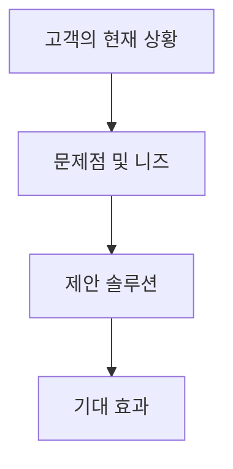

**한 줄 요약**: [다이어그램을 한 문장으로 요약]

**세부 내용**:
[발주처 유형별 페르소나 적용, 순룡 페르소나 스타일, 회사 관점으로 작성]

### 1.2 제안 목적

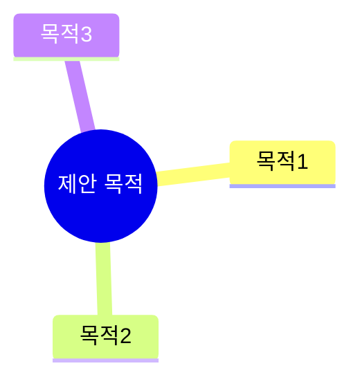

**한 줄 요약**: [다이어그램을 한 문장으로 요약]

**세부 내용**:
[상세 내용]

---

## 2. 문제 분석 및 해결 방안

### 2.1 문제 상황 분석

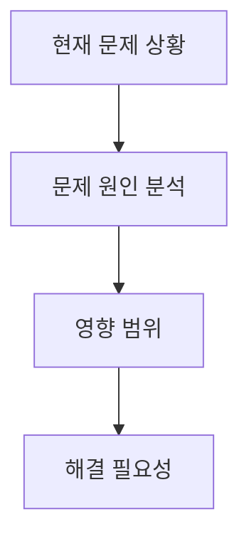

**한 줄 요약**: [다이어그램을 한 문장으로 요약]

**세부 내용**:
[문제 상황 상세 분석]

### 2.2 해결 방안

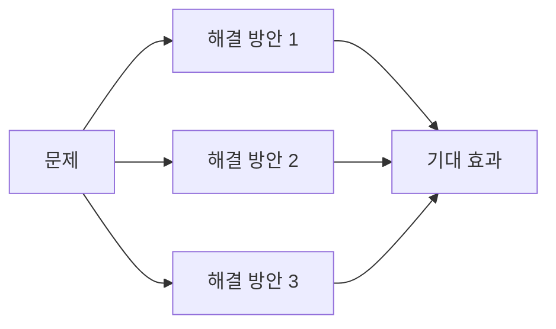

**한 줄 요약**: [다이어그램을 한 문장으로 요약]

**세부 내용**:
[해결 방안 상세 설명]

---

## 3. 제안 솔루션

### 3.1 총 서비스 형상 (Overall Service Architecture)

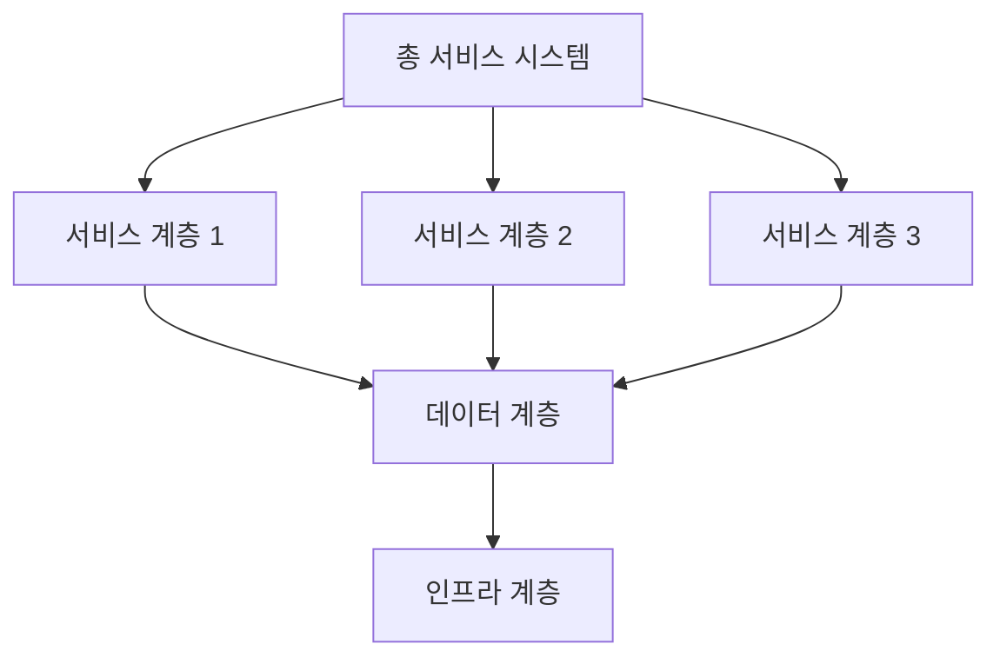

**한 줄 요약**: [다이어그램을 한 문장으로 요약]

**세부 내용**:
[전체 서비스의 아키텍처 구조를 상세히 설명. Architecture 분석 결과를 기반으로 작성. 서비스 간 상호작용 및 연결성 포함]

### 3.2 단위별 서비스 설계 (Unit Service Design)

#### 3.2.1 단위 서비스 1

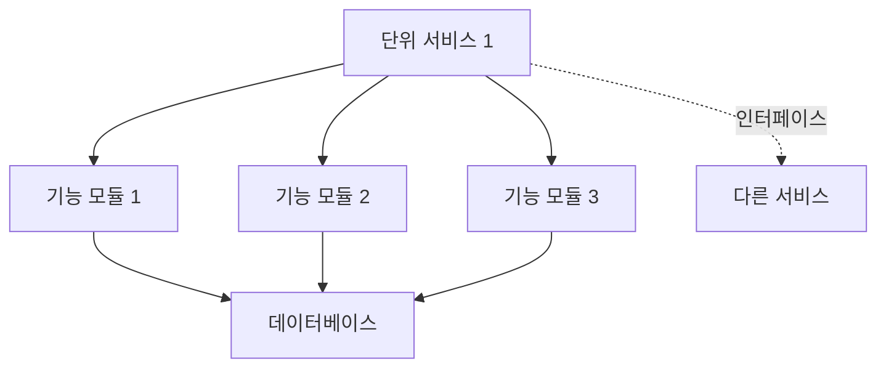

**한 줄 요약**: [다이어그램을 한 문장으로 요약]

**세부 내용**:
- **역할 및 책임**: [단위 서비스 1의 역할과 책임]
- **기술 스택**: [사용 기술 스택]
- **연결성**: [다른 서비스와의 연결 방식 및 인터페이스]
- **설계 패턴**: [적용된 설계 패턴]

#### 3.2.2 단위 서비스 2

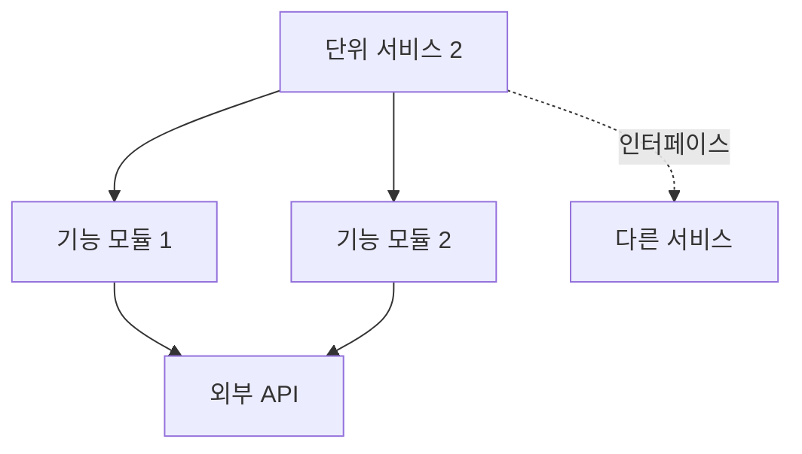

**한 줄 요약**: [다이어그램을 한 문장으로 요약]

**세부 내용**:
- **역할 및 책임**: [단위 서비스 2의 역할과 책임]
- **기술 스택**: [사용 기술 스택]
- **연결성**: [다른 서비스와의 연결 방식 및 인터페이스]
- **설계 패턴**: [적용된 설계 패턴]

#### 3.2.3 단위 서비스 간 연결성

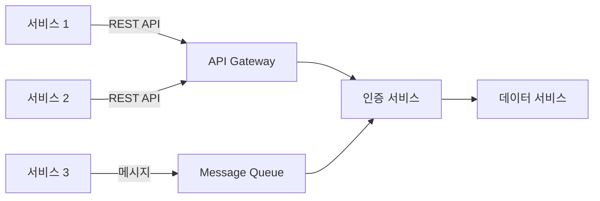

**한 줄 요약**: [다이어그램을 한 문장으로 요약]

**세부 내용**:
[단위 서비스 간 연결성, 인터페이스 정의, 통신 프로토콜 등을 상세히 설명]

### 3.3 구현 방법론 (제안) (Implementation Methodology)

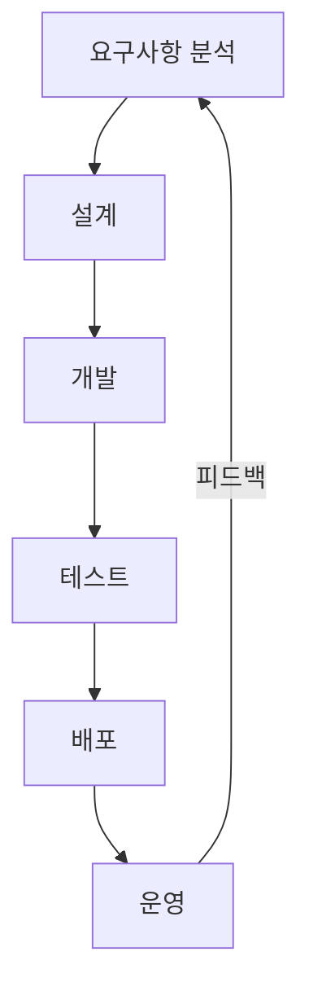

**한 줄 요약**: [다이어그램을 한 문장으로 요약]

**세부 내용**:
- **개발 프로세스**: [애자일, 스크럼, 칸반 등 적용 방법론]
- **기술 선택 근거**: [각 단위 서비스별 기술 선택 근거]
- **구현 단계**: [단계별 구현 계획]
- **개발 도구 및 환경**: [사용 도구 및 환경 설정]

---

## 4. 회사 소개 및 강점

### 4.1 회사 개요

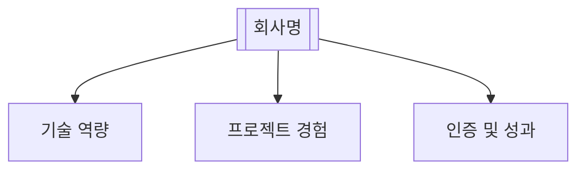

**한 줄 요약**: [다이어그램을 한 문장으로 요약]

**세부 내용**:
[회사 개요 상세 설명]

### 4.2 핵심 강점

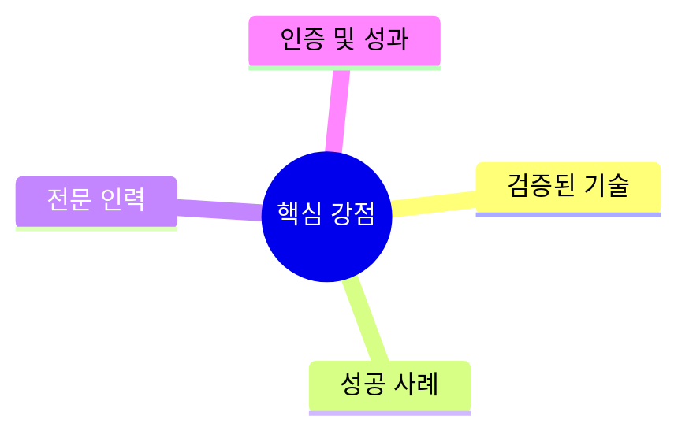

**한 줄 요약**: [다이어그램을 한 문장으로 요약]

**세부 내용**:
[포트폴리오 매칭 결과를 기반으로 강점 상세 설명]

### 4.3 관련 프로젝트 경험

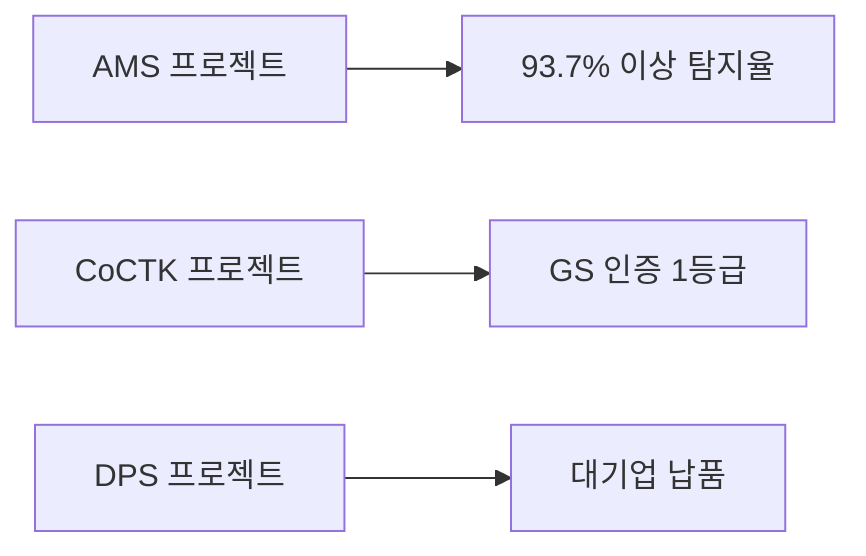

**한 줄 요약**: [다이어그램을 한 문장으로 요약]

**세부 내용**:
[관련 프로젝트 상세 설명]

---

## 5. 수행 전략 및 방법론

### 5.1 수행 전략

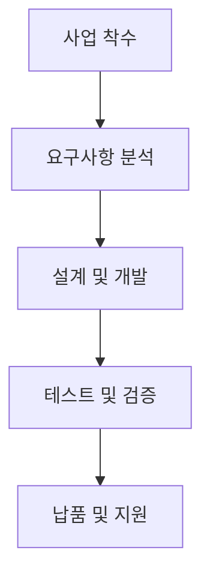

**한 줄 요약**: [다이어그램을 한 문장으로 요약]

**세부 내용**:
[수행 전략 상세 설명]

### 5.2 개발 방법론


**한 줄 요약**: [다이어그램을 한 문장으로 요약]

**세부 내용**:
[Architecture 분석 결과를 기반으로 방법론 상세 설명]

### 5.3 품질 관리

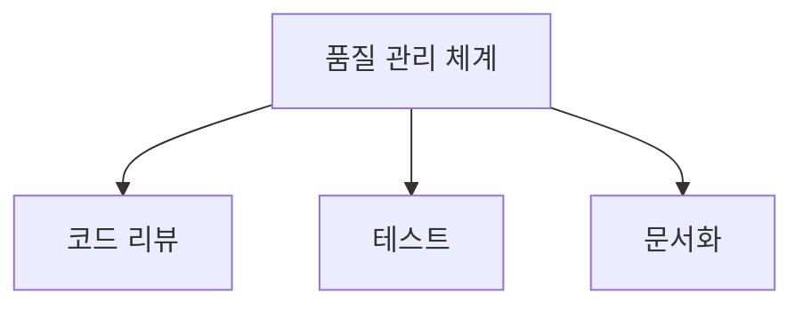

**한 줄 요약**: [다이어그램을 한 문장으로 요약]

**세부 내용**:
[상세 내용]

---

## 6. 예상 일정 및 인력

### 6.1 프로젝트 일정 (WBS)

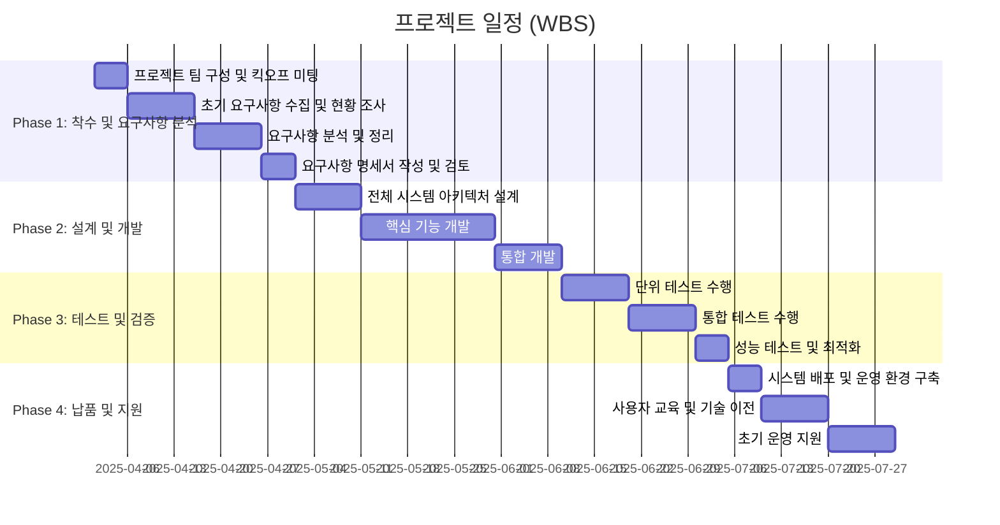

**한 줄 요약**: [다이어그램을 한 문장으로 요약 - 예: "2025년 4월부터 7월까지 4개월간 4단계(착수 및 요구사항 분석, 설계 및 개발, 테스트 및 검증, 납품 및 지원)로 구체적인 WBS에 따라 단계적으로 수행합니다."]

**세부 내용**:

#### Phase 1: 착수 및 요구사항 분석 ([기간])

**WBS 1.1: 프로젝트 팀 구성 및 킥오프 미팅** ([기간])
- **담당**: [담당자/역할]
- **작업 내용**: [세부 작업 항목]
- **산출물**: [산출물 목록]

**WBS 1.2: 초기 요구사항 수집 및 현황 조사** ([기간])
- **담당**: [담당자/역할]
- **작업 내용**: [세부 작업 항목]
- **산출물**: [산출물 목록]

**WBS 1.3: 요구사항 분석 및 정리** ([기간])
- **담당**: [담당자/역할]
- **작업 내용**: [세부 작업 항목]
- **산출물**: [산출물 목록]

**WBS 1.4: 요구사항 명세서 작성 및 검토** ([기간])
- **담당**: [담당자/역할]
- **작업 내용**: [세부 작업 항목]
- **산출물**: [산출물 목록]

#### Phase 2: 설계 및 개발 ([기간])

**WBS 2.1: 전체 시스템 아키텍처 설계** ([기간])
- **담당**: [담당자/역할]
- **작업 내용**: [세부 작업 항목]
- **산출물**: [산출물 목록]

**WBS 2.2: 핵심 기능 개발** ([기간])
- **담당**: [담당자/역할]
- **작업 내용**: 
  - [세부 작업 항목 1] ([기간])
  - [세부 작업 항목 2] ([기간])
- **산출물**: [산출물 목록]

**WBS 2.3: 통합 개발** ([기간])
- **담당**: [담당자/역할]
- **작업 내용**: [세부 작업 항목]
- **산출물**: [산출물 목록]

#### Phase 3: 테스트 및 검증 ([기간])

**WBS 3.1: 단위 테스트 수행** ([기간])
- **담당**: [담당자/역할]
- **작업 내용**: [세부 작업 항목]
- **산출물**: [산출물 목록]

**WBS 3.2: 통합 테스트 수행** ([기간])
- **담당**: [담당자/역할]
- **작업 내용**: [세부 작업 항목]
- **산출물**: [산출물 목록]

**WBS 3.3: 성능 테스트 및 최적화** ([기간])
- **담당**: [담당자/역할]
- **작업 내용**: [세부 작업 항목]
- **산출물**: [산출물 목록]

#### Phase 4: 납품 및 지원 ([기간])

**WBS 4.1: 시스템 배포 및 운영 환경 구축** ([기간])
- **담당**: [담당자/역할]
- **작업 내용**: [세부 작업 항목]
- **산출물**: [산출물 목록]

**WBS 4.2: 사용자 교육 및 기술 이전** ([기간])
- **담당**: [담당자/역할]
- **작업 내용**: [세부 작업 항목]
- **산출물**: [산출물 목록]

**WBS 4.3: 초기 운영 지원** ([기간])
- **담당**: [담당자/역할]
- **작업 내용**: [세부 작업 항목]
- **산출물**: [산출물 목록]

**⚠️ 중요**: 제안서는 예상 일정이므로 Phase별로 구분하고, 각 Phase 내에 WBS X.Y 형식의 작업 항목을 포함해야 합니다. 각 WBS 항목에는 담당자/역할, 작업 내용(세부 작업 항목), 산출물이 필수로 포함되어야 합니다.

### 6.2 인력 구성

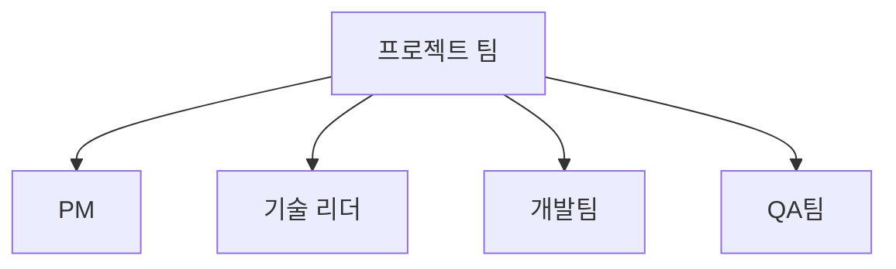

**한 줄 요약**: [다이어그램을 한 문장으로 요약]

**세부 내용**:
[인력 구성 상세 설명]

### 6.3 역할 및 책임

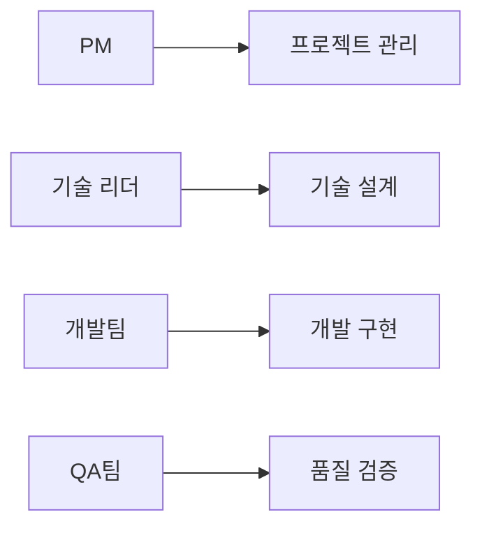

**한 줄 요약**: [다이어그램을 한 문장으로 요약]

**세부 내용**:
[역할 및 책임 상세 설명]

---

## 7. 예상 비용

### 7.1 비용 구성

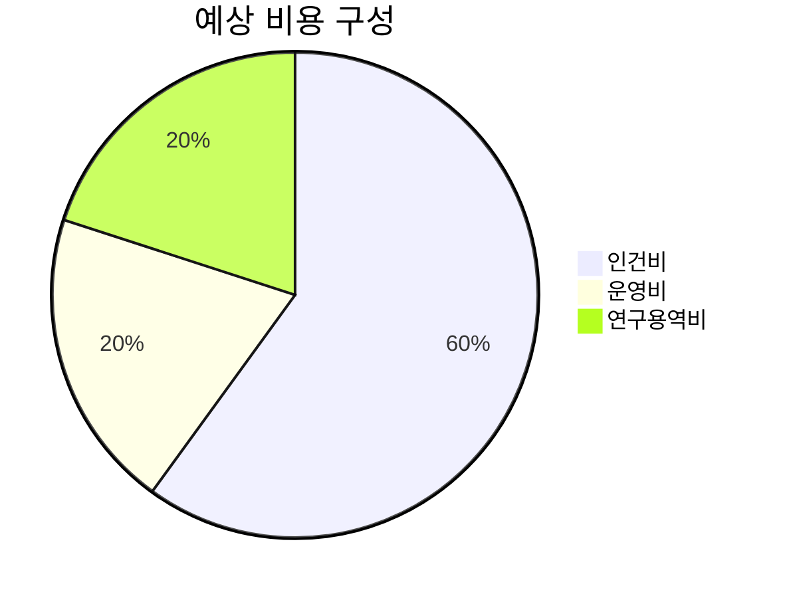

**한 줄 요약**: [다이어그램을 한 문장으로 요약]

**세부 내용**:
[비용 구성 상세 설명]

### 7.2 비용 상세

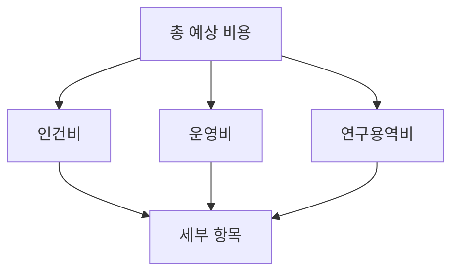

**한 줄 요약**: [다이어그램을 한 문장으로 요약]

**세부 내용**:
[비용 상세 설명]

---

## 8. 기대 효과 및 KPI

### 8.1 기술적 효과

```mermaid
graph LR
    A[기술 개발] --> B[성능 향상]
    B --> C[기술 혁신]
```

**한 줄 요약**: [다이어그램을 한 문장으로 요약]

**세부 내용**:
[기술적 성과, 성능 지표, 정확도, 안정성 등을 상세히 설명]

### 8.2 비즈니스 효과

```mermaid
graph TD
    A[비용 절감] --> B[효율 향상]
    B --> C[경쟁력 강화]
    C --> D[시장 확대]
```

**한 줄 요약**: [다이어그램을 한 문장으로 요약]

**세부 내용**:
[비즈니스 가치, 비용 절감 효과, 효율 향상, 수익 증대 등을 상세히 설명]

### 8.3 사회적 효과

```mermaid
graph LR
    A[사회적 가치] --> B[공공 복리]
    B --> C[지속가능 발전]
```

**한 줄 요약**: [다이어그램을 한 문장으로 요약]

**세부 내용**:
[사회적 가치, 공공 복리, 지속가능성 등을 상세히 설명]

### 8.4 KPI 및 성과 측정 계획

```mermaid
graph LR
    A[KPI 체계] --> B[기술 KPI]
    A --> C[비즈니스 KPI]
    A --> D[사회적 KPI]
    B --> E[측정 방법]
    C --> E
    D --> E
    E --> F[대시보드]
```

**한 줄 요약**: [다이어그램을 한 문장으로 요약]

**세부 내용**:
- **기술 KPI**: [응답 시간, 처리량, 정확도, 가동률 등]
- **비즈니스 KPI**: [ROI, 비용 절감률, 사용자 만족도 등]
- **사회적 KPI**: [공공 가치, 지속가능성 지표 등]
- **측정 방법**: [KPI 측정 방법 및 도구]
- **대시보드**: [대시보드 및 모니터링 체계]

---

## 부록

### 회사 정보

| 항목 | 내용 |
|------|------|
| 회사명 | [회사명] |
| 사업자등록번호 | [사업자등록번호] |
| 주소 | [주소] |
| 책임자 | [책임자명] ([직위]) |
| 실무책임자 | [실무책임자명] ([직위]) |

---

**생성 일시**: [날짜]
**작성자**: [회사명]

