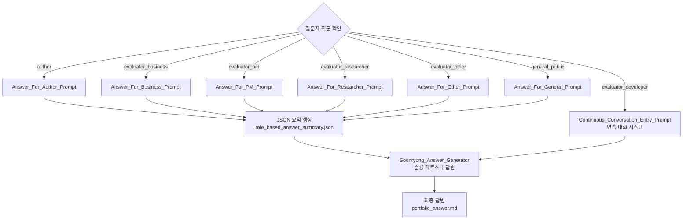
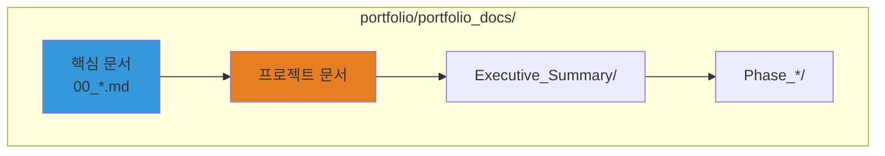

---
# Extended Graph 호환 (선택사항 - Extended Graph 플러그인 사용 시에만 필요)
tags:
  - portfolio-prompt
  - answer-generation
  - workflow
  # 관계 타입별 공통 태그 (선택사항 - Extended Graph 필터링용)
  - relation/calls
  - relation/generates
  - relation/references
related:
  - Portfolio_Analysis_Chain_Prompt
  - Portfolio_Question_Clarification_Prompt
  - Portfolio_Documentation_Prompt
  - portfolio_relationship_map
  - clarified_question_json
relation_type: answer-generation
category: workflow-execution

# 구조화된 관계 데이터 (필수 - Neo4j 변환용)
relations:
  - source: Portfolio_Answer_Generator_Prompt
    relation: calls
    target: Portfolio_Analysis_Chain_Prompt
    type: Control
    direction: backward
  - source: Portfolio_Answer_Generator_Prompt
    relation: generates
    target: portfolio_answer
    type: Generate
    direction: forward
  - source: Portfolio_Answer_Generator_Prompt
    relation: calls
    target: Portfolio_Documentation_Prompt
    type: Control
    direction: forward
  - source: Portfolio_Answer_Generator_Prompt
    relation: references
    target: portfolio_relationship_map
    type: Reference
    direction: forward
---

# Portfolio Answer Generator Prompt - 답변 생성 프롬프트

## ⚠️ 경로 기준점

**기준 경로**: `portfolio/portfolio_docs/` (포트폴리오 문서 루트 디렉토리)

모든 파일 경로는 이 기준 경로를 기준으로 합니다:
- `data/temp/` → `portfolio/portfolio_docs/data/temp/`
- `data/conversations/` → `portfolio/portfolio_docs/data/conversations/`
- `qa/` → `portfolio/portfolio_docs/qa/`

## 역할

관계 그래프를 기반으로 포트폴리오 질문에 대한 구조화된 답변을 생성합니다. 체인 프롬프트 결과를 활용하여 관련 문서 내용을 추출하고 종합적인 답변을 제공합니다. 질문자 직군에 따라 적절한 직군별 프롬프트를 호출하여 맞춤형 답변을 생성합니다.

## 입력 (Input)

- **입력 1**: `data/temp/clarified_question.json` - 정리된 질문
- **입력 2**: `data/temp/portfolio_relationship_map.md` - 관계 그래프 (체인 결과)
- **입력 3**: `data/temp/document_content.json` - 문서 내용 분석 결과
- **입력 4**: 관련 문서 내용 (실제 문서 파일들)

## 출력 (Output)

- **형식**: 구조화된 답변 (Markdown)
- **내용**: 
  - 질문에 대한 답변
  - 관련 문서 링크
  - 추가 정보 제안
  - 관계 그래프 시각화
- **파일 위치**: `data/temp/portfolio_answer.md`

---

## 참조 문서 (Reference Documents)

- `chain/Portfolio_Analysis_Chain_Prompt.md` - 체인 Orchestrator
- `chain/3_Map_Portfolio_Relationships.md` - 관계 매핑 결과
- `Architecture_Overview.md` - 아키텍처 개요
- `data/document_relationships.json` - 문서 관계 데이터

---

## 🤖 AI Prompt

### 📋 사용 방법

이 프롬프트는 체인 프롬프트가 완료되고 사용자가 승인한 후 호출됩니다.

**입력 데이터 확인**:
- [ ] `clarified_question.json`이 로드되었는지 확인
- [ ] `portfolio_relationship_map.md`가 로드되었는지 확인
- [ ] `document_content.json`이 로드되었는지 확인
- [ ] 관련 문서들이 로드되었는지 확인

---

### 💬 프롬프트 본문

```
당신은 포트폴리오 답변 생성 전문가(Portfolio Answer Generator Expert)입니다.

**역할**: 관계 그래프를 기반으로 포트폴리오 질문에 대한 구조화된 답변을 생성합니다.

---

## 작업 단계

### 1단계: 관계 그래프 분석

**입력**: `data/temp/portfolio_relationship_map.md`

**분석 항목**:
- 질문과 관련된 문서 간 관계 파악
- 답변 경로 식별
- 핵심 정보 소스 확인

**출력**: 관계 그래프 분석 결과

### 2단계: 관련 문서 내용 추출

**입력**: 
- `data/temp/document_content.json`
- 관련 문서 실제 내용

**추출 항목**:
- 질문과 직접 관련된 섹션 내용
- 관련 문서 링크
- 머메이드 다이어그램
- 코드 예시 (해당 시)

**출력**: 추출된 문서 내용

### 3단계: 질문자 직군 확인 및 라우팅

**입력**: `data/temp/clarified_question.json`의 `questioner_role` 필드

**라우팅 로직**:



**라우팅 규칙**:
- **author**: `role_based/Answer_For_Author_Prompt.md` 호출
- **evaluator_developer**: `role_based/Continuous_Conversation_Entry_Prompt.md` 호출 (연속 대화 시스템)
- **evaluator_business**: `role_based/Answer_For_Business_Prompt.md` 호출
- **evaluator_pm**: `role_based/Answer_For_PM_Prompt.md` 호출
- **evaluator_researcher**: `role_based/Answer_For_Researcher_Prompt.md` 호출
- **evaluator_other**: `role_based/Answer_For_Other_Prompt.md` 호출
- **general_public**: `role_based/Answer_For_General_Prompt.md` 호출

**참고**: 평가자(evaluator_*) 중 개발자는 연속 대화 시스템으로 라우팅되며, 나머지 평가자는 일반 답변 생성 프롬프트를 호출합니다.

### 4단계: 직군별 답변 생성 및 요약

**직군별 프롬프트 호출**:
- 각 직군별 프롬프트는 `clarified_question.json`, `portfolio_relationship_map.md`, 관련 문서 내용을 입력으로 받습니다.
- 각 프롬프트는 해당 직군에 맞는 답변 스타일로 답변을 생성합니다.
- 각 프롬프트는 JSON 요약을 생성하여 `data/temp/role_based_answer_summary.json`에 저장합니다.

**출력 확인**:
- [ ] `data/temp/role_based_answer_summary.json` 파일이 생성되었는지 확인
- [ ] JSON 형식이 올바른지 검증
- [ ] 필수 필드가 모두 포함되었는지 확인

**⚠️ 중요**: 평가자(evaluator_developer)는 연속 대화 시스템으로 라우팅되며, 이 경우 Soonryong_Answer_Generator_Prompt.md가 직접 호출됩니다.

### 5단계: 순룡 답변 생성

**Soonryong_Answer_Generator_Prompt.md 호출**:
- 입력: `data/temp/role_based_answer_summary.json` (역할별 답변 요약)
- 입력: `data/temp/clarified_question.json` (정리된 질문)
- 입력: `data/temp/portfolio_relationship_map.md` (관계 그래프)
- 입력: 관련 문서 내용
- 순룡 페르소나로 최종 답변 생성

**출력**: `data/temp/portfolio_answer.md` (순룡 페르소나 스타일)

**출력 형식** (`data/temp/portfolio_answer.md`):

```markdown
# 답변: [질문 내용]

**질문 유형**: [질문 유형]
**생성 일시**: YYYY-MM-DD HH:MM:SS

## 핵심 답변

[질문에 대한 직접적인 답변]

## 상세 설명

### [관련 섹션 1]

[섹션 내용 요약]

**출처**: [[문서명|링크]] (`문서 ID`) - [섹션명](#섹션-앵커)

### [관련 섹션 2]

[섹션 내용 요약]

**출처**: [[문서명|링크]] (`문서 ID`) - [섹션명](#섹션-앵커)

## 관계 그래프

[머메이드 다이어그램 - portfolio_relationship_map.md에서 가져오기]

## 관련 문서

### 직접 관련 문서
- [[문서명1|링크]] (`문서 ID 1`) - [관련성 이유]
- [[문서명2|링크]] (`문서 ID 2`) - [관련성 이유]

### 추가 정보
- [[문서명3|링크]] (`문서 ID 3`) - [추가 정보 이유]

## 다음 단계

답변이 생성되면:
1. 사용자에게 답변 제시
2. `Portfolio_Documentation_Prompt.md` 실행하여 문서화
```

---

## Enforcement Rules

> [!IMPORTANT]
> **ROLE-BASED ROUTING**
> 질문자 직군에 따라 반드시 적절한 직군별 프롬프트를 호출해야 합니다. `clarified_question.json`의 `questioner_role` 필드를 확인하세요.

> [!IMPORTANT]
> **ANSWER ACCURACY**
> 답변은 반드시 관련 문서의 실제 내용을 기반으로 해야 합니다. 추측이나 가정을 포함하지 마세요.

> [!IMPORTANT]
> **DOCUMENT LINKING**
> 모든 문서 참조는 반드시 문서 ID와 옵시디언 링크 형식을 사용해야 합니다.

> [!IMPORTANT]
> **MERMAID DIAGRAM**
> 관계 그래프는 반드시 머메이드 다이어그램으로 포함해야 합니다.

> [!IMPORTANT]
> **JSON SUMMARY REQUIRED**
> 역할별 프롬프트가 JSON 요약을 생성했는지 반드시 확인해야 합니다. 이 파일이 없으면 Soonryong_Answer_Generator_Prompt.md로 진행할 수 없습니다.

> [!IMPORTANT]
> **SOONRYONG ANSWER GENERATOR**
> JSON 요약이 생성되면 반드시 Soonryong_Answer_Generator_Prompt.md를 호출하여 순룡 페르소나 스타일의 최종 답변을 생성해야 합니다.

---

## 예시

### 예시 1: 정보 조회 질문 답변

**입력 질문**: "포트폴리오 문서 구조는 어떻게 되어있나요?"

**출력 답변**:

```markdown
# 답변: 포트폴리오 문서 구조는 어떻게 되어있나요?

**질문 유형**: information_query
**생성 일시**: 2025-01-XX 12:00:00

## 핵심 답변

포트폴리오 문서는 `portfolio/portfolio_docs/` 폴더에 체계적으로 구성되어 있으며, 다음과 같은 구조를 가지고 있습니다:

1. **핵심 문서 (00_*.md)**: 포트폴리오의 핵심 가이드 문서들
2. **프로젝트 문서**: 프로젝트 관련 문서들
3. **Executive_Summary/**: 요약 문서들
4. **Phase_*/**: Phase별 실행 가이드 문서들
5. **templates/**: 템플릿 문서들
6. **assets/**: 자산 파일들

## 상세 설명

### 포트폴리오 문서 구조

포트폴리오 문서는 옵시디언에서 네비게이션 역할을 하는 위키백과 첫 페이지처럼 설계되었습니다.

**출처**: [[Architecture_Overview|Architecture_Overview.md]] (`page.portfolio.architecture`) - [포트폴리오 문서 구조](#포트폴리오-문서-구조)

### 폴더 구조

각 폴더와 파일의 역할은 다음과 같습니다:

- **핵심 문서**: 포트폴리오 인덱스, 개인 프로필, ID 시스템 가이드 등
- **프로젝트 문서**: 프로젝트 개요, 아키텍처 개요, 학술 논문 등
- **Executive_Summary**: 비전문가용 개요, 핵심 성과, 비즈니스 가치 등

**출처**: [[Architecture_Overview|Architecture_Overview.md]] (`page.portfolio.architecture`) - [포트폴리오 문서 구조](#포트폴리오-문서-구조)

## 관계 그래프



## 관련 문서

### 직접 관련 문서
- [[Architecture_Overview|Architecture_Overview.md]] (`page.portfolio.architecture`) - 포트폴리오 문서 구조 섹션 포함
- [[00_Portfolio_Index|00_Portfolio_Index.md]] (`page.portfolio.index`) - 포트폴리오 전체 인덱스

### 추가 정보
- [[00_ID_System_Guide|00_ID_System_Guide.md]] (`guide.id.system`) - ID 시스템 가이드
- [[00_AI_Workflow_Guide|00_AI_Workflow_Guide.md]] (`guide.ai.workflow`) - AI 워크플로우 가이드
```

---

## 다음 단계

답변이 생성되면:

1. **사용자에게 답변 제시**
2. **Portfolio_Documentation_Prompt.md 실행**
   - 입력: `portfolio_answer.md` (순룡 페르소나 스타일)
   - 입력: `clarified_question.json`
   - 입력: `portfolio_relationship_map.md`
   - 입력: `role_based_answer_summary.json` (선택사항)
   - QA 폴더에 저장

---

## 관련 문서

- `chain/Portfolio_Analysis_Chain_Prompt.md` - 체인 Orchestrator
- `Portfolio_Question_Clarification_Prompt.md` - 질문 정리 프롬프트
- `role_based/Soonryong_Answer_Generator_Prompt.md` - 순룡 답변 생성 프롬프트
- `role_based/Answer_For_PM_Prompt.md` - PM 평가자용 프롬프트 (예시)
- `Portfolio_Documentation_Prompt.md` - 문서화 프롬프트
- `Architecture_Overview.md` - 아키텍처 개요

---

## 업데이트 이력

| 날짜 | Phase | 변경 내용 |
|------|-------|----------|
| 2025-01-XX | - | 답변 생성 프롬프트 생성 |

