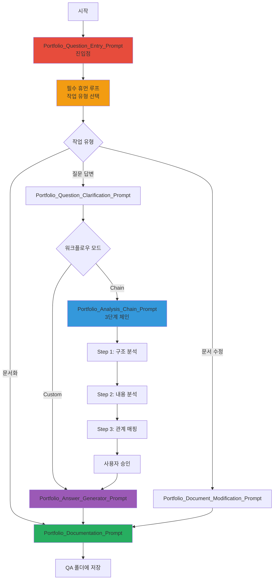

---
# Extended Graph 호환 (선택사항 - Extended Graph 플러그인 사용 시에만 필요)
tags:
  - portfolio-prompt
  - entry-point
  - workflow
  # 관계 타입별 공통 태그 (선택사항 - Extended Graph 필터링용)
  - relation/orchestrated_by
  - relation/references
related:
  - Portfolio_Question_Entry_Prompt
  - Portfolio_Analysis_Chain_Prompt
  - Architecture_Overview
relation_type: portfolio-prompt-entry
category: workflow-execution

# 구조화된 관계 데이터 (필수 - Neo4j 변환용)
relations:
  - source: Portfolio_Prompts_README
    relation: references
    target: Portfolio_Question_Entry_Prompt
    type: Reference
    direction: forward
  - source: Portfolio_Prompts_README
    relation: references
    target: Portfolio_Analysis_Chain_Prompt
    type: Reference
    direction: forward
---

# 포트폴리오 질문 시스템 사용 가이드

## 📄 문서 요약 (Document Summary)

### 🔑 핵심 키워드 (Keywords)
- 포트폴리오 질문 시스템
- 체인 프롬프트
- 질문 답변 / 문서 수정 / 문서화
- 휴먼 루프

### 📝 세부 요약 (Detailed Summary)
포트폴리오 질문 시스템은 포트폴리오에 대한 질문을 답변하고, 문서를 수정하거나 문서화하는 프롬프트 시스템입니다. development 폴더의 프롬프트 구조를 참조하여 구축되었으며, 휴먼 루프를 포함하고 있습니다. **포트폴리오 언급 시 자동으로 휴먼 루프가 트리거되어 클로드 에이전트화에 최적화되어 있습니다.**

### ⚡ 간단 요약 (Quick Summary)
**포트폴리오 질문 시스템 진입 시 필수 휴먼 루프를 통한 작업 유형 선택 및 체인 프롬프트 실행**

---

## 🚀 빠른 시작

### 1. 진입점 프롬프트 실행

**필수**: `Portfolio_Question_Entry_Prompt.md`를 먼저 읽어야 합니다.

이 프롬프트는:
- 사용자 질문 수신
- 필수 휴먼 루프를 통한 작업 유형 선택
- 선택에 따른 라우팅

### 2. 작업 유형 선택

**3가지 옵션**:
1. **질문 답변** (question_answer): 포트폴리오에 대한 질문 답변
2. **문서 수정** (document_modification): 포트폴리오 문서 수정
3. **문서화** (documentation): 질문과 답변 문서화

### 3. 워크플로우 모드 선택

**2가지 모드**:
1. **체인 워크플로우** (chain_workflow): 3단계 체인 프롬프트 실행
2. **커스텀 워크플로우** (custom_workflow): 필요한 프롬프트 직접 실행

---

## 📋 프롬프트 실행 순서

### 질문 답변 워크플로우 (체인)

1. **Portfolio_Question_Entry_Prompt.md** (진입점)
   - 휴먼 루프: 작업 유형 선택
   - 선택: `question_answer` + `chain_workflow`

2. **Portfolio_Question_Clarification_Prompt.md** (질문 정리)
   - 질문 분석 및 정리
   - 관련 문서 식별
   - 출력: `data/temp/clarified_question.json`

3. **Portfolio_Analysis_Chain_Prompt.md** (체인 Orchestrator)
   - Step 1: `chain/1_Analyze_Portfolio_Structure.md` 실행
   - Step 2: `chain/2_Analyze_Document_Content.md` 실행
   - Step 3: `chain/3_Map_Portfolio_Relationships.md` 실행
   - 사용자 승인 대기

4. **Portfolio_Answer_Generator_Prompt.md** (답변 생성)
   - 관계 그래프 기반 답변 생성
   - 출력: `data/temp/portfolio_answer.md`

5. **Portfolio_Documentation_Prompt.md** (문서화)
   - 질문과 답변 문서화
   - QA 폴더에 저장

### 질문 답변 워크플로우 (커스텀)

1. **Portfolio_Question_Entry_Prompt.md** (진입점)
   - 선택: `question_answer` + `custom_workflow`

2. **Portfolio_Question_Clarification_Prompt.md** (질문 정리)
   - 질문 분석 및 정리

3. **Portfolio_Answer_Generator_Prompt.md** (답변 생성)
   - 관련 문서 내용 기반 답변 생성

4. **Portfolio_Documentation_Prompt.md** (문서화)
   - 질문과 답변 문서화

### 문서 수정 워크플로우

1. **Portfolio_Question_Entry_Prompt.md** (진입점)
   - 선택: `document_modification`

2. **Portfolio_Document_Modification_Prompt.md** (문서 수정)
   - 문서 수정 수행
   - 변경 리포트 생성

3. **Portfolio_Documentation_Prompt.md** (문서화)
   - 변경 사항 문서화

---

## 🔗 주요 프롬프트

### 진입점

- **Portfolio_Question_Entry_Prompt.md**: 포트폴리오 질문 시스템 진입점
  - 필수 휴먼 루프
  - 작업 유형 선택
  - 라우팅

### 질문 처리

- **Portfolio_Question_Clarification_Prompt.md**: 질문 정리
  - 질문 분석
  - 관련 문서 식별
  - 질문 유형 분류

### 체인 프롬프트

- **Portfolio_Analysis_Chain_Prompt.md**: 체인 Orchestrator
  - 3단계 체인 실행 관리
  - 사용자 승인 대기

- **chain/1_Analyze_Portfolio_Structure.md**: 포트폴리오 구조 분석
  - 폴더 구조 분석
  - 문서 타입 식별

- **chain/2_Analyze_Document_Content.md**: 문서 내용 분석
  - 섹션 구조 분석
  - 관련 내용 추출

- **chain/3_Map_Portfolio_Relationships.md**: 관계 매핑
  - 문서 간 관계 매핑
  - 머메이드 다이어그램 생성

### 답변 및 문서화

- **Portfolio_Answer_Generator_Prompt.md**: 답변 생성
  - 관계 그래프 기반 답변 생성
  - 관련 문서 링크 제공

- **Portfolio_Documentation_Prompt.md**: 문서화
  - 질문과 답변 문서화
  - QA 폴더에 저장

### 문서 수정

- **Portfolio_Document_Modification_Prompt.md**: 문서 수정
  - 문서 수정 수행
  - Architecture_Overview.md 업데이트

---

## 📂 파일 구조

```
portfolio/portfolio_docs/
├── prompts/
│   ├── Portfolio_Question_Entry_Prompt.md (진입점)
│   ├── Portfolio_Question_Clarification_Prompt.md
│   ├── Portfolio_Answer_Generator_Prompt.md
│   ├── Portfolio_Documentation_Prompt.md
│   ├── Portfolio_Document_Modification_Prompt.md
│   ├── README.md (현재 문서)
│   └── chain/
│       ├── Portfolio_Analysis_Chain_Prompt.md (Orchestrator)
│       ├── 1_Analyze_Portfolio_Structure.md
│       ├── 2_Analyze_Document_Content.md
│       └── 3_Map_Portfolio_Relationships.md
├── data/
│   ├── architecture_structure.json
│   ├── document_relationships.json
│   ├── qa_history.json
│   └── temp/
│       ├── clarified_question.json (Step 1 출력)
│       ├── portfolio_structure.json (Step 2 출력)
│       ├── document_content.json (Step 3 출력)
│       └── portfolio_relationship_map.md (Step 4 출력)
└── qa/
    ├── 2025-01-XX_architecture_overview/
    │   └── [질문_요약].md
    └── ...
```

---

## 🔄 전체 워크플로우 다이어그램



---

## 🎯 사용 예시

### 예시 1: 질문 답변 (체인 워크플로우)

```
1. Portfolio_Question_Entry_Prompt 실행
   - 선택: question_answer + chain_workflow
   - 질문: "포트폴리오 문서 구조는?"

2. Portfolio_Question_Clarification_Prompt 실행
   - 질문 정리 및 관련 문서 식별

3. Portfolio_Analysis_Chain_Prompt 실행
   - Step 1: 포트폴리오 구조 분석
   - Step 2: 문서 내용 분석
   - Step 3: 관계 매핑
   - 사용자 승인

4. Portfolio_Answer_Generator_Prompt 실행
   - 답변 생성

5. Portfolio_Documentation_Prompt 실행
   - 문서화 및 저장
```

### 예시 2: 문서 수정

```
1. Portfolio_Question_Entry_Prompt 실행
   - 선택: document_modification
   - 수정 요청: "Architecture_Overview.md에 새 섹션 추가"

2. Portfolio_Document_Modification_Prompt 실행
   - 문서 수정 수행
   - 변경 리포트 생성

3. Portfolio_Documentation_Prompt 실행
   - 변경 사항 문서화
```

---

## 📚 데이터 파일

### 입력 데이터

- `data/architecture_structure.json`: 아키텍처 구조 데이터
- `data/document_relationships.json`: 문서 관계 데이터
- `Architecture_Overview.md`: 아키텍처 개요

### 중간 데이터 (temp/)

- `data/temp/clarified_question.json`: 정리된 질문
- `data/temp/portfolio_structure.json`: 포트폴리오 구조 분석 결과
- `data/temp/document_content.json`: 문서 내용 분석 결과
- `data/temp/portfolio_relationship_map.md`: 관계 그래프

### 출력 데이터

- `data/temp/portfolio_answer.md`: 생성된 답변
- `data/qa_history.json`: QA 히스토리
- `qa/[날짜]_[질문_폴더명]/[질문_요약].md`: 문서화된 질문-답변

---

## 🔧 클로드 에이전트화

### 메타데이터 구조

각 프롬프트는 Extended Graph 호환 메타데이터를 포함합니다:

```yaml
---
tags:
  - portfolio-prompt
  - [카테고리]
relation_type: [관계 타입]
category: [카테고리]
relations:
  - source: [소스]
    relation: [관계]
    target: [타겟]
    type: [타입]
    direction: [방향]
---
```

### Function Call 스키마

각 프롬프트는 명확한 Function Call 스키마를 정의합니다.

### 실행 순서

프롬프트 실행 순서는 이 README.md에 정의되어 있으며, 에이전트가 자동으로 따라갈 수 있습니다.

---

## 🔗 관련 문서

- `Portfolio_Question_Entry_Prompt.md` - 진입점 프롬프트
- `Architecture_Overview.md` - 아키텍처 개요 (네비게이션 허브)
- `00_ID_System_Guide.md` - ID 시스템 가이드
- `00_AI_Workflow_Guide.md` - AI 워크플로우 가이드

---

## 업데이트 이력

| 날짜 | Phase | 변경 내용 |
|------|-------|----------|
| 2025-01-XX | - | 포트폴리오 질문 시스템 사용 가이드 생성 |

