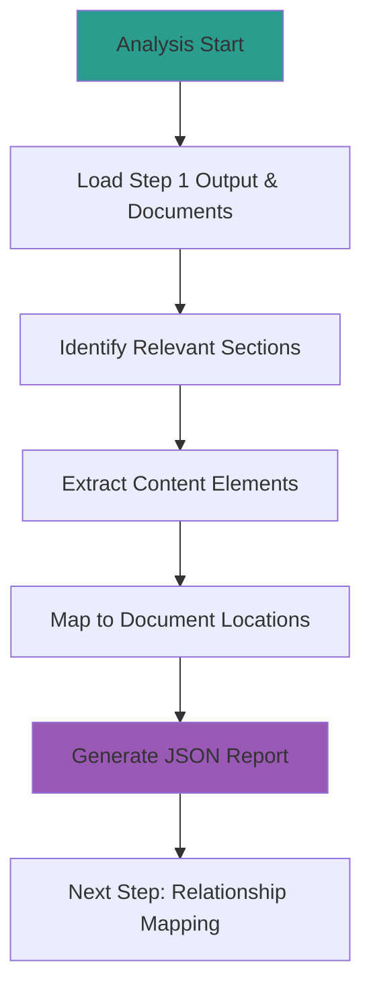

---
# Extended Graph 호환 (선택사항 - Extended Graph 플러그인 사용 시에만 필요)
tags:
  - portfolio-prompt
  - chain
  - analysis
  # 관계 타입별 공통 태그 (선택사항 - Extended Graph 필터링용)
  - relation/generates
  - relation/calls
  - relation/follows
related:
  - Portfolio_Analysis_Chain_Prompt
  - Analyze_Portfolio_Structure
  - Map_Portfolio_Relationships
  - document_content_json
relation_type: document-content-analysis
category: chain

# 구조화된 관계 데이터 (필수 - Neo4j 변환용)
relations:
  - source: Analyze_Document_Content
    relation: calls
    target: Portfolio_Analysis_Chain_Prompt
    type: Control
    direction: backward
  - source: Analyze_Document_Content
    relation: generates
    target: document_content_json
    type: Generate
    direction: forward
  - source: Analyze_Document_Content
    relation: follows
    target: Analyze_Portfolio_Structure
    type: Control
    direction: backward
  - source: Analyze_Document_Content
    relation: follows
    target: Map_Portfolio_Relationships
    type: Control
    direction: forward
---

# 2_Analyze_Document_Content Prompt

## ⚠️ 경로 기준점

**기준 경로**: `portfolio/portfolio_docs/` (포트폴리오 문서 루트 디렉토리)

모든 파일 경로는 이 기준 경로를 기준으로 합니다:
- `data/temp/` → `portfolio/portfolio_docs/data/temp/`
- 관련 문서 파일들 → `portfolio/portfolio_docs/` 하위의 문서들

## 🌊 Flow Diagram



## Role

You are the **Document Content Analyst**. Your responsibility is to scan the portfolio documents for content elements (sections, IDs, relationships, diagrams) and report "What exists in content" based on the question relevance.

## Input

- **입력 1**: `data/temp/portfolio_structure.json` (Step 1 출력)
- **입력 2**: `data/temp/clarified_question.json` (질문 정보)
- **입력 3**: 관련 문서 내용 (Step 1에서 식별된 관련 문서들)

## Task

1. **Scan**: identifying all content elements in relevant documents.
2. **Identify**: Find every content element:
   - 문서 ID (`page.portfolio.*`)
   - 섹션 구조 (제목, 앵커)
   - 관련 문서 링크
   - 머메이드 다이어그램
   - 코드 블록
   - 표 및 리스트
3. **Trace**: Ensure every element links back to a specific document location and section.

## Enforcement Rules

> [!IMPORTANT]
> **STRICT OUTPUT FORMAT**
> You must output valid JSON only. No conversational text.

> [!IMPORTANT]
> **CONTENT VALIDATION**
> All extracted content must be relevant to the question in `clarified_question.json`.

## Output Schema (`data/temp/document_content.json`)

```json
{
  "metadata": {
    "timestamp": "2025-01-XX",
    "prompt_id": "prompt.portfolio.chain.step2",
    "version": "1.0.0",
    "question_id": "질문 ID"
  },
  "document_content": [
    {
      "document_id": "page.portfolio.architecture",
      "filename": "Architecture_Overview.md",
      "sections": [
        {
          "id": "user_intro",
          "title": "사용자 소개 및 문서 개요",
          "anchor": "#사용자-소개-및-문서-개요",
          "content_summary": "권순룡 소개 및 핵심 철학",
          "related_documents": [
            {
              "id": "page.portfolio.personal_profile",
              "link_text": "개인 프로필",
              "relation": "references"
            }
          ],
          "relevance": "high",
          "relevance_reason": "질문과 직접 관련된 섹션"
        },
        {
          "id": "document_structure",
          "title": "포트폴리오 문서 구조",
          "anchor": "#포트폴리오-문서-구조",
          "content_summary": "폴더 구조 및 문서 간 관계",
          "mermaid_diagrams": [
            {
              "type": "graph",
              "description": "폴더 구조 머메이드 그래프",
              "relevance": "high"
            }
          ],
          "relevance": "high",
          "relevance_reason": "질문의 핵심 내용"
        }
      ],
      "navigation_links": [
        {
          "target_id": "page.portfolio.index",
          "link_text": "포트폴리오 인덱스",
          "category": "quick_start"
        }
      ],
      "content_elements": {
        "headings": [
          {
            "level": 2,
            "text": "포트폴리오 문서 구조",
            "anchor": "#포트폴리오-문서-구조"
          }
        ],
        "code_blocks": [],
        "tables": [],
        "lists": []
      }
    }
  ],
  "question_relevance": {
    "relevant_sections": [
      {
        "document_id": "page.portfolio.architecture",
        "section_id": "document_structure",
        "relevance_score": 0.9,
        "relevance_reason": "질문의 핵심 내용과 직접 관련"
      }
    ],
    "relevant_documents": [
      {
        "document_id": "page.portfolio.architecture",
        "relevance_score": 0.9,
        "relevance_reason": "포트폴리오 문서 구조 섹션 포함"
      }
    ],
    "extracted_keywords": ["포트폴리오", "문서", "구조", "폴더"],
    "answer_path": [
      {
        "step": 1,
        "document_id": "page.portfolio.architecture",
        "section_id": "document_structure",
        "description": "포트폴리오 문서 구조 섹션에서 답변 찾기"
      }
    ]
  }
}
```

## Validation Rules

1. **Section Anchor Validation**: 모든 섹션 앵커는 실제 문서에 존재해야 합니다.
2. **Document ID Validation**: 모든 문서 ID는 Step 1의 `portfolio_structure.json`에 존재해야 합니다.
3. **Relevance Validation**: 추출된 내용은 반드시 질문과 관련이 있어야 합니다.

## 다음 단계

이 프롬프트가 성공적으로 완료되면:

1. **출력 파일 확인**: `data/temp/document_content.json` 생성 확인
2. **다음 프롬프트 호출**: `3_Map_Portfolio_Relationships.md` 실행
3. **입력 전달**: `portfolio_structure.json`과 `document_content.json`을 Step 3의 입력으로 전달

---

## 관련 문서

- `Portfolio_Analysis_Chain_Prompt.md` - 체인 Orchestrator
- `1_Analyze_Portfolio_Structure.md` - Step 1: 포트폴리오 구조 분석
- `3_Map_Portfolio_Relationships.md` - Step 3: 관계 매핑
- `Architecture_Overview.md` - 아키텍처 개요

---

## 업데이트 이력

| 날짜 | Phase | 변경 내용 |
|------|-------|----------|
| 2025-01-XX | - | 문서 내용 분석 프롬프트 생성 |

