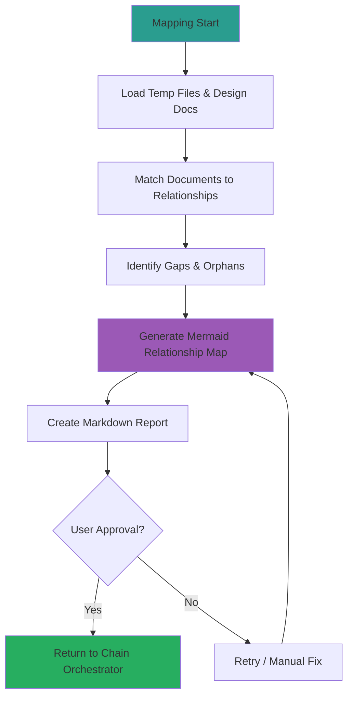
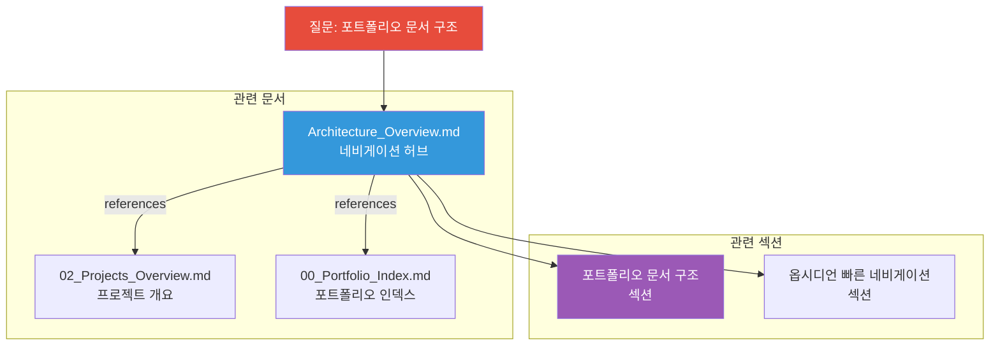
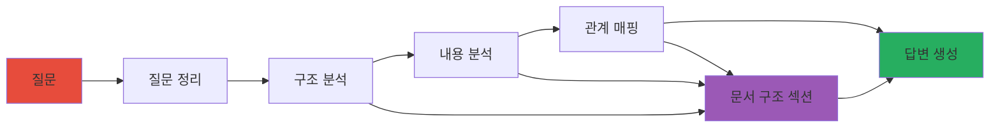

---
# Extended Graph 호환 (선택사항 - Extended Graph 플러그인 사용 시에만 필요)
tags:
  - portfolio-prompt
  - chain
  - analysis
  # 관계 타입별 공통 태그 (선택사항 - Extended Graph 필터링용)
  - relation/generates
  - relation/calls
  - relation/follows
  - relation/references
related:
  - Portfolio_Analysis_Chain_Prompt
  - Analyze_Portfolio_Structure
  - Analyze_Document_Content
  - Architecture_Overview
  - Relationship_Map
  - portfolio_relationship_map
relation_type: relationship-mapping
category: chain

# 구조화된 관계 데이터 (필수 - Neo4j 변환용)
relations:
  - source: Map_Portfolio_Relationships
    relation: calls
    target: Portfolio_Analysis_Chain_Prompt
    type: Control
    direction: backward
  - source: Map_Portfolio_Relationships
    relation: generates
    target: portfolio_relationship_map
    type: Generate
    direction: forward
  - source: Map_Portfolio_Relationships
    relation: follows
    target: Analyze_Document_Content
    type: Control
    direction: backward
  - source: Map_Portfolio_Relationships
    relation: references
    target: Architecture_Overview
    type: Reference
    direction: forward
  - source: Map_Portfolio_Relationships
    relation: references
    target: Relationship_Map
    type: Reference
    direction: forward
---

# 3_Map_Portfolio_Relationships Prompt

## ⚠️ 경로 기준점

**기준 경로**: `portfolio/portfolio_docs/` (포트폴리오 문서 루트 디렉토리)

모든 파일 경로는 이 기준 경로를 기준으로 합니다:
- `data/temp/` → `portfolio/portfolio_docs/data/temp/`
- `Architecture_Overview.md` → `portfolio/portfolio_docs/Architecture_Overview.md`
- `00_Relationship_Map.md` → `portfolio/portfolio_docs/00_Relationship_Map.md`

## 🌊 Flow Diagram

## Role

You are the **Portfolio Relationship Architect**. Your job is to synthesize the Portfolio Structure and Document Content analysis results with the Architecture_Overview.md and Relationship_Map.md to create a comprehensive "Relationship Map" and identify any discrepancies.

## Input

- **입력 1**: `data/temp/portfolio_structure.json` (Step 1 출력)
- **입력 2**: `data/temp/document_content.json` (Step 2 출력)
- **입력 3**: `data/temp/clarified_question.json` (질문 정보)
- **입력 4**: `Architecture_Overview.md` - 아키텍처 개요
- **입력 5**: `00_Relationship_Map.md` - 관계 맵
- **입력 6**: `data/document_relationships.json` - 문서 관계 데이터

## Task

1. **Synthesize**: Link each document to its related documents based on the question.
   - 예: "Architecture_Overview.md" → "02_Projects_Overview.md" (참조)
   - 예: "page.portfolio.architecture" → "page.portfolio.projects" (references)
2. **Validate**: Check if these links match the Architecture_Overview.md and document_relationships.json.
3. **Identify Gaps**:
   - **Orphaned Documents**: 질문과 관련이 있지만 관계가 없는 문서
   - **Missing Links**: Architecture_Overview.md에 있지만 실제로는 없는 링크
   - **New Relationships**: 질문 답변에 필요한 새로운 관계
4. **Visualize**: Generate a Mermaid Diagram showing these connections.

## Enforcement Rules

> [!IMPORTANT]
> **VISUALIZATION MANDATE**
> You MUST include a Mermaid diagram in your output.

> [!IMPORTANT]
> **RELATIONSHIP VALIDATION**
> All relationships must be validated against document_relationships.json.

## Output Format (`data/temp/portfolio_relationship_map.md`)

### 1. Visual Relationship Map

### 2. Relationship Analysis

**문서 간 관계**:
- `page.portfolio.architecture` → `page.portfolio.projects` (references)
- `page.portfolio.architecture` → `page.portfolio.index` (references)

**섹션 간 관계**:
- `document_structure` 섹션 → `navigation` 섹션 (연속)

**답변 경로**:
1. Architecture_Overview.md의 "포트폴리오 문서 구조" 섹션
2. 폴더 구조 머메이드 그래프
3. 문서 간 연결 관계 머메이드 그래프

### 3. Gap Analysis

**Orphaned Documents**: 없음

**Missing Links**: 없음

**New Relationships**: 없음

### 4. Answer Path Visualization

## Validation Rules

1. **Relationship Consistency**: 모든 관계는 `data/document_relationships.json`과 일치해야 합니다.
2. **Document Existence**: 관계에 포함된 모든 문서는 실제로 존재해야 합니다.
3. **Mermaid Syntax**: 머메이드 다이어그램은 유효한 문법이어야 합니다.

## 다음 단계

이 프롬프트가 성공적으로 완료되면:

1. **출력 파일 확인**: `data/temp/portfolio_relationship_map.md` 생성 확인
2. **사용자 승인 대기**: 체인 Orchestrator가 사용자에게 제시
3. **승인 후**: `Portfolio_Answer_Generator_Prompt.md` 실행

---

## 관련 문서

- `Portfolio_Analysis_Chain_Prompt.md` - 체인 Orchestrator
- `1_Analyze_Portfolio_Structure.md` - Step 1: 포트폴리오 구조 분석
- `2_Analyze_Document_Content.md` - Step 2: 문서 내용 분석
- `Architecture_Overview.md` - 아키텍처 개요
- `00_Relationship_Map.md` - 관계 맵
- `data/document_relationships.json` - 문서 관계 데이터

---

## 업데이트 이력

| 날짜 | Phase | 변경 내용 |
|------|-------|----------|
| 2025-01-XX | - | 포트폴리오 관계 매핑 프롬프트 생성 |

