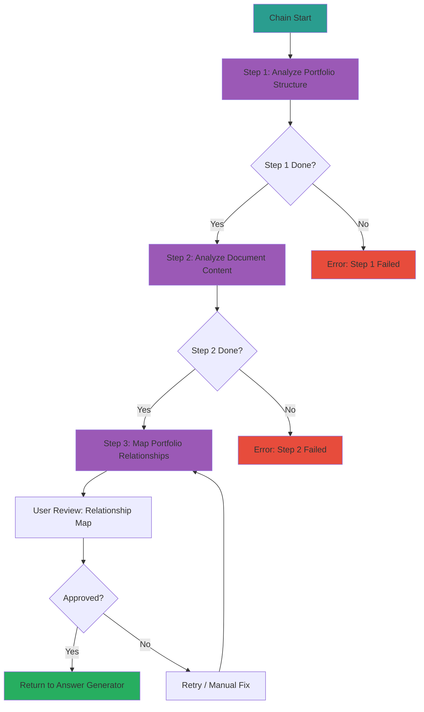

---
# Extended Graph 호환 (선택사항 - Extended Graph 플러그인 사용 시에만 필요)
tags:
  - portfolio-prompt
  - chain
  - analysis
  # 관계 타입별 공통 태그 (선택사항 - Extended Graph 필터링용)
  - relation/calls
  - relation/generates
  - relation/triggers
related:
  - Portfolio_Question_Clarification_Prompt
  - Analyze_Portfolio_Structure
  - Analyze_Document_Content
  - Map_Portfolio_Relationships
  - Portfolio_Answer_Generator_Prompt
relation_type: analysis-chain
category: chain

# 구조화된 관계 데이터 (필수 - Neo4j 변환용)
relations:
  - source: Portfolio_Analysis_Chain_Prompt
    relation: triggers
    target: Portfolio_Question_Clarification_Prompt
    type: Control
    direction: backward
  - source: Portfolio_Analysis_Chain_Prompt
    relation: calls
    target: Analyze_Portfolio_Structure
    type: Control
    direction: forward
  - source: Portfolio_Analysis_Chain_Prompt
    relation: calls
    target: Analyze_Document_Content
    type: Control
    direction: forward
  - source: Portfolio_Analysis_Chain_Prompt
    relation: calls
    target: Map_Portfolio_Relationships
    type: Control
    direction: forward
  - source: Portfolio_Analysis_Chain_Prompt
    relation: generates
    target: portfolio_relationship_map
    type: Generate
    direction: forward
---

# Portfolio Analysis Chain Prompt (Orchestrator)

## ⚠️ 경로 기준점

**기준 경로**: `portfolio/portfolio_docs/` (포트폴리오 문서 루트 디렉토리)

모든 파일 경로는 이 기준 경로를 기준으로 합니다:
- `data/temp/` → `portfolio/portfolio_docs/data/temp/`
- `Architecture_Overview.md` → `portfolio/portfolio_docs/Architecture_Overview.md`
- `data/architecture_structure.json` → `portfolio/portfolio_docs/data/architecture_structure.json`
- `data/document_relationships.json` → `portfolio/portfolio_docs/data/document_relationships.json`

## 🌊 Chain Flow Diagram

## Role

You are the **Chain Orchestrator**. You do not perform the analysis yourself. Instead, you manage the execution of the 3-step analysis chain (`prompts/chain/`).

## Task

1. **Execute Step 1**: Call `1_Analyze_Portfolio_Structure.md`.
   - Check for `data/temp/portfolio_structure.json`.
2. **Execute Step 2**: Call `2_Analyze_Document_Content.md`.
   - Check for `data/temp/document_content.json`.
3. **Execute Step 3**: Call `3_Map_Portfolio_Relationships.md`.
   - Generate `data/temp/portfolio_relationship_map.md`.
4. **Hold for Approval**: Present the `portfolio_relationship_map.md` to the user and wait for confirmation.

## Input

- **입력 1**: `data/temp/clarified_question.json` (Portfolio_Question_Clarification_Prompt 출력)
- **입력 2**: `Architecture_Overview.md`
- **입력 3**: `data/architecture_structure.json`
- **입력 4**: `data/document_relationships.json`

## Output

- **출력 1**: `data/temp/portfolio_structure.json` (Step 1 출력)
- **출력 2**: `data/temp/document_content.json` (Step 2 출력)
- **출력 3**: `data/temp/portfolio_relationship_map.md` (Step 3 출력)

## Enforcement Rules

> [!CRITICAL]
> **SEQUENCE ENFORCEMENT**
> You CANNOT skip steps. You CANNOT proceed to Step 3 without Step 1 and 2 completing successfully.
> If the user rejects the map, you MUST ask for feedback and re-run Step 3 with adjustments.

> [!IMPORTANT]
> **OUTPUT VALIDATION**
> Each step must produce valid output before proceeding to the next step.
> If any step fails, you MUST report the error and stop the chain.

## Execution Flow

### Step 1: Analyze Portfolio Structure

**프롬프트**: `chain/1_Analyze_Portfolio_Structure.md`

**입력**:
- `data/temp/clarified_question.json`
- `Architecture_Overview.md`
- `data/architecture_structure.json`

**출력 확인**:
- `data/temp/portfolio_structure.json` 파일이 생성되었는지 확인
- JSON 형식이 올바른지 검증

**성공 조건**:
- ✅ `portfolio_structure.json` 파일 존재
- ✅ JSON 형식 유효
- ✅ 필수 필드 포함 (folders, document_types)

### Step 2: Analyze Document Content

**프롬프트**: `chain/2_Analyze_Document_Content.md`

**입력**:
- `data/temp/portfolio_structure.json` (Step 1 출력)
- `data/temp/clarified_question.json`
- 관련 문서 내용

**출력 확인**:
- `data/temp/document_content.json` 파일이 생성되었는지 확인
- JSON 형식이 올바른지 검증

**성공 조건**:
- ✅ `document_content.json` 파일 존재
- ✅ JSON 형식 유효
- ✅ 필수 필드 포함 (document_content, question_relevance)

### Step 3: Map Portfolio Relationships

**프롬프트**: `chain/3_Map_Portfolio_Relationships.md`

**입력**:
- `data/temp/portfolio_structure.json` (Step 1 출력)
- `data/temp/document_content.json` (Step 2 출력)
- `Architecture_Overview.md`
- `00_Relationship_Map.md`

**출력 확인**:
- `data/temp/portfolio_relationship_map.md` 파일이 생성되었는지 확인
- 머메이드 다이어그램이 포함되어 있는지 확인

**성공 조건**:
- ✅ `portfolio_relationship_map.md` 파일 존재
- ✅ 머메이드 다이어그램 포함
- ✅ 문서 간 관계 분석 포함

### User Approval

**사용자에게 제시**:
- `data/temp/portfolio_relationship_map.md` 내용
- 관계 그래프 시각화

**사용자 선택**:
- **승인**: 다음 단계로 진행 (`Portfolio_Answer_Generator_Prompt.md`)
- **거부**: 피드백 수집 후 Step 3 재실행

## Error Handling

### Step 1 실패 시

**에러 처리**:
1. 에러 메시지 기록
2. 사용자에게 피드백 요청
3. Step 1 재실행 또는 수동 수정 옵션 제공

### Step 2 실패 시

**에러 처리**:
1. Step 1 결과 확인
2. 에러 메시지 기록
3. 사용자에게 피드백 요청
4. Step 2 재실행 또는 수동 수정 옵션 제공

### Step 3 실패 시

**에러 처리**:
1. Step 1, 2 결과 확인
2. 에러 메시지 기록
3. 사용자에게 피드백 요청
4. Step 3 재실행 또는 수동 수정 옵션 제공

## 다음 단계

체인이 성공적으로 완료되고 사용자가 승인하면:

1. **Portfolio_Answer_Generator_Prompt.md 실행**
   - 입력: `data/temp/portfolio_relationship_map.md`
   - 입력: `data/temp/clarified_question.json`
   - 답변 생성

## 관련 문서

- `Portfolio_Question_Clarification_Prompt.md` - 질문 정리 프롬프트
- `chain/1_Analyze_Portfolio_Structure.md` - Step 1: 포트폴리오 구조 분석
- `chain/2_Analyze_Document_Content.md` - Step 2: 문서 내용 분석
- `chain/3_Map_Portfolio_Relationships.md` - Step 3: 관계 매핑
- `Portfolio_Answer_Generator_Prompt.md` - 답변 생성 프롬프트

---

## 업데이트 이력

| 날짜 | Phase | 변경 내용 |
|------|-------|----------|
| 2025-01-XX | - | 포트폴리오 분석 체인 Orchestrator 생성 |

