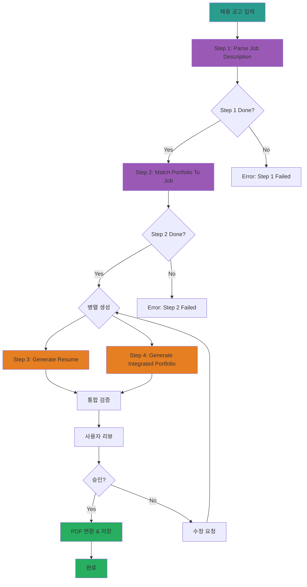
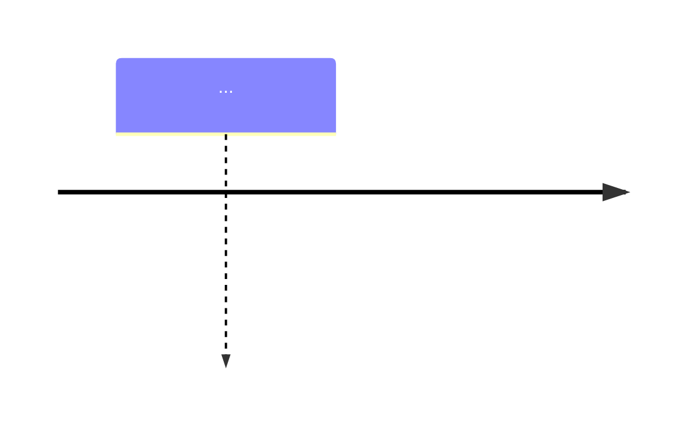
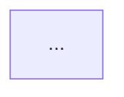

# Resume Generator System - 구현 계획서

## 📋 목표

채용 공고를 입력받아 자동으로 맞춤형 이력서와 통합 포트폴리오를 생성하는 시스템 구축

**입력**: `portfolio/docs/이력서 기본사항.txt` (채용 공고)
**출력**:
- `assets/[회사명]_이력서.md`
- `assets/[회사명]_포트폴리오_통합문서.md`

---

## 🏗️ 시스템 구조

### 폴더 구조

```
portfolio/portfolio_docs/
  └── resume_generator/
      ├── README.md                          # 사용 가이드
      ├── PLAN.md                            # 이 파일
      ├── prompts/
      │   ├── Resume_Generator_Chain_Prompt.md       # 오케스트레이터
      │   ├── 1_Parse_Job_Description.md            # Step 1: 채용 공고 파싱
      │   ├── 2_Match_Portfolio_To_Job.md           # Step 2: 포트폴리오 매칭
      │   ├── 3_Generate_Resume.md                  # Step 3: 이력서 생성
      │   └── 4_Generate_Integrated_Portfolio.md    # Step 4: 통합 포트폴리오 생성
      ├── templates/
      │   ├── Resume_Structure_Template.md          # 이력서 구조 템플릿
      │   └── Integrated_Portfolio_Structure_Template.md  # 통합 포트폴리오 템플릿
      └── data/
          └── temp/                          # 임시 데이터 저장소
              ├── job_description_analysis.json       # Step 1 출력
              ├── portfolio_job_matching.json         # Step 2 출력
              ├── resume_content.md                   # Step 3 출력
              └── integrated_portfolio_content.md     # Step 4 출력
```

---

## 🔄 워크플로우 다이어그램



---

## 🎯 각 단계별 상세 설계

### Step 1: Parse Job Description (채용 공고 파싱)

**목적**: 채용 공고를 구조화하여 요구사항, 우대사항, 기술 스택 추출

**입력**:
- `portfolio/docs/이력서 기본사항.txt` (채용 공고 원문)

**처리**:
1. 필수 요구사항 추출
2. 우대사항 추출
3. 기술 스택 추출
4. 직무 키워드 추출
5. 회사 정보 및 팀 정보 추출

**출력** (`data/temp/job_description_analysis.json`):
```json
{
  "metadata": {
    "company": "토스증권",
    "position": "Data Engineer(AI)",
    "team": "AI Silo",
    "timestamp": "2025-12-27"
  },
  "requirements": {
    "essential": [
      "5년 이상 데이터 엔지니어링 경험",
      "Python, SQL 역량",
      "Kafka 기반 스트림 프로세싱",
      "Airflow, Docker, Kubernetes 경험"
    ],
    "preferred": [
      "Agent, MCP, RAG 기반 AI 서비스 개발 경험",
      "GraphDB 활용 서비스 개발 경험",
      "최신 AI/데이터 엔지니어링 트렌드 파악"
    ]
  },
  "tech_stack": {
    "languages": ["Python", "SQL"],
    "databases": ["Hadoop", "ElasticSearch", "Neo4j", "Clickhouse"],
    "tools": ["Kafka", "Airflow", "Docker", "Kubernetes", "Grafana", "Prometheus"]
  },
  "responsibilities": [
    "AI 서비스 데이터 파이프라인 구축 및 운영",
    "증권 데이터 플랫폼 구축",
    "지식 그래프 플랫폼 구축",
    "데이터 품질 검증 및 모니터링"
  ]
}
```

---

### Step 2: Match Portfolio To Job (포트폴리오 매칭)

**목적**: 기존 포트폴리오에서 채용 공고와 관련된 경험/프로젝트 추출

**입력**:
- `data/temp/job_description_analysis.json` (Step 1 출력)
- `portfolio_docs/00_Personal_Profile.md`
- `portfolio_docs/02_Projects_Overview.md`
- `portfolio_docs/Architecture_Overview.md`
- `portfolio_docs/04_Academic_Publications.md`

**재사용 프롬프트**:
- ✅ `prompts/chain/1_Analyze_Portfolio_Structure.md` - 포트폴리오 구조 분석
- ✅ `prompts/chain/2_Analyze_Document_Content.md` - 문서 내용 분석
- ✅ `prompts/chain/3_Map_Portfolio_Relationships.md` - 관계 매핑

**처리**:
1. 포트폴리오 구조 분석 (기존 체인 Step 1 활용)
2. 채용 공고 요구사항과 매칭되는 프로젝트 식별
3. 매칭 점수 계산 (필수 요구사항, 우대사항 각각 매칭)
4. 강조할 경험 및 성과 선정

**출력** (`data/temp/portfolio_job_matching.json`):
```json
{
  "matching_summary": {
    "essential_match_score": 95,
    "preferred_match_score": 80,
    "total_match_score": 90
  },
  "matched_projects": [
    {
      "project_id": "project.ams",
      "project_name": "AMS (Anomaly Management System)",
      "relevance_score": 95,
      "matching_requirements": [
        "데이터 파이프라인 구축",
        "Neo4j 그래프 DB",
        "데이터 품질 관리"
      ],
      "key_highlights": [
        "Neo4j 그래프 DB 활용 경험",
        "데이터 정합성 보장 (93.7% 정확도)",
        "GS 인증 1등급"
      ]
    },
    {
      "project_id": "project.fmea_claude_agent",
      "project_name": "FMEA 자동화 - Multi-Agent",
      "relevance_score": 90,
      "matching_requirements": [
        "Agent 기반 AI 서비스",
        "최신 AI 트렌드 적용"
      ],
      "key_highlights": [
        "Claude Sub-Agent 기반 Multi-Agent Workflow",
        "8개 독립 Sub-Agent 협업 구조"
      ]
    }
  ],
  "matched_skills": {
    "essential": {
      "Python": {
        "experience_years": 5,
        "evidence": ["49개 Python 모듈 개발", "MLS, CoCTK, FBS, RMS, AMS"]
      },
      "SQL": {
        "experience": "MSSQL, PostgreSQL, Neo4j Cypher",
        "evidence": ["DPS 프로젝트", "AMS 프로젝트"]
      },
      "Kafka": {
        "experience": "제조 데이터 실시간 처리",
        "evidence": ["8단계 시계열 데이터 파이프라인"]
      }
    },
    "preferred": {
      "Agent/MCP/RAG": {
        "experience": "FMEA 자동화, TAM_Hub",
        "evidence": ["32개 Python MCP 서버", "Multi-Agent 8개"]
      },
      "GraphDB": {
        "experience": "Neo4j 활용",
        "evidence": ["DPS 4M2E 관계 정의", "AMS 지식 그래프"]
      }
    }
  }
}
```

---

### Step 3: Generate Resume (이력서 생성)

**목적**: 채용 공고에 맞춤화된 이력서 생성

**입력**:
- `data/temp/job_description_analysis.json` (Step 1 출력)
- `data/temp/portfolio_job_matching.json` (Step 2 출력)
- `templates/Resume_Structure_Template.md` (이력서 템플릿)

**재사용 프롬프트**:
- ✅ `prompts/role_based/Soonryong_Answer_Generator_Prompt.md` - 순룡 페르소나 스타일

**처리**:
1. 이력서 구조 구성 (템플릿 기반)
2. 지원 동기 작성 (채용 공고 + 매칭 프로젝트)
3. 핵심 역량 섹션 작성 (매칭 점수 높은 순)
4. 프로젝트 경험 작성 (relevance_score 높은 순)
5. Mermaid 다이어그램 생성 (Timeline, Mindmap, 프로젝트 관계도)

**출력** (`data/temp/resume_content.md`):
```markdown
# [이름] 이력서

## 기본 정보
...

## 지원 동기
[채용 공고의 핵심 가치 + 본인 경험 연결]
[Soonryong 스타일: 평존대, 구체적 경험 중심]

## 한눈에 보는 경력 (2020-2025)


## 핵심 역량 맵


## 주요 프로젝트 경험
[매칭 점수 높은 프로젝트 순]
...
```

---

### Step 4: Generate Integrated Portfolio (통합 포트폴리오 생성)

**목적**: 전체 포트폴리오를 채용 공고 맥락으로 재구성

**입력**:
- `data/temp/job_description_analysis.json` (Step 1 출력)
- `data/temp/portfolio_job_matching.json` (Step 2 출력)
- `templates/Integrated_Portfolio_Structure_Template.md` (통합 포트폴리오 템플릿)
- 전체 포트폴리오 문서

**처리**:
1. 포트폴리오 구조 다이어그램 생성
2. 성과 대시보드 (채용 공고 관련 지표 강조)
3. 경력 타임라인
4. 프로젝트 관계도 (채용 공고 관련 프로젝트 중심)
5. 기술 스택 맵 (채용 공고 기술 스택 강조)
6. LLM 활용 방법 (MCP, Agent, RAG 관련 강조)

**출력** (`data/temp/integrated_portfolio_content.md`):
```markdown
# [이름] 포트폴리오

> **"모델보다 데이터, 데이터보다 정보, 지식구조를 정리하는 현장친화적 연구원"**

## 📊 포트폴리오 구조 (한눈에 보기)


## 🎯 핵심 성과 대시보드
[채용 공고와 관련된 성과 강조]
...

## 🏆 주요 프로젝트 (20개+)
[채용 공고와 매칭되는 프로젝트 우선 배치]
...

## 🤖 LLM 활용 방법
[Agent, MCP, RAG 관련 상세 설명]
...
```

---

## 🔗 기존 프롬프트 재사용 전략

### 재사용 가능한 프롬프트

1. **Portfolio_Analysis_Chain_Prompt.md**
   - 용도: 체인 오케스트레이션 구조 참고
   - 재사용: 오케스트레이션 로직, 에러 처리

2. **1_Analyze_Portfolio_Structure.md**
   - 용도: 포트폴리오 구조 분석
   - 재사용: Step 2에서 호출 (포트폴리오 스캔)

3. **2_Analyze_Document_Content.md**
   - 용도: 문서 내용 분석
   - 재사용: Step 2에서 호출 (관련 내용 추출)

4. **3_Map_Portfolio_Relationships.md**
   - 용도: 문서 간 관계 매핑
   - 재사용: Step 2에서 호출 (프로젝트 연관성 분석)

5. **Soonryong_Answer_Generator_Prompt.md**
   - 용도: 순룡 페르소나 답변 생성
   - 재사용: Step 3에서 호출 (지원 동기, 핵심 역량 작성)

### 새로 만들 프롬프트

1. **Resume_Generator_Chain_Prompt.md**
   - 전체 워크플로우 오케스트레이터
   - Step 1-4 실행 관리

2. **1_Parse_Job_Description.md**
   - 채용 공고 파싱 및 구조화

3. **2_Match_Portfolio_To_Job.md**
   - 포트폴리오-채용 공고 매칭
   - 기존 chain 프롬프트 호출

4. **3_Generate_Resume.md**
   - 이력서 생성
   - Soonryong 프롬프트 호출

5. **4_Generate_Integrated_Portfolio.md**
   - 통합 포트폴리오 생성

---

## ✅ 구현 단계

### Phase 1: 폴더 구조 및 템플릿 생성
- [x] `resume_generator/` 폴더 생성
- [ ] `prompts/` 폴더 생성
- [ ] `templates/` 폴더 생성
- [ ] `data/temp/` 폴더 생성

### Phase 2: 프롬프트 작성
- [ ] `Resume_Generator_Chain_Prompt.md` 작성
- [ ] `1_Parse_Job_Description.md` 작성
- [ ] `2_Match_Portfolio_To_Job.md` 작성
- [ ] `3_Generate_Resume.md` 작성
- [ ] `4_Generate_Integrated_Portfolio.md` 작성

### Phase 3: 템플릿 작성
- [ ] `Resume_Structure_Template.md` 작성
- [ ] `Integrated_Portfolio_Structure_Template.md` 작성

### Phase 4: 문서화
- [ ] `README.md` 작성 (사용 가이드)
- [ ] 예시 입력/출력 준비

### Phase 5: 테스트
- [ ] 토스증권 이력서 테스트
- [ ] 다른 채용 공고로 테스트

---

## 📝 기대 효과

1. **자동화**: 채용 공고 입력 → 맞춤형 이력서 자동 생성
2. **일관성**: 템플릿 기반으로 일관된 품질 유지
3. **재사용성**: 기존 프롬프트 최대한 활용하여 중복 방지
4. **확장성**: 새로운 채용 공고에도 쉽게 적용 가능

---

## 🔄 다음 작업

1. 폴더 구조 생성
2. 각 프롬프트 작성 (기존 프롬프트 구조 참고)
3. 템플릿 작성 (기존 이력서/포트폴리오 참고)
4. README 작성 (사용 가이드)
5. 테스트 실행

---

생성 일시: 2025-12-27
작성자: Claude Code (Sonnet 4.5)
