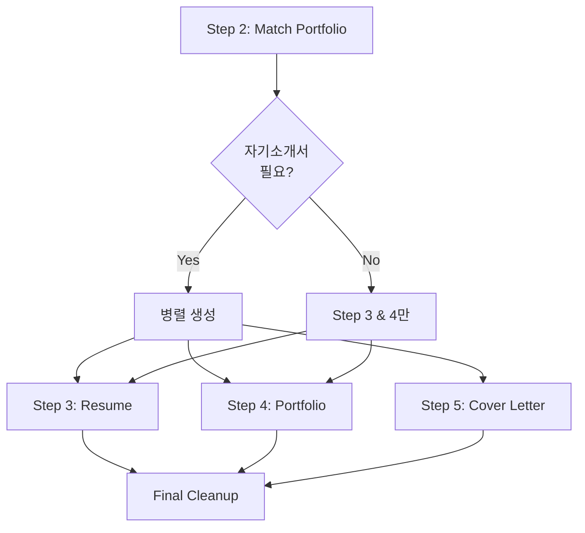

# 커버레터 자동 생성 기능 추가 업그레이드 플랜

## 목표

1. 커버레터(자기소개서)를 별도 파일로 자동 생성하는 기능 추가
2. 이력서, 포트폴리오와 함께 커버레터도 자동 생성되도록 워크플로우 확장
3. 커버레터도 PDF로 변환 가능하도록 지원

## 현재 상태

### 기존 기능
- 이력서 생성 시 자기소개서 섹션이 이력서 내부에 포함됨 (`3_Generate_Resume.md`)
- `cover_letter_sections.required`가 `true`일 때만 자기소개서 섹션 생성
- 순룡 페르소나 스타일로 작성됨
- 각 항목은 `max_length` 이내로 작성됨

### 부족한 기능
- 커버레터를 별도 파일로 생성하는 기능 없음
- 커버레터 전용 템플릿 없음
- 커버레터 PDF 변환 기능 없음

## 개선 사항

### 1. 커버레터 생성 프롬프트 추가

**새 파일**: `portfolio/portfolio_docs/resume_generator/prompts/5_Generate_Cover_Letter.md`

**기능**:
- `job_description_analysis.json`의 `cover_letter_sections` 정보 활용
- 순룡 페르소나 스타일로 각 항목 작성
- 글자 수 검증 (`max_length` 이내)
- 취소선 방지 규칙 적용

**입력**:
- `resume_generator/data/temp/job_description_analysis.json`
- `resume_generator/data/temp/portfolio_job_matching.json`
- `resume_generator/templates/Cover_Letter_Structure_Template.md`

**출력**:
- `resume_generator/data/temp/cover_letter_content.md`

### 2. 커버레터 템플릿 생성

**새 파일**: `portfolio/portfolio_docs/resume_generator/templates/Cover_Letter_Structure_Template.md`

**구조**:
```markdown
# [이름] 자기소개서 - [회사명] [직무]

## 작성 가이드

⚠️ **중요 사항**:
- 취소선(`~~텍스트~~`) 문법 사용 금지
- 모든 내용은 최종 버전만 작성
- 순룡 페르소나 스타일로 작성
- 각 항목은 max_length 이내로 작성

---

## 지원동기

[순룡 페르소나 스타일로 작성, max_length 이내]

---

## 경력기술(경력목표 포함)

[순룡 페르소나 스타일로 작성, max_length 이내]

---

## 입사 후 기여방안

[순룡 페르소나 스타일로 작성, max_length 이내]

---

© 2025 [이름]. All Rights Reserved.
```

### 3. 체인 프롬프트 업데이트

**파일**: `portfolio/portfolio_docs/resume_generator/prompts/Resume_Generator_Chain_Prompt.md`

**변경 사항**:
- Step 5 추가: `5_Generate_Cover_Letter.md` 호출 (조건부)
- `cover_letter_sections.required`가 `true`일 때만 실행
- 병렬 실행: Step 3, 4, 5를 병렬로 실행 가능하도록 (Step 5는 조건부)

**워크플로우 업데이트**:


### 4. 출력 파일 업데이트

**파일**: `portfolio/portfolio_docs/resume_generator/prompts/Resume_Generator_Chain_Prompt.md`

**변경 사항**:
- Output 섹션에 커버레터 파일 추가
- Finalization 섹션에 커버레터 저장 로직 추가

**출력 파일**:
- `assets/[회사명]_이력서_[직무].md`
- `assets/[회사명]_포트폴리오_통합문서.md`
- `assets/[회사명]_자기소개서_[직무].md` (조건부)
- PDF 파일들도 동일하게 생성

### 5. README 업데이트

**파일**: `portfolio/portfolio_docs/resume_generator/README.md`

**변경 사항**:
- 커버레터 자동 생성 기능 설명 추가
- 워크플로우 다이어그램 업데이트
- 출력 파일 목록에 커버레터 추가

## 구현 순서

1. **커버레터 템플릿 생성**
   - `Cover_Letter_Structure_Template.md` 생성
   - 작성 가이드 포함

2. **커버레터 생성 프롬프트 작성**
   - `5_Generate_Cover_Letter.md` 생성
   - 순룡 페르소나 스타일 적용
   - 글자 수 검증 로직 포함
   - 취소선 방지 규칙 포함

3. **체인 프롬프트 업데이트**
   - Step 5 추가 (조건부)
   - 워크플로우 다이어그램 업데이트
   - Output 섹션 업데이트
   - Finalization 섹션 업데이트

4. **README 업데이트**
   - 커버레터 생성 기능 설명 추가
   - 사용 예시 추가

5. **테스트**
   - 커버레터 생성 테스트
   - PDF 변환 테스트
   - 취소선 포함 여부 확인

## 예상 결과

1. `cover_letter_sections.required`가 `true`일 때 커버레터가 별도 파일로 자동 생성됨
2. 커버레터도 순룡 페르소나 스타일로 작성됨
3. 커버레터도 PDF로 변환 가능함
4. 이력서, 포트폴리오, 커버레터가 함께 생성되어 일관된 지원서 세트 완성

## 참고 사항

- 커버레터 생성은 조건부이므로 `cover_letter_sections.required`가 `false`이면 생성하지 않음
- 커버레터는 이력서 내부의 자기소개서 섹션과 동일한 내용이지만 별도 파일로 제공
- PDF 변환 시 커버레터도 하나의 연속된 페이지로 생성됨
- 취소선 방지 규칙이 커버레터에도 적용됨

## 파일 구조

```
resume_generator/
├── prompts/
│   ├── Resume_Generator_Chain_Prompt.md (업데이트)
│   ├── 1_Parse_Job_Description.md
│   ├── 2_Match_Portfolio_To_Job.md
│   ├── 3_Generate_Resume.md
│   ├── 4_Generate_Integrated_Portfolio.md
│   └── 5_Generate_Cover_Letter.md (신규)
├── templates/
│   ├── Resume_Structure_Template.md
│   ├── Integrated_Portfolio_Structure_Template.md
│   └── Cover_Letter_Structure_Template.md (신규)
└── data/
    └── temp/
        ├── job_description_analysis.json
        ├── portfolio_job_matching.json
        ├── resume_content.md
        ├── integrated_portfolio_content.md
        └── cover_letter_content.md (신규)
```

## 체크리스트

- [ ] 커버레터 템플릿 생성
- [ ] 커버레터 생성 프롬프트 작성
- [ ] 체인 프롬프트에 Step 5 추가
- [ ] 워크플로우 다이어그램 업데이트
- [ ] Output 섹션 업데이트
- [ ] Finalization 섹션 업데이트
- [ ] README 업데이트
- [ ] 테스트 수행

