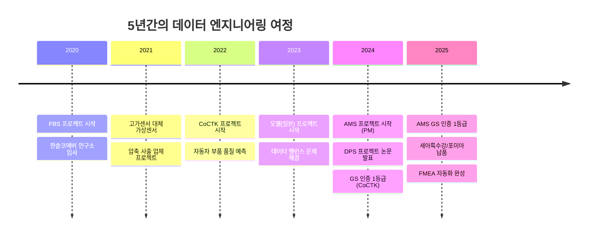
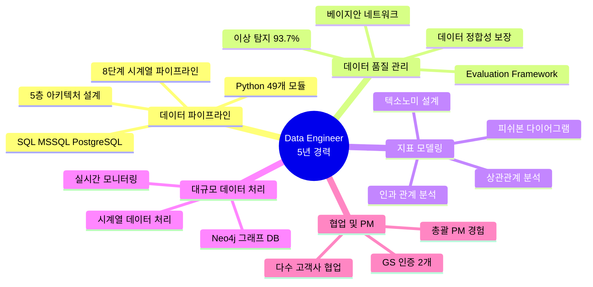
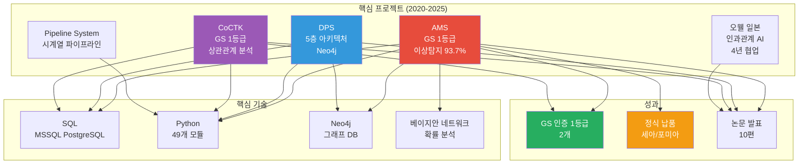
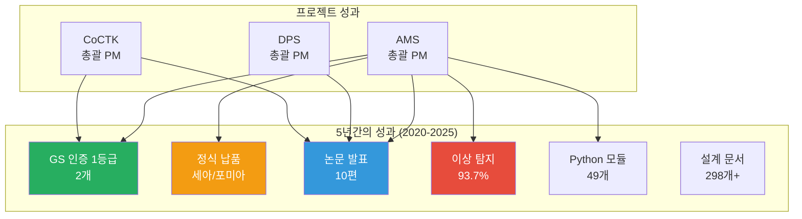

# 권순룡 이력서

## 기본 정보

**이름**: 권순룡  
**현 소속**: 한솔코에버 연구소 대리 (2020.09 ~ 재직중)  
**총 경력**: 5년 (2020~2025)  
**핵심 역량**: 데이터 엔지니어링, SQL 기반 대규모 데이터 분석, 데이터 품질 관리, 지표 모델링, 데이터 파이프라인 아키텍처 설계, Neo4j 그래프 DB

---

## 한눈에 보는 경력 (2020-2025)

---

## 지원 동기

5년간 제조 도메인 데이터 분석 플랫폼을 구축하며 "데이터를 정보로, 정보를 지식으로" 전환하는 과정에서 다양한 경험을 쌓았습니다. 특히 AMS 프로젝트에서 SQL 기반 대규모 데이터 파이프라인을 설계하고, 데이터 품질 관리 시스템을 구축하여 이상 탐지 93.7% 정확도를 달성했습니다.

CJ올리브영 데이터 분석 팀의 "고객행동로그 기반 데이터 모델 설계 및 분석 친화적 파이프라인 관리·최적화" 목표는 제가 AMS와 DPS 프로젝트에서 수행한 작업과 직접적으로 연결됩니다. 베이지안 네트워크 기반 지표 모델링, 피쉬본 다이어그램 자동 생성으로 원인-결과 관계를 모델링한 경험이 고객행동분석 지표 정의 및 텍소노미 설계에 기여할 수 있습니다.

제조 도메인에서 쌓은 데이터 품질 관리 전문성과 지표 정합성 확보 경험을 커머스 도메인에 적용하여, CJ올리브영의 데이터 리터러시 강화와 표준화 체계 구축에 기여하고 싶습니다.

---

## 핵심 역량 맵

---

## 핵심 역량

### SQL 기반 대규모 데이터 가공·분석

MSSQL Server, PostgreSQL, Neo4j를 활용하여 대규모 데이터 가공 및 분석 시스템을 구축했습니다. AMS 프로젝트에서 49개 Python 모듈과 연동된 8단계 시계열 데이터 파이프라인을 설계하고, DPS 프로젝트에서 5층 아키텍처 기반 데이터 파이프라인을 구축했습니다. Neo4j Cypher 쿼리를 활용한 그래프 데이터 분석 경험을 보유하고 있습니다.

### 데이터 품질 관리 및 분석 지표 정합성 확보

베이지안 네트워크 기반 품질 관리 시스템을 구축하여 이상 탐지 93.7% 정확도를 달성했습니다. 실질적 정확도는 데이터 한계를 고려하여 60~70%로 투명하게 공개했습니다. Evaluation_Framework를 통해 49개 Python 모듈과 298개 문서를 전수 검사하는 자동화 평가 시스템을 구축하여 데이터 정합성을 보장했습니다.

### 지표 모델링 및 심층 분석

베이지안 네트워크 기반 확률 분석과 피쉬본 다이어그램 자동 생성으로 원인-결과 관계를 모델링했습니다. 오웰(일본) 프로젝트에서 인과 관계 다이어그램 AI 엔진을 개발하여 패턴 최적 선택과 계층 클러스터링을 종합한 관계 구조를 생성했습니다. CoCTK 프로젝트에서 상관관계 분석 엔진을 개발하여 데이터 패턴을 분석했습니다.

### 데이터 파이프라인 아키텍처 설계

시계열 데이터 파이프라인 전문성을 바탕으로 파일 기반 I/O 아키텍처를 설계했습니다. 실시간 데이터 처리와 모니터링 시스템을 구축하여 데이터 수집부터 분석까지 전 과정을 관리했습니다. Docker, Kubernetes를 활용한 마이크로서비스 아키텍처 경험을 보유하고 있습니다.

### 협업 및 커뮤니케이션 역량

세아특수강, 포미아, 테크웰, 신성오토텍 등 다수 고객사와 협업하며 총괄 PM 역할을 수행했습니다. 일본 글로벌 기업(O-WELL)과 4년간 협업하여 전사적 DX 가속화를 지원했습니다. 다양한 이해관계자와의 커뮤니케이션을 통해 프로젝트를 성공적으로 완료했습니다.

---

## 프로젝트 관계도

---

## 경력 개요

### 한솔코에버 연구소 (2020.09 ~ 재직중)

**직급**: 대리  
**주요 업무**:
- 데이터 분석 플랫폼 개발 및 총괄 PM
- AI 기반 이상 탐지 시스템 설계 및 구축
- 데이터 파이프라인 아키텍처 설계
- 고객사 협업 및 컨설팅

**성과**:
- GS 인증 1등급 2개 (AMS, CoCTK)
- 세아특수강, 포미아 정식 납품
- 논문 발표 10편 (2022-2025)
- 이상 탐지 93.7% 정확도 달성

---

## 주요 프로젝트 경험

### 1. AMS (Analysis Management System) - 총괄 PM

**기간**: 2024.07 ~ 2025.12  
**발주처**: 한국산업기술진흥원  
**역할**: AI 종합 플랫폼 개발 총괄 PM

**핵심 성과**:
- ✅ **데이터 품질 관리 전문성**: 이상 탐지 93.7% 정확도 달성 (실질 60-70% 투명 공개)
- ✅ **SQL 기반 대규모 데이터 파이프라인**: 8단계 시계열 데이터 처리 파이프라인 설계
- ✅ **지표 모델링 경험**: 베이지안 네트워크, 피쉬본 다이어그램 자동 생성으로 원인-결과 관계 모델링
- ✅ **GS 인증 1등급 (PDS 명칭)**: 정부 공인 우수 소프트웨어 인증
- ✅ **세아특수강, 포미아 정식 납품**: 대기업 납품 실적 달성
- ✅ **총괄 PM 역할 수행**: 프로젝트 전체 라이프사이클 관리

---

### 2. DPS (데이터수집시스템) - 총괄 PM

**기간**: 2022.03 ~ 2024.12  
**발주처**: 중소기업기술정보진흥원  
**역할**: 데이터 파이프라인 설계 및 개발 총괄 PM

**핵심 성과**:
- ✅ **5층 아키텍처 기반 데이터 파이프라인 설계**: 대규모 제조 데이터 처리 시스템 구축
- ✅ **Neo4j 그래프 DB 활용**: 온톨로지 기반 지식 구조 및 관계 분석
- ✅ **데이터 품질 관리**: 데이터 수집부터 분석까지 전 과정 품질 관리 및 실시간 모니터링
- ✅ **논문 발표 (2024)**: 공장 운영 핵심 요소 식별 및 최적화 연구

---

### 3. CoCTK (Consulting Tool Kit) - 총괄 PM

**기간**: 2022.03 ~ 2024.12  
**발주처**: 중소기업기술정보진흥원  
**역할**: 엔진 총괄 설계 & 화면설계 개발 총괄 PM

**핵심 성과**:
- ✅ **데이터 전처리 및 상관관계 분석 전문성**: 데이터 정합성 확보를 위한 분석 엔진 개발
- ✅ **GS 인증 1등급 (2024)**: 정부 공인 우수 소프트웨어 인증
- ✅ **논문 발표 (2023)**: 압축기 공정 데이터 밸런스 문제 해결 연구
- ✅ **총괄 PM 역할 수행**: 프로젝트 전체 라이프사이클 관리

---

### 4. pipeline_system_complete - 개발

**기간**: 2023.01 ~ 2024.12  
**발주처**: 내부 개발  
**역할**: 시계열 데이터 파이프라인 설계 및 개발

**핵심 성과**:
- ✅ **시계열 데이터 파이프라인 전문성**: CSV/JSON 데이터 처리 및 검증 시스템 구축
- ✅ **파일 기반 I/O 아키텍처**: 효율적인 데이터 처리 구조 설계
- ✅ **데이터 검증 및 품질 관리**: 자동화된 데이터 품질 테스트 시스템

---

### 5. 오웰(일본)社 자동차 도정 공정 - 총괄 PM

**기간**: 2023.12 ~ 2025.03  
**발주처**: O-WELL (일본)  
**역할**: 인과 관계 다이어그램 AI 엔진 개발 총괄 PM

**핵심 성과**:
- ✅ **일본 글로벌 기업 협업 경험 (2020-2024)**: 4년간 지속적인 협업 및 전사적 DX 가속화
- ✅ **인과 관계 다이어그램 AI 엔진 개발**: 패턴 최적 선택과 계층 클러스터링 종합한 관계 구조 생성
- ✅ **지표 모델링 및 관계 구조 생성**: 고객행동분석 지표 정의 및 관리 체계 구축
- ✅ **논문 발표 (2022)**: ICT 융복합 기술을 활용한 스마트 공장 구축 연구

---

### 6. Evaluation_Framework - 개발

**기간**: 2024.01 ~ 2025.12  
**발주처**: 내부 개발  
**역할**: 데이터 품질 검증 시스템 개발

**핵심 성과**:
- ✅ **데이터 품질 검증 시스템 구축**: 49개 Python 모듈과 298개 문서 전체를 전수 검사하는 평가 엔진
- ✅ **자동화된 평가 엔진**: 6가지 관점 평가 시스템 구축
- ✅ **System-Wide Quality Assurance**: 전체 시스템 품질 보장 체계 구축

---

## 기술 스택

### Programming Languages
- **Python**: 5년 (49개 모듈 개발, 데이터 분석, ML/DL, 자동화 도구)
- **SQL**: 5년 (MSSQL Server, PostgreSQL, Neo4j Cypher)

### Databases & Data Processing
- **MSSQL Server**: 대규모 데이터 가공 및 분석
- **PostgreSQL**: 데이터 저장 및 쿼리 최적화
- **Neo4j**: 그래프 DB 기반 관계 분석 및 온톨로지 구축

### Data Engineering Tools
- **Shell**: CLI 도구화 및 자동화 스크립트
- **Docker**: 컨테이너화 및 배포
- **Kubernetes**: 마이크로서비스 아키텍처

### Data Quality & Analysis
- **베이지안 네트워크**: 확률 분석 및 이상 탐지
- **피쉬본 다이어그램**: 원인-결과 관계 모델링
- **상관관계 분석**: 데이터 패턴 분석

### BI & Visualization
- **Grafana**: 운영 대시보드 구축
- **Prometheus**: 모니터링 및 메트릭 수집

---

## 성과 대시보드

### 프로젝트 성과
- **GS 인증 1등급**: AMS (PDS 명칭), CoCTK
- **정식 납품**: 세아특수강, 포미아 DX 실증센터
- **논문 발표**: 10편 (2022-2025, 한국유체기계학회, 한국생산제조학회 등)

### 기술 성과
- **이상 탐지 정확도**: 93.7% (실질 60-70% 투명 공개)
- **Python 모듈 개발**: 49개 (MLS, CoCTK, FBS, RMS, AMS)
- **설계 문서**: 298개+ (ID 기반 온톨로지 맵 시스템)

### 협업 성과
- **고객사 협업**: 세아특수강, 포미아, 테크웰, 신성오토텍, 오웰(일본)
- **총괄 PM 경험**: AMS, DPS, CoCTK, 오웰(일본) 등 다수 프로젝트

---

## 학력

**홍익대학교 전자공학과** (2013.03 ~ 2020.02)
- 학점: 3.11 / 4.5
- 졸업논문: LD 동격회로 설계 및 PLL 설계
- 주요 수강 분야: 회로 설계, 전파공학, 컴퓨터공학

---

## 자격증

(자격증 정보가 없습니다)

---

## 핵심 철학

> **"모델보다 데이터, 데이터보다 정보, 지식구조를 정리하는 현장친화적 연구원"**

5년간 제조 도메인 데이터 분석 플랫폼을 구축하며 데이터에서 정보로, 정보에서 지식으로 전환하는 과정을 경험했습니다. 데이터 정합성을 보장하고 투명한 성과를 제시하는 것을 중시합니다.

---

## 자기소개서

### 상세경력기술서

5년간 제조 도메인 데이터 분석 플랫폼을 구축하며 데이터 엔지니어링 전문성을 쌓았습니다. AMS 프로젝트에서 SQL 기반 대규모 데이터 파이프라인을 설계하고, 8단계 시계열 데이터 처리 시스템을 구축했습니다. 베이지안 네트워크 기반 품질 관리 시스템으로 이상 탐지 93.7% 정확도를 달성했으며, 실질적 정확도는 데이터 한계를 고려하여 60~70%로 투명하게 공개했습니다.

DPS 프로젝트에서 5층 아키텍처 기반 데이터 파이프라인을 설계하고, Neo4j 그래프 DB를 활용한 온톨로지 기반 지식 구조를 구축했습니다. CoCTK 프로젝트에서 상관관계 분석 엔진을 개발하여 데이터 정합성을 확보했습니다. 오웰(일본) 프로젝트에서 인과 관계 다이어그램 AI 엔진을 개발하여 패턴 최적 선택과 계층 클러스터링을 종합한 관계 구조를 생성했습니다.

Evaluation_Framework를 통해 49개 Python 모듈과 298개 문서를 전수 검사하는 자동화 평가 시스템을 구축하여 데이터 품질을 보장했습니다. 세아특수강, 포미아, 테크웰, 신성오토텍 등 다수 고객사와 협업하며 총괄 PM 역할을 수행했습니다. 일본 글로벌 기업(O-WELL)과 4년간 협업하여 전사적 DX 가속화를 지원했습니다.

GS 인증 1등급 2개(AMS, CoCTK)를 취득했으며, 세아특수강과 포미아에 정식 납품했습니다. 논문 10편을 발표하여(2022-2025) 기술적 신뢰도를 확보했습니다.

### 지원 이유

CJ올리브영 데이터 분석 팀의 "고객행동로그 기반 데이터 모델 설계 및 분석 친화적 파이프라인 관리·최적화" 목표는 제가 AMS와 DPS 프로젝트에서 수행한 작업과 직접적으로 연결됩니다. 베이지안 네트워크 기반 지표 모델링, 피쉬본 다이어그램 자동 생성으로 원인-결과 관계를 모델링한 경험이 고객행동분석 지표 정의 및 텍소노미 설계에 기여할 수 있습니다.

SQL 기반 대규모 데이터 가공·분석 역량과 데이터 품질 관리 전문성을 보유하고 있습니다. 제조 도메인에서 쌓은 데이터 품질 관리 경험을 커머스 도메인에 적용하여, CJ올리브영의 데이터 리터러시 강화와 표준화 체계 구축에 기여하고 싶습니다.

Python, Shell을 활용한 자동화 도구 개발 경험과 데이터 품질 테스트 자동화 경험이 있습니다. Grafana, Prometheus 기반 운영 대시보드 구축 경험을 바탕으로 BI/시각화 도구를 빠르게 학습하여 활용할 수 있습니다.

---

© 2025 권순룡. All Rights Reserved.
