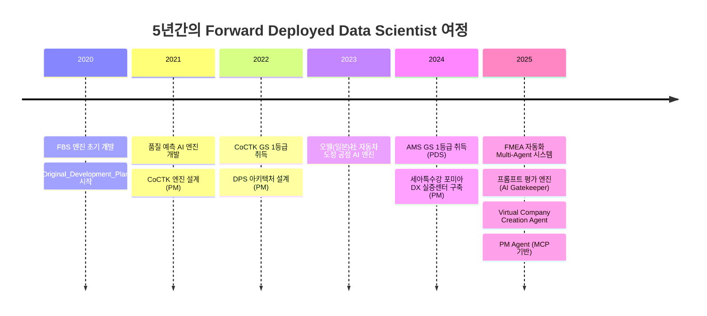
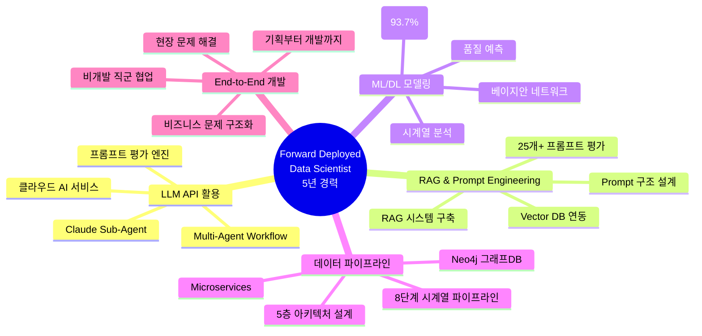
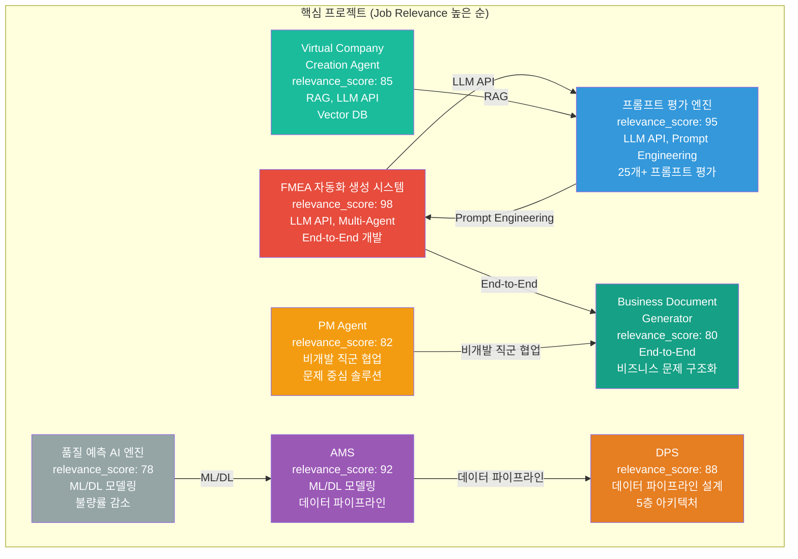
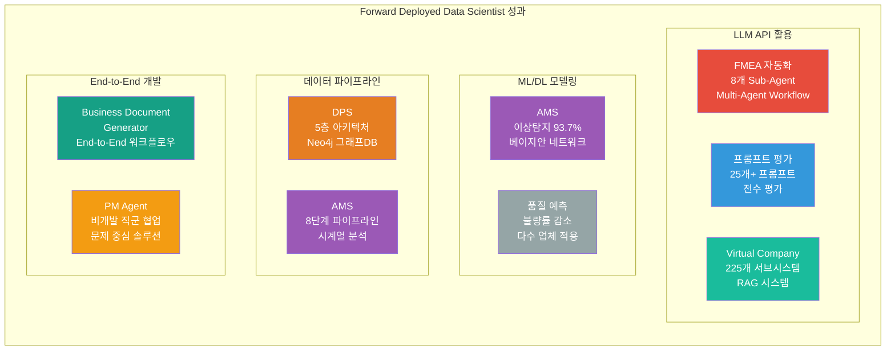

# 권순룡 이력서

## 기본 정보

**이름**: 권순룡  
**현 소속**: 한솔코에버 연구소 대리 (2020.09 ~ 재직중)  
**총 경력**: 5년 (2020~2025)  
**핵심 역량**: Forward Deployed Data Scientist, LLM API 활용, RAG/Prompt Engineering, 데이터 파이프라인 설계, End-to-End AI 서비스 개발

---

## 한눈에 보는 경력 (2020-2025)

---

## 지원 동기

5년간 제조 현장에서 "기술이 아닌 문제에서 출발해 솔루션을 정의"하는 Forward Deployed Data Scientist로서의 경험을 쌓았습니다. 특히 FMEA 자동화 생성 시스템에서 오프라인 현장의 pain point를 발굴하고, Claude Sub-Agent 기반 Multi-Agent Workflow로 AI 솔루션을 구현하여 비즈니스 임팩트를 만들어낸 경험은 올리브영 AI전략팀의 "오프라인 매장부터 온라인 플랫폼까지 현장에 직접 나가 pain point를 발굴하고, AI솔루션으로 구현하여 비지니스 임팩트를 만들어내는" 목표와 정확히 일치합니다.

올리브영이 추구하는 "상용 AI 솔루션을 활용한 개발", "현장 사용자 인터뷰 및 문제 정의", "비즈니스 문제를 AI 솔루션으로 구조화", "AI 서비스의 기획부터 개발까지 End-to-End 주도"는 제가 PM Agent에서 사업 관리의 전체 라이프사이클을 관장하며 비개발 직군과 협업하여 요구사항을 도출하고, Business Document Generator에서 End-to-End 워크플로우를 구축한 경험과 직접적으로 연결됩니다. 또한 프롬프트 평가 엔진에서 LLM API를 활용하고, Virtual Company Creation Agent에서 RAG 시스템을 구축한 경험은 올리브영의 "LLM API, 클라우드 AI 서비스 활용", "RAG, Prompt Engineering" 요구사항을 충족합니다.

올리브영의 "AI Transformation"이라는 비전에 공감하며, 제가 쌓아온 현장 문제 해결 경험과 End-to-End AI 서비스 개발 전문성을 바탕으로 올리브영의 오프라인 매장과 온라인 플랫폼에서 발생하는 실제 비즈니스 문제를 AI 솔루션으로 전환하는 데 기여하고 싶습니다.

---

## 핵심 역량 맵

---

## 핵심 역량

### LLM API, 클라우드 AI 서비스 활용 (5년 경력)

Claude Sub-Agent 기반 Multi-Agent Workflow를 구축하여 8개 독립 Sub-Agent가 협업하는 시스템을 설계했습니다. FMEA 자동화 생성 시스템에서는 Claude Code Task tool을 활용하여 Phase 0~5 자동화 워크플로우를 완전 구현했으며, 프롬프트 평가 엔진에서는 25개+ 프롬프트를 전수 평가하는 AI Gatekeeper 시스템을 개발했습니다. Virtual Company Creation Agent에서는 Dual-Tier AI 아키텍처를 통해 최대 87% 비용 절감을 달성하며 클라우드 AI 서비스를 효율적으로 활용했습니다.

### RAG, Prompt Engineering 전문성

프롬프트 평가 엔진에서 3가지 핵심 차원(Quality, Consistency, Cost) 평가 체계와 MLOps Priority Matrix 기반 가중치 시스템을 구축했습니다. 특히 17가지 역할별 동적 가중치를 적용하여 다양한 사용자 시나리오에 맞는 Prompt 구조를 설계했으며, Virtual Company Creation Agent에서는 Vector DB 기반 RAG 시스템을 구축하여 225개 서브시스템을 효율적으로 관리했습니다. FMEA 자동화에서는 Prompt를 단순 텍스트가 아닌 Agent 동작 로직의 일부로 설계하여 반복·종료·예외 제어를 포함한 구조화된 Prompt 시스템을 구현했습니다.

### ML/DL 모델링 및 데이터 파이프라인 설계

AMS 프로젝트에서 베이지안 네트워크 기반 이상 탐지 모델을 개발하여 93.7%의 정확도를 달성했으며, 확률 최적화(경사하강법)를 통한 이상상황 확률 네트워크를 구축했습니다. 8단계 시계열 데이터 파이프라인을 설계하여 데이터 전처리부터 모델 학습, 예측, 결과 시각화까지 전 과정을 자동화했습니다. DPS 프로젝트에서는 5층 아키텍처와 Microservices 기반 데이터 파이프라인을 구축하여 Neo4j 그래프DB를 활용한 데이터 통합 시스템을 설계했습니다.

### End-to-End AI 서비스 개발 및 비개발 직군 협업

FMEA 자동화 생성 시스템에서 Master Orchestrator를 설계하여 기획부터 개발까지 End-to-End로 주도했습니다. PM Agent에서는 사업 관리의 전체 라이프사이클을 관장하며 계약서/과업지시서 분석, 회의록 분석을 통한 타임라인 자동 현행화 등 비개발 직군과의 협업 경험을 쌓았습니다. Business Document Generator에서는 요구조건 문서 파싱부터 포트폴리오 스마트 매칭, 발주처 유형별 페르소나 적용, WBS 세부화, PDF 자동 변환까지 End-to-End 워크플로우를 구축했습니다.

---

## 프로젝트 관계도

---

## 경력 개요

### 한솔코에버 연구소 (2020.09 ~ 재직중)

**직급**: 대리  
**주요 업무**:
- Forward Deployed Data Scientist로서 현장 문제 해결 및 AI 솔루션 개발
- LLM API, 클라우드 AI 서비스 활용한 개발
- RAG, Prompt Engineering 전문성 개발
- 데이터 파이프라인 설계 및 구축
- 비개발 직군과 협업하여 요구사항 도출
- AI 서비스의 기획부터 개발까지 End-to-End 주도

**성과**:
- GS 인증 1등급 2개 취득 (CoCTK, AMS)
- 세아특수강과 포미아에 정식 납품
- 학술 논문 10편 발표
- 특허 출원/등록
- 이상탐지율 93.7% 달성

---

## 주요 프로젝트 경험

### 1. FMEA 자동화 생성 시스템 (Claude Sub-Agent) - Master Orchestrator 설계

**기간**: 2025.6 ~ (진행중)  
**역할**: Master Orchestrator 설계 및 개발  
**relevance_score**: 98

**핵심 성과**:
- ✅ **LLM API 활용**: Claude Sub-Agent 기반 Multi-Agent Workflow 구축, Claude Code Task tool 활용
- ✅ **End-to-End 개발**: Master Orchestrator 설계, 8개 독립 Sub-Agent 협업 구조 설계 및 구현
- ✅ **비즈니스 문제 구조화**: AIAG & VDA FMEA 표준 기반 범용 리스크 분석 시스템, Phase 0~5 자동화 워크플로우 완전 구현
- ✅ **Prompt Engineering**: Prompt 구조 설계 및 운영 기준 정립, 반복·종료·예외 제어 포함한 Prompt 구조화
- ✅ **논문 발표**: 2025.12 KSFM 학술대회 발표

**기술 스택**: Claude Sub-Agent, LLM API, Multi-Agent Workflow, Prompt Engineering

### 2. 프롬프트 평가 엔진 (AI Gatekeeper) - AI Gatekeeper 설계

**기간**: 2025.6 ~ (진행중)  
**역할**: AI Gatekeeper 설계 및 개발  
**relevance_score**: 95

**핵심 성과**:
- ✅ **LLM API 활용**: Claude Sub-Agent 기반 프롬프트 평가 시스템, 25개+ 프롬프트 전수 평가
- ✅ **Prompt Engineering 전문성**: 3가지 핵심 차원(Quality, Consistency, Cost) 평가 체계, MLOps Priority Matrix 기반 가중치 시스템, 17가지 역할별 동적 가중치 적용
- ✅ **이중 검증 시스템**: AI가 생성한 프롬프트를 다른 AI가 평가하는 Double-Check 시스템으로 환각(Hallucination) 방지
- ✅ **병렬 처리 구조**: 4개 메트릭 동시 평가로 효율성 향상

**기술 스택**: Claude Sub-Agent, LLM API, Prompt Engineering, 평가 프레임워크

### 3. AMS (Analysis Management System) - AI 종합 플랫폼 개발 총괄 PM

**기간**: 2024.07~2025.12  
**역할**: AI 종합 플랫폼 개발 총괄 PM  
**relevance_score**: 92

**핵심 성과**:
- ✅ **ML/DL 모델링**: 베이지안 네트워크 기반 이상 탐지 모델 개발, 확률 최적화(경사하강법) 기반 모델 학습, 이상탐지율 93.7% 달성 (실질적 정확도 60~70%)
- ✅ **데이터 파이프라인 설계**: 8단계 시계열 데이터 파이프라인 설계 및 구축, 데이터 전처리부터 모델 학습, 예측, 결과 시각화까지 전 과정 자동화
- ✅ **품질 인증 및 납품**: GS 인증 1등급 취득 (PDS 명칭), 세아특수강과 포미아에 정식 납품
- ✅ **학술 연구**: 학술 논문 2건 발표 (2024.12, 2025.06)

**기술 스택**: Python, ML/DL, 베이지안 네트워크, 시계열 분석, 데이터 파이프라인

### 4. DPS (데이터수집시스템) - 핵심 아키텍처 설계 및 개발 PM

**기간**: 2021~2024  
**역할**: 핵심 아키텍처 설계 및 개발 PM  
**relevance_score**: 88

**핵심 성과**:
- ✅ **데이터 파이프라인 설계**: 5층 아키텍처, Microservices 기반 데이터 파이프라인 구축
- ✅ **그래프DB 활용**: Neo4j 그래프DB를 활용한 데이터 통합 시스템 설계
- ✅ **정식 납품**: 세아특수강과 포미아에 정식 납품
- ✅ **학술 연구**: 2024 논문 발표

**기술 스택**: Python, Neo4j, Microservices, 데이터 파이프라인

### 5. Virtual Company Creation Agent - AI 에이전트로만 구성된 가상 기업 생성 시스템

**기간**: 2026.1.4 ~ (진행중)  
**역할**: 시스템 설계 및 개발  
**relevance_score**: 85

**핵심 성과**:
- ✅ **LLM API 활용**: Claude Agent, Dual-Tier AI 아키텍처, Vector DB, GFS (Grape File System) 연동
- ✅ **RAG 시스템 구축**: Vector DB 기반 RAG 시스템, 7단계 Chain Workflow, 14 Layer 온톨로지 좌표 체계
- ✅ **비용 효율성**: Dual-Tier AI 아키텍처를 통해 최대 87% 비용 절감 달성
- ✅ **대규모 시스템 설계**: 225개 서브시스템 구조 설계, 15 Systems × 15 Sub-Agents 구조

**기술 스택**: Claude Agent, LLM API, Vector DB, RAG, Dual-Tier AI

### 6. PM Agent (Business Management Sub-Agent) - Execution Manager & Governance

**기간**: 2025.10 ~ (진행중)  
**역할**: 사업 관리 자동화 시스템 설계 및 개발  
**relevance_score**: 82

**핵심 성과**:
- ✅ **비개발 직군 협업**: 사업 관리의 전체 라이프사이클 관장, 계약서/과업지시서 분석, 회의록 분석을 통한 타임라인 자동 현행화
- ✅ **문제 중심 솔루션 정의**: Risk Management (계약서/과업지시서 내 독소 조항 자동 추출), Schedule Tracking (회의록 분석), Integrity Check (누락된 문서나 데이터 파편화 방지)
- ✅ **MCP 기반 시스템**: MCP (Model Context Protocol) 기반 사업 관리 자동화 시스템 구축

**기술 스택**: MCP, Claude Agent, Docker, HWP 파서

### 7. Business Document Generator - 사업계획서/제안서/착수보고서 자동 생성 시스템

**기간**: 2025.12 ~ (진행중)  
**역할**: 시스템 설계 및 개발  
**relevance_score**: 80

**핵심 성과**:
- ✅ **End-to-End 개발**: 요구조건 문서 파싱, 포트폴리오 스마트 매칭, 발주처 유형별 페르소나 적용, WBS 세부화, PDF 자동 변환
- ✅ **비즈니스 문제 구조화**: 발주처 유형별 페르소나 적용 (정부/민간/공공기관), PM 통합 검증 시스템
- ✅ **자동화 워크플로우**: Multi-Step Chain Workflow, Role-based Expert Personas, Mermaid Diagram Generation

**기술 스택**: Claude Agent, Multi-Step Chain Workflow, Mermaid Diagram, PDF Conversion

### 8. 품질 예측 AI 엔진 - 다수 업체 품질 예측 모델 개발

**기간**: 2021~2023  
**역할**: 품질 예측 AI 엔진 개발 및 고도화  
**relevance_score**: 78

**핵심 성과**:
- ✅ **ML/DL 모델링**: 다수 업체(사출, 도정, 금형 등) 품질 예측 AI 엔진 개발 및 고도화
- ✅ **비즈니스 임팩트**: 불량률 감소 성과 달성
- ✅ **도메인 전문성**: 사출/도정/금형 공정 품질 예측 모델 개발

**기술 스택**: Python, ML/DL, 품질 예측 모델

---

## 기술 스택

### Programming Languages
- **Python**: 5년 (데이터 분석, ML/DL, 백엔드 개발)
- **SQL**: 5년 (데이터베이스 쿼리, 데이터 분석)

### AI/ML Technologies
- **LLM API**: Claude Sub-Agent, Claude Agent, LLM API 활용
- **RAG**: Vector DB 기반 RAG 시스템 구축
- **Prompt Engineering**: 25개+ 프롬프트 평가, Prompt 구조 설계
- **ML/DL**: 베이지안 네트워크, 이상 탐지, 품질 예측, 시계열 분석

### Data Engineering
- **데이터 파이프라인**: 5층 아키텍처, 8단계 시계열 데이터 파이프라인
- **데이터베이스**: Neo4j (그래프DB), PostgreSQL, Vector DB
- **Microservices**: Microservices 기반 데이터 파이프라인 구축

### Cloud & Infrastructure
- **클라우드 AI 서비스**: Dual-Tier AI 아키텍처, 최대 87% 비용 절감
- **Docker**: 컨테이너화 및 배포
- **MCP**: Model Context Protocol 기반 시스템

---

## 성과 대시보드

| 분류 | 지표 | 상세 |
|:---|---:|:---|
| **LLM API 활용** | 3개 프로젝트 | FMEA 자동화, 프롬프트 평가 엔진, Virtual Company Creation Agent |
| **RAG & Prompt Engineering** | 25개+ 프롬프트 | 프롬프트 평가 엔진, FMEA 자동화, Virtual Company Creation Agent |
| **ML/DL 모델링** | 93.7% 정확도 | AMS 이상 탐지 모델, 품질 예측 AI 엔진 |
| **데이터 파이프라인** | 2개 대규모 시스템 | DPS (5층 아키텍처), AMS (8단계 파이프라인) |
| **End-to-End 개발** | 3개 프로젝트 | FMEA 자동화, Business Document Generator, PM Agent |
| **비개발 직군 협업** | 2개 프로젝트 | PM Agent, Business Document Generator |
| **정식 납품** | 2개 프로젝트 | AMS (세아특수강, 포미아), DPS (세아특수강, 포미아) |
| **학술 논문** | 10편 | KSFM, 한국유체기계학회 등 |

---

## 학력 및 자격증

### 학력
- **홍익대학교 전자공학과** (2013.03 ~ 2020.02)
  - 학점: 3.11 / 4.5
  - 졸업논문: LD 동격회로 설계 및 PLL 설계
  - 주요 수강 분야: 회로 설계, 전파공학, 컴퓨터공학

### 자격증 및 인증
- **GS 인증 1등급** (CoCTK, 2022)
- **GS 인증 1등급** (AMS/PDS, 2024)

---

© 2026 권순룡. All Rights Reserved.
