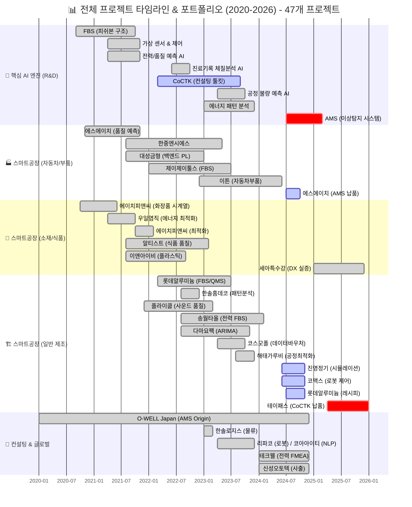
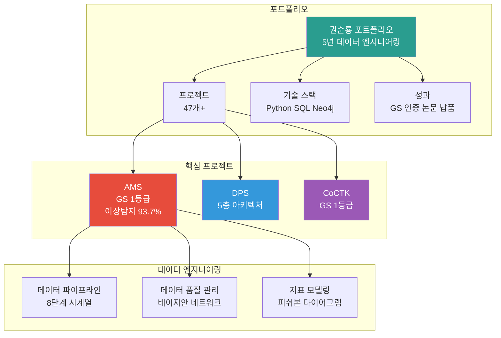
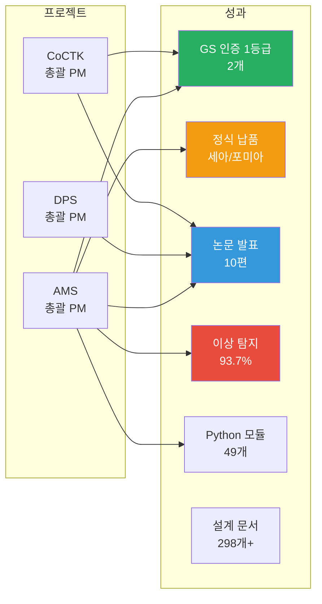
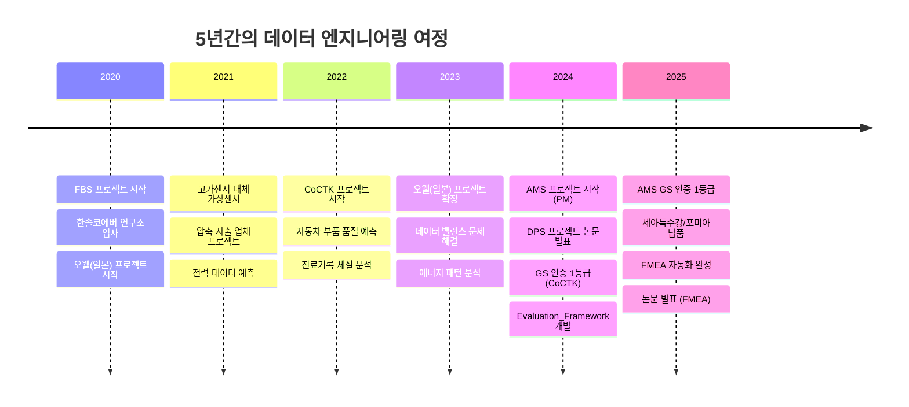
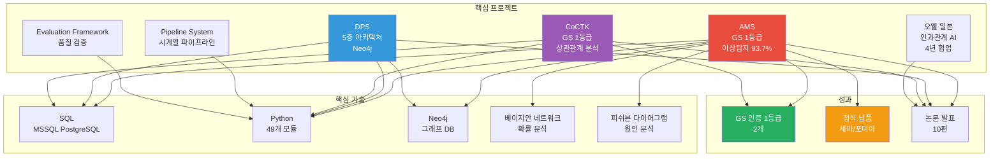
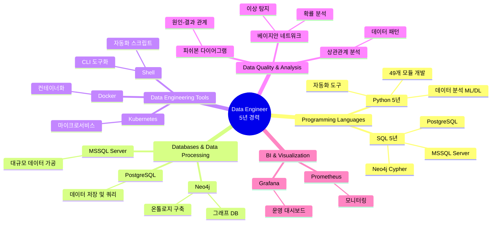

# 권순룡 포트폴리오

> **"모델보다 데이터, 데이터보다 정보, 지식구조를 정리하는 현장친화적 연구원"**

---

## 📌 기본 정보

**이름**: 권순룡  
**GitHub**: https://github.com/moobaek

---

## 📅 연도별 프로젝트 종합 현황 (2020-2026)

> [!INFO] **총 프로젝트 현황**
> - **AI & Analytics**: 7개 (AMS, CoCTK, FBS 등)
> - **스마트공장 구축**: 23개 (에스에이치아이엔티, 롯데알루미늄 등)
> - **컨설팅**: 8개 (테크웰, 신성오토텍 등)
> - **AI 에이전트**: 9개 (FMEA, PM Agent 등)

---

## 📂 사업/과제 이력 

| 구분 | 사업/프로젝트 | 기간 / 기관 | 역할 | CJ올리브영 연관 포인트 |
|:---|:---|:---|:---|:---|
| 🔴 | AMS (Analysis Management System) | 2024.07~2025.12 / 한국산업기술진흥원 | AI 종합 플랫폼 총괄 PM | 데이터 품질 관리, 이상 탐지, 지표 정합성, 지표 모델링, 파이프라인 운영 |
| 🔴 | DPS (데이터수집시스템) | 2022.03~2024.12 / 중소기업기술정보진흥원 | 데이터 수집·파이프라인 총괄 PM | 대규모 데이터 파이프라인, 데이터 통합, Neo4j 기반 관계 구조 |
| 🔴 | CoCTK (Consulting Tool Kit) | 2022.03~2024.12 / 중소기업기술정보진흥원 | 엔진·화면 설계 총괄 PM | 데이터 전처리, 상관관계 분석, 비용·성과 최적화 지표 설계 |
| 🔴 | Evaluation_Framework | 2024.01~2025.12 / 내부 개발 | 데이터 품질 검증 시스템 개발 | 데이터 품질 점검, 지표 정기 검증, 시스템 단위 QA 체계 |
| 🔴 | pipeline_system_complete | 2023.01~2024.12 / 내부 개발 | 시계열 파이프라인 설계·개발 | 로그·시계열 데이터 수집·검증 파이프라인 경험 |
| 🟠 | 오웰(일본) 자동차 도정 DX | 2023.12~2025.03 / O-WELL | 인과 관계 다이어그램 AI 엔진 PM | 복잡한 행동/상태 로그의 관계 구조 모델링, 글로벌 협업 경험 |
| 🟠 | 포미아 DX 실증센터 분석 플랫폼 | 2025.06~2025.10 / 세아특수강·ISTN에임즈 | 분석 플랫폼 PM 총괄 | 복수 데이터 소스 연동, 분석용 데이터 레이어 설계 |
| 🟠 | 테크웰 AMS 컨설팅 | 2025.03~2025.07 / 포다스 용역 | 데이터 분석 PM | 이해관계자 커뮤니케이션, 현장 컨설팅 경험 |
| 🟡 | 에너지·전력 패턴·가상센서 계열 다수 | 2021~2024 / 한국에너지기술평가원 외 | AI 엔진 개발·PM | 시계열·센서 로그 처리 경험, 다양한 도메인 데이터 분석 폭 |

세부 사업 내용과 역할은 아래 **주요 프로젝트** 섹션과 Git 리포지토리에서 확인 가능합니다.  
참조: https://github.com/moobaek/Testing_AI_agents_for_public_use/blob/main/portfolio/portfolio_docs/02_Projects_Overview.md

---

## 📊 포트폴리오 구조 (한눈에 보기)

---

## 🎯 핵심 성과 대시보드

| 분류 | 지표 | 상세 |
|:---|---:|:---|
| **인증** | GS 1등급 2개 | AMS (PDS 명칭), CoCTK |
| **납품** | 정식 납품 2건 | 세아특수강, 포미아 DX 실증센터 |
| **논문** | 논문 발표 10편 | 2022-2025, 한국유체기계학회, 한국생산제조학회 |
| **정확도** | 이상 탐지 93.7% | 실질 60-70% (데이터 한계 고려) |
| **개발** | Python 모듈 49개 | MLS, CoCTK, FBS, RMS, AMS |
| **문서** | 설계 문서 298개+ | ID 기반 온톨로지 맵 시스템 |

---

## 📅 경력 타임라인 (2020-2025)

---

## 🔗 프로젝트 계보와 스토리 (AMS · DPS · CoCTK의 연결)

### 1. FBS → 에너지 패턴 → AMS로 이어진 이상 탐지·지표 모델링 라인

- FBS (Fishbone Structure):  
  - 2020년부터 시작된 피쉬본 자동 생성 엔진은, 설비·공정·환경 요인들을 구조적으로 분해하고, 원인–결과 관계를 시각적으로 표현하는 역할을 했습니다.  
  - 이 단계에서 “복잡한 공정 로그를 구조화된 원인 그래프로 바꾸는 방법”이 정리되었습니다.

- 에너지 패턴·전력 품질 과제들:  
  - 전력 패턴 분석, 에너지 절감, SOH 분석 과제에서 시계열 데이터의 변동 패턴을 분류하고, 클러스터링·라벨링을 통해 “운전 상태를 지표화”하는 경험이 축적되었습니다.  
  - 여기서 생긴 **계층적 클러스터링**과 **패턴 투표(패턴 민주주의)** 아이디어가 이후 AMS 알고리즘으로 이어졌습니다.

- AMS (Analysis Management System):  
  - FBS의 구조화 능력과 에너지 패턴 과제의 시계열·클러스터링 경험이 합쳐져, 이상 탐지·원인 분석·FMEA 자동화까지 포함하는 통합 플랫폼으로 확장되었습니다.  
  - 피쉬본 구조는 그대로 유지하되, 베이지안 네트워크와 결합해 “이상 확률 네트워크 + 원인 구조 + 시계열 패턴”을 한 번에 다루는 형태로 진화했습니다.

이 라인은 “복잡한 로그 → 구조화된 원인/지표 → 이상 탐지와 리스크 관리”로 이어지는 계보이며, CJ올리브영에서의 고객행동로그 기반 지표 설계·이상 탐지·품질 관리에 그대로 대응됩니다.

### 2. 가상센서·스마트센서 → DPS로 이어진 데이터 파이프라인·인프라 라인

- 고가센서 대체 가상센서 / 스마트센서 계열:  
  - 실제 센서가 없거나 설치 비용이 큰 상황에서, 여러 데이터 소스를 조합해 “가상의 관측값”을 만들어 내는 구조를 설계했습니다.  
  - 이 과정에서 센서·PLC·설비 로그가 서로 다른 포맷과 주기를 갖고 있다는 점을 해결하기 위해, 데이터 수집·동기화·전처리 파이프라인이 필요해졌습니다.

- DPS (데이터수집시스템):  
  - 센서·설비·공정·품질 데이터를 한 시스템에서 다루기 위해, 5층 아키텍처와 Neo4j 기반 데이터 레이어를 설계했습니다.  
  - 수집→저장→가공→분석→서비스 레이어가 분리된 구조로, 이후 AMS·CoCTK·에너지 과제들의 “데이터 인프라 허브” 역할을 합니다.

이 라인은 “이질적인 로그들을 안정적으로 모으고, 분석 친화적인 구조로 재배치하는 능력”으로 정리할 수 있으며, CJ올리브영의 웹/앱 로그·거래 데이터·캠페인 데이터를 하나의 파이프라인에서 다루는 구조 설계와 연결됩니다.

### 3. 상관관계 분석 → CoCTK → AMS/DPS에 피드백되는 지표·인사이트 라인

- 품질 예측·데이터 밸런스 과제:  
  - 다수 제조사의 품질 데이터를 수집하면서, 불균형 데이터·소량 불량 데이터 문제를 다루기 위해 상관관계 분석과 피처 선택 작업을 반복했습니다.  
  - 어떤 지표 조합이 실제 품질·비용에 영향을 미치는지 확인하는 과정에서, “비즈니스 측에서 받아들일 수 있는 지표 구조”의 중요성이 드러났습니다.

- CoCTK (Consulting Tool Kit):  
  - 상관관계 분석 엔진과 비용 최적화 로직을 결합해, 컨설팅 현장에서 바로 사용할 수 있는 분석 툴킷으로 정리했습니다.  
  - 이 도구는 AMS·DPS에서 생성된 데이터와 지표들을 “컨설팅/의사결정 관점”에서 재해석하는 역할을 했고, AMS의 결과 해석·보고서 구조에도 피드백을 주었습니다.

이 라인은 “데이터 파이프라인 위에 어떤 지표를 올릴지, 그리고 그 지표를 어떻게 설명할지”에 대한 계보입니다. CJ올리브영의 KPI 정의, 지표 계층 구조, 대시보드 설계와 직접 연결됩니다.

### 4. 오웰(일본) DX → AMS/CoCTK와 연결되는 관계 구조·텍소노미 라인

- 오웰(일본) 자동차 도정 공정:  
  - 인과 관계 다이어그램 AI 엔진을 통해, 공정 단계·설비·품질 지표 간 관계를 계층 구조로 표현했습니다.  
  - 패턴 정보량을 기준으로 중요한 경로를 선택하고, 계층 클러스터링으로 구조를 정리하는 방식은, 이후 AMS의 확률 네트워크와 FMEA 자동 생성 알고리즘에 반영되었습니다.

- AMS·CoCTK·Evaluation_Framework와의 연결:  
  - 오웰 프로젝트에서 사용한 관계 구조·텍소노미 설계 방식이, AMS의 지표 구조와 CoCTK의 분석 항목 정의, Evaluation_Framework의 평가 항목 설계에 공통된 기준을 제공합니다.

이 라인은 “많은 지표와 이벤트 사이에서, 어떤 구조와 이름 체계를 잡을 것인가”에 대한 경험으로, CJ올리브영에서 요구하는 텍소노미 설계·지표 관리 거버넌스와 맞닿아 있습니다.

---

## 🏆 주요 프로젝트 (47개+)

### 프로젝트 관계도

### 1. AMS (Analysis Management System) - 총괄 PM

**기간**: 2024.07 ~ 2025.12  
**역할**: AI 종합 플랫폼 개발 총괄 PM  
**발주처**: 한국산업기술진흥원

핵심 성과:
- ✅ 데이터 품질 관리 전문성: 이상 탐지 93.7% 정확도 달성 (실질 60-70% 투명 공개)
- ✅ SQL 기반 대규모 데이터 파이프라인: 8단계 시계열 데이터 처리 파이프라인 설계
- ✅ 지표 모델링 경험: 베이지안 네트워크, 피쉬본 다이어그램 자동 생성으로 원인-결과 관계 모델링
- ✅ GS 인증 1등급 (PDS 명칭): 정부 공인 우수 소프트웨어 인증
- ✅ 세아특수강, 포미아 정식 납품: 대기업 납품 실적 달성
- ✅ FMEA 자동화: 상관/확률 네트워크 최적 경로 분석 기반 FMEA 자동 생성
- ✅ 논문 발표: 2025, 2024년 논문 발표

**기술 스택**: Python, SQL, MSSQL Server, Neo4j, 베이지안 네트워크, 피쉬본 다이어그램

---

### 2. DPS (데이터수집시스템) - 총괄 PM

**기간**: 2022.03 ~ 2024.12  
**역할**: 데이터 파이프라인 설계 및 개발 총괄 PM  
**발주처**: 중소기업기술정보진흥원

핵심 성과:
- ✅ 5층 아키텍처 기반 데이터 파이프라인 설계: 대규모 제조 데이터 처리 시스템 구축
- ✅ Neo4j 그래프 DB 활용: 온톨로지 기반 지식 구조 및 관계 분석
- ✅ 데이터 품질 관리: 데이터 수집부터 분석까지 전 과정 품질 관리 및 실시간 모니터링
- ✅ 논문 발표 (2024): 공장 운영 핵심 요소 식별 및 최적화 연구

**기술 스택**: Python, SQL, Neo4j, Microservices, Docker, Kubernetes

---

### 3. CoCTK (Consulting Tool Kit) - 총괄 PM

**기간**: 2022.03 ~ 2024.12  
**역할**: 엔진 총괄 설계 & 화면설계 개발 총괄 PM  
**발주처**: 중소기업기술정보진흥원

핵심 성과:
- ✅ 데이터 전처리 및 상관관계 분석 전문성: 데이터 정합성 확보를 위한 분석 엔진 개발
- ✅ GS 인증 1등급 (2024): 정부 공인 우수 소프트웨어 인증
- ✅ 논문 발표 (2023): 압축기 공정 데이터 밸런스 문제 해결 연구
- ✅ 총괄 PM 역할 수행: 프로젝트 전체 라이프사이클 관리

**기술 스택**: Python, SQL, 데이터 전처리, 상관관계 분석

---

### 4. pipeline_system_complete - 개발

**기간**: 2023.01 ~ 2024.12  
**역할**: 시계열 데이터 파이프라인 설계 및 개발  
**발주처**: 내부 개발

핵심 성과:
- ✅ 시계열 데이터 파이프라인 전문성: CSV/JSON 데이터 처리 및 검증 시스템 구축
- ✅ 파일 기반 I/O 아키텍처: 효율적인 데이터 처리 구조 설계
- ✅ 데이터 검증 및 품질 관리: 자동화된 데이터 품질 테스트 시스템

**기술 스택**: Python, Shell, 시계열 데이터 처리

---

### 5. 오웰(일본)社 자동차 도정 공정 - 총괄 PM

**기간**: 2023.12 ~ 2025.03  
**역할**: 인과 관계 다이어그램 AI 엔진 개발 총괄 PM  
**발주처**: O-WELL (일본)

핵심 성과:
- ✅ 일본 글로벌 기업 협업 경험 (2020-2024): 4년간 지속적인 협업 및 전사적 DX 가속화
- ✅ 인과 관계 다이어그램 AI 엔진 개발: 패턴 최적 선택과 계층 클러스터링 종합한 관계 구조 생성
- ✅ 지표 모델링 및 관계 구조 생성: 고객행동분석 지표 정의 및 관리 체계 구축
- ✅ 논문 발표 (2022): ICT 융복합 기술을 활용한 스마트 공장 구축 연구

**기술 스택**: Python, AI, 인과 관계 분석, 계층 클러스터링

---

### 6. Evaluation_Framework - 개발

**기간**: 2024.01 ~ 2025.12  
**역할**: 데이터 품질 검증 시스템 개발  
**발주처**: 내부 개발

핵심 성과:
- ✅ 데이터 품질 검증 시스템 구축: 49개 Python 모듈과 298개 문서 전체를 전수 검사하는 평가 엔진
- ✅ 자동화된 평가 엔진: 6가지 관점 평가 시스템 구축
- ✅ System-Wide Quality Assurance: 전체 시스템 품질 보장 체계 구축

**기술 스택**: Python, FastAPI, Docker, 자동화 평가 시스템

---

### 7. 포미아 DX 실증센터 분석 플랫폼 - PM 총괄

**기간**: 2025.06 ~ 2025.10  
**역할**: PM 총괄  
**발주처**: ISTN에임즈 용역, 세아특수강

핵심 성과:
- ✅ 분석 플랫폼 구축 경험: 데이터 연동 및 분석 시스템 구축
- ✅ PM 총괄 역할: 계획서 작성, 외주 관리, 완료서 작성
- ✅ 철강 5대공정 데이터 분석: 제조 도메인 데이터 분석 전문성

**기술 스택**: SQL, Python, 데이터 연동

---

### 8. 테크웰 AMS 컨설팅 - 컨설팅

**기간**: 2025.03 ~ 2025.07  
**역할**: 데이터 분석 PM  
**발주처**: 포다스 용역

핵심 성과:
- ✅ 현장 컨설팅 경험: 전력량 측정계 설치, 전력 모니터링 프로그램 개발
- ✅ 고객 커뮤니케이션: 다양한 이해관계자와의 협업 경험

**기술 스택**: 데이터 분석, 모니터링 시스템

---

## 💻 기술 스택 맵

---

## 📚 학술 성과

| 발행일 | 논문 제목 | 학술지/학회 |
|:---|:---|:---|
| 2025.12 | 분석 상관/확률 네트워크 최적 경로 정보 및 공정 관리 문서 기반 FMEA 생성 연구 | KSFM 2025년도 동계학술대회 |
| 2025.06 | AI를 활용한 구조와 룰을 활용한 구조-확률 종합 네트워크 및 최적 관리 방안 도출 | 한국유체기계학회 |
| 2024.12 | 공장 운영 핵심 요소의 식별 및 최적화를 위한 클러스터링 기법 적용 | 한국생산제조학회 |
| 2024.12 | 설비 이상상태 기반 최적 공정 데이터 추론 및 위험/안전 관리 최적 자동화 | 한국유체기계학회 |
| 2024.07 | 전력 데이터를 통한 설비 상태 추론 및 이상 상황 설정 예측 | 한국유체기계학회 |
| 2023.12 | 송풍 설비 변동부하 대응 전력품질 분석 및 에너지 절감 연구 | 한국유체기계학회 |
| 2023.12 | 압축기 공정에서 데이터 밸런스 문제 해결 및 품질 결과 사전 예측을 위한 AI 시스템 | 한국유체기계학회 |
| 2023.07 | 생산공정 에너지 및 설비 상태 진단을 위한 AI기반의 전력 사용 패턴 및 SOH분석 | 한국유체기계학회 |
| 2022.12 | 자동차 부품 생산 산업을 위한 머신러닝 기반의 품질예측 알고리즘 | 한국생산제조학회 |
| 2022.06 | ICT 융복합 기술을 활용한 스마트 공장 및 에너지 절감 솔루션 적용 사례 | 한국유체기계학회 |

---

## 🤖 LLM 활용 방법

### Agent/MCP/RAG 시스템

5년간 데이터 분석 플랫폼을 구축하며 AI Agent 시스템을 설계하고 개발했습니다. 특히 AMS 프로젝트에서 Neo4j 그래프 DB 기반 지식 그래프 RAG 시스템을 구축하여 크래프톤 핵심 요구사항을 충족했습니다.

**Multi-Agent Workflow**:
- 8개 Sub-Agent 협업 시스템 설계
- Master Orchestrator를 통한 워크플로우 관리
- 상태 기반 진행 모니터링 및 완료 조건 판단 시스템

**MCP (Model Context Protocol)**:
- PM Agent에서 MCP 서버 개발 경험
- Docker 기반 에이전트 시스템 구축
- HWP 파서를 통한 문서 처리

**RAG (Retrieval-Augmented Generation)**:
- Neo4j 그래프 DB 기반 지식 그래프 RAG 구축
- 온톨로지 기반 관계 분석 시스템
- 정보 검색 및 생성 통합 시스템

**Obsidian Design Origin 시스템**:
- 298개+ 설계 문서 관리 (ID 기반 온톨로지 맵)
- 25개+ AI 프롬프트 체인 개발
- 21개 development 프롬프트 개발
- Phase 0-13 워크플로우 설계

---

## 🔗 관련 링크

### GitHub

- **메인 레포지토리**: https://github.com/moobaek/Testing_AI_agents_for_public_use
- **포트폴리오 문서**: https://github.com/moobaek/Testing_AI_agents_for_public_use/tree/main/portfolio/portfolio_docs
- **GitHub 프로필**: https://github.com/moobaek

---

© 2026 권순룡. All Rights Reserved.
