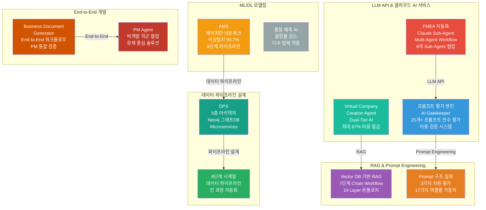
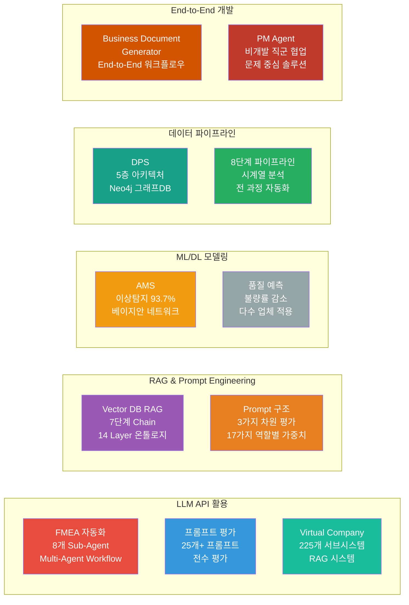
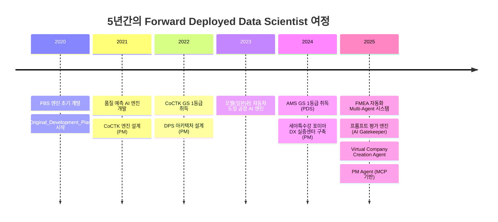
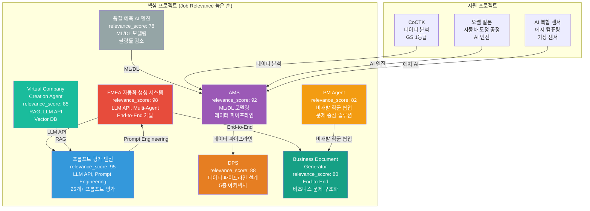
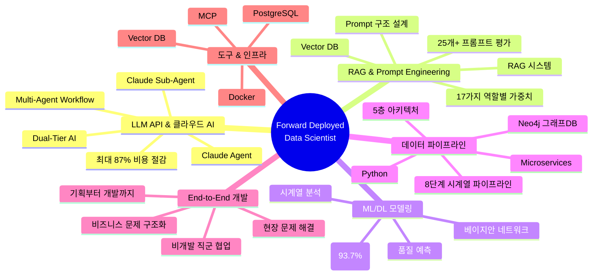

# 권순룡 포트폴리오

> **"모델보다 데이터, 데이터보다 정보, 지식구조를 정리하는 현장친화적 연구원"**

## 📌 기본 정보

**이름**: 권순룡  
**GitHub**: https://github.com/moobaek

---

## 📊 포트폴리오 구조 (한눈에 보기)

---

## 🎯 핵심 성과 대시보드

| 분류 | 지표 | 상세 |
|:---|---:|:---|
| **LLM API 활용** | 3개 프로젝트 | FMEA 자동화, 프롬프트 평가 엔진, Virtual Company Creation Agent |
| **RAG & Prompt Engineering** | 25개+ 프롬프트 | 프롬프트 평가 엔진, FMEA 자동화, Virtual Company Creation Agent |
| **ML/DL 모델링** | 93.7% 정확도 | AMS 이상 탐지 모델, 품질 예측 AI 엔진 |
| **데이터 파이프라인** | 2개 대규모 시스템 | DPS (5층 아키텍처), AMS (8단계 파이프라인) |
| **End-to-End 개발** | 3개 프로젝트 | FMEA 자동화, Business Document Generator, PM Agent |
| **비개발 직군 협업** | 2개 프로젝트 | PM Agent, Business Document Generator |
| **정식 납품** | 2개 프로젝트 | AMS (세아특수강, 포미아), DPS (세아특수강, 포미아) |
| **학술 논문** | 10편 | KSFM, 한국유체기계학회 등 |
| **GS 인증** | 2개 1등급 | CoCTK, AMS/PDS |

---

## 📅 경력 타임라인 (2020-2025)

---

## 🏆 주요 프로젝트 (30개+)

### 프로젝트 관계도

### 1. FMEA 자동화 생성 시스템 (Claude Sub-Agent) - Master Orchestrator 설계

**기간**: 2025.6 ~ (진행중)  
**역할**: Master Orchestrator 설계 및 개발  
**relevance_score**: 98

**핵심 성과**:
- ✅ **LLM API 활용**: Claude Sub-Agent 기반 Multi-Agent Workflow 구축, Claude Code Task tool 활용하여 8개 독립 Sub-Agent 협업 시스템 설계
- ✅ **End-to-End 개발**: Master Orchestrator 설계, Phase 0~5 자동화 워크플로우 완전 구현, 기획부터 개발까지 전 과정 주도
- ✅ **비즈니스 문제 구조화**: AIAG & VDA FMEA 표준 기반 범용 리스크 분석 시스템, 현장 문제를 AI 솔루션으로 구조화
- ✅ **Prompt Engineering**: Prompt 구조 설계 및 운영 기준 정립, 반복·종료·예외 제어 포함한 구조화된 Prompt 시스템 구현
- ✅ **논문 발표**: 2025.12 KSFM 학술대회 발표

**기술 스택**: Claude Sub-Agent, LLM API, Multi-Agent Workflow, Prompt Engineering

### 2. 프롬프트 평가 엔진 (AI Gatekeeper) - AI Gatekeeper 설계

**기간**: 2025.6 ~ (진행중)  
**역할**: AI Gatekeeper 설계 및 개발  
**relevance_score**: 95

**핵심 성과**:
- ✅ **LLM API 활용**: Claude Sub-Agent 기반 프롬프트 평가 시스템, 25개+ 프롬프트 전수 평가, 모든 AI 생성물의 '입구'를 통제하는 심사관 역할
- ✅ **Prompt Engineering 전문성**: 3가지 핵심 차원(Quality, Consistency, Cost) 평가 체계, MLOps Priority Matrix 기반 가중치 시스템, 17가지 역할별 동적 가중치 적용
- ✅ **이중 검증 시스템**: AI가 생성한 프롬프트를 다른 AI가 평가하는 Double-Check 시스템으로 환각(Hallucination) 방지
- ✅ **병렬 처리 구조**: 4개 메트릭 동시 평가로 효율성 향상

**기술 스택**: Claude Sub-Agent, LLM API, Prompt Engineering, 평가 프레임워크

### 3. AMS (Analysis Management System) - AI 종합 플랫폼 개발 총괄 PM

**기간**: 2024.07~2025.12  
**역할**: AI 종합 플랫폼 개발 총괄 PM  
**relevance_score**: 92

**핵심 성과**:
- ✅ **ML/DL 모델링**: 베이지안 네트워크 기반 이상 탐지 모델 개발, 확률 최적화(경사하강법) 기반 모델 학습, 이상탐지율 93.7% 달성 (실질적 정확도 60~70%)
- ✅ **데이터 파이프라인 설계**: 8단계 시계열 데이터 파이프라인 설계 및 구축, 데이터 전처리부터 모델 학습, 예측, 결과 시각화까지 전 과정 자동화
- ✅ **품질 인증 및 납품**: GS 인증 1등급 취득 (PDS 명칭), 세아특수강과 포미아에 정식 납품
- ✅ **학술 연구**: 학술 논문 2건 발표 (2024.12, 2025.06)

**기술 스택**: Python, ML/DL, 베이지안 네트워크, 시계열 분석, 데이터 파이프라인

### 4. DPS (데이터수집시스템) - 핵심 아키텍처 설계 및 개발 PM

**기간**: 2021~2024  
**역할**: 핵심 아키텍처 설계 및 개발 PM  
**relevance_score**: 88

**핵심 성과**:
- ✅ **데이터 파이프라인 설계**: 5층 아키텍처, Microservices 기반 데이터 파이프라인 구축
- ✅ **그래프DB 활용**: Neo4j 그래프DB를 활용한 데이터 통합 시스템 설계
- ✅ **정식 납품**: 세아특수강과 포미아에 정식 납품
- ✅ **학술 연구**: 2024 논문 발표

**기술 스택**: Python, Neo4j, Microservices, 데이터 파이프라인

### 5. Virtual Company Creation Agent - AI 에이전트로만 구성된 가상 기업 생성 시스템

**기간**: 2026.1.4 ~ (진행중)  
**역할**: 시스템 설계 및 개발  
**relevance_score**: 85

**핵심 성과**:
- ✅ **LLM API 활용**: Claude Agent, Dual-Tier AI 아키텍처, Vector DB, GFS (Grape File System) 연동
- ✅ **RAG 시스템 구축**: Vector DB 기반 RAG 시스템, 7단계 Chain Workflow, 14 Layer 온톨로지 좌표 체계
- ✅ **비용 효율성**: Dual-Tier AI 아키텍처를 통해 최대 87% 비용 절감 달성
- ✅ **대규모 시스템 설계**: 225개 서브시스템 구조 설계, 15 Systems × 15 Sub-Agents 구조

**기술 스택**: Claude Agent, LLM API, Vector DB, RAG, Dual-Tier AI

### 6. PM Agent (Business Management Sub-Agent) - Execution Manager & Governance

**기간**: 2025.10 ~ (진행중)  
**역할**: 사업 관리 자동화 시스템 설계 및 개발  
**relevance_score**: 82

**핵심 성과**:
- ✅ **비개발 직군 협업**: 사업 관리의 전체 라이프사이클 관장, 계약서/과업지시서 분석, 회의록 분석을 통한 타임라인 자동 현행화
- ✅ **문제 중심 솔루션 정의**: Risk Management (계약서/과업지시서 내 독소 조항 자동 추출), Schedule Tracking (회의록 분석), Integrity Check (누락된 문서나 데이터 파편화 방지)
- ✅ **MCP 기반 시스템**: MCP (Model Context Protocol) 기반 사업 관리 자동화 시스템 구축

**기술 스택**: MCP, Claude Agent, Docker, HWP 파서

### 7. Business Document Generator - 사업계획서/제안서/착수보고서 자동 생성 시스템

**기간**: 2025.12 ~ (진행중)  
**역할**: 시스템 설계 및 개발  
**relevance_score**: 80

**핵심 성과**:
- ✅ **End-to-End 개발**: 요구조건 문서 파싱, 포트폴리오 스마트 매칭, 발주처 유형별 페르소나 적용, WBS 세부화, PDF 자동 변환
- ✅ **비즈니스 문제 구조화**: 발주처 유형별 페르소나 적용 (정부/민간/공공기관), PM 통합 검증 시스템
- ✅ **자동화 워크플로우**: Multi-Step Chain Workflow, Role-based Expert Personas, Mermaid Diagram Generation

**기술 스택**: Claude Agent, Multi-Step Chain Workflow, Mermaid Diagram, PDF Conversion

### 8. 품질 예측 AI 엔진 - 다수 업체 품질 예측 모델 개발

**기간**: 2021~2023  
**역할**: 품질 예측 AI 엔진 개발 및 고도화  
**relevance_score**: 78

**핵심 성과**:
- ✅ **ML/DL 모델링**: 다수 업체(사출, 도정, 금형 등) 품질 예측 AI 엔진 개발 및 고도화
- ✅ **비즈니스 임팩트**: 불량률 감소 성과 달성
- ✅ **도메인 전문성**: 사출/도정/금형 공정 품질 예측 모델 개발

**기술 스택**: Python, ML/DL, 품질 예측 모델

---

## 💻 기술 스택 맵

---

## 📚 학술 성과 (10편)

| 발행일 | 논문 제목 | 학술지/학회 | 핵심 성과 및 프로젝트 연계 |
|:---|:---|:---|:---|
| 2025.12 | **분석 상관/확률 네트워크 최적 경로 정보 및 공정 관리 문서 기반 FMEA 생성 연구** | KSFM 2025년도 동계학술대회 | [FMEA 자동화/복합센서/AMS] 상관/확률 네트워크 최적 경로 분석 기반 FMEA 자동 생성 기술 검증, AMS 결과 표시 LLM agent (GPT OSS) 개발 및 포미아 납품 적용 |
| 2025.06 | **AI를 활용한 구조와 룰을 활용한 구조-확률 종합 네트워크 및 최적 관리 방안 도출** | 한국유체기계학회 | [AMS] 피쉬본 AI 모델의 학술적 고도화 및 최적 관리 로직 증명 |
| 2024.12 | **공장 운영 핵심 요소의 식별 및 최적화를 위한 클러스터링 기법 적용** | 한국생산제조학회 | [DPS] 공장 운영 데이터의 다차원 분석 및 디지털 트윈 최적화 근거 |
| 2024.12 | **설비 이상상태 기반 최적 공정 데이터 추론 및 위험/안전 관리 최적 자동화** | 한국유체기계학회 | [AMS] 실시간 이상 상태 기반 위험 관리 알고리즘의 유효성 검증 |
| 2024.07 | **전력 데이터를 통한 설비 상태 추론 및 이상 상황 설정 예측** | 한국유체기계학회 | [에너지/센서] 전력 데이터 기반의 설비 예지 보전 기술 실증 |
| 2023.12 | **송풍 설비 변동부하 대응 전력품질 분석 및 에너지 절감 연구** | 한국유체기계학회 | [에너지 최적화] 에너지 20% 절감 실증 솔루션의 핵심 물리 분석 모델 |
| 2023.12 | **압축기 공정에서 데이터 밸런스 문제 해결 및 품질 결과 사전 예측을 위한 AI 시스템** | 한국유체기계학회 | [AI/데이터] 소량의 불량 데이터 극복을 위한 AI 학습 모델 연구 |
| 2023.07 | **생산공정 에너지 및 설비 상태 진단을 위한 AI기반의 전력 사용 패턴 및 SOH분석** | 한국유체기계학회 | [에너지/전력] 설비 건전성(SOH) 진단 및 에너지 효율화 융합 기술 |
| 2022.12 | **자동차 부품 생산 산업을 위한 머신러닝 기반의 품질예측 알고리즘** | 한국생산제조학회 | [AI/제조] 세아베스틸 등 자동차 부품 공정 품질 예측 모델의 기초 |
| 2022.06 | **ICT 융복합 기술을 활용한 스마트 공장 및 에너지 절감 솔루션 적용 사례** | 한국유체기계학회 | [Global DX] 일본 도료기업 등 글로벌 스마트 공장 구축 사례의 실증 |

---

## 🤖 LLM 활용 방법

### Agent 시스템

**FMEA 자동화 생성 시스템**에서는 Claude Sub-Agent 기반 Multi-Agent Workflow를 구축하여 8개 독립 Sub-Agent가 협업하는 시스템을 설계했습니다. Master Orchestrator를 통해 Phase 0~5 자동화 워크플로우를 완전 구현했으며, 각 Sub-Agent는 R&D, Mfg, QA 등 전문 영역을 담당합니다.

**Virtual Company Creation Agent**에서는 225개 서브시스템을 AI 에이전트로만 구성한 가상 기업 생성 시스템을 설계했습니다. 7단계 Chain Workflow와 14 Layer 온톨로지 좌표 체계를 통해 복잡한 비즈니스 프로세스를 구조화했으며, Dual-Tier AI 아키텍처를 통해 최대 87% 비용 절감을 달성했습니다.

### MCP (Model Context Protocol)

**PM Agent**에서는 MCP 기반 사업 관리 자동화 시스템을 구축했습니다. MCP Protocol을 통해 계약서/과업지시서 분석, 회의록 분석을 통한 타임라인 자동 현행화, 누락된 문서나 데이터 파편화 방지 등 사업 관리의 전체 라이프사이클을 관장합니다.

### RAG (Retrieval-Augmented Generation)

**Virtual Company Creation Agent**에서는 Vector DB 기반 RAG 시스템을 구축했습니다. GFS (Grape File System)를 통해 AI 없이도 데이터 접근이 가능한 파일 기반 NoSQL 구조로 비용 87% 절감을 달성했으며, PostgreSQL-Inspired 기능(WAL, MVCC, Index, Vacuum)으로 엔터프라이즈급 데이터 무결성을 보장합니다.

**프롬프트 평가 엔진**에서는 25개+ 프롬프트를 전수 평가하는 시스템으로, RAG를 활용하여 프롬프트의 품질, 일관성, 비용을 평가합니다. 3가지 핵심 차원(Quality, Consistency, Cost) 평가 체계와 MLOps Priority Matrix 기반 가중치 시스템을 통해 다양한 사용자 시나리오에 맞는 프롬프트를 평가합니다.

### Prompt Engineering

**프롬프트 평가 엔진**에서는 Prompt를 단순 텍스트가 아닌 Agent 동작 로직의 일부로 설계했습니다. 17가지 역할별 동적 가중치를 적용하여 다양한 사용자 시나리오에 맞는 Prompt 구조를 설계했으며, 반복·종료·예외 제어를 포함한 구조화된 Prompt 시스템을 구현했습니다.

**FMEA 자동화 생성 시스템**에서는 Prompt 구조 설계 및 운영 기준을 정립했습니다. AIAG & VDA FMEA 표준 기반 범용 리스크 분석 시스템에서 Prompt를 통해 복잡한 워크플로우를 구조화하고, 각 Sub-Agent의 역할과 책임을 명확히 정의했습니다.

---

## 🔗 관련 링크

### GitHub

- **메인 레포지토리**: https://github.com/moobaek/Testing_AI_agents_for_public_use
- **포트폴리오 문서**: https://github.com/moobaek/Testing_AI_agents_for_public_use/tree/main/portfolio/portfolio_docs
- **GitHub 프로필**: https://github.com/moobaek

---

© 2026 권순룡. All Rights Reserved.
