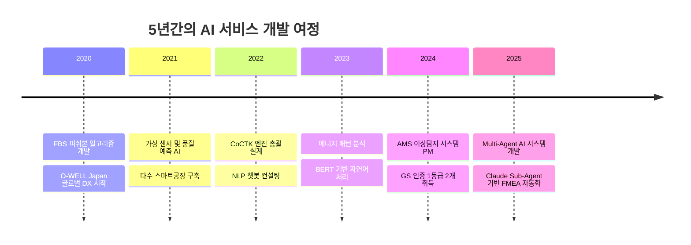
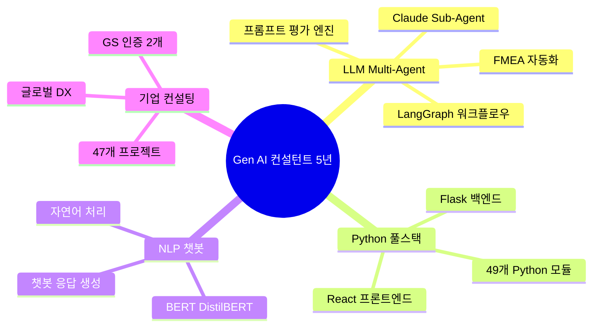
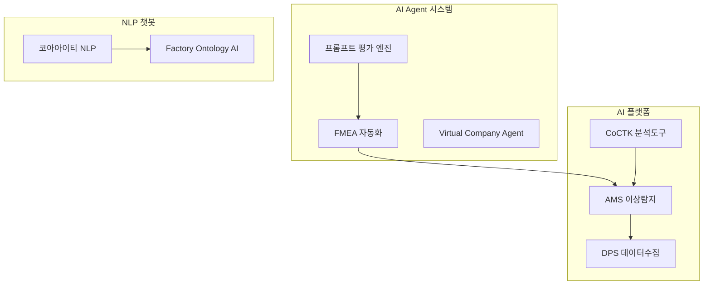
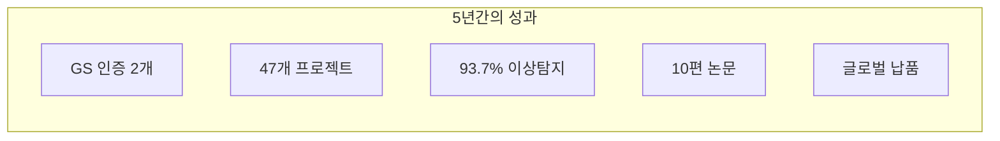

# 권순룡 이력서

## 기본 정보

**이름**: 권순룡  
**현 소속**: 한솔코에버 연구소 대리 (2020.09 ~ 재직중)  
**총 경력**: 5년 (2020~2025)  
**핵심 역량**: Gen AI 서비스 개발, LLM/Multi-Agent 시스템, Python 풀스택, 기업 컨설팅

---

## 한눈에 보는 경력 (2020-2026)

---

## 지원 동기

EY AI팀이 추구하는 "기획-개발-실행-고도화까지 한 팀 내에서 유기적으로 연결된 구조"는 5년간 제조 AI 프로젝트를 총괄 PM으로 이끌며 체득한 방식과 정확히 일치합니다.

FMEA 자동화 생성 시스템에서 Claude Sub-Agent 기반 Multi-Agent Workflow를 설계하고, 8개 독립 Sub-Agent가 협업하는 구조를 구현한 경험이 있습니다. 이 시스템은 코딩 에이전트의 역설계 시스템 구조를 적용하여, 복잡한 FMEA 프로세스를 Phase 0-5 자동화 워크플로우로 분해했습니다.

또한 코아아이티 프로젝트에서 BERT/DistilBERT 기반 자연어 처리 모델을 개발하고, 한약재 데이터를 처리하는 챗봇 응답 생성 시스템을 설계한 경험은 EY AI팀의 "문서 요약, 자동 분석, 지식 검색, 챗봇 등 AI 응용 서비스 기획/개발" 업무와 직접적으로 연결됩니다.

47개 프로젝트를 성공적으로 완수하며 PoC부터 배포까지 전 과정을 설계하고 실행한 경험을 바탕으로, EY AI팀에서 고객사와 함께 실전형 AI 서비스를 만들어가고 싶습니다.

---

## 핵심 역량 맵

---

## 핵심 역량

### 1. LLM/Multi-Agent 시스템 개발

Claude Sub-Agent 기반 Multi-Agent Workflow를 설계하고 구현한 경험이 있습니다. FMEA 자동화 생성 시스템에서 8개 독립 Sub-Agent(R&D 3개, Manufacturing 3개, QA 2개)가 협업하는 구조를 구축했습니다. Master Orchestrator가 전체 워크플로우를 조율하고, 각 Sub-Agent가 전문 영역을 담당하는 방식입니다.

프롬프트 평가 엔진에서는 AI Gatekeeper 역할로 모든 AI 생성물의 품질을 전수 평가하는 시스템을 개발했습니다. 17가지 역할별 동적 가중치 시스템과 MLOps Priority Matrix를 적용하여 Quality, Consistency, Cost 3차원 평가를 수행합니다.

### 2. Python 기반 End-to-End 개발

AMS(Analysis Management System)에서 49개 Python 모듈을 100% 자체 개발했습니다. MLS(머신러닝), FBS(피쉬본), RMS(범위관리), AMS(통합분석) 등 5개 핵심 모듈로 구성되어 있으며, Flask 백엔드와 React 웹 대시보드를 연동했습니다.

Factory Ontology Manager AI Agent에서는 React 18.3.1 + TypeScript + Flask 풀스택으로 개발하여, 자연어 기반 공정 문서 파싱 및 캔버스 레이아웃 자동 생성 기능을 구현했습니다. LangGraph 기반 자연어 쿼리와 Instructor(Pydantic 기반 LLM 검증)를 통합했습니다.

### 3. NLP 및 챗봇 개발

코아아이티 프로젝트에서 BERT/DistilBERT 기반 자연어 처리 모델을 개발했습니다. 한약재/건강식품 데이터를 분석하고, 효과 및 주의사항 정보를 구조화하여 챗봇 응답 생성 시스템을 설계했습니다. CSV 기반 자연어 처리 파이프라인을 구축하고, 공정 데이터 토큰화 및 벡터화를 수행했습니다.

### 4. 기업 고객 대상 컨설팅 및 PoC

5년간 47개 프로젝트를 성공적으로 완수했으며, 세아특수강, 포미아, O-WELL Japan 등 국내외 기업에 AI 솔루션을 납품했습니다. 테크웰, 신성오토텍 AMS 컨설팅을 수행했고, GS 인증 1등급 2개(CoCTK, AMS/PDS)를 취득했습니다.

---

## 프로젝트 관계도

---

## 경력 개요

### 한솔코에버 연구소 (2020.09 ~ 현재)

**직급**: 대리 (연구소)  
**주요 업무**:
- AI 종합 플랫폼(AMS) 개발 총괄 PM
- 스마트공장 AI 엔진 개발 및 컨설팅
- Multi-Agent AI 시스템 설계 및 구현
- 기업 고객 대상 PoC 및 납품

**성과**:
- GS 인증 1등급 2개 취득 (CoCTK, AMS/PDS)
- 47개 프로젝트 성공적 완수
- 이상탐지율 93.7% 달성
- 세아특수강, 포미아, O-WELL Japan 납품
- 논문 10편 발표

---

## 주요 프로젝트 경험

### 1. FMEA 자동화 생성 시스템 - Master Orchestrator 설계

**기간**: 2025.06 ~ 현재  
**역할**: 시스템 설계 및 개발

**핵심 성과**:
- ✅ **Multi-Agent Workflow 구축**: Claude Sub-Agent 기반 8개 독립 에이전트 협업 구조
- ✅ **Phase 0-5 자동화**: 코딩 에이전트 역설계 시스템 구조 적용
- ✅ **AIAG & VDA FMEA 표준**: 국제 표준 기반 범용 리스크 분석

### 2. 프롬프트 평가 엔진 - AI Gatekeeper

**기간**: 2025.06 ~ 현재  
**역할**: 시스템 설계 및 개발

**핵심 성과**:
- ✅ **전체 프롬프트 전수 평가**: 25개+ 프롬프트 품질 보장
- ✅ **17가지 역할별 동적 가중치**: MLOps Priority Matrix 적용
- ✅ **병렬 처리 구조**: 4개 메트릭 동시 평가

### 3. 코아아이티 NLP 챗봇 컨설팅

**기간**: 2023.04 ~ 2023.12  
**발주처**: 충북과학기술원 (산업 디지털 전환 지원사업)  
**역할**: NLP 개발 및 컨설팅

**핵심 성과**:
- ✅ **BERT 모델 개발**: BertForSequenceClassification, DistilBERT 적용
- ✅ **챗봇 시스템 설계**: 한약재 효과/주의사항 정보 구조화
- ✅ **자연어 처리 파이프라인**: CSV 기반 토큰화, 벡터화

### 4. AMS (Analysis Management System) - 총괄 PM

**기간**: 2024.07 ~ 2025.03  
**발주처**: 한국산업기술진흥원  
**역할**: 총괄 PM

**핵심 성과**:
- ✅ **GS 인증 1등급**: 소프트웨어 품질 인증 최고 등급
- ✅ **이상탐지율 93.7%**: 베이지안 네트워크 기반 확률 모델
- ✅ **49개 Python 모듈**: 100% 자체 개발
- ✅ **정식 납품**: 세아특수강, 포미아

### 5. Factory Ontology Manager AI Agent

**기간**: 2026.01 ~ 현재  
**역할**: 풀스택 개발

**핵심 성과**:
- ✅ **React + Flask 풀스택**: TypeScript 5.5.3, Vite 기반
- ✅ **자연어 공정 문서 파싱**: LangGraph 기반 쿼리
- ✅ **레이아웃 생성 시간 80% 단축**

---

## 다양한 도메인 프로젝트 경험

5년간 **자동차 부품, 화장품, 식품, 철강, 섬유, 플라스틱, 물류, 헬스케어** 등 다양한 산업에서 AI 프로젝트를 수행했습니다.

| 도메인 | 대표 프로젝트 | 역할 |
|:---|:---|:---|
| **자동차 부품** | 한중엔시에스 사출 품질 예측 | AI 백엔드 PL |
| **화장품** | 에이치피앤씨 배합 최적화 | AI 백엔드 PL |
| **식품** | 해태가루비 Frying 공정 AI | AI 백엔드 PL |
| **철강** | 롯데알루미늄 스마트팩토리 | FBS PoC PM |
| **물류** | 한솔로지스 운송 최적화 | 엔진 개발 PO |
| **헬스케어** | 진료기록 체질 분석 AI | AI 개발 |
| **로봇/자동화** | 코맥스 로봇 제어 AI | AI PL |

---

## 기술 스택

### Programming Languages
- **Python**: 5년 (Flask, FastAPI, ML/DL, 49개 모듈 개발)
- **TypeScript/JavaScript**: 2년 (React 18.3.1, Vite)
- **SQL**: 5년 (MSSQL, PostgreSQL, Neo4j Cypher)

### AI/ML
- **LLM**: Claude, GPT, BERT, DistilBERT
- **Framework**: LangGraph, LangChain, CrewAI
- **ML**: scikit-learn, pgmpy (베이지안 네트워크)

### Web Development
- **Frontend**: React 18.3.1, TypeScript, Tailwind CSS
- **Backend**: Flask, FastAPI
- **Database**: MSSQL Server, Neo4j, PostgreSQL

### DevOps
- **Container**: Docker, Kubernetes
- **Monitoring**: Grafana, Prometheus

---

## 성과 대시보드

| 분류 | 지표 | 상세 |
|:---|---:|:---|
| **인증** | 2개 | GS 인증 1등급 (CoCTK, AMS/PDS) |
| **프로젝트** | 47개 | AI, 스마트공장, 컨설팅 |
| **정확도** | 93.7% | AMS 이상탐지율 |
| **논문** | 10편 | 학술 연구 및 발표 |
| **납품** | 3곳+ | 세아특수강, 포미아, O-WELL Japan |

---

## 학력

**홍익대학교 전자공학과** (2013.03 ~ 2020.02)
- 학점: 3.11 / 4.5
- 졸업논문: LD 동격회로 설계 및 PLL 설계

---

## 자격증

**OPIc** (2019.03)
- ACT FL (American Council on the Teaching of Foreign Languages)

---

## 핵심 철학

> "모델보다 데이터, 데이터보다 정보, 지식구조를 정리하는 현장친화적 연구원"

화려한 모델보다 현장에서 실제로 작동하는 시스템을 만드는 것이 중요합니다. 5년간 47개 프로젝트를 통해 기획부터 개발, 실행, 고도화까지 전 주기를 경험하며 이 철학을 실천해왔습니다.
