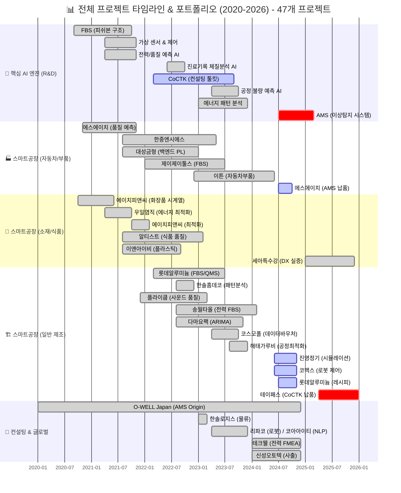
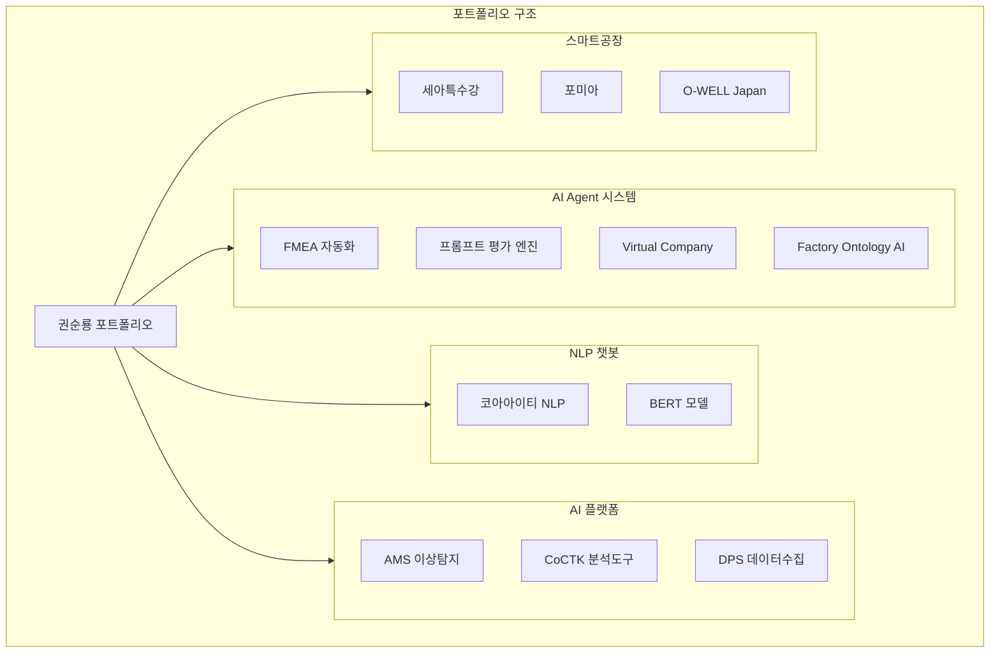
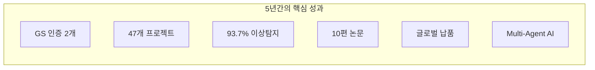
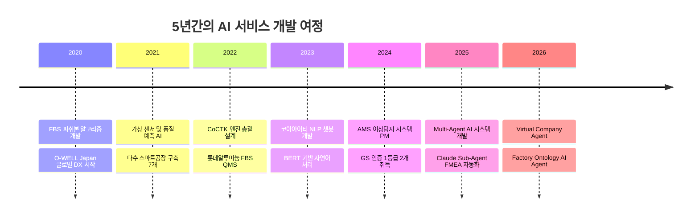
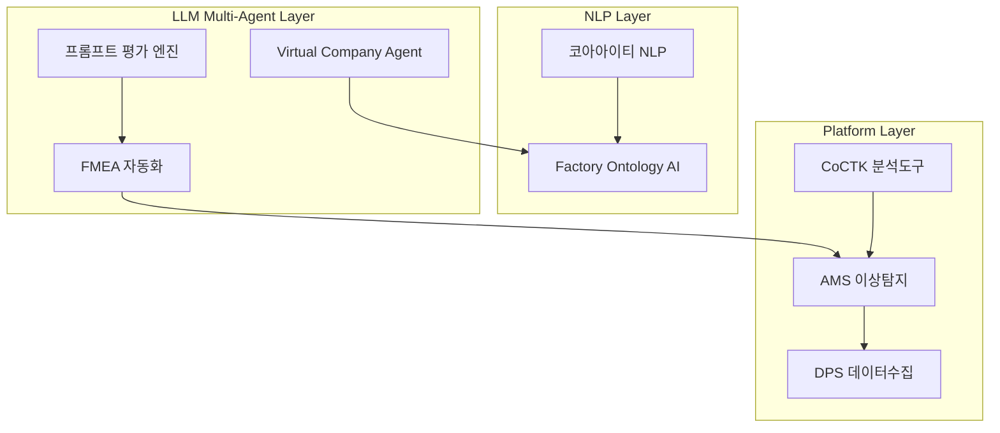
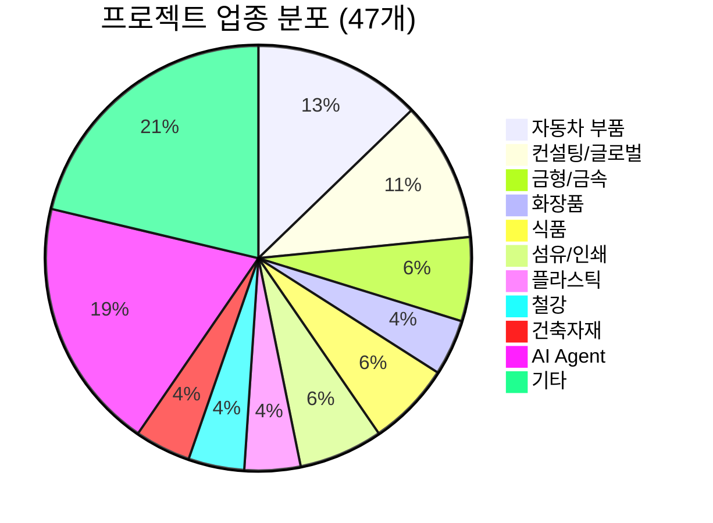
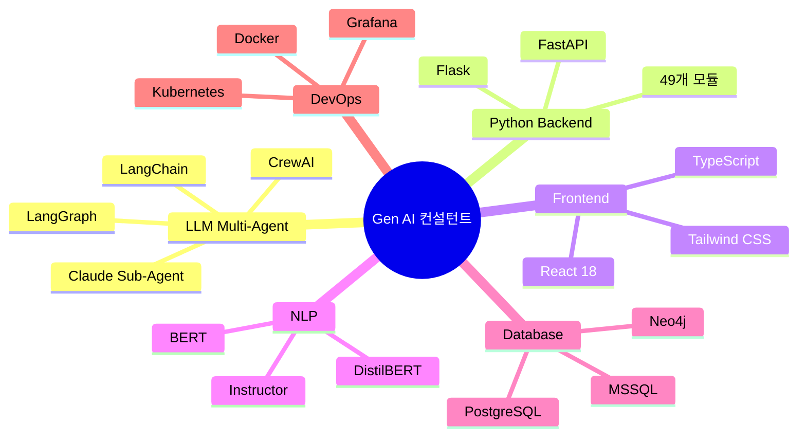

# 권순룡 포트폴리오

> **"모델보다 데이터, 데이터보다 정보, 지식구조를 정리하는 현장친화적 연구원"**

---

## 📌 기본 정보

**이름**: 권순룡  
**GitHub**: https://github.com/moobaek

---

## 📊 전체 프로젝트 타임라인 (2020-2026) - 47개 프로젝트

> [!INFO] **총 프로젝트 현황**
> - **AI & Analytics**: 7개 (AMS, CoCTK, FBS 등)
> - **스마트공장 구축**: 23개 (에스에이치아이엔티, 롯데알루미늄 등)
> - **컨설팅**: 8개 (테크웰, 신성오토텍 등)
> - **AI 에이전트**: 9개 (FMEA, PM Agent 등)

---

## 📊 포트폴리오 구조

---

## 🎯 핵심 성과 대시보드

| 분류 | 지표 | 상세 |
|:---|---:|:---|
| **인증** | 2개 | GS 인증 1등급 (CoCTK, AMS/PDS) |
| **프로젝트** | 47개 | AI, 스마트공장, 컨설팅, AI Agent |
| **정확도** | 93.7% | AMS 이상탐지율 (베이지안 네트워크) |
| **논문** | 10편 | 학술 연구 및 발표 |
| **납품** | 3곳+ | 세아특수강, 포미아, O-WELL Japan |
| **AI Agent** | 8개 | Claude Sub-Agent 협업 시스템 |

---

## 📅 경력 타임라인 (2020-2026)

---

## 🏆 주요 프로젝트 (10개+)

### 프로젝트 기술 연결도

### 1. FMEA 자동화 생성 시스템 - Master Orchestrator 설계

**기간**: 2025.06 ~ 현재  
**역할**: 시스템 설계 및 개발

**프로젝트 개요**:
Claude Sub-Agent 기반 Multi-Agent Workflow를 설계하고 구현한 프로젝트입니다. 코딩 에이전트의 역설계 시스템 구조를 FMEA 분석에 적용하여, 복잡한 FMEA 프로세스를 8개 Sub-Agent로 분해했습니다.

**핵심 성과**:
- ✅ **Multi-Agent Workflow 구축**: 8개 독립 Sub-Agent 협업 (R&D 3개, Mfg 3개, QA 2개)
- ✅ **Master Orchestrator 설계**: Claude Code Task tool 기반 전체 워크플로우 조율
- ✅ **Phase 0-5 자동화**: 컨텍스트 수집 → 범위 정의 → 심층 분석 → 리스크 평가 → 최적화 → 지속 개선
- ✅ **AIAG & VDA FMEA 표준**: 국제 표준 기반 범용 리스크 분석 시스템

**기술 스택**: Python, Claude Code, Multi-Agent Workflow, FMEA

---

### 2. 프롬프트 평가 엔진 - AI Gatekeeper

**기간**: 2025.06 ~ 현재  
**역할**: 시스템 설계 및 개발

**프로젝트 개요**:
모든 AI 생성물의 '입구'를 통제하는 AI Gatekeeper 시스템입니다. 전체 프롬프트를 전수 평가하는 완전 자동화 시스템으로, AI가 생성한 프롬프트를 다른 AI가 평가하는 이중 검증(Double-Check) 구조입니다.

**핵심 성과**:
- ✅ **17가지 역할별 동적 가중치**: Chain, Summary, Document, Developer, Analysis 등
- ✅ **MLOps Priority Matrix**: Structural 40%, Correctness 30%, Relevancy 20%, Tone 10%
- ✅ **병렬 처리 구조**: 4개 메트릭 동시 평가 (구조, 정확성, 관련성, 일관성)
- ✅ **Human-in-the-Loop**: 8단계 필수 검증 프로세스

**기술 스택**: Python, Claude Code, Evaluation Framework

---

### 3. 코아아이티 자연어 처리 & 챗봇 컨설팅

**기간**: 2023.04 ~ 2023.12  
**발주처**: 충북과학기술원 (산업 디지털 전환 지원사업)  
**역할**: NLP 개발 및 컨설팅

**프로젝트 개요**:
BERT/DistilBERT 기반 자연어 처리 모델을 개발하고, 한약재/건강식품 데이터를 분석하여 챗봇 응답 생성 시스템을 설계한 프로젝트입니다.

**핵심 성과**:
- ✅ **BERT 모델 개발**: BertForSequenceClassification, DistilBERT 적용
- ✅ **챗봇 시스템 설계**: 한약재 효과/주의사항 정보 구조화
- ✅ **자연어 처리 파이프라인**: CSV 기반 토큰화, 벡터화
- ✅ **공정 데이터 NLP**: 공정 기능 추출, 토큰화, 벡터화

**기술 스택**: Python, BERT, DistilBERT, NLP, 챗봇

---

### 4. AMS (Analysis Management System) - 총괄 PM

**기간**: 2024.07 ~ 2025.03  
**발주처**: 한국산업기술진흥원  
**역할**: 총괄 PM

**프로젝트 개요**:
데이터 수집부터 이상 탐지, FMEA 생성까지의 전체 파이프라인을 담당하는 핵심 분석 엔진입니다. 49개 Python 모듈을 100% 자체 개발했습니다.

**핵심 성과**:
- ✅ **GS 인증 1등급**: 소프트웨어 품질 인증 최고 등급 (PDS 명칭)
- ✅ **이상탐지율 93.7%**: 베이지안 네트워크 기반 확률 모델 (실질 60-70%, 데이터 한계 고려)
- ✅ **49개 Python 모듈**: MLS, CoCTK, FBS, RMS, AMS 5개 핵심 모듈
- ✅ **정식 납품**: 세아특수강, 포미아 DX 실증센터
- ✅ **특허 등록**: 피쉬본 관리 시스템

**기술 스택**: Python, Flask, Neo4j, MSSQL, Docker, 베이지안 네트워크

---

### 5. Factory Ontology Manager AI Agent

**기간**: 2026.01 ~ 현재  
**역할**: 풀스택 개발

**프로젝트 개요**:
Factory Ontology Manager에 AI 에이전트 기능을 추가하여 자연어로 기술된 공정 문서를 파싱하고, 실제 공장 데이터(DB)와 매핑하여 공장 모니터링 캔버스 레이아웃을 자동 생성하는 시스템입니다.

**핵심 성과**:
- ✅ **React + Flask 풀스택**: React 18.3.1 + TypeScript 5.5.3 + Vite
- ✅ **자연어 공정 문서 파싱**: LangGraph 기반 자연어 쿼리
- ✅ **Instructor 통합**: Pydantic 기반 LLM 검증
- ✅ **레이아웃 생성 시간 80% 단축**: 기존 2-3시간 → 20-30분

**기술 스택**: React, TypeScript, Flask, LangGraph, Instructor

---

### 6. Virtual Company Creation Agent

**기간**: 2026.01 ~ 현재  
**역할**: 시스템 설계

**프로젝트 개요**:
AI 에이전트로만 구성된 가상 기업 생성 시스템입니다. 15 Systems × 15 Sub-Agents = 225개 서브시스템으로 구성되며, 7단계 Chain Workflow로 기업 설계를 자동화합니다.

**핵심 성과**:
- ✅ **225개 서브시스템**: 15 Systems × 15 Sub-Agents
- ✅ **GFS (Grape File System)**: AI 없이도 데이터 접근 가능한 파일 기반 NoSQL
- ✅ **Dual-Tier AI 아키텍처**: High-Spec AI (추론)와 Low-Spec AI (조회) 분리로 비용 87% 절감
- ✅ **20개 이상 설계 문서 완료**

**기술 스택**: Python, Claude Agent, MCP, Vector DB, PostgreSQL

---

### 7. CoCTK (Consulting Tool Kit) - 엔진 총괄 설계

**기간**: 2022.03 ~ 2024  
**발주처**: 중소기업기술정보진흥원  
**역할**: 엔진 총괄 설계 및 화면설계 개발 PM

**핵심 성과**:
- ✅ **GS 인증 1등급**: 소프트웨어 품질 인증
- ✅ **데이터 전처리/상관관계 분석/비용 최적화 엔진**
- ✅ **테이패스 새만금 납품 예정**

**기술 스택**: Python, C# WinForms

---

### 8. O-WELL Japan 자동차 도정 공정 DX

**기간**: 2020.01 ~ 2024.12  
**발주처**: O-WELL (일본)  
**역할**: 초기 개발부터 총괄 PM

**핵심 성과**:
- ✅ **인과 관계 다이어그램 AI 엔진 개발**: 자동차 도정 공정 데이터 기반
- ✅ **계층적 클러스터링 도입**: 패턴 정보량 기준 중요 경로 선택
- ✅ **패턴 투표(Pattern Voting) 기법**: 여러 패턴 분석 결과를 앙상블로 종합
- ✅ **논문 발표**: 2022년

**기술 스택**: Python, 인과 관계 분석, 클러스터링

---

## 🏭 다양한 도메인 프로젝트 경험

> 5년간 **자동차 부품, 화장품, 식품, 철강, 섬유, 플라스틱, 물류, 헬스케어** 등 다양한 산업 도메인에서 AI 프로젝트를 수행했습니다.

### 도메인별 대표 프로젝트

| 도메인 | 프로젝트 | 기간 | 역할 | 핵심 성과 |
|:---|:---|:---|:---|:---|
| **자동차 부품** | 한중엔시에스 사출 품질 예측 | 2021.08~2023.05 | AI 백엔드 PL | RandomForest, XGBoost, AdaBoost 앙상블 적용, 사출 조건 기반 품질 예측 |
| **화장품** | 에이치피앤씨 배합 최적화 | 2021.10~2022.02 | AI 백엔드 PL | 화장품 배합 비율 분석, 최적 분석 시간 도출 |
| **식품** | 해태가루비 Frying 공정 AI | 2023.08~2023.12 | AI 백엔드 PL | 감자 칩 품질 상태 최적화, 알고리즘 기반 이상 알람 |
| **철강** | 롯데알루미늄 스마트팩토리 | 2022.03~2023.07 | FBS PoC PM | 품질-전력 연결 분석, AMS 룰 생성 기여 |
| **섬유** | 송월타올 전력 FBS | 2022.08~2024.02 | 데이터 분석 | 전력 패턴 기반 관리 순위 선정 및 알림값 설정 |
| **플라스틱** | 이앤아이비 품질 QMS | 2021.08~2022.09 | 백엔드 PO | 품질 중요도 FBS, 주요 순위 QMS 개발 |
| **물류** | 한솔로지스 운송 최적화 | 2023.01~2023.03 | 엔진 개발 PO | 운송 최적화 알고리즘 개발, 고객 AI 요구사항 분석 |
| **헬스케어** | 진료기록 체질 분석 AI | 2022.06~2022.10 | AI 개발 | 한의원 진료 기록 기반 체질 예측 ML 모델 |
| **로봇/자동화** | 코맥스 로봇 제어 AI | 2024.06~2024.11 | AI PL | 로봇 제어 방법 예측 AI 개발 |

---

## 💻 기술 스택 맵

---

## 📚 학술 성과

| 발행일 | 논문 제목 | 학술지/학회 |
|:---|:---|:---|
| 2025.12 | 분석 상관/확률 네트워크 최적 경로 정보 및 공정 관리 문서 기반 FMEA 생성 연구 | KSFM 2025년도 동계학술대회 |
| 2025.06 | AI를 활용한 구조와 룰을 활용한 구조-확률 종합 네트워크 및 최적 관리 방안 도출 | 한국유체기계학회 |
| 2024.12 | 공장 운영 핵심 요소의 식별 및 최적화를 위한 클러스터링 기법 적용 | 한국생산제조학회 |
| 2024.12 | 설비 이상상태 기반 최적 공정 데이터 추론 및 위험/안전 관리 최적 자동화 | 한국유체기계학회 |
| 2024.07 | 전력 데이터를 통한 설비 상태 추론 및 이상 상황 설정 예측 | 한국유체기계학회 |
| 2023.12 | 송풍 설비 변동부하 대응 전력품질 분석 및 에너지 절감 연구 | 한국유체기계학회 |
| 2023.12 | 압축기 공정에서 데이터 밸런스 문제 해결 및 품질 결과 사전 예측을 위한 AI 시스템 | 한국유체기계학회 |
| 2023.07 | 생산공정 에너지 및 설비 상태 진단을 위한 AI기반의 전력 사용 패턴 및 SOH분석 | 한국유체기계학회 |
| 2022.12 | 자동차 부품 생산 산업을 위한 머신러닝 기반의 품질예측 알고리즘 | 한국생산제조학회 |
| 2022.06 | ICT 융복합 기술을 활용한 스마트 공장 및 에너지 절감 솔루션 적용 사례 | 한국유체기계학회 |

---

## 🤖 LLM 활용 방법

### Multi-Agent AI 시스템

FMEA 자동화 생성 시스템에서 Claude Sub-Agent 기반 Multi-Agent Workflow를 구축했습니다. 8개 독립 Sub-Agent가 각자의 전문 영역(R&D, Manufacturing, QA)을 담당하고, Master Orchestrator가 전체 워크플로우를 조율합니다.

### 프롬프트 평가 시스템

AI Gatekeeper 역할로 모든 AI 생성물의 품질을 전수 평가합니다. 17가지 역할별 동적 가중치 시스템과 MLOps Priority Matrix를 적용하여 Quality, Consistency, Cost 3차원 평가를 수행합니다.

### NLP 및 챗봇

BERT/DistilBERT 기반 자연어 처리 모델을 개발하고, LangGraph를 활용한 자연어 쿼리 시스템을 구축했습니다. Instructor(Pydantic 기반)를 통해 LLM 응답을 검증합니다.

---

## 🔗 관련 링크

- **메인 레포지토리**: https://github.com/moobaek/Testing_AI_agents_for_public_use
- **포트폴리오 문서**: https://github.com/moobaek/Testing_AI_agents_for_public_use/tree/main/portfolio/portfolio_docs
- **GitHub 프로필**: https://github.com/moobaek

---

© 2025 권순룡. All Rights Reserved.
