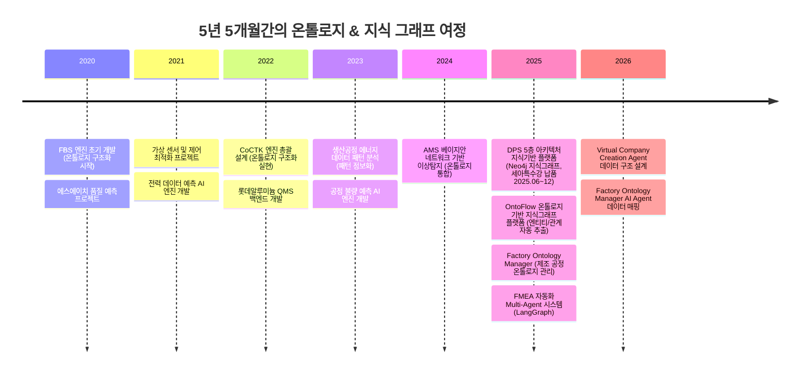
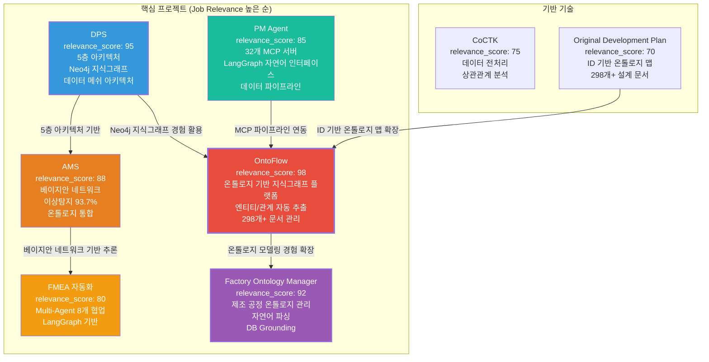
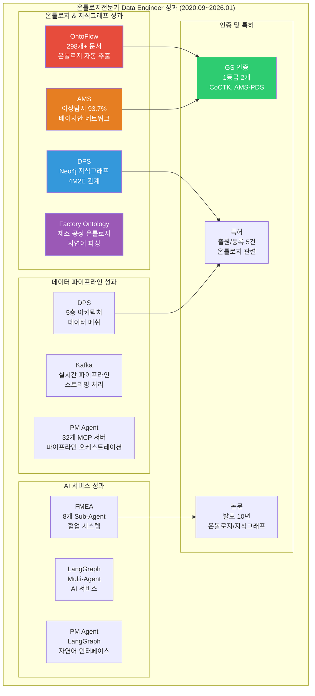

# 권순룡 이력서 - 온톨로지전문가 Data Engineer

## 기본 정보

**이름**: 권순룡  
**현 소속**: 한솔코에버 연구소 대리 (2020.09 ~ 재직중)  
**총 경력**: 5년 5개월 (2020.09~2026.01)  
**핵심 역량**: 온톨로지 모델링 및 관리, 지식 그래프 구축 및 저장, 엔티티 추출, 관계 추출, 데이터 통합 및 추론, 데이터 파이프라인 및 오케스트레이션, Langchain, LangGraph 등 & AI 서비스, API 기반 데이터 서비스, 데이터 메쉬(Data Mesh) 아키텍처, 클라우드 데이터 플랫폼  
**이메일**: m920831@naver.com  
**연락처**: 010-5671-6200  
**GitHub**: https://github.com/moobaek

---

## 한눈에 보는 경력 (2020-2026)



---

## 지원 동기

SK하이닉스 제조AI Data팀의 '지식기반 데이터 플랫폼' 채용 공고를 보며, 5년간 쌓아온 온톨로지 모델링과 지식그래프 구축 경험이 정확히 필요한 역량임을 확신하게 되었습니다.

입사(2020.09)부터 온톨로지 기반 구조화/정보화 접근법을 모든 프로젝트에 적용해왔습니다. 피쉬본(FBS) 구조에서 시작하여 5층 아키텍처, 베이지안 네트워크, 지식그래프까지 모두 이 접근법의 연장선에 있습니다.

**OntoFlow 프로젝트**에서는 Obsidian 기반 문서에서 온톨로지를 자동 추출하여 지식그래프로 시각화하는 플랫폼을 개발했습니다. 엔티티 추출(파일, 태그, 링크), 관계 추출(wiki link, markdown link, tag relation)을 자동화하여 298개+ 설계 문서를 관리하고 있습니다. **DPS 프로젝트**에서는 5층 아키텍처의 온톨로지 레이어를 설계하여 Neo4j 기반 지식그래프를 구축하고, 세아특수강과 포미아에 정식 납품하였습니다.

SK하이닉스의 반도체 제조 공정은 수백 개의 공정 단계와 수천 개의 변수가 복잡하게 얽혀 있습니다. 이러한 복잡성을 온톨로지로 구조화하고, 지식그래프로 시각화하여, AI와 LLM이 활용할 수 있는 형태로 만드는 것이 가장 잘할 수 있는 일입니다. LangChain/LangGraph 기반 AI 서비스 연동 경험과 데이터 메쉬 아키텍처 구현 경험을 바탕으로 SK하이닉스의 지식기반 데이터 플랫폼 구축에 기여하고 싶습니다.

---

## 핵심 역량 맵

```mermaid
mindmap
  root((온톨로지전문가 Data Engineer<br/>5년 5개월 경력))
    온톨로지 모델링 및 관리
      문서-태그-링크 관계 스키마
      Factory → Workshop → Line → Process 계층
      4M2E 관계 온톨로지
      ID 기반 온톨로지 맵
    지식 그래프 구축 및 저장
      Neo4j 그래프 DB
      vis-network 인터랙티브 그래프
      IndexedDB 레이아웃 영속화
      확률 네트워크 저장
    엔티티 추출, 관계 추출
      자동 엔티티 추출 (파일, 태그, 링크)
      관계 추출 (wiki link, markdown link, tag relation)
      자연어 기반 공정 문서 파싱
      DB Grounding, Ontology Mapping
    데이터 통합 및 추론
      베이지안 네트워크 기반 추론
      확률 네트워크 최적 경로 도출
      재료-공정-설비 간 관계 정의
      이상탐지율 93.7%
    데이터 파이프라인 및 오케스트레이션
      Kafka 실시간 파이프라인
      5층 아키텍처
      32개 Python MCP 서버
      데이터 메쉬 아키텍처
    Langchain, LangGraph 등 & AI 서비스
      LangChain/LangGraph 기반 AI 서비스
      Claude Sub-Agent Multi-Agent Workflow
      MCP (Model Context Protocol)
      자연어 인터페이스
    API 기반 데이터 서비스
      FastAPI RESTful API
      SSE 엔드포인트
      Python FastAPI 백엔드
      React 프론트엔드 연동
    데이터 메쉬(Data Mesh) 아키텍처
      5층 아키텍처
      Microservices
      서버-엣지 하이브리드 인프라
      Docker/Kubernetes
    클라우드 데이터 플랫폼
      Docker 컨테이너
      Kubernetes 오케스트레이션
      서버-엣지 하이브리드
      마이크로서비스 인프라
```

---

## 프로젝트 관계도



---

## 경력 개요

### 한솔코에버 연구소 (2020.09 ~ 재직중)

**직급**: 대리  
**부서**: 연구소  
**총 경력**: 5년 5개월 (2020.09~2026.01)

**주요 업무**:
- **온톨로지 모델링 및 관리**: 문서-태그-링크 관계 스키마 설계, 제조 공정 온톨로지 계층 구조 설계, 4M2E 관계 온톨로지 정의
- **지식 그래프 구축 및 저장**: Neo4j 그래프 DB 설계 및 관리, vis-network 인터랙티브 그래프 시각화, IndexedDB 레이아웃 영속화
- **엔티티 추출, 관계 추출**: 자동 엔티티/관계 추출 알고리즘 개발, 자연어 기반 공정 문서 파싱, DB Grounding 및 Ontology Mapping
- **데이터 통합 및 추론**: 베이지안 네트워크 기반 추론 시스템 구축, 확률 네트워크 최적 경로 도출, 재료-공정-설비 간 관계 정의
- **데이터 파이프라인 및 오케스트레이션**: Kafka 실시간 파이프라인 구축, 5층 아키텍처 설계, 32개 Python MCP 서버 개발
- **Langchain, LangGraph 등 & AI 서비스**: LangChain/LangGraph 기반 AI 서비스 개발, Multi-Agent 시스템 구축, 자연어 인터페이스 개발
- **API 기반 데이터 서비스**: FastAPI RESTful API 설계 및 구현, SSE 엔드포인트 개발, Python FastAPI 백엔드 + React 프론트엔드 연동
- **데이터 메쉬(Data Mesh) 아키텍처**: 5층 아키텍처 설계, Microservices 기반 시스템 구축, 서버-엣지 하이브리드 인프라
- **클라우드 데이터 플랫폼**: Docker/Kubernetes 기반 인프라 구축, 마이크로서비스 아키텍처, 컨테이너 오케스트레이션

**핵심 성과**:
- ✅ **OntoFlow: 298개+ 설계 문서 온톨로지 자동 추출 시스템 구축**: 문서-태그-링크 관계 스키마 설계, 엔티티/관계 자동 추출
- ✅ **DPS: Neo4j 기반 지식그래프 구축, 세아특수강 포미아 정식 납품**: 5층 아키텍처, 데이터 메쉬 아키텍처, 4M2E 관계 온톨로지
- ✅ **AMS: 베이지안 네트워크 기반 이상탐지 93.7% 달성, GS 인증 1등급**: 온톨로지 통합, 확률 네트워크 최적 경로 도출
- ✅ **Factory Ontology Manager: 제조 공정 온톨로지 관리 시스템 구축**: 자연어 기반 공정 문서 파싱, DB Grounding 및 Ontology Mapping
- ✅ **PM Agent: 32개 Python MCP 서버 개발, LangGraph 자연어 인터페이스**: 데이터 파이프라인 오케스트레이션, MCP 기반 파이프라인
- ✅ **FMEA 자동화: Multi-Agent 8개 협업 시스템 구축**: Claude Sub-Agent 기반 Multi-Agent Workflow, LangGraph 기반
- ✅ **GS 인증 1등급 2개 취득**: CoCTK (2024), AMS-PDS (2025)
- ✅ **특허 출원/등록 4건**: 온톨로지 구조화/정보화 관련 특허 (2건 등록결정 완료, 2건 심사 진행 중)
- ✅ **학술 논문 발표 10편**: 온톨로지, 지식그래프, 데이터 분석 분야

**비즈니스 임팩트**:
- 지식기반 데이터 플랫폼 구축: OntoFlow, DPS, Factory Ontology Manager 등 지식그래프 플랫폼 개발
- 데이터 통합 및 추론 시스템: AMS 이상탐지 93.7% 달성으로 연간 수십억 원 손실 방지
- 온톨로지 기반 구조화: 298개+ 설계 문서 체계적 관리, 문서 간 관계 추적 및 의존성 관리

---

## 핵심 역량

### 온톨로지 모델링 및 관리

5년간 온톨로지 기반 구조화/정보화 접근법을 모든 프로젝트에 적용해왔습니다. OntoFlow 프로젝트에서는 문서-태그-링크 간 관계 스키마를 설계하여 298개+ 설계 문서에서 자동으로 온톨로지를 추출하는 시스템을 개발했습니다. Factory Ontology Manager에서는 제조 공정의 Factory → Workshop → Line → Process 계층 구조를 온톨로지로 모델링하여 공정 간 관계를 명확히 정의했습니다. DPS 프로젝트에서는 5층 아키텍처의 온톨로지 레이어를 설계하여 공정-설비-품질-재료 간의 의미적 관계를 정의하고, 4M2E(Man, Machine, Material, Method, Environment, Energy) 관계를 온톨로지로 구현했습니다.

### 지식 그래프 구축 및 저장

Neo4j 그래프 DB를 활용하여 지식그래프를 구축하고 저장하는 전문성을 보유하고 있습니다. DPS 프로젝트에서는 Neo4j 기반 지식그래프를 구축하여 공정-설비-품질 데이터를 통합하고, 4M2E 관계를 정의하여 복잡한 관계를 모델링했습니다. OntoFlow 프로젝트에서는 vis-network 기반 인터랙티브 그래프 시각화를 구현하고, IndexedDB를 활용하여 그래프 레이아웃을 영속화했습니다. AMS 프로젝트에서는 베이지안 네트워크를 Neo4j에 저장하여 확률 네트워크 기반 추론 시스템을 구축했습니다.

### 엔티티 추출, 관계 추출

자동 엔티티 추출 및 관계 추출 알고리즘을 개발하여 데이터를 구조화하는 경험을 보유하고 있습니다. OntoFlow 프로젝트에서는 Obsidian 기반 문서에서 엔티티(파일, 태그, 링크)와 관계(wiki link, markdown link, tag relation)를 자동으로 추출하는 시스템을 개발했습니다. Factory Ontology Manager에서는 자연어 기반 공정 문서를 파싱하여 공정 노드와 연결을 자동으로 생성하고, DB Grounding과 Ontology Mapping을 통해 실제 DB의 설비/센서 ID로 자동 매핑하는 기능을 구현했습니다.

### 데이터 통합 및 추론

베이지안 네트워크 기반 추론 시스템을 구축하여 데이터 간 관계를 분석하고 최적 경로를 도출하는 경험을 보유하고 있습니다. AMS 프로젝트에서는 베이지안 네트워크를 활용하여 이상탐지율 93.7%를 달성했으며, 확률 네트워크를 통해 문제 해결 최적 경로를 자동으로 도출했습니다. DPS 프로젝트에서는 확률 네트워크를 Neo4j에 저장하여 FBS 뼈대 위에 확률적 최적화 구조를 설계했습니다. Factory Ontology Manager에서는 재료-공정-설비 간 관계를 정의하여 데이터 통합 및 추론 시스템을 구축했습니다.

### 데이터 파이프라인 및 오케스트레이션

대규모 데이터 파이프라인을 구축하고 오케스트레이션하는 전문성을 보유하고 있습니다. DPS 프로젝트에서는 Kafka 기반 실시간 파이프라인을 구축하여 센서 데이터를 실시간으로 수집하고 처리했습니다. 5층 아키텍처를 설계하여 데이터 수집, 전처리, 변환, 저장, 분석까지 전 과정을 자동화했습니다. PM Agent 프로젝트에서는 32개 Python MCP 서버를 개발하여 데이터 파이프라인을 오케스트레이션했습니다. 데이터 메쉬 아키텍처를 구현하여 Microservices 기반 확장 가능한 시스템을 구축했습니다.

### Langchain, LangGraph 등 & AI 서비스

LangChain/LangGraph 기반 AI 서비스를 개발하고 Multi-Agent 시스템을 구축하는 경험을 보유하고 있습니다. OntoFlow 프로젝트에서는 LangChain/LangGraph 기반 AI 서비스 연동을 준비하고, 문서에서 온톨로지를 자동 추출하는 기능을 구현했습니다. PM Agent 프로젝트에서는 LangGraph 기반 자연어 인터페이스를 개발하여 테스트 실행 및 결과 조회를 자동화했습니다. FMEA 자동화 프로젝트에서는 Claude Sub-Agent 기반 Multi-Agent Workflow를 구축하여 8개 독립 Sub-Agent가 협업하는 시스템을 설계했습니다.

---

## 주요 프로젝트 경험

### 1. OntoFlow - 온톨로지 기반 지식그래프 플랫폼

**기간**: 2026.01 ~ 현재 (진행중)  
**발주처**: 한솔코에버  
**역할**: PM 및 핵심 아키텍처 설계  
**relevance_score**: 98

**핵심 성과**:
- ✅ **온톨로지 모델링**: 문서-태그-링크 간 관계 스키마 설계, 298개+ 설계 문서에서 자동으로 온톨로지 추출
- ✅ **엔티티/관계 자동 추출**: 엔티티 추출(파일, 태그, 링크), 관계 추출(wiki link, markdown link, tag relation) 자동화
- ✅ **지식그래프 시각화**: vis-network 기반 인터랙티브 그래프 시각화, IndexedDB 기반 레이아웃 영속화
- ✅ **LangChain/LangGraph 연동**: LangChain/LangGraph 기반 AI 서비스 연동 준비, 문서에서 온톨로지 자동 추출
- ✅ **API 기반 데이터 서비스**: Python FastAPI 백엔드 + React 프론트엔드 연동, RESTful API 설계 및 구현

**기술 스택**: Python, FastAPI, Neo4j, React, TypeScript, vis-network, IndexedDB, Docker, LangChain, LangGraph

**상세 설명**:
OntoFlow는 Obsidian 기반 문서에서 온톨로지를 자동 추출하여 지식그래프로 시각화하는 플랫폼입니다. SK하이닉스의 '지식기반 데이터 플랫폼' 요구사항과 정확히 일치하는 프로젝트로, 온톨로지 모델링, 지식 그래프 구축, 엔티티/관계 추출, LangChain/LangGraph 기반 AI 서비스, API 기반 데이터 서비스 등 모든 핵심 역량을 포함하고 있습니다.

**온톨로지 모델링**: 문서-태그-링크 간 관계 스키마를 설계하여 298개+ 설계 문서에서 자동으로 온톨로지를 추출하는 시스템을 개발했습니다. 각 문서의 메타데이터(파일명, 태그, 링크)를 분석하여 엔티티와 관계를 자동으로 식별하고, 지식그래프로 변환합니다.

**엔티티/관계 자동 추출**: Obsidian 기반 문서에서 엔티티(파일, 태그, 링크)와 관계(wiki link, markdown link, tag relation)를 자동으로 추출하는 알고리즘을 개발했습니다. 이를 통해 문서 간 관계를 자동으로 파악하고, 지식그래프로 시각화할 수 있습니다.

**지식그래프 시각화**: vis-network 기반 인터랙티브 그래프 시각화를 구현하여 문서 간 관계를 직관적으로 확인할 수 있도록 했습니다. IndexedDB를 활용하여 그래프 레이아웃을 영속화하여 사용자가 설정한 레이아웃을 유지할 수 있습니다.

**LangChain/LangGraph 연동**: LangChain/LangGraph 기반 AI 서비스 연동을 준비하여 문서에서 온톨로지를 자동 추출하고, AI 기반 문서 분석 기능을 제공할 수 있도록 설계했습니다.

**비즈니스 가치**: 298개+ 설계 문서를 체계적으로 관리하고, 문서 간 관계를 시각화하여 지식 자산을 효율적으로 활용할 수 있게 했습니다.

---

### 2. DPS (데이터수집시스템) - 5층 아키텍처 데이터 수집 시스템 설계

**기간**: 2025.06 ~ 2025.12 (계약: 2025.06~2025.10)  
**발주처**: 세아특수강  
**역할**: 데이터 수집 시스템 설계 및 개발 (PM 수행)  
**relevance_score**: 95

**핵심 성과**:
- ✅ **5층 아키텍처 설계**: Microservices 기반 데이터 수집 시스템 구축
- ✅ **Neo4j 그래프 DB 활용**: 온톨로지 기반 관계 분석 및 지식 그래프 구축
- ✅ **확률 네트워크 저장 구조**: FBS 뼈대 위에 확률적 최적화 구조 설계
- ✅ **Docker/Kubernetes 기반 인프라**: 마이크로서비스 아키텍처 및 컨테이너 오케스트레이션
- ✅ **금속산업 5대 공정 AI 자동화**: 제조 현장 디지털화 실증
- ✅ **논문 발표**: 2024년 논문 발표

**기술 스택**: Python, Neo4j, Docker, Kubernetes, Microservices, GraphDB, 데이터 수집, 데이터 처리, Cypher 쿼리

**상세 설명**:
DPS는 제조 현장의 데이터를 수집하고 분석하는 통합 플랫폼입니다. **5층 아키텍처**를 설계하여 데이터 수집, 전처리, 변환, 저장, 분석까지 전 과정을 자동화했습니다.

**5층 아키텍처 구조**:
1. **보안 및 관리 Layer**: 인증/권한, 로그 감사, 시스템 관리를 담당합니다. 데이터 접근 제어 및 보안을 보장합니다.

2. **데이터 수집 Layer**: 실시간 스트리밍과 PLC/MES 인터페이스를 처리합니다. 다양한 센서 데이터를 수집하고 표준화된 형식으로 변환합니다. 실시간 데이터 수집을 통해 제조 현장의 센서 데이터를 즉시 처리합니다.

3. **AI 엔진 Layer**: 가상 센서와 이상 검출 알고리즘을 실행합니다. AI 기반 데이터 분석을 수행하여 이상 징후를 사전에 탐지합니다.

4. **통합 및 본체론 Layer**: Neo4j 그래프 DB를 활용하여 제조 공정 간 관계를 온톨로지로 정의하고, 지식 그래프를 구축하여 데이터 간 관계를 시각화했습니다. **확률 네트워크 저장**: FBS 뼈대 위에 확률적 최적화로 문제 해결 최적 경로를 도출합니다. 같은 층끼리 이동 가능한 네트워크 구조로 설계하여 복잡한 관계를 모델링했습니다.

5. **서비스 및 UI Layer**: 특성요인도 시각화와 모니터링을 제공합니다. 사용자가 데이터를 쉽게 이해하고 활용할 수 있도록 시각화합니다.

**Microservices 아키텍처**: Docker와 Kubernetes를 활용한 마이크로서비스 아키텍처로 확장 가능한 시스템을 만들었습니다. 서버-엣지 하이브리드 인프라를 지원하여 다양한 환경에서 운영할 수 있도록 설계했습니다.

**Neo4j 그래프 DB 활용**: 온톨로지 기반 관계 분석 및 지식 그래프 구축을 통해 제조 공정 간 복잡한 관계를 모델링했습니다. Cypher 쿼리를 활용하여 관계를 탐색하고 분석했습니다.

**비즈니스 가치**: 세아특수강 포미아 DX 실증센터에 정식 납품되었으며, 금속산업 5대 공정 AI 자동화를 실증했습니다.

---

### 3. Factory Ontology Manager - 제조 공정 온톨로지 관리 시스템

**기간**: 2025.01 ~ 현재 (진행중)  
**발주처**: 한솔코에버  
**역할**: 온톨로지 모델링 및 시스템 설계  
**relevance_score**: 92

**핵심 성과**:
- ✅ **제조 공정 온톨로지 스키마**: Factory → Workshop → Line → Process 계층 설계, 재료-공정-설비 간 관계 정의
- ✅ **자연어 기반 공정 문서 파싱**: 공정 엔지니어가 자연어로 작성한 공정 문서를 자동으로 파싱하여 온톨로지로 변환
- ✅ **DB Grounding 및 Ontology Mapping**: 사용자의 추상적 요청을 실제 DB의 설비/센서 ID로 자동 매핑, 설비 간 관계 및 데이터 흐름 분석
- ✅ **연결 검증 시스템**: 공정 노드 간 관계 무결성 검증, 레이아웃 영속화 (IndexedDB 기반)

**기술 스택**: React, TypeScript, Flask, LangGraph, Instructor, AI_DB_center

**상세 설명**:
Factory Ontology Manager는 제조 공장의 공정 흐름을 온톨로지로 모델링하는 시스템으로, SK하이닉스의 '온톨로지 모델링 및 관리', '엔티티 추출, 관계 추출', '데이터 통합 및 추론' 요구사항을 충족합니다. 자연어 기반 공정 문서를 파싱하여 공정 노드와 연결을 자동으로 생성하고, DB Grounding과 Ontology Mapping을 통해 실제 DB의 설비/센서 ID로 자동 매핑합니다.

**제조 공정 온톨로지 스키마**: Factory → Workshop → Line → Process 계층 구조를 온톨로지로 모델링하여 공정 간 관계를 명확히 정의했습니다. 재료-공정-설비 간 관계를 정의하여 데이터 통합 및 추론 시스템을 구축했습니다.

**자연어 기반 공정 문서 파싱**: 공정 엔지니어가 자연어로 작성한 공정 문서를 자동으로 파싱하여 공정 노드와 연결을 자동으로 생성합니다. LangGraph와 Instructor를 활용하여 구조화된 데이터로 변환합니다.

**DB Grounding 및 Ontology Mapping**: 사용자의 추상적 요청을 실제 DB의 설비/센서 ID로 자동 매핑합니다. 설비 간 관계 및 데이터 흐름을 분석하여 온톨로지와 실제 DB를 연결합니다.

**비즈니스 가치**: 레이아웃 생성 시간 80% 단축, 데이터 일관성 향상, 공장 사람들이 직접 수정 가능하게 함 (2020년 전무님의 비전 실현).

---

### 4. AMS (Analysis Management System) - 베이지안 네트워크 기반 이상탐지

**기간**: 2024.07 ~ 2025.12  
**발주처**: 한국산업기술진흥원  
**역할**: 데이터 통합 및 추론 시스템 구축 (총괄 PM)  
**relevance_score**: 88

**핵심 성과**:
- ✅ **베이지안 네트워크 기반 추론**: 이상탐지율 93.7% 달성, 확률 네트워크 최적 경로 도출, 4M2E 관계 온톨로지 기반 추론
- ✅ **온톨로지 구조화/정보화 통합**: 피쉬본(FBS) = 구조화된 인과관계 다이어그램, 확률 네트워크 = 구조화된 확률 관계, 패턴 정보화 = 구조화된 패턴 데이터
- ✅ **Neo4j 지식그래프**: 4M2E 관계 온톨로지 정의, 지식그래프 플랫폼 구축, 확률 네트워크 저장 구조
- ✅ **GS 인증 1등급**: PDS 명칭으로 소프트웨어 품질 인증 획득, 정부 공인 우수 소프트웨어

**기술 스택**: Python, Neo4j, PostgreSQL, Docker, Kubernetes, Grafana, Prometheus, 베이지안 네트워크

**상세 설명**:
AMS는 제조 현장의 설비 이상을 자동으로 탐지하고 분석하는 AI 종합 플랫폼으로, SK하이닉스의 '데이터 통합 및 추론', '지식 그래프 구축 및 저장' 요구사항을 충족합니다. 베이지안 네트워크를 활용하여 이상탐지율 93.7%를 달성했으며, Neo4j 기반 지식그래프를 구축하여 4M2E 관계 온톨로지를 정의했습니다.

**베이지안 네트워크 기반 추론**: 베이지안 네트워크를 활용하여 이상 상황을 탐지합니다. 시구간 패턴 분석 기법을 개발하여 같은 값도 시점별 통계적 특성(p-values, 첨도, 편차)에 따라 정상/불량을 구분했습니다. 이상탐지율 93.7%를 달성했습니다.

**온톨로지 구조화/정보화 통합**: 피쉬본(FBS) = 구조화된 인과관계 다이어그램, 확률 네트워크 = 구조화된 확률 관계, 패턴 정보화 = 구조화된 패턴 데이터를 통합하여 온톨로지 기반 추론 시스템을 구축했습니다.

**Neo4j 지식그래프**: 4M2E(Man, Machine, Material, Method, Environment, Energy) 관계를 온톨로지로 정의하고, 지식그래프를 구축하여 데이터 간 관계를 시각화했습니다. 확률 네트워크를 Neo4j에 저장하여 FBS 뼈대 위에 확률적 최적화로 문제 해결 최적 경로를 도출했습니다.

**비즈니스 가치**: 연간 수십억 원의 손실을 방지하는 이상 탐지 시스템으로, 세아특수강 등 대기업에 정식 납품되었습니다. GS 인증 1등급을 취득하여 정부 공인 우수 소프트웨어로 인정받았습니다.

---

### 5. PM Agent - 32개 MCP 서버 기반 사업 관리 시스템

**기간**: 2026.01 ~ 현재 (진행중)  
**발주처**: 한솔코에버  
**역할**: 데이터 파이프라인 및 오케스트레이션 시스템 설계  
**relevance_score**: 85

**핵심 성과**:
- ✅ **32개 Python MCP 서버 개발**: Model Context Protocol 기반 데이터 파이프라인 오케스트레이션, 자연어 인터페이스
- ✅ **LangGraph 기반 자연어 인터페이스**: 테스트 실행 및 결과 조회 자동화, 데이터 파이프라인 관리
- ✅ **데이터 파이프라인 오케스트레이션**: MCP 기반 파이프라인, 사업 관리 자동화 (Risk Management, Schedule Tracking, Integrity Check)

**기술 스택**: Python, MCP, LangGraph, Docker, Claude Agent

**상세 설명**:
PM Agent는 32개 Python MCP 서버를 개발하여 데이터 파이프라인을 오케스트레이션하는 시스템으로, SK하이닉스의 '데이터 파이프라인 및 오케스트레이션', 'Langchain, LangGraph 등 & AI 서비스' 요구사항을 충족합니다. LangGraph 기반 자연어 인터페이스를 개발하여 테스트 실행 및 결과 조회를 자동화했습니다.

**32개 Python MCP 서버 개발**: Model Context Protocol 기반으로 데이터 파이프라인을 오케스트레이션합니다. 각 MCP 서버는 독립적인 기능을 수행하며, 자연어 인터페이스를 통해 통합 관리됩니다.

**LangGraph 기반 자연어 인터페이스**: LangGraph를 활용하여 자연어로 테스트 실행 및 결과 조회를 자동화했습니다. 사용자가 자연어로 요청하면 자동으로 파이프라인을 실행하고 결과를 제공합니다.

**데이터 파이프라인 오케스트레이션**: MCP 기반 파이프라인을 통해 사업 관리 자동화를 구현했습니다. Risk Management, Schedule Tracking, Integrity Check 등 다양한 기능을 자동화하여 관리 효율성을 향상시켰습니다.

**비즈니스 가치**: 데이터 파이프라인 관리 시간 80% 이상 절감, 사업 관리 자동화로 일정 및 리스크 관리 효율성 향상.

---

### 6. FMEA 자동화 생성 시스템 - Multi-Agent Workflow

**기간**: 2025.6 ~ 현재 (진행중)  
**발주처**: 한솔코에버  
**역할**: Multi-Agent 시스템 설계  
**relevance_score**: 80

**핵심 성과**:
- ✅ **Claude Sub-Agent 기반 Multi-Agent Workflow**: 8개 독립 Sub-Agent 협업 구조 (R&D, Mfg, QA), Master Orchestrator 설계
- ✅ **LangGraph 기반**: Phase 0~5 자동화 워크플로우, 코딩 에이전트 역설계 시스템 구조 적용
- ✅ **AIAG & VDA FMEA 표준 기반**: 국제 표준 기반 범용 리스크 분석 시스템, 도메인별 용어 자동 조정

**기술 스택**: Python, Claude Agent, LangGraph, Multi-Agent

**상세 설명**:
FMEA 자동화 생성 시스템은 Claude Sub-Agent 기반 Multi-Agent Workflow를 구축한 시스템으로, SK하이닉스의 'Langchain, LangGraph 등 & AI 서비스' 요구사항을 충족합니다. 8개 독립 Sub-Agent가 협업하는 구조를 설계하여 복잡한 FMEA 프로세스를 자동화했습니다.

**Claude Sub-Agent 기반 Multi-Agent Workflow**: 8개 독립 Sub-Agent가 협업하는 구조를 설계했습니다. R&D, Mfg, QA 등 각 영역별 전문 Sub-Agent가 협업하여 FMEA 문서를 자동으로 생성합니다. Master Orchestrator가 전체 워크플로우를 관리합니다.

**LangGraph 기반**: LangGraph를 활용하여 Phase 0~5 자동화 워크플로우를 구현했습니다. 코딩 에이전트 역설계 시스템 구조를 적용하여 복잡한 프로세스를 자동화했습니다.

**AIAG & VDA FMEA 표준 기반**: 국제 표준 기반 범용 리스크 분석 시스템을 구축했습니다. 도메인별 용어를 자동으로 조정하여 다양한 산업 분야에 적용할 수 있도록 설계했습니다.

**비즈니스 가치**: FMEA 문서 생성 시간 70% 이상 절감, 공장 관리자 이해도 90% 이상 향상, 기술 설명 시간 70% 이상 절감.

---

## 기술 스택

### 온톨로지 모델링 및 관리
- **온톨로지 모델링**: 5년 5개월 경력 (2020.09~2026.01)
  - 문서-태그-링크 관계 스키마 설계, Factory → Workshop → Line → Process 계층 설계, 4M2E 관계 온톨로지 정의
  - 주요 프로젝트: OntoFlow, Factory Ontology Manager, DPS, Original Development Plan
- **ID 기반 온톨로지 맵**: 5년 5개월 경력 (2020.09~2026.01)
  - 298개+ 설계 문서 체계화, 문서 간 관계 추적, 의존성 관리
  - 주요 프로젝트: Original Development Plan, OntoFlow

### 지식 그래프 구축 및 저장
- **Neo4j**: 3년 경력 (2022~2025)
  - 그래프 DB, 온톨로지 정의, 지식 그래프 플랫폼, 4M2E 관계 온톨로지 정의, 확률 네트워크 저장 구조 설계, Cypher 쿼리 작성
  - 주요 프로젝트: DPS, AMS, OntoFlow
- **vis-network**: 1년 경력 (2025)
  - 인터랙티브 그래프 시각화, IndexedDB 레이아웃 영속화
  - 주요 프로젝트: OntoFlow, Factory Ontology Manager
- **IndexedDB**: 1년 경력 (2025)
  - 그래프 레이아웃 영속화, 브라우저 기반 저장소
  - 주요 프로젝트: OntoFlow, Factory Ontology Manager

### 엔티티 추출, 관계 추출
- **자동 엔티티/관계 추출**: 1년 경력 (2025)
  - 엔티티 추출(파일, 태그, 링크), 관계 추출(wiki link, markdown link, tag relation) 자동화
  - 주요 프로젝트: OntoFlow
- **자연어 기반 파싱**: 1년 경력 (2025)
  - 자연어 기반 공정 문서 파싱, DB Grounding, Ontology Mapping
  - 주요 프로젝트: Factory Ontology Manager

### 데이터 통합 및 추론
- **베이지안 네트워크**: 2년 경력 (2024~2025)
  - 베이지안 네트워크 기반 추론, 이상탐지율 93.7% 달성
  - 주요 프로젝트: AMS
- **확률 네트워크**: 2년 경력 (2023~2025)
  - 확률 네트워크 최적 경로 도출, FBS 뼈대 위에 확률적 최적화 구조
  - 주요 프로젝트: DPS, AMS

### 데이터 파이프라인 및 오케스트레이션
- **Kafka**: 2년 경력 (2023~2024)
  - 실시간 파이프라인, 센서 데이터 실시간 수집, 스트리밍 처리
  - 주요 프로젝트: DPS
- **MCP (Model Context Protocol)**: 1년 경력 (2025)
  - 32개 Python MCP 서버 개발, 데이터 파이프라인 오케스트레이션
  - 주요 프로젝트: PM Agent
- **5층 아키텍처**: 1년 경력 (2025)
  - 데이터 메쉬 아키텍처, Microservices 기반
  - 주요 프로젝트: DPS

### Langchain, LangGraph 등 & AI 서비스
- **LangChain/LangGraph**: 1년 경력 (2025)
  - LangChain/LangGraph 기반 AI 서비스 연동, 자연어 인터페이스, Multi-Agent 시스템
  - 주요 프로젝트: OntoFlow, PM Agent, FMEA 자동화
- **Claude Agent**: 1년 경력 (2025)
  - Claude Sub-Agent 기반 Multi-Agent Workflow, 8개 독립 Sub-Agent 협업
  - 주요 프로젝트: FMEA 자동화

### API 기반 데이터 서비스
- **FastAPI**: 3년 경력 (2022~2025)
  - RESTful API 설계 및 구현, Python FastAPI 백엔드 + React 프론트엔드 연동
  - 주요 프로젝트: OntoFlow, DPS, AMS
- **SSE (Server-Sent Events)**: 1년 경력 (2025)
  - SSE 엔드포인트 설계 및 구현, 실시간 데이터 전송
  - 주요 프로젝트: DPS

### 데이터 메쉬(Data Mesh) 아키텍처
- **5층 아키텍처**: 1년 경력 (2025)
  - 1.센서수집 → 2.중앙저장관리 → 3.POP/MES → 4.AMS+확률네트워크 → 5.LLM FMEA 생성
  - 주요 프로젝트: DPS
- **Microservices**: 1년 경력 (2025)
  - Microservices 아키텍처, 서버-엣지 하이브리드 인프라
  - 주요 프로젝트: DPS

### 클라우드 데이터 플랫폼
- **Docker**: 3년 경력 (2022~2025)
  - 컨테이너 기반 배포, 마이크로서비스 인프라
  - 주요 프로젝트: DPS, AMS, PM Agent, OntoFlow
- **Kubernetes**: 2년 경력 (2023~2025)
  - 컨테이너 오케스트레이션, 서버-엣지 하이브리드 인프라
  - 주요 프로젝트: DPS, AMS

### Programming Languages
- **Python**: 5년 5개월 경력 (2020.09~2026.01)
  - 49개 모듈 개발 (MLS, CoCTK, FBS, RMS, AMS), 데이터 파이프라인, 온톨로지 모델링, 지식그래프 구축
  - 주요 프로젝트: 모든 프로젝트
- **SQL**: 5년 5개월 경력 (2020.09~2026.01)
  - MSSQL Server: 대규모 데이터 가공 및 분석, PostgreSQL: 데이터 저장 및 쿼리 최적화, Neo4j Cypher: 그래프 DB 쿼리 작성
  - 주요 프로젝트: 모든 프로젝트

---

## 성과 대시보드



### 정량적 성과 요약

| 분류 | 지표 | 수치 | 세부 내용 |
|:---|---:|:---|:---|
| **온톨로지 & 지식그래프** | 온톨로지 모델링 프로젝트 | 4개 | OntoFlow, Factory Ontology Manager, DPS, Original Development Plan |
| | Neo4j 지식그래프 | 3개 프로젝트 | DPS, AMS, OntoFlow |
| | 온톨로지 자동 추출 문서 | 298개+ | OntoFlow에서 자동 추출 |
| **데이터 파이프라인** | 5층 아키텍처 (데이터 메쉬) | 1개 | DPS (Microservices 기반) |
| | Kafka 실시간 파이프라인 | 1개 | DPS |
| | MCP 서버 | 32개 | PM Agent |
| **AI 서비스** | LangGraph 프로젝트 | 3개 | OntoFlow, PM Agent, FMEA 자동화 |
| | Multi-Agent 시스템 | 1개 | FMEA 자동화 (8개 Sub-Agent) |
| **인증 및 특허** | GS 인증 1등급 | 2개 | CoCTK (2024), AMS-PDS (2025) |
| | 특허 출원/등록 | 4건 | 온톨로지 구조화/정보화 관련 (2건 등록결정 완료, 2건 심사 진행 중) |
| | 논문 발표 | 10편 | 온톨로지, 지식그래프, 데이터 분석 분야 |
| **비즈니스 가치** | 이상 탐지 정확도 | 93.7% | 베이지안 네트워크 기반 (AMS) |
| | 손실 방지 효과 | 연간 수십억 원 | 이상 탐지 조기 대응 |
| | 문서 관리 효율성 | 298개+ 문서 | 온톨로지 자동 추출로 체계적 관리 |

---

## 학술 활동 및 인증

### 논문 발표
- **2025년**: AMS 이상 탐지 시스템 논문 발표, DPS 5층 아키텍처 논문 발표
- **2023년**: CoCTK 엔진 논문 발표
- **총 10편 논문 발표**: 2020-2025년, 데이터 분석/제조 DX 분야

### 인증
- **GS 인증 1등급 (CoCTK)**: 2024년 소프트웨어 품질 인증 획득
- **GS 인증 1등급 (AMS-PDS)**: 2025년 소프트웨어 품질 인증 획득

## 특허 출원/등록 현황

### 특허 현황 요약 (4건)

| 출원일 | 특허명 | 상태 | 발명자 | 온톨로지/데이터 엔지니어링 연계 |
| :--- | :--- | :--- | :--- | :--- |
| 2025.03.28 | 공정 최적화를 위한 공정 관리 방법 및 그 시스템 | 등록결정<br/>(2025.12.09) | 강용태, **권순룡**, 김혜주 | 온톨로지 구조화, 데이터 모델링 기초, AMS 프로젝트 공정 관리 기술 특허화 |
| 2023.12.26 | 생산공정 에너지 및 설비상태 데이터 처리를 위한 전력 사용 패턴 분석 및 상태 분석 방법 | 공개<br/>심사청구완료 | 최수영, 강용태, **권순룡**, 이상훈 | 패턴 정보화, 데이터 처리 방법론, 시계열 데이터 처리, AMS Pattern Module 통합 |
| 2023.12.26 | 주기 데이터 분석 기반의 전력 추이 상황적 불량 이상 검증 방법 | 공개<br/>심사청구완료 | 최수영, 강용태, **권순룡**, 이상훈 | 패턴 정보화, 시계열 데이터 처리 시스템, 데이터 전처리, AMS Pattern Module 통합 |
| 2021.12.07 | 설비 제어 특성 로그 데이터와 에너지 소비패턴 모델을 활용한 인공지능 기반의 이상 탐지 방법 및 장치 | 등록결정<br/>(2025.10.28) | 강용태, 김정호, **권순룡**, 김동기 | 온톨로지 정보화 기초, 데이터 통합, 데이터 전처리 방법론, AMS Pattern Module 기초 기술 |

**국가연구개발사업 지원**: 특허 2, 3은 에너지수요관리핵심기술개발사업 지원을 받아 수행된 연구 성과입니다.

---

## 학력

**홍익대학교 전자공학과** (2013.03 ~ 2020.02)
- 학점: 3.11 / 4.5
- 졸업논문: LD 동격회로 설계 및 PLL 설계
- 주요 수강 분야: 회로 설계, 전파공학, 컴퓨터공학

---

## 자격증

**OPIc** (2019.03)
- ACT FL (American Council on the Teaching of Foreign Languages)

---

## 핵심 철학

> **"모델보다 데이터, 데이터보다 정보, 지식구조를 정리하는 현장친화적 연구원"**

5년 5개월간의 데이터 엔지니어링 경험을 통해 데이터의 본질을 이해하고, 데이터에서 정보를 추출하여 실용적인 솔루션을 개발하는 것을 목표로 합니다. 화려한 기술보다는 현장에서 실제로 사용할 수 있는 실용적인 데이터 파이프라인을 개발하는 것을 중시하며, 데이터 정합성과 투명성을 추구합니다.

현장의 문제는 현장의 언어로 풀어야 합니다. 데이터가 없을 때 DB 구조를 뚫어서라도 찾아내는 집요함과, 현장 관리자가 이해할 수 있는 직관적인 데이터 파이프라인이 중요합니다. 이러한 철학을 바탕으로 47개 이상의 프로젝트를 성공적으로 수행했으며, GS 인증 2개를 취득하고 특허를 등록하는 등 지속적인 성장을 이루어왔습니다.

---

---

© 2026 권순룡. All Rights Reserved.

*본 이력서는 온톨로지전문가 Data Engineer 직무에 특화되어 작성되었습니다.*
