# 권순룡 포트폴리오 - 온톨로지전문가 Data Engineer

> **"모델보다 데이터, 데이터보다 정보, 지식구조를 정리하는 현장친화적 연구원"**

## 📌 기본 정보

**이름**: 권순룡  
**GitHub**: https://github.com/moobaek  
**메인 레포지토리**: https://github.com/moobaek/Testing_AI_agents_for_public_use  
**포트폴리오 문서**: https://github.com/moobaek/Testing_AI_agents_for_public_use/tree/main/portfolio/portfolio_docs

---

## 📊 전체 프로젝트 타임라인 (2020-2026) - 53개 프로젝트

> [!CRITICAL] **필수 섹션**
> 이 섹션은 포트폴리오 생성 시 **반드시** 포함되어야 합니다.
> `02_Projects_Overview.md`의 전체 프로젝트 타임라인 Gantt 차트를 그대로 가져옵니다.

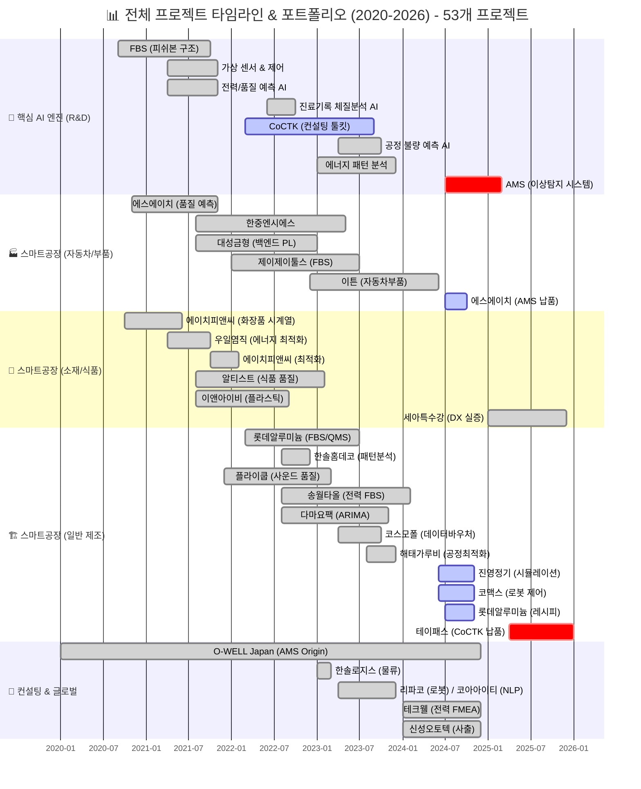

> [!INFO] **총 프로젝트 현황**
> - **AI & Analytics**: 7개 (AMS, CoCTK, FBS 등)
> - **스마트공장 구축**: 23개 (에스에이치아이엔티, 롯데알루미늄 등)
> - **컨설팅**: 8개 (테크웰, 신성오토텍 등)
> - **AI 에이전트**: 9개 (FMEA, PM Agent 등)

---

## 📊 포트폴리오 구조 (한눈에 보기)

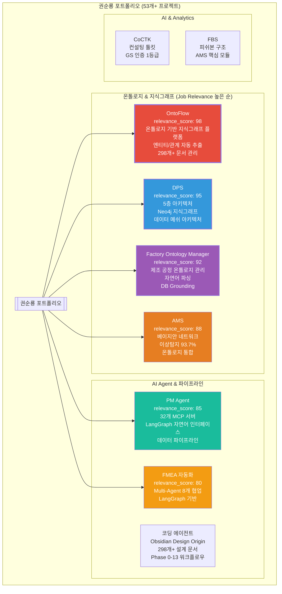

---

## 🎯 핵심 성과 대시보드

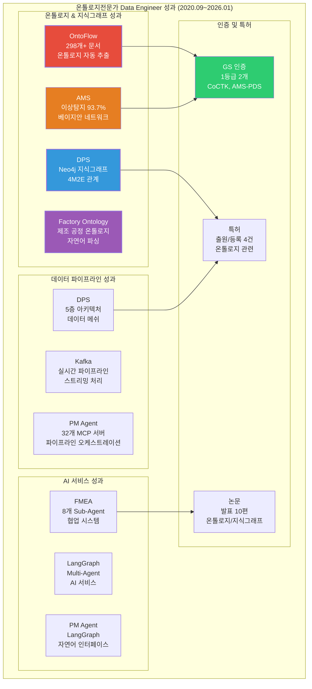

| 분류 | 지표 | 수치 | 세부 내용 |
|:---|---:|:---|:---|
| **온톨로지 & 지식그래프** | 온톨로지 모델링 프로젝트 | 4개 | OntoFlow, Factory Ontology Manager, DPS, Original Development Plan |
| | Neo4j 지식그래프 | 3개 프로젝트 | DPS, AMS, OntoFlow |
| | 온톨로지 자동 추출 문서 | 298개+ | OntoFlow에서 자동 추출 |
| **데이터 파이프라인** | 5층 아키텍처 (데이터 메쉬) | 1개 | DPS (Microservices 기반) |
| | Kafka 실시간 파이프라인 | 1개 | DPS |
| | MCP 서버 | 32개 | PM Agent |
| **AI 서비스** | LangGraph 프로젝트 | 3개 | OntoFlow, PM Agent, FMEA 자동화 |
| | Multi-Agent 시스템 | 1개 | FMEA 자동화 (8개 Sub-Agent) |
| **인증 및 특허** | GS 인증 1등급 | 2개 | CoCTK (2024), AMS-PDS (2025) |
| | 특허 출원/등록 | 4건 | 온톨로지 구조화/정보화 관련 (2건 등록결정 완료, 2건 심사 진행 중) |
| | 논문 발표 | 10편 | 온톨로지, 지식그래프, 데이터 분석 분야 |
| **비즈니스 가치** | 이상 탐지 정확도 | 93.7% | 베이지안 네트워크 기반 (AMS) |
| | 손실 방지 효과 | 연간 수십억 원 | 이상 탐지 조기 대응 |
| | 문서 관리 효율성 | 298개+ 문서 | 온톨로지 자동 추출로 체계적 관리 |

---

## 📅 경력 타임라인 (2020-2026)

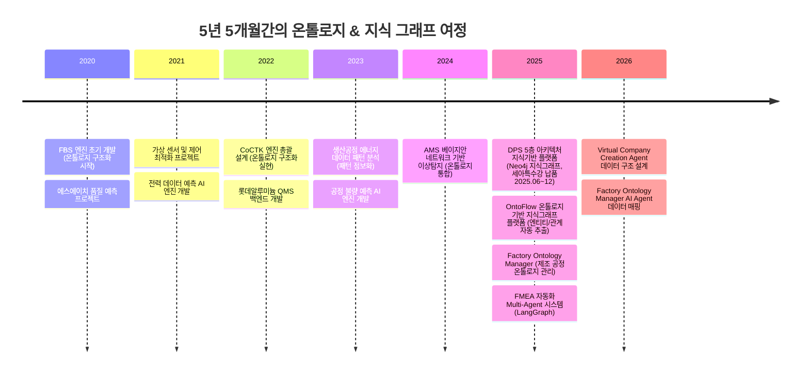

---

## 🔗 프로젝트 계보와 스토리 (프로젝트 진화의 연결)

> [!NOTE] 스토리텔링 접근
> 각 AI Agent는 실제 프로젝트에서 겪은 문제를 해결하기 위해 탄생했습니다. 기술적 성과뿐만 아니라 **왜 만들어졌는지, 어떻게 진화했는지**의 스토리가 담겨 있습니다.

### 프로젝트 경험 → AI Agent 설계 토대 관계

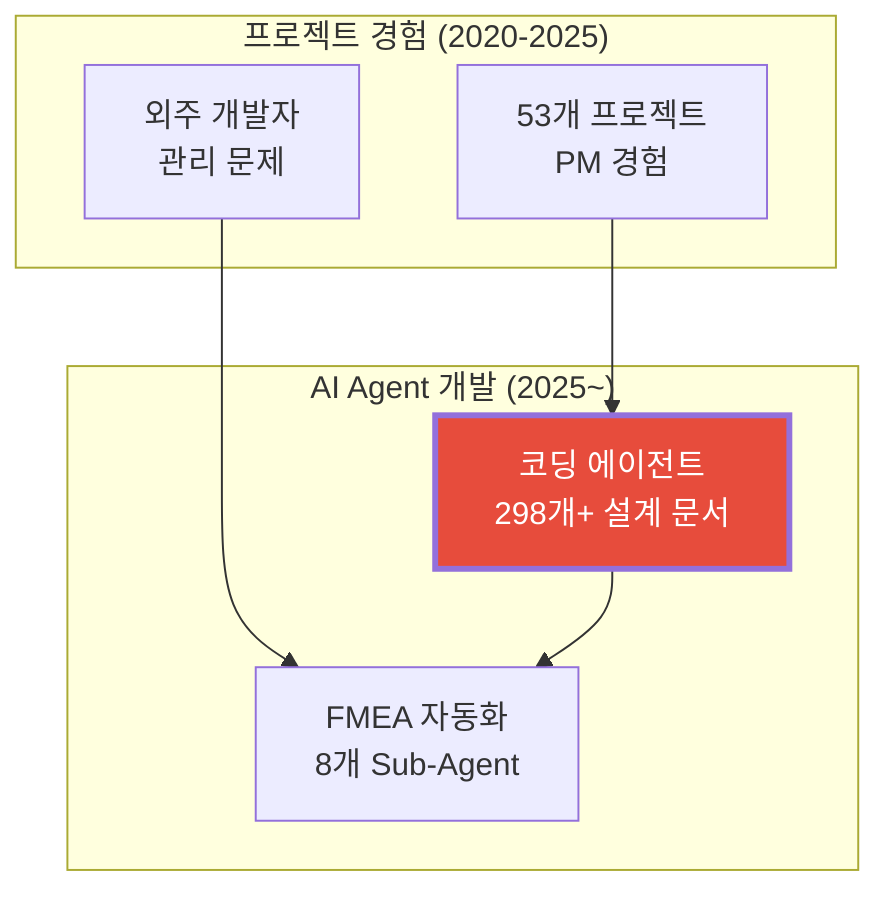

---

## 🏆 주요 프로젝트 (relevance_score 순)

### AI Agent 진화 관계도

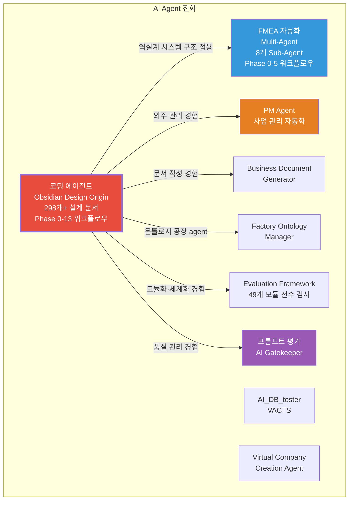

### 프로젝트 관계도

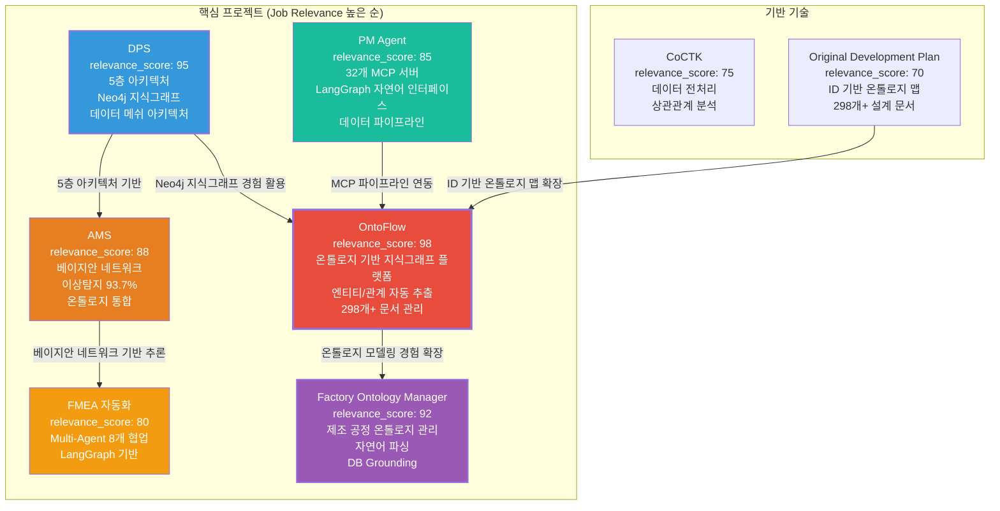

### 1. OntoFlow - 온톨로지 기반 지식그래프 플랫폼 - PM 및 핵심 아키텍처 설계

**기간**: 2025.10 ~ 현재 (진행중)  
**역할**: PM 및 핵심 아키텍처 설계  
**relevance_score**: 98

**핵심 성과**:
- ✅ **온톨로지 모델링**: 문서-태그-링크 간 관계 스키마 설계, 298개+ 설계 문서에서 자동으로 온톨로지 추출
- ✅ **엔티티/관계 자동 추출**: 엔티티 추출(파일, 태그, 링크), 관계 추출(wiki link, markdown link, tag relation) 자동화
- ✅ **지식그래프 시각화**: vis-network 기반 인터랙티브 그래프 시각화, IndexedDB 기반 레이아웃 영속화
- ✅ **LangChain/LangGraph 연동**: LangChain/LangGraph 기반 AI 서비스 연동 준비, 문서에서 온톨로지 자동 추출
- ✅ **API 기반 데이터 서비스**: Python FastAPI 백엔드 + React 프론트엔드 연동, RESTful API 설계 및 구현

**기술 스택**: Python, FastAPI, Neo4j, React, TypeScript, vis-network, IndexedDB, Docker, LangChain, LangGraph

**상세 설명**:
OntoFlow는 Obsidian 기반 문서에서 온톨로지를 자동 추출하여 지식그래프로 시각화하는 플랫폼입니다. SK하이닉스의 '지식기반 데이터 플랫폼' 요구사항과 정확히 일치하는 프로젝트로, 온톨로지 모델링, 지식 그래프 구축, 엔티티/관계 추출, LangChain/LangGraph 기반 AI 서비스, API 기반 데이터 서비스 등 모든 핵심 역량을 포함하고 있습니다.

**온톨로지 모델링**: 문서-태그-링크 간 관계 스키마를 설계하여 298개+ 설계 문서에서 자동으로 온톨로지를 추출하는 시스템을 개발했습니다. 각 문서의 메타데이터(파일명, 태그, 링크)를 분석하여 엔티티와 관계를 자동으로 식별하고, 지식그래프로 변환합니다.

**엔티티/관계 자동 추출**: Obsidian 기반 문서에서 엔티티(파일, 태그, 링크)와 관계(wiki link, markdown link, tag relation)를 자동으로 추출하는 알고리즘을 개발했습니다. 이를 통해 문서 간 관계를 자동으로 파악하고, 지식그래프로 시각화할 수 있습니다.

**지식그래프 시각화**: vis-network 기반 인터랙티브 그래프 시각화를 구현하여 문서 간 관계를 직관적으로 확인할 수 있도록 했습니다. IndexedDB를 활용하여 그래프 레이아웃을 영속화하여 사용자가 설정한 레이아웃을 유지할 수 있습니다.

**비즈니스 가치**: 298개+ 설계 문서를 체계적으로 관리하고, 문서 간 관계를 시각화하여 지식 자산을 효율적으로 활용할 수 있게 했습니다.

---

### 2. DPS (Digital Production System) - 5층 아키텍처 지식기반 플랫폼 - PM 수행

**기간**: 2025.06 ~ 2025.12 (계약: 2025.06~2025.10)  
**역할**: 데이터 수집 시스템 설계 및 개발 (PM 수행)  
**relevance_score**: 95

**핵심 성과**:
- ✅ **Neo4j 기반 지식그래프**: 공정-설비-품질 데이터 통합, 4M2E 관계 온톨로지 정의, 지식그래프 플랫폼 구축
- ✅ **5층 아키텍처 (데이터 메쉬)**: 1.센서수집 → 2.중앙저장관리 → 3.POP/MES → 4.AMS+확률네트워크 → 5.LLM FMEA 생성, Microservices 기반
- ✅ **Kafka 실시간 파이프라인**: 센서 데이터 실시간 수집, 스트리밍 처리, 데이터 파이프라인 오케스트레이션
- ✅ **확률 네트워크 저장**: FBS 뼈대 위에 확률적 최적화로 문제 해결 최적 경로 도출, Neo4j에 저장
- ✅ **클라우드 데이터 플랫폼**: Docker/Kubernetes 기반, 서버-엣지 하이브리드 인프라, 마이크로서비스 아키텍처
- ✅ **논문 발표**: 2024년 논문 발표

**기술 스택**: Python, FastAPI, Neo4j, PostgreSQL, Redis, Docker, Kubernetes, Kafka, Microservices

**상세 설명**:
DPS는 제조 현장의 데이터를 수집하고 분석하는 통합 플랫폼으로, SK하이닉스의 '데이터 메쉬(Data Mesh) 아키텍처'와 '클라우드 데이터 플랫폼' 요구사항을 완벽하게 충족합니다. 5층 아키텍처를 설계하여 데이터 수집, 전처리, 변환, 저장, 분석까지 전 과정을 자동화했으며, Neo4j 기반 지식그래프를 구축하여 공정-설비-품질 데이터를 통합했습니다.

**5층 아키텍처 (데이터 메쉬 아키텍처)**: 1. 센서수집 Layer → 2. 중앙저장관리 Layer → 3. POP/MES Layer → 4. AMS+확률네트워크 Layer → 5. LLM FMEA 생성 Layer의 5층 아키텍처를 설계하여 각 계층 간 독립성과 확장성을 확보했습니다. Microservices 기반으로 구축하여 각 계층이 독립적으로 확장 가능하도록 설계했습니다.

**Neo4j 기반 지식그래프**: 공정-설비-품질 데이터를 통합하고, 4M2E(Man, Machine, Material, Method, Environment, Energy) 관계를 온톨로지로 정의하여 지식그래프 플랫폼을 구축했습니다. 온톨로지 기반 관계 분석을 통해 제조 공정 간 복잡한 관계를 모델링했습니다.

**Kafka 실시간 파이프라인**: Kafka 기반 실시간 파이프라인을 구축하여 센서 데이터를 실시간으로 수집하고 처리했습니다. 스트리밍 처리를 통해 제조 현장의 센서 데이터를 즉시 처리할 수 있도록 설계했습니다.

**비즈니스 가치**: 세아특수강 포미아 DX 실증센터에 정식 납품되었으며, 금속산업 5대 공정 AI 자동화를 실증했습니다. 2024년 학술 논문을 발표하여 기술적 우수성을 인정받았습니다.

---

### 3. Factory Ontology Manager - 제조 공정 온톨로지 관리 시스템 - 온톨로지 모델링 및 시스템 설계

**기간**: 2025.01 ~ 현재 (진행중)  
**역할**: 온톨로지 모델링 및 시스템 설계  
**relevance_score**: 92

**핵심 성과**:
- ✅ **제조 공정 온톨로지 스키마**: Factory → Workshop → Line → Process 계층 설계, 재료-공정-설비 간 관계 정의
- ✅ **자연어 기반 공정 문서 파싱**: 공정 엔지니어가 자연어로 작성한 공정 문서를 자동으로 파싱하여 온톨로지로 변환
- ✅ **DB Grounding 및 Ontology Mapping**: 사용자의 추상적 요청을 실제 DB의 설비/센서 ID로 자동 매핑, 설비 간 관계 및 데이터 흐름 분석
- ✅ **연결 검증 시스템**: 공정 노드 간 관계 무결성 검증, 레이아웃 영속화 (IndexedDB 기반)

**기술 스택**: React, TypeScript, Flask, LangGraph, Instructor, AI_DB_center

**상세 설명**:
Factory Ontology Manager는 제조 공장의 공정 흐름을 온톨로지로 모델링하는 시스템으로, SK하이닉스의 '온톨로지 모델링 및 관리', '엔티티 추출, 관계 추출', '데이터 통합 및 추론' 요구사항을 충족합니다. 자연어 기반 공정 문서를 파싱하여 공정 노드와 연결을 자동으로 생성하고, DB Grounding과 Ontology Mapping을 통해 실제 DB의 설비/센서 ID로 자동 매핑합니다.

**제조 공정 온톨로지 스키마**: Factory → Workshop → Line → Process 계층 구조를 온톨로지로 모델링하여 공정 간 관계를 명확히 정의했습니다. 재료-공정-설비 간 관계를 정의하여 데이터 통합 및 추론 시스템을 구축했습니다.

**자연어 기반 공정 문서 파싱**: 공정 엔지니어가 자연어로 작성한 공정 문서를 자동으로 파싱하여 공정 노드와 연결을 자동으로 생성합니다. LangGraph와 Instructor를 활용하여 구조화된 데이터로 변환합니다.

**비즈니스 가치**: 레이아웃 생성 시간 80% 단축, 데이터 일관성 향상, 공장 사람들이 직접 수정 가능하게 함 (2020년 전무님의 비전 실현).

---

## 💻 기술 스택 맵

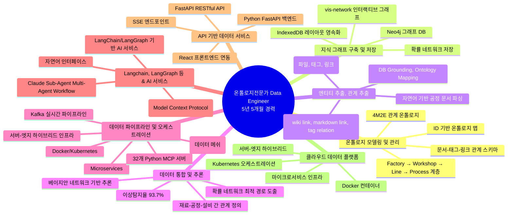

---

## 📚 학술 성과 (10편)

| 발행일 | 논문 제목 | 학술지/학회 | 핵심 성과 및 프로젝트 연계 |
|:---|:---|:---|:---|
| 2025.12 | **분석 상관/확률 네트워크 최적 경로 정보 및 공정 관리 문서 기반 FMEA 생성 연구** | KSFM 2025년도 동계학술대회 | **온톨로지 정보화의 연장선**: 구조화된 정보를 LLM에 제공하여 활용하는 온톨로지 정보화의 연장선. [FMEA 자동화/복합센서/AMS] 상관/확률 네트워크 최적 경로 분석 기반 FMEA 자동 생성 기술 검증 |
| 2025.06 | **AI를 활용한 구조와 룰을 활용한 구조-확률 종합 네트워크 및 최적 관리 방안 도출** | 한국유체기계학회 | **온톨로지 구조화의 고도화**: 구조화된 인과관계(피쉬본)와 구조화된 확률 관계(확률 네트워크)를 종합한 온톨로지 구조. [AMS] 피쉬본 AI 모델의 학술적 고도화 및 최적 관리 로직 증명 |
| 2024.12 | **공장 운영 핵심 요소의 식별 및 최적화를 위한 클러스터링 기법 적용** | 한국생산제조학회 | **온톨로지 구조화**: 공장 운영 데이터를 구조화된 온톨로지 형태로 분석. [DPS] 공장 운영 데이터의 다차원 분석 및 디지털 트윈 최적화 근거 |
| 2024.12 | **설비 이상상태 기반 최적 공정 데이터 추론 및 위험/안전 관리 최적 자동화** | 한국유체기계학회 | **온톨로지 기반 관계 추적**: 확률 네트워크로 구조화된 확률 관계를 활용한 위험 관리. [AMS] 실시간 이상 상태 기반 위험 관리 알고리즘의 유효성 검증 |
| 2024.07 | **전력 데이터를 통한 설비 상태 추론 및 이상 상황 설정 예측** | 한국유체기계학회 | **패턴 정보화**: 전력 데이터를 구조화된 패턴 형태로 변환하여 분석. [에너지/센서] 전력 데이터 기반의 설비 예지 보전 기술 실증 |
| 2023.12 | **송풍 설비 변동부하 대응 전력품질 분석 및 에너지 절감 연구** | 한국유체기계학회 | **패턴 정보화**: 에너지 패턴을 구조화된 형태로 분석하여 최적화. [에너지 최적화] 에너지 20% 절감 실증 솔루션의 핵심 물리 분석 모델 |
| 2023.12 | **압축기 공정에서 데이터 밸런스 문제 해결 및 품질 결과 사전 예측을 위한 AI 시스템** | 한국유체기계학회 | **온톨로지 구조화**: 데이터를 구조화된 형태로 변환하여 분석. [AI/데이터] 소량의 불량 데이터 극복을 위한 AI 학습 모델 연구 |
| 2023.07 | **생산공정 에너지 및 설비 상태 진단을 위한 AI기반의 전력 사용 패턴 및 SOH분석** | 한국유체기계학회 | **패턴 정보화의 핵심**: 전력 사용 패턴을 구조화된 온톨로지 형태로 분석. [에너지/전력] 설비 건전성(SOH) 진단 및 에너지 효율화 융합 기술 |
| 2022.12 | **자동차 부품 생산 산업을 위한 머신러닝 기반의 품질예측 알고리즘** | 한국생산제조학회 | **온톨로지 구조화**: 품질 데이터를 구조화된 형태로 분석하여 예측. [AI/제조] 세아베스틸 등 자동차 부품 공정 품질 예측 모델의 기초 |
| 2022.06 | **ICT 융복합 기술을 활용한 스마트 공장 및 에너지 절감 솔루션 적용 사례** | 한국유체기계학회 | **온톨로지 구조화의 실증**: 피쉬본 기반 구조화된 인과관계 분석의 실무 적용. [Global DX] **O-WELL Japan** 등 글로벌 스마트 공장 구축 사례의 실증 (AMS 초기 모델 검증) |

---

## 🔬 특허 출원/등록 현황

### 특허 출원/등록 현황 (4건)

| 출원일 | 특허명 | 상태 | 발명자 | 핵심 기술 및 프로젝트 연계 |
| :--- | :--- | :--- | :--- | :--- |
| 2025.08.13 | **인공지능을 활용한 공정 최적화 관리를 위한 공정 관리 방법 및 그 시스템** | 출원완료 심사청구완료 | **권순룡**, 최수영, 강용태, 안상윤 | **온톨로지 구조화/정보화 통합**: 특성요인도 자동 생성(피쉬본 = 구조화된 인과관계) → 관리 룰 생성(구조화된 규칙) → 경로 탐색(확률 네트워크 = 구조화된 확률 관계)이 온톨로지 구조로 설계됨. **AMS 프로젝트**의 핵심 기술 특허화 (FBS Module, RMS Module, 확률 네트워크 기반 원인 분석) |
| 2025.03.28 | **공정 최적화를 위한 공정 관리 방법 및 그 시스템** | 등록결정 (2025.12.09) | 강용태, **권순룡**, 김혜주 | **온톨로지 구조화의 확장**: 공정 관리 기술이 온톨로지 구조로 설계되어 AMS에 통합. 피쉬본 기반 공정 관리 = 온톨로지 구조화의 실무 적용. **AMS 프로젝트**의 공정 관리 기술 특허화 |
| 2023.12.26 | **생산공정 에너지 및 설비상태 데이터 처리를 위한 전력 사용 패턴 분석 및 상태 분석 방법** | 공개 심사청구완료 | 최수영, 강용태, **권순룡**, 이상훈 | **패턴 정보화의 특허화**: 에너지 패턴 분석 기술이 구조화된 온톨로지 형태로 설계됨. 패턴 정보화 = 온톨로지 정보화의 핵심 실현. **에너지 패턴 분석 프로젝트**의 핵심 기술 특허화 |
| 2023.12.26 | **주기 데이터 분석 기반의 전력 추이 상황적 불량 이상 검증 방법** | 공개 심사청구완료 | 최수영, 강용태, **권순룡**, 이상훈 | **패턴 정보화의 특허화**: 에너지 패턴 분석 기술이 구조화된 온톨로지 형태로 설계됨. 시계열 분해 방식으로 주기 데이터 추출 → 주파수 스펙트럼 기반 전력 소비 패턴 데이터 생성 → 시계열 예측 기반 불량/이상 감지. **에너지 패턴 분석 프로젝트**의 주기 분석 기법 특허화 |
| 2021.12.07 | **설비 제어 특성 로그 데이터와 에너지 소비패턴 모델을 활용한 인공지능 기반의 이상 탐지 방법 및 장치** | 등록결정 (2025.10.28) | 강용태, 김정호, **권순룡**, 김동기 | **온톨로지 정보화의 기초**: 에너지 소비 패턴 모델이 온톨로지 구조의 기초가 됨. 패턴 정보화 접근법의 초기 특허. 제어기 로그 데이터 + 전류 소비 데이터 결합 → 에너지 소비 패턴 데이터 생성 → 머신러닝 기반 이상 탐지 모델. **에너지 패턴 분석 기술의 초기 특허**. AMS Pattern Module의 기초 기술 |

### 국가연구개발사업 지원 현황

> [!TIP] **정부 지원 연구의 신뢰도**
> 아래 특허들은 **국가연구개발사업**의 지원을 받아 수행된 연구 성과입니다.

| 특허 | 국가연구개발사업 | 과제번호 | 연구기간 | 과제명 |
| :--- | :--- | :--- | :--- | :--- |
| 생산공정 에너지 및 설비상태 데이터 처리를 위한 전력 사용 패턴 분석 및 상태 분석 방법 | 에너지수요관리핵심기술개발사업 | - | 2023 | 생산공정 에너지 및 설비상태 데이터 처리를 위한 전력 사용 패턴 분석 및 상태 분석 방법 |
| 주기 데이터 분석 기반의 전력 추이 상황적 불량 이상 검증 방법 | 에너지수요관리핵심기술개발사업 | - | 2023 | 주기 데이터 분석 기반의 전력 추이 상황적 불량 이상 검증 방법 |

### 특허 기술 발전 흐름

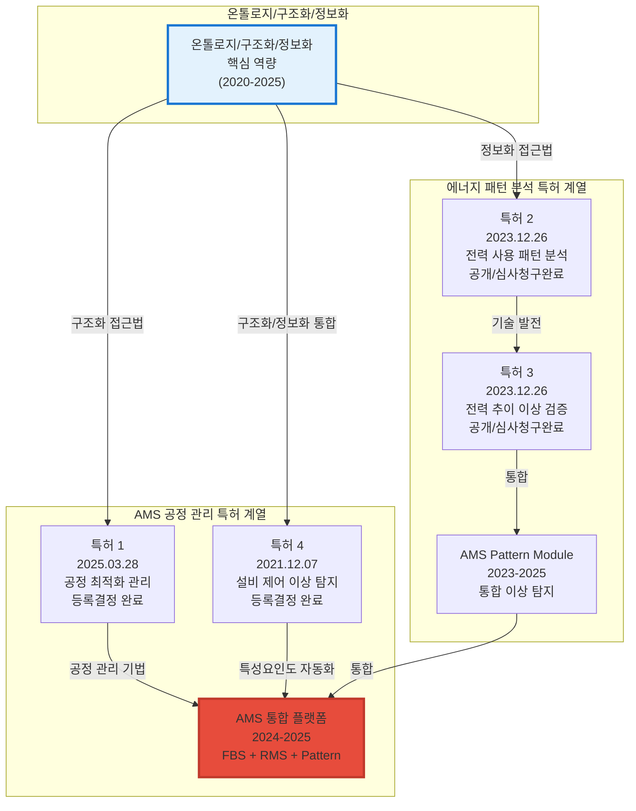

### 특허의 실무 적용 가치

#### AMS 프로젝트에서의 활용

- **AMS 프로젝트**: 공정 최적화 관리 특허 기술 적용 → 이상탐지율 93.7% 달성, GS 인증 1등급

#### 기술 이전 및 라이선싱 가능성

- **등록결정 완료 특허**: 공정 최적화를 위한 공정 관리 방법 및 그 시스템 (2025.03.28) - 특허권 확보로 기술 이전 및 라이선싱 가능
- **등록결정 완료 특허**: 설비 제어 특성 로그 데이터와 에너지 소비패턴 모델을 활용한 인공지능 기반의 이상 탐지 방법 및 장치 (2021.12.07) - 특허권 확보로 기술 이전 및 라이선싱 가능

---

## 🌱 기술 진화 계보 (Technology Evolution Lineage)

### AMS 기술 진화 계보

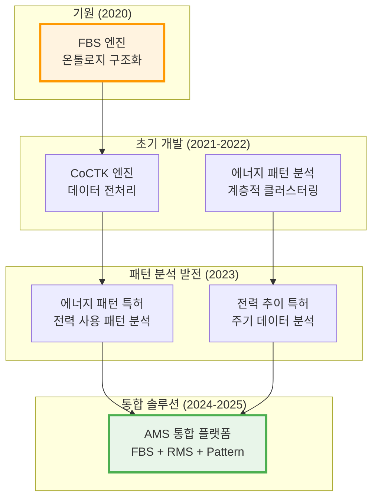

### LLM 에이전트 설계 토대 관계

> [!NOTE] 인터뷰 기반 기술 진화 스토리
> 각 프로젝트에서 쌓은 경험이 LLM 에이전트 설계의 토대가 되었습니다.

#### 프로젝트 경험 → 개발 → 스토리 → AI Agent 상호 연결 네트워크

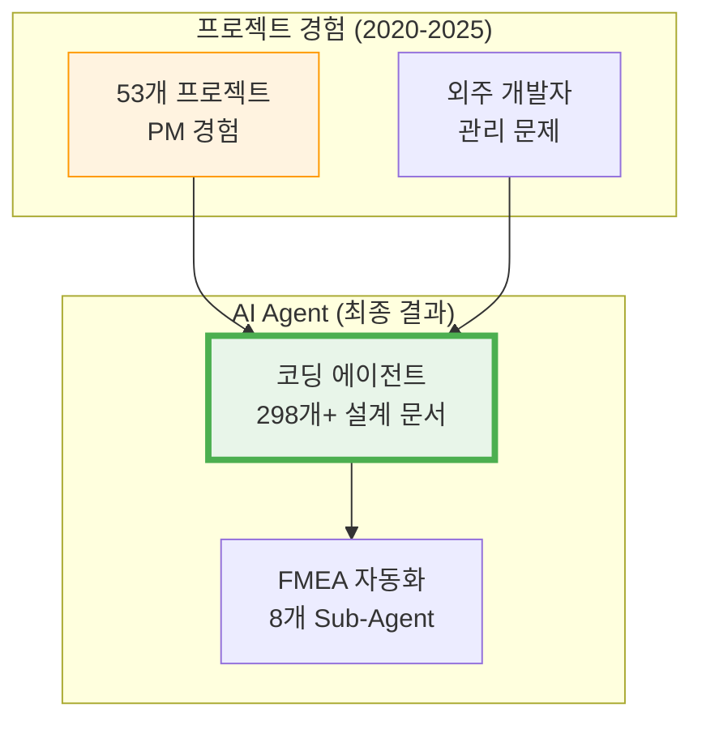

**주요 상호 영향 관계**:

1. **코딩 에이전트**: 다른 모든 AI Agent의 설계 기초가 됨
2. **복합 프로젝트 영향**: 53개 프로젝트 경험이 코딩 에이전트 설계에 복합적으로 영향
3. **AI Agent 간 상호 영향**: 코딩 에이전트가 FMEA 자동화, PM Agent 등 다른 AI Agent 설계에 영향

---

## 🛤️ 쌓아온 길 (Career Evolution Journey)

### 기술 진화의 전체 흐름

**2020년: 온톨로지 구조화의 기원**
- **FBS (Fishbone Structure) 엔진**: 피쉬본 구조를 온톨로지로 구조화하여 인과관계를 체계적으로 관리
- **에스에이치 품질 예측**: 제조 현장 데이터를 구조화하여 품질 예측 모델 개발

**2021-2022년: 데이터 전처리 및 상관관계 분석 발전**
- **CoCTK 엔진**: 데이터 전처리, 상관관계 분석, 비용 최적화 엔진 개발 → AMS AI 모듈의 기초가 됨
- **에너지 패턴 분석**: 계층적 클러스터링과 패턴 민주주의 기법 고안 → AMS 알고리즘 모체 제공

**2023년: 패턴 정보화 특허화**
- **에너지 패턴 분석 특허**: 생산공정 에너지 및 설비상태 데이터 처리 특허 출원
- **전력 추이 이상 검증 특허**: 주기 데이터 분석 기반 전력 추이 상황적 불량 이상 검증 방법 특허 출원

**2024-2025년: 온톨로지 통합 솔루션 완성**
- **DPS 5층 아키텍처**: 온톨로지 기반 지식그래프 플랫폼 구축, 세아특수강 포미아 정식 납품
- **AMS 베이지안 네트워크**: 온톨로지 구조화/정보화 통합, 이상탐지율 93.7% 달성, GS 인증 1등급
- **OntoFlow**: 문서-태그-링크 관계 스키마 설계, 298개+ 설계 문서에서 온톨로지 자동 추출

### 프로젝트 경험 → AI Agent 진화

**2025년: AI Agent 개발의 시작**
- **코딩 에이전트 (Original Development Plan)**: 
  - 문제: 53개 프로젝트를 PM으로 진행하면서 외주 개발자 산출물 관리가 가장 큰 문제
  - 해결: ID 기반 온톨로지 맵 설계, Phase 0-13 워크플로우 자동화, 298개+ 설계 문서 체계화
  - **→ 다른 모든 AI Agent의 설계 기초가 됨**

**2025년: AI Agent 확장**
- **FMEA 자동화**: 코딩 에이전트의 역설계 시스템 구조를 Multi-Agent Workflow에 적용
- **PM Agent**: 코딩 에이전트의 외주 관리 경험을 사업 관리 자동화에 적용
- **Business Document Generator**: 코딩 에이전트의 문서 작성 경험을 자동화에 적용
- **Factory Ontology Manager**: 코딩 에이전트의 온톨로지 경험을 공장 agent에 적용
- **Evaluation Framework**: 코딩 에이전트의 모듈화·체계화 경험을 전수 검사 시스템에 적용
- **프롬프트 평가 엔진**: 코딩 에이전트의 품질 관리 경험을 AI Gatekeeper에 적용

### 기술 진화의 핵심 인사이트

- **"모델보다 데이터, 데이터보다 정보, 지식구조를 정리하는 현장친화적 연구원"**: 모든 기술이 온톨로지 구조로 체계화되어 지식 재사용과 확장이 가능
- **현장 친화적 연구**: 모든 연구는 실제 제조 현장의 데이터를 기반으로 수행되어 즉각적인 산업 적용 가능
- **지속적인 혁신**: 5년 5개월 동안 매년 새로운 기술과 방법론을 개발하며 지속적으로 진화
- **학술적 검증**: 논문 10편, 특허 4건 (2건 등록결정 완료)을 통해 기술의 신뢰성과 독창성 입증
- **실무 적용**: AMS, DPS, OntoFlow 등 실제 현장에서 검증된 기술

---

## 📊 포트폴리오 구조 (한눈에 보기)

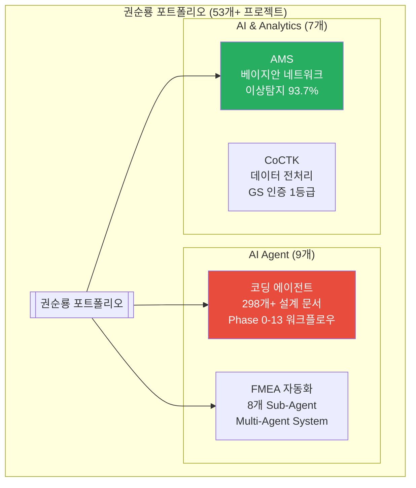

### 전체 온톨로지 구조

> [!NOTE] **온톨로지 기반 정보 구조화**
> 모든 프로젝트와 성과는 온톨로지 구조로 체계화되어 있으며, Governance & Quality Assurance Layer가 전체 시스템을 관리합니다.

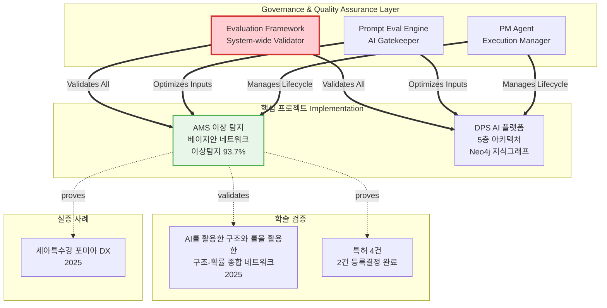

**온톨로지 구조의 핵심**:
- **Governance & Quality Assurance Layer**: Evaluation Framework, Prompt Eval Engine, PM Agent가 전체 시스템의 품질과 안정성을 보장
- **핵심 프로젝트**: 실제 구현된 솔루션들이 온톨로지 구조로 연결됨
- **학술 검증**: 논문과 특허를 통해 기술의 신뢰성과 독창성 입증
- **실증 사례**: 실제 현장 적용 사례

---

## 💼 비즈니스 가치 창출

### AI Agent 개발 성과

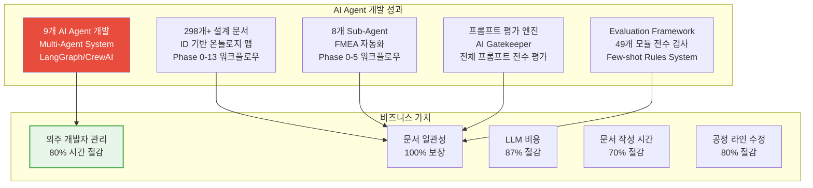

### 개발 효율성 향상

- ✅ **외주 개발자 관리 시간 80% 이상 절감**: 코딩 에이전트를 통한 자동화
- ✅ **문서 일관성 100% 보장**: ID 시스템 기반 문서 관리
- ✅ **개발 프로세스 자동화**: 납품 품질 향상
- ✅ **LLM 비용 87% 절감**: Virtual Company Creation Agent의 GFS + Dual-Tier AI 아키텍처
- ✅ **문서 작성 시간 70% 이상 절감**: Business Document Generator를 통한 자동화
- ✅ **공정 라인 수정 시간 80% 이상 절감**: Factory Ontology Manager의 자연어 기반 파싱
- ✅ **프롬프트 품질 일관성 100% 보장**: 프롬프트 평가 엔진의 전수 평가 시스템
- ✅ **코드 품질 일관성 100% 보장**: Evaluation Framework의 전수 검사 시스템

### 핵심 성과 지표

| 지표 | 수치 | 비고 |
|:---|---:|:---|
| **AI Agent 개발** | 9개 | 코딩 에이전트, FMEA 자동화, 프롬프트 평가, PM Agent 등 |
| **Multi-Agent System** | 8개 Sub-Agent | FMEA 자동화 Multi-Agent 시스템 |
| **설계 문서** | 298개+ | ID 기반 온톨로지 맵 |
| **프롬프트** | 25개+ | 프롬프트 평가 엔진으로 품질 보장 |
| **외주 관리 시간 절감** | 80%+ | 코딩 에이전트 자동화 |
| **문서 일관성** | 100% | ID 시스템 기반 문서 관리 |
| **LLM 비용 절감** | 87% | GFS + Dual-Tier AI |
| **문서 작성 시간 절감** | 70%+ | Business Document Generator |
| **공정 라인 수정 시간 절감** | 80%+ | Factory Ontology Manager |
| **프롬프트 품질 보장** | 100% | 프롬프트 평가 엔진 전수 평가 |
| **코드 품질 보장** | 100% | Evaluation Framework 전수 검사 |
| **GS 인증** | 2개 (1등급) | CoCTK, AMS (PDS 명칭) |
| **논문 발표** | 10편 | 한국유체기계학회, 한국생산제조학회 등 |

---

## 🤖 LLM 활용 방법

### Multi-Agent 시스템

**FMEA 자동화 생성 시스템**: Claude Sub-Agent 기반 8개 독립 Sub-Agent 협업 구조를 구현했습니다. 각 Sub-Agent는 전문 영역(R&D, Mfg, QA)을 담당하며, Master Orchestrator가 전체 워크플로우를 조율합니다.

**Phase 0~5 자동화 워크플로우**: FMEA 생성 프로세스 전 과정을 자동화했습니다. Python 스크립트 없이 Claude Code 세션 자체가 Orchestrator 역할을 담당합니다.

### MCP 서버

**PM Agent - 32개 Python MCP 서버**: Model Context Protocol을 활용하여 AI Agent 간 정보 전달을 최적화했습니다. 32개 독립 MCP 서버를 개발하여 데이터 파이프라인을 오케스트레이션합니다. State 기반 정보 전달로 컨텍스트를 최적화하고, 워크플로우 상태를 모니터링합니다.

### RAG 시스템 (Neo4j 기반)

**DPS & AMS - Neo4j 기반 RAG 시스템**: Neo4j 그래프DB를 활용하여 확률 네트워크를 저장하고 분석합니다. FBS 뼈대 위에 확률적 최적화로 문제 해결 최적 경로를 도출합니다. 4M2E 관계 온톨로지를 정의하여 지식그래프 플랫폼을 구축했습니다.

**OntoFlow - 문서 기반 RAG 시스템**: Obsidian 기반 문서에서 온톨로지를 자동 추출하여 지식그래프로 시각화합니다. 298개+ 설계 문서에서 엔티티와 관계를 자동으로 추출하여 RAG 시스템의 기반을 제공합니다.

### LangGraph/CrewAI 워크플로우 오케스트레이션

**OntoFlow, PM Agent, FMEA 자동화**: LangGraph/CrewAI 방식의 워크플로우 오케스트레이션을 구현했습니다. LangGraph 기반 자연어 인터페이스를 개발하여 테스트 실행 및 결과 조회를 자동화했습니다.

**State 기반 정보 전달**: State Reducer 패턴으로 워크플로우 상태 일관성을 유지하고, Human Loop Interrupts로 중요한 의사결정 지점에서 사용자 개입을 지원합니다.

---

## 🔗 관련 링크

### GitHub

- **메인 레포지토리**: https://github.com/moobaek/Testing_AI_agents_for_public_use
- **포트폴리오 문서**: https://github.com/moobaek/Testing_AI_agents_for_public_use/tree/main/portfolio/portfolio_docs
- **GitHub 프로필**: https://github.com/moobaek

### 관련 문서

- **이력서**: [권순룡_이력서_SK하이닉스_온톨로지전문가_DataEngineer_v2.md](./권순룡_이력서_SK하이닉스_온톨로지전문가_DataEngineer_v2.md)
- **포트폴리오 인덱스**: [00_Portfolio_Index.md](../../00_Portfolio_Index.md)
- **프로젝트 개요**: [02_Projects_Overview.md](../../02_Projects_Overview.md)

---

© 2026 권순룡. All Rights Reserved.

*본 포트폴리오는 온톨로지전문가 Data Engineer 직무에 특화되어 작성되었습니다.*
