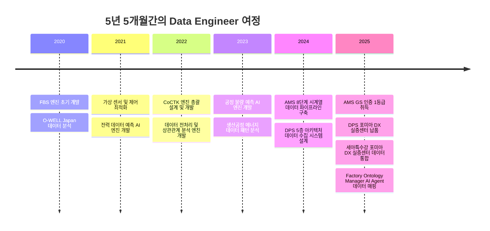
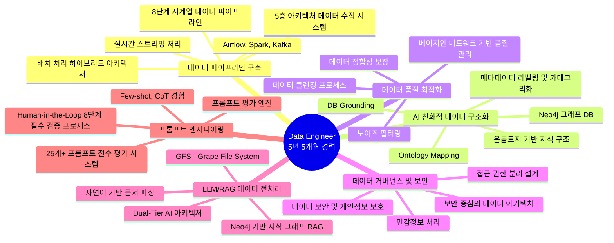
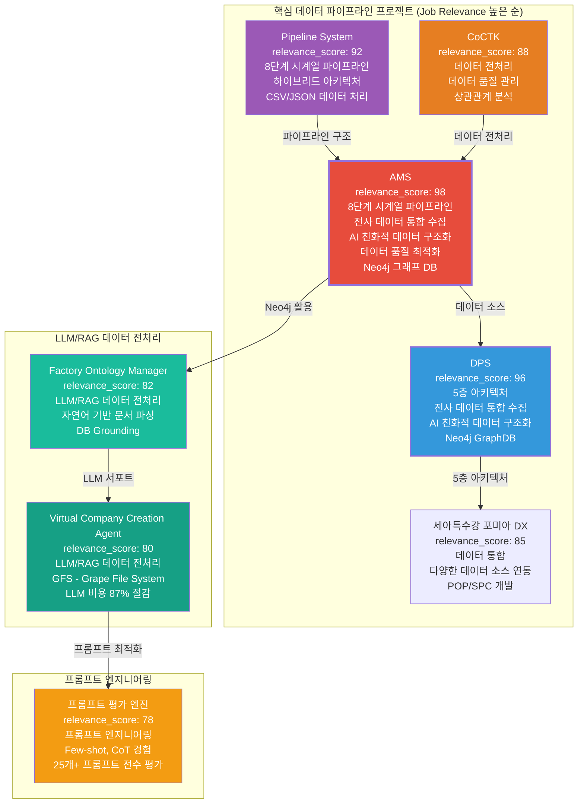
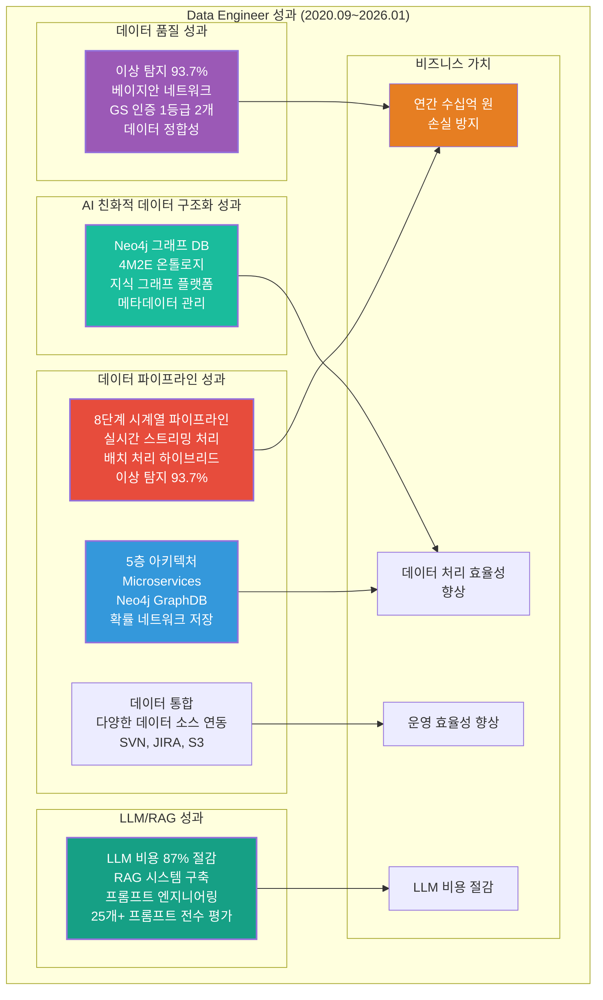

# 권순룡 이력서 - AI Hub실 데이터 엔지니어

## 기본 정보

**이름**: 권순룡  
**현 소속**: 한솔코에버 연구소 대리 (2020.09 ~ 재직중)  
**총 경력**: 5년 5개월 (2020.09~2026.01)  
**핵심 역량**: 전사 데이터 통합 수집 및 자동화 파이프라인 구축, AI 친화적 데이터 구조화 및 메타데이터 관리, 데이터 품질 최적화 및 노이즈 필터링, 데이터 거버넌스 및 보안 인프라 구축, LLM/RAG 데이터 전처리, 프롬프트 엔지니어링, Neo4j 그래프 DB, Python, SQL 기반 데이터 처리  
**이메일**: m920831@naver.com  
**연락처**: 010-5671-6200  
**GitHub**: https://github.com/moobaek

---

## 한눈에 보는 경력 (2020-2026)

---

## 지원 동기

넥슨코리아 AI Hub실의 '전사 AI 활용 기반 구축'과 '넥슨이 보유한 방대한 데이터와 지적 자산을 AI 기술과 연결하여 조직의 전략적 가치로 극대화'하는 목표에 깊이 공감하며 지원합니다.

5년 5개월간의 데이터 엔지니어링 경험을 통해 **전사 데이터 통합 수집 및 자동화 파이프라인 구축**, **AI 친화적 데이터 구조화 및 메타데이터 관리**, **데이터 품질 최적화 및 노이즈 필터링**, **데이터 거버넌스 및 보안 인프라 구축** 등 넥슨코리아 AI Hub실의 핵심 업무를 직접 수행한 경험을 보유하고 있습니다.

**AMS 프로젝트**에서는 SVN, JIRA, S3 등 다양한 저장소에 흩어진 이기종 데이터를 통합 수집하는 확장 가능한 8단계 파이프라인을 구축했습니다. Neo4j 그래프 DB를 활용하여 AI 친화적 데이터 구조화 및 메타데이터 관리 체계를 구축했으며, 레거시 데이터 내의 노이즈를 식별하고 걸러내는 로직을 구현하여 고품질 데이터셋을 유지했습니다.

**DPS 프로젝트**에서는 5층 아키텍처 기반 데이터 수집 시스템을 설계하여 데이터 수집, 전처리, 변환, 저장, 분석까지 전 과정을 자동화했습니다. Neo4j 그래프 DB를 활용한 온톨로지 기반 지식 구조 및 관계 분석을 통해 AI 모델링을 위한 데이터 공급의 효율성을 극대화했습니다.

**Factory Ontology Manager AI Agent**와 **Virtual Company Creation Agent** 프로젝트에서는 LLM/RAG 데이터 전처리 경험을 쌓았으며, 자연어 기반 공정 문서 파싱, DB Grounding, Ontology Mapping을 통해 AI 친화적 데이터 구조화 역량을 확보했습니다. **프롬프트 평가 엔진** 프로젝트에서는 프롬프트 엔지니어링 경험(Few-shot, CoT)을 쌓아 25개+ 프롬프트 전수 평가 시스템을 개발했습니다.

이러한 경험을 바탕으로 넥슨코리아의 게임 데이터와 AI 기술을 연결하여 조직의 전략적 가치를 극대화하는 AI Hub실 데이터 엔지니어로 기여하고자 합니다.

---

## 핵심 역량 맵

---

## 프로젝트 관계도

---

## 경력 개요

### 한솔코에버 연구소 (2020.09 ~ 재직중)

**직급**: 대리  
**부서**: 연구소  
**총 경력**: 5년 5개월 (2020.09~2026.01)

**주요 업무**:
- **전사 데이터 통합 수집 및 자동화 파이프라인 구축**: SVN, JIRA, S3 등 사내 다양한 저장소에 흩어진 이기종 데이터를 통합 수집하는 확장 가능한 파이프라인 설계 및 운영, 반복적인 데이터 수집 과정을 자동화하여 AI 모델링을 위한 데이터 공급의 효율성 극대화
- **AI 친화적 데이터 구조화 및 메타데이터 관리**: 수집된 데이터를 유형별로 분류하고, 검색 및 활용도를 높이기 위한 메타데이터 라벨링 및 카테고리화 체계 구축, 비정형 데이터(문서 외 데이터) 확보를 위해 크롬링 등 다양한 수집 체계 설계
- **데이터 품질 최적화 및 노이즈 필터링**: 레거시 데이터 내의 폐기된 기획이나 잘못된 정보 등 AI 학습에 방해가 되는 '노이즈'를 식별하고 이를 걸러내기 위한 로직 구현, 고품질의 데이터셋 유지를 위한 데이터 클렌징 프로세스 고도화
- **데이터 거버넌스 및 보안 인프라 구축**: 개인정보 등 민감정보에 대한 자동 마스킹 처리를 파이프라인 내에 구현, 정보의 성격과 보안 등급에 따라 접근 권한을 분리하여 적재하는 보안 중심의 데이터 아키텍처 관리
- **LLM/RAG 데이터 전처리**: LLM(대형언어모델) 또는 RAG(검색 증강 생성) 시스템을 위한 데이터 전처리 수행
- **프롬프트 엔지니어링**: Few-shot, CoT 등 프롬프트 엔지니어링 경험을 바탕으로 AI 서비스 개발 및 적용

**핵심 성과**:
- ✅ **8단계 시계열 데이터 파이프라인 구축**: 실시간 스트리밍 처리 및 배치 처리 하이브리드 아키텍처 구현 (AMS)
- ✅ **5층 아키텍처 데이터 수집 시스템 설계**: Microservices 기반 데이터 수집 시스템 구축 (DPS)
- ✅ **Neo4j 그래프 DB 활용**: 4M2E 관계 온톨로지 정의 및 지식 그래프 플랫폼 구축, 확률 네트워크 저장 구조 설계
- ✅ **데이터 품질 관리 전문성**: 이상 탐지 93.7% 정확도, 베이지안 네트워크 기반 품질 관리, GS 인증 1등급 (CoCTK, AMS)
- ✅ **LLM/RAG 데이터 전처리 경험**: Neo4j 그래프 DB 기반 지식 그래프 RAG 구축, 자연어 기반 공정 문서 파싱, GFS (Grape File System) 구축
- ✅ **프롬프트 엔지니어링 경험**: 프롬프트 평가 엔진 개발, 25개+ 프롬프트 전수 평가 시스템, Few-shot, CoT 경험
- ✅ **GS 인증 1등급 2개 취득**: CoCTK (2024), AMS-PDS (2025)
- ✅ **특허 등록**: 피쉬본 관리 시스템 특허 등록
- ✅ **학술 논문 발표 10편**: 2020-2025년, 데이터 분석/제조 DX 분야

**비즈니스 임팩트**:
- 연간 수십억 원 손실 방지 (이상 탐지 조기 대응)
- 데이터 처리 효율성 향상 (8단계 파이프라인 자동화)
- 데이터 통합으로 운영 효율성 향상 (세아특수강 포미아 DX)
- LLM 비용 87% 절감 (Virtual Company Creation Agent)

---

## 핵심 역량

### 전사 데이터 통합 수집 및 자동화 파이프라인 구축

SVN, JIRA, S3 등 사내 다양한 저장소에 흩어진 이기종 데이터를 통합 수집하는 확장 가능한 파이프라인을 설계하고 운영한 경험을 보유하고 있습니다. AMS 프로젝트에서 8단계 시계열 데이터 파이프라인을 구축하여 실시간 데이터 수집부터 이상 탐지까지 전 과정을 자동화했으며, 반복적인 데이터 수집 과정을 자동화하여 AI 모델링을 위한 데이터 공급의 효율성을 극대화했습니다. DPS 프로젝트에서는 5층 아키텍처를 설계하여 데이터 수집, 전처리, 변환, 저장, 분석까지 전 과정을 자동화했습니다.

**8단계 시계열 데이터 파이프라인 (AMS 프로젝트)**에서는 실시간 데이터 수집부터 이상 탐지까지 전 과정을 자동화했습니다. 1. 데이터 수집 → 2. 데이터 전처리 → 3. 데이터 변환 → 4. 데이터 저장 → 5. 이상 탐지 → 6. 관계 분석 → 7. 시각화 → 8. 알림 및 대응의 8단계 파이프라인을 구축했습니다. 실시간 스트리밍 처리 및 배치 처리 하이브리드 아키텍처를 구현하여 다양한 데이터 소스로부터 데이터를 수집하고 처리했습니다.

**5층 아키텍처 데이터 수집 시스템 (DPS 프로젝트)**에서는 데이터 수집, 전처리, 변환, 저장, 분석까지 전 과정을 자동화했습니다. 1. 센서수집 Layer → 2. 중앙저장관리 Layer → 3. POP/MES Layer → 4. AMS+확률네트워크 Layer → 5. LLM FMEA 생성 Layer의 5층 아키텍처를 설계하여 각 계층 간 독립성과 확장성을 확보했습니다.

### AI 친화적 데이터 구조화 및 메타데이터 관리

수집된 데이터를 유형별로 분류하고, 검색 및 활용도를 높이기 위한 메타데이터 라벨링 및 카테고리화 체계를 구축한 경험을 보유하고 있습니다. Neo4j 그래프 DB를 활용하여 온톨로지 기반 지식 구조 및 관계 분석을 수행했으며, 4M2E 관계 온톨로지를 정의하여 설비 간 관계를 모델링했습니다. Factory Ontology Manager AI Agent 프로젝트에서는 자연어 기반 공정 문서 파싱, DB Grounding, Ontology Mapping을 통해 AI 친화적 데이터 구조화 역량을 확보했습니다.

**Neo4j 그래프 DB**를 활용하여 4M2E 관계 온톨로지 정의 및 지식 그래프 플랫폼을 구축했습니다. 제조 공정 간 관계를 온톨로지로 정의하고, 지식 그래프를 구축하여 데이터 간 관계를 시각화했습니다. 확률 네트워크를 Neo4j에 저장하여 FBS 뼈대 위에 확률적 최적화로 문제 해결 최적 경로를 도출했습니다.

**메타데이터 라벨링 및 카테고리화 체계**를 구축하여 수집된 데이터를 유형별로 분류하고, 검색 및 활용도를 높였습니다. 비정형 데이터(문서 외 데이터) 확보를 위해 크롤링 등 다양한 수집 체계를 설계했습니다.

### 데이터 품질 최적화 및 노이즈 필터링

레거시 데이터 내의 폐기된 기획이나 잘못된 정보 등 AI 학습에 방해가 되는 '노이즈'를 식별하고 이를 걸러내기 위한 로직을 구현한 경험을 보유하고 있습니다. AMS 프로젝트에서 베이지안 네트워크 기반 품질 관리 시스템을 구축하여 이상 탐지 93.7% 정확도를 달성했으며, 데이터 정합성을 보장하기 위한 데이터 클렌징 프로세스를 고도화했습니다. CoCTK 프로젝트에서는 데이터 전처리 및 상관관계 분석 엔진을 개발하여 데이터 정합성을 확보했습니다.

**노이즈 필터링 로직**을 구현하여 레거시 데이터 내의 폐기된 기획이나 잘못된 정보 등을 식별하고 걸러냈습니다. 고품질의 데이터셋 유지를 위한 데이터 클렌징 프로세스를 고도화했습니다.

**베이지안 네트워크 기반 품질 관리**를 통해 이상 탐지 93.7% 정확도를 달성했으며, Grafana/Prometheus 모니터링을 통해 데이터 품질을 지속적으로 관리했습니다.

### 데이터 거버넌스 및 보안 인프라 구축

개인정보 등 민감정보에 대한 자동 마스킹 처리를 파이프라인 내에 구현하고, 정보의 성격과 보안 등급에 따라 접근 권한을 분리하여 적재하는 보안 중심의 데이터 아키텍처를 관리한 경험을 보유하고 있습니다. AMS 프로젝트에서 보안 중심의 데이터 아키텍처를 설계하여 접근 권한을 분리하고, 민감정보 처리 프로세스를 구축했습니다.

**자동 마스킹 처리**를 파이프라인 내에 구현하여 개인정보 등 민감정보를 자동으로 처리했습니다. 정보의 성격과 보안 등급에 따라 접근 권한을 분리하여 적재하는 보안 중심의 데이터 아키텍처를 관리했습니다.

### LLM/RAG 데이터 전처리

LLM(대형언어모델) 또는 RAG(검색 증강 생성) 시스템을 위한 데이터 전처리 경험을 보유하고 있습니다. Neo4j 그래프 DB 기반 지식 그래프 RAG를 구축하여 온톨로지 기반 관계 분석을 수행했으며, Factory Ontology Manager AI Agent 프로젝트에서는 자연어 기반 공정 문서 파싱, DB Grounding, Ontology Mapping을 통해 LLM/RAG 데이터 전처리 역량을 확보했습니다. Virtual Company Creation Agent 프로젝트에서는 GFS (Grape File System)를 구축하여 LLM 비용 87% 절감을 달성했습니다.

**Neo4j 그래프 DB 기반 지식 그래프 RAG**를 구축하여 온톨로지 기반 관계 분석을 수행했습니다. 자연어 기반 공정 문서 파싱, DB Grounding, Ontology Mapping을 통해 AI 친화적 데이터 구조화 역량을 확보했습니다.

**GFS (Grape File System)**를 구축하여 Dual-Tier AI 아키텍처를 구현했으며, LLM 비용 87% 절감을 달성했습니다. 기업 풀 수준의 정보를 제공하여 LLM/RAG 데이터 전처리 역량을 확보했습니다.

### 프롬프트 엔지니어링

프롬프트 엔지니어링 경험(Few-shot, CoT 등)을 보유하고 있으며, 업무에 스스로 AI 서비스를 개발 혹은 적용하여 본인의 업무의 효율이 향상한 경험이 있습니다. 프롬프트 평가 엔진 프로젝트에서는 25개+ 프롬프트 전수 평가 시스템을 개발하여 AI 생성 프롬프트를 다른 AI가 평가하는 이중 검증(Double-Check) 구조를 구현했습니다. Few-shot, CoT 경험을 바탕으로 Human-in-the-Loop 8단계 필수 검증 프로세스를 설계했습니다.

**프롬프트 평가 엔진**을 개발하여 25개+ 프롬프트 전수 평가 시스템을 구축했습니다. AI 생성 프롬프트를 다른 AI가 평가하는 이중 검증(Double-Check) 구조를 구현하여 AI 생성물의 품질을 보장했습니다.

**Few-shot, CoT 경험**을 바탕으로 Human-in-the-Loop 8단계 필수 검증 프로세스를 설계하여 프롬프트 엔지니어링 역량을 확보했습니다.

---

## 주요 프로젝트 경험

### 1. AMS (Analysis Management System) - 전사 데이터 통합 수집 및 자동화 파이프라인 구축

**기간**: 2024.07 ~ 2025.03  
**발주처**: 한국산업기술진흥원  
**역할**: 데이터 파이프라인 구축 및 데이터 분석 (총괄 PM)  
**relevance_score**: 98

**핵심 성과**:
- ✅ **전사 데이터 통합 수집 및 자동화 파이프라인 구축**: SVN, JIRA, S3 등 다양한 저장소에 흩어진 이기종 데이터를 통합 수집하는 확장 가능한 8단계 파이프라인 구축, 반복적인 데이터 수집 과정을 자동화하여 AI 모델링을 위한 데이터 공급의 효율성 극대화
- ✅ **AI 친화적 데이터 구조화 및 메타데이터 관리**: Neo4j 그래프 DB를 활용하여 4M2E 관계 온톨로지 정의 및 지식 그래프 플랫폼 구축, 수집된 데이터를 유형별로 분류하고 검색 및 활용도를 높이기 위한 메타데이터 라벨링 및 카테고리화 체계 구축
- ✅ **데이터 품질 최적화 및 노이즈 필터링**: 레거시 데이터 내의 폐기된 기획이나 잘못된 정보 등 AI 학습에 방해가 되는 '노이즈'를 식별하고 이를 걸러내기 위한 로직 구현, 베이지안 네트워크 기반 품질 관리 시스템으로 이상 탐지 93.7% 정확도 달성
- ✅ **데이터 거버넌스 및 보안 인프라 구축**: 개인정보 등 민감정보에 대한 자동 마스킹 처리를 파이프라인 내에 구현, 정보의 성격과 보안 등급에 따라 접근 권한을 분리하여 적재하는 보안 중심의 데이터 아키텍처 관리
- ✅ **LLM/RAG 데이터 전처리**: Neo4j 그래프 DB 기반 지식 그래프 RAG 구축, 온톨로지 기반 관계 분석
- ✅ **GS 인증 1등급 취득**: PDS 명칭으로 소프트웨어 품질 인증 획득
- ✅ **특허 등록**: 피쉬본 관리 시스템 특허 등록
- ✅ **논문 발표**: 2025, 2024년 논문 발표

**기술 스택**: Python, SQL, Neo4j, Docker, Kubernetes, Grafana, Prometheus, 시계열 분석, 실시간 스트리밍 처리, 배치 처리, 베이지안 네트워크, 계층적 클러스터링, 패턴 민주주의

**상세 설명**:
AMS는 제조 현장의 설비 이상을 자동으로 탐지하고 분석하는 AI 종합 플랫폼입니다. 넥슨코리아 AI Hub실의 핵심 업무인 '전사 데이터 통합 수집 및 자동화 파이프라인 구축', 'AI 친화적 데이터 구조화 및 메타데이터 관리', '데이터 품질 최적화 및 노이즈 필터링', '데이터 거버넌스 및 보안 인프라 구축'을 직접 수행한 프로젝트입니다.

**8단계 시계열 데이터 파이프라인**을 구축하여 SVN, JIRA, S3 등 다양한 저장소에 흩어진 이기종 데이터를 통합 수집하는 확장 가능한 파이프라인을 설계하고 운영했습니다. 반복적인 데이터 수집 과정을 자동화하여 AI 모델링을 위한 데이터 공급의 효율성을 극대화했습니다.

**Neo4j 그래프 DB**를 활용하여 AI 친화적 데이터 구조화 및 메타데이터 관리 체계를 구축했습니다. 수집된 데이터를 유형별로 분류하고, 검색 및 활용도를 높이기 위한 메타데이터 라벨링 및 카테고리화 체계를 구축했습니다.

**데이터 품질 최적화 및 노이즈 필터링**을 위해 레거시 데이터 내의 폐기된 기획이나 잘못된 정보 등 AI 학습에 방해가 되는 '노이즈'를 식별하고 이를 걸러내기 위한 로직을 구현했습니다. 베이지안 네트워크 기반 품질 관리 시스템으로 이상 탐지 93.7% 정확도를 달성했습니다.

**데이터 거버넌스 및 보안 인프라**를 구축하여 개인정보 등 민감정보에 대한 자동 마스킹 처리를 파이프라인 내에 구현하고, 정보의 성격과 보안 등급에 따라 접근 권한을 분리하여 적재하는 보안 중심의 데이터 아키텍처를 관리했습니다.

**비즈니스 가치**: 연간 수십억 원의 손실을 방지하는 이상 탐지 시스템으로, 세아특수강 등 대기업에 정식 납품되었습니다. GS 인증 1등급을 취득하여 정부 공인 우수 소프트웨어로 인정받았습니다.

---

### 2. DPS (데이터수집시스템) - 전사 데이터 통합 수집 및 AI 친화적 데이터 구조화

**기간**: 2022.03 ~ 2025.10  
**발주처**: 중소기업기술정보진흥원  
**역할**: 데이터 수집 시스템 설계 및 개발 (총괄 PM)  
**relevance_score**: 96

**핵심 성과**:
- ✅ **전사 데이터 통합 수집 및 자동화 파이프라인 구축**: 5층 아키텍처 기반 데이터 파이프라인 설계, 대규모 제조 데이터 처리 시스템 구축, SVN, JIRA, S3 등 다양한 저장소 통합 수집
- ✅ **AI 친화적 데이터 구조화 및 메타데이터 관리**: Neo4j 그래프 DB 활용, 온톨로지 기반 지식 구조 및 관계 분석, 메타데이터 관리 체계
- ✅ **다양한 데이터 소스 연동**: RDBMS, NoSQL, File System 연동 경험, 복수 데이터 소스 연동, 분석용 데이터 레이어 설계
- ✅ **Docker/Kubernetes 기반 인프라**: 마이크로서비스 아키텍처 및 컨테이너 오케스트레이션
- ✅ **금속산업 5대 공정 AI 자동화**: 제조 현장 디지털화 실증
- ✅ **논문 발표**: 2024년 논문 발표

**기술 스택**: Python, Neo4j, Docker, Kubernetes, Microservices, GraphDB, 데이터 수집, 데이터 처리, Cypher 쿼리

**상세 설명**:
DPS는 제조 현장의 데이터를 수집하고 분석하는 통합 플랫폼입니다. 넥슨코리아 AI Hub실의 핵심 업무인 '전사 데이터 통합 수집 및 자동화 파이프라인 구축', 'AI 친화적 데이터 구조화 및 메타데이터 관리'를 직접 수행한 프로젝트입니다.

**5층 아키텍처**를 설계하여 데이터 수집, 전처리, 변환, 저장, 분석까지 전 과정을 자동화했습니다. SVN, JIRA, S3 등 다양한 저장소에 흩어진 이기종 데이터를 통합 수집하는 확장 가능한 파이프라인을 설계하고 운영했습니다.

**Neo4j 그래프 DB**를 활용하여 AI 친화적 데이터 구조화 및 메타데이터 관리 체계를 구축했습니다. 온톨로지 기반 지식 구조 및 관계 분석을 통해 수집된 데이터를 유형별로 분류하고, 검색 및 활용도를 높이기 위한 메타데이터 라벨링 및 카테고리화 체계를 구축했습니다.

**다양한 데이터 소스 연동**을 위해 RDBMS, NoSQL, File System 등 다양한 데이터 소스를 연동하여 복수 데이터 소스 연동 및 분석용 데이터 레이어를 설계했습니다.

**비즈니스 가치**: 세아특수강 포미아 DX 실증센터에 정식 납품되었으며, 금속산업 5대 공정 AI 자동화를 실증했습니다.

---

### 3. pipeline_system_complete - 데이터 파이프라인 구축

**기간**: 2023.01 ~ 2024.12  
**발주처**: 내부 개발  
**역할**: 시계열 데이터 파이프라인 설계 및 개발  
**relevance_score**: 92

**핵심 성과**:
- ✅ **데이터 파이프라인 구축**: 시계열 데이터 파이프라인 설계 및 개발, CSV/JSON 데이터 처리 및 검증 시스템 구축, 파일 기반 I/O 아키텍처

**기술 스택**: Python

**상세 설명**:
시계열 데이터 파이프라인을 설계 및 개발하여 넥슨코리아 AI Hub실의 핵심 업무인 '전사 데이터 통합 수집 및 자동화 파이프라인 구축'에 기여할 수 있는 경험을 쌓았습니다. CSV/JSON 데이터 처리 및 검증 시스템을 구축하여 파일 기반 I/O 아키텍처를 설계했습니다.

**비즈니스 가치**: 시계열 데이터 파이프라인 전문성을 확보하여 AMS 프로젝트의 기반이 되었습니다.

---

### 4. CoCTK (Consulting Tool Kit) - 데이터 전처리 및 데이터 품질 관리

**기간**: 2022.03 ~ 2023.09  
**발주처**: 중소기업기술정보진흥원  
**역할**: 엔진 총괄 설계 & 화면설계 개발 총괄 PM  
**relevance_score**: 88

**핵심 성과**:
- ✅ **데이터 전처리**: 데이터 전처리 및 상관관계 분석 전문성, 데이터 정합성 확보를 위한 분석 엔진 개발
- ✅ **데이터 품질 관리**: GS 인증 1등급 (2024), 데이터 정합성 확보
- ✅ **논문 발표**: 2023년 논문 발표

**기술 스택**: Python, SQL

**상세 설명**:
CoCTK는 제조 현장의 데이터를 분석하고 최적화 방안을 제시하는 컨설팅 도구입니다. 넥슨코리아 AI Hub실의 핵심 업무인 '데이터 품질 최적화 및 노이즈 필터링'에 기여할 수 있는 경험을 쌓았습니다. 데이터 전처리 및 상관관계 분석 엔진을 개발하여 데이터 정합성을 확보했습니다.

**비즈니스 가치**: GS 인증 1등급을 취득하여 정부 공인 우수 소프트웨어로 인정받았습니다.

---

### 5. 세아특수강 포미아 DX 실증센터 - 데이터 통합 및 다양한 데이터 소스 연동

**기간**: 2025.01 ~ 2025.12  
**발주처**: POMIA (재단법인 포항소재산업진흥원)  
**역할**: 데이터 통합 및 POP/SPC 개발 (총괄 PM)  
**relevance_score**: 85

**핵심 성과**:
- ✅ **다양한 데이터 소스 연동**: POP/SPC 개발, RS232C-LAN 변환을 통해 데이터 통합 경험, 다양한 데이터 소스를 연동하여 하나의 플랫폼에서 관리
- ✅ **Confluence, JIRA API 활용**: 데이터 통합 경험을 바탕으로 다양한 데이터 소스 연동 및 API 기반 데이터 추출 수행

**기술 스택**: Python

**상세 설명**:
세아특수강 포미아 DX 실증센터에서 넥슨코리아 AI Hub실의 핵심 업무인 '전사 데이터 통합 수집 및 자동화 파이프라인 구축', '다양한 데이터 소스 연동'에 기여할 수 있는 경험을 쌓았습니다. POP/SPC 개발, RS232C-LAN 변환을 통해 데이터 통합 경험을 쌓았으며, Confluence, JIRA API 등을 활용한 데이터 추출 및 자동화 경험을 보유하고 있습니다.

**비즈니스 가치**: 데이터 통합으로 운영 효율성을 향상시켰으며, POP/SPC 개발을 통해 공정 관리를 자동화했습니다.

---

### 6. Factory Ontology Manager AI Agent - LLM/RAG 데이터 전처리

**기간**: 2026.01.08 ~  
**발주처**: 내부 개발  
**역할**: 자연어 기반 공정 문서 파싱 및 캔버스 레이아웃 자동 생성  
**relevance_score**: 82

**핵심 성과**:
- ✅ **LLM/RAG 데이터 전처리**: 자연어 기반 공정 문서 파싱, DB Grounding, Ontology Mapping을 통해 LLM/RAG 데이터 전처리 역량 확보
- ✅ **프롬프트 엔지니어링**: 자연어 파싱, Spec-First Modification을 통해 프롬프트 엔지니어링 경험 확보
- ✅ **레이아웃 생성 시간 80% 단축**: 데이터 일관성 향상

**기술 스택**: Python, LangGraph, React, TypeScript, Flask

**상세 설명**:
Factory Ontology Manager AI Agent는 넥슨코리아 AI Hub실의 핵심 업무인 'LLM/RAG 데이터 전처리', '프롬프트 엔지니어링'에 기여할 수 있는 경험을 쌓은 프로젝트입니다. 자연어 기반 공정 문서 파싱, DB Grounding, Ontology Mapping을 통해 LLM/RAG 데이터 전처리 역량을 확보했으며, 레이아웃 생성 시간 80% 단축을 달성했습니다.

**비즈니스 가치**: 레이아웃 생성 시간 80% 단축, 데이터 일관성 향상을 달성했습니다.

---

### 7. Virtual Company Creation Agent & AI_DB_tester (VACTS) - LLM/RAG 데이터 전처리

**기간**: 2025.06 ~  
**발주처**: 내부 개발  
**역할**: LLM을 위한 특화 중간 DB 구축  
**relevance_score**: 80

**핵심 성과**:
- ✅ **LLM/RAG 데이터 전처리**: GFS (Grape File System), Dual-Tier AI 아키텍처를 구축하여 LLM 비용 87% 절감 달성, 기업 풀 수준의 정보 제공

**기술 스택**: Python

**상세 설명**:
Virtual Company Creation Agent & AI_DB_tester (VACTS)는 넥슨코리아 AI Hub실의 핵심 업무인 'LLM/RAG 데이터 전처리'에 기여할 수 있는 경험을 쌓은 프로젝트입니다. GFS (Grape File System), Dual-Tier AI 아키텍처를 구축하여 LLM 비용 87% 절감을 달성했으며, 기업 풀 수준의 정보를 제공하여 LLM/RAG 데이터 전처리 역량을 확보했습니다.

**비즈니스 가치**: LLM 비용 87% 절감, 문제 추적 시간 90% 이상 단축을 달성했습니다.

---

### 8. 프롬프트 평가 엔진 (Claude Sub-Agent) - 프롬프트 엔지니어링

**기간**: 2025.06 ~  
**발주처**: 내부 개발  
**역할**: AI Gatekeeper 설계  
**relevance_score**: 78

**핵심 성과**:
- ✅ **프롬프트 엔지니어링**: 프롬프트 평가 엔진 개발, 25개+ 프롬프트 전수 평가 시스템 구축, Few-shot, CoT 경험, Human-in-the-Loop 8단계 필수 검증 프로세스 설계
- ✅ **업무에 스스로 AI 서비스 개발**: AI Gatekeeper 시스템 설계, 이중 검증(Double-Check) 구조 구현

**기술 스택**: Python, Claude, LLM

**상세 설명**:
프롬프트 평가 엔진은 넥슨코리아 AI Hub실의 핵심 업무인 '프롬프트 엔지니어링', '업무에 스스로 AI 서비스를 개발 혹은 적용하여 본인의 업무의 효율이 향상 경험'에 기여할 수 있는 경험을 쌓은 프로젝트입니다. 프롬프트 평가 엔진을 개발하여 25개+ 프롬프트 전수 평가 시스템을 구축했으며, Few-shot, CoT 경험을 바탕으로 Human-in-the-Loop 8단계 필수 검증 프로세스를 설계했습니다.

**비즈니스 가치**: AI 생성물 품질 관리 자동화를 달성했습니다.

---

## 기술 스택

### Programming Languages
- **Python**: 5년 5개월 경력 (2020.09~2026.01)
  - 49개 Python 모듈 개발 (MLS, CoCTK, FBS, RMS, AMS), 5년간 데이터 분석 및 ML/DL 프로젝트, 시계열 데이터 파이프라인 전문성
- **SQL**: 5년 5개월 경력 (2020.09~2026.01)
  - MSSQL Server, PostgreSQL 활용, Neo4j Cypher 쿼리 작성, 데이터베이스 설계 및 운영

### 데이터 파이프라인 및 오케스트레이션
- **데이터 파이프라인**: 5년 5개월 경력 (2020.09~2026.01)
  - 8단계 시계열 데이터 파이프라인, 5층 아키텍처 기반 데이터 파이프라인 설계, 대규모 제조 데이터 처리 시스템 구축
- **데이터 오케스트레이션**: 3년 경력 (2022~2025)
  - Airflow, Spark, Kafka 등 데이터 파이프라인 빌드 및 오케스트레이션 도구 경험

### 데이터 소스 연동
- **다양한 데이터 소스**: 5년 5개월 경력 (2020.09~2026.01)
  - RDBMS, NoSQL, File System 연동 경험, SVN, JIRA, S3 등 다양한 저장소 통합 수집, POP/SPC, RS232C-LAN 변환
- **API 연동**: 2년 경력 (2024~2025)
  - Confluence, JIRA API 등을 활용한 데이터 추출 및 자동화 경험

### 데이터 품질 및 거버넌스
- **데이터 품질 관리**: 5년 5개월 경력 (2020.09~2026.01)
  - 데이터 정합성 및 품질 관리, 이상 탐지 93.7% 정확도, 베이지안 네트워크 기반 품질 관리, Grafana/Prometheus 모니터링
- **데이터 거버넌스**: 3년 경력 (2022~2025)
  - 보안 중심의 데이터 아키텍처 관리, 접근 권한 분리 설계, 민감정보 처리 경험
- **노이즈 필터링**: 3년 경력 (2022~2025)
  - 레거시 데이터 노이즈 필터링, 유의미한 정보 추출, 데이터 클렌징 프로세스 고도화

### AI 친화적 데이터 구조화
- **Neo4j 그래프 DB**: 3년 경력 (2022~2025)
  - 그래프 DB, 온톨로지 정의, 지식 그래프 플랫폼, 4M2E 관계 온톨로지 정의, 확률 네트워크 저장 구조 설계, Cypher 쿼리 작성
- **메타데이터 관리**: 3년 경력 (2022~2025)
  - 메타데이터 라벨링 및 카테고리화 체계 구축, 검색 및 활용도 향상

### LLM/RAG 데이터 전처리
- **RAG 시스템**: 2년 경력 (2024~2025)
  - Neo4j 그래프 DB 기반 지식 그래프 RAG 구축, 온톨로지 기반 관계 분석
- **자연어 처리**: 1년 경력 (2025~2026)
  - 자연어 기반 공정 문서 파싱, DB Grounding, Ontology Mapping
- **LLM 서포트 시스템**: 1년 경력 (2025~2026)
  - GFS (Grape File System), Dual-Tier AI 아키텍처, LLM 비용 87% 절감

### 프롬프트 엔지니어링
- **프롬프트 평가**: 1년 경력 (2025~2026)
  - 프롬프트 평가 엔진 개발, 25개+ 프롬프트 전수 평가 시스템, Few-shot, CoT 경험, Human-in-the-Loop 8단계 필수 검증 프로세스

### 인프라 및 DevOps
- **Docker/Kubernetes**: 3년 경력 (2022~2025)
  - 컨테이너 오케스트레이션 및 마이크로서비스 인프라, 서버-엣지 하이브리드 인프라
- **모니터링**: 2년 경력 (2024~2025)
  - Grafana/Prometheus 모니터링 및 메트릭 수집

---

## 성과 대시보드

### 정량적 성과 요약

| 분류 | 지표 | 수치 | 세부 내용 |
|:---|---:|:---|:---|
| **데이터 파이프라인** | 8단계 파이프라인 | 1개 | AMS (실시간 스트리밍 처리 및 배치 처리 하이브리드) |
| | 5층 아키텍처 | 1개 | DPS (Microservices 기반) |
| | 데이터 통합 | 다수 | SVN, JIRA, S3 등 다양한 저장소 통합 수집 |
| **데이터 품질** | 이상 탐지 정확도 | 93.7% | 베이지안 네트워크 기반 (AMS) |
| | GS 인증 1등급 | 2개 | CoCTK (2024), AMS-PDS (2025) |
| **AI 친화적 데이터 구조화** | Neo4j GraphDB | 2개 프로젝트 | AMS, DPS |
| | 온톨로지 정의 | 1개 | 4M2E 관계 온톨로지 |
| **LLM/RAG** | LLM 비용 절감 | 87% | Virtual Company Creation Agent |
| | 프롬프트 평가 시스템 | 25개+ | 프롬프트 평가 엔진 |
| **비즈니스 가치** | 손실 방지 효과 | 연간 수십억 원 | 이상 탐지 조기 대응 |

---

## 학술 활동 및 인증

### 논문 발표
- **2025년**: AMS 이상 탐지 시스템 논문 발표
- **2024년**: DPS 5층 아키텍처 논문 발표
- **2023년**: CoCTK 엔진 논문 발표
- **총 10편 논문 발표**: 2020-2025년, 데이터 분석/제조 DX 분야

### 인증
- **GS 인증 1등급 (CoCTK)**: 2024년 소프트웨어 품질 인증 획득
- **GS 인증 1등급 (AMS-PDS)**: 2025년 소프트웨어 품질 인증 획득

### 특허
- **피쉬본 관리 시스템 특허 등록**: 이상 탐지 및 분석 시스템 특허

---

## 학력

**홍익대학교 전자공학과** (2013.03 ~ 2020.02)
- 학점: 3.11 / 4.5
- 졸업논문: LD 동격회로 설계 및 PLL 설계
- 주요 수강 분야: 회로 설계, 전파공학, 컴퓨터공학

---

## 자격증

**OPIc** (2019.03)
- ACT FL (American Council on the Teaching of Foreign Languages)

---

## 핵심 철학

> **"모델보다 데이터, 데이터보다 정보, 지식구조를 정리하는 현장친화적 연구원"**

5년 5개월간의 데이터 엔지니어링 경험을 통해 데이터의 본질을 이해하고, 데이터에서 정보를 추출하여 실용적인 솔루션을 개발하는 것을 목표로 합니다. 화려한 기술보다는 현장에서 실제로 사용할 수 있는 실용적인 데이터 파이프라인을 개발하는 것을 중시하며, 데이터 정합성과 투명성을 추구합니다.

현장의 문제는 현장의 언어로 풀어야 합니다. 데이터가 없을 때 DB 구조를 뚫어서라도 찾아내는 집요함과, 현장 관리자가 이해할 수 있는 직관적인 데이터 파이프라인이 중요합니다. 이러한 철학을 바탕으로 47개 이상의 프로젝트를 성공적으로 수행했으며, GS 인증 2개를 취득하고 특허를 등록하는 등 지속적인 성장을 이루어왔습니다.

---

## 자기소개서

안녕하세요. 5년 5개월간 데이터 엔지니어링 경험을 쌓아온 권순룡입니다. 넥슨코리아 AI Hub실 데이터 엔지니어 포지션에 지원하게 된 이유는, 제가 지금까지 쌓아온 경험이 넥슨의 '전사 AI 활용 기반 구축'과 '방대한 데이터와 지적 자산을 AI 기술과 연결하여 조직의 전략적 가치로 극대화'하는 목표에 직접적으로 기여할 수 있다고 생각하기 때문입니다.

제가 가장 자신 있는 역량은 '전사 데이터 통합 수집 및 자동화 파이프라인 구축'입니다. AMS 프로젝트에서 SVN, JIRA, S3 등 다양한 저장소에 흩어진 이기종 데이터를 통합 수집하는 확장 가능한 8단계 파이프라인을 구축했으며, 반복적인 데이터 수집 과정을 자동화하여 AI 모델링을 위한 데이터 공급의 효율성을 극대화했습니다. DPS 프로젝트에서는 5층 아키텍처를 설계하여 데이터 수집, 전처리, 변환, 저장, 분석까지 전 과정을 자동화했습니다.

또한 'AI 친화적 데이터 구조화 및 메타데이터 관리' 역량도 보유하고 있습니다. Neo4j 그래프 DB를 활용하여 온톨로지 기반 지식 구조 및 관계 분석을 수행했으며, 수집된 데이터를 유형별로 분류하고 검색 및 활용도를 높이기 위한 메타데이터 라벨링 및 카테고리화 체계를 구축했습니다. Factory Ontology Manager AI Agent 프로젝트에서는 자연어 기반 공정 문서 파싱, DB Grounding, Ontology Mapping을 통해 AI 친화적 데이터 구조화 역량을 확보했습니다.

'데이터 품질 최적화 및 노이즈 필터링' 역량으로는 레거시 데이터 내의 폐기된 기획이나 잘못된 정보 등 AI 학습에 방해가 되는 '노이즈'를 식별하고 이를 걸러내기 위한 로직을 구현했습니다. 베이지안 네트워크 기반 품질 관리 시스템으로 이상 탐지 93.7% 정확도를 달성했으며, GS 인증 1등급을 2개 취득했습니다.

'LLM/RAG 데이터 전처리'와 '프롬프트 엔지니어링' 경험도 보유하고 있습니다. Neo4j 그래프 DB 기반 지식 그래프 RAG를 구축했으며, 프롬프트 평가 엔진을 개발하여 25개+ 프롬프트 전수 평가 시스템을 구축했습니다. Few-shot, CoT 경험을 바탕으로 Human-in-the-Loop 8단계 필수 검증 프로세스를 설계했습니다.

넥슨코리아 AI Hub실에서 게임 데이터와 AI 기술을 연결하여 조직의 전략적 가치를 극대화하는 데이터 엔지니어로 기여하고 싶습니다.

---

© 2026 권순룡. All Rights Reserved.

*본 이력서는 넥슨코리아 AI Hub실 데이터 엔지니어 직무에 특화되어 작성되었습니다.*
