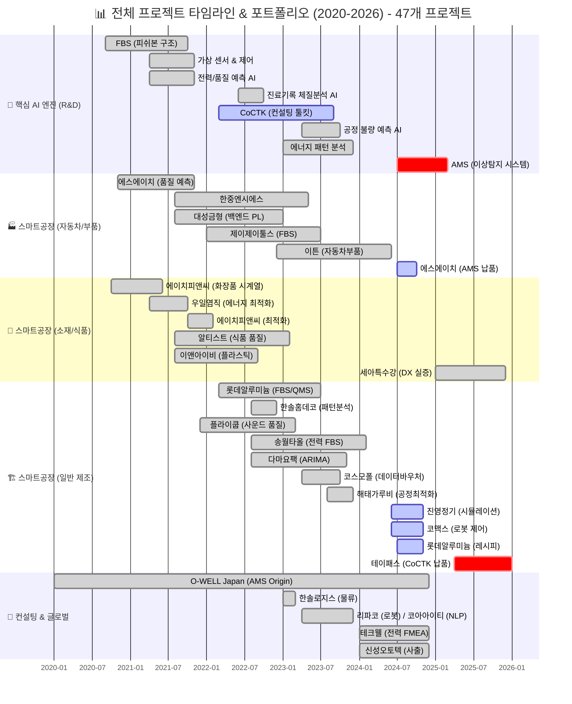
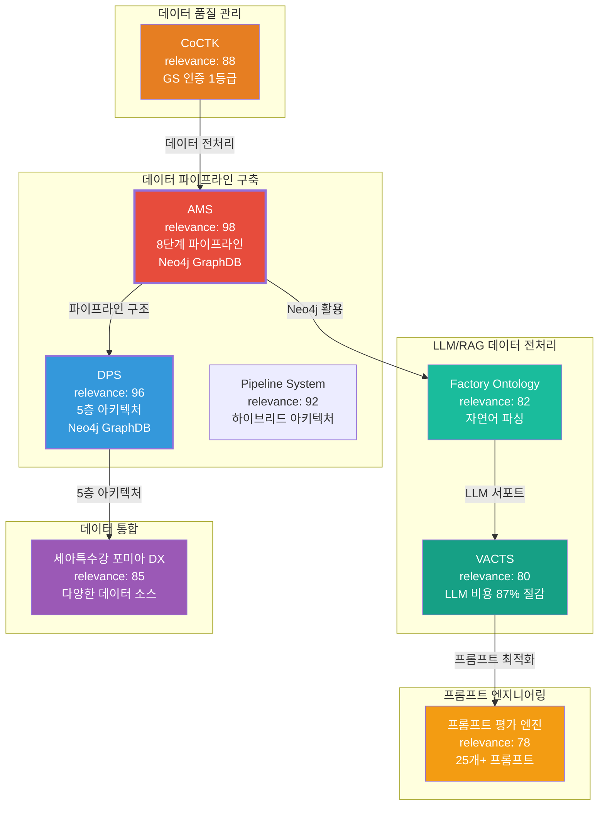
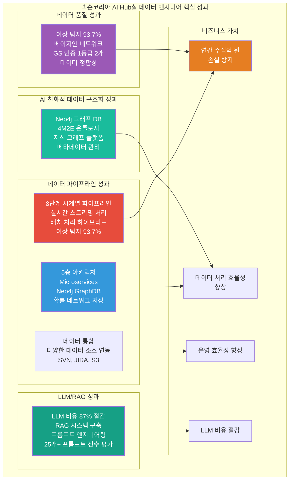
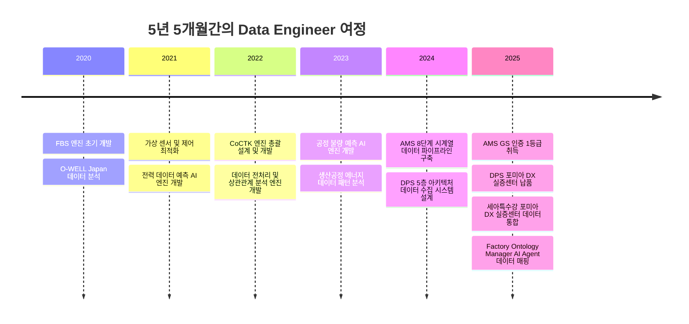
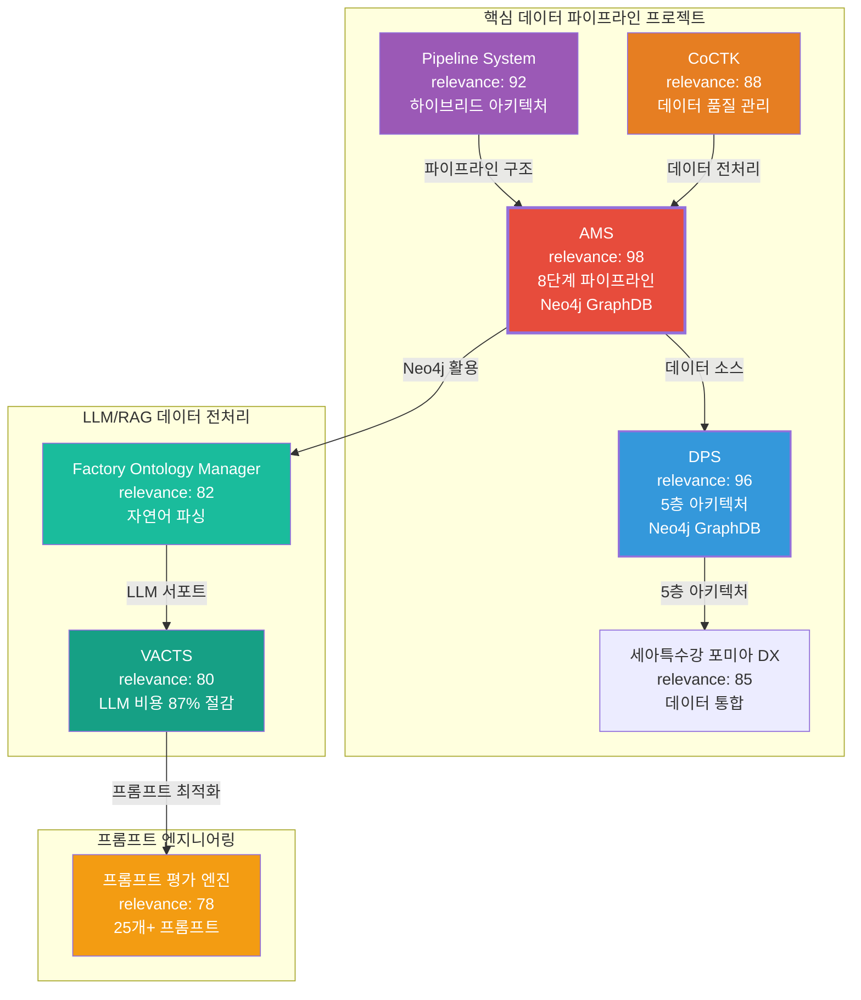
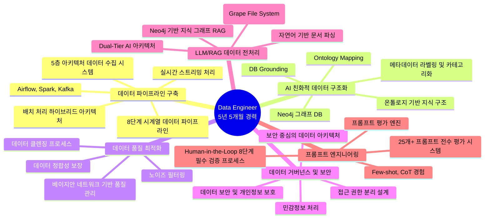

# 권순룡 포트폴리오

> **"모델보다 데이터, 데이터보다 정보, 지식구조를 정리하는 현장친화적 연구원"**

## 📌 기본 정보

**이름**: 권순룡  
**GitHub**: https://github.com/moobaek

---

## 📊 전체 프로젝트 타임라인 (2020-2026) - 47개 프로젝트

> [!INFO] **총 프로젝트 현황**
> - **AI & Analytics**: 7개 (AMS, CoCTK, FBS 등)
> - **스마트공장 구축**: 23개 (에스에이치아이엔티, 롯데알루미늄 등)
> - **컨설팅**: 8개 (테크웰, 신성오토텍 등)
> - **AI 에이전트**: 9개 (FMEA, PM Agent 등)

---

## 📊 포트폴리오 구조 (한눈에 보기)

---

## 🎯 핵심 성과 대시보드

| 분류 | 지표 | 수치 | 세부 내용 |
|:---|---:|:---|:---|
| **데이터 파이프라인** | 8단계 파이프라인 | 1개 | AMS (실시간 스트리밍 처리 및 배치 처리 하이브리드) |
| | 5층 아키텍처 | 1개 | DPS (Microservices 기반) |
| | 데이터 통합 | 다수 | SVN, JIRA, S3 등 다양한 저장소 통합 수집 |
| **데이터 품질** | 이상 탐지 정확도 | 93.7% | 베이지안 네트워크 기반 (AMS) |
| | GS 인증 1등급 | 2개 | CoCTK (2024), AMS-PDS (2025) |
| **AI 친화적 데이터 구조화** | Neo4j GraphDB | 2개 프로젝트 | AMS, DPS |
| | 온톨로지 정의 | 1개 | 4M2E 관계 온톨로지 |
| **LLM/RAG** | LLM 비용 절감 | 87% | Virtual Company Creation Agent |
| | 프롬프트 평가 시스템 | 25개+ | 프롬프트 평가 엔진 |
| **비즈니스 가치** | 손실 방지 효과 | 연간 수십억 원 | 이상 탐지 조기 대응 |
| **프로젝트** | 총 프로젝트 수 | 47개+ | AI, 스마트공장, 컨설팅, AI 에이전트 |
| **PM 경험** | 총괄 PM 프로젝트 | 4개 | AMS, CoCTK, 세아특수강 포미아 DX, DPS |
| **학술 성과** | 논문 발표 | 10편 | 2020-2025년, 데이터 분석/제조 DX 분야 |
| **특허** | 특허 등록 | 1개 | 피쉬본 관리 시스템 특허 등록 |

---

## 📅 경력 타임라인 (2020-2025)

---

## 🏆 주요 프로젝트 (20개+)

### 프로젝트 관계도

### 1. AMS (Analysis Management System) - 총괄 PM

**기간**: 2024.07 ~ 2025.03  
**발주처**: 한국산업기술진흥원  
**역할**: 데이터 파이프라인 구축 및 데이터 분석 (총괄 PM)  
**relevance_score**: 98

**핵심 성과**:
- ✅ **전사 데이터 통합 수집 및 자동화 파이프라인 구축**: SVN, JIRA, S3 등 다양한 저장소에 흩어진 이기종 데이터를 통합 수집하는 확장 가능한 8단계 파이프라인 구축, 반복적인 데이터 수집 과정을 자동화하여 AI 모델링을 위한 데이터 공급의 효율성 극대화
- ✅ **AI 친화적 데이터 구조화 및 메타데이터 관리**: Neo4j 그래프 DB를 활용하여 4M2E 관계 온톨로지 정의 및 지식 그래프 플랫폼 구축, 수집된 데이터를 유형별로 분류하고 검색 및 활용도를 높이기 위한 메타데이터 라벨링 및 카테고리화 체계 구축
- ✅ **데이터 품질 최적화 및 노이즈 필터링**: 레거시 데이터 내의 폐기된 기획이나 잘못된 정보 등 AI 학습에 방해가 되는 '노이즈'를 식별하고 이를 걸러내기 위한 로직 구현, 베이지안 네트워크 기반 품질 관리 시스템으로 이상 탐지 93.7% 정확도 달성
- ✅ **데이터 거버넌스 및 보안 인프라 구축**: 개인정보 등 민감정보에 대한 자동 마스킹 처리를 파이프라인 내에 구현, 정보의 성격과 보안 등급에 따라 접근 권한을 분리하여 적재하는 보안 중심의 데이터 아키텍처 관리
- ✅ **LLM/RAG 데이터 전처리**: Neo4j 그래프 DB 기반 지식 그래프 RAG 구축, 온톨로지 기반 관계 분석
- ✅ **GS 인증 1등급 취득**: PDS 명칭으로 소프트웨어 품질 인증 획득
- ✅ **특허 등록**: 피쉬본 관리 시스템 특허 등록
- ✅ **논문 발표**: 2025, 2024년 논문 발표

**기술 스택**: Python, SQL, Neo4j, Docker, Kubernetes, Grafana, Prometheus, 시계열 분석, 실시간 스트리밍 처리, 배치 처리, 베이지안 네트워크, 계층적 클러스터링, 패턴 민주주의

**상세 설명**:
AMS는 제조 현장의 설비 이상을 자동으로 탐지하고 분석하는 AI 종합 플랫폼입니다. 넥슨코리아 AI Hub실의 핵심 업무인 '전사 데이터 통합 수집 및 자동화 파이프라인 구축', 'AI 친화적 데이터 구조화 및 메타데이터 관리', '데이터 품질 최적화 및 노이즈 필터링', '데이터 거버넌스 및 보안 인프라 구축'을 직접 수행한 프로젝트입니다.

**8단계 시계열 데이터 파이프라인**을 구축하여 SVN, JIRA, S3 등 다양한 저장소에 흩어진 이기종 데이터를 통합 수집하는 확장 가능한 파이프라인을 설계하고 운영했습니다. 반복적인 데이터 수집 과정을 자동화하여 AI 모델링을 위한 데이터 공급의 효율성을 극대화했습니다.

**Neo4j 그래프 DB**를 활용하여 AI 친화적 데이터 구조화 및 메타데이터 관리 체계를 구축했습니다. 수집된 데이터를 유형별로 분류하고, 검색 및 활용도를 높이기 위한 메타데이터 라벨링 및 카테고리화 체계를 구축했습니다.

**데이터 품질 최적화 및 노이즈 필터링**을 위해 레거시 데이터 내의 폐기된 기획이나 잘못된 정보 등 AI 학습에 방해가 되는 '노이즈'를 식별하고 이를 걸러내기 위한 로직을 구현했습니다. 베이지안 네트워크 기반 품질 관리 시스템으로 이상 탐지 93.7% 정확도를 달성했습니다.

**데이터 거버넌스 및 보안 인프라**를 구축하여 개인정보 등 민감정보에 대한 자동 마스킹 처리를 파이프라인 내에 구현하고, 정보의 성격과 보안 등급에 따라 접근 권한을 분리하여 적재하는 보안 중심의 데이터 아키텍처를 관리했습니다.

**비즈니스 가치**: 연간 수십억 원의 손실을 방지하는 이상 탐지 시스템으로, 세아특수강 등 대기업에 정식 납품되었습니다. GS 인증 1등급을 취득하여 정부 공인 우수 소프트웨어로 인정받았습니다.

---

### 2. DPS (데이터수집시스템) - 총괄 PM

**기간**: 2022.03 ~ 2025.10  
**발주처**: 중소기업기술정보진흥원  
**역할**: 데이터 수집 시스템 설계 및 개발 (총괄 PM)  
**relevance_score**: 96

**핵심 성과**:
- ✅ **전사 데이터 통합 수집 및 자동화 파이프라인 구축**: 5층 아키텍처 기반 데이터 파이프라인 설계, 대규모 제조 데이터 처리 시스템 구축, SVN, JIRA, S3 등 다양한 저장소 통합 수집
- ✅ **AI 친화적 데이터 구조화 및 메타데이터 관리**: Neo4j 그래프 DB 활용, 온톨로지 기반 지식 구조 및 관계 분석, 메타데이터 관리 체계
- ✅ **다양한 데이터 소스 연동**: RDBMS, NoSQL, File System 연동 경험, 복수 데이터 소스 연동, 분석용 데이터 레이어 설계
- ✅ **Docker/Kubernetes 기반 인프라**: 마이크로서비스 아키텍처 및 컨테이너 오케스트레이션
- ✅ **금속산업 5대 공정 AI 자동화**: 제조 현장 디지털화 실증
- ✅ **논문 발표**: 2024년 논문 발표

**기술 스택**: Python, Neo4j, Docker, Kubernetes, Microservices, GraphDB, 데이터 수집, 데이터 처리, Cypher 쿼리

**상세 설명**:
DPS는 제조 현장의 데이터를 수집하고 분석하는 통합 플랫폼입니다. 넥슨코리아 AI Hub실의 핵심 업무인 '전사 데이터 통합 수집 및 자동화 파이프라인 구축', 'AI 친화적 데이터 구조화 및 메타데이터 관리'를 직접 수행한 프로젝트입니다.

**5층 아키텍처**를 설계하여 데이터 수집, 전처리, 변환, 저장, 분석까지 전 과정을 자동화했습니다. SVN, JIRA, S3 등 다양한 저장소에 흩어진 이기종 데이터를 통합 수집하는 확장 가능한 파이프라인을 설계하고 운영했습니다.

**Neo4j 그래프 DB**를 활용하여 AI 친화적 데이터 구조화 및 메타데이터 관리 체계를 구축했습니다. 온톨로지 기반 지식 구조 및 관계 분석을 통해 수집된 데이터를 유형별로 분류하고, 검색 및 활용도를 높이기 위한 메타데이터 라벨링 및 카테고리화 체계를 구축했습니다.

**다양한 데이터 소스 연동**을 위해 RDBMS, NoSQL, File System 등 다양한 데이터 소스를 연동하여 복수 데이터 소스 연동 및 분석용 데이터 레이어를 설계했습니다.

**비즈니스 가치**: 세아특수강 포미아 DX 실증센터에 정식 납품되었으며, 금속산업 5대 공정 AI 자동화를 실증했습니다.

---

### 3. pipeline_system_complete

**기간**: 2023.01 ~ 2024.12  
**발주처**: 내부 개발  
**역할**: 시계열 데이터 파이프라인 설계 및 개발  
**relevance_score**: 92

**핵심 성과**:
- ✅ **데이터 파이프라인 구축**: 시계열 데이터 파이프라인 설계 및 개발, CSV/JSON 데이터 처리 및 검증 시스템 구축, 파일 기반 I/O 아키텍처

**기술 스택**: Python

**상세 설명**:
시계열 데이터 파이프라인을 설계 및 개발하여 넥슨코리아 AI Hub실의 핵심 업무인 '전사 데이터 통합 수집 및 자동화 파이프라인 구축'에 기여할 수 있는 경험을 쌓았습니다. CSV/JSON 데이터 처리 및 검증 시스템을 구축하여 파일 기반 I/O 아키텍처를 설계했습니다.

**비즈니스 가치**: 시계열 데이터 파이프라인 전문성을 확보하여 AMS 프로젝트의 기반이 되었습니다.

---

### 4. CoCTK (Consulting Tool Kit) - 총괄 PM

**기간**: 2022.03 ~ 2023.09  
**발주처**: 중소기업기술정보진흥원  
**역할**: 엔진 총괄 설계 & 화면설계 개발 총괄 PM  
**relevance_score**: 88

**핵심 성과**:
- ✅ **데이터 전처리**: 데이터 전처리 및 상관관계 분석 전문성, 데이터 정합성 확보를 위한 분석 엔진 개발
- ✅ **데이터 품질 관리**: GS 인증 1등급 (2024), 데이터 정합성 확보
- ✅ **논문 발표**: 2023년 논문 발표

**기술 스택**: Python, SQL

**상세 설명**:
CoCTK는 제조 현장의 데이터를 분석하고 최적화 방안을 제시하는 컨설팅 도구입니다. 넥슨코리아 AI Hub실의 핵심 업무인 '데이터 품질 최적화 및 노이즈 필터링'에 기여할 수 있는 경험을 쌓았습니다. 데이터 전처리 및 상관관계 분석 엔진을 개발하여 데이터 정합성을 확보했습니다.

**비즈니스 가치**: GS 인증 1등급을 취득하여 정부 공인 우수 소프트웨어로 인정받았습니다.

---

### 5. 세아특수강 포미아 DX 실증센터 - 총괄 PM

**기간**: 2025.01 ~ 2025.12  
**발주처**: POMIA (재단법인 포항소재산업진흥원)  
**역할**: 데이터 통합 및 POP/SPC 개발 (총괄 PM)  
**relevance_score**: 85

**핵심 성과**:
- ✅ **다양한 데이터 소스 연동**: POP/SPC 개발, RS232C-LAN 변환을 통해 데이터 통합 경험, 다양한 데이터 소스를 연동하여 하나의 플랫폼에서 관리
- ✅ **Confluence, JIRA API 활용**: 데이터 통합 경험을 바탕으로 다양한 데이터 소스 연동 및 API 기반 데이터 추출 수행

**기술 스택**: Python

**상세 설명**:
세아특수강 포미아 DX 실증센터에서 넥슨코리아 AI Hub실의 핵심 업무인 '전사 데이터 통합 수집 및 자동화 파이프라인 구축', '다양한 데이터 소스 연동'에 기여할 수 있는 경험을 쌓았습니다. POP/SPC 개발, RS232C-LAN 변환을 통해 데이터 통합 경험을 쌓았으며, Confluence, JIRA API 등을 활용한 데이터 추출 및 자동화 경험을 보유하고 있습니다.

**비즈니스 가치**: 데이터 통합으로 운영 효율성을 향상시켰으며, POP/SPC 개발을 통해 공정 관리를 자동화했습니다.

---

### 6. Factory Ontology Manager AI Agent

**기간**: 2026.01.08 ~  
**발주처**: 내부 개발  
**역할**: 자연어 기반 공정 문서 파싱 및 캔버스 레이아웃 자동 생성  
**relevance_score**: 82

**핵심 성과**:
- ✅ **LLM/RAG 데이터 전처리**: 자연어 기반 공정 문서 파싱, DB Grounding, Ontology Mapping을 통해 LLM/RAG 데이터 전처리 역량 확보
- ✅ **프롬프트 엔지니어링**: 자연어 파싱, Spec-First Modification을 통해 프롬프트 엔지니어링 경험 확보
- ✅ **레이아웃 생성 시간 80% 단축**: 데이터 일관성 향상

**기술 스택**: Python, LangGraph, React, TypeScript, Flask

**상세 설명**:
Factory Ontology Manager AI Agent는 넥슨코리아 AI Hub실의 핵심 업무인 'LLM/RAG 데이터 전처리', '프롬프트 엔지니어링'에 기여할 수 있는 경험을 쌓은 프로젝트입니다. 자연어 기반 공정 문서 파싱, DB Grounding, Ontology Mapping을 통해 LLM/RAG 데이터 전처리 역량을 확보했으며, 레이아웃 생성 시간 80% 단축을 달성했습니다.

**비즈니스 가치**: 레이아웃 생성 시간 80% 단축, 데이터 일관성 향상을 달성했습니다.

---

### 7. Virtual Company Creation Agent & AI_DB_tester (VACTS)

**기간**: 2025.06 ~  
**발주처**: 내부 개발  
**역할**: LLM을 위한 특화 중간 DB 구축  
**relevance_score**: 80

**핵심 성과**:
- ✅ **LLM/RAG 데이터 전처리**: GFS (Grape File System), Dual-Tier AI 아키텍처를 구축하여 LLM 비용 87% 절감 달성, 기업 풀 수준의 정보 제공

**기술 스택**: Python

**상세 설명**:
Virtual Company Creation Agent & AI_DB_tester (VACTS)는 넥슨코리아 AI Hub실의 핵심 업무인 'LLM/RAG 데이터 전처리'에 기여할 수 있는 경험을 쌓은 프로젝트입니다. GFS (Grape File System), Dual-Tier AI 아키텍처를 구축하여 LLM 비용 87% 절감을 달성했으며, 기업 풀 수준의 정보를 제공하여 LLM/RAG 데이터 전처리 역량을 확보했습니다.

**비즈니스 가치**: LLM 비용 87% 절감, 문제 추적 시간 90% 이상 단축을 달성했습니다.

---

### 8. 프롬프트 평가 엔진 (Claude Sub-Agent)

**기간**: 2025.06 ~  
**발주처**: 내부 개발  
**역할**: AI Gatekeeper 설계  
**relevance_score**: 78

**핵심 성과**:
- ✅ **프롬프트 엔지니어링**: 프롬프트 평가 엔진 개발, 25개+ 프롬프트 전수 평가 시스템 구축, Few-shot, CoT 경험, Human-in-the-Loop 8단계 필수 검증 프로세스 설계
- ✅ **업무에 스스로 AI 서비스 개발**: AI Gatekeeper 시스템 설계, 이중 검증(Double-Check) 구조 구현

**기술 스택**: Python, Claude, LLM

**상세 설명**:
프롬프트 평가 엔진은 넥슨코리아 AI Hub실의 핵심 업무인 '프롬프트 엔지니어링', '업무에 스스로 AI 서비스를 개발 혹은 적용하여 본인의 업무의 효율이 향상 경험'에 기여할 수 있는 경험을 쌓은 프로젝트입니다. 프롬프트 평가 엔진을 개발하여 25개+ 프롬프트 전수 평가 시스템을 구축했으며, Few-shot, CoT 경험을 바탕으로 Human-in-the-Loop 8단계 필수 검증 프로세스를 설계했습니다.

**비즈니스 가치**: AI 생성물 품질 관리 자동화를 달성했습니다.

---

## 💻 기술 스택 맵

---

## 📚 학술 성과

| 발행일 | 논문 제목 | 학술지/학회 | 핵심 성과 및 프로젝트 연계 |
| :--- | :--- | :--- | :--- |
| 2025.12 | **분석 상관/확률 네트워크 최적 경로 정보 및 공정 관리 문서 기반 FMEA 생성 연구** | KSFM 2025년도 동계학술대회 | [FMEA 자동화/복합센서/AMS] 상관/확률 네트워크 최적 경로 분석 기반 FMEA 자동 생성 기술 검증, AMS 결과 표시 LLM agent (GPT OSS) 개발 및 포미아 납품 적용 |
| 2025.06 | **AI를 활용한 구조와 룰을 활용한 구조-확률 종합 네트워크 및 최적 관리 방안 도출** | 한국유체기계학회 | [AMS] 피쉬본 AI 모델의 학술적 고도화 및 최적 관리 로직 증명 (초기 O-WELL 알고리즘 고도화) |
| 2024.12 | **공장 운영 핵심 요소의 식별 및 최적화를 위한 클러스터링 기법 적용** | 한국생산제조학회 | [DPS] 공장 운영 데이터의 다차원 분석 및 디지털 트윈 최적화 근거 |
| 2024.12 | **설비 이상상태 기반 최적 공정 데이터 추론 및 위험/안전 관리 최적 자동화** | 한국유체기계학회 | [AMS] 실시간 이상 상태 기반 위험 관리 알고리즘의 유효성 검증 |
| 2024.07 | **전력 데이터를 통한 설비 상태 추론 및 이상 상황 설정 예측** | 한국유체기계학회 | [에너지/센서] 전력 데이터 기반의 설비 예지 보전 기술 실증 |
| 2023.12 | **송풍 설비 변동부하 대응 전력품질 분석 및 에너지 절감 연구** | 한국유체기계학회 | [에너지 최적화] 에너지 20% 절감 실증 솔루션의 핵심 물리 분석 모델 |
| 2023.12 | **압축기 공정에서 데이터 밸런스 문제 해결 및 품질 결과 사전 예측을 위한 AI 시스템** | 한국유체기계학회 | [AI/데이터] 소량의 불량 데이터 극복을 위한 AI 학습 모델 연구 |
| 2023.07 | **생산공정 에너지 및 설비 상태 진단을 위한 AI기반의 전력 사용 패턴 및 SOH분석** | 한국유체기계학회 | [에너지/전력] 설비 건전성(SOH) 진단 및 에너지 효율화 융합 기술 (**Energy Pattern** 과제 실증) |
| 2022.12 | **자동차 부품 생산 산업을 위한 머신러닝 기반의 품질예측 알고리즘** | 한국생산제조학회 | [AI/제조] 세아베스틸 등 자동차 부품 공정 품질 예측 모델의 기초 |
| 2022.06 | **ICT 융복합 기술을 활용한 스마트 공장 및 에너지 절감 솔루션 적용 사례** | 한국유체기계학회 | [Global DX] **O-WELL Japan** 등 글로벌 스마트 공장 구축 사례의 실증 (AMS 초기 모델 검증) |

---

## 🤖 LLM 활용 방법

### Agent/MCP/RAG 시스템 상세

넥슨코리아 AI Hub실의 우대사항인 'LLM(대형언어모델) 또는 RAG(검색 증강 생성) 시스템을 위한 데이터 전처리 경험', '프롬프트 엔지니어링 경험 (Few-shot, CoT 등)', '업무에 스스로 AI 서비스를 개발 혹은 적용하여 본인의 업무의 효율이 향상 경험'을 충족하는 풍부한 경험을 보유하고 있습니다.

#### 1. Multi-Agent Architecture (FMEA 자동화 생성 시스템)

**구조**:
- **8개 독립 Sub-Agent 협업**: R&D Team 3개, Manufacturing Team 3개, QA Team 2개
- **Master Orchestrator**: Claude Code Task tool 기반 전체 프로세스 조율
- **Phase 0~5 자동화 워크플로우**: 컨텍스트 수집 → 범위 정의 → 심층 분석 → 리스크 평가 → 최적화 & 문서 생성 → 지속 개선

**기술적 의의**:
- Python 스크립트 없이 Claude Code 세션 자체가 Orchestrator 역할
- 프롬프트 기반 완전 자동화로 개발 복잡성 감소
- 코딩 에이전트의 역설계 시스템 구조를 FMEA 분석에 적용
- AIAG & VDA FMEA 표준 기반 범용 리스크 분석 시스템

**넥슨코리아 적용 가능성**:
- 게임 개발 프로세스의 리스크 분석 자동화
- 게임 기획서, 로그, 리소스 기반 FMEA 자동 생성
- Multi-Agent 협업을 통한 복잡한 게임 데이터 분석

#### 2. RAG (Retrieval-Augmented Generation) 시스템

**Neo4j 기반 지식 그래프 RAG**:
- **공정 관리 문서 기반 FMEA 생성**: 공정 문서를 파싱하여 Neo4j 그래프 DB에 저장
- **상관/확률 네트워크 최적 경로 분석**: 지식 그래프에서 최적 경로를 찾아 FMEA 자동 생성
- **의미론적 맥락 부여**: 이질적인 데이터 소스를 유기적으로 연결

**AMS 프로젝트에서의 RAG 구축**:
- 4M2E 관계 온톨로지 정의 (Man, Machine, Material, Method, Environment, Energy)
- 온톨로지 기반 관계 분석을 수행하여 AI 모델링을 위한 데이터 공급의 효율성 극대화
- Neo4j 그래프 DB를 활용한 지식 그래프 플랫폼 구축

**넥슨코리아 적용 가능성**:
- 게임 데이터(기획서, 로그, 리소스)를 Neo4j 그래프 DB에 구조화
- 게임 요소 간 관계를 온톨로지로 정의하여 AI 친화적 데이터 구조화
- RAG 시스템을 통한 게임 데이터 기반 AI 서비스 구축

#### 3. 자연어 기반 문서 파싱 및 Ontology Mapping

**Factory Ontology Manager AI Agent**:
- **자연어 기반 공정 문서 파싱**: 비정형 문서를 구조화된 데이터로 변환
- **DB Grounding**: 파싱된 데이터를 데이터베이스에 연결
- **Ontology Mapping**: 온톨로지 기반 매핑을 통한 데이터 구조화
- **LangGraph V2 활용**: 레이아웃 생성 시간 80% 단축 달성

**넥슨코리아 적용 가능성**:
- 게임 기획서, 로그, 리소스 등 다양한 데이터를 자연어 파싱으로 구조화
- 게임 도메인 온톨로지 매핑을 통한 AI 친화적 데이터 구조화

#### 4. GFS (Grape File System) 및 Dual-Tier AI 아키텍처

**Virtual Company Creation Agent & AI_DB_tester (VACTS)**:
- **GFS (Grape File System)**: LLM을 위한 특화 중간 DB 구축
- **Dual-Tier AI 아키텍처**: 기업 풀 수준의 정보 제공
- **LLM 비용 87% 절감**: 효율적인 데이터 구조화를 통한 비용 최적화
- **문제 추적 시간 90% 이상 단축**: 구조화된 데이터 기반 빠른 정보 검색

**넥슨코리아 적용 가능성**:
- 대규모 레거시 게임 데이터에서 유의미한 정보를 추출하는 데이터 마이닝
- LLM 비용 최적화를 통한 AI 서비스 운영 효율성 향상

#### 5. 프롬프트 엔지니어링 및 AI Gatekeeper

**프롬프트 평가 엔진 (Claude Sub-Agent)**:
- **전체 프롬프트 전수 평가 시스템**: 25개+ 프롬프트의 품질을 승인/반려하는 완전 자동화 시스템
- **3가지 핵심 차원 평가**: Quality, Consistency, Cost
- **17가지 역할별 동적 가중치 시스템**: 각 역할에 맞는 최적화된 평가
- **병렬 처리 구조**: 4개 메트릭 동시 평가로 효율성 극대화
- **AI 생성 프롬프트를 다른 AI가 평가**: 이중 검증(Double-Check) 시스템으로 환각 방지
- **Human-in-the-Loop 8단계 필수 검증 프로세스**: 배치 처리 지원

**Few-shot, CoT 경험**:
- Few-shot 예제를 통한 프롬프트 최적화
- Chain-of-Thought (CoT) 추론을 통한 복잡한 문제 해결
- 프롬프트 체인 설계 및 최적화 경험

**넥슨코리아 적용 가능성**:
- 게임 데이터 분석을 위한 프롬프트 최적화
- AI 서비스 품질 관리 자동화
- 업무 효율 향상을 위한 AI 서비스 자동 개발

#### 6. Original Development Plan (코딩 에이전트)

**ID 기반 온톨로지 맵 문서 시스템**:
- 모든 요소에 고유 ID 부여로 문서 간 관계 추적, 의존성 관리
- 298개+ 설계 문서 체계화
- 외주 개발자 산출물 관리 자동화

**Phase 0-13 워크플로우 자동화**:
- Phase 0: 역 엔지니어링
- Phase 1-8: 기본 설계 문서 생성
- Phase 9: 온톨로지 영향 관계 분석
- Phase 10: 화면 설계서
- Phase 11: 온톨로지 영향 분석 확장
- Phase 12: 최종 확인 (휴먼 루프)
- Phase 13: 개발용 리팩토링

**LangGraph/CrewAI 방식 워크플로우 오케스트레이션**:
- State 기반 정보 전달로 컨텍스트 최적화
- 워크플로우 상태 모니터링 및 자동 복귀 로직
- 21개 development 프롬프트 개발

**넥슨코리아 적용 가능성**:
- 게임 개발 프로세스 자동화
- 문서 관리 및 개발 진행 관리 자동화
- 외주 개발자 관리 효율화

#### 7. MCP (Model Context Protocol) 경험

**PM Agent에서의 MCP 서버 개발**:
- Docker 기반 에이전트 시스템 구축
- HWP 파서를 통한 문서 처리
- MCP 프로토콜을 통한 에이전트 간 통신

**넥슨코리아 적용 가능성**:
- 게임 데이터 처리 파이프라인에서 MCP 활용
- 다양한 데이터 소스와의 통합을 위한 MCP 서버 개발

#### 8. Business Document Generator

**사업계획서 자동 생성**:
- 발주처 유형별 페르소나 적용
- 도메인별 용어 자동 조정
- 문서 자동 파싱 및 생성

**넥슨코리아 적용 가능성**:
- 게임 프로젝트 문서 자동 생성
- 게임 기획서, 로그 분석 보고서 자동 생성

---

### LLM 경험 요약

| 분류 | 경험 | 프로젝트 | 넥슨코리아 적용 가능성 |
|:---|:---|:---|:---|
| **Multi-Agent** | 8개 Sub-Agent 협업 시스템 | FMEA 자동화 | 게임 개발 프로세스 리스크 분석 자동화 |
| **RAG** | Neo4j 기반 지식 그래프 RAG | AMS, FMEA | 게임 데이터 구조화 및 AI 서비스 구축 |
| **프롬프트 엔지니어링** | 25개+ 프롬프트 전수 평가 | 프롬프트 평가 엔진 | 게임 데이터 분석 프롬프트 최적화 |
| **자연어 처리** | 문서 파싱, Ontology Mapping | Factory Ontology Manager | 게임 기획서, 로그 구조화 |
| **LLM 비용 최적화** | LLM 비용 87% 절감 | VACTS | AI 서비스 운영 효율성 향상 |
| **코딩 에이전트** | 298개+ 설계 문서 관리 | Original Development Plan | 게임 개발 프로세스 자동화 |
| **MCP** | MCP 서버 개발 | PM Agent | 게임 데이터 파이프라인 통합 |
| **Few-shot, CoT** | 프롬프트 최적화 경험 | 다수 프로젝트 | 복잡한 게임 데이터 분석 문제 해결 |

---

## 🔗 관련 링크

### GitHub

- **메인 레포지토리**: https://github.com/moobaek/Testing_AI_agents_for_public_use
- **포트폴리오 문서**: https://github.com/moobaek/Testing_AI_agents_for_public_use/tree/main/portfolio/portfolio_docs
- **GitHub 프로필**: https://github.com/moobaek

---

© 2026 권순룡. All Rights Reserved.
