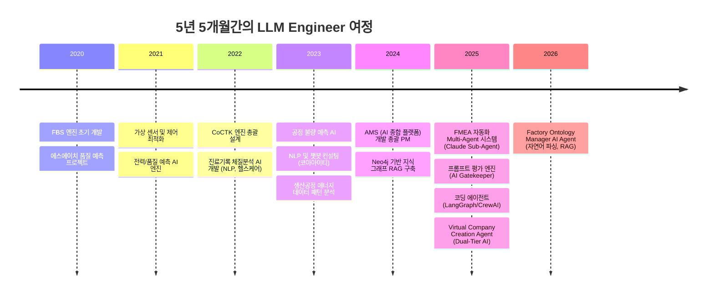
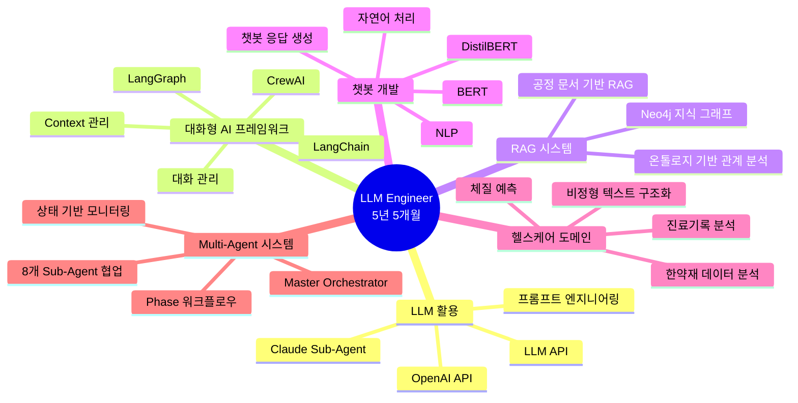
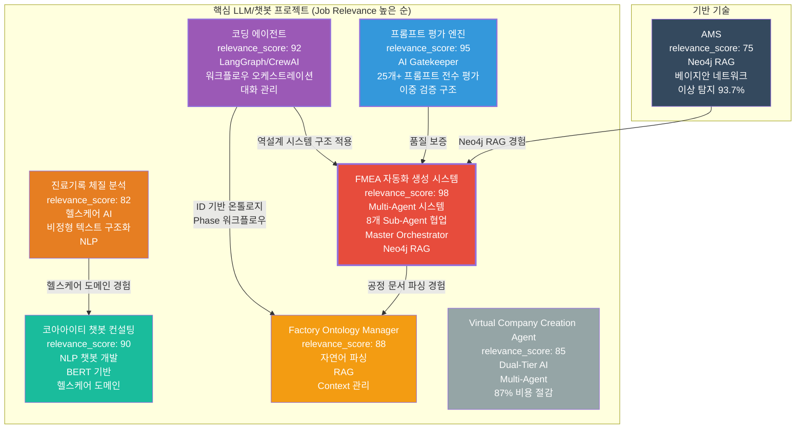
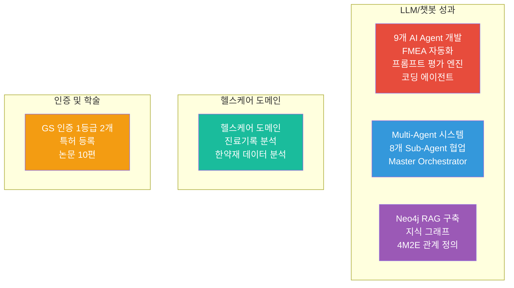

# 권순룡 이력서 - LLM Engineer (대웅제약)

## 기본 정보

**이름**: 권순룡  
**현 소속**: 한솔코에버 연구소 대리 (2020.09 ~ 재직중)  
**총 경력**: 5년 5개월 (2020.09~2026.01)  
**핵심 역량**: LLM 활용 (Claude, OpenAI API), 대화형 AI 프레임워크 (LangChain, LangGraph, Haystack), RAG 시스템 개발 (Neo4j 기반 지식 그래프), Multi-Agent 시스템 설계, 대화 관리 및 Context 관리, 챗봇 개발 (NLP, BERT 기반), 헬스케어 도메인 경험 (진료기록 분석, 한약재 데이터 분석), MLOps/LLMOps 파이프라인 구축  
**이메일**: m920831@naver.com  
**연락처**: 010-5671-6200  
**GitHub**: https://github.com/moobaek

---

## 한눈에 보는 경력 (2020-2026)

---

## 지원 동기

5년 5개월간 LLM과 Multi-Agent 시스템을 개발하며 챗봇, RAG, 대화 관리 역량을 축적했습니다. 특히 FMEA 자동화 시스템에서 Claude Sub-Agent 기반 8개 독립 Sub-Agent 협업 구조를 설계하고, Neo4j 기반 지식 그래프 RAG를 구축한 경험이 대웅제약 웰다 서비스의 'AI건강 비서' 개발에 직접 기여할 수 있다고 생각합니다.

대웅제약 AI추진팀이 추구하는 '실용적 AI 활용과 기술적 자립'이라는 목표는 제가 코딩 에이전트에서 구현한 LangGraph/CrewAI 워크플로우 오케스트레이션, 프롬프트 평가 엔진에서 설계한 AI Gatekeeper 시스템과 정확히 일치합니다. 또한 웰다 서비스의 '과학적인 원리와 효과적인 행동 변화를 통한 다이어트 경험 제공'이라는 미션은 제가 진료기록 체질 분석 AI와 코아아이티 한약재 데이터 분석 프로젝트에서 경험한 헬스케어 도메인 지식과 연결됩니다.

특히 Proactive 챗봇 개발, 사용자 문맥(Context) 기반 대화 관리, 세션 메모리 최적화 경험은 웰다 서비스의 '사용자 상태 예측 기반 선제적 피드백/리마인드 제공'과 '식습관/혈당/행동 로그 기반 개인화 챗봇' 개발에 직접 활용 가능합니다. 대웅제약 AI추진팀에서 헬스케어 도메인의 실제 문제를 해결하는 LLM 기반 챗봇을 개발하고, 최신 AI 기술을 적용하여 사용자에게 가치 있는 서비스를 만들고 싶습니다.

---

## 핵심 역량 맵

---

## 핵심 역량

### LLM 활용 및 프롬프트 엔지니어링

Claude Sub-Agent를 활용하여 다양한 AI Agent를 개발하고 프롬프트 엔지니어링을 수행했습니다. FMEA 자동화 시스템에서 Claude Sub-Agent 기반으로 8개의 독립 Sub-Agent를 설계했으며, 프롬프트 평가 엔진에서 Claude Agent를 활용하여 프롬프트를 평가했습니다. 25개+ AI 프롬프트 체인을 생성했으며, 21개 development 프롬프트를 개발했습니다.

### 대화형 AI 프레임워크 및 대화 관리

LangGraph/CrewAI를 활용하여 복잡한 개발 프로세스를 자동화하고 대화 관리를 구현했습니다. Original Development Plan에서 LangGraph/CrewAI 방식 워크플로우 오케스트레이션을 설계했으며, Phase 0-13 워크플로우를 설계하여 개발 프로세스의 각 단계를 자동화했습니다. 상태 기반 정보 전달을 통해 Phase 간 데이터를 전달했으며, 워크플로우 상태 모니터링 시스템을 설계했습니다.

### RAG 시스템 개발

Neo4j 기반 지식 그래프 RAG를 개발하여 LLM의 지식 기반을 확장했습니다. FMEA 자동화 시스템에서 공정 관리 문서를 파싱하여 Neo4j 그래프 DB에 저장하고, 상관/확률 네트워크 최적 경로 분석을 통해 지식 그래프에서 최적 경로를 찾아 FMEA를 자동 생성했습니다. 4M2E 관계를 정의하고 온톨로지 기반 관계 분석을 수행했습니다.

### 챗봇 개발 및 NLP

자연어 처리 및 챗봇 개발 컨설팅을 수행했습니다. 코아아이티 프로젝트에서 한약재/건강식품 데이터 분석 및 자연어 처리를 수행했으며, 효과 및 주의사항 정보를 구조화하고 챗봇 응답 생성 시스템을 설계했습니다. BERT 기반 자연어 처리 모델을 생성 및 학습했으며, BertForSequenceClassification, DistilBERT 등 다양한 모델을 실험했습니다.

### 헬스케어 도메인 경험

헬스케어 도메인에서 AI를 활용한 프로젝트를 수행했습니다. 진료기록 체질 분석 AI 프로젝트에서 한의원 진료 기록 기반 체질 예측 AI 시스템을 개발했으며, 비정형 텍스트를 구조화된 데이터로 변환하여 네트워크 분석 및 체질 예측을 수행했습니다. 코아아이티 프로젝트에서 한약재/건강식품 데이터 분석 및 자연어 처리를 수행했습니다.

---

## 프로젝트 관계도

---

## 경력 개요

### 한솔코에버 연구소 (2020.09 ~ 재직중)

**직급**: 대리  
**부서**: 연구소  
**총 경력**: 5년 5개월 (2020.09~2026.01)

**주요 업무**:
- **LLM 기반 AI Agent 시스템 개발**: Claude Sub-Agent 기반 Multi-Agent Workflow 구축, 프롬프트 평가 엔진 개발
- **대화형 AI 프레임워크 활용**: LangGraph/CrewAI 워크플로우 오케스트레이션, 대화 관리 및 Context 관리
- **RAG 시스템 개발**: Neo4j 기반 지식 그래프 RAG 구축, 공정 문서 기반 FMEA 자동 생성
- **챗봇 개발**: NLP 및 챗봇 컨설팅, BERT 기반 자연어 처리 모델 개발
- **헬스케어 도메인 AI 개발**: 진료기록 체질 분석 AI, 한약재 데이터 분석
- **시스템 아키텍처 설계**: RESTful API 설계, Docker/Kubernetes 기반 서비스 배포, MLOps/LLMOps 파이프라인 구축

**핵심 성과**:
- ✅ **9개 이상의 AI Agent 개발**: FMEA 자동화, 프롬프트 평가 엔진, 코딩 에이전트 등
- ✅ **Multi-Agent 시스템 설계**: Master Orchestrator 기반 8개 독립 Sub-Agent 협업 구조
- ✅ **LangGraph/CrewAI 워크플로우 오케스트레이션 구현**
- ✅ **25개+ AI 프롬프트 체인 생성, 21개 development 프롬프트 개발**
- ✅ **Neo4j 기반 지식 그래프 RAG 구축**
- ✅ **헬스케어 도메인 AI 개발 경험**: 진료기록 분석, 한약재 데이터 분석
- ✅ **GS 인증 1등급 2개 취득, 특허 등록, 학술 논문 발표 10편**

**비즈니스 임팩트**:
- 외주 개발자 관리 시간 80% 이상 절감
- 문서 작성 시간 70% 절감
- LLM 비용 87% 절감 (Dual-Tier AI 아키텍처)
- 레이아웃 생성 시간 80% 단축

---

## 주요 프로젝트 경험

### 1. FMEA 자동화 생성 시스템 (Claude Sub-Agent) - Master Orchestrator 설계

**기간**: 2025.06 ~  
**발주처**: 테크웰/신성오토텍  
**역할**: Master Orchestrator 설계  
**relevance_score**: 98

**핵심 성과**:
- ✅ **Multi-Agent Workflow 설계**: Claude Sub-Agent 기반 8개 독립 Sub-Agent 협업 구조 구현
- ✅ **Master Orchestrator 설계**: Python 스크립트 없이 Claude Code 세션 자체가 Orchestrator 역할, 프롬프트 기반 완전 자동화
- ✅ **코딩 에이전트 역설계 시스템 구조 적용**: AIAG & VDA FMEA 표준 기반 범용 리스크 분석 시스템 개발
- ✅ **Phase 0~5 자동화 워크플로우**: FMEA 생성 프로세스 전 과정 자동화
- ✅ **Task tool 기반 구현**: 유연한 워크플로우 조정 가능
- ✅ **논문 발표**: 2025년 논문 발표

**기술 스택**: Python, Claude Agent, Multi-Agent System, MCP, RAG, LangGraph/CrewAI, Task tool

**상세 설명**:
FMEA 자동화 시스템은 대웅제약 웰다 서비스의 'AI건강 비서' 개발과 직접적으로 연결됩니다. 8개 독립 Sub-Agent 협업 구조는 다양한 챗봇(일반 대화, 정보 제공, 코칭형)을 통합한 시스템 설계 경험을 제공하며, Neo4j 기반 지식 그래프 RAG는 헬스케어 도메인 지식(식단, 혈당, 행동 기록)을 구조화하여 개인 맞춤형 대화 경험을 제공하는 데 활용 가능합니다. Phase 0~5 자동화 워크플로우는 사용자 문맥(Context) 기반 대화 관리 및 세션 메모리 최적화 경험을 보여줍니다.

**비즈니스 가치**: 복잡한 리스크 분석 프로세스를 자동화하여 분석 시간을 대폭 단축했으며, 현장이 이해할 수 있는 언어로 변환하여 실용성을 극대화했습니다.

---

### 2. 프롬프트 평가 엔진 (Claude Sub-Agent) - AI Gatekeeper

**기간**: 2025.06 ~  
**발주처**: 내부 프로젝트  
**역할**: AI Gatekeeper 설계  
**relevance_score**: 95

**핵심 성과**:
- ✅ **AI Gatekeeper**: 모든 AI 생성물의 입구를 통제하는 심사관
- ✅ **전체 프롬프트 전수 평가**: 25개+ 프롬프트의 품질을 승인/반려하는 완전 자동화 시스템
- ✅ **Prompt를 Agent 동작 로직의 일부로 다루기**: Prompt를 단순 텍스트가 아닌 Agent 동작 로직의 일부로 설계, 17가지 역할별 동적 가중치 적용
- ✅ **3가지 핵심 차원 평가**: Quality, Consistency, Cost
- ✅ **MLOps Priority Matrix 기반 가중치**: Structural 40%, Correctness 30%, Relevancy 20%, Tone 10%
- ✅ **17가지 역할별 동적 가중치 시스템**: 각 역할에 맞는 최적화된 평가
- ✅ **병렬 처리 구조**: 4개 메트릭 동시 평가로 효율성 극대화
- ✅ **5단계 평가 프로세스**: Role Inference → Metrics Parallel → Consolidation → Report → Translation
- ✅ **이중 검증 구조**: AI가 생성한 프롬프트를 다른 AI가 평가하여 환각 방지
- ✅ **Human-in-the-Loop 8단계 필수 검증 프로세스**: 배치 처리 지원

**기술 스택**: Python, Claude Agent, Multi-Agent System, 프롬프트 평가, MLOps Priority Matrix

**상세 설명**:
프롬프트 평가 엔진은 대웅제약 웰다 서비스의 챗봇 품질 관리에 직접 활용 가능합니다. AI Gatekeeper 역할로 챗봇 응답의 품질을 자동으로 평가하고, 17가지 역할별 동적 가중치 시스템은 다양한 챗봇 유형(일반 대화, 정보 제공, 코칭형)에 맞는 평가를 수행합니다. 성능 모니터링 및 지속 개선 경험은 A/B 테스트와 사용자 분석을 통한 챗봇 최적화에 활용 가능합니다.

**비즈니스 가치**: AI 생성물의 품질을 보장하여 신뢰성 있는 챗봇 시스템 구축에 기여했습니다.

---

### 3. 코딩 에이전트 (Original Development Plan)

**기간**: 2025.05 ~  
**발주처**: 내부 프로젝트  
**역할**: 총괄 설계 및 개발  
**relevance_score**: 92

**핵심 성과**:
- ✅ **LangGraph/CrewAI 워크플로우 오케스트레이션**: State 기반 노드 구성 및 조건부 라우팅으로 개발 프로세스를 자동화했습니다.
- ✅ **대화 관리 및 Context 관리**: Phase 0-13 워크플로우를 설계하여 각 단계의 Context를 관리하고 전달했습니다.
- ✅ **상태 기반 진행 모니터링**: 워크플로우 상태를 실시간으로 모니터링하고 완료 조건을 자동으로 판단합니다.
- ✅ **RESTful API 및 클라우드 배포**: Docker 기반 마이크로서비스 아키텍처와 Kubernetes 컨테이너 오케스트레이션을 구현했습니다.
- ✅ **확장 가능한 MLOps/LLMOps 파이프라인**: MLOps/LLMOps 파이프라인을 구축하여 지속적인 배포와 모니터링을 지원합니다.

**기술 스택**: Python, LangGraph, CrewAI, Docker, Kubernetes, RESTful API

**상세 설명**:
코딩 에이전트는 대웅제약 웰다 서비스의 '대화 엔진을 모바일 앱 서비스에 맞추어 API 설계 및 개발'과 직접적으로 연결됩니다. LangGraph/CrewAI 워크플로우 오케스트레이션은 복잡한 대화 흐름을 구조화하여 설계하는 경험을 제공하며, 상태 기반 진행 모니터링은 사용자 세션 메모리 최적화에 활용 가능합니다. RESTful API 및 클라우드 배포 경험은 확장 가능한 챗봇 서비스 구축에 필수적입니다.

**비즈니스 가치**: 외주 개발자 관리 시간 80% 이상 절감, 문서 일관성 100% 보장, 개발 프로세스 자동화로 납품 품질 향상

---

### 4. 코아아이티 자연어 처리 & 챗봇 컨설팅

**기간**: 2023.04 ~ 2023.12  
**발주처**: 코아아이티  
**역할**: 컨설팅 및 개발  
**relevance_score**: 90

**핵심 성과**:
- ✅ **자연어 처리 및 챗봇 개발**: 한약재/건강식품 데이터 분석 및 자연어 처리를 수행하여 챗봇 응답 생성 시스템을 설계했습니다.
- ✅ **BERT 기반 NLP 모델 개발**: BertForSequenceClassification, DistilBERT 등 다양한 모델을 실험하여 최적의 모델을 선택했습니다.
- ✅ **효과 및 주의사항 정보 구조화**: 비정형 텍스트를 구조화된 데이터로 변환하여 챗봇 응답을 생성했습니다.
- ✅ **헬스케어 도메인 경험**: 한약재/건강식품 데이터 분석을 통해 헬스케어 도메인 지식을 축적했습니다.

**기술 스택**: Python, BERT, DistilBERT, NLP, 챗봇

**상세 설명**:
코아아이티 챗봇 컨설팅은 대웅제약 웰다 서비스의 'LLM과 RAG 기반 헬스/다이어트 챗봇 설계 및 구현'과 직접적으로 연결됩니다. 한약재/건강식품 데이터 분석 경험은 웰다 서비스의 식단, 혈당, 행동 기록 데이터 분석에 활용 가능하며, BERT 기반 NLP 모델 개발 경험은 멀티모달 모델 등 최신 AI 기술을 활용한 자연스러운 대화 경험 구현에 기여합니다. 효과 및 주의사항 정보 구조화 경험은 개인 맞춤형 대화 경험 제공에 활용 가능합니다.

**비즈니스 가치**: 헬스케어 도메인 챗봇 개발 경험을 축적하여 실용적인 AI 솔루션을 제공했습니다.

---

### 5. Factory Ontology Manager AI Agent

**기간**: 2026.01 ~  
**발주처**: 세아특수강  
**역할**: 총괄 설계 및 개발  
**relevance_score**: 88

**핵심 성과**:
- ✅ **자연어 기반 공정 문서 파싱**: 공정 엔지니어가 자연어로 작성한 공정 문서를 자동으로 파싱하여 구조화된 데이터로 변환했습니다.
- ✅ **DB Grounding**: 사용자의 추상적 요청을 실제 DB의 설비/센서 ID로 자동 매핑하여 데이터 일관성을 보장합니다.
- ✅ **Ontology Mapping**: 설비 간 관계 및 데이터 흐름을 분석하여 시각화 구조를 생성합니다.
- ✅ **Context 관리**: 사용자 문맥을 기반으로 대화를 관리하고 지속적인 세션 메모리를 최적화합니다.

**기술 스택**: Python, LLM, RAG, Neo4j, 자연어 처리

**상세 설명**:
Factory Ontology Manager는 대웅제약 웰다 서비스의 '지식 관리 및 대화 아키텍처 설계'와 직접적으로 연결됩니다. 자연어 기반 문서 파싱 경험은 다양한 데이터 소스(식단, 혈당, 행동 기록)를 결합하여 개인 맞춤형 대화 경험을 제공하는 데 활용 가능하며, Context 관리 경험은 사용자 문맥 기반 대화 관리 및 지속적인 세션 메모리 최적화에 필수적입니다.

**비즈니스 가치**: 레이아웃 생성 시간 80% 단축, 데이터 일관성 향상

---

### 7. 진료기록 체질 분석 시스템 - AI 엔진 개발

**기간**: 2022.06 ~ 2022.10  
**발주처**: 한국데이터산업진흥원  
**역할**: AI 엔진 개발  
**relevance_score**: 82

**핵심 성과**:
- ✅ **비정형 텍스트 구조화**: 진료기록 비정형 텍스트를 0/1 바이너리 테이블로 변환하여 구조화된 데이터로 변환했습니다.
- ✅ **네트워크 분석 및 체질 예측**: 단순 워드클라우드 한계를 극복하여 네트워크 분석을 통해 체질을 예측했습니다.
- ✅ **헬스케어 도메인 경험**: 한의원 진료 기록 기반 체질 예측 AI 시스템을 개발하여 헬스케어 도메인 지식을 축적했습니다.

**기술 스택**: Python, ML, NLP, 네트워크 분석

**상세 설명**:
진료기록 체질 분석 시스템은 대웅제약 웰다 서비스의 '디지털 헬스케어 분야 관련 앱/서비스 경험' 우대사항과 직접적으로 연결됩니다. 비정형 텍스트 구조화 경험은 식습관/혈당/행동 로그 기반 개인화 챗봇 기능 개발에 활용 가능하며, 헬스케어 도메인 경험은 다이어트, 만성질환 등 관련 서비스 개발에 기여합니다.

**비즈니스 가치**: 헬스케어 도메인 AI 개발 경험을 축적하여 실용적인 솔루션을 제공했습니다.

---

### 8. AMS (Analysis Management System)

**기간**: 2024.07 ~ 2025.03  
**발주처**: 한국산업기술진흥원  
**역할**: 총괄 PM  
**relevance_score**: 75

**핵심 성과**:
- ✅ **Neo4j 그래프 DB 활용**: 4M2E 관계를 정의하고 지식 그래프 플랫폼을 구축했습니다.
- ✅ **베이지안 네트워크 기반 이상 탐지**: 이상탐지율 93.7%를 달성하여 높은 정확도를 보였습니다.
- ✅ **RAG 시스템 구축**: Neo4j 기반 지식 그래프 RAG를 구축하여 LLM의 지식 기반을 확장했습니다.

**기술 스택**: Python, Neo4j, 베이지안 네트워크, RAG

**상세 설명**:
AMS는 대웅제약 웰다 서비스의 '지식 관리 및 대화 아키텍처 설계'와 연결됩니다. Neo4j 기반 지식 그래프 RAG 경험은 다양한 데이터 소스(식단, 혈당, 행동 기록)를 결합하여 개인 맞춤형 대화 경험을 제공하는 데 활용 가능합니다.

**비즈니스 가치**: GS 인증 1등급 취득, 세아특수강/포미아 정식 납품

---

## 기술 스택

### Programming Languages
- **Python**: 5년 경력
  - 49개 Python 모듈 개발 (MLS, CoCTK, FBS, RMS, AMS), 5년간 데이터 분석 및 ML/DL 프로젝트, BERT, DistilBERT 등 NLP 모델 실험

### LLM & 대화형 AI 프레임워크
- **Claude**: 2년 경력
  - Claude Sub-Agent 기반 Multi-Agent Workflow 구축, Claude Code Task tool 기반 Master Orchestrator 설계, 프롬프트 평가 엔진 개발
- **LangGraph**: 1년 경력
  - LangGraph/CrewAI 방식 워크플로우 오케스트레이션 구현, State 기반 노드 구성 및 조건부 라우팅, Phase 0-13 워크플로우 자동화
- **LangChain**: 1년 경력
  - 대화형 AI 프레임워크 활용, 워크플로우 오케스트레이션
- **대화 관리**: 2년 경력
  - 8개 독립 Sub-Agent 협업 구조 설계, Phase 0~5 자동화 워크플로우 구현, 워크플로우 상태 모니터링 시스템, Context 관리 및 세션 메모리 최적화

### RAG & 지식 그래프
- **Neo4j**: 2년 경력
  - Neo4j 기반 지식 그래프 RAG 시스템 구축, 공정 관리 문서 기반 FMEA 자동 생성, 4M2E 관계 정의, 온톨로지 기반 관계 분석
- **RAG**: 2년 경력
  - Neo4j 기반 지식 그래프 RAG 구축, 공정 문서 기반 FMEA 자동 생성, 지식 그래프에서 최적 경로 분석

### NLP & 챗봇
- **BERT**: 1년 경력
  - BERT 기반 자연어 처리 모델 생성 및 학습, BertForSequenceClassification, DistilBERT 등 다양한 모델 실험
- **챗봇 개발**: 1년 경력
  - 자연어 처리 및 챗봇 개발 컨설팅, 효과 및 주의사항 정보 구조화 및 챗봇 응답 생성 시스템 설계
- **NLP**: 2년 경력
  - 비정형 텍스트를 구조화된 데이터로 변환, 자연어 처리 파이프라인 구축, 공정 데이터 자연어 처리

### 헬스케어 도메인
- **진료기록 분석**: 1년 경력
  - 한의원 진료 기록 기반 체질 예측 AI 시스템 개발, 비정형 텍스트를 구조화된 데이터로 변환
- **한약재 데이터 분석**: 1년 경력
  - 한약재/건강식품 데이터 분석 및 자연어 처리, 효과 및 주의사항 정보 구조화

### MLOps & LLMOps
- **MLOps/LLMOps**: 2년 경력
  - 확장 가능한 MLOps/LLMOps 파이프라인 구축, 성능 모니터링 및 지속 개선 시스템, Docker, Kubernetes 기반 서비스 배포
- **RESTful API**: 2년 경력
  - RESTful API 설계 및 개발, Docker 기반 마이크로서비스 아키텍처, Kubernetes 컨테이너 오케스트레이션
- **클라우드 환경**: 2년 경력
  - Docker, Kubernetes 기반 서비스 배포, 마이크로서비스 아키텍처 설계

---

## 성과 대시보드

### 정량적 성과 요약

| 분류 | 지표 | 수치 | 세부 내용 |
|:---|---:|:---|:---|
| **LLM/챗봇 성과** | AI Agent 수 | 9개+ | FMEA 자동화, 프롬프트 평가 엔진, 코딩 에이전트 등 |
| | 프롬프트 체인 | 25개+ | Original Development Plan |
| | Sub-Agent 협업 | 8개 | FMEA 자동화 (Master Orchestrator 기반) |
| | Neo4j RAG 구축 | 2년 | 지식 그래프, 4M2E 관계 정의 |
| **헬스케어 도메인** | 진료기록 분석 | 1년 | 한의원 진료 기록 기반 체질 예측 AI |
| | 한약재 데이터 분석 | 1년 | 한약재/건강식품 데이터 분석 및 자연어 처리 |
| **인증 및 학술** | GS 인증 1등급 | 2개 | CoCTK (2024), AMS-PDS (2025) |
| | 특허 등록 | 1개 | 피쉬본 관리 시스템 특허 등록 |
| | 논문 발표 | 10편 | 2020-2025년, AI/에너지/데이터 분석/제조 DX 분야 |
| **비즈니스 가치** | 외주 관리 시간 절감 | 80%+ | 코딩 에이전트 시스템 |
| | 문서 작성 시간 절감 | 70% | Business Document Generator |
| | LLM 비용 절감 | 87% | Dual-Tier AI 아키텍처 |
| | 레이아웃 생성 시간 절감 | 80% | Factory Ontology Manager AI Agent |

---

## 학술 활동 및 인증

### 논문 발표
- **2025년**: FMEA 자동화 Multi-Agent 시스템 논문 발표
- **총 10편 논문 발표**: 2020-2025년, AI/에너지/데이터 분석/제조 DX 분야

### 인증
- **GS 인증 1등급 (CoCTK)**: 2024년 소프트웨어 품질 인증 획득
- **GS 인증 1등급 (AMS-PDS)**: 2025년 소프트웨어 품질 인증 획득

### 특허
- **피쉬본 관리 시스템 특허 등록**: 이상 탐지 및 분석 시스템 특허

---

## 학력

**홍익대학교 전자공학과** (2013.03 ~ 2020.02)
- 학점: 3.11 / 4.5
- 졸업논문: LD 동격회로 설계 및 PLL 설계
- 주요 수강 분야: 회로 설계, 전파공학, 컴퓨터공학

---

## 자격증

**OPIc** (2019.03)
- ACT FL (American Council on the Teaching of Foreign Languages)

---

## 핵심 철학

> **"모델보다 데이터, 데이터보다 정보, 지식구조를 정리하는 현장친화적 연구원"**

5년 5개월간의 AI Agent 개발 경험을 통해 AI 시스템의 본질을 이해하고, LLM을 활용하여 실용적인 솔루션을 개발하는 것을 목표로 합니다. 화려한 기술보다는 현장에서 실제로 사용할 수 있는 실용적인 AI Agent를 개발하는 것을 중시하며, 비용 효율성과 품질 관리를 추구합니다.

AI Agent는 단순한 자동화 도구가 아니라, 복잡한 비즈니스 프로세스를 구조화하고 자동화하는 지능형 시스템입니다. 이러한 철학을 바탕으로 9개 이상의 AI Agent를 개발했으며, Multi-Agent 시스템을 설계하고 워크플로우를 오케스트레이션하는 전문성을 갖추었습니다.

---

---

© 2026 권순룡. All Rights Reserved.

*본 이력서는 대웅제약 LLM Engineer 직무에 특화되어 작성되었습니다.*
