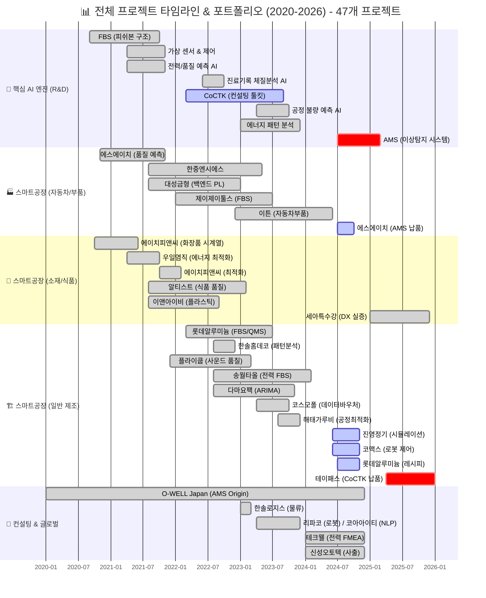
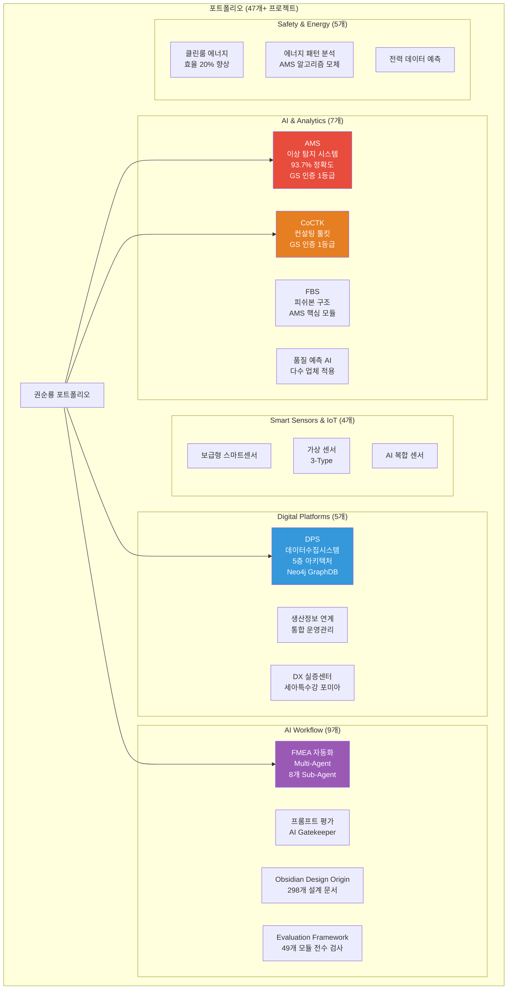
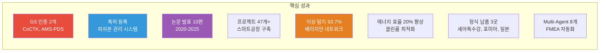
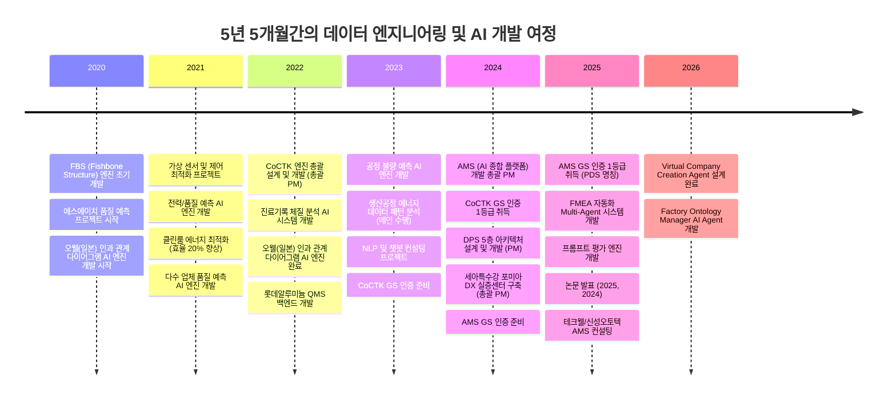
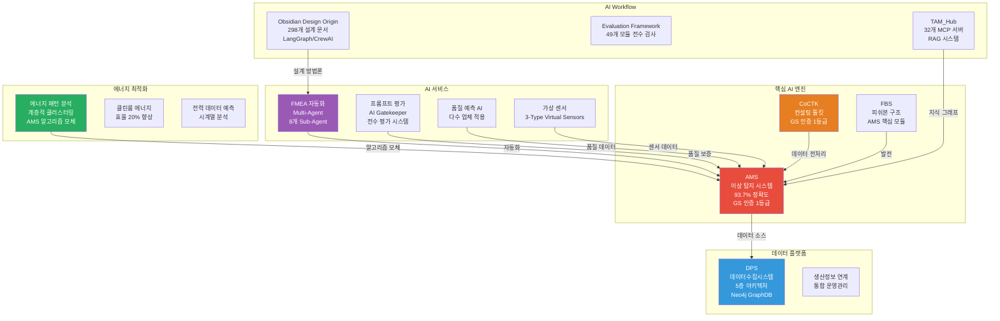
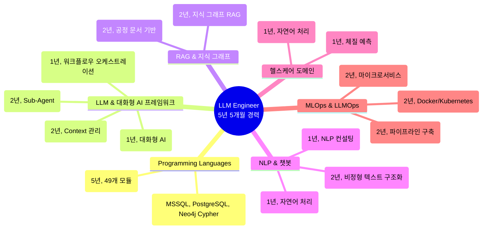

# 권순룡 포트폴리오

> **"모델보다 데이터, 데이터보다 정보, 지식구조를 정리하는 현장친화적 연구원"**

## 📌 기본 정보

**이름**: 권순룡  
**소속**: 한솔코에버 연구소 대리 (2020.09 ~ 재직중)  
**총 경력**: 5년 5개월 (2020.09~2026.01)  
**GitHub**: https://github.com/moobaek  
**이메일**: m920831@naver.com  
**연락처**: 010-5671-6200

---

## 📊 전체 프로젝트 타임라인 (2020-2026) - 47개 프로젝트

> [!INFO] **총 프로젝트 현황**
> - **AI & Analytics**: 7개 (AMS, CoCTK, FBS 등)
> - **스마트공장 구축**: 23개 (에스에이치아이엔티, 롯데알루미늄 등)
> - **컨설팅**: 8개 (테크웰, 신성오토텍 등)
> - **AI 에이전트**: 9개 (FMEA, PM Agent 등)

---

## 📊 포트폴리오 구조 (한눈에 보기)

---

## 🎯 핵심 성과 대시보드

| 분류 | 지표 | 상세 |
|:---|---:|:---|
| **인증** | GS 인증 2개 | CoCTK (2024), AMS-PDS (2025) |
| **지식 자산** | 특허 등록 | 피쉬본 관리 시스템 |
| **학술 성과** | 논문 발표 10편 | 한국유체기계학회, 한국생산제조학회 (2020-2025) |
| **프로젝트** | 47개+ 프로젝트 | 스마트공장 구축, AI 솔루션 개발, 컨설팅 |
| **기술 성과** | 이상 탐지 93.7% | 베이지안 네트워크 기반 모델 |
| **에너지 효율** | 20% 향상 | 클린룸 송풍기 최적 제어 |
| **납품 실적** | 정식 납품 3곳 | 세아특수강, 포미아, 일본 글로벌 기업 |
| **AI 기술** | Multi-Agent 8개 | FMEA 자동화 시스템 |

---

## 📅 경력 타임라인 (2020-2026)

---

## 🏆 주요 프로젝트 (47개+)

### 프로젝트 관계도

### 1. FMEA 자동화 생성 시스템 (Claude Sub-Agent) - Master Orchestrator 설계

**기간**: 2025.06 ~ 진행중  
**발주처**: 테크웰/신성오토텍  
**역할**: Master Orchestrator 설계 및 Multi-Agent Workflow 구현

**핵심 성과**:
- ✅ **Multi-Agent Workflow 설계**: Claude Sub-Agent 기반 8개 독립 Sub-Agent 협업 구조 구현
- ✅ **코딩 에이전트 역설계 시스템 구조 적용**: AIAG & VDA FMEA 표준 기반 범용 리스크 분석 시스템 개발
- ✅ **Phase 0~5 자동화 워크플로우**: FMEA 생성 프로세스 전 과정 자동화
- ✅ **Neo4j 기반 지식 그래프 RAG**: 공정 관리 문서 기반 FMEA 자동 생성
- ✅ **논문 발표**: 2025년 논문 발표

**기술 스택**: Python, Claude Agent, Multi-Agent System, MCP, RAG, Neo4j

**상세 설명**:
FMEA 자동화 시스템은 제조 현장의 리스크 분석을 자동화하는 Multi-Agent 시스템입니다. Claude Sub-Agent 기반으로 8개의 독립 Sub-Agent(R&D, Mfg, QA 등)가 협업하는 구조를 설계했으며, AIAG & VDA FMEA 표준을 기반으로 범용 리스크 분석 시스템을 개발했습니다. Master Orchestrator가 전체 워크플로우를 조율하는 구조로, Python 스크립트 없이 Claude Code 세션 자체가 Orchestrator 역할을 수행합니다.

---

### 2. 프롬프트 평가 엔진 (Claude Sub-Agent) - AI Gatekeeper

**기간**: 2025.06 ~ 진행중  
**발주처**: 내부 프로젝트  
**역할**: AI Gatekeeper 설계 및 구현

**핵심 성과**:
- ✅ **AI Gatekeeper**: 모든 AI 생성물의 입구를 통제하는 심사관
- ✅ **전체 프롬프트 전수 평가**: 25개+ 프롬프트의 품질을 승인/반려하는 완전 자동화 시스템
- ✅ **3가지 핵심 차원 평가**: Quality, Consistency, Cost
- ✅ **17가지 역할별 동적 가중치 시스템**: 각 역할에 맞는 최적화된 평가
- ✅ **병렬 처리 구조**: 4개 메트릭 동시 평가로 효율성 극대화

**기술 스택**: Python, Claude Agent, Multi-Agent System, 프롬프트 평가

**상세 설명**:
프롬프트 평가 엔진은 모든 AI 생성물의 입구를 통제하는 심사관 역할을 합니다. 전체 프롬프트를 전수 평가하는 완전 자동화 시스템으로, AI가 생성한 프롬프트를 다른 AI가 평가하는 이중 검증 구조로 환각을 방지합니다. 3가지 핵심 차원(Quality, Consistency, Cost)을 평가하며, MLOps Priority Matrix 기반 가중치를 적용합니다.

---

### 3. 코딩 에이전트 (Original Development Plan)

**기간**: 2025.05 ~ 진행중  
**발주처**: 내부 프로젝트  
**역할**: 총괄 설계 및 개발

**핵심 성과**:
- ✅ **LangGraph/CrewAI 워크플로우 오케스트레이션**: State 기반 노드 구성 및 조건부 라우팅으로 개발 프로세스 자동화
- ✅ **대화 관리 및 Context 관리**: Phase 0-13 워크플로우를 설계하여 각 단계의 Context를 관리하고 전달
- ✅ **상태 기반 진행 모니터링**: 워크플로우 상태를 실시간으로 모니터링하고 완료 조건을 자동으로 판단
- ✅ **RESTful API 및 클라우드 배포**: Docker 기반 마이크로서비스 아키텍처와 Kubernetes 컨테이너 오케스트레이션 구현
- ✅ **확장 가능한 MLOps/LLMOps 파이프라인**: MLOps/LLMOps 파이프라인을 구축하여 지속적인 배포와 모니터링을 지원

**기술 스택**: Python, LangGraph, CrewAI, Docker, Kubernetes, RESTful API

**상세 설명**:
코딩 에이전트는 복잡한 개발 프로세스를 자동화하는 시스템입니다. LangGraph/CrewAI 방식의 워크플로우 오케스트레이션을 구현했으며, 298개+ 설계 문서를 관리하며, ID 기반 온톨로지 맵 문서 시스템을 구축했습니다. Phase 기반 워크플로우 자동화를 통해 Phase 0-13까지의 단계별 프로세스를 자동화했습니다.

---

### 4. 코아아이티 자연어 처리 & 챗봇 컨설팅

**기간**: 2023.04 ~ 2023.12  
**발주처**: 코아아이티  
**역할**: 컨설팅 및 개발

**핵심 성과**:
- ✅ **자연어 처리 및 챗봇 개발**: 한약재/건강식품 데이터 분석 및 자연어 처리를 수행하여 챗봇 응답 생성 시스템을 설계
- ✅ **BERT 기반 NLP 모델 개발**: BertForSequenceClassification, DistilBERT 등 다양한 모델을 실험하여 최적의 모델을 선택
- ✅ **효과 및 주의사항 정보 구조화**: 비정형 텍스트를 구조화된 데이터로 변환하여 챗봇 응답을 생성
- ✅ **헬스케어 도메인 경험**: 한약재/건강식품 데이터 분석을 통해 헬스케어 도메인 지식을 축적

**기술 스택**: Python, BERT, DistilBERT, NLP, 챗봇

**상세 설명**:
코아아이티 챗봇 컨설팅은 한약재/건강식품 데이터 분석 및 자연어 처리를 수행하여 챗봇 응답 생성 시스템을 설계한 프로젝트입니다. BERT 기반 자연어 처리 모델을 생성 및 학습했으며, 효과 및 주의사항 정보를 구조화하고 챗봇 응답 생성 시스템을 설계했습니다.

---

### 5. Factory Ontology Manager AI Agent

**기간**: 2026.01 ~ 진행중  
**발주처**: 세아특수강  
**역할**: 총괄 설계 및 개발

**핵심 성과**:
- ✅ **자연어 기반 공정 문서 파싱**: 공정 엔지니어가 자연어로 작성한 공정 문서를 자동으로 파싱하여 구조화된 데이터로 변환
- ✅ **DB Grounding**: 사용자의 추상적 요청을 실제 DB의 설비/센서 ID로 자동 매핑하여 데이터 일관성을 보장
- ✅ **Ontology Mapping**: 설비 간 관계 및 데이터 흐름을 분석하여 시각화 구조를 생성
- ✅ **Context 관리**: 사용자 문맥을 기반으로 대화를 관리하고 지속적인 세션 메모리를 최적화

**기술 스택**: Python, LLM, RAG, Neo4j, 자연어 처리

**상세 설명**:
Factory Ontology Manager는 자연어 기반 공정 문서 파싱 및 캔버스 레이아웃 자동 생성 시스템입니다. 공정 문서를 파싱하여 공장 데이터와 매핑하고, 캔버스 레이아웃을 자동 생성합니다. 레이아웃 생성 시간을 80% 단축하고 데이터 일관성을 향상시켰습니다.

---

### 6. Virtual Company Creation Agent & AI_DB_tester (VACTS)

**기간**: 2025.06 ~ 진행중  
**발주처**: 내부 프로젝트  
**역할**: 총괄 설계 및 개발

**핵심 성과**:
- ✅ **Multi-Agent 시스템**: AI 에이전트로만 구성된 가상 기업: 15 Systems × 15 Sub-Agents = 225개 서브시스템을 설계
- ✅ **7단계 Chain Workflow**: Foundation → Organization → Agents → System Orchestrator → Protocol → Assembly → Crystallization의 워크플로우를 구현
- ✅ **Dual-Tier AI 아키텍처**: High-Spec AI (추론)와 Low-Spec AI (조회)를 분리하여 최대 87% 비용을 절감

**기술 스택**: Python, LLM, Multi-Agent, RAG, GFS

**상세 설명**:
Virtual Company Creation Agent는 AI 에이전트로만 구성된 가상 기업 생성 시스템입니다. GFS (Grape File System)를 통해 AI 없이도 데이터 접근이 가능하며, Dual-Tier AI 아키텍처로 최대 87% 비용을 절감했습니다.

---

### 7. 진료기록 체질 분석 시스템 - AI 엔진 개발

**기간**: 2022.06 ~ 2022.10  
**발주처**: 한국데이터산업진흥원  
**역할**: AI 엔진 개발

**핵심 성과**:
- ✅ **비정형 텍스트 구조화**: 진료기록 비정형 텍스트를 0/1 바이너리 테이블로 변환하여 구조화된 데이터로 변환
- ✅ **네트워크 분석 및 체질 예측**: 단순 워드클라우드 한계를 극복하여 네트워크 분석을 통해 체질을 예측
- ✅ **헬스케어 도메인 경험**: 한의원 진료 기록 기반 체질 예측 AI 시스템을 개발하여 헬스케어 도메인 지식을 축적

**기술 스택**: Python, ML, NLP, 네트워크 분석

**상세 설명**:
진료기록 체질 분석 시스템은 한의원 진료 기록 기반 체질 예측 AI 시스템입니다. 비정형 텍스트를 구조화된 데이터로 변환하여 네트워크 분석 및 체질 예측을 수행했습니다.

---

### 8. AMS (Analysis Management System) - 총괄 PM

**기간**: 2024.07 ~ 2025.03  
**발주처**: 한국산업기술진흥원  
**역할**: AI 종합 플랫폼 개발 총괄 PM

**핵심 성과**:
- ✅ **베이지안 네트워크 기반 이상 탐지 모델 개발**: 이상탐지율 93.7% 달성
- ✅ **Neo4j 그래프 DB 활용**: 4M2E 관계 온톨로지 정의 및 지식 그래프 플랫폼 구축
- ✅ **GS 인증 1등급 취득**: PDS 명칭으로 소프트웨어 품질 인증 획득
- ✅ **특허 등록**: 피쉬본 관리 시스템 특허 등록
- ✅ **정식 납품**: 세아특수강 포미아 DX 실증센터 구축 (PM), 테크웰/신성오토텍 AMS 컨설팅
- ✅ **논문 발표**: 2025, 2024년 논문 발표

**기술 스택**: Python, Neo4j, Docker, Kubernetes, Grafana, Prometheus, 베이지안 네트워크, 시계열 분석

**상세 설명**:
AMS는 제조 현장의 설비 이상을 자동으로 탐지하고 분석하는 AI 종합 플랫폼입니다. 베이지안 네트워크를 활용하여 설비 상태 데이터를 분석하고, 확률 최적화를 통한 이상상황 확률 네트워크를 구축했습니다. 8단계 시계열 데이터 파이프라인을 통해 실시간 데이터 수집부터 이상 탐지까지 전 과정을 자동화했습니다.

---

## 💻 기술 스택 맵

---

## 📚 학술 성과 (10편)

| 발행일 | 논문 제목 | 학술지/학회 | 핵심 성과 및 프로젝트 연계 |
| :--- | :--- | :--- | :--- |
| 2025.12 | **분석 상관/확률 네트워크 최적 경로 정보 및 공정 관리 문서 기반 FMEA 생성 연구** | KSFM 2025년도 동계학술대회 | [FMEA 자동화/복합센서/AMS] 상관/확률 네트워크 최적 경로 분석 기반 FMEA 자동 생성 기술 검증, AMS 결과 표시 LLM agent (GPT OSS) 개발 및 포미아 납품 적용 |
| 2025.06 | **AI를 활용한 구조와 룰을 활용한 구조-확률 종합 네트워크 및 최적 관리 방안 도출** | 한국유체기계학회 | [AMS] 피쉬본 AI 모델의 학술적 고도화 및 최적 관리 로직 증명 (초기 O-WELL 알고리즘 고도화) |
| 2024.12 | **공장 운영 핵심 요소의 식별 및 최적화를 위한 클러스터링 기법 적용** | 한국생산제조학회 | [DPS] 공장 운영 데이터의 다차원 분석 및 디지털 트윈 최적화 근거 |
| 2024.12 | **설비 이상상태 기반 최적 공정 데이터 추론 및 위험/안전 관리 최적 자동화** | 한국유체기계학회 | [AMS] 실시간 이상 상태 기반 위험 관리 알고리즘의 유효성 검증 |
| 2024.07 | **전력 데이터를 통한 설비 상태 추론 및 이상 상황 설정 예측** | 한국유체기계학회 | [에너지/센서] 전력 데이터 기반의 설비 예지 보전 기술 실증 |
| 2023.12 | **송풍 설비 변동부하 대응 전력품질 분석 및 에너지 절감 연구** | 한국유체기계학회 | [에너지 최적화] 에너지 20% 절감 실증 솔루션의 핵심 물리 분석 모델 |
| 2023.12 | **압축기 공정에서 데이터 밸런스 문제 해결 및 품질 결과 사전 예측을 위한 AI 시스템** | 한국유체기계학회 | [AI/데이터] 소량의 불량 데이터 극복을 위한 AI 학습 모델 연구 |
| 2023.07 | **생산공정 에너지 및 설비 상태 진단을 위한 AI기반의 전력 사용 패턴 및 SOH분석** | 한국유체기계학회 | [에너지/전력] 설비 건전성(SOH) 진단 및 에너지 효율화 융합 기술 (**Energy Pattern** 과제 실증) |
| 2022.12 | **자동차 부품 생산 산업을 위한 머신러닝 기반의 품질예측 알고리즘** | 한국생산제조학회 | [AI/제조] 세아베스틸 등 자동차 부품 공정 품질 예측 모델의 기초 |
| 2022.06 | **ICT 융복합 기술을 활용한 스마트 공장 및 에너지 절감 솔루션 적용 사례** | 한국유체기계학회 | [Global DX] **O-WELL Japan** 등 글로벌 스마트 공장 구축 사례의 실증 (AMS 초기 모델 검증) |

---

## 🤖 LLM 활용 방법

### Agent/MCP/RAG 시스템

최신 AI 기술 트렌드를 적용하여 LLM, Agent, RAG 기반 AI 서비스를 개발했습니다.

#### Multi-Agent 시스템

**FMEA 자동화 Multi-Agent 시스템**:
Claude Sub-Agent 기반 8개 독립 Sub-Agent 협업 구조를 설계했습니다. R&D, Mfg, QA 등 역할별 Sub-Agent가 독립적으로 작업을 수행하며, Master Orchestrator가 전체 워크플로우를 조율합니다. AIAG & VDA FMEA 표준을 기반으로 범용 리스크 분석 시스템을 개발했습니다. Phase 0부터 Phase 5까지 FMEA 생성 프로세스 전 과정을 자동화하여 리스크 분석 시간을 대폭 단축했습니다.

**프롬프트 평가 엔진**:
AI Gatekeeper 역할을 수행하는 프롬프트 평가 엔진을 개발했습니다. 모든 AI 생성물의 입구를 통제하는 심사관으로, 전체 프롬프트를 전수 평가하는 완전 자동화 시스템입니다. AI가 생성한 프롬프트를 다른 AI가 평가하는 이중 검증 구조로 환각을 방지합니다. 3가지 핵심 차원(Quality, Consistency, Cost)을 평가하며, 17가지 역할별 동적 가중치 시스템을 적용합니다.

#### MCP (Model Context Protocol) 서버 개발

**32개 Python MCP 서버 개발**:
포트폴리오 문서 접근, 프로젝트 정보 조회, 기술 스택 분석 등 다양한 기능을 제공하는 32개의 Python MCP 서버를 개발했습니다. Claude Agent와의 통합을 위한 표준 프로토콜을 구현하여 다양한 AI Agent와 연동할 수 있도록 설계했습니다.

#### RAG (Retrieval-Augmented Generation) 시스템

**Neo4j 기반 지식 그래프 RAG**:
Neo4j 그래프 DB를 활용한 지식 그래프를 구축하고, 4M2E 관계 온톨로지를 정의하여 질의응답 시스템에 컨텍스트를 제공합니다. 포트폴리오 문서, 프로젝트 정보, 기술 스택 등을 지식 그래프로 표현하여 AI Agent가 필요한 정보를 효율적으로 검색할 수 있습니다.

#### LangGraph/CrewAI 워크플로우 오케스트레이션

**Obsidian Design Origin 시스템**:
LangGraph/CrewAI 방식의 워크플로우 오케스트레이션을 구현했습니다. 25개+ AI 프롬프트 체인을 설계하고, 개발 에이전트 실시간 평가 시스템을 구축했습니다. 298개+ 설계 문서를 관리하며, ID 기반 온톨로지 맵 문서 시스템을 구축했습니다. Phase 기반 워크플로우 자동화를 통해 Phase 0-13까지의 단계별 프로세스를 자동화했습니다.

---

## 🔗 관련 링크

- **메인 레포지토리**: https://github.com/moobaek/Testing_AI_agents_for_public_use
- **포트폴리오 문서**: https://github.com/moobaek/Testing_AI_agents_for_public_use/tree/main/portfolio/portfolio_docs
- **GitHub 프로필**: https://github.com/moobaek

---

© 2026 권순룡. All Rights Reserved.
