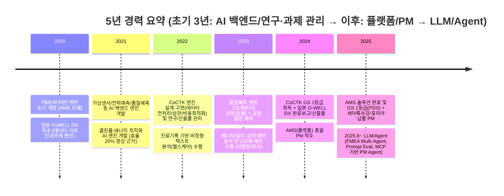
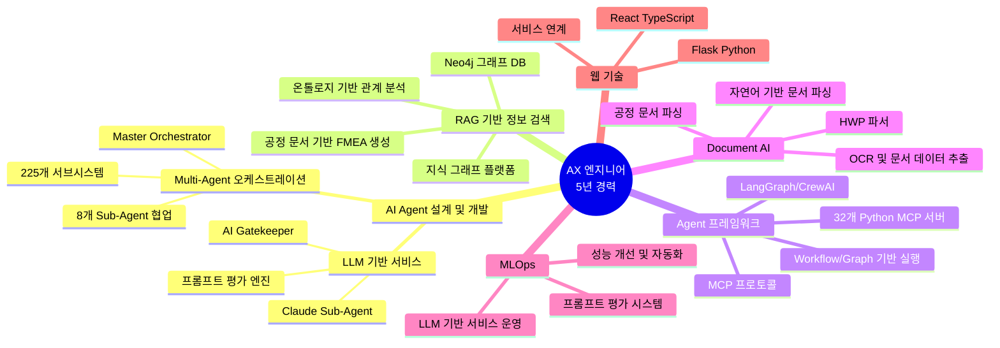
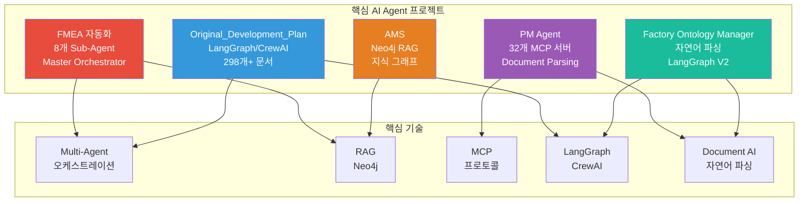
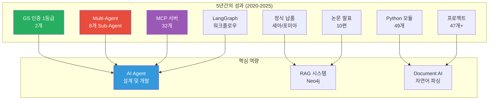

# 권순룡 이력서

## 기본 정보

**이름**: 권순룡  
**연락처**: 010-5671-6200  
**이메일**: m920831@naver.com  
**현 소속**: 한솔코에버 연구소 대리 (2020.09 ~ 재직중)  
**총 경력**: 5년 (2020~2025)  
**핵심 역량**: AI 백엔드/엔진 개발, 연구·과제 관리(보고서/산출물), 데이터 파이프라인·품질/정합성, 플랫폼·PM(총괄/기술), LLM/Agent(Multi-Agent, RAG, MCP, LangGraph), Document AI

---

## 한눈에 보는 경력 (2020-2025)

---

## 지원 동기

저는 5년 동안 “AI 백엔드 엔진 개발 → 연구·과제 관리(산출물/보고서) → 플랫폼 총괄 PM → LLM/Agent”로 역할을 확장해왔습니다. 초기 3년은 제조·에너지 도메인에서 가상센서/전력예측/품질예측 등 모델을 실제 서비스 형태로 만들기 위한 AI 백엔드 엔진과 데이터 처리 파이프라인을 중심으로 개발했고, 동시에 과제 수행 과정에서 완료보고·산출물 작성 등 연구/과제 운영을 함께 수행했습니다. 이후 CoCTK/AMS에서 엔진과 플랫폼을 총괄하는 PM으로 확장했고, 2025.6~부터는 Multi-Agent, MCP, LangGraph 기반의 업무 자동화(Agent)까지 직접 설계·구현했습니다.

디비아이엔씨 AX(AI Transformation) 팀의 “LLM 기반 AI 서비스/플랫폼 설계·구축”, “AI Agent 설계 및 개발”, “RAG 기반 검색·추출 고도화”는 제가 수행해온 흐름과 직접 연결됩니다. 예를 들어, 제조 현장에서 데이터가 깨지는 지점을 먼저 ‘정합성/품질’ 관점으로 잡고(플랫폼 운영 관점), 그 위에 RAG(Neo4j 지식 그래프)와 Multi-Agent(8개 Sub-Agent, Master Orchestrator)를 얹어 “업무 자동화/의사결정 지원” 형태로 완성해본 경험이 있습니다.

디비아이엔씨의 시스템 통합/운영 역량과 제가 강점으로 가진 “엔진을 운영 가능한 형태로 만든 경험(초기 3년)” 및 “플랫폼/에이전트로 확장한 경험(최근 2년)”을 결합해, AX 과제를 ‘데모’가 아니라 ‘운영 가능한 서비스’로 만드는 데 기여하고 싶습니다.

---

## 핵심 역량 맵

---

## 핵심 역량

### 1) AI 백엔드/엔진 개발 + 연구·과제 관리 (초기 3년 중심, 2020~2023)

제조/에너지 현장에서 “모델”만이 아니라 실제 적용을 위해 필요한 **AI 엔진(백엔드)·데이터 처리·검증**을 중심으로 수행했습니다. 가상센서/전력예측/품질예측/공정불량예측 등 다양한 시계열·공정 데이터를 다뤘고, 데이터 밸런스·정합성 이슈를 전제로 “현장 데이터의 한계까지 포함해” 성과를 투명하게 설명/문서화해 왔습니다. 과제 수행 과정에서 완료보고·산출물 작성, 협력사 커뮤니케이션(고객/정부 이중 커뮤니케이션) 등 **연구·과제 운영**도 함께 수행했습니다.

### 2) 플랫폼/PM: 엔진을 제품/서비스로 만드는 경험 (2022~2025)

CoCTK/AMS에서 데이터 전처리·상관/비용최적화·이상탐지 등 핵심 엔진을 기반으로 **플랫폼 설계/개발/검증/납품**을 총괄했습니다. 단순 PoC가 아니라 GS 인증, 특허, 납품(세아특수강/포미아 등)까지 이어지는 전체 라이프사이클(기획-개발-검증-납품)을 리드했습니다.

### 3) RAG 기반 정보 검색·추출 시스템 구축 (지식 그래프/온톨로지)

Neo4j 그래프 DB를 활용한 지식 그래프 RAG 시스템을 구축했습니다. AMS 프로젝트에서 공정 관리 문서를 파싱하여 Neo4j 그래프 DB에 저장하고, 상관/확률 네트워크 최적 경로 분석을 통해 지식 그래프에서 최적 경로를 찾아 FMEA 자동 생성 기술을 검증했습니다. 4M2E 관계를 정의하고 온톨로지 기반 관계 분석을 수행하여 이질적인 데이터 소스를 유기적으로 연결했습니다. DPS 프로젝트에서도 온톨로지 기반 관계 분석을 수행했으며, AMS 프로젝트에서 확률 최적화 결과를 분석 온톨로지 형태로 통합하여 지식 그래프 플랫폼을 구축했습니다.

### 4) LLM/Agent: 업무 자동화·지식탐색·의사결정 지원 (2025.6~)

Claude Sub-Agent 기반 Multi-Agent Workflow를 구축하여 복잡한 업무 프로세스를 자동화했습니다. FMEA 자동화 생성 시스템에서는 8개 독립 Sub-Agent가 협업하는 구조를 설계하고, Master Orchestrator를 통해 Phase 0~5 자동화 워크플로우를 구현했습니다. Original_Development_Plan에서는 LangGraph/CrewAI 방식 워크플로우 오케스트레이션을 구현했고, PM Agent에서는 MCP (Model Context Protocol) 기반으로 기술 자산/문서 파서 서버를 연결하는 구조를 설계했습니다.

### 5) LangGraph/CrewAI 방식 워크플로우 오케스트레이션

Original_Development_Plan에서 LangGraph/CrewAI 방식 워크플로우 오케스트레이션을 구현했습니다. 상태 기반 노드 구성 및 조건부 라우팅으로 개발 프로세스를 자동화했으며, 워크플로우 상태 모니터링 시스템을 구축하여 체크리스트, 작업, 마일스톤 진행률을 실시간 추적하고 블로커를 자동 감지했습니다. 완료 조건 판단 및 자동 복귀 로직을 구현하여 개발 완료 여부를 판단한 후 README 진입점으로 복귀하거나 연속 개발 루프를 유지하도록 설계했습니다. Factory Ontology Manager AI Agent에서는 LangGraph V2를 사용하여 공정 재사용 로직, 자재 할당 개선, materialId 검증을 구현했습니다.

### MCP (Model Context Protocol) 기반 시스템 구축 (1년 경력)

PM Agent에서 MCP 기반 기술 자산 관리 시스템을 구축했습니다. 32개 Python MCP 서버를 개발하여 비정형 문서(HWP, DOCX, XLSX)를 자동 파싱하는 Docker 기반 파서 서버를 구축했습니다. MCP Protocol을 통해 계약서/과업지시서 분석, 회의록 분석을 통한 타임라인 자동 현행화, 누락된 문서나 데이터 파편화 방지 등 사업 관리의 전체 라이프사이클을 관장합니다. Risk Management (계약서/과업지시서 내 독소 조항 자동 추출), Schedule Tracking (회의록 분석), Integrity Check (누락된 문서나 데이터 파편화 방지) 등 비즈니스 문제 중심 솔루션을 구현했습니다.

### 오픈소스 기반 Document AI 활용 (1년 경력)

Factory Ontology Manager AI Agent에서 자연어 기반 공정 문서 파싱 시스템을 구축했습니다. 공정 엔지니어가 자연어로 작성한 공정 문서를 자동으로 파싱하여 구조화된 정보를 추출하고, DB Grounding을 통해 사용자의 추상적 요청을 실제 DB의 설비/센서 ID로 자동 매핑했습니다. Ontology Mapping을 통해 설비 간 관계 및 데이터 흐름을 분석하여 시각화 구조를 생성했으며, Spec-First Modification 방식으로 수정 요청 시 바로 코드를 고치는 것이 아니라 '요구사항 명세서'를 먼저 작성 후 데이터를 수정하는 프로세스를 구현했습니다. PM Agent에서는 HWP 파서를 통한 문서 처리 경험도 보유하고 있습니다.

---

## 프로젝트 관계도

---

## 경력 개요

### 한솔코에버 연구소 (2020.09 ~ 재직중)
**직급**: 대리  
**주요 업무**:
- AI Agent 설계 및 개발 (Multi-Agent Workflow, MCP 기반 시스템)
- LLM 기반 업무 자동화 시스템 구축
- RAG 기반 정보 검색 시스템 구축
- 데이터 분석 플랫폼 개발 및 PM
- 프로젝트 총괄 관리

**성과**:
- GS 인증 1등급 2개 (AMS, CoCTK)
- 특허 등록 (피쉬본 관리 시스템)
- 논문 발표 10편
- 정식 납품: 세아특수강, 포미아

---

## 주요 프로젝트 경험

### 1. FMEA 자동화 생성 시스템 (Claude Sub-Agent) - Master Orchestrator 설계

**기간**: 2025.6 ~ 현재  
**발주처**: 내부 개발  
**역할**: Master Orchestrator 설계 및 구현

**핵심 성과**:
- ✅ **8개 독립 Sub-Agent 협업 시스템**: R&D Team 3개, Manufacturing Team 3개, QA Team 2개로 구성된 전문 영역별 Sub-Agent 설계
- ✅ **Master Orchestrator 설계**: Claude Code Task tool 기반 Multi-Agent Workflow 구축, Python 스크립트 없이 Claude Code 세션 자체가 Orchestrator 역할
- ✅ **Phase 0~5 자동화 워크플로우**: 컨텍스트 수집 → 범위 정의 → 심층 분석 → 리스크 평가 → 최적화 & 문서 생성 → 지속 개선
- ✅ **코딩 에이전트 역설계 시스템 구조 적용**: 복잡한 FMEA 프로세스를 역으로 분석하여 Sub-Agent로 분해
- ✅ **AIAG & VDA FMEA 표준 기반 범용 리스크 분석 시스템**: 제조업/사무업무/서비스업 지원
- ✅ **논문 발표**: 2025.12 KSFM 동계학술대회 "분석 상관/확률 네트워크 최적 경로 정보 및 공정 관리 문서 기반 FMEA 생성 연구"

**기술 스택**: Python, Claude Code Task tool, Multi-Agent Workflow, 프롬프트 기반 자동화

---

### 2. Original_Development_Plan (Obsidian Design Origin) - 전체 에이전트 시스템 설계

**기간**: 2020 ~ 2025 (집중 개발: 2025.5~7, 2025.8~10, 2025.10~12)  
**발주처**: 내부 개발  
**역할**: 전체 에이전트 시스템 설계 (PM 활동에서 문서, 개발 진행 관리에 활용)

**핵심 성과**:
- ✅ **LangGraph/CrewAI 방식 워크플로우 오케스트레이션**: 상태 기반 노드 구성 및 조건부 라우팅으로 개발 프로세스 자동화
- ✅ **상태 기반 진행 모니터링 및 완료 조건 판단 시스템**: 체크리스트, 작업, 마일스톤 진행률 실시간 추적 및 블로커 자동 감지
- ✅ **298개+ 설계 문서 관리**: ID 기반 온톨로지 맵으로 문서 간 관계 추적
- ✅ **25개+ AI 프롬프트 체인**: 체계적인 프롬프트 라이브러리 구축
- ✅ **21개 development 프롬프트**: 수정 관리 시스템 포함, 개발 워크플로우 자동화
- ✅ **품질 관리 오케스트레이션**: Agent 평가 → 무결성 검사 → 최종 사용자 확인 단계 자동화
- ✅ **Few-shot 규칙 기반 코드 품질 자동 검증**: 28개 Few-shot Rules System (8개 도메인)

**기술 스택**: Python, LangGraph, CrewAI, ID 기반 온톨로지 맵, State 기반 정보 전달

---

### 3. PM Agent (Business Management Sub-Agent) - MCP 기반 시스템 구축

**기간**: 2025.10 ~ 현재  
**발주처**: 내부 개발  
**역할**: Execution Manager & Governance 설계 및 구현

**핵심 성과**:
- ✅ **MCP (Model Context Protocol) 기반 기술 자산 관리 시스템**: 32개 Python MCP 서버 개발
- ✅ **Docker 기반 에이전트 시스템 구축**: 비정형 문서(HWP, DOCX, XLSX) 자동 파싱 파서 서버
- ✅ **Risk Management**: 계약서/과업지시서 내 독소 조항 자동 추출 및 리스크 평가
- ✅ **Schedule Tracking**: 회의록 분석을 통한 타임라인 자동 현행화
- ✅ **Integrity Check**: 누락된 문서나 데이터 파편화 방지하는 무결성 검증
- ✅ **사업 관리의 전체 라이프사이클 관장**: 내·외부 에이전트 연동 가능한 구조 설계

**기술 스택**: Python, MCP (Model Context Protocol), Docker, Claude Agent, HWP 파서

---

### 4. AMS (Analysis Management System) - 총괄 PM

**기간**: 2024.07 ~ 2025.03  
**발주처**: 한국산업기술진흥원  
**역할**: 총괄 PM

**핵심 성과**:
- ✅ **Neo4j 그래프 DB 기반 지식 그래프 RAG 시스템**: 공정 관리 문서 기반 FMEA 자동 생성, 상관/확률 네트워크 최적 경로 분석
- ✅ **4M2E 관계 정의 및 온톨로지 기반 관계 분석**: 이질적인 데이터 소스를 유기적으로 연결
- ✅ **GS 인증 1등급 (PDS 명칭)**: 정부 공인 우수 소프트웨어 인증
- ✅ **정식 납품**: 세아특수강, 포미아
- ✅ **베이지안 네트워크 기반 이상 탐지**: 93.7% 정확도 (실질 60-70%)
- ✅ **49개 Python 모듈 개발**: MLS, FBS, RMS, AMS 서비스

**기술 스택**: Python, Neo4j, MSSQL Server, PostgreSQL, 베이지안 네트워크, Docker

---

### 5. Factory Ontology Manager AI Agent - 자연어 기반 문서 파싱

**기간**: 2026.1.8 ~ 현재  
**발주처**: 내부 개발  
**역할**: 자연어 기반 공정 문서 파싱 및 캔버스 레이아웃 자동 생성

**핵심 성과**:
- ✅ **자연어 기반 공정 문서 파싱**: 공정 엔지니어가 자연어로 작성한 공정 문서를 자동으로 파싱하여 구조화된 정보 추출
- ✅ **DB Grounding**: 사용자의 추상적 요청을 실제 DB의 설비/센서 ID로 자동 매핑
- ✅ **Ontology Mapping**: 설비 간 관계 및 데이터 흐름을 분석하여 시각화 구조 생성
- ✅ **LangGraph V2**: 공정 재사용 로직, 자재 할당 개선, materialId 검증
- ✅ **레이아웃 생성 시간 80% 단축**: 비즈니스 가치 창출
- ✅ **Spec-First Modification**: 수정 요청 시 바로 코드를 고치는 것이 아니라, '요구사항 명세서'를 먼저 작성 후 데이터 수정

**기술 스택**: React 18.3.1, TypeScript 5.5.3, Flask (Python), LangGraph, Instructor, AI_DB_center

---

## 기술 스택

### Programming Languages
- **Python**: 5년 (AI 엔진 개발, 데이터 분석, ML/DL, 백엔드 개발, MCP 서버 개발, 49개 모듈)
- **TypeScript**: 1년 (React 기반 프론트엔드 개발)
- **HTML/JavaScript**: 1년 (웹 기술을 활용한 서비스 연계)

### AI Agent & LLM
- **Multi-Agent 오케스트레이션**: 8개 Sub-Agent 협업 시스템, 225개 서브시스템, Master Orchestrator 설계
- **LangGraph/CrewAI**: 워크플로우 오케스트레이션, 상태 기반 노드 구성, 조건부 라우팅
- **MCP (Model Context Protocol)**: 32개 Python MCP 서버 개발, Docker 기반 파서 서버
- **Claude Sub-Agent**: Task tool 기반 Multi-Agent Workflow, 프롬프트 기반 자동화

### RAG & Vector DB
- **Neo4j**: 그래프 DB, 4M2E 관계 정의, 온톨로지 기반 관계 분석, 지식 그래프 플랫폼
- **RAG 시스템**: 공정 관리 문서 기반 FMEA 생성, 상관/확률 네트워크 최적 경로 분석

### Document AI
- **자연어 기반 문서 파싱**: 공정 문서 파싱, DB Grounding, Ontology Mapping
- **HWP 파서**: 비정형 문서 자동 파싱 (PM Agent)

### MLOps
- **프롬프트 평가 엔진**: AI Gatekeeper, 25개+ 프롬프트 전수 평가, 3가지 핵심 차원 평가 (Quality, Consistency, Cost)
- **MLOps Priority Matrix**: 실패 영향 기반 가중치 (Structural 40%, Correctness 30%, Relevancy 20%, Tone 10%)

### Infrastructure
- **Docker**: 컨테이너 기반 마이크로서비스, MCP 파서 서버
- **React + TypeScript**: 프론트엔드 개발 (Factory Ontology Manager AI Agent)
- **Flask (Python)**: 백엔드 API 개발

---

## 성과 대시보드

---

## 학력

**홍익대학교 전자공학과** (2013.03 ~ 2020.02)
- 학점: 3.11 / 4.5
- 졸업논문: LD 동격회로 설계 및 PLL 설계
- 주요 수강 분야: 회로 설계, 전파공학, 컴퓨터공학

---

## 자격증

**OPIc** (2019.03)
- ACT FL (American Council on the Teaching of Foreign Languages)

---

## 핵심 철학

> **"모델보다 데이터, 데이터보다 정보, 지식구조를 정리하는 현장친화적 연구원"**

5년간 AI Agent 시스템을 설계하고 개발하며, 복잡한 업무 프로세스를 구조화하고 자동화하는 과정에서 "지식구조를 정리하는" 접근 방식의 중요성을 깨달았습니다. Multi-Agent 시스템, RAG 기반 정보 검색, Document AI 등 다양한 기술을 활용하여 실제 현장의 문제를 해결하는 데 집중해왔습니다.
