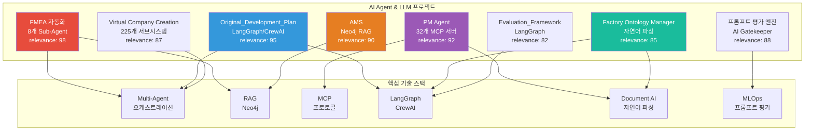
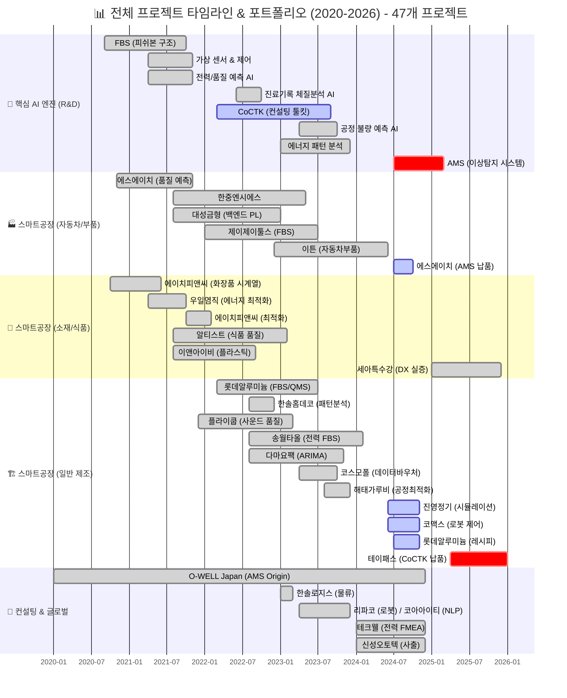
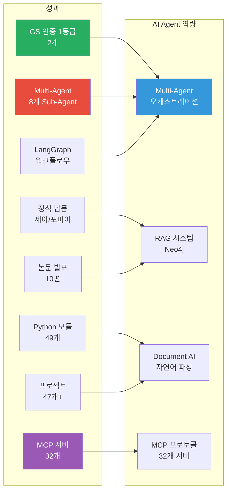
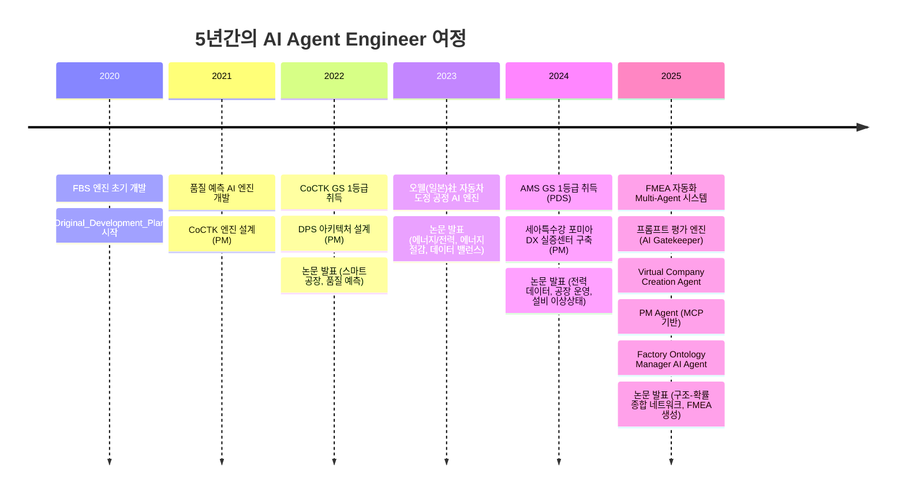
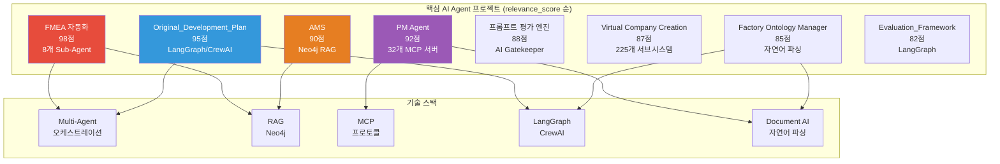
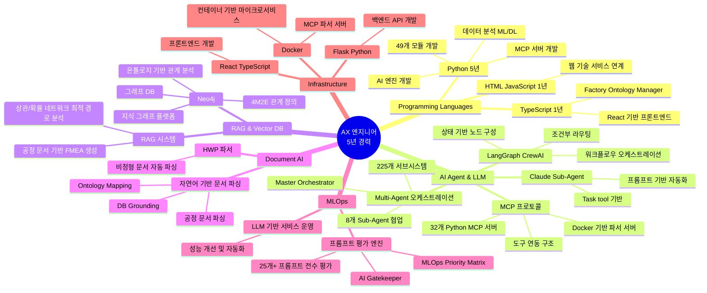

# 권순룡 포트폴리오

> **"모델보다 데이터, 데이터보다 정보, 지식구조를 정리하는 현장친화적 연구원"**

---

## 📌 기본 정보

**이름**: 권순룡  
**연락처**: 010-5671-6200  
**이메일**: m920831@naver.com  
**GitHub**: https://github.com/moobaek

---

## 📊 포트폴리오 구조 (한눈에 보기)

---

## 🧭 역할/경력 요약 (핵심: 초기 3년은 “백엔드 AI + 연구·과제 관리”)

- **2020~2022(초기)**: 제조·에너지 현장 데이터 기반 **AI 백엔드/엔진 개발**(FBS, 가상센서, 전력/품질 예측) + **연구·과제 운영/산출물(완료보고서 등) 관리**
- **2022~2025(확장)**: CoCTK/AMS 중심으로 **엔진→플랫폼화**(아키텍처/품질/검증/납품), **총괄/기술 PM** 수행
- **2025.6~(전환)**: 업무 자동화/지식 탐색/의사결정 지원을 위한 **LLM/Agent(Multi-Agent, RAG, MCP, LangGraph)** 설계·구현

## 📅 연도별 프로젝트 종합 현황 (2020-2026)

> [!INFO] **총 프로젝트 현황**
> - **AI & Analytics**: 7개 (AMS, CoCTK, FBS 등)
> - **스마트공장 구축**: 23개 (에스에이치아이엔티, 롯데알루미늄 등)
> - **컨설팅**: 8개 (테크웰, 신성오토텍 등)
> - **AI 에이전트**: 9개 (FMEA, PM Agent 등)

---

## 📂 사업/과제 이력 

| 구분 | 사업/프로젝트 | 기간 / 기관 | 역할 | CJ올리브영 연관 포인트 |
|:---|:---|:---|:---|:---|
| 🔴 | AMS (Analysis Management System) | 2024.07~2025.12 / 한국산업기술진흥원 | AI 종합 플랫폼 총괄 PM | 데이터 품질 관리, 이상 탐지, 지표 정합성, 지표 모델링, 파이프라인 운영 |
| 🔴 | DPS (데이터수집시스템) | 2022.03~2024.12 / 중소기업기술정보진흥원 | 데이터 수집·파이프라인 총괄 PM | 대규모 데이터 파이프라인, 데이터 통합, Neo4j 기반 관계 구조 |
| 🔴 | CoCTK (Consulting Tool Kit) | 2022.03~2024.12 / 중소기업기술정보진흥원 | 엔진·화면 설계 총괄 PM | 데이터 전처리, 상관관계 분석, 비용·성과 최적화 지표 설계 |
| 🔴 | Evaluation_Framework | 2024.01~2025.12 / 내부 개발 | 데이터 품질 검증 시스템 개발 | 데이터 품질 점검, 지표 정기 검증, 시스템 단위 QA 체계 |
| 🔴 | pipeline_system_complete | 2023.01~2024.12 / 내부 개발 | 시계열 파이프라인 설계·개발 | 로그·시계열 데이터 수집·검증 파이프라인 경험 |
| 🟠 | 오웰(일본) 자동차 도정 DX | 2023.12~2025.03 / O-WELL | 인과 관계 다이어그램 AI 엔진 PM | 복잡한 행동/상태 로그의 관계 구조 모델링, 글로벌 협업 경험 |
| 🟠 | 포미아 DX 실증센터 분석 플랫폼 | 2025.06~2025.10 / 세아특수강·ISTN에임즈 | 분석 플랫폼 PM 총괄 | 복수 데이터 소스 연동, 분석용 데이터 레이어 설계 |
| 🟠 | 테크웰 AMS 컨설팅 | 2025.03~2025.07 / 포다스 용역 | 데이터 분석 PM | 이해관계자 커뮤니케이션, 현장 컨설팅 경험 |
| 🟡 | 에너지·전력 패턴·가상센서 계열 다수 | 2021~2024 / 한국에너지기술평가원 외 | AI 엔진 개발·PM | 시계열·센서 로그 처리 경험, 다양한 도메인 데이터 분석 폭 |

세부 사업 내용과 역할은 아래 **주요 프로젝트** 섹션과 Git 리포지토리에서 확인 가능합니다.  
참조: https://github.com/moobaek/Testing_AI_agents_for_public_use/blob/main/portfolio/portfolio_docs/02_Projects_Overview.md
---

## 🎯 핵심 성과 대시보드

| 분류 | 지표 | 상세 |
|:---|---:|:---|
| **인증** | GS 1등급 2개 | AMS (PDS 명칭), CoCTK |
| **Multi-Agent** | 8개 Sub-Agent | FMEA 자동화, 225개 서브시스템 (Virtual Company) |
| **MCP 서버** | 32개 | PM Agent, Document Parsing |
| **납품** | 정식 납품 2곳 | 세아특수강, 포미아 |
| **학술** | 논문 발표 10편 | 2020-2025년 지속적 연구 |
| **개발** | Python 모듈 49개 | MLS, CoCTK, FBS, RMS, AMS |
| **프로젝트** | 총 47개+ | AI, 플랫폼, 센서, 에너지 등 |
| **LangGraph** | 워크플로우 오케스트레이션 | Original_Development_Plan, Factory Ontology Manager |

---

## 📅 경력 타임라인 (2020-2025)

---

## 🏆 주요 프로젝트 (47개+)

### 프로젝트 관계도

### 1. FMEA 자동화 생성 시스템 (Claude Sub-Agent) - 총괄 PM

**기간**: 2025.6 ~ 현재  
**발주처**: 내부 개발  
**역할**: Master Orchestrator 설계 및 구현  
**relevance_score**: 98

**핵심 성과**:
- ✅ **8개 독립 Sub-Agent 협업 시스템**: R&D Team 3개, Manufacturing Team 3개, QA Team 2개로 구성된 전문 영역별 Sub-Agent 설계
- ✅ **Master Orchestrator 설계**: Claude Code Task tool 기반 Multi-Agent Workflow 구축, Python 스크립트 없이 Claude Code 세션 자체가 Orchestrator 역할
- ✅ **Phase 0~5 자동화 워크플로우**: 컨텍스트 수집 → 범위 정의 → 심층 분석 → 리스크 평가 → 최적화 & 문서 생성 → 지속 개선
- ✅ **코딩 에이전트 역설계 시스템 구조 적용**: 복잡한 FMEA 프로세스를 역으로 분석하여 Sub-Agent로 분해
- ✅ **AIAG & VDA FMEA 표준 기반 범용 리스크 분석 시스템**: 제조업/사무업무/서비스업 지원
- ✅ **논문 발표**: 2025.12 KSFM 동계학술대회 "분석 상관/확률 네트워크 최적 경로 정보 및 공정 관리 문서 기반 FMEA 생성 연구"

**기술 스택**: Python, Claude Code Task tool, Multi-Agent Workflow, 프롬프트 기반 자동화

**담당 업무 매칭**:
- ✅ AI Agent 설계 및 개발 (업무 자동화, 지식 탐색, 의사결정 지원)
- ✅ AX(AI Transformation) 과제 수행을 위한 LLM 기반 AI 서비스 및 플랫폼 설계와 구축
- ✅ Multi-Agent 오케스트레이션, sLLM, Agent 프로토콜 활용

---

### 2. Original_Development_Plan (Obsidian Design Origin) - 전체 에이전트 시스템 설계

**기간**: 2020 ~ 2025 (집중 개발: 2025.5~7, 2025.8~10, 2025.10~12)  
**발주처**: 내부 개발  
**역할**: 전체 에이전트 시스템 설계 (PM 활동에서 문서, 개발 진행 관리에 활용)  
**relevance_score**: 95

**핵심 성과**:
- ✅ **LangGraph/CrewAI 방식 워크플로우 오케스트레이션**: 상태 기반 노드 구성 및 조건부 라우팅으로 개발 프로세스 자동화
- ✅ **상태 기반 진행 모니터링 및 완료 조건 판단 시스템**: 체크리스트, 작업, 마일스톤 진행률 실시간 추적 및 블로커 자동 감지
- ✅ **298개+ 설계 문서 관리**: ID 기반 온톨로지 맵으로 문서 간 관계 추적
- ✅ **25개+ AI 프롬프트 체인**: 체계적인 프롬프트 라이브러리 구축
- ✅ **21개 development 프롬프트**: 수정 관리 시스템 포함, 개발 워크플로우 자동화
- ✅ **품질 관리 오케스트레이션**: Agent 평가 → 무결성 검사 → 최종 사용자 확인 단계 자동화
- ✅ **Few-shot 규칙 기반 코드 품질 자동 검증**: 28개 Few-shot Rules System (8개 도메인)

**기술 스택**: Python, LangGraph, CrewAI, ID 기반 온톨로지 맵, State 기반 정보 전달

**담당 업무 매칭**:
- ✅ AX(AI Transformation) 과제 수행을 위한 LLM 기반 AI 서비스 및 플랫폼 설계와 구축
- ✅ LangChain, LangGraph, LangSmith 등 Agent 프레임워크 활용
- ✅ Multi-Agent 오케스트레이션, sLLM, Agent 프로토콜 활용

---

### 3. PM Agent (Business Management Sub-Agent) - MCP 기반 시스템 구축

**기간**: 2025.10 ~ 현재  
**발주처**: 내부 개발  
**역할**: Execution Manager & Governance 설계 및 구현  
**relevance_score**: 92

**핵심 성과**:
- ✅ **MCP (Model Context Protocol) 기반 기술 자산 관리 시스템**: 32개 Python MCP 서버 개발
- ✅ **Docker 기반 에이전트 시스템 구축**: 비정형 문서(HWP, DOCX, XLSX) 자동 파싱 파서 서버
- ✅ **Risk Management**: 계약서/과업지시서 내 독소 조항 자동 추출 및 리스크 평가
- ✅ **Schedule Tracking**: 회의록 분석을 통한 타임라인 자동 현행화
- ✅ **Integrity Check**: 누락된 문서나 데이터 파편화 방지하는 무결성 검증
- ✅ **사업 관리의 전체 라이프사이클 관장**: 내·외부 에이전트 연동 가능한 구조 설계

**기술 스택**: Python, MCP (Model Context Protocol), Docker, Claude Agent, HWP 파서

**담당 업무 매칭**:
- ✅ AI Agent 설계 및 개발 (업무 자동화)
- ✅ Multi-Agent 오케스트레이션, sLLM, Agent 프로토콜 활용
- ✅ 오픈소스 기반 Document AI를 활용한 OCR 및 문서 데이터 추출·가공 파이프라인 설계 및 개발
- ✅ Docker, Kubernetes 기반 서비스 배포 및 운영

---

### 4. AMS (Analysis Management System) - 총괄 PM

**기간**: 2024.07 ~ 2025.03  
**발주처**: 한국산업기술진흥원  
**역할**: 총괄 PM  
**relevance_score**: 90

**핵심 성과**:
- ✅ **Neo4j 그래프 DB 기반 지식 그래프 RAG 시스템**: 공정 관리 문서 기반 FMEA 자동 생성, 상관/확률 네트워크 최적 경로 분석
- ✅ **4M2E 관계 정의 및 온톨로지 기반 관계 분석**: 이질적인 데이터 소스를 유기적으로 연결
- ✅ **GS 인증 1등급 (PDS 명칭)**: 정부 공인 우수 소프트웨어 인증
- ✅ **정식 납품**: 세아특수강, 포미아
- ✅ **베이지안 네트워크 기반 이상 탐지**: 93.7% 정확도 (실질 60-70%)
- ✅ **49개 Python 모듈 개발**: MLS, FBS, RMS, AMS 서비스

**기술 스택**: Python, Neo4j, MSSQL Server, PostgreSQL, 베이지안 네트워크, Docker

**담당 업무 매칭**:
- ✅ RAG 기반 정보 검색·추출 시스템 구축 및 성능 고도화
- ✅ 오픈소스 임베딩 모델 및 벡터 DB 기반 검색 시스템 구축
- ✅ 보험/금융/제조 등의 분야에서 AI 프로젝트 수행

---

### 5. 프롬프트 평가 엔진 (Claude Sub-Agent) - AI Gatekeeper

**기간**: 2025.6 ~ 현재  
**발주처**: 내부 개발  
**역할**: AI Gatekeeper 설계 및 구현  
**relevance_score**: 88

**핵심 성과**:
- ✅ **AI Gatekeeper**: 모든 AI 생성물의 '입구'를 통제하는 심사관, 전체 프롬프트를 전수 평가하는 완전 자동화 시스템
- ✅ **25개+ 프롬프트의 품질을 승인/반려하는 권한**: AI 생성 프롬프트를 다른 AI가 평가하는 이중 검증(Double-Check) 시스템
- ✅ **3가지 핵심 차원 평가**: Quality (Correctness, Faithfulness, Relevance, Helpfulness, Tone, Safety), Consistency (Reproducibility, Stability), Cost (Token usage, Latency, Throughput)
- ✅ **MLOps Priority Matrix 기반 가중치**: Structural 40%, Correctness 30%, Relevancy 20%, Tone 10%
- ✅ **17가지 역할별 동적 가중치 시스템**: 각 역할에 맞는 최적화된 평가
- ✅ **병렬 처리 구조**: 4개 메트릭 동시 평가로 효율성 극대화
- ✅ **Human-in-the-Loop 8단계 필수 검증 프로세스**: 배치 처리 지원

**기술 스택**: Python, 구조화된 평가 프레임워크, 역할 기반 가중치, Human-in-the-Loop, 병렬 평가 구조

**담당 업무 매칭**:
- ✅ LLM 기반 서비스 모델 서빙, 운영 자동화 및 성능 개선
- ✅ LLM 기반 MLOps 환경 구축 및 운영

---

### 6. Virtual Company Creation Agent - 225개 서브시스템

**기간**: 2026.1.4 ~ 현재  
**발주처**: 내부 개발  
**역할**: AI 에이전트로만 구성된 가상 기업 생성 시스템 설계  
**relevance_score**: 87

**핵심 성과**:
- ✅ **AI 에이전트로만 구성된 가상 기업 생성 시스템**: "직원 225명 대신 빈 책상 225개 + 천재 직원 1명"
- ✅ **Decoupled Intelligence Architecture**: 225개의 빈 책상(포도송이/Grape Cluster)은 평소 Dormant 상태로 유지비 0원, 1명의 슈퍼 AI(거대 에이전트)가 필요한 순간 특정 책상으로 순간이동(Docking)하여 O(1) 리소스로 O(N) 스케일링 달성
- ✅ **7단계 Chain Workflow**: Chain 01~07 (Foundation → Organization → Agents → System Orchestrator → Protocol → Assembly → Crystallization)
- ✅ **15 Systems × 15 Sub-Agents = 225개 서브시스템**: 14 Layer 온톨로지 좌표 체계 (Strategic/Structural/Functional/Operational/Protocol)
- ✅ **GFS (Grape File System)**: AI 없이도 데이터 접근 가능한 파일 기반 NoSQL 구조로 비용 87% 절감
- ✅ **Dual-Tier AI 아키텍처**: High-Spec AI (추론)와 Low-Spec AI (조회) 분리로 최대 87% 비용 절감
- ✅ **PostgreSQL-Inspired 기능**: WAL, MVCC, Index, Vacuum으로 엔터프라이즈급 데이터 무결성 보장

**기술 스택**: Claude Agent, HQONS, 하이퍼디멘션(HDC), MCP, Vector DB, GFS, Dual-Tier AI, PostgreSQL-Inspired Architecture

**담당 업무 매칭**:
- ✅ AI Agent 설계 및 개발 (업무 자동화)
- ✅ Multi-Agent 오케스트레이션, sLLM, Agent 프로토콜 활용
- ✅ 오픈소스 임베딩 모델 및 벡터 DB 기반 검색 시스템 구축

---

### 7. Factory Ontology Manager AI Agent - 자연어 기반 문서 파싱

**기간**: 2026.1.8 ~ 현재  
**발주처**: 내부 개발  
**역할**: 자연어 기반 공정 문서 파싱 및 캔버스 레이아웃 자동 생성  
**relevance_score**: 85

**핵심 성과**:
- ✅ **자연어 기반 공정 문서 파싱**: 공정 엔지니어가 자연어로 작성한 공정 문서를 자동으로 파싱하여 구조화된 정보 추출
- ✅ **DB Grounding**: 사용자의 추상적 요청을 실제 DB의 설비/센서 ID로 자동 매핑
- ✅ **Ontology Mapping**: 설비 간 관계 및 데이터 흐름을 분석하여 시각화 구조 생성
- ✅ **LangGraph V2**: 공정 재사용 로직, 자재 할당 개선, materialId 검증
- ✅ **레이아웃 생성 시간 80% 단축**: 비즈니스 가치 창출
- ✅ **Spec-First Modification**: 수정 요청 시 바로 코드를 고치는 것이 아니라, '요구사항 명세서'를 먼저 작성 후 데이터 수정

**기술 스택**: React 18.3.1, TypeScript 5.5.3, Flask (Python), LangGraph, Instructor, AI_DB_center

**담당 업무 매칭**:
- ✅ 오픈소스 기반 Document AI를 활용한 OCR 및 문서 데이터 추출·가공 파이프라인 설계 및 개발
- ✅ LangChain, LangGraph, LangSmith 등 Agent 프레임워크 활용
- ✅ HTML, JavaScript 등 웹 기술을 활용한 서비스 연계

---

### 8. Evaluation_Framework - System-Wide Quality Assurance

**기간**: 2025.10 ~ 현재  
**발주처**: 내부 개발  
**역할**: System-Wide Quality Assurance Layer 설계 및 구현  
**relevance_score**: 82

**핵심 성과**:
- ✅ **System-Wide Quality Assurance Layer**: 49개 Python 모듈과 298개 문서 전체를 전수 검사하는 거대 평가 엔진
- ✅ **6가지 관점 평가 수행**: 단순 프로젝트가 아닌 전체 아키텍처의 건전성을 책임짐
- ✅ **LangGraph 기반**: 자연어 쿼리 기능 포함

**기술 스택**: Python, FastAPI, LangGraph, React, Docker

**담당 업무 매칭**:
- ✅ LLM 기반 서비스 모델 서빙, 운영 자동화 및 성능 개선
- ✅ LangChain, LangGraph, LangSmith 등 Agent 프레임워크 활용
- ✅ Docker, Kubernetes 기반 서비스 배포 및 운영

---

## 💻 기술 스택 맵

---

## 📚 학술 성과 (10편)

| 발행일 | 논문 제목 | 학술지/학회 | 핵심 성과 및 프로젝트 연계 |
|:---|:---|:---|:---|
| 2025.12 | **분석 상관/확률 네트워크 최적 경로 정보 및 공정 관리 문서 기반 FMEA 생성 연구** | KSFM 2025년도 동계학술대회 | [FMEA 자동화/복합센서/AMS] 상관/확률 네트워크 최적 경로 분석 기반 FMEA 자동 생성 기술 검증, AMS 결과 표시 LLM agent (GPT OSS) 개발 및 포미아 납품 적용 |
| 2025.06 | **AI를 활용한 구조와 룰을 활용한 구조-확률 종합 네트워크 및 최적 관리 방안 도출** | 한국유체기계학회 | [AMS] 피쉬본 AI 모델의 학술적 고도화 및 최적 관리 로직 증명 (초기 O-WELL 알고리즘 고도화) |
| 2024.12 | **공장 운영 핵심 요소의 식별 및 최적화를 위한 클러스터링 기법 적용** | 한국생산제조학회 | [DPS] 공장 운영 데이터의 다차원 분석 및 디지털 트윈 최적화 근거 |
| 2024.12 | **설비 이상상태 기반 최적 공정 데이터 추론 및 위험/안전 관리 최적 자동화** | 한국유체기계학회 | [AMS] 실시간 이상 상태 기반 위험 관리 알고리즘의 유효성 검증 |
| 2024.07 | **전력 데이터를 통한 설비 상태 추론 및 이상 상황 설정 예측** | 한국유체기계학회 | [에너지/센서] 전력 데이터 기반의 설비 예지 보전 기술 실증 |
| 2023.12 | **송풍 설비 변동부하 대응 전력품질 분석 및 에너지 절감 연구** | 한국유체기계학회 | [에너지 최적화] 에너지 20% 절감 실증 솔루션의 핵심 물리 분석 모델 |
| 2023.12 | **압축기 공정에서 데이터 밸런스 문제 해결 및 품질 결과 사전 예측을 위한 AI 시스템** | 한국유체기계학회 | [AI/데이터] 소량의 불량 데이터 극복을 위한 AI 학습 모델 연구 |
| 2023.07 | **생산공정 에너지 및 설비 상태 진단을 위한 AI기반의 전력 사용 패턴 및 SOH분석** | 한국유체기계학회 | [에너지/전력] 설비 건전성(SOH) 진단 및 에너지 효율화 융합 기술 (**Energy Pattern** 과제 실증) |
| 2022.12 | **자동차 부품 생산 산업을 위한 머신러닝 기반의 품질예측 알고리즘** | 한국생산제조학회 | [AI/제조] 세아베스틸 등 자동차 부품 공정 품질 예측 모델의 기초 |
| 2022.06 | **ICT 융복합 기술을 활용한 스마트 공장 및 에너지 절감 솔루션 적용 사례** | 한국유체기계학회 | [Global DX] **O-WELL Japan** 등 글로벌 스마트 공장 구축 사례의 실증 (AMS 초기 모델 검증) |

---

## 🤖 LLM 활용 방법

### Agent/MCP/RAG 시스템 상세

#### 1. Multi-Agent Architecture (FMEA 자동화 생성 시스템)

**구조**:
- **8개 독립 Sub-Agent 협업**: R&D Team 3개, Manufacturing Team 3개, QA Team 2개
- **Master Orchestrator**: Claude Code Task tool 기반 전체 프로세스 조율
- **Phase 0~5 자동화 워크플로우**: 컨텍스트 수집 → 범위 정의 → 심층 분석 → 리스크 평가 → 최적화 & 문서 생성 → 지속 개선

**기술적 의의**:
- Python 스크립트 없이 Claude Code 세션 자체가 Orchestrator 역할
- 프롬프트 기반 완전 자동화로 개발 복잡성 감소
- 코딩 에이전트의 역설계 시스템 구조를 FMEA 분석에 적용

**담당 업무 매칭**:
- ✅ AI Agent 설계 및 개발 (업무 자동화, 지식 탐색, 의사결정 지원)
- ✅ Multi-Agent 오케스트레이션, sLLM, Agent 프로토콜 활용

---

#### 2. RAG (Retrieval-Augmented Generation) 시스템

**Neo4j 기반 지식 그래프 RAG**:
- **공정 관리 문서 기반 FMEA 생성**: 공정 문서를 파싱하여 Neo4j 그래프 DB에 저장
- **상관/확률 네트워크 최적 경로 분석**: 지식 그래프에서 최적 경로를 찾아 FMEA 자동 생성
- **의미론적 맥락 부여**: 이질적인 데이터 소스를 유기적으로 연결

**기술 스택**:
- Neo4j 그래프 DB
- 4M2E 관계 정의
- 온톨로지 기반 관계 분석

**담당 업무 매칭**:
- ✅ RAG 기반 정보 검색·추출 시스템 구축 및 성능 고도화
- ✅ 오픈소스 임베딩 모델 및 벡터 DB 기반 검색 시스템 구축

---

#### 3. MCP (Model Context Protocol) 기반 시스템

**PM Agent에서 MCP 기반 기술 자산 관리 시스템**:
- **32개 Python MCP 서버 개발**: 비정형 문서(HWP, DOCX, XLSX) 자동 파싱
- **Docker 기반 파서 서버**: 에이전트 간 통신을 통해 유기적 네트워크 구축
- **사업 관리의 전체 라이프사이클 관장**: Risk Management, Schedule Tracking, Integrity Check

**담당 업무 매칭**:
- ✅ Multi-Agent 오케스트레이션, sLLM, Agent 프로토콜 활용
- ✅ 오픈소스 기반 Document AI를 활용한 OCR 및 문서 데이터 추출·가공 파이프라인 설계 및 개발

---

#### 4. LangGraph/CrewAI 방식 워크플로우 오케스트레이션

**Original_Development_Plan에서 구현**:
- **상태 기반 노드 구성 및 조건부 라우팅**: 개발 프로세스 자동화
- **워크플로우 상태 모니터링 시스템**: 체크리스트, 작업, 마일스톤 진행률 실시간 추적
- **완료 조건 판단 및 자동 복귀 로직**: 개발 완료 여부 판단 후 README 진입점 복귀 또는 연속 개발 루프 유지

**담당 업무 매칭**:
- ✅ LangChain, LangGraph, LangSmith 등 Agent 프레임워크 활용

---

#### 5. 프롬프트 평가 엔진 (AI Gatekeeper)

**평가 프레임워크**:
- **3가지 핵심 차원**: Quality, Consistency, Cost
- **MLOps Priority Matrix**: 실패 영향 기반 가중치 (Structural 40%, Correctness 30%, Relevancy 20%, Tone 10%)
- **17가지 역할별 동적 가중치 시스템**: 각 역할에 맞는 최적화된 평가
- **병렬 처리 구조**: 4개 메트릭 동시 평가로 효율성 극대화

**담당 업무 매칭**:
- ✅ LLM 기반 서비스 모델 서빙, 운영 자동화 및 성능 개선
- ✅ LLM 기반 MLOps 환경 구축 및 운영

---

## 🔗 관련 링크

### GitHub

- **메인 레포지토리**: https://github.com/moobaek/Testing_AI_agents_for_public_use
- **포트폴리오 문서**: https://github.com/moobaek/Testing_AI_agents_for_public_use/tree/main/portfolio/portfolio_docs
- **GitHub 프로필**: https://github.com/moobaek

---

© 2026 권순룡. All Rights Reserved.
