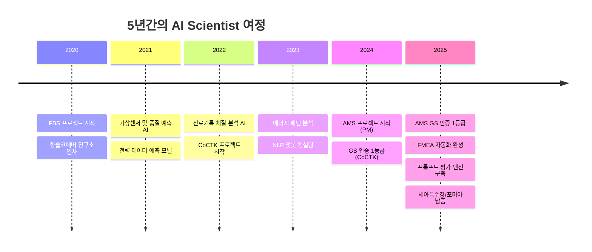
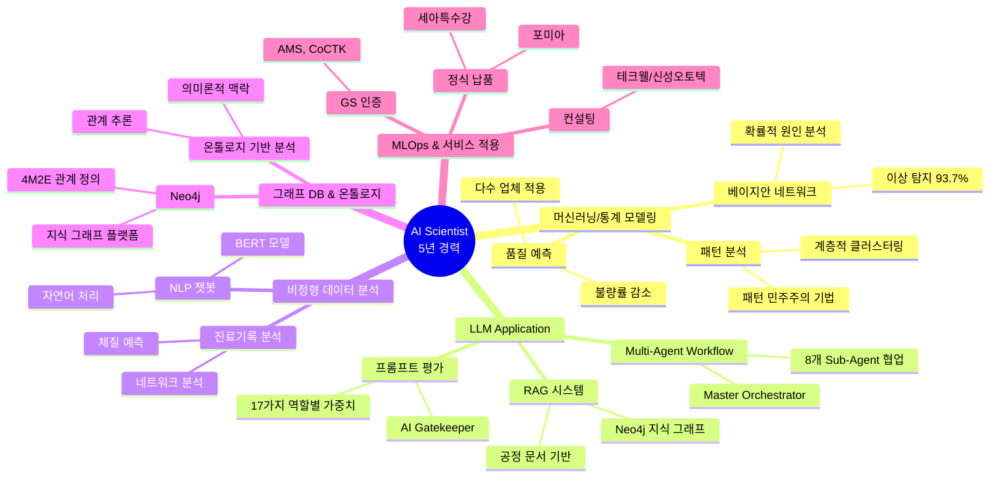
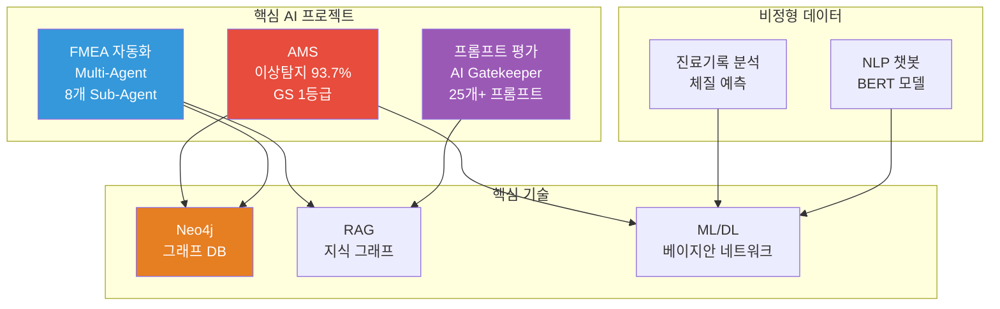
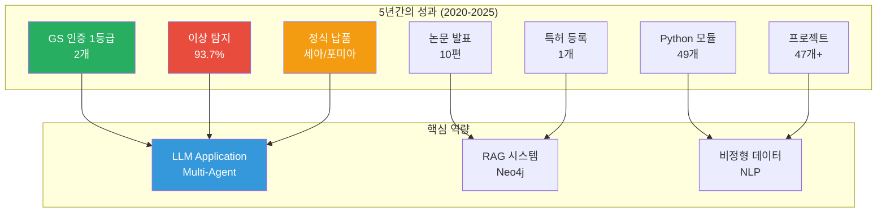

# 권순룡 이력서

## 기본 정보

**이름**: 권순룡  
**현 소속**: 한솔코에버 연구소 대리 (2020.09 ~ 재직중)  
**총 경력**: 5년 (2020~2025)  
**핵심 역량**: 머신러닝/통계 모델링, LLM Application 개발, RAG 기반 AI 서비스, 이상탐지 및 패턴 분석, 비정형 데이터 분석, Neo4j 그래프 DB, MLOps

---

## 한눈에 보는 경력 (2020-2025)

---

## 지원 동기

5년간 정형·비정형 데이터 기반 머신러닝/딥러닝 모델을 설계하고 개발하며, LLM을 활용한 업무 자동화 및 지능화 Use Case를 구현하는 과정에서 다양한 경험을 쌓았습니다. 특히 AMS 프로젝트에서 베이지안 네트워크 기반 이상 탐지 모델을 개발하여 93.7% 정확도를 달성했으며, FMEA 자동화 생성 시스템에서 Claude Sub-Agent 기반 Multi-Agent Workflow를 구축하여 복잡한 업무 프로세스를 자동화했습니다.

삼화회계법인 AI Scientist 포지션의 "정형·비정형 데이터 기반 머신러닝/딥러닝 모델 설계 및 개발", "LLM을 활용한 업무 자동화 및 지능화 Use Case 설계", "RAG 기반 AI 서비스 아키텍처 설계" 업무는 제가 수행한 프로젝트들과 직접적으로 연결됩니다. 특히 Neo4j 그래프 DB를 활용한 지식 그래프 RAG 시스템 구축 경험, 8개 독립 Sub-Agent 협업 구조 설계 경험, 비정형 데이터(진료기록, 계약서 등) 분석 경험이 회계법인의 복잡한 문서 처리 및 자동화 업무에 기여할 수 있습니다.

규제·컴플라이언스 환경에서의 AI 적용 경험(GS 인증 1등급 2개, 특허 등록)과 MLOps 실무 경험(세아특수강, 포미아 정식 납품)을 바탕으로, 삼화회계법인에서 안전하고 신뢰할 수 있는 AI 솔루션을 구축하고 싶습니다.

---

## 핵심 역량 맵

---

## 핵심 역량

### 머신러닝/통계 모델링 실무 경험

5년간 다양한 도메인에서 머신러닝 및 통계 모델링을 수행했습니다. AMS 프로젝트에서 베이지안 네트워크 기반 이상 탐지 모델을 개발하여 93.7% 정확도를 달성했으며, 패턴 민주주의(Pattern Voting) 기법을 고안하여 여러 알고리즘의 앙상블로 최종 판정을 내리는 시스템을 구축했습니다. 다수 업체(사출, 도정, 금형 등)에서 품질 예측 AI 엔진을 개발하여 불량률 감소 성과를 달성했습니다.

### LLM Application 개발 및 RAG 기반 AI 서비스

Claude Sub-Agent 기반 Multi-Agent Workflow를 구축하여 FMEA 자동화 생성 시스템을 개발했습니다. 8개 독립 Sub-Agent가 협업하는 구조를 설계하고, Master Orchestrator를 통해 전체 프로세스를 자동화했습니다. Neo4j 그래프 DB를 활용한 지식 그래프 RAG 시스템을 구축하여 공정 관리 문서 기반 FMEA 자동 생성 기술을 검증했습니다. 또한 프롬프트 평가 엔진을 개발하여 AI Gatekeeper 역할을 수행하며, 25개+ 프롬프트의 품질을 승인/반려하는 시스템을 구축했습니다.

### 이상탐지, 리스크 스코어링, 패턴 분석

베이지안 네트워크 기반 이상 탐지 모델을 개발하여 93.7% 정확도를 달성했습니다. 패턴 민주주의(Pattern Voting) 기법을 통해 FBS(인과관계), RMS(통계적 범위), PDS(시계열 패턴) 3개 엔진의 가중치 합산으로 최종 안심/주의/경보 판정을 내리는 시스템을 구축했습니다. 계층적 클러스터링(Hierarchical Clustering)을 도입하여 설비 상태 데이터 패턴을 분석하고, 에너지 효율화 기반을 구축했습니다.

### 비정형 데이터 분석

진료기록 비정형 텍스트를 0/1 바이너리 테이블로 변환하여 네트워크 분석 및 체질 예측을 수행했습니다. 단순 워드클라우드의 한계를 극복하고 구조화된 데이터로 변환하여 분석 정확도를 향상시켰습니다. 코아아이티 NLP 챗봇 컨설팅에서 BERT, DistilBERT 모델을 활용한 자연어 처리 파이프라인을 구축하고, 한약재/건강식품 데이터 분석 및 공정 데이터 자연어 처리를 수행했습니다.

### 온톨로지 및 그래프 데이터베이스 활용

Neo4j 그래프 DB를 활용하여 4M2E 관계를 정의하고 지식 그래프 플랫폼을 구축했습니다. DPS 프로젝트에서 온톨로지 기반 관계 분석을 수행했으며, AMS 프로젝트에서 확률 최적화 결과를 분석 온톨로지 형태로 통합하여 이질적인 데이터 소스를 유기적으로 연결했습니다. 온톨로지 기반 접근 방식으로 인더스트리 4.0의 이점을 활용하는 지능적이고 적응적인 시스템을 구축했습니다.

---

## 프로젝트 관계도

---

## 경력 개요

### 한솔코에버 연구소 (2020.09 ~ 재직중)
**직급**: 대리  
**주요 업무**:
- AI 모델 설계 및 개발 (머신러닝/딥러닝)
- LLM 기반 업무 자동화 시스템 구축
- 데이터 분석 플랫폼 개발 및 PM
- 프로젝트 총괄 관리

**성과**:
- GS 인증 1등급 2개 (AMS, CoCTK)
- 특허 등록
- 논문 발표 10편
- 정식 납품: 세아특수강, 포미아

---

## 주요 프로젝트 경험

### 1. AMS (Analysis Management System) - 총괄 PM

**기간**: 2024.07 ~ 2025.03  
**발주처**: 한국산업기술진흥원  
**역할**: 총괄 PM

**핵심 성과**:
- ✅ **베이지안 네트워크 기반 이상 탐지 모델 개발**: 이상탐지율 93.7% 달성, 실질적 정확도 60~70%로 투명하게 공개
- ✅ **Neo4j 그래프 DB 활용**: 4M2E 관계 정의, 지식 그래프 플랫폼 구축
- ✅ **GS 인증 1등급 (PDS 명칭)**: 특허 등록, 논문 발표 (2025, 2024)
- ✅ **정식 납품**: 세아특수강, 포미아 DX 실증센터 구축 (PM)
- ✅ **MLOps 실무 경험**: 테크웰/신성오토텍 AMS 컨설팅, PoC → Pilot → 운영 전환 수행

**기술 스택**: Python, Neo4j, pandas, numpy, scikit-learn, pgmpy

---

### 2. FMEA 자동화 생성 시스템 (Claude Sub-Agent) - Master Orchestrator 설계

**기간**: 2025.06 ~  
**역할**: Master Orchestrator 설계

**핵심 성과**:
- ✅ **Claude Sub-Agent 기반 Multi-Agent Workflow**: 8개 독립 Sub-Agent 협업 구조 (R&D, Mfg, QA)
- ✅ **코딩 에이전트 역설계 시스템 구조 적용**: 복잡한 FMEA 프로세스를 역으로 분석하여 Sub-Agent로 분해
- ✅ **Neo4j 기반 지식 그래프 RAG**: 공정 관리 문서 기반 FMEA 자동 생성
- ✅ **AIAG & VDA FMEA 표준 기반**: 범용 리스크 분석 시스템
- ✅ **논문 발표 (2025)**: 상관/확률 네트워크 최적 경로 정보 기반 FMEA 생성 연구

**기술 스택**: Claude, LLM, RAG, Neo4j, Multi-Agent Architecture

---

### 3. 프롬프트 평가 엔진 (Claude Sub-Agent) - AI Gatekeeper

**기간**: 2025.06 ~  
**역할**: AI Gatekeeper 설계

**핵심 성과**:
- ✅ **전체 프롬프트 전수 평가 시스템**: 25개+ 프롬프트의 품질을 승인/반려하는 완전 자동화 시스템
- ✅ **3가지 핵심 차원 평가**: Quality, Consistency, Cost
- ✅ **17가지 역할별 동적 가중치 시스템**: 각 역할에 맞는 최적화된 평가
- ✅ **병렬 처리 구조**: 4개 메트릭 동시 평가로 효율성 극대화
- ✅ **AI 생성 프롬프트를 다른 AI가 평가**: 이중 검증(Double-Check) 시스템으로 환각 방지

**기술 스택**: Claude, LLM, Evaluation Framework, 병렬 처리

---

### 4. 진료기록 체질 분석 시스템 - AI 엔진 개발

**기간**: 2022.06 ~ 2022.10  
**발주처**: 한국데이터산업진흥원  
**역할**: AI 엔진 개발

**핵심 성과**:
- ✅ **비정형 텍스트를 구조화된 데이터로 변환**: 진료기록 비정형 텍스트를 0/1 바이너리 테이블로 변환
- ✅ **네트워크 분석 및 체질 예측**: 단순 워드클라우드 한계 극복
- ✅ **헬스케어 AI 적용**: 한의원 진료 기록 기반 체질 예측 AI 시스템 개발

**기술 스택**: Python, ML, Network Analysis, NLP

---

### 5. 코아아이티 자연어 처리 & 챗봇 컨설팅 - NLP 컨설팅

**기간**: 2023.04 ~ 2023.12  
**발주처**: 충북과학기술원 주관 산업 디지털 전환 지원체계 구축사업  
**역할**: NLP 컨설팅

**핵심 성과**:
- ✅ **BERT 기반 자연어 처리 모델 생성**: BertForSequenceClassification, DistilBERT 등 다양한 모델 실험
- ✅ **한약재/건강식품 데이터 분석**: 자연어처리 파이프라인 구축, 효과 및 주의사항 정보 구조화
- ✅ **공정 데이터 자연어 처리**: 공정 기능 추출, 토큰화, 벡터화, DistilBERT 모델 적용

**기술 스택**: BERT, DistilBERT, NLP, Python

---

### 6. CoCTK (Consulting Tool Kit) - 총괄 PM

**기간**: 2022.03 ~ 2024  
**발주처**: 중소기업기술정보진흥원  
**역할**: 엔진 총괄 설계 및 화면설계 개발 총괄 PM

**핵심 성과**:
- ✅ **GS 1등급 취득 (2024)**: 데이터 전처리, 상관관계 분석, 비용 최적화 엔진 개발
- ✅ **논문 발표 (2023)**: 생산공정 에너지 및 설비 상태 데이터 패턴 분석
- ✅ **규제·컴플라이언스 환경 경험**: GS 인증 프로세스 수행

**기술 스택**: Python, pandas, numpy, scikit-learn

---

### 7. 생산공정 에너지 및 설비 상태 데이터 패턴 분석 - 메인 수행

**기간**: 2023  
**역할**: 메인 수행 (초기 백엔드 개발 → 풀스택 개발 및 총괄 PM으로 확장)

**핵심 성과**:
- ✅ **계층적 클러스터링(Hierarchical Clustering) 도입**: 설비 상태 데이터 패턴 분석
- ✅ **패턴 민주주의(Pattern Voting) 기법 고안**: AMS의 핵심 알고리즘 모체
- ✅ **라벨링 시스템**: 에너지 효율화 기반 구축

**기술 스택**: Python, ML, Clustering, Pattern Analysis

---

### 8. 공정 불량 예측 - AI 엔진 개발

**기간**: 2023.04 ~ 2023.10  
**발주처**: 정보통신산업진흥원  
**역할**: AI 엔진 개발

**핵심 성과**:
- ✅ **공정 불량 예측 AI 엔진 개발**: 압축기 공정에서 데이터 밸런스 문제 해결
- ✅ **품질 결과 사전 예측**: AI 시스템으로 불량 사전 예측

**기술 스택**: Python, ML, Data Balancing

---

## 기술 스택

### Programming Languages
- **Python**: 5년 (데이터 분석, ML/DL, 파이프라인 구축)
  - 49개 모듈 개발 (MLS, CoCTK, FBS, RMS, AMS)
  - pandas, numpy, scikit-learn 활용

### Machine Learning & Deep Learning
- **머신러닝/통계 모델링**: 5년 실무 경험
  - 베이지안 네트워크 (pgmpy)
  - 패턴 분석, 클러스터링
  - 품질 예측, 이상탐지
- **딥러닝**: 프로젝트 적용 경험
  - BERT, DistilBERT (NLP)
  - 자연어 처리 모델

### LLM & AI Agents
- **LLM Application**: 2년 개발 경험
  - Claude Sub-Agent 기반 Multi-Agent Workflow
  - 프롬프트 평가 엔진 (AI Gatekeeper)
  - Virtual Company Creation Agent
- **RAG & Embedding**: Neo4j 기반 지식 그래프 RAG
  - 공정 관리 문서 기반 FMEA 생성
  - Vector DB 활용

### Databases & Data Processing
- **Neo4j**: 그래프 데이터베이스
  - 4M2E 관계 정의
  - 온톨로지 기반 관계 분석
  - 지식 그래프 플랫폼
- **MSSQL Server, PostgreSQL**: 대규모 데이터 가공 및 분석

### MLOps & Service Deployment
- **정식 납품**: 세아특수강, 포미아
- **컨설팅**: 테크웰/신성오토텍 AMS 컨설팅
- **PoC → Pilot → 운영 전환**: 실제 업무 적용 경험

---

## 성과 대시보드

### 인증 및 특허
- **GS 인증 1등급 2개**: AMS (PDS 명칭), CoCTK
- **특허 등록**: 피쉬본 관리 시스템 등

### 정식 납품
- **세아특수강**: AMS 플랫폼 정식 납품
- **포미아 (포항소재산업진흥원)**: DX 실증센터 구축 (PM)

### 학술 성과
- **논문 발표 10편**: 2020-2025년 지속적 연구 활동
- **최신 논문**: FMEA 생성 연구 (2025.12), 구조-확률 종합 네트워크 (2025.06)

---

## 학력

**홍익대학교 전자공학과** (2013.03 ~ 2020.02)
- 학점: 3.11 / 4.5
- 졸업논문: LD 동격회로 설계 및 PLL 설계
- 주요 수강 분야: 회로 설계, 전파공학, 컴퓨터공학

---

## 자격증

**OPIc** (2019.03)
- ACT FL (American Council on the Teaching of Foreign Languages)

---

## 핵심 철학

> **"모델보다 데이터, 데이터보다 정보, 지식구조를 정리하는 현장친화적 연구원"**

5년간의 현장 경험을 통해 데이터를 정보로 전환하고, 정보를 지식 구조로 체계화하는 전문성을 갖추었습니다. 단순한 모델 개발을 넘어, 현장의 실제 문제를 해결하고 지식 기반 시스템을 구축하는 데 집중합니다.

---

© 2026 권순룡. All Rights Reserved.
